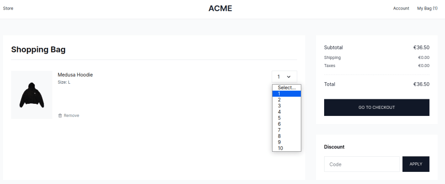
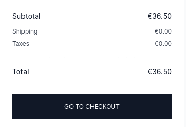
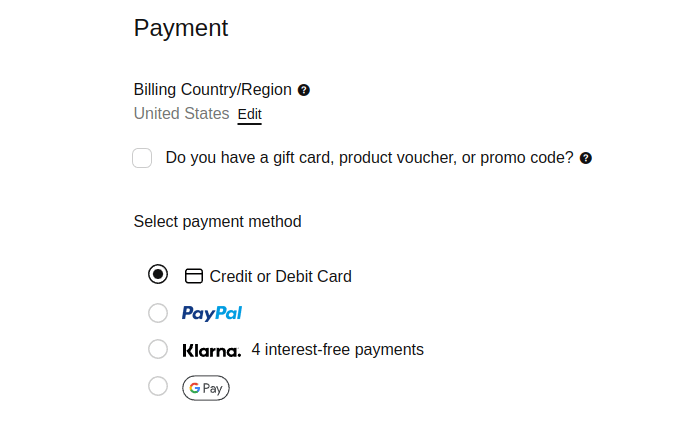
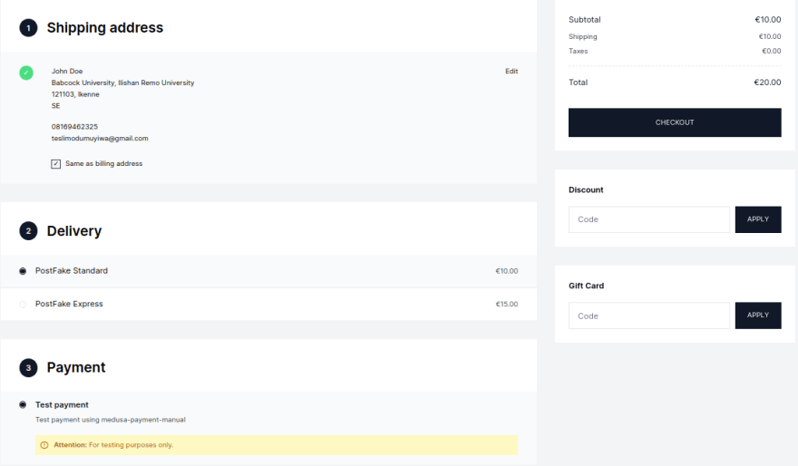

Функциональность корзины в электронной коммерции очень важна для успеха интернет-магазина, поскольку с ее помощью клиенты взаимодействуют с магазином и совершают покупки. Правильно спроектированная корзина может сделать процесс покупки простым, интуитивно понятным и приятным, в то время как плохо спроектированная корзина может разочаровать покупателей и привести к отказу от покупок.

Корзина электронной коммерции играет несколько важных ролей в процессе онлайн-покупок, например, позволяет клиентам управлять товарами в корзине, отображать всю информацию об итогах и многое другое.

В этой статье описаны важнейшие аспекты, которые необходимо учитывать для создания успешной корзины электронной коммерции, удовлетворяющей как потребности пользователей, так и технические требования.

Что такое Medusa? Medusa - это набор строительных блоков для электронной коммерции с открытым исходным кодом, цель которого - обеспечить гибкость в работе разработчиков. Разработчики и бизнесмены имеют полную свободу в том, как они формируют свое приложение для электронной коммерции, включая то, как они могут реализовать корзину. Узнайте, как начать работу с Medusa, из документации.

## Опыт использования корзины

Знаете ли вы, что средний показатель отказа от корзины составляет 69,82 %? На этом путешествие не заканчивается, несмотря на то, что покупатель нажимает кнопку ”Добавить в корзину” на странице вашего товара. После того как покупатель помещает товар в корзину, возникает несколько новых проблем.

Помните, что заставить потенциального покупателя добавить товар в корзину - это только отправная точка. Это возможность превратить его в продажу. Одним из ключевых факторов в достижении этой цели является пользовательский опыт вашей платформы электронной коммерции.

## Позволяет пользователям добавлять, удалять и просматривать товары в корзине

Покупатели должны чувствовать себя хозяевами положения, поэтому предоставьте им возможность легко удалять товары из корзины. При этом вы можете включить всплывающее окно подтверждения, чтобы убедиться, что действие было совершено намеренно.

Упростите для покупателей возможность редактировать товары в корзине. Например, предусмотрите возможность корректировки количества с помощью кнопок ”+” или ”-”, выпадающего меню или поля для ручного ввода. Как показано на примере витрины магазина Medusa Next.js ниже:



Убедитесь, что все изменения, внесенные в корзину, отражены в изображении и информации о товаре. Цель - удержать покупателя на странице корзины и сделать процесс покупки беспрепятственным. Избегайте перенаправления покупателей обратно на страницу товара для внесения изменений. Процесс покупки должен быть постепенным.

## Будьте откровенны о расходах

Чтобы не потерять клиентов, убедитесь, что цены на страницах корзины ясны и понятны. Скрытые сборы или неожиданные расходы могут заставить покупателей почувствовать себя обманутыми и оттолкнуть их от завершения покупки.

Согласно исследованию Института Баймарда, 55 % покупателей называют дополнительные расходы основной причиной, по которой они покидают корзину. Чтобы предотвратить это, четко отображайте налоги и стоимость доставки в отдельной строке, вместе с промежуточным итогом и общей стоимостью корзины.

Если эти расходы зависят от местоположения, подумайте о добавлении на страницу калькулятора налогов, доставки и коэффициента конверсии, чтобы покупатели могли видеть стоимость до оформления заказа. Отличным примером является пример витрины магазина Medusa, представленный ниже, который показывает промежуточный итог, стоимость доставки и налога, а также общую стоимость.



## Не заставляйте покупателей создавать учетные записи

Многие покупатели отказываются от своих корзин, потому что создание учетной записи на сайте может потребовать времени и усилий. На самом деле, 34 % людей, принявших участие в опросе, проведенном Институтом Баймарда, назвали эту причину отказа от покупки. Чтобы предотвратить это, предложите опцию ”гостевого оформления”, которая позволит покупателям совершать покупки без создания учетной записи. Таким образом, покупатели смогут легко и без лишних хлопот завершить покупку, даже если они планируют приобрести что-то только один раз.

## Предлагайте разные способы оплаты

Предоставление покупателям множества вариантов оплаты повышает вероятность того, что они завершат покупку. Если вы не предлагаете на своем сайте предпочтительный для клиента способ оплаты, это может оттолкнуть его от завершения покупки. Предложение ограниченного числа вариантов оплаты может ограничить выбор покупателя и снизить вероятность продажи. Вы можете начать с самых популярных способов оплаты, таких как кредитные и дебетовые карты, PayPal и Google Pay, а затем расширить их.



Источник: Nike Checkout

## Упростите процесс оформления заказа

Консолидация всего на одной странице может улучшить качество обслуживания клиентов и увеличить продажи, избавив их от необходимости делать несколько кликов и гадать о стоимости доставки или создании учетной записи. Клиенты могут видеть всю необходимую информацию на одной странице, включая обработку платежей, детали доставки и информацию о заказе.



## Сделайте покупку на мобильном телефоне простой

Многие люди совершают покупки в Интернете с помощью телефонов. Вы можете потерять продажи, если ваш процесс оформления заказа не будет удобным для использования на телефоне. Убедитесь, что ваша страница оформления заказа настроена для мобильных пользователей, чтобы они могли легко завершить покупку.

## Восстановление брошенных корзин

Существует несколько способов вернуть брошенные корзины, включая отправку писем с напоминаниями, предложение поощрений и отображение брошенных товаров при следующем посещении сайта. Эти способы могут напомнить покупателям об оставленных в корзине товарах и побудить их завершить покупку.

Предложение специальных скидок или акций за завершение покупки также может быть эффективным. Еще одна стратегия - отслеживать поведение покупателей, например, какие товары часто оставляются, и решать проблемы, которые могут быть причиной отказа от корзины.

С технической точки зрения можно реализовать задание cron, которое проверяет наличие вновь созданных корзин, а если корзина старше определенного времени, то отправляет электронное письмо, напоминающее клиенту о его корзине и побуждающее его завершить покупку.

В целом, восстановление брошенных корзин является важным аспектом электронной коммерции и может привести к значительному увеличению продаж и доходов.

## Технические соображения по тележке

При создании и управлении интернет-магазином необходимо учитывать такие важные моменты, как обеспечение безопасности данных клиентов, хранение информации, производительность сайта и обновление в режиме реального времени.

## Безопасность

Обеспечение безопасности информации о клиентах имеет первостепенное значение для сайта электронной коммерции. Выбирая решение для корзины покупок, обратите внимание на наличие сертификатов и мер по обеспечению соответствия, которые защитят ваших клиентов от кражи личных данных и информации.

Инвестиции в решение для корзины покупок с надежными средствами защиты имеют решающее значение для сохранения доверия ваших клиентов. Еще одной важной составляющей является обеспечение безопасности информации ваших клиентов и соблюдение законов, защищающих их данные. Например, компании, работающие в ЕС, должны соблюдать Общий регламент по защите данных (GDPR). В США обязательными нормами являются Закон о переносимости и подотчетности медицинского страхования (HIPAA).

Эти нормы предусматривают строгие требования к обработке и защите конфиденциальной информации о клиентах.

## Сеансы, файлы cookie и локальное хранилище

Хранение товаров в корзине между посещениями очень важно для сайта электронной коммерции. Один из способов добиться этого - использовать сессии, куки и локальное хранилище. И то, и другое используется для хранения информации о корзине покупателя в его браузере.

Сессии сохраняются на компьютере сайта и длятся только до тех пор, пока в браузере открыта вкладка клиента. Другая сессия создается, если клиент открывает другую вкладку того же сайта. Как только клиент закрывает вкладку, сессия уничтожается. Cookies сохраняются на компьютере клиента и могут действовать, даже если клиент закрывает вкладку или браузер. Локальное хранилище - это тип веб-хранилища, позволяющий веб-приложениям хранить данные на стороне клиента (т. е. в веб-браузере пользователя) и получать к ним доступ без истечения срока действия.

Это позволяет покупателям легко продолжить начатое и завершить покупку. Использование одного из этих вариантов обеспечивает покупателям удобство и комфорт при совершении покупок.

Примером использования локального хранилища является хранение идентификатора корзины в локальном хранилище. Идентификатор корзины извлекается с сервера и сохраняется в локальном хранилище браузера.

```javascript
// Generate a unique cart ID
var cartId = '<value>';
// Store the cart ID in local storage
localStorage.setItem('cartId', cartId);
```

This code retrieves the cart information by retrieving the cartID stored in the local storage and then sends the cartID to make a request to the server, which fetches the cart details.

Этот код извлекает информацию о корзине, получая cartID, хранящийся в локальном хранилище, а затем отправляет cartID для запроса на сервер, который извлекает данные о корзине.

```javascript
const cartId = localStorage.getItem('cartId');
if (cartId) {
	fetch(`/cart?cartId=${cartId}`, {
		method: 'GET',
		headers: { 'Content-Type': 'application/json' },
	})
		.then((response) => response.json())
		.then(({ cart }) => {
			//display cart details
		});
}
```

Приведенная выше реализация показывает, как можно использовать куки и локальное хранилище для управления корзиной. Идентификатор корзины хранится локально, чтобы клиент мог получить информацию о корзине с сервера.

## Обновление цен в режиме реального времени

Обновление корзины и общей цены в режиме реального времени по мере того, как пользователь вносит изменения, возможно с помощью слушателей событий JavaScript. Например, когда пользователь нажимает на кнопку ”Добавить в корзину”, код JavaScript обновляет объект корзины и перерисовывает пользовательский интерфейс корзины, чтобы отразить изменения.

Аналогично, когда пользователь изменяет количество товара или удаляет товар из корзины, код JavaScript обновляет объект корзины и пересчитывает общую цену. Это можно сделать, назначив слушателей событий для кнопок ”добавить в корзину”, ”удалить из корзины” и "изменить количество".

Кроме того, общая цена, отображаемая на странице, должна быть обновлена, чтобы отразить изменения. Это лишь базовый пример, вам могут потребоваться дополнительные шаги для решения таких ситуаций, как попытка добавить товар, который еще недоступен, или добавление одного и того же товара несколько раз.

При этом необходимо учитывать производительность сайта, так как пересчет общей цены при каждом изменении может негативно сказаться на производительности. Вот пример того, как можно реализовать обновление корзины и общей цены в реальном времени с помощью JavaScript:

Примечание: Данная реализация ориентирована исключительно на хранение информации о корзине на стороне клиента. В реальном сценарии потребуется связь с сервером, чтобы обеспечить обновление и точность информации о корзине.

```javascript
// Assign event listeners to the add to cart, remove from cart, and quantity change buttons
document.getElementById('add-to-cart-button').addEventListener('click', addToCart);
document.getElementById('remove-from-cart-button').addEventListener('click', removeFromCart);
document.getElementById('quantity-change-button').addEventListener('change', updateQuantity);

// Cart object to store the items in the cart
let cart = {};

// Function to add an item to the cart
function addToCart() {
	// Get item details from the page
	let item = {
		id: document.getElementById('item-id').value,
		name: document.getElementById('item-name').value,
		price: document.getElementById('item-price').value,
	};

	// Call the calculate total price function
	calculateTotalPrice();

	// Add the item to the cart object
	cart[item.id] = item;

	// Re-render the cart UI to reflect the change
	renderCart();
}

// Function to remove an item from the cart
function removeFromCart() {
	// Get the id of the item to be removed
	let itemId = document.getElementById('item-id-to-remove').value;

	// Remove the item from the cart object
	delete cart[itemId];

	// Re-render the cart UI to reflect the change
	renderCart();

	// Call the calculate total price function
	calculateTotalPrice();
}

// Function to update the quantity of an item in the cart
function updateQuantity() {
	// Get the id of the item and the new quantity
	let itemId = document.getElementById('item-id-to-update').value;
	let newQuantity = document.getElementById('new-quantity').value;

	// Update the quantity in the cart object
	cart[itemId].quantity = newQuantity;

	// Re-calculate the total price
	let totalPrice = calculateTotalPrice();

	// Update the total price displayed on the page
	document.getElementById('total-price').innerHTML = totalPrice;
}

// Function to calculate the total price of the items in the cart
function calculateTotalPrice() {
	let totalPrice = 0;
	for (let itemId in cart) {
		totalPrice += cart[itemId].price * cart[itemId].quantity;
	}
	return totalPrice;
}

// Function to render the cart UI
function renderCart() {
	// Clear the existing cart UI
	document.getElementById('cart').innerHTML = '';

	// Iterate through the items in the cart and render them
	for (let itemId in cart) {
		let item = cart[itemId];
		let itemElement = document.createElement('div');
		itemElement.innerHTML = `<p>${item.name} - ${item.price} x ${item.quantity}`;
		document.getElementById('cart').appendChild(itemElement);
	}
}
```

Работа с отсутствующими на складе товарами и обновление инвентаря

При управлении интернет-магазином важно иметь план действий на случай отсутствия товара на складе или изменения инвентаризации. Хорошим способом решения проблемы отсутствия товара на складе является предложение сопутствующих или запасных товаров, например, ”Извините, Nike Air Force 1 нет в наличии, но у нас есть Nike Air Force 2”.

Другой вариант - показать сообщение о том, когда товар снова появится на складе, и предложить покупателям подписаться на почтовое уведомление, чтобы узнать, когда товар будет доступен.

Вы также можете позволить покупателям делать обратный заказ и отправлять товары, когда они появятся в наличии. Используйте программное обеспечение для инвентаризации, чтобы отслеживать запасы и обновлять веб-сайт в режиме реального времени. Кроме того, сообщайте покупателям, когда интересующий их товар снова появится на складе, по электронной почте или с помощью уведомления.

Ограничьте количество товаров, которые может приобрести покупатель, доступным запасом и четко информируйте покупателей о состоянии товара, чтобы они могли принимать взвешенные решения.

## Заключение

В этой статье мы рассмотрим основные функции корзины электронной коммерции с точки зрения пользователя и техники, включая отзывчивость на мобильных устройствах, доступ к различным способам оплаты, предоставление гостевых аккаунтов новым покупателям, обработку отсутствующих на складе товаров, обновление цен в режиме реального времени и сохранение информации о корзине в файлах cookie.

Узнайте больше о том, как создать отличный интернет-магазин с помощью краткого руководства Medusa здесь.

В документации также представлены два важных руководства, связанных с тележками:

По всем вопросам и для получения поддержки вы можете связаться с командой Medusa через Discord.
