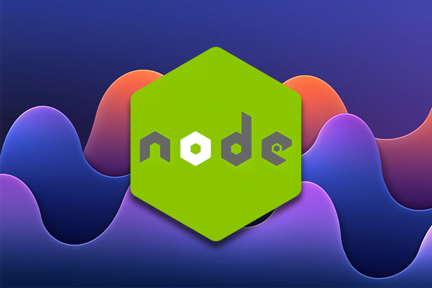
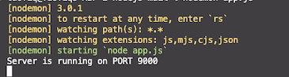
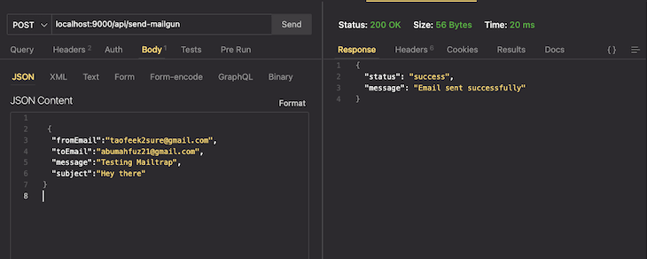
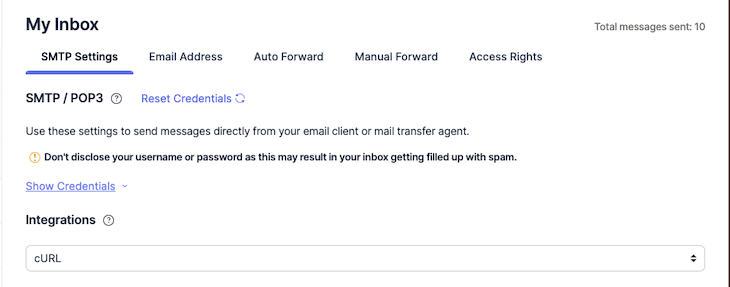
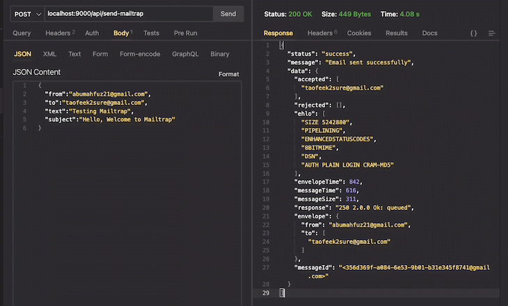
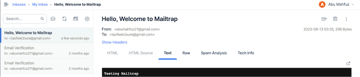
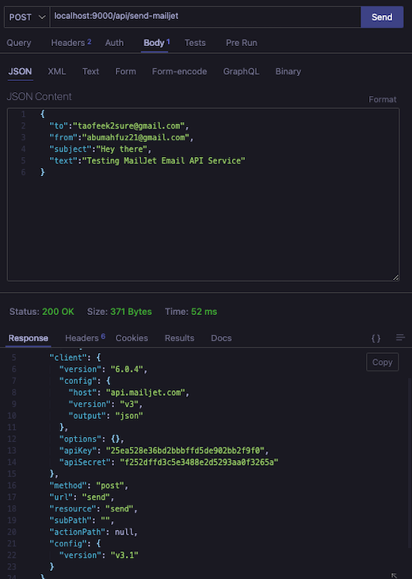

Интеграция функциональности электронной почты в ваше приложение на Node.js поможет вам автоматизировать и настроить коммуникацию с пользователями. Будь то проверка учетной записи, сброс пароля или персонализированные уведомления, возможность программной отправки электронных писем крайне важна для современного веб-приложения.



Использование почтового API в Node.js упрощает настройку, интеграцию, настройку и масштабирование вашей почтовой функциональности. В этой статье мы рассмотрим, как отправлять электронные письма в Node.js с помощью трех различных почтовых API - Mailgun, MailTrap и Mailjet.

Вы можете ознакомиться с исходным кодом демонстрационных примеров в этой статье [в моем репозитории GitHub](https://github.com/Taofiqq/nodejs-mail).

Если вас интересуют другие варианты, кроме почтовых API, для программной отправки писем в Node.js, ознакомьтесь с нашими руководствами по [использованию Nodemailer Simple Mail Transfer Protocol (SMTP)](https://blog.logrocket.com/send-emails-nodejs-nodemailer/) или [SendGrid, стороннему почтовому SaaS](https://blog.logrocket.com/how-to-send-emails-with-node-js-using-sendgrid/). В противном случае давайте сразу перейдем к делу.

## Зачем использовать почтовый API для отправки писем в Node.js?

Использование почтового API для отправки писем в Node.js позволяет абстрагироваться от сложностей традиционного способа отправки писем, таких как настройка почтового сервера. Это позволяет разработчикам сосредоточиться на основной части разработки вместо того, чтобы заниматься разработкой, связанной с электронной почтой.

Интеграция почтового API в кодовую базу Node.js также помогает улучшить многократное использование кода, позволяя использовать одну и ту же конфигурацию почтового кода в разных частях кодовой базы.

Кроме того, почтовые API хорошо оптимизированы и имеют хорошие показатели доставки. Отправка писем с помощью этого метода позволяет снизить вероятность их попадания в папки со спамом.

API электронной почты предлагают такие функции, как аналитика и отслеживание, позволяя разработчикам отслеживать доставку писем, количество кликов, количество открытий и другие полезные данные. Они также рассчитаны на эффективную обработку больших объемов электронной почты, что делает их подходящими для email-маркетинга или операций любого масштаба.

Несмотря на все преимущества использования почтовых API для отправки писем в Node.js, есть и несколько соображений, о которых следует помнить.

Во-первых, отправка большого количества писем может повлечь за собой большие расходы, что может стать недостатком, если вы работаете над крупным проектом.

Во-вторых, при использовании внешнего почтового API-сервиса вы должны полагаться на время работы и производительность этого сервиса. От этого зависит, будет ли доставлено ваше письмо или нет, поэтому всегда используйте стабильные почтовые API.

И наконец, существует ограничение на то, как сильно вы можете настроить содержимое своего письма, по сравнению с тем, если бы вы настраивали свой почтовый сервер самостоятельно.

Учитывая все вышесказанное, давайте рассмотрим, как мы можем использовать 3 различных почтовых API для отправки писем в нашем проекте Node.js.

## Настройка среды разработки Node.js

Чтобы начать, откройте терминал и создайте новую папку с помощью следующей команды:

```bash
mkdir nodejs\-mail
```

Это создаст новую папку под названием `nodejs-mail`. Затем выполните команду `npm init- y`, чтобы запустить ваш проект.

Далее установим зависимости, необходимые для нашего проекта, с помощью команды ниже:

```bash
npm i express dotenv body\-parser nodemon
```

`dotenv` - это пакет npm, который позволяет управлять и загружать переменные окружения, чтобы такие конфиденциальные данные, как `apikey` и `ecretkey`, были отделены от основной кодовой базы.

`nodemon` - пакет, который помогает [автоматически перезапускать сервер](https://blog.logrocket.com/nodemon-tutorial-automatically-restart-node-js-apps-with-nodemon/) во время разработки. Это позволяет нам избежать перезапуска сервера каждый раз, когда мы вносим изменения в кодовую базу.

`body-parser` служит промежуточным программным обеспечением, которое разбирает данные, отправленные в теле запроса.

## Настройка структуры папок

В этом руководстве мы создадим две папки: `controllers` и `services`. Также нам нужно создать файл `app.js`, в котором мы инициализируем сервер и настроим маршрут для вызова API электронной почты. И наконец, создайте файл `.env`, в котором будут храниться секретные ключи.

В файле `app.js` мы можем запустить сервер на определенном порту:

```js
require('dotenv').config();
const express = require('express');

const bodyParser = require('body-parser');

const app = express();

const port = process.env.PORT;

app.use(bodyParser.json());

app.listen(port, () => {
	console.log(`Server is running on PORT ${port}`);
});
```

Здесь мы, по сути, настраиваем экспресс-сервер и запускаем его на порту 9000. Номер порта был установлен в файле `.env` на `9000`, и мы используем пакет `dotenv` для загрузки переменной.

Теперь выполните следующую команду:

```bash
nodemon app.js
```

Вы должны увидеть сообщение, как показано ниже:



Теперь, когда среда разработки и структура папок настроены должным образом, мы можем начать работу с выбранным нами почтовым API. В следующих разделах мы рассмотрим, как работать с тремя различными вариантами почтовых API, упомянутыми выше: Mailgun, MailTrap и Mailjet.

## Использование API Mailgun для отправки электронной почты в Node.js

Mailgun - это популярный почтовый сервис, который предоставляет API для отправки и получения электронных писем. Давайте рассмотрим, как мы можем отправлять письма в Node.js с помощью API Mailgun.

Сначала мы установим зависимости, необходимые для настройки нашей почтовой функциональности, используя эту команду:

```bash
npm i mailgun.js form-data
```

В папке `services, которую мы создали ранее, создайте новый файл под названием `mailgunServices.js`. Скопируйте следующий код в этот новый файл:

```js
const formData = require('form-data');
const Mailgun = require('mailgun.js');

const mailgun = new Mailgun(formData);

const mg = mailgun.client({
	username: 'api',
	key: process.env.MAILGUN_API_KEY,
});

exports.sendMail = (req, res) => {
	const { toEmail, fromEmail, subject, message } = req.body;

	mg.messages.create(process.env.MAILGUN_DOMAIN, {
		from: fromEmail,
		to: [toEmail],
		subject: subject,
		text: message,
	});
};
```

Здесь мы инициализируем экземпляр клиента Mailgun и передаем ему `MAILGUN_API_KEY`. Затем мы определили функцию `sendMail для обработки отправки писем с помощью библиотеки `mailgun-js`.

Далее в папке `controllers` мы создадим файл под названием `mailgunController.js`. В этот файл добавьте следующий код:

```js
const { Router } = require('express');

const router = Router();

const mailgunService = require('../services/mailgunService');

router.post('/send-mailgun', async (req, res) => {
	try {
		const response = await mailgunService.sendMail(req, res);
		res.status(200).json({
			status: 'success',
			message: 'Email sent successfully',
			data: response,
		});
	} catch (error) {
		res.status(400).json({
			status: 'error',
			message: 'Email not sent',
		});
	}
});

module.exports = router;
```

Внутри файла `mailgunController.js` мы создали экземпляр маршрутизатора `express` и присвоили его переменной `router`.

Затем мы определили маршрут, который прослушивает POST-запрос, отправленный по пути `/send-mailgun`, или конечной точке, вместе с блоком `try...catch` для отлова любых ошибок, возникающих в процессе отправки электронной почты.

Мы также вызвали функцию `sendMail из файла `mailgunService.js`и передали ей объекты запроса`req`и ответа`res`.

Внутри файла `app.js` мы изменим код, как показано ниже:

```js
require('dotenv').config();
const express = require('express');
const mailgunController = require('./controllers/mailgunController');
const bodyParser = require('body-parser');

const app = express();

const port = process.env.PORT;

app.use(bodyParser.json());
app.use('/api', mailgunController);

app.listen(port, () => {
	console.log(`Server is running on PORT ${port}`);
});
```

В приведенном выше коде мы использовали метод `app.use()` для добавления функций промежуточного ПО в конвейер обработки запросов приложения.

Затем мы добавили промежуточное ПО `mailgunController` к базовому пути `"/api"` с помощью метода `app.use()`. Это означает, что любой маршрут, определенный в контроллере промежуточного ПО, будет доступен по маршруту, начинающемуся с `/api`.

Теперь давайте проверим это, сделав запрос к конечной точке `api/send-mailgun`. Вы можете либо [сделать запрос с помощью Postman](https://blog.logrocket.com/how-automate-api-tests-postman/), либо с помощью расширения ThunderClient, если вы работаете с VSCode:



Если все работает как ожидалось, вы должны получить тестовое письмо на адрес, который вы использовали в тесте.

## Тестирование функциональности электронной почты Node.js с помощью MailTrap

Второй почтовый API, который мы рассмотрим, - это MailTrap, платформа доставки электронной почты, которая предоставляет встроенные инструменты для тестирования отправки писем во время разработки без их отправки в почтовый ящик реального получателя.

MailTrap предоставляет SMTP-сервер, который вы можете настроить и интегрировать в свое приложение. Вы можете отправлять письма и реальным получателям, но для этого вам нужно будет подключить к MailTrap свой домен - обычно это ваш веб-сайт. Для этого просто [следуйте документации MailTrap](https://mailtrap.io/sending/domains).

Для использования сервиса вам понадобится учетная запись MailTrap. Имя пользователя и пароль можно получить на панели управления при создании учетной записи, нажав на кнопку **Показать учетные данные**:



Аналогично нашим первым шагам с использованием Mailgun, мы начнем работу с MailTrap с создания двух файлов: `mailTrapService.js` и `mailTrapController.js`.

Затем в файл `mailTrapService.js` добавьте следующий код:

```js
const nodemailer = require('nodemailer');

const transporter = nodemailer.createTransport({
	host: 'smtp.mailtrap.io',
	port: 2525,
	auth: {
		user: process.env.MAILTRAP_USERNAME,
		pass: process.env.MAILTRAP_PASSWORD,
	},
});

const mailOptions = {
	from: '',
	to: '',
	subject: '',
	text: '',
};

exports.sendMail = async (req, res) => {
	const { to, from, subject, text } = req.body;

	mailOptions.from = from;
	mailOptions.to = to;
	mailOptions.subject = subject;
	mailOptions.text = text;

	try {
		const result = await transporter.sendMail(mailOptions);
		return result;
	} catch (error) {
		return error;
	}
};
```

Здесь мы создали `транспортер`, который будем использовать для отправки писем, с помощью метода `nodemailer.createTransport()`. Мы также указали настройки SMTP-сервера MailTrap, которые будет использовать транспортер.

Затем мы создали функцию `sendMail, в которой тело запроса было деструктурировано, а значения присвоены значениям объекта `mailOptions`. Затем мы вызвали метод `sendMail на транспортере, чтобы отправить тестовое письмо.

Теперь в файл `mailTrapController.js` добавьте следующий код:

```js
const express = require('express');

const router = express.Router();

const mailtrapService = require('../services/mailtrapService');

router.post('/send-mailtrap', async (req, res) => {
	try {
		const response = await mailtrapService.sendMail(req, res);
		res.status(200).json({
			status: 'success',
			message: 'Email sent successfully',
			data: response,
		});
	} catch (error) {
		console.log('error', error);
		res.status(400).json({
			status: 'error',
			message: 'Email not sent',
		});
	}
});

module.exports = router;
```

Здесь мы добавили почтовый маршрут `send-mailtrap` для MailTrap вместе с функцией `sendMail` из файла `mailtrapService`.

Теперь нам нужно добавить промежуточное ПО `mailtrapController`, чтобы мы могли использовать его при вызове маршрута `send-mailtrap`. Мы сделаем это в файле `app.js`:

```js
require('dotenv').config();
const express = require('express');
const mailgunController = require('./controllers/mailgunController');
const mailTrapController = require('./controllers/mailtrapController');

const bodyParser = require('body-parser');

const app = express();

const port = process.env.PORT;

app.use(bodyParser.json());

app.use('/api', mailgunController);
app.use('/api', mailTrapController);

app.listen(port, () => {
	console.log(`Server is running on PORT ${port}`);
});
```

Теперь отправим запрос на маршрут `"/api/send-mailtrap"`:



Мы должны получить следующее тестовое письмо:



## Интеграция почтового API Mailjet в ваше приложение на Node.js

Последний почтовый API-сервис, который мы рассмотрим, - это Mailjet, простая в использовании платформа для разработки и отправки автоматизированных электронных писем, маркетинговых кампаний по электронной почте, информационных бюллетеней и многого другого.

Как и прежде, создайте два новых файла - `mailjetControllers.js` и `mailjetService.js` - в папках `controllers` и `services` соответственно. Затем в файле `mailjetService.js` добавьте следующий код:

```js
const Mailjet = require('node-mailjet');

const mailjet = Mailjet.apiConnect(process.env.MAILJET_API_KEY, process.env.MAILJET_SECRET_KEY);

const mailjetRequest = mailjet.post('send', { version: 'v3.1' });

exports.sendMail = async (req, res) => {
	const { to, from, subject, text } = req.body;

	mailjetRequest.request({
		Messages: [
			{
				From: {
					Email: from,
					Name: '',
				},
				To: [
					{
						Email: to,
						Name: '',
					},
				],
				Subject: subject,
				TextPart: text,
			},
		],
	});

	try {
		const result = await mailjetRequest;
		return result;
	} catch (error) {
		console.log(error);
		return error;
	}
};
```

В приведенном выше коде библиотека `node-mailjet` является обязательным модулем. Мы использовали ее для подключения к экземпляру `mailjet` с помощью `API-KEY` и `SECRET-KEY`.

Функция `SendMail` предназначена для отправки письма с помощью API Mailjet. Мы деструктурировали объект из тела запроса и метод запроса на `mailjetRequest`, чтобы передать массив объектов для необходимых данных для отправки почты. Мы также добавили блок `try...catch` для отправки запроса и перехвата возникающих ошибок.

Далее в файле `mailjetController.js` добавьте следующий код:

```js
const { Router } = require('express');

const router = Router();

const mailjetService = require('../services/mailjetService');

router.post('/send-mailjet', async (req, res) => {
	try {
		const response = await mailjetService.sendMail(req, res);
		res.status(200).json({
			status: 'success',
			message: 'Email sent successfully',
			data: response,
		});
	} catch (error) {
		res.status(400).json({
			status: 'error',
			message: 'Email not sent',
		});
	}
});

module.exports = router;
```

В приведенном выше коде мы добавили новый маршрут `send-mailjet, который вызывает функцию `sendMail из `mailjetService`, где в качестве аргументов передаются `request` и `response`.

Весь этот маршрут обернут в блок `try...catch`, чтобы отправить ответ или ошибку, если при отправке почты произошла ошибка.

Теперь нам нужно добавить промежуточное ПО `mailjetController`, чтобы мы могли использовать его при вызове маршрута `send-mailjet`. В файле `app.js` добавьте следующий код:

```js
require('dotenv').config();
const express = require('express');
const mailgunController = require('./controllers/mailgunController');
const mailTrapController = require('./controllers/mailtrapController');
const mailjetController = require('./controllers/mailjetController');

const bodyParser = require('body-parser');

const app = express();

const port = process.env.PORT;

app.use(bodyParser.json());

app.get('/', (req, res) => {
	res.send('Hello World');
});

app.use('/api', mailgunController);
app.use('/api', mailTrapController);
app.use('/api', mailjetController);

app.listen(port, () => {
	console.log(`Server is running on PORT ${port}`);
});
```

Давайте вызовем конечную точку и посмотрим, что у нас получилось:



Как и прежде, если все работает как ожидалось, вы должны получить тестовое письмо на используемый вами адрес электронной почты.

## Заключение

В этом руководстве мы узнали о трех различных почтовых API-сервисах, которые можно использовать для отправки писем в Node.js.

Лучший способ отправки писем с помощью Node.js зависит от ваших предпочтений и конкретных требований проекта. Например, если у вас небольшое приложение и вы отправляете небольшое количество писем, использование SMTP-сервера может быть хорошим вариантом.

Однако если вы отправляете большое количество писем многим пользователям в маркетинговых или других целях, использование почтового API-сервиса может быть лучшим вариантом. Это даст вам доступ к расширенным функциям и преимуществам, таким как аналитика, управление шаблонами и масштабируемость.

Вы можете найти этот [исходный код проекта в моем репозитории GitHub](https://github.com/Taofiqq/nodejs-mail). Если у вас есть вопросы по поводу того, что мы здесь обсудили, не стесняйтесь комментировать их ниже.
