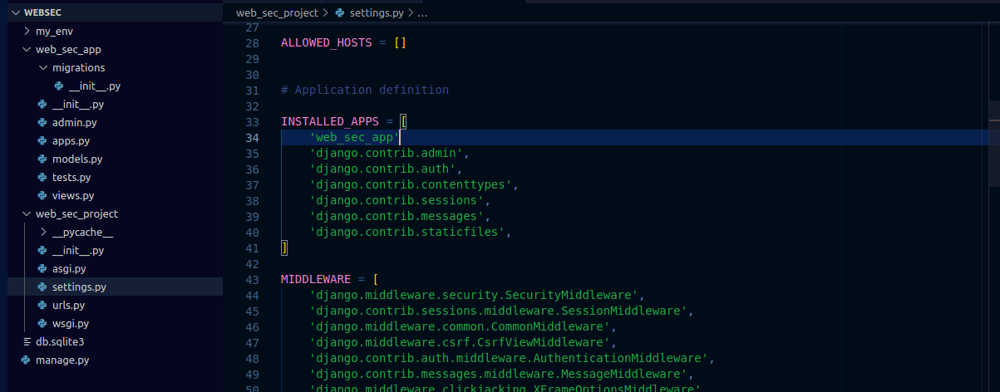

Веб-безопасность - важный аспект процесса разработки веб-приложений. Особенно с увеличением объема хранимых, управляемых и совместно используемых данных.

Как веб-разработчик, вы должны уделять первостепенное внимание мерам безопасности, чтобы защитить пользователей и данные вашей компании от потенциальных угроз.

В этой статье я продемонстрирую лучшие практики веб-безопасности, создав защищенное веб-приложение с помощью Django, мощного веб-фреймворка Python. Я расскажу о хешировании паролей, безопасном управлении сеансами, аутентификации, авторизации и других ключевых аспектах безопасности, сопроводив их примерами кода.

Прежде чем продолжить статью, имейте в виду, что она не предназначена для абсолютных новичков. Вы должны хорошо разбираться в Python, чтобы извлечь максимум пользы из этого руководства.

Если вам нужно подтянуть свои базовые навыки программирования на Python и Django, прежде чем продолжить, вот несколько ресурсов, которые вам помогут:

- [Python для всех](https://www.freecodecamp.org/news/python-for-everybody/) от Dr. Chuck
- [Django для всех](https://www.freecodecamp.org/news/django-for-everybody-learn-the-popular-python-framework-from-dr-chuck/), также от Dr. Chuck

Вы получите доступ к коду в конце статьи.

## Настройте структуру файлов

Допустим, мы хотим хранить наш проект на рабочем столе. Первое, что нужно сделать, - это настроить файловую структуру. Начнем с создания корневого каталога для нашего проекта на рабочем столе (в данном случае `WebSec`).

```python
mkdir WebSec
cd WebSec

```

### Создайте виртуальную среду и активируйте ее

В Linux (Ubuntu):

```python
python3 -m venv my_env

Источник my_env/bin/activate
```

И в Windows:

```python
python -m venv my_env

my_env\Scripts\activate.bat

```

## Как создать проект Django

Во-первых, если у вас его еще нет, вам нужно установить Django с помощью следующей команды:

```python
python -m pip install Django
```

Затем вы можете использовать эту команду для создания проекта:

```python
django-admin startproject web_sec_project .

```

Создайте проект Django. Не забудьте поставить точку, чтобы избежать дублирования папок.

И наконец, используйте эту команду для создания приложения:

```python
django-admin startapp web_sec_app
```

Создайте приложение django

В конце ваша структура файлов должна выглядеть следующим образом:

```python
WebSec
my_env/
web_sec_app/
**pycache**/
миграции/
шаблоны/
admin.py
apps.py
forms.py
models.py
тесты.py
urls.py
views.py
web_sec_project/
**pycache**/
**init**.py
asgi.py
settings.py
urls.py
wsgi.py
db.sqlite3
manage.py

```

### Запустите свой сервер

В терминале IDE выполните следующую команду и проверьте, работает ли ваш проект. Если да, то вы готовы к работе.

```python
python manage.py runserver
```

Убедитесь, что вы добавили свое приложение в проект:



Проверьте, что ваше приложение добавлено

Теперь давайте приступим к созданию и внедрению веб-безопасности.

## Хеширование паролей

Первой линией обороны при реализации веб-безопасности является обеспечение надлежащей защиты паролей пользователей. И вместо того чтобы хранить пароли в открытом виде, лучше их хэшировать. Мы будем использовать криптографическое хэширование для защиты конфиденциальной пользовательской информации.

Криптографическое хэширование, также известное как хэш-функции или хэш-алгоритмы, является фундаментальной концепцией в криптографии и компьютерной безопасности. Оно предполагает получение входных данных (или ”сообщения") и их преобразование в строку символов фиксированного размера, которая обычно представляет собой последовательность цифр и букв. Этот результат называется "хэш-значением" или "хэш-кодом".

По умолчанию Django предоставляет безопасный механизм хэширования паролей, используя алгоритм **PBKDF2** с хэшем **SHA-256**.

Django использует надежный и безопасный механизм хэширования паролей для защиты пользовательских паролей. Этот механизм позволяет гарантировать, что даже если база данных будет взломана, злоумышленники не смогут легко получить пароли пользователей в открытом виде. Механизм хэширования паролей в Django состоит из **PBKDF2.**.

**PBKDF2** - это простая криптографическая функция выведения ключа, устойчивая к [атакам по словарю](https://en.wikipedia.org/wiki/Dictionary_attack) и [атакам по радужным таблицам](https://en.wikipedia.org/wiki/Rainbow_table). Она основана на многократном итеративном выведении **HMAC** с некоторой прокладкой. Это гарантирует, что даже если база данных будет взломана, пароли останутся нечитаемыми.

Чтобы продемонстрировать это, мы создадим нового пользователя с хэшированным паролем и сохраним пользователя с хэшированным паролем в базе данных.

Сначала мы импортируем `User` из модели User. Затем мы импортируем `make_password`. Вот код для этого:

```python
#web_sec_app/views.py

from django.contrib.auth.hashers import make_password
из django.contrib.auth.models import User

# Создайте здесь представление пользователя.

def UserView(request):
users = User.objects.all()
пароль = 'password'
hashed_password = make_password(password)
return render(request, 'create_user.html',
{'users': users, 'hashed_password': hashed_password})

```

В нашем файле views.py мы создаем функцию, которая создает нового пользователя с хэшированным паролем и сохраняет пользователя с хэшированным паролем в базе данных.

## Безопасное управление сеансами

Управление сессиями - это ключ к сохранению состояния пользователя при нескольких запросах. Django поставляется со встроенной системой управления сессиями, которая хранит данные сессии на стороне сервера. Мы позаботимся о том, чтобы данные сессии были зашифрованы, а идентификатор сессии был безопасным, чтобы предотвратить атаки перехвата сессии.

Чтобы обеспечить безопасное управление сеансами, мы убедимся, что у нас есть безопасные куки сеанса, для чего потребуется HTTPS. Мы также собираемся предотвратить доступ `JavaScript` к файлу cookie сессии. Срок действия сессии истекает, когда браузер закрывается.

```python
SESSION_COOKIE_SECURE = True
```

Этот параметр указывает Django отправлять куки сессии только через HTTPS соединения. Если установлено значение `True`, сессионный куки не будет отправляться по незашифрованным HTTP-соединениям. Это важно для защиты конфиденциальных данных сессии, таких как токены аутентификации пользователя, от перехвата злоумышленниками в незащищенных сетях.

```python
SESSION_COOKIE_HTTPONLY = True

```

Установка значения `SESSION_COOKIE_HTTPONLY` в `True` добавляет дополнительный уровень безопасности. Когда эта опция включена, куки сессии не могут быть доступны JavaScript-коду, запущенному в браузере клиента. Это помогает предотвратить некоторые типы атак межсайтового скриптинга (XSS), когда злоумышленник пытается украсть данные сессии с помощью вредоносных скриптов.

```python
SESSION_EXPIRE_AT_BROWSER_CLOSE = True
```

Когда `SESSION_EXPIRE_AT_BROWSER_CLOSE` установлено значение `True`, сессия истечет и будет удалена, как только пользователь закроет свой веб-браузер. Это обеспечивает механизм для создания недолговечных сессий, которые автоматически завершаются, когда пользователь заканчивает сеанс просмотра. Это полезно для сценариев, в которых необходимо обеспечить выход пользователей из системы при закрытии браузера, что повышает безопасность общих или публичных компьютеров.

Ваш файл `settings.py должен содержать следующее:

```python
SESSION_COOKIE_SECURE = True
SESSION_COOKIE_HTTPONLY = True
SESSION_EXPIRE_AT_BROWSER_CLOSE = True

```

## Аутентификация и авторизация

Правильные процедуры аутентификации и авторизации важны для ограничения доступа к определенным частям веб-приложения.

В этом разделе я покажу, как реализовать вход и аутентификацию пользователей с помощью фреймворка аутентификации Django. Я также определю контроль доступа на основе ролей пользователей, чтобы гарантировать, что только авторизованные пользователи могут получить доступ к определенным представлениям и функциям.

```python
@user_passes_test(lambda u: u.is_superuser)
def admin(request):
    return render(request, 'admin.html', {'username': request.user.username})
```

Приведенный выше код используется для ограничения доступа к представлению admin в зависимости от того, является ли пользователь суперпользователем (admin) или нет.

Если пользователь является суперпользователем, ему разрешен доступ к представлению, и шаблон `admin.html` будет отображаться с его именем пользователя. Если пользователь не является суперпользователем, он будет перенаправлен на неавторизованное представление по умолчанию, если не реализована дополнительная обработка.

Это гарантирует, что только авторизованные пользователи с правами администратора могут получить доступ к странице ‘admin.html’.

## Защита от межсайтового скриптинга (XSS)

Межсайтовый скриптинг (XSS) - это распространенная уязвимость, которая позволяет хакерам внедрять вредоносные скрипты на веб-страницы, просматриваемые другими пользователями.

В этом разделе мы рассмотрим, как реализовать заголовки Content Security Policy (CSP) для предотвращения несанкционированного выполнения скриптов и защиты нашего приложения от XSS-атак.

CSP-заголовки работают путем создания набора правил, определяющих, какие источники контента разрешены, а какие заблокированы. Это значительно уменьшает площадь атаки для XSS-уязвимостей, что значительно усложняет злоумышленникам выполнение несанкционированных сценариев в вашем приложении.

Важно тщательно настроить политики CSP, чтобы найти баланс между безопасностью и функциональностью, поскольку слишком строгие политики могут привести к нарушению легитимной функциональности вашего приложения.

```python
CSP_DEFAULT_SRC = ("'self'",)

```

## Защита от подделки межсайтовых запросов (CSRF)

CSRF-атаки возникают, когда вредоносные сайты обманом заставляют пользователей совершать несанкционированные действия на других сайтах, где они авторизованы. Django предлагает встроенную защиту от CSRF-атак с помощью CSRF-токенов.

Это один из наиболее распространенных методов предотвращения CSRF-атак с использованием CSRF-токенов.

Когда пользователь загружает веб-страницу, требующую взаимодействия с пользователем, сервер генерирует уникальный токен и включает его в форму или данные запроса. Этот токен обычно связан с сессией пользователя. Когдакогда пользователь отправляет форму или инициирует действие, сервер проверяет, совпадает ли отправленный токен с токеном, связанным с сессией пользователя. Если они не совпадают, запрос отклоняется, так как это может быть попытка совершить CSRF-атаку.

Я покажу вам, как включать эти маркеры в формы для предотвращения несанкционированных запросов.

```html
<h4>Создать аккаунт</h4>
<form action="" method="post">
	
	<input
		type="text"
		id="userName"
		name="имя пользователя"
		class="form-control input-sm chat-input"
		placeholder="username"
	/>
</form>
```

## Предотвращение SQL-инъекций

SQL-инъекция - это серьезная уязвимость, которая возникает, когда злоумышленники манипулируют пользовательскими данными для выполнения вредоносных SQL-запросов к базе данных. Я покажу, как ORM (Object-Relational Mapping) в Django автоматически санирует пользовательский ввод и защищает от атак SQL-инъекций.

Важно отметить, что, несмотря на то, что ORM в Django обеспечивает надежную защиту от большинства атак SQL-инъекций, разработчики все равно должны придерживаться лучших практик безопасности, таких как валидация ввода и проверка авторизации, чтобы гарантировать общую безопасность своих веб-приложений.

Также нелишним будет часто обновлять Django и его зависимости, чтобы воспользоваться всеми обновлениями безопасности и другими улучшениями, которые могут появиться в будущем.

```python
def search(request):
query = request.GET.get('q')
if query is not None:
results = Search.objects.filter(Q(name**icontains=query) | Q(description**icontains=query))
else:
results = []
return render(request, 'search.html', {'results': results})

```

Приведенный выше код определяет функцию представления Django, которая работает с функцией поиска, извлекая запрос из параметров `GET` запроса, используя этот запрос для выполнения поиска в модели Search с помощью метода фильтра Django ORM, а затем отображая шаблон с результатами поиска.

Поиск осуществляется по полям ’**name**’ и '**description**’ модели, а результаты поиска являются частичными совпадениями без учета регистра.

Полагаясь на ORM Django и его встроенные возможности, вы используете более высокий уровень абстракции, который по своей сути помогает предотвратить распространенные уязвимости SQL-инъекций.

Структура и шаблоны использования этого кода соответствуют лучшим практикам написания безопасных запросов в Django, что делает его менее восприимчивым к атакам SQL-инъекций. Но все же важно убедиться, что остальная часть вашей кодовой базы следует лучшим практикам безопасности и что вы поддерживаете версию Django и его зависимости в актуальном состоянии, чтобы воспользоваться последними исправлениями безопасности.

## Безопасность загрузки файлов

Работа с загрузкой файлов требует особого внимания, чтобы предотвратить загрузку злоумышленниками вредоносных файлов. Мы рассмотрим, как проверять и ограничивать загрузку файлов, чтобы обеспечить безопасность нашего веб-приложения.

```python
def upload_file(request):
    if request.method == 'POST':
        uploaded_file = request.FILES.get('file')
        if uploaded_file:
            if uploaded_file.content_type in ALLOWED_FILE_EXTENSIONS:
                try:
                    with open('uploads/' + uploaded_file.name, 'wb+') as destination:
                        for chunk in uploaded_file.chunks():
                            destination.write(chunk)
                    return render(request, 'success.html')
                except ValidationError as e:
                    error_message = str(e)
                    return render(request, 'fileUpload.html', {'error_message': error_message})
            else:
                error_message = "Неверный тип файла."
                return render(request, 'fileUpload.html', {'error_message': error_message})
        else:
            error_message = "Файл не выбран".
            return render(request, 'fileUpload.html', {'error_message': error_message})
    else:
        return render(request, 'fileUpload.html')
```

В приведенном выше фрагменте кода определена функция `upload_file` Эта функция принимает в качестве аргумента объект request и обрабатывает загрузку файлов.

Сначала функция проверяет, является ли метод запроса `POST`. Если да, то функция получает файл, загруженный пользователем, используя метод `request.FILES.get('file')`.

Если файл не пустой, то функция проверяет, есть ли расширение файла в списке `ALLOWED_FILE_EXTENSIONS`. Этот список содержит типы файлов, которые разрешено загружать. Если расширение файла отсутствует в списке, то функция выводит сообщение об ошибке.

Если расширение файла есть в списке, то функция пытается сохранить файл в каталог `uploads`. Функция использует оператор `with open()` для открытия файла в режиме двоичной записи. Затем файл сохраняется в виде фрагментов с помощью цикла `for chunk in file.chunks()`.

Если файл сохранен успешно, то функция перенаправляет пользователя на страницу успеха. В противном случае выводится сообщение об ошибке.

Список `ALLOWED_FILE_EXTENSIONS` - это мера безопасности, которая не позволяет пользователям загружать вредоносные файлы, suнапример, исполняемые файлы или сценарии. Ограничение максимального размера файла - еще одна мера безопасности, не позволяющая пользователям загружать большие файлы, которые могут вызвать атаку типа ”отказ в обслуживании". Хранение загруженного файла в отдельном каталоге изолирует его от остальной части приложения и затрудняет злоумышленникам доступ к нему.

## Завершение

Создание безопасного веб-приложения - это непрерывный процесс, требующий бдительности и применения лучших практик.

В этой статье я продемонстрировал различные меры веб-безопасности на примерах кода при создании веб-приложения с помощью Django.

Реализовав хеширование паролей, безопасное управление сессиями, аутентификацию, авторизацию и защиту от распространенных веб-уязвимостей, таких как XSS и CSRF, я сделал важные шаги на пути к созданию надежного и безопасного веб-приложения.

Однако веб-безопасность - это обширная и постоянно развивающаяся область, и очень важно быть в курсе последних тенденций и практик в области безопасности, чтобы гарантировать, что ваше веб-приложение будет защищено от потенциальных угроз. Всегда проводите тщательное тестирование безопасности и регулярно обновляйте приложение и библиотеки, чтобы обеспечить надежную защиту от потенциальных атак.

Правильно принятые меры безопасности позволят вам с уверенностью обеспечить пользователям безопасный и надежный веб-сервис.

Вы можете получить доступ к коду [здесь](https://github.com/Enecode/secure-web-application.git). Спасибо за чтение!
