Многие проекты переходят с React на Next.js в 2023 году. Поэтому сейчас самое время разобраться в важном этапе создания приложения на Next.js: развертывании.

Развертывание приложения Next.js - важный этап в жизненном цикле вашего веб-продукта. А поскольку существуют различные стратегии развертывания, выбрать подходящую может быть непросто.

В этой статье мы рассмотрим различные стратегии и методы развертывания приложений Next.js. Мы рассмотрим сильные стороны каждой стратегии, включая статический хостинг, бессерверные функции, контейнеризацию и традиционное развертывание сервера.

Мы также затронем основные методы оптимизации процесса развертывания и повышения производительности и надежности вашего Next.js-приложения.

В этой статье представлена исчерпывающая информация, которую начинающий или средний разработчик может использовать при развертывании гладкого приложения Next.js.

# Почему развертывание важно в жизненном цикле разработки?

Развертывание проекта важнее, чем его запуск. Приложение должно решать проблемы своих пользователей - но как ваши пользователи смогут решить свои проблемы с помощью вашего приложения, если вы не развернете его (не сделаете его доступным миру)? Процесс развертывания может свести на нет все ваши труды, если вы пропустите хоть один шаг.

Процесс разработки включает в себя:

- Размещение приложения на хостинговой платформе.
- Конфигурирование.
- Обеспечение бесперебойной работы для пользователей по всему миру.

Вот несколько причин, по которым развертывание необходимо:

- Доступность для пользователей: Удобство использования проекта - важный критерий. Развертывание - это последний шаг, без которого пользователи не смогут взаимодействовать с вашим приложением. Пользователи должны иметь возможность получить доступ к вашему проекту и беспрепятственно использовать его функции.
- Тестирование на реальных пользователях: Развертывание проекта - единственный способ проверить, решает ли он поставленную задачу. Это позволит вам протестировать и устранить ошибки на реальных пользователях и данных и исправить приложение, чтобы оно работало так, как задумано.
- Масштабируемость и надежность: Развертывание приложения позволяет вашему продукту масштабироваться, работать с большим количеством пользователей и увеличивать трафик. Масштабируемость и надежность - это причины, по которым вы должны использовать соответствующий процесс развертывания, поскольку это может поставить под угрозу ваши усилия, если ваш продукт не сможет справиться с резким увеличением трафика.
- Непрерывная интеграция и развертывание (CI/CD): Процесс развертывания реализует бесперебойный рабочий процесс. Благодаря практике CI/CD ваша кодовая база всегда протестирована, проверена и развернута в производственной среде. Это также облегчает добавление функций и позволяет избежать ошибок.

# Стратегии развертывания для проектов Next.js

Здесь представлен обзор различных вариантов развертывания в соответствии с рабочими процессами и требованиями к продуктам Next.js.

## Вариант #1: Статический хостинг

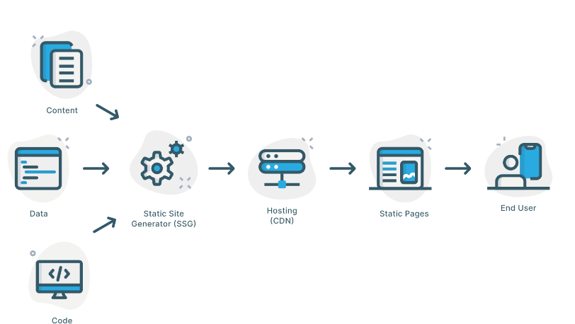

Диаграмма, иллюстрирующая статический хостинг

Простой статический веб-сайт с небольшим количеством или отсутствием рендеринга на стороне сервера можно разместить на стационарных хостинговых платформах, таких как Vercel, Netlify, Amazon Simple Storage Service (AWS S3), GitHub Pages или Surge.

Next.js генерирует статические HTML-файлы в процессе сборки, и вы можете разместить его на одной из вышеперечисленных платформ.

### Преимущества статического хостинга для приложений Next.js

- Улучшенная производительность: Приложения Next.js генерируют предварительно отрендеренные HTML-файлы в процессе сборки, и они поддерживают генерацию статических сайтов (SSG). При статическом хостинге предварительно отрендеренные файлы можно кэшировать в глобальной сети доставки контента (CDN), что повышает производительность за счет быстрой загрузки.
- Масштабируемость: Приложение со статическим хостингом иCDN позволит распространять файлы по всему миру, тем самым улучшая масштабируемость и снижая нагрузку на исходный сервер. CDN обеспечит быструю загрузку даже во время скачков трафика для пользователей по всему миру.
- Безопасность: Статический хостинг практически не требует обработки на стороне сервера, что уменьшает площадь атаки. Кроме того, статические файлы менее уязвимы для распространенных атак на веб-приложения.
- Снижение нагрузки на сервер: нагрузка на исходный сервер снижается, поскольку Next.js содержит предварительно отрендеренные HTML-файлы.
- Преимущества кэширования: Поскольку статические файлы кэшируются на CDN, это уменьшает количество запросов к исходному серверу.
- Экономическая эффективность: Статический хостинг не требует управления базами данных или обработки на стороне сервера. Он будет дешевле для небольших приложений и сайтов с низким трафиком.

### Примеры использования статического хостинга для приложений Next.js

Статический хостинг отлично подходит для приложений Next.js с небольшим количеством рендеринга и обслуживания.  
Вот несколько примеров использования, которые стоит рассмотреть:

1. Посадочные страницы: Это простой веб-сайт, используемый для маркетинговых кампаний или запуска продуктов. Посадочная страница Next.js должна быть размещена статически, чтобы обеспечить бесперебойную работу с высоким трафиком и быстрое время загрузки.
2. Контентные сайты и сайты-портфолио: Сайты с большим количеством статического содержимого, такие как блоги, сайты документации и базы знаний, получают более высокую производительность и сокращают время загрузки при использовании статического хостинга.
3. Прототипы и демонстрационные версии: Приложения Next.js могут использоваться разработчиками для внутренних демонстраций и создания прототипов для клиентов, поскольку их можно легко развернуть.
4. Одностраничные приложения (SPA): SPA обычно содержат динамическое содержимое, но статическая часть может быть предварительно отрендерена и размещена статически для улучшения времени загрузки.

### Примеры платформ статического хостинга для приложений Next.js

Несколько платформ статического хостинга могут легко разместить статическое приложение Next.

1. Vercel: Это широко используемая хостинговая платформа. Она обладает встроенными функциями и простотой использования, что делает ее отличным вариантом для размещения статических и бессерверных приложений Next.js. Vercel имеет глобальную поддержку CDN, быструю интеграцию и автоматическое развертывание.
2. Firebase Hosting: Предоставляется Google Firebase и поддерживает статические сайты из Next.js. Он также поддерживает динамические сайты, но обеспечивает бесперебойный статический хостинг.
3. Netfily: Этот вариант имеет одну из самых простых настроек и удобный для разработчиков интерфейс. Он поддерживает непрерывное развертывание, бессерверные функции и обработку форм.
4. GitHub Pages: Страницы GitHub - это самая простая настройка. Вы создаете ветку gh-pages, и она будет работать, если у вас есть HTML-источник, но Nextjs этого не делает. Поэтому вы можете разместить свое приложение Next.js, предварительно создав страницы в процессе сборки.
5. Amazon Simple Storage Service (AWS S3): Его можно использовать для размещения статических веб-сайтов. Вам нужно настроить ведро S3 для размещения статических веб-сайтов, а затем использовать AWS Cloudfront в качестве CDN для повышения производительности.
6. Render: На этой облачной хостинговой платформе размещаются статические сайты и выполняются бессерверные функции. Она позволяет размещать статические сайты на Next.js.

### Как развернуть приложение Next.js на платформе статического хостинга

Развернуть статическое приложение Next.js на платформе статического хостинга очень просто. Вот шаги, которые необходимо выполнить:

#### Шаг 1: Напишите код вашего приложения Next.js.

Сначала необходимо завершить работу над кодом Next.js и убедиться, что он готов к развертыванию. Он должен быть протестирован и работать так, как ожидалось.

Затем инициализируйте код и зафиксируйте его в репозитории Git.

#### Шаг 2: Выберите платформу для хостинга

Теперь вам нужно выбрать любую хостинговую платформу, подобную тем, что перечислены выше. Вам понадобится лишь небольшая настройка, поскольку она статична.

Вы можете подписаться на бесплатную версию или перейти на профессиональную.

#### Шаг 3. Подключите репозиторий

Когда вы войдете на хостинг-платформу, сразу после нажатия кнопки Create a new project вы найдете либо “Connect a Repository”, либо “Import project”.

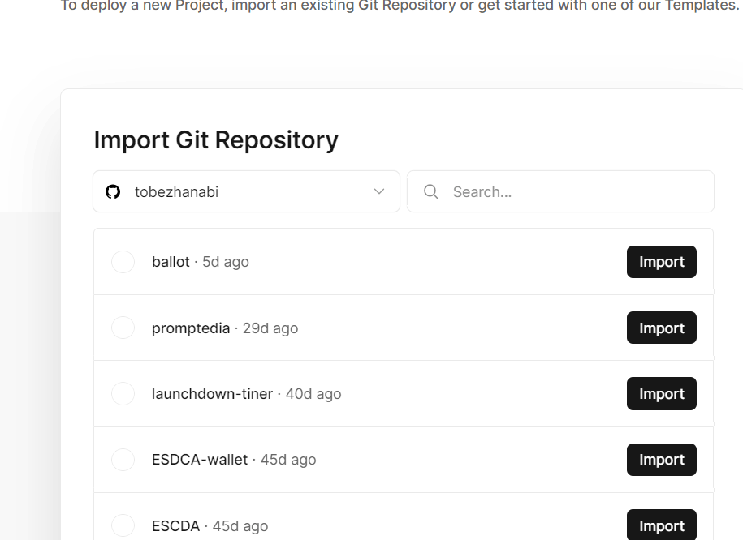

Импорт репозитория

Дайте хостинговой платформе разрешение на доступ к вашему Git-репозиторию и выберите репозиторий с вашим приложением Next.js.

#### Шаг 4: Настройте параметры развертывания

Теперь вам нужно выбрать ветку, которую вы хотите развернуть. Выберите команду сборки. Для приложений Next.js командой сборки обычно является `npm run build` или `yarn build`.

Выберите выходной каталог. Поскольку мы разворачиваем приложение Next.js, выходным каталогом обычно является `out` или `build`.

#### Шаг 5: Развертывание приложения

Теперь пришло время развернуть ваше приложение - платформа сама выполнит весь процесс. А затем она автоматически создаст статические файлы вашего приложения.

Чтобы развернуть приложение, нажмите кнопку `Deploy` или аналогичную ей, представленную хостинговой платформой.

#### Шаг 6: Пользовательский домен

Теперь вы можете установить свой собственный домен у сторонних разработчиков или использовать профессиональную версию, если она доступна.

Настройте записи системы доменных имен (DNS) вашего пользовательского домена так, чтобы они указывали на хостинг-платформу. (_Этот шаг необязателен.)_.

#### Шаг 7: Проверка и тестирование

После завершения развертывания вы получите унифицированный ресурсЛокатор (URL) с хостинговой платформы.

Посетите URL-адрес, чтобы убедиться, что ваше приложение Next.js успешно развернуто и работает так, как ожидалось. Он должен выглядеть примерно так:

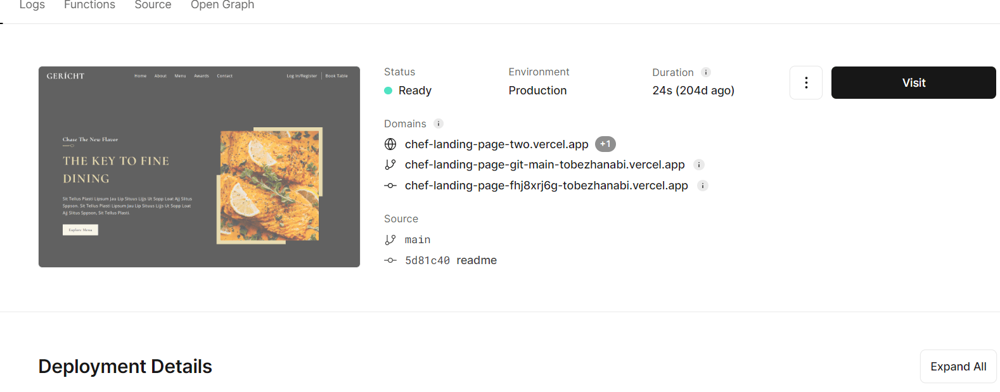

Страница развертывания на Vercel

#### Шаг 8: Непрерывное развертывание

Наконец, самое время реализовать стратегию непрерывного развертывания, если платформа статического хостинга позволяет это сделать. Это позволит автоматически развертывать ваши изменения в Git-репозитории.

Для этого необходимо внедрить веб-хуки, которые будут запускать сборку и развертывание при появлении нового кода.

Давайте рассмотрим, как настроить непрерывное развертывание на GitHub:

1. Перейдите в настройки репозитория проекта, который вы хотите развернуть.

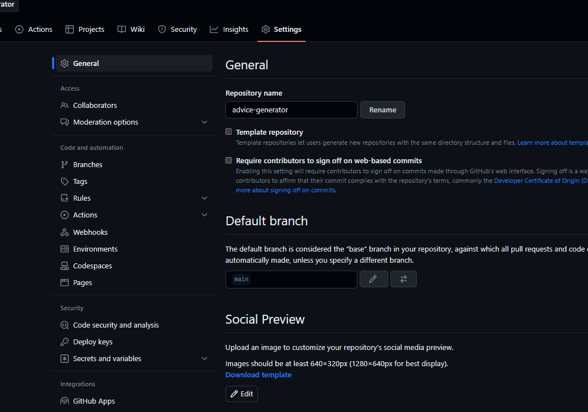

Настройка репозитория

2\. Выберите Webhooks на левой стороне

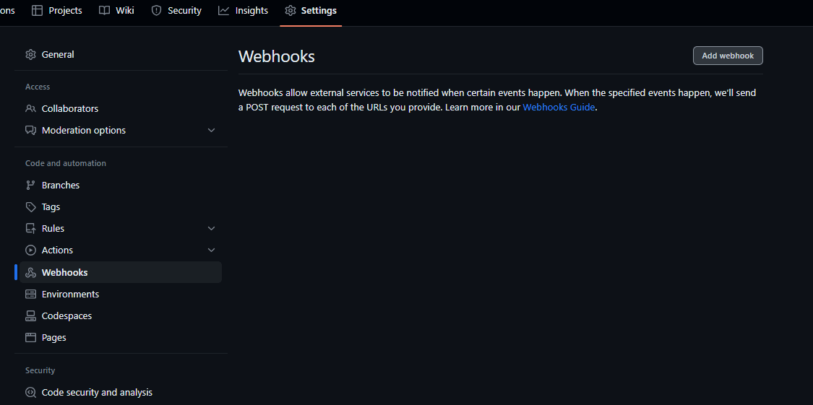

Выберите веб-крючки

3\. Нажмите на `Добавить вебхук` или `Новый рабочий процесс`.

4\. Настройте вебхук

Укажите URL, куда хостинговая платформа будет сбрасывать веб-хук.

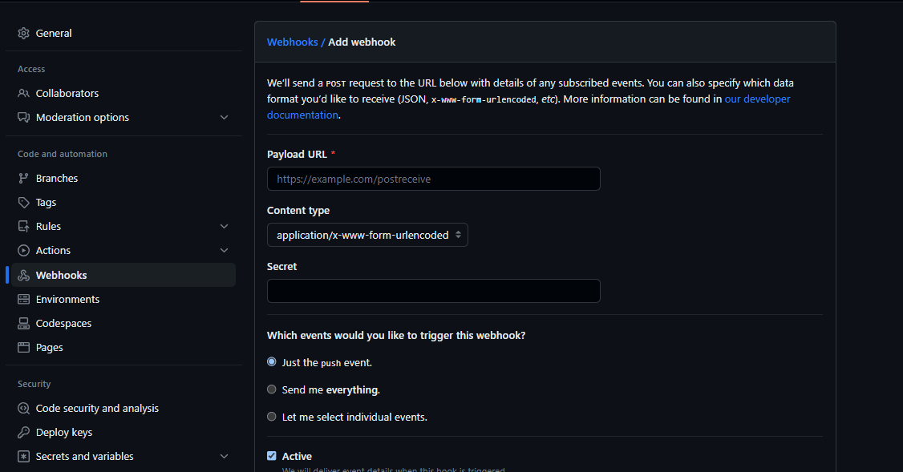

настройка веб-хука

5\. Выберите событие для запуска

Как вы видите, здесь три события, и нам нужно выбрать `Просто событие Push`. Оно будет запускать события при появлении нового кода.

6\. Добавить секрет

Секрет - это пароль, который добавляет дополнительный уровень безопасности. Он также будет запрашиваться хостинговой платформой.

7\. Сохранить и протестировать

Сохраните и проверьте, как срабатывают веб-хуки, когда вы вводите новый код.

## Вариант №2: Бессерверные функции

Проекты Next.js могут быть интегрированы с бессерверными функциями, такими как AWS Lambda, с помощью бессерверной функции Vercel или бессерверной функции. С помощью этого варианта разработчики могут создавать динамическую функциональность на стороне сервера, не напрягаясь по поводу традиционного управления серверной инфраструктурой.

Этот вариант развертывания помогает обрабатывать отправку форм, вызовы API и другие вычисления на стороне сервера масштабируемым и дешевым способом.

Существует несколько платформ, поддерживающих бессерверную функциональность:

- лямбда веб-службы Amazon
- функции Azure
- облачные функции Google
- облачные функции IBM
- Функция облака Alibaba
- Версель

Эти платформы упрощают управление и позволяют разработчикам больше внимания уделять кодированию, а не настройке.

### Преимущества бессерверных функций для приложений Next.js

Использование бессерверной функции для размещения приложения Next.js дает несколько преимуществ, которые улучшают производительность, и к ним относятся:

- Масштабируемость: Бессерверные функции масштабируются в зависимости от спроса. Они созданы для того, чтобы справляться с резкими скачками трафика и обеспечивать пользователям стабильный опыт.
- Экономическая эффективность: Платформа для бессерверных функций взимает плату в зависимости от фактического использования, а не от содержания выделенных серверов, что позволяет экономить средства.
- Архитектура микросервисов: Бессерверные функции позволяют создавать сложные приложения, когда вы объединяете мелкие функции для решения конкретной задачи.
- Более быстрые итерации разработки: Благодаря бессерверным функциям вы можете сосредоточиться на конкретных функциях, поскольку они изолированы, и быстро вносить изменения, не затрагивая весь проект.
- Безопасность и изоляция: Поскольку бессерверные функции поддерживают изолированную среду, что снижает вероятность возникновения ошибок, когда одна функция влияет на другую, они отличаются высокой степенью безопасности.
- Глобальное распространение: Бессерверные платформы, как известно, имеют глобальную сеть центров обработки данных, что позволяет развернуть функции вашего приложения Next.js ближе к пользователям и уменьшить задержки.

### Случаи использования функций Serverless для приложения Next.js.

Некоторые веб-сайты получают большую выгоду от использования платформы бессерверных функций. Некоторые типы таких приложений Next.js включают:

1. Формы и приложения для взаимодействия с пользователями: использование бессерверных функций для обработки входа пользователей в систему, регистрации и других интерактивных элементов может повысить удобство использования и производительность, сделав эти процессы бесшовными и асинхронными.
2. Получение данных в реальном времени: бессерверные функции могут получать информацию в реальном времени из базы данных или API без нагрузки на основной сервер.
3. Динамический контент: Используйте возможность хостинга бессерверных функций, если у вас есть приложение, которое генерирует персонализированные данные, такие как графики, метрики или контент, ориентированный на конкретного пользователя.
4. Аутентификация и авторизация: Использование бессерверной функции при аутентификации и авторизации данных позволяет повысить безопасность, снимая с себя тяжелую работу по проверке токенов и управлению пользователями.
5. Приложение для электронной коммерции: Бессерверные функции отлично подходят для обработки обновлений корзины покупок и интеграции платежных шлюзов.
6. SEO-оптимизация: Использование бессерверных функций для размещения вашего приложения на Next.js помогает визуализировать SEO-метаданные и улучшает видимость в поисковых системах.

### Примеры бессерверного хостинга Хостинговые платформы для приложений Next.js

Мы перечислили несколько платформ хостинга бессерверных функций - теперь давайте обсудим некоторые из них. популярные.

1. Vercel: Vercel разработан, чтобы органично вписаться в потребности Next.js. Он поддерживает бессерверную функцию и предлагает глобальную сеть доставки контента (CDN), повышая производительность и надежность.
2. AWS Lambda: Amazon lambda часто используется вместе с Amazon API Getaway для развертывания бессерверных функций и API. Этот вариант также позволяет создавать индивидуальную бессерверную архитектуру.
3. Функции Azure + статические веб-приложения Azure: эта комбинация в облаке Microsoft Azure позволяет легко развернуть приложение Next.js с бессерверными функциями.
4. Функции Google Cloud и хостинг Firebase: Вы можете объединить Google Cloud и хостинг Firebase, чтобы воспользоваться возможностями CDN и бессерверными функциями при развертывании приложения Next.js.
5. Netlify: Netfily позволяет легко развертывать приложения Next.js и предоставляет бессерверные функции. Она поддерживает обработку форм, непрерывное развертывание и систему контроля версий.

### Изучение возможностей бессерверного развертывания AWS Lambda

AWS Lambda от Amazon Web Services позволяет запускать бессерверные функции без управления серверами. Обычно она используется для запуска файлов кода в ответ на HTTP-запросы, изменения данных в базе данных и другие события.

Развернуть приложение Nextjs на AWS Lambda очень просто, если использовать веб-адаптер, предоставляемый платформой. Давайте пройдемся по шагам.

#### Шаг 1: Упакуйте ваше приложение Next.js

Убедитесь, что ваш проект готов и протестирован локально. Вы можете упаковать проект в виде Zip-файлов или образа Docker.

Выбор образа Docker означает управление, сборку и распространение любых образов. Но стиль zip-пакета проще.

Давайте сначала посмотрим, как это сделать с помощью Docker.

#### Шаг 2: Докеризация приложения

Сначала вам нужно будет создать `Dockerfile` в корне вашего проекта. Используйте базовый образ Node.js в `Dockerfile` следующим образом: `FROM node:16`.

Затем скопируйте файлы/пакет приложения Next.js в контейнер.

Установите необходимые зависимости с помощью этой команды: `RUN npm install --production.` И затем соберите проект с помощью `RUN npm build`.

Укажите команду для запуска приложения: `npm run start` или `yarn start`.

#### Шаг 3: Сборка образа докера

Теперь используйте команду `docker build` в терминале, чтобы создать образ вашего приложения и его зависимостей.

Вот команда `docker build -t my-nextjs-app .`

- \-t; используется для указания тега образа, который должен быть именем проекта
- `.`, чтобы показать, что docker должен собирать с текущей директорией

#### Шаг 4: Поместите образ в реестр контейнеров:

Поместите образ Docker так, чтобы AWS Lambda могла легко получить к нему доступ. В данном случае мы размещаем образ в Amazon Elastic Container Registry (ECR).

Войдите в AWS ECR:

```bash
aws ecr get-login-password --region region | docker login --username AWS --password-stdin aws_account_id.dkr.ecr.region.amazonaws.com
```

Пометьте образ Docker:

```bash
docker tag image_name:tag aws_account_id.dkr.ecr.region.amazonaws.com/repository_name:tag

```

Загрузите изображение:

```bash
docker push aws_account_id.dkr.ecr.region.amazonaws.com/repository_name:tag

```

#### Шаг 5: Создание функции AWS Lambda

В консоли AWS Lambda создайте новую лямбда-функцию. Выберите опцию `Container image` и выберите образ docker из реестра.

Теперь давайте рассмотрим, как это сделать с помощью **zip-пакета:**.

#### Шаг 2: Создайте свое приложение Next.js:

Используйте `npm run build` или `yarn build` для сборки вашего приложения Next.js для производства. В результате ваши необработанные файлы .jsx превратятся в HTML, CSS и Javascript-код, который будет отображаться в браузере пользователя.

#### Шаг 3: Создание пакета развертывания

Создайте каталог deploy и скопируйте в него все необходимые файлы, включая node_modules, package.json и .next. Это все, что вам нужно, чтобы ваше приложение Next.js было готово к развертыванию на производстве.

#### Шаг 4: Создание zip-пакета

Теперь создайте zip-пакет со всеми приложениями и зависимостями Next.js. Для этого откройте терминал и перейдите в каталог с папкой готового к производству приложения.

Затем выполните команду zip `zip -r my-nextjs-app.zip *` ; это застегнет пакет на месте и сохранит его под именем `my-nextjs-app.zip`.

Если вы работаете под Windows, используйте команду `sudo apt-get install zip unzip` для установки приложения zip.\_

#### Шаг 5: Загрузите Zip-пакет в AWS Lambda.

В консоли AWS Lambda настройте новую функцию Lambda. Выберите опцию “Upload a .zip file” и загрузите созданный вами zip-пакет.

Вот как загрузить zip-пакет в AWS Lambda

1. Войдите в консоль управления AWS, найдите `Lambda` в строке поиска сервисов

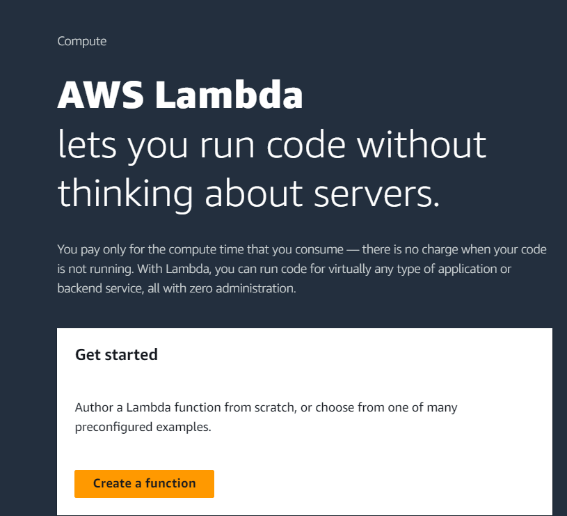

Страница AWS lambda

2\. Нажмите кнопку ”Создать функцию", чтобы создать новую лямбда-функцию.

3\. Настройте функцию

- Выберите опцию ”Создать с нуля".
- Введите имя функции.
- Выберите среду выполнения; для приложения Next.js вам понадобится Node.js.

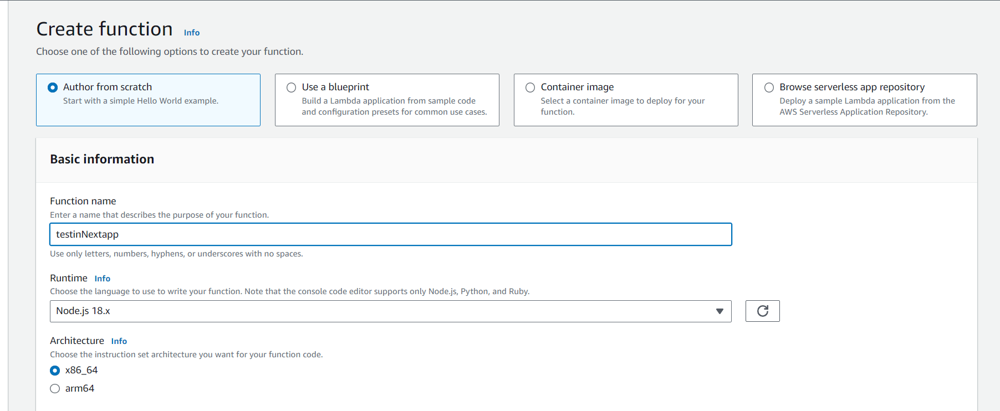

Создание лямбда-функции

- Выберите роль исполнения, которая предоставляет полное право pРазрешите функцию Lambda, а затем нажмите кнопку ”Создать функцию".

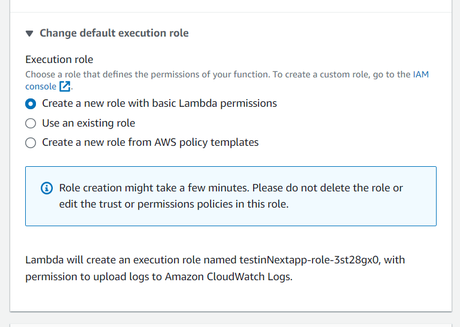

Выберите роль выполнения.

4\. Настройте триггеры функций: нажмите ”Добавить триггер" и выберите “API Getaway” для бессерверного варианта. И настройте все по своему усмотрению.

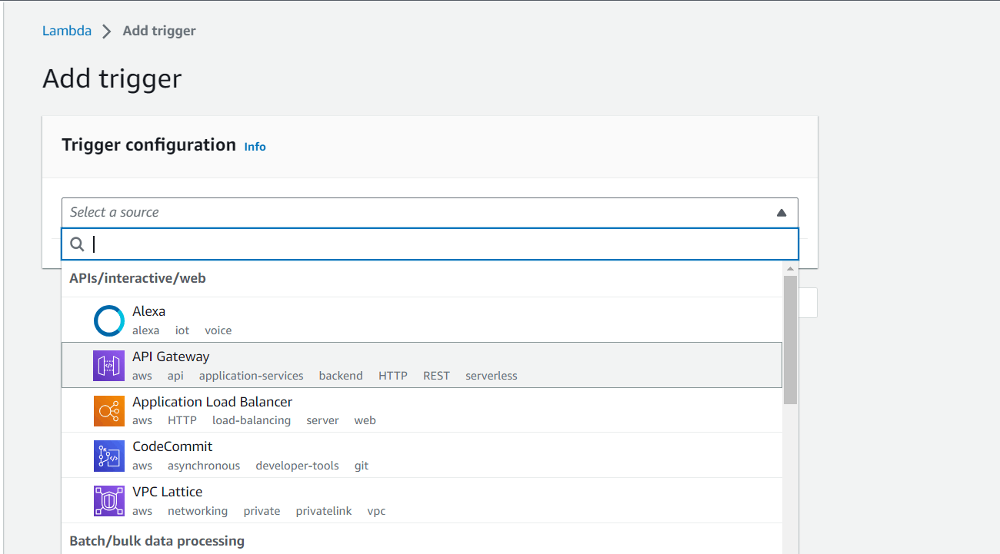

5\. На вкладке ‘Code’ в разделе ‘Function overview’ нажмите на ‘upload from’ и выберите ’.zip file’. Найдите сохраненный файл `my-nextjs-app.zip` и загрузите его.


Загрузка zip-пакета

6\. Дополнительные настройки и тестирование: Консоль управления AWS позволяет настраивать ‘destination’, ‘permission’, ‘function URL’ и многое другое. Вы также можете протестировать свое приложение в разделе ”Тест".

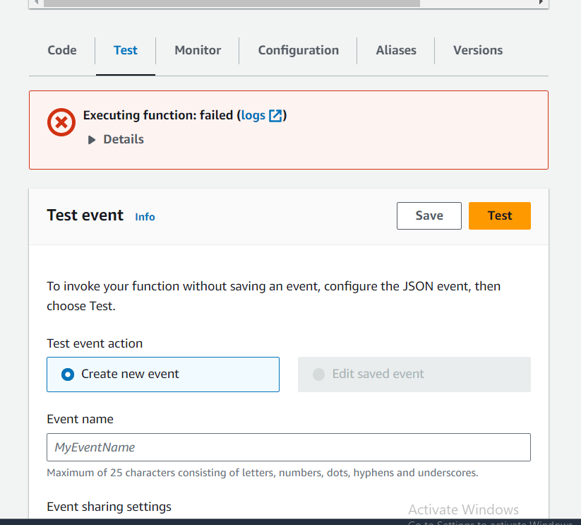

Тестирование с помощью консоли AWS

7\. После того как вы убедились в правильности конфигурации и настроек, вы можете развернуть его.

С этого момента все шаги будут одинаковыми, поэтому продолжим процесс:\_

#### Шаг 6: Настройка Lambda-функции:

Вам нужно настроить тайм-аут, память и другие параметры функции Lambda.

Затем определите переменную окружения (только если она необходима).

После этого нужно протестировать функцию Lambda и проверить, работает ли ваше приложение Next.js так, как ожидалось.

#### Шаг 7: Настройка API Getaway (необязательно)

Если ваш проект представляет собой API, вы можете настроить API-шлюз, который будет выступать в качестве HTTP-интерфейса для вашей функции Lambda.

## Вариант № 3: Контейнеризация

Этот вариант развертывания позволяет упаковывать приложения Next.js вместе с их зависимостями и делать их меньше и более согласованными в различных средах.

Вы можете контейнеризировать свое приложение Next.js и развернуть его с помощью платформ оркестровки, таких как Kubernetes или Elastic Container Service (AWS ECS).

### Преимущества контейнеризации приложений Next.js

Существует несколько преимуществ использования контейнерной стратегии развертывания для приложений Next.js, которые включают в себя:

- Переносимость: Переносимость контейнеров позволяет разработчикам создавать приложения один раз и запускать их в любом месте. Такой уменьшенный файл может быть полезен в гибридном облаке или среде развертывания.
- Последовательность: Контейнеры позволяют вашему приложению Next.js оставаться неизменным на всех машинах, в процессе постановки и тестирования. Это уменьшает проблему ”оно не работает на моей машине".
- Изоляция: Контейнеры изолируют систему от других контейнеров, повышая безопасность и сводя к минимуму конфликты между вашими приложениями и их зависимостями.
- Микросервисы: Контейнер имеет архитектуру микросервисов, которая позволяет выделять более мелкие части приложения и управляемые сервисы, которые можно разрабатывать и тестировать независимо друг от друга.
- Контроль версий: Образы контейнеров можно хранить в реестрах и изменять их версии, а также легко вносить изменения для обновления до следующей версии или отката к предыдущей.
- Быстрое развертывание: Контейнеры позволяют быстро запускаться и выключаться, что ускоряет развертывание и восстановление.
- Инфраструктура как код (IaC): Контейнеры хорошо сочетаются с практикой (IaC), позволяя создавать инфраструктуру приложения и управлять ею через код.

### Как контейнеризировать и развернуть приложение Next.js

Мы уже затрагивали некоторые шаги по контейнеризации в разделе о стратегии бессерверных функций. Здесь приведены полные шаги, необходимые для развертывания приложения Next.js с помощью контейнеризации.

#### Шаг 1: Докеризация приложения Next.js

Создайте `Dockerfile` в корне вашего проекта. Используйте базовый образ Node.js в `Dockerfile` следующим образом: `FROM node:16`.

Скопируйте файлы/пакет приложения Next.js в контейнер и установите необходимые зависимости командой `RUN npm install --production`.

Соберите проект с помощью этой команды: `RUN npm build`.

Затем укажите команду для запуска приложения - `npm run start` (CMD \[“npm”, “run”\]).

#### Шаг 2: Сборка образа Docker

Используя команду `docker build` в терминале, мы можем создать образ нашего приложения и его зависимостей.

Затем нужно протестировать приложение Next.js с помощью команды `docker run -p 3000:3000 nextjs-app` и убедиться, что оно работает так, как ожидалось.

#### Шаг 3: Развертывание контейнеризированного приложения Next.js

Выберите место хранения образа docker - вы можете использовать Amazon ECR, Docker Hub, Google Container Registry и т. д.

Затем нужно пометить и развернуть образ Docker. Используйте команду `docker tag nextjs-app:latest registry-url/repository-name:tag`.

Замените `registry-url/repository-name:tag` на выбранную вами платформу и значения реестра.

Затем добавьте готовый образ тега в выбранный реестр с помощью этой команды:  
`docker push registry-url/repository-name:tag`.

#### Шаг 4: Настройка среды развертывания

Настройте среду на выбранном вами облачном провайдере. Выполните следующие шаги

- Выберите облачного провайдера, например Amazon Web Services (AWS), Google Cloud Platform, Microsoft Azure или любого другого, который вам подходит.ваш бюджет и требования. Создайте и войдите в свою учетную запись.
- Настройте реестр контейнеров у выбранного провайдера.
- Настройте безопасность и подсети, а также создайте виртуальные сети, поскольку они будут контролировать сетевой доступ к вашему контейнерному приложению.

#### Шаг 5: Развертывание приложения

Теперь разверните ваше приложение Next.js, используя либо:

- Kubernetes: Примените YAML-файл следующим образом `kubectl apply -f filename.yaml`.
- AWS ECS: Создайте новую задачу с помощью консоли управления AWS или AWS CLI

Далее вам нужно будет настроить Ingress или Load Balancer, чтобы ваше приложение было доступно в Интернете. И наконец, нужно протестировать развернутое приложение Next.

## Вариант #4: Edge-Side Rendering (ESR)

Этот вариант развертывания обеспечивает приложению Next.js рендеринг на стороне края для получения кэшированных версий страниц из сети доставки контента (CDN).

Благодаря CDN страницы загружаются быстрее, когда пользователь запрашивает страницу во второй раз. Это возможно благодаря тому, что CDN доставляет предварительно отрендеренные страницы, сокращая время отклика.

### Преимущества Edge-Side Rendering (ESR) при развертывании приложения Next.js

Edge-side rendering рендерит часть пользовательского интерфейса на пограничных серверах CDN, но это не единственное преимущество. К другим преимуществам относятся:

1. Повышение производительности: ESR сокращает время загрузки веб-сайта, минимизируя время пути к исходному серверу. Это ускоряет загрузку и повышает удобство работы пользователей.
2. Уменьшение задержки: ESR загружает контент с более близкого сервера, и даже если исходный сервер находится далеко, пользователи получают контент быстро.
3. Улучшенная поисковая оптимизация (SEO): SEO улучшается, поскольку поисковые системы могут просматривать предварительно отрендеренный HTML-контент с пограничных серверов.
4. Масштабируемость: ESR распределяет нагрузку рендеринга между исходным и граничными серверами, что позволяет обрабатывать больше пользователей во время скачков трафика, не перегружая исходный сервер и не вызывая сбоев.
5. Снижение нагрузки на сервер: ESR позволяет исходному серверу отвечать только за некоторые запросы на рендеринг. ESR снижает потребление ресурсов и нагрузку на сервер, а также повышает общую производительность.
6. Согласованный пользовательский опыт: ESR гарантирует, что все устройства, независимо от возможностей браузера, получат отрисованное содержимое, обеспечивая последовательное восприятие.
7. Экономия средств: Используя пограничные серверы, вы будете тратить меньше энергии и ресурсов на исходные серверы.

### Как развернуть приложение Next.js с пограничным рендерингом (ESR)

Развертывание приложения Next.js с Edge-side Rendering требует от CDN рендеринга некоторых частей вашего приложения Next.js с помощью пограничных серверов. Вот как работает этот процесс.

#### Шаг 1: Подготовьте приложение Next.js

Убедитесь, что ваше приложение Next.js работоспособно и прошло локальное тестирование. Убедитесь, что оно готово к развертыванию.

#### Шаг 2: Выберите провайдера CDN

Выберите CDN-провайдера с поддержкой ESR. Вы можете выбрать Cloudflare Workers, Vercel Edge Network или Fastly. Решите, какой из них лучше всего подходит для вашего приложения.

#### Шаг 3: Настройка учетной записи CDN

Настройте учетную запись CDN, что займет около пяти минут.

- Зарегистрируйтесь или войдите в аккаунт предпочитаемого провайдера CDN, указанный выше.
- Выберите тарифный план, который соответствует вашему бюджету и требованиям приложения.

#### Шаг 4: Настройка пограничного рендеринга

Настройте ESR в соответствии с инструкциями, предоставленными провайдером CDN. Этот процесс включает в себя написание скриптов, которые определяют, какая часть вашего приложения Next.js должна быть отображена на пограничном сервере, а какие части могут обслуживаться на оригинальном сервере.

#### Шаг 5: Развертывание конфигурации ESR

Разверните вашу конфигурацию ESR на выбранной платформе CDN, используя соответствующую команду в CLI - `vercel deploy`, `wrangler publish` и так далее.

#### Шаг 6: Тестирование пограничного рендеринга:

Проверьте конфигурацию ESR и убедитесь, что указанные части вашего приложения отображаются на пограничном сервере. Следите за повышением производительности и убедитесь, что рендеринг согласован на разных устройствах, в разных браузерах и в разных местах.

#### Шаг 7: Обновите настройки DNS

Настройте параметры DNS так, чтобы они указывали на серверы CDN, чтобы запросы к вашему приложению направлялись через пограничные серверы.

#### Шаг 8: Мониторинг и оптимизация:

После развертывания отслеживайте производительность в реальной жизни. Проверьте инструменты мониторинга, предоставляемые CDN, чтобы отслеживать метрики, задержки и пользовательский опыт.

Обратите внимание, что шаги могут меняться в зависимости от выбранного вами поставщика CDN, но это основные шаги для всех. Чтобы узнать больше, вы можете обратиться к документации.

## Лучшие практики развертывания приложений Next.js

Развертывание приложения Next.js аналогично развертыванию любого другого веб-приложения. Хотя Next.js позволяет разрабатывать [бэкэнд](https://medium.com/codex/can-we-use-next-js-13-as-a-backend-framework-b5f9479a2d#:~:text=checking%20to%20JavaScript.-,Next.,process%20and%20prevent%20runtime%20errors.), стратегии развертывания практически идентичны.

Чтобы развернуть приложения Next.js наилучшим и наиболее эффективным способом, обратите внимание на следующие рекомендации:

1. Оптимизированные сборки: Оптимизация процесса сборки приложений Next.js с помощью оптимальных настроек сборки, использования статической генерации сайта (SSR) или рендеринга на стороне сервера (SSR).
2. Трассировка ошибокcking: Интегрируйте инструменты для проактивного поиска и решения проблем. Следите за состоянием сервера, взаимодействием с пользователями и приложением, чтобы повысить удобство работы и стабильность приложения.
3. Переменные окружения: Управление конфиденциальной информацией API и конфигурацией должно осуществляться в переменных окружения. Избегайте размещения конфиденциальных данных в кодовой базе во время развертывания.
4. Непрерывная интеграция и непрерывное развертывание (CI/CD): Чтобы уменьшить количество ошибок в развернутом приложении Next.js, необходимо настроить конвейеры CI/CD. Эти конвейеры автоматизируют процесс сборки, развертывания и тестирования вашего проекта.
5. Соображения масштабируемости: Хорошо продуманная архитектура должна быть готова к увеличению трафика. Используйте такие техники, как бессерверные функции и механику кэширования в вашем приложении, чтобы справиться с колебаниями пользовательского спроса.
6. Автоматизированное тестирование: Проводите автоматизированное тестирование приложения для проверки производительности и функциональности. Вы можете использовать модульные тесты, интеграционные тесты и сквозные тесты, чтобы выявлять ошибки на ранних стадиях, еще на этапе развертывания.
7. Контроль версий: Используйте такие системы, как Git, для отслеживания изменений в кодовой базе и улучшения взаимодействия с коллегами. С помощью платформы контроля версий вы сможете легко исправлять ошибки и недочеты, а также интегрировать функции.
8. Документация: Подробный документ с инструкциями по установке, развертыванию и настройке вашего приложения Next.js. Грамотно составленная документация поможет принять новых участников и упростит процесс развертывания.  
   Эти практики невероятно полезны и помогают добиться плавной работы и масштабируемости приложения.

## Лучшие практики работы с переменными окружения в приложении Next.js

Мы должны поговорить о лучших практиках и обратить внимание на безопасность. Управление переменными окружения имеет решающее значение для безопасности и управления конфигурацией при развертывании приложения Next.js.

Вот несколько лучших практик:

1. Используйте `.env.local` для локального развертывания: Создайте файл `.env.local` в корне вашего проекта. Этот файл будет содержать переменные, которые будут использоваться только при локальном развертывании.
2. Используйте `.env` для общих переменных: Здесь вы можете хранить нечувствительные переменные, зафиксированные в системе контроля версий, и делиться ими с командой. Создайте файл `.env`, но не храните в нем конфиденциальную информацию.
3. Используйте `.env.production` для производства: Файл `.env.production` содержит переменные, необходимые в процессе сборки вашего приложения. Эти переменные в файле `.env.production` имеют приоритет над переменными в файле `.env`.
4. Доступ со стороны сервера: Некоторые переменные, хранящиеся в файле `.env`, должны быть доступны только на стороне сервера, чтобы не раскрывать их клиенту. Вы можете использовать методы `getServerSideProps` или `getInitialProps`, чтобы установить их.
5. Исключение из контроля версий: Не фиксируйте переменные; включите их в файл `gitignore`, чтобы предотвратить проблемы безопасности.
6. Интеграция CI/CD: Используйте конвейеры CI/CD для управления переменными окружения и безопасного обеспечения согласованной конфигурации.

## Заключение

Развертывание - такой же важный этап создания приложения Next.js, как и любой другой; можно утверждать, что он самый важный, поскольку неправильная конфигурация при развертывании может повлиять на производительность приложения и оттолкнуть пользователей.

Стратегии похожи, но уникальны, и выбор стратегии должен зависеть от типа создаваемого сайта. Вам не нужно выбирать стратегию рендеринга Edge-server, если вы создаете статический сайт.

Следуйте приведенным выше рекомендациям, чтобы развернуть безопасное и оптимизированное приложение Nezt.js для ваших пользователей.

Дополнительные ресурсы:

- [Документация по Vercel](https://vercel.com/docs/concepts/edge-network/overview)
- [Дополнительная информация о стратегиях развертывания](https://www.altaro.com/hyper-v/hyper-v-vm-container-nano-deployments/)
