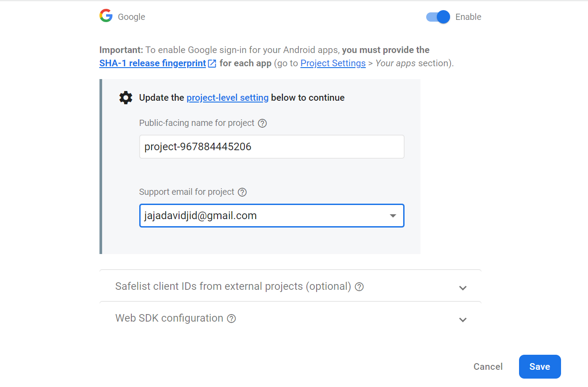
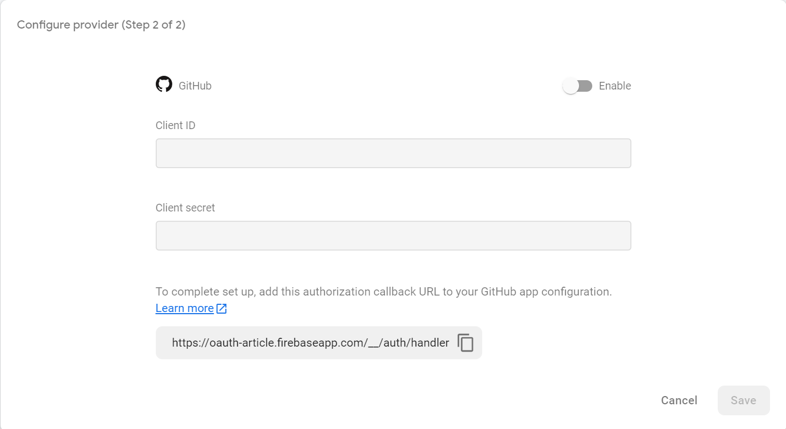
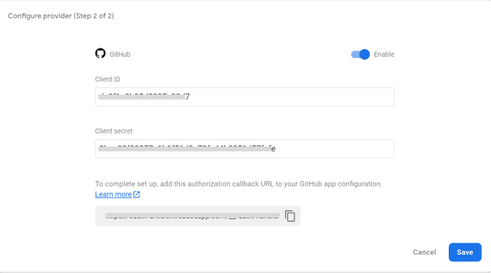
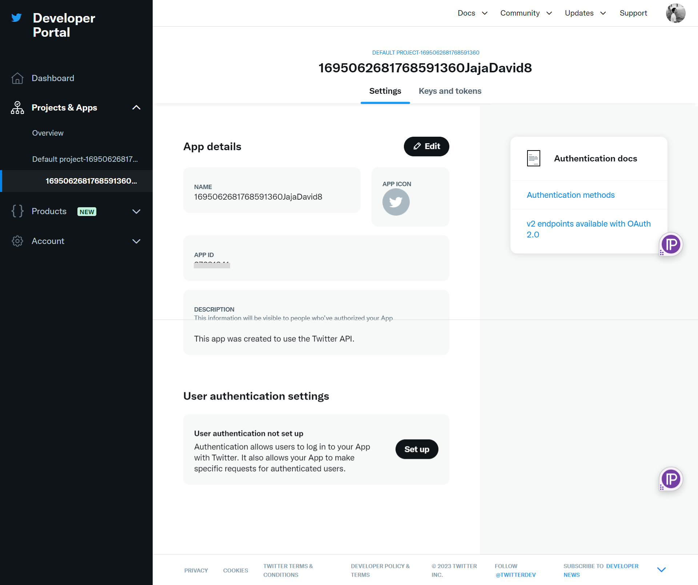
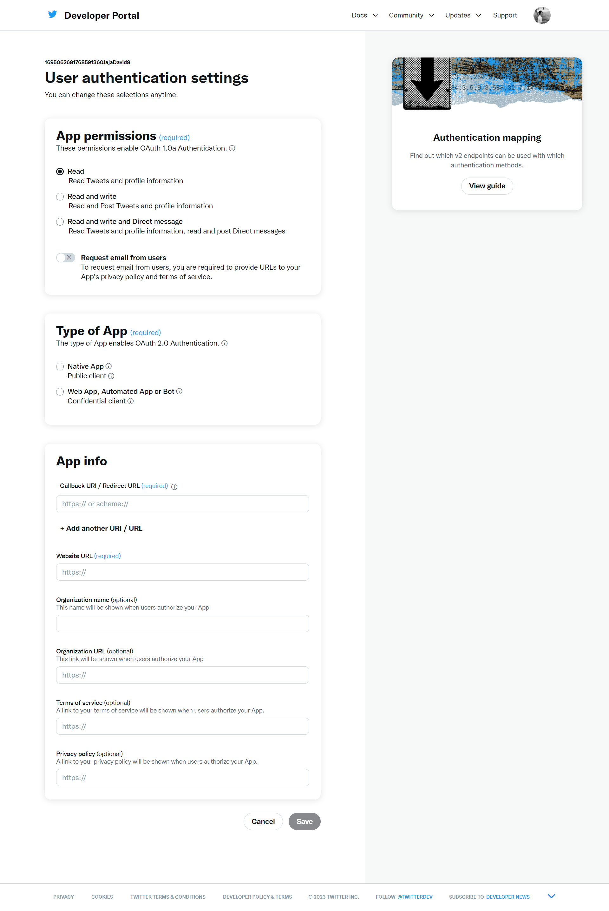
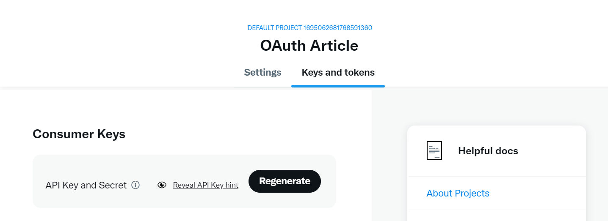
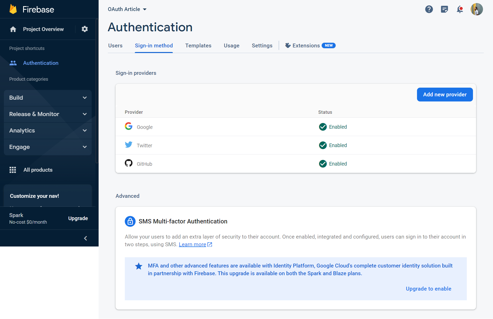
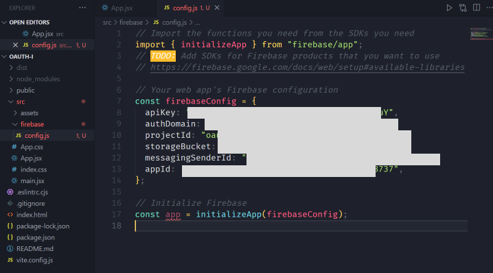
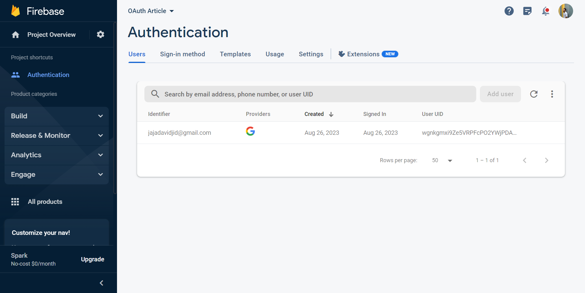
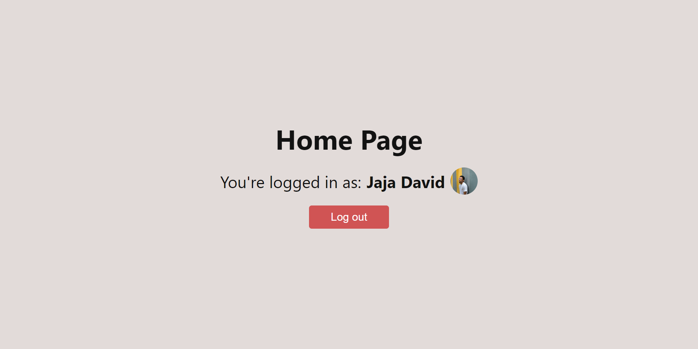

Аутентификация пользователей чрезвычайно важна в контексте веб-разработки. То, как пользователи входят в систему, влияет на их общий опыт и взаимодействие с приложением. Он также влияет на то, как они изначально воспринимают приложение.

Методы аутентификации постоянно развиваются, поскольку сайты социальных сетей продолжают набирать популярность. Возможность входа в веб-приложения с помощью учетных записей социальных сетей - полезное достижение в этой области.

В этой статье рассказывается о том, как можно улучшить процесс входа пользователей в веб-приложения, используя аутентификацию в социальных сетях через Firebase. В ней рассматриваются преимущества, методы настройки и способы интеграции, а также предлагаются полезные рекомендации.

## Зачем использовать аутентификацию в социальных сетях?

Наверняка вы уже устали от привычной процедуры ввода имени пользователя и пароля при входе на новую платформу. Часто приходится придумывать новый пароль на месте или прибегать к небезопасным соглашениям о паролях, которые могут предоставить несанкционированный доступ к вашим многочисленным аккаунтам.

К счастью, аутентификация в социальных сетях имеет ряд преимуществ:

1. Удобство для пользователя: Варианты авторизации в социальных сетях упрощают процесс регистрации, делая его удобным для пользователей при начале использования приложения.
2. Повышенная безопасность: Платформы социальных сетей применяют надежные меры безопасности, которые повышают безопасность пользователей вашего приложения.
3. Устранение проблем с паролями: Благодаря аутентификации в социальных сетях пользователи освобождаются от необходимости запоминать многочисленные пароли, что уменьшает неудобства, связанные с управлением учетными данными.
4. Сокращение числа оставленных учетных записей: Вход в систему через социальные сети побуждает пользователей присоединиться к вашему приложению и взаимодействовать с ним, сводя к минимуму вероятность того, что они оставят процесс регистрации незавершенным.
5. Доступ к достоверной информации о пользователях: Платформы социальных сетей предоставляют значительный объем информации о пользователях, которую можно использовать для персонализации опыта, предлагаемого вашим приложением.
6. Упрощенное восстановление учетной записи: В случаях, когда забыт пароль, аутентификация в социальных сетях предоставляет пользователям простой способ восстановить доступ к своим аккаунтам.

Таким образом, аутентификация в социальных сетях - это удобный и безопасный способ для пользователей присоединиться к вашему приложению и использовать его. Она повышает качество обслуживания пользователей, снижает количество отказов от использования аккаунтов и предоставляет вам доступ к ценным сведениям о пользователях.

## Предварительные условия

Эта статья предназначена для тех, кто хорошо знаком со следующими понятиями:

- HTML, CSS и JavaScript
- React и React Routing
- Фундаментальное знакомство с использованием Firebase

## Что такое Firebase и зачем использовать его для аутентификации?

Firebase служит комплексной платформой, предоставляющей разработчикам бэкэнд-сервисы и инструменты для создания веб- и мобильных приложений.

Одним из ее ключевых предложений является служба аутентификации, которая упрощает процесс интеграции функций аутентификации в приложения.

С [Firebase](https://firebase.google.com/) реализация аутентификации становится более простой, благодаря наличию готовых компонентов пользовательского интерфейса, удобных для разработчиков API и поддержке различных методов аутентификации.

## Как настроить Firebase для аутентификации в социальных сетях

### Шаг 1: Создайте проект Firebase

1. Перейдите на [Консоль Firebase](https://console.firebase.google.com/) и войдите под своей учетной записью Google.
2. Нажмите кнопку "Добавить проект".
3. Введите название проекта и выберите место для хранения данных.
4. Нажмите кнопку "Создать".

Главная страница консоли Firebase

### Шаг 2: Зарегистрируйте веб-приложение

Эта функция позволяет зарегистрировать веб-приложения, чтобы получить доступ к функциям Firebase через веб-приложения.

1. В консоли Firebase Console щелкните значок "Web" (</>).
2. Нажмите кнопку "Добавить приложение".
3. Введите название приложения и выберите тип приложения "Web".
4. Нажмите кнопку "Зарегистрировать".

После того как вы создали проект Firebase и зарегистрировали веб-приложение, вы можете начать использовать Firebase для аутентификации в социальных сетях.

### Шаг 3: Знакомство с методами авторизации в социальных сетях

Для этого после создания проекта вам нужно перейти в раздел "Аутентификация" в левом меню.

Показ боковой панели аутентификации

На вкладке "Метод входа" вы найдете список поставщиков услуг аутентификации, из которого можете выбрать одного:

Отображение различных методов аутентификации

### Шаг 4: Настройка провайдеров социальных сетей

#### Как настроить аутентификацию Google:

Чтобы настроить Google auth, просто добавьте электронную почту службы поддержки, и все готово.



Добавление почты поддержки для google auth

#### Как настроить GitHub auth:

Чтобы настроить GitHub auth, вам понадобятся Client ID и Client Secret. Чтобы получить их, войдите в свой [GitHub аккаунт](https://github.com/) и перейдите в Настройки > Настройки разработчика.


Панель настроек Github

Затем перейдите в раздел OAuth и создайте новое OAuth-приложение.

Создание OAuth-приложения github

Чтобы получить обратный вызов авторизации, вернитесь в консоль Firebase и скопируйте URL в настройках GitHub.



URL-адрес обратного вызова GitHub

Примечание: Чтобы выполнить этот процесс, вам нужно иметь уже размещенное приложение или хотя бы URL-адрес, на котором будет размещено ваше приложение.

Далее вы попадете на страницу, где ваше приложение уже зарегистрировано, и у вас есть идентификатор и секрет клиента.

Сгенерированные идентификатор клиента и секрет GitHub

Скопируйте эти данные и используйте их для регистрации GitHub в качестве сервиса аутентификации на Firebase.



Заполнение деталей GitHub в Firebase

#### Как настроить Twitter auth:

Как и в случае с Github, начните с входа в свой аккаунт разработчика Twitter. Если у вас его нет, зарегистрируйтесь на [Twitter Developer Portal](https://developer.twitter.com/en/portal/petition/essential/basic-info). Это выглядит примерно так:

Регистрация разработчиков Twitter

После заполнения данных вы попадете на главную страницу.



Домашняя страница Twitter Dev

Выберите приложение по умолчанию и настройте аутентификацию пользователя.



Настройка приложения Twitter OAuth

Не забудьте получить URL обратного вызова из Firebase и установить URL веб-сайта на URL, на котором размещено ваше приложение.

После настройки перейдите к ключам и токенам вашего проекта и сгенерируйте новые.



Генерация новых ключа и секрета приложения

Вставьте эти данные обратно в Firebase, чтобы настроить Twitter auth.

Таким образом, три ваши платформы социальных сетей настроены для аутентификации.



Все аутентификаторы настроены

##

Как настроить React-приложение

Теперь нам нужно настроить ваше приложение React. Для начала создайте новое приложение React с помощью [Vite](https://vitejs.dev/guide/).

Создайте папку на вашем компьютере и откройте ее с помощью выбранной вами IDE. Откройте терминал этой IDE и выполните следующую команду:

```bash
npm create vite@latest

```

Когда загрузится информация, выберите React и дождитесь завершения установки.

Создание React-приложения с помощью Vite

У вас останется горстка файлов и немного шаблонного кода, от которого можно избавиться.

Далее запустите `npm run dev` в терминале, чтобы запустить сервер разработки на порту `http://localhost:5173/`.


Приложение React, работающее в браузере

Чтобы использовать Firebase в своем приложении, вы должны сначала определить файл конфигурации Firebase. Этот файл содержит все необходимые данные, используемые для идентификации вашего приложения Firebase.

Поэтому создайте в директории `src папку с названием `firebase`. Затем вложите в эту папку файл `config.js` и вставьте в него данные файла конфигурации из консоли Firebase, которую вы сохранили ранее.



Детали конфигурации Firebase

Наконец, установите Firebase через терминал, чтобы использовать его сервисы в своем приложении.

```bash
npm i firebase
```

## Как интегрировать аутентификацию в социальных сетях в ваше приложение

Учитывая, насколько большим будет этот раздел, мы разделим его на несколько подразделов.

1. Настройка логики пользовательского интерфейса для аутентификации
2. Настройка логики аутентификации
3. Реализация глобального состояния аутентификации
4. Создание пользовательского хука для аутентификации в социальных сетях
5. Создание маршрутов и реализация маршрутизации
6. Аутентификация в социальных сетях
7. Защита маршрутов с помощью состояния пользователя
8. Создание крючка useLogout
9. Тестирование функциональности выхода из системы

### Как настроить логику пользовательского интерфейса для аутентификации

Создайте папку (pages) в директории `src`, в которой будут храниться страницы, которые вы хотите видеть в своем приложении.

Для данной реализации в папке pages будет 2 файла, `Auth.jsx` и `Home.jsx`. Эти файлы будут выступать в качестве страниц, которые пользователь может видеть как при аутентификации, так и без нее.

### Как настроить логику аутентификации

Начните с импорта и инициализации Firebase auth, а также платформ социальных сетей, включенных в Firebase в вашем конфиге.

```js
импорт {
getAuth,
GoogleAuthProvider,
GithubAuthProvider,
TwitterAuthProvider,
} из 'firebase/auth';

// Инициализация Firebase
const app = initializeApp(firebaseConfig);
const auth = getAuth(app);

const googleProvider = новый GoogleAuthProvider();
const githubProvider = новый GithubAuthProvider();
const twitterProvider = new TwitterAuthProvider();

```

Затем экспортируйте эти инициализированные функции, чтобы использовать их в других частях вашего приложения.

```js
export { auth, googleProvider, githubProvider, twitterProvider };
```

### Как реализовать состояние глобальной аутентификации

Чтобы обеспечить согласованное состояние аутентификации во всем приложении, используйте подход React Context.

#### Шаг 1: Создайте AuthContext

Начните с создания папки context в каталоге src, а затем создайте в ней файл `AuthContext.jsx`. В файле `AuthContext` импортируйте необходимые хуки из React и Firebase.

```js
import { createContext, useReducer, useEffect, useContext } from 'react';
import { auth } from '../firebase/config';

export const AuthContext = createContext();
```

#### Шаг 2: Определите функцию редуктора

Сконструируйте функцию-редуктор для управления изменениями состояния при выполнении действий, связанных с аутентификацией, используя следующий код:

```js
export const authReducer = (state, action) => {
	switch (action.type) {
		// Если тип действия "LOGIN", обновляем состояние новой информацией о пользователе
		case 'LOGIN':
			return { ...state, user: action.payload };

		// Если тип действия "LOGOUT", обновите состояние, чтобы удалить информацию о пользователе
		case 'LOGOUT':
			return { ...state, user: null };

		// Когда тип действия "AUTH_IS_READY", обновляем состояние с информацией о пользователе и
		// устанавливаем состояние, указывающее на завершение процесса аутентификации
		case 'AUTH_IS_READY':
			return { user: action.payload, authIsReady: true };

		// Для любого другого типа действия возвращается текущее состояние без каких-либо изменений
		default:
			return state;
	}
};
```

#### Шаг 3: Создание компонента AuthContextProvider

Создайте компонент-провайдер, который обернет весь ваш компонент App, используя редуктор для управления состоянием аутентификации.

```js
import { useEffect, useReducer } из 'react';
import { onAuthStateChanged } from 'firebase/auth';

// Компонент провайдера контекста аутентификации
export const AuthContextProvider = ({ children }) => {
// Инициализация состояния аутентификации с помощью редуктора
const [state, dispatch] = useReducer(authReducer, {
user: null,
authIsReady: false,
});

    // Эффект для определения начального состояния аутентификации и обновления контекста
    useEffect(() => {
    	// Подписка на изменения состояния аутентификации
    	const unsub = onAuthStateChanged(auth, (user) => {
    		// Отправляем действие для обновления состояния с информацией о пользователе
    		dispatch({ type: 'AUTH_IS_READY', payload: user });

    		// Отпишитесь от рассылки, чтобы избежать дальнейших ненужных обновлений
    		unsub(); // Отписываемся после определения начального состояния аутентификации
    	});
    }, []);

    // Предоставляем состояние аутентификации и функцию диспетчеризации дочерним компонентам
    return <AuthContext.Provider value={{ ...state, dispatch }}>{children}</AuthContext.Provider>;

};

```

#### Шаг 4: Реализация пользовательского хука useAuthContext

Вы можете упростить доступ к контексту аутентификации с помощью пользовательского хука, например, так:

```js
import { useContext } из 'react';

// Пользовательский хук для доступа к контексту аутентификации
export function useAuthContext() {
	// Получение контекста аутентификации от ближайшего провайдера AuthContextProvider
	const context = useContext(AuthContext);

	// Проверяем, успешно ли получен контекст
	if (!context) {
		throw Error('useAuthContext должен быть использован внутри AuthContextProvider');
	}

	// Возвращаем объект контекста аутентификации для использования в компонентах
	return context;
}
```

#### Как интегрировать AuthContextProvider

Наконец, интегрируйте `AuthContextProvider` в основную настройку вашего приложения

```js
import React from 'react';
import ReactDOM from 'react-dom/client';
import App from './App.jsx';
import './index.css';
import { AuthContextProvider } from './context/AuthContext.jsx';

ReactDOM.createRoot(document.getElementById('root')).render(
	<React.StrictMode>
		<AuthContextProvider>
			<App />
		</AuthContextProvider>
	</React.StrictMode>,
);
```

Таким образом, все части вашего приложения могут получить доступ к значениям контекста из `AuthContext`.

### Как создать пользовательский хук для аутентификации в социальных сетях

Процессы аутентификации Firebase похожи по паттерну и структуре кода. Поэтому хорошей идеей будет следовать принципу DRY и создать пользовательский хук, выполняющий аутентификацию для всех платформ социальных сетей. Это позволит вам повторно использовать один и тот же код для каждой платформы, что сделает ваш код более эффективным и простым в сопровождении.

Ниже приведен пошаговый процесс создания пользовательского хука для аутентификации в социальных сетях.

#### Шаг 1: Создание пользовательского хука

В каталоге исходных текстов создайте папку hooks, а в ней - файл с именем `useSocialSignup.jsx`.

#### Шаг 2: Импорт зависимостей

Импортируйте необходимые функции из React и Firebase в файл `useSocialSignup`.

```js
import { useEffect, useState } from 'react';
import { signInWithPopup } from 'firebase/auth';
import { auth } from '../firebase/config';
import { useAuthContext } from '../context/AuthContext';
```

#### Шаг 3: Определите функцию hook

Разработайте функцию `useSocialSignup`, которая принимает провайдера в качестве параметра и возвращает объект, содержащий состояние ошибки, состояние ожидания и функцию входа для социального провайдера.

```js
export const useSocialSignup = (provider) => {
	// Переменные состояния для управления процессом регистрации
	const [error, setError] = useState(null);
	const [isPending, setIsPending] = useState(false);
	const [isCancelled, setIsCancelled] = useState(false);

	// Доступ к функции диспетчеризации контекста аутентификации
	const { dispatch } = useAuthContext();

	// Функция для запуска процесса социальной регистрации
	const signInWithSocial = async () => {
		setError(null);
		setIsPending(true);

		try {
			const res = await signInWithPopup(auth, provider);

			dispatch({ type: 'LOGIN', payload: res.user });

			if (!isCancelled) {
				setIsPending(false);
				setError(null);
			}
		} catch (err) {
			setError(err.message);
			setIsPending(false);
		}
	};

	// Хук эффекта для установки значения isCancelled в true при размонтировании компонента
	useEffect(() => {
		return () => setIsCancelled(true);
	}, []);

	// Возвращаемые значения и функции для использования компонента
	return { error, isPending, signInWithSocial };
};
```

Этот хук инкапсулирует процесс регистрации у социальных провайдеров. Он управляет состояниями ошибки, ожидания и отмены, взаимодействует с аутентификацией Firebase и использует контекст аутентификации для отправки действий.

### Как создавать маршруты и реализовывать маршрутизацию

Для обеспечения плавной навигации и удобства работы пользователей настройка маршрутов становится решающим моментом после реализации логики аутентификации. Эти хорошо организованные шаги помогут вам пройти этот процесс.

#### Шаг 1: Установите react-router-dom

Установите [пакет react-router-dom](https://www.npmjs.com/package/react-router-dom), популярный выбор для управления маршрутизацией в приложениях React.

```bash
npm i react-router-dom

```

#### Шаг 2: Импорт зависимостей

В файле `App.jsx` импортируйте необходимые компоненты и функции для маршрутизации.

```js
import { BrowserRouter, Navigate, Route, Routes } из 'react-router-dom';
import './App.css';
import Home from './pages/Home';
import Auth from './pages/Auth';
```

#### Шаг 3: Определите маршруты

Оберните содержимое вашего приложения в компонент BrowserRouter и используйте компонент Routes для определения маршрутов. Используйте компонент Route для сопоставления каждого пути маршрута с соответствующим компонентом.

```js
function App() {
return (
<BrowserRouter>
<Маршруты>
<Route path="/" element={<Home />} />
<Route path="/auth" element={<Auth />} />
<Рауты>
</BrowserRouter>
);
}

```

На данный момент вы можете свободно перемещаться между маршрутами, например, так:

Перемещение между маршрутами без авторизации

### Аутентификация в социальных сетях

Чтобы убедиться, что ваши усилия не пропали даром, перейдите к `Auth.jsx` для реализации аутентификации.

#### Шаг 1: Импорт deвакансии

В файле `Auth.jsx` начните с импорта необходимых провайдеров, контекста и пользовательского хука регистрации.

```js
импорт {
  googleProvider,
  twitterProvider,
  githubProvider,
} из "../firebase/config";
import { useSocialSignup } from "./hooks/useSocialSignup";
import {useEffect} from 'react'

import {useAuthContext} from "../context/AuthContext"
```

#### Шаг 2: Создайте экземпляры хука

Создайте экземпляры пользовательского хука `useSocialSignup` для каждого провайдера аутентификации.

```js
const google = useSocialSignup(googleProvider);
const twitter = useSocialSignup(twitterProvider);
const github = useSocialSignup(githubProvider);
```

#### Шаг 3: Добавьте кнопки для социальной подписки

Создайте кнопки для каждого варианта социальной подписки (Google, Twitter, GitHub) и прикрепите обработчики событий onClick для вызова функции `signInWithSocial из соответствующего хука.

```js
возврат(
	<div className="utility__page">
		<h1>Приветствую вас на моей Auth-странице</h1>.
		<button onClick={google.signInWithSocial}>
			
			<span>Google</span>
		</button>
		<button onClick={twitter.signInWithSocial}>
			.
			
			<span>Twitter</span>
		</button>
		<button onClick={github.signInWithSocial}>
			.
			
			<span>GitHub</span>
		</button>
	</div>,
);
```

#### Шаг 4: Примените стилистику

Вы можете использовать предоставленный ниже CSS для стилизации компонентов, чтобы придать им чистый и организованный вид.

```css
- {
	box-sizing: border-box;
	margin: 0;
	padding: 0;
}

html {
	font-size: 62.5%;
	цвет: #121212;
}

.utility\_\_page {
	display: flex;
	ширина: 100%;
	высота: 100vh;
	justify-content: center;
	align-items: center;
	font-family: 'Segoe UI', Tahoma, Geneva, Verdana, sans-serif;
	row-gap: 2rem;
	flex-direction: column;
	background: #e2dbd9;
}

h1 {
	font-size: 5rem;
}

button {
	padding: 1rem 4rem;
	font-size: 2rem;
	border: none;
	курсор: указатель;
	border-radius: 5px;
	display: flex;
	justify-content: center;
	align-items: center;
	gap: 1rem;
}

button img {
	ширина: 20px;
	высота: 20px;
}

.user {
	font-size: 3rem;
	display: flex;
	align-items: center;
	column-gap: 1rem;
}

.logout {
	фон: rgb(208, 84, 84);
	color: #fff;
}

.profile_img {
	ширина: 5rem;
	высота: 5rem;
	border-radius: 50%;
}
```

На данный момент ваша страница авторизации выглядит примерно так:

Страница авторизации после применения стилизации

#### Шаг 5: Проверка аутентификации

Чтобы протестировать аутентификацию, импортируйте пользователя из `AuthContext` и зарегистрируйте его в консоли с помощью `useEffect`.

```js
const { user } = useAuthContext();
useEffect(() => console.log(user), [user]);
```

Тестирование auth теперь дает следующее:

Аутентификация подтверждена в консоли через объект user

Как видите, вы успешно зарегистрировали пользователя с помощью Social Media Authentication. Молодцы!

Чтобы подтвердить это, перейдите на страницу аутентификации Firebase и проверьте наличие действительных пользователей.



Подтверждение зарегистрированного пользователя на Firebase

Не стесняйтесь пробовать другие методы входа, все они работают одинаково.

### Route Gaurding через состояние пользователя

Чтобы предотвратить несанкционированный доступ, установите в файле `App.jsx` защиту маршрутов, которая проверяет состояние аутентификации пользователя.

```js
const { user, authIsReady } = useAuthContext();

if (!authIsReady) {
return null; // Возвращаем null в ожидании authIsReady
}

return (
<BrowserRouter>
<Routes>
{ user ? (
<>
{/_ Аутентифицированные маршруты _/}
<Route path="/" element={<Home />} />
{/_ Охранники маршрутов _/}
<Route path="_" element={<Navigate to="/" />} />
</>
) : (
<>
{/_ Маршруты аутентификации _/}
<Route path="/auth" element={<Auth />} />
{/_ Охранники маршрутов _/}
<Route path="_" element={<Navigate to="/auth" />} />
</>
)}
</Routes>
</BrowserRouter
);

```


Переход на домашнюю страницу после добавления стражей маршрута

Как видите, вы попали на главную страницу, и даже если вы попытаетесь перейти на страницу авторизации, вы будете направлены обратно сюда.

#### Как настроить домашнюю страницу

Для домашней страницы получите данные о пользователе и отобразите их, если пользователь прошел аутентификацию.

```js
import { useAuthContext } из '../context/AuthContext';

export default function Home() {
	const { user } = useAuthContext();
	return (
		<div className="utility__page">
			<h1>Домашняя страница</h1>
			{ user && (
				<>
					<div className="user">
						Вы&apos;вошли в систему как:

						<span>{user.displayName} </span>
						
					</div>
				</>
			)}
		</div>
	);
}
```

Главная pвозраст, показывающий пользовательские данные о пользователе

И вуаля! Вы смогли получить некоторые сведения об этом пользователе на основе информации о социальных сетях, которые он использовал для входа в систему.

### Как создать хук useLogout

Последний шаг к завершению процесса аутентификации - это предоставление пользователям возможности выйти из приложения. Вот как создать хук useLogout:

#### Шаг 1: Создайте хук

Создайте новый файл useLogout.jsx в папке hooks. Импортируйте необходимые хуки и функции.

```js
import { useEffect, useState } из 'react';
import { auth } from '../firebase/config';
import { signOut } from 'firebase/auth';
import { useAuthContext } from '../context/AuthContext';

```

#### Шаг 2: Создание состояний хука

Создайте состояния для управления процессом выхода из системы, включая состояния ошибки, ожидания и отмены.

```js
// Состояние ошибки для потенциальных ошибок во время выхода из системы
const [error, setError] = useState(null);
// Состояние, указывающее, идет ли выход из системы
const [isPending, setIsPending] = useState(false);
// Состояние для отслеживания отмены операции
const [isCancelled, setIsCancelled] = useState(false);
```

#### Шаг 3: Извлечение функции диспетчеризации из контекста аутентификации

Эта функция будет использоваться для индикации того, что было вызвано действие выхода из системы:

```js
const { dispatch } = useAuthContext();
```

#### Шаг 4: Создайте логику хука

С помощью блока try-catch создайте логику выхода пользователя из системы:

```js
try {
	// Инициируем выход из системы с помощью функции Firebase signOut
	await signOut(auth);
	dispatch({ type: 'LOGOUT' }); // Отправка действия LOGOUT
	// Если операция не была отменена, сбрасываем состояние ожидания и ошибку
	if (!isCancelled) {
		setIsPending(false); // Сброс isPending после завершения асинхронного вызова
		setError(null); // Очистка любой ошибки, которая могла произойти
	}
} catch (err) {
	// Обработка ошибки выхода из системы
	if (!isCancelled) {
		console.log(err.message); // Вывод сообщения об ошибке в лог
		setError(err.message); // Установка состояния ошибки в случае ее возникновения
		setIsPending(false); // Сброс состояния ожидания при возникновении ошибки
	}
}
```

#### Шаг 5: Как обрабатывать размонтирование

В случае, когда компонент размонтирован (страница закрывается или происходит изменение маршрута), вам нужно обработать это событие, чтобы предотвратить ошибки.

```js
// Хук эффекта для установки значения isCancelled в true при размонтировании компонента
useEffect(() => {
return () => setIsCancelled(true); // Функция очистки запускается, когда компонент размонтируется }, []);

```

#### Шаг 5: Экспорт значений

Верните соответствующие значения и функции для использования другими компонентами.

```js
return { logout, error, isPending };
```

Для удобства использования здесь приведен полный хук useLogout.

```js
// Импортируем необходимые хуки и функции
import { useEffect, useState } from 'react';
import { auth } from '../firebase/config'; // Импортируем экземпляр аутентификации Firebase
import { signOut } from 'firebase/auth'; // Импорт функции signOut из Firebase
import { useAuthContext } from '../context/AuthContext'; // Импортируем пользовательский хук для доступа к контексту аутентификации

// Пользовательский хук для обработки выхода пользователя из системы
export const useLogout = () => {
	// Переменные состояния для управления процессом выхода из системы
	const [error, setError] = useState(null); // Состояние ошибки для возможных ошибок при выходе из системы
	const [isPending, setIsPending] = useState(false); // Состояние, указывающее, выполняется ли выход из системы
	const [isCancelled, setIsCancelled] = useState(false); // Состояние для отслеживания отмены операции
	const { dispatch } = useAuthContext(); // Доступ к функции диспетчеризации контекста аутентификации

	// Функция для инициирования процесса выхода из системы
	const logout = async () => {
		setError(null); // Очистка всех предыдущих ошибок
		setIsPending(true); // Указывает, что процесс выхода из системы продолжается

		try {
			// Инициирование выхода из системы с помощью функции Firebase signOut
			await signOut(auth);
			dispatch({ type: 'LOGOUT' }); // Отправка действия LOGOUT

			// Если операция не была отменена, сбрасываем состояние ожидания и ошибку
			if (!isCancelled) {
				setIsPending(false); // Сброс isPending после завершения асинхронного вызова
				setError(null); // Очистка любой ошибки, которая могла произойти
			}
		} catch (err) {
			// Обработка ошибки выхода из системы
			if (!isCancelled) {
				console.log(err.message); // Вывод сообщения об ошибке в лог
				setError(err.message); // Установка состояния ошибки в случае ее возникновения
				setIsPending(false); // Сброс состояния ожидания при возникновении ошибки
			}
		}
	};

	// Хук эффекта для установки значения isCancelled в true при размонтировании компонента
	useEffect(() => {
		return () => setIsCancelled(true); // Функция очистки запускается, когда компонент размонтируется
	}, []);

	// Возвращение соответствующих значений и функций для использования компонента
	return { logout, error, isPending };
};
```

### Как протестировать функциональность выхода из системы

В компоненте Home.jsx импортируйте хук useLogout и извлеките функцию выхода из системы. Прикрепите функцию выхода из системы к событию `onClick` кнопки, чтобы пользователи могли выходить из системыg out.

```js
import { useLogout } from '../hooks/useLogout';

export default function Home() {
	const { user } = useAuthContext();
	const { logout } = useLogout(); // функция выхода из системы извлечена

	возврат(
		<div className="utility__page">
			<h1>Домашняя страница</h1>
			{user && (
				<>
					<div className="user">
						Вы&apos;вошли в систему как:
						<span>{user.displayName} </span>
						
					</div>
					//используется функция выхода из системы
					<button className="logout" onClick={logout}>
						Выход из системы
					</button>
				</>
			)}
		</div>,
	);
}
```

На данный момент ваша главная страница выглядит следующим образом;



Главная страница перед выходом пользователя из системы

Нажмите на кнопку и выйдите из системы.

Тестирование функциональности входа и выхода из системы

Итак, процесс аутентификации полностью настроен, поздравляем!

## Правильный баланс: Аутентификация через социальные сети и по электронной почте/паролю

Аутентификация пользователей - это ключевая часть работы с любым веб-приложением. Аутентификация в социальных сетях может обеспечить упрощенный опыт и повышенную безопасность, но важно найти баланс, предлагая также возможность аутентификации по электронной почте/паролю. Это обеспечивает инклюзивность, учитывает различные предпочтения пользователей и решает проблемы конфиденциальности.

Предлагая оба варианта, вы создаете универсальный и ориентированный на пользователя процесс аутентификации, способствующий положительному опыту пользователей.

Пример идеальной страницы аутентификации приведен ниже.

Стандартная страница аутентификации

## Руководство по созданию страниц авторизации

При создании страниц аутентификации важно применять некоторые основные передовые методы, такие как:

1. Показывать все возможные способы аутентификации пользователя в ясной и краткой форме.
2. Использование аутентичных иконок компаний для создания доверия. Вы можете найти бесплатные SVG компании на таких сайтах, как [Font Awesome](https://fontawesome.com/), [Google icons](https://fonts.google.com/icons) и т. д.
3. Используйте интуитивно понятные иконки для обозначения вводимых данных, например, конверт для почты или замок для пароля.
4. Устраните проблемы конфиденциальности, четко объяснив, как будут использоваться и защищаться данные пользователя в процессе аутентификации.

Для облегчения доступа вот ссылка на [repo](https://github.com/Daiveedjay/OAuth-Article).

## Заключение

В заключение отметим, что использование логинов социальных сетей в Firebase - это разумная стратегия. Она объединяет в себе удобство для пользователя, безопасность и конфиденциальность.

Предлагая различные способы входа в систему, сайты могут учитывать различные предпочтения пользователей, быть более инклюзивными и адаптироваться к новым тенденциям.

Подобный баланс вариантов аутентификации делает пользователей счастливыми и укрепляет доверие. Это важно для создания современных сайтов и обеспечения беспроблемного входа в систему, ориентированного на пользователя.

### Контактная информация

Хотите связаться со мной? Не стесняйтесь связаться со мной по следующим адресам:

- Twitter / X : [@jajadavid8](https://twitter.com/JajaDavid8)
- LinkedIn: [David Jaja](https://www.linkedin.com/in/david-jaja-8084251b4/)
- Email: Jajadavidjid@gmail.com
