Диаграммы - важная часть технической документации. В этой статье мы рассмотрим, как можно использовать код для создания диаграмм и использовать их в Markdown.

Вот пример того, как выглядит диаграмма, сгенерированная с помощью кода:

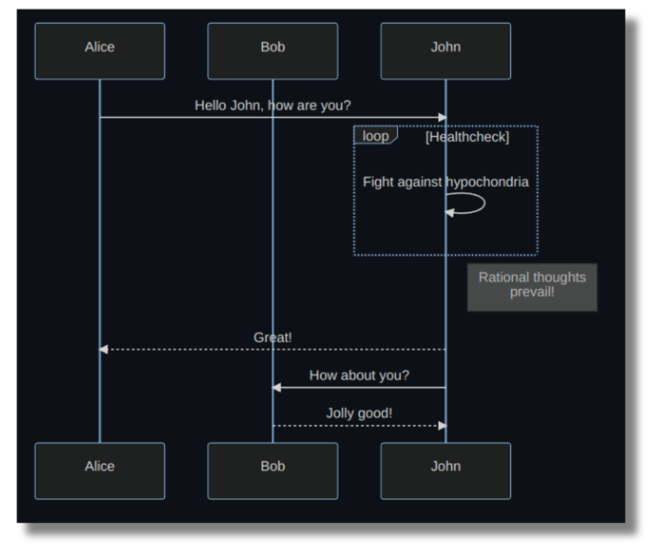

Диаграмма, сгенерированная кодом

Никаких инструментов, никакого перетаскивания, выравнивания и привязки фигур к местам. Только код. Интересно, правда?

## Предварительные условия

Чтобы следовать этому руководству, у вас должно быть следующее:

- Базовое понимание Markdown. Посмотрите [это руководство](https://www.freecodecamp.org/news/markdown-cheat-sheet/), если вы не знакомы с Markdown.
- Visual Studio Code с расширением для предварительного просмотра Markdown (подробно об этом в следующих разделах).
- GitHub, чтобы понять, как там можно отображать диаграммы.

## Преимущества генерации диаграмм в виде кода

Существует несколько преимуществ генерации диаграмм в виде кода, а не использования традиционных методов ручного ”создания" диаграмм. Давайте рассмотрим некоторые из них:

- **Динамичность**: Диаграммы, сгенерированные в виде кода, являются динамическими, что означает, что вы можете легко обновить их путем обновления кода.
- **Редактируемые**: При использовании изображений, сгенерированных с помощью кода, вы не полагаетесь на сложные инструменты генерации изображений. Вы можете просто отредактировать код в текстовом редакторе и получить обновленное изображение.
- **Эффективность**: Генерируемые с помощью кода изображения загружаются быстрее, чем статичные. Кроме того, вам не нужно размещать их отдельно в виде изображения на своем сайте.
- **Быстрота создания**: Вы можете использовать шаблон и быстро создавать диаграммы, просто используя код. Вам не нужно тратить время и силы на изучение инструментов для создания изображений, которые, как правило, являются непосильными для начала.

## Как визуализировать и просматривать код русалки

Существует несколько способов создания и просмотра диаграмм Mermaid.

### VSCode

Во-первых, установите программу предварительного просмотра Markdown, которая поддерживает Mermaid. Вот пример такого расширения: [Markdown Preview Mermaid Support](https://marketplace.visualstudio.com/items?itemName=bierner.markdown-mermaid).

Создайте пустой Markdown-файл с расширением `.md`. Напишите свой код в этом файле и откройте предварительный просмотр на правой панели:

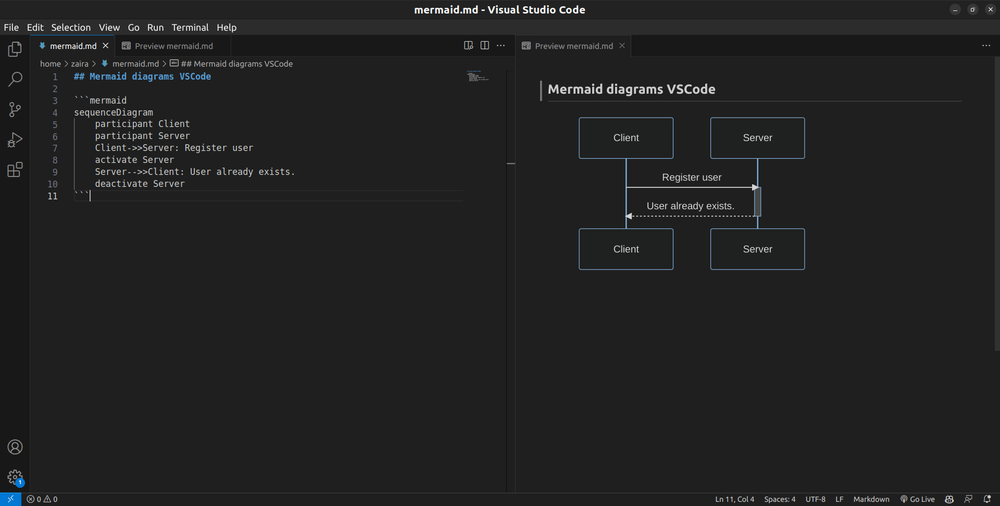

Код и предварительный просмотр в VSCode

### StackEdit

[StackEdit](https://stackedit.io/) - это онлайновый, основанный на браузере инструмент предварительного просмотра Markdown. Он предоставляет окно редактора и предварительный просмотр в правой части.

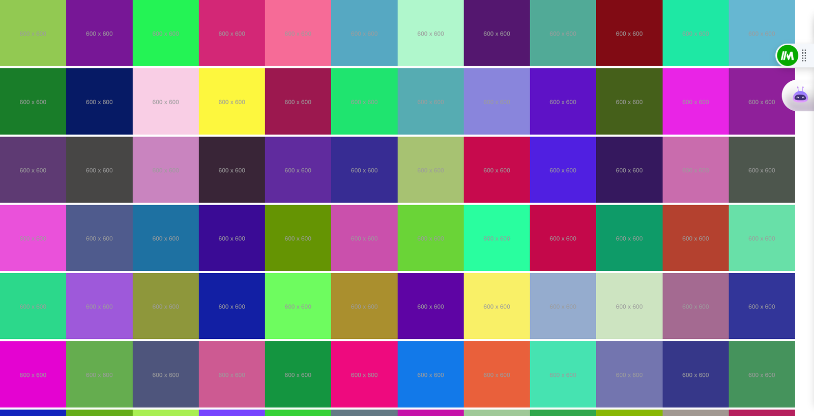

Код и предварительный просмотр в StackEdit

### GitHub

Вы можете добавить диаграммы Mermaid для создания привлекательных файлов README в GitHub. Просто отредактируйте `README.md` или любой другой файл в формате Markdown на GitHub, чтобы отобразить диаграммы Mermaid.

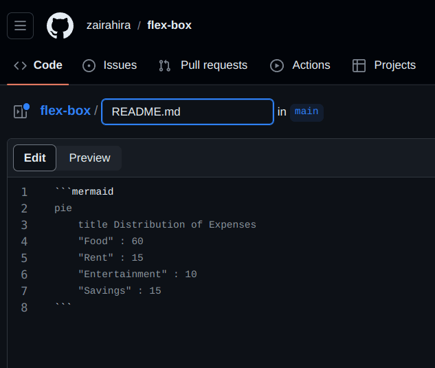

Редактирование кода в GitHub

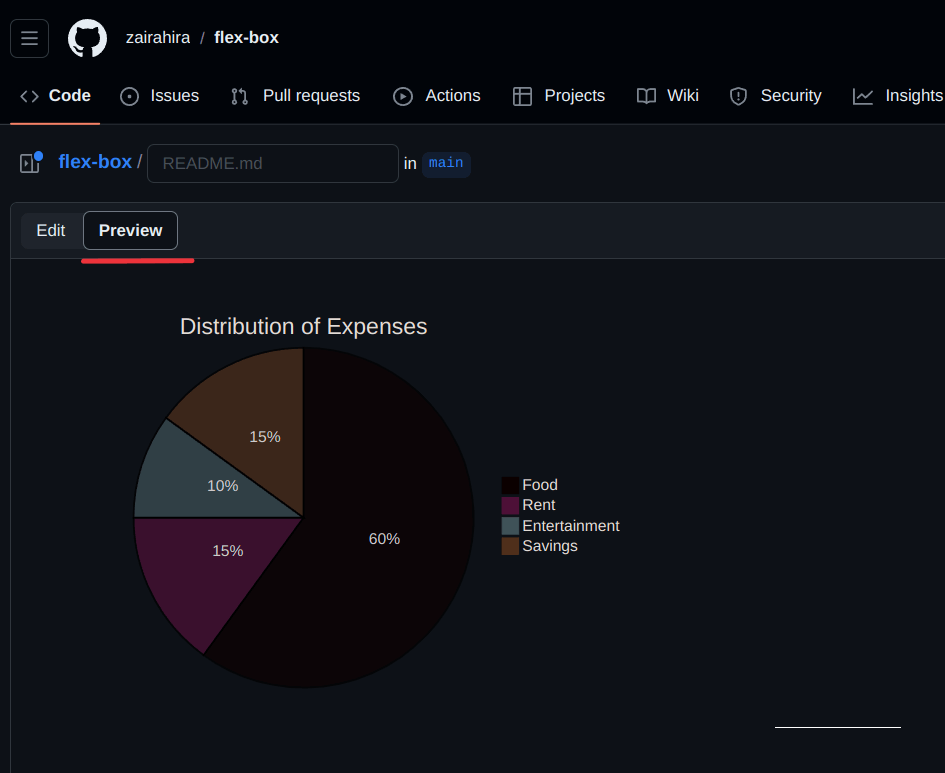

Просмотр и визуализация диаграммы Mermaid в GitHub

## Как генерировать диаграммы как код с помощью Mermaid

Mermaid - это инструмент на основе JavaScript, который преобразует текст в стиле Markdown в динамические диаграммы, позволяя вам создавать и изменять их без особых усилий.

Mermaid позволяет легко генерировать диаграммы и визуальные изображения, используя простой текст и код.

Он использует простой синтаксис:

````
Русалка
	ваш код находится здесь
    .
    .
    .

```
````

С помощью Mermaid вы можете создавать следующие типы диаграмм:

- блок-схема
- диаграмма последовательностей
- Диаграмма классов
- Гант
- Круговая диаграмма

Давайте изучим их по очереди.

### Как создать блок-схему

Блок-схема - это рисунок, который показывает этапы процесса с помощью символов, помогая объяснить процесс в ясной и организованной форме. Блок-схема состоит из узлов, которые соединены стрелками.

Вы можете создать блок-схему в mermaid, используя этот пример:

````
``mermaid
блок-схема TD;
    A[Начало] --> B[Процесс 1];
    B --> C[Процесс 2];
    C --> D[Конец];
```
````

**Результат:**

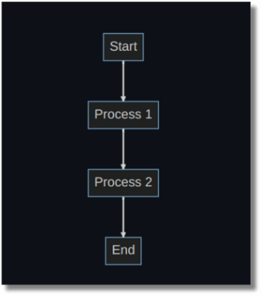

Блок-схемы в русалке

** Разбивка синтаксиса:**

- `flowchart`: Это ключевое слово говорит о том, что мы создаем блок-схему.
- `TD`: это ориентация блок-схемы и означает ”сверху вниз". Другими ориентациями FlowChart являются:
  - `TB` - сверху вниз, то же самое, что и TD.
  - `BT` - снизу вверх
  - `RL` - справа налево
  - `LR` - слева направо
- `-->`: Направление стрелки, соединяющей узлы.

### Как создать диаграмму последовательности

Диаграмма последовательности - это наглядное представление взаимодействий между процессами, демонстрирующее их рабочий поток и последовательность выполнения.

Диаграммы последовательностей можно отобразить в mermaid, используя следующий синтаксис:

````
``mermaid
sequenceDiagram
    участник-клиент
    участник Сервер
    Клиент->>Сервер: Зарегистрировать пользователя
    активировать сервер
    Сервер-->>Клиент: Пользователь уже существует.
    деактивировать сервер

```
````

**Результат:**

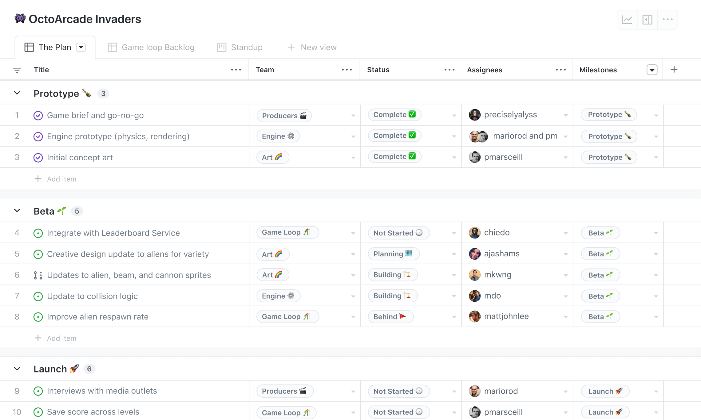

Диаграмма последовательности в русалке

** Разбивка синтаксиса:**

- `ПоследовательностьДиаграммы`: Это ключевое слово указывает на то, что мы создаем диаграмму последовательности.
- `participant`: Это участники или действующие лица диаграммы последовательности.
- `активировать/деактивировать`: Можно активироватьактивировать и деактивировать актера. Активация отображается в виде небольшого прямоугольника между взаимодействиями.
- `-->>`: Соединительные линии (пунктир).
- `->`: Соединительные линии (сплошные).

### Как создать диаграмму классов

Диаграммы классов используются для визуализации структуры и отношений классов, интерфейсов и их взаимодействий в объектно-ориентированном программировании (ООП). В Mermaid можно создавать диаграммы классов, используя следующий синтаксис:

````
``mermaid
classDiagram
    класс Animal {
        +имя: string
        +возраст: int
        +makeSound(): void
    }

    class Dog {
        +порода: string
        +bark(): void
    }

    class Cat {
        +цвет: string
        +мяуканье(): void
    }

    Животное <|-- Собака
    Животное <|-- Кошка
```
````

**Результат:**

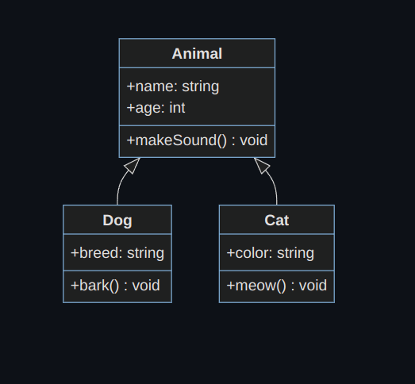

Диаграмма классов в русалке

** Разбивка синтаксиса:**

- Определение классов: Отдельный класс определяется с помощью ключевого слова `class`, за которым следует имя класса.
- Добавление свойств класса: Свойства класса добавляются с помощью знака `+`. В примере выше `+breed` является свойством.
- Добавление методов: Методы распознаются mermaid с помощью `()`, круглых скобок. Обратите внимание, что все свойства и методы группируются в один класс с помощью фигурных скобок.
- Определение типов возврата: Типы возврата определяются после имени метода/класса. В приведенном выше коде типами возврата являются `string` и `void`.
- Определение кораблей отношений: В ООП отношения - это особые типы логических связей, которые встречаются на диаграммах классов и объектов. В mermaid поддерживаются следующие типы отношений:

| Тип  | Описание         |
| ---- | ---------------- | ------------ | --- |
| <    | --               | Наследование |
| \*-- | Композиция       |
| o--  | Агрегация        |
| \--> | Ассоциация       |
| \--  | Связь (сплошная) |
| ..>  | Зависимость      |
| ..   | >                | Реализация   | …   |
| ..   | Ссылка (пунктир) |

Вот быстрая реализация наследования:

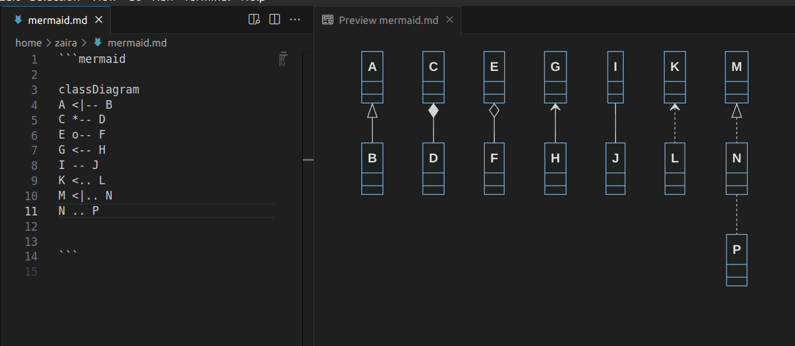

Наследование

### Как создать диаграмму Ганта

Диаграмма Ганта - это визуальное представление в виде гистограммы. Она эффективно отображает временные рамки проекта, показывая продолжительность, необходимую для завершения отдельных компонентов проекта.

Вы можете создать диаграмму Ганта в Mermaid, используя этот пример:

````
``mermaid
gantt
    заголовок Расписание проекта
    датаФормат ГГГГ-ММ-ДД
    axisFormat %m/%d

    раздел Планирование
    Определить проект : 2023-01-01, 7д
    Исследование : 2023-01-08, 14d
    Определить требования : 2023-01-22, 7d

    раздел Разработка
    Проектирование : 2023-01-29, 21d
    Реализация : 2023-02-19, 28д

    раздел Тестирование
    Единичное тестирование : 2023-03-19, 14d
    Интеграционное тестирование : 2023-04-02, 14d

    раздел Развертывание
    Развертывание : 2023-04-16, 7d
    Обучение пользователей : 2023-04-23, 14d

    раздел Сопровождение
    Текущая поддержка : 2023-05-07, 30d


```
````

**Результат**

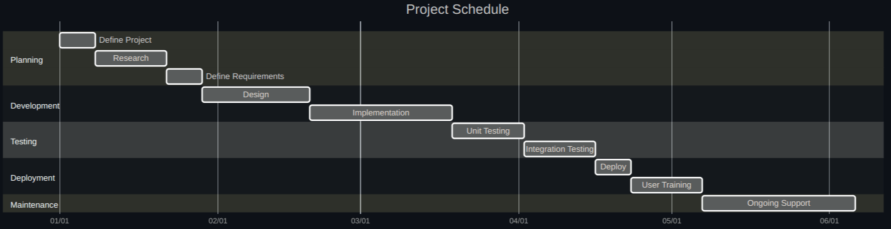

Диаграммы Ганта в русалке

** Разбор синтаксиса:**

- `gantt` указывает, что вы хотите отобразить диаграмму Ганта в mermaid.
- `title` представляет собой название проекта.
- `dateFormat YYYY-MM-DD` - формат даты, вводимой для диаграммы.
- `axisFormat %m/%d` представляет отображаемый формат даты, выходную дату, по оси x.
- `section` используется для разделения различных частей проекта.

Ось x представляет время, а y - различные задачи и порядок их выполнения.

### Как создать круговую диаграмму

Круговая диаграмма, также известная как круговая диаграмма, - это круглое визуальное представление, используемое для отображения статистических данных. Она делится на сегменты или кусочки, чтобы визуально передать числовые пропорции различных категорий или значений.

Вот пример создания круговой диаграммы в Mermaid:

````
``mermaid
pie
    название Распределение расходов
    "Еда" : 60
    "Аренда" : 15
    "Развлечения" : 10
    "Сбережения" : 15
```
````

**Результат**

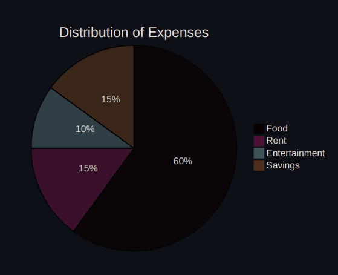

Круговые диаграммы в русалке

** Разбор синтаксиса:**

В данном примере:

- `pie` указывает, что мы создаем круговую диаграмму.
- `title` задает заголовок для круговой диаграммы.
- Элементы в двойных кавычках обозначают категории (например, ”Еда", "Аренда", "Развлечения", "Сбережения").
- Числа после двоеточия представляют собой пропорции или проценты для каждой категории. В данном случае ”Еда" занимает 60 % диаграммы, "Аренда" - 15 %, "Развлечения" - 10 %, а "Сбережения" - 15 %.

## Подведение итогов

В этой статье мы только потрогали поверхность визуализации диаграмм в Mermaid. Диаграммы очень хорошо настраиваются и позволяют создавать очень сложные диаграммы.

Mermaid поддерживает еще больше типов диаграмм, которые не были упомянуты в этом руководстве. Чтобы узнать больше о Mermaid, ознакомьтесь с их [официальной документацией](http://mermaid.js.org/).

Надеюсь, эта статья была вам полезна. Я с удовольствием пообщаюсь с вами на любой из этих [платформ](https://zaira_.bio.link/).

Увидимся в следующем уроке, счастливого кодинга 😁.
