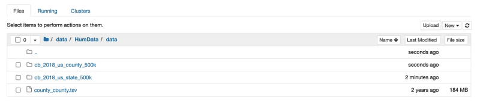
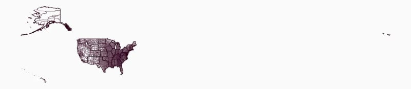
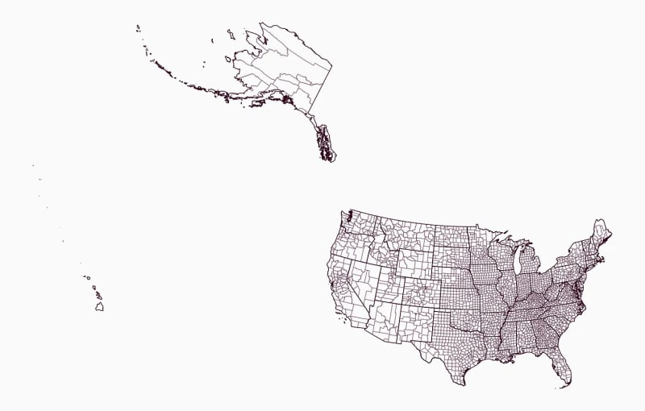
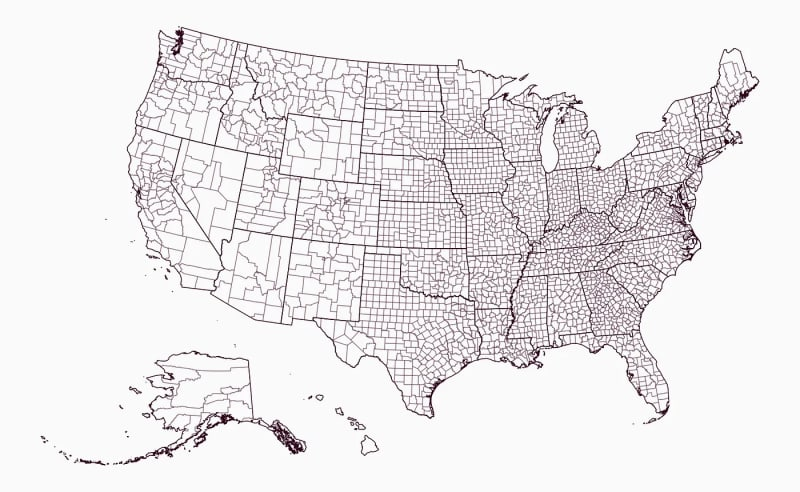
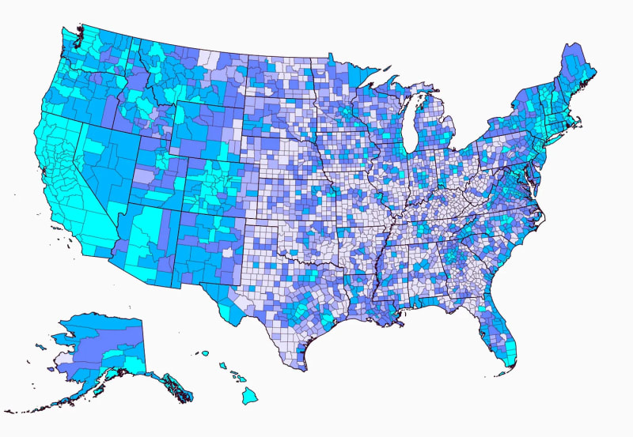
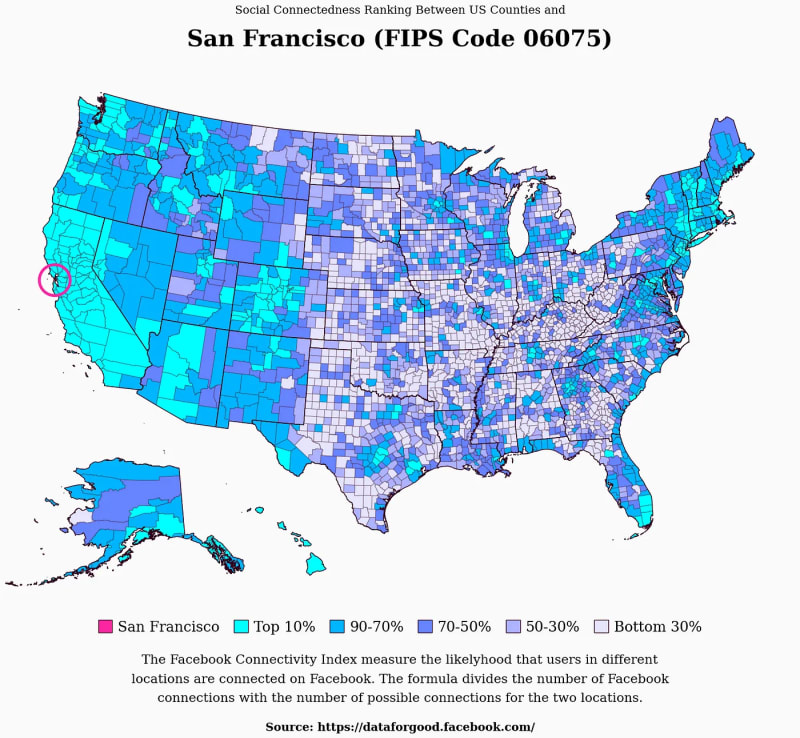

Здравствуйте, добро пожаловать в этот учебник.

Сегодня я научу вас создавать карту, которую вы видите выше, используя геоданные и индекс социальной связи.

Если вы хотите узнать больше о визуализации и наборе данных, вы можете взглянуть на эту [статью](https://datawonder.substack.com/p/investigating-the-facebook-connectivity) в моей новой бесплатной рассылке Data Wonder.

Давайте приступим к учебнику.

---

### [](https://dev.to/oscarleo/how-to-create-data-maps-of-the-united-states-with-matplotlib-p9i#step-1-download-data)Шаг 1: Загрузка данных

Прежде чем начать, нам нужно загрузить набор данных, достаточный для этого учебника, и геоданные для создания точных карт Соединенных Штатов.

Для карт я использую файлы фигур с сайта [Cencus.gov](https://www.census.gov/). Вы можете воспользоваться следующими ссылками, чтобы загрузить [штаты](https://www2.census.gov/geo/tiger/GENZ2018/shp/cb_2018_us_state_500k.zip) и [округа](https://www2.census.gov/geo/tiger/GENZ2018/shp/cb_2018_us_county_500k.zip).

Чтобы получить дополнительный набор данных, я выбрал индекс связности Facebook, который измеряет вероятность того, что два человека в разных округах связаны в Facebook.

Данные о связности можно загрузить по [этой ссылке](https://data.humdata.org/dataset/e9988552-74e4-4ff4-943f-c782ac8bca87/resource/c59fd5ac-0458-4e83-b6be-5334f0ea9a69/download/us-counties-us-counties-fb-social-connectedness-index-october-2021.zip).

После завершения загрузки распакуйте их и поместите в удобное место. В учебнике я использую `./data`, но вы можете использовать любое другое.

Это должно выглядеть примерно так.

[](../../assets/images/q3bb9qlu48iwm2vz3vnb.png)

Давайте напишем немного кода.

---

### [](https://dev.to/oscarleo/how-to-create-data-maps-of-the-united-states-with-matplotlib-p9i#step-2-import-libraries-and-prepare-seaborn)Шаг 2: Импорт библиотек и подготовка Seaborn

Единственной новой библиотекой (если вы изучали другие мои учебники по Matplotlib) является geopandas, которую мы будем использовать для рисования карт.

```py
# Импорт библиотек

import numpy as np
import pandas as pd
import seaborn as sns
import geopandas as gpd
import matplotlib.pyplot as plt

from PIL import Image
from matplotlib.patches import Patch, Circle
```

Далее, давайте определим несколько особенностей стиля с помощью `seaborn`.

```css
edge_color = "#30011E"
background_color = "#fafafa"

sns.set_style({
    "font.family": "serif",
    "figure.facecolor": background_color,
    "axes.facecolor": background_color,
})
```

Теперь пришло время узнать, как нарисовать карту.

---

### [](https://dev.to/oscarleo/how-to-create-data-maps-of-the-united-states-with-matplotlib-p9i#step-3-load-and-prepare-geodata)Шаг 3: Загрузка и подготовка геоданных

Я использую `geopandas` для загрузки данных и удаления ”неинкорпорированных территорий", таких как Гуам, Пуэрто-Рико и Американское Самоа.

```py
# Загрузка и подготовка геоданных
counties = gpd.read_file("./data/cb_2018_us_county_500k/")
counties = counties[~counties.STATEFP.isin(["72", "69", "60", "66", "78"])]
counties = counties.set_index("GEOID")

штаты = gpd.read_file("./data/cb_2018_us_state_500k/")
states = states[~states.STATEFP.isin(["72", "69", "60", "66", "78"])]
```

Рамка данных `geopandas` имеет столбец `geometry`, который определяет форму каждой строки. Это позволяет нам рисовать карту, вызывая `counties.plot()` или `states.plot()` следующим образом.

```py
ax = counties.plot(edgecolor=edge_color + "55", color="None", figsize=(20, 20))
states.plot(ax=ax, edgecolor=edge_color, color="None", linewidth=1)

plt.axis("off")
plt.show()
```

Здесь я начинаю с рисования округов с прозрачными границами, а затем повторно использую `ax` при вызове `states.plot()`, чтобы не рисовать отдельные карты.

Вот что я получаю.

[](../../assets/images/6edqtcd6aqpfe8ash4ye.png)

Результаты выглядят не очень, но я сделаю несколько быстрых поправок, чтобы вывести нас на правильный путь.

Первая корректировка заключается в изменении проекции карты на проекцию с центром на Соединенные Штаты. Это можно сделать с помощью `geopandas`, вызвав `to_crs()`.

```py
# Загрузка и подготовка геоданных
...

counties = counties.to_crs("ESRI:102003")
штаты = states.to_crs("ESRI:102003")
```

Вот в чем разница.

[](../../assets/images/yukkpvnbximo85v280yh.png)

Обычно при составлении карт Соединенных Штатов Аляску и Гавайи рисуют под материком, и мы тоже так поступим.

С помощью `geopandas` вы можете переводить, масштабировать и поворачивать геометрические фигуры с помощью встроенных функций. Вот полезная функция для этого.

```py
def translate_geometries(df, x, y, scale, rotate):
    df.loc[:, "geometry"] = df.geometry.translate(yoff=y, xoff=x)
    center = df.dissolve().centroid.iloc[0]
    df.loc[:, "geometry"] = df.geometry.scale(xfact=scale, yfact=scale, origin=center)
    df.loc[:, "geometry"] = df.geometry.rotate(rotate, origin=center)
    вернуть df
```

Я вычисляю центральную точку для всего кадра данных, которая определяет начало вращения и масштабирования. Если этого не сделать, `geopandas` будет делать это автоматически для каждой строки, в результате чего карта будет выглядеть совершенно беспорядочно.

Следующая функция берет наши текущие кадры данных, разделяет Гавайи и Аляску, вызывает `translate_geometries()` для корректировки их геометрии и помещает их обратно в новые кадры данных.

```py
def adjust_maps(df):
    df_main_land = df[~df.STATEFP.isin(["02", "15"])]
    df_alaska = df[df.STATEFP == "02"]
    df_hawaii = df[df.STATEFP == "15"]

    df_alaska = translate_geometries(df_alaska, 1300000, -4900000, 0.5, 32)
    df_hawaii = translate_geometries(df_hawaii, 5400000, -1500000, 1, 24)

    return pd.concat([df_main_land, df_alaska, df_hawaii])
```

Добавим `adjust_maps()` в наш код.

```py
# Загрузка и подготовка геоданных
...

округа = adjust_maps(counties)
штаты = adjust_maps(states)
```

Теперь наша карта выглядит следующим образом.

[](../../assets/images/sy4vmj1mnyn1wsiq6p31.png)

Настало время для следующего шага.

---

### [](https://dev.to/oscarleo/how-to-create-data-maps-of-the-united-states-with-matplotlib-p9i#step-4-adding-data)Шаг 4: Добавление данных

Чтобы добавить данные, мы начнем с загрузки данных о связях Facebook. Я превращаю столбцы `user_loc` и `fr_loc` в строки и добавляю ведущие нули, чтобы они соответствовали геоданным.

```py
# Загрузка данных facebook
facebook_df = pd.read_csv("./data/county_county.tsv", sep="\t")
facebook_df.user_loc = ("0" + facebook_df.user_loc.astype(str)).str[-5:]
facebook_df.fr_loc = ("0" + facebook_df.fr_loc.astype(str)).str[-5:]
```

Столбцы `user_loc` и `fr_loc` определяют пару округов, а третий столбец, `scaled_sci`, - это значение, которое мы хотим отобразить.

В наборе данных 3 227 округов, что означает, что всего существует 10 413 529 пар, но мы будем показывать индексы связности для одного округа за раз.

```py
# Создаем карту данных
county_id = "06075" # Сан-Франциско
название_округа = counties.loc[county_id].NAME
county_facebook_df = facebook_df[facebook_df.user_loc == county_id]
```

Далее я определяю `selected_color` и `data_breaks`, которые содержат процентили, цвета и тексты легенд для последующего использования.

```py
# Создаем карту данных
...

selected_color = "#FA26A0"
data_breaks = [
    (90, "#00ffff", "10% лучших"),
    (70, "#00b5ff", "90-70%"),
    (50, "#6784ff", "70-50%"),
    (30, "#aeb3fe", "50-30%"),
    (0, "#e6e5fc", "нижние 30%"),
]
```

Следующая функция определяет цвет для каждой строки, используя `county_df` и `data_breaks`, которые мы только что определили.

```py
def create_color(county_df, data_breaks):
    colors = []

    for i, row in county_df.iterrows():
        for p, c, _ in data_breaks:
            if row.value >= np.percentile(county_df.value, p):
                colors.append(c)
                break

    вернуть цвета
```

Мы вычисляем правильные значения и добавляем `create_color()` вот так.

```py
# Создаем карту данных
...

counties.loc[:, "value"] = (county_facebook_df.set_index("fr_loc").scaled_sci)
counties.loc[::, "value"] = counties["value"].fillna(0)
counties.loc[:, "color"] = create_color(counties, data_breaks)
counties.loc[county_id, "color"] = selected_color

ax = counties.plot(edgecolor=edge_color + "55", color=counties.color, figsize=(20, 20))
states.plot(ax=ax, edgecolor=edge_color, color="None", linewidth=1)
ax.set(xlim=(-2600000, None)) # Удаление части подкладки слева

plt.axis("off")
plt.show()
```

Вот что мы получаем.

[](../../assets/images/c903pnwnuokxb56z882z.png)

Выглядит фантастически, но нам нужно добавить немного информации.

---

### [](https://dev.to/oscarleo/how-to-create-data-maps-of-the-united-states-with-matplotlib-p9i#step-5-adding-information)Шаг 5: Добавление информации

Первая информация, которая нам нужна, - это заголовок, объясняющий, о чем будет визуализация данных.

Вот функция, которая это делает.

```py
def add_title(county_id, county_name):
    plt.annotate(
        text="Рейтинг социальной связанности между округами США и",
        xy=(0.5, 1.1), xycoords="axes fraction", fontsize=16, ha="center"
    )

    plt.annotate(
        text="{} (Код FIPS {})".format(county_name, county_id),
        xy=(0.5, 1.03), xycoords="axes fraction", fontsize=32, ha="center",
        fontweight="bold"
    )
```

Далее нам понадобится легенда и вспомогательная информация, объясняющая данные, поскольку они немного сложны.

Функция для добавления легенды использует `data_breaks` и `selected_color` для создания `Patch(es)`, которые мы добавляем с помощью `plt.legend()`.

```py
def add_legend(data_breaks, selected_color, county_name):
    patches = [Patch(facecolor=c, edgecolor=edge_color, label=t) for _, c, t in data_breaks]
    patches = [Patch(facecolor=selected_color, edgecolor=edge_color, label=county_name)] + patches

    нога = plt.legend(
        handles=patches,
        bbox_to_anchor=(0.5, -0.03), loc='center',
        ncol=10, fontsize=20, columnspacing=1,
        длина ручки=1, высота ручки=1,
        edgecolor=background_color,
        handletextpad=0,4
    )
```

У меня также есть простая функция для добавления дополнительной информации под легендой.

```py
def add_information():
    plt.annotate(
        "Индекс подключенности Facebook измеряет вероятность того, что пользователи в разных местах подключены к Facebook. Формула делит количество подключений к Facebook\nна количество возможных подключений для двух мест."
        xy=(0.5, -0.08), xycoords="axes fraction", ha="center", va="top", fontsize=18, linespacing=1.8
    )

    plt.annotate(
        "Источник: https://dataforgood.facebook.com/",
        xy=(0.5, -0.22), xycoords="axes fraction", fontsize=16, ha="center",
        fontweight="bold"
    )
```

Наконец, у меня есть функция `add_circle()`, чтобы указать, на какой округ мы смотрим, нарисовав вокруг него круг.

```py
def add_circle(ax, counties_df, county_id):
    center = counties_df[counties_df.index == county_id].geometry.centroid.iloc[0]
    ax.add_artist(
        Circle(
            radius=100000, xy=(center.x, center.y), facecolor="None", edgecolor=selected_color, linewidth=4
        )
    )
```

Мы добавим их все ниже остального кода под комментарием `# Create data map`.

```py
# Создать карту данных
...

add_circle(ax, counties, county_id)
add_title(county_id, county_name)
add_legend(data_breaks, selected_color, county_name)
добавить_информацию()

plt.axis("off")
plt.show()
```

Вот готовая визуализация данных.

[](../../assets/images/o14uvkpy0b5dd1aom472.png)

Поздравляем, теперь вы знаете, как создавать фантастические карты данных Соединенных Штатов в Matplotlib! :)

---

### [](https://dev.to/oscarleo/how-to-create-data-maps-of-the-united-states-with-matplotlib-p9i#conclusion)Заключение

Карты данных - фантастическая вещь, когда вы хотите визуализировать географическую информацию так, чтобы она привлекала внимание пользователя.

В этот раз мы работали с индексом социальной связанности от Facebook, но вы можете изменить его на любой другой с географической информацией.

Надеюсь, вам понравился этот урок и вы узнали что-то новое.

Если да, то обязательно присоединяйтесь к моей рассылке [Data Wonder] (https://datawonder.substack.com/).

Увидимся в следующий раз.
