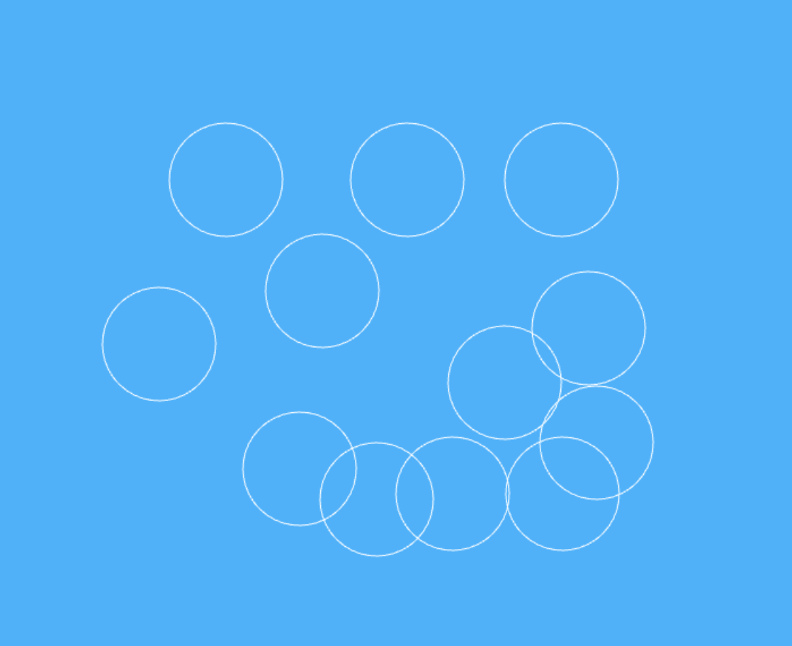

Привет всем! Добро пожаловать в этот учебник, в котором мы окунемся в мир создания забавных пузырьков в коде с помощью HTML canvas и JavaScript. И что самое интересное? Мы добьемся всего этого, используя лишь немного HTML и JavaScript, без CSS.

## Что мы узнаем

В этой статье вы освоите следующие концепции:

- Как создавать окружности с помощью метода `arc` контекста canvas.
- Как использовать функцию `requestAnimationFrame` для плавной анимации окружностей.
- Как использовать возможности классов JavaScript для создания нескольких окружностей без повторения кода.
- Как добавить стили обводки и заливки к окружностям для создания эффекта 3D-пузыря.

Вы можете следовать за мной или использовать [final codepen](https://codepen.io/shrutikapoor08/pen/wvQXMVO), если хотите взглянуть на исходный код.

Если вы предпочитаете учиться в видеоформате, посмотрите это видео:

https://www.youtube.com/watch?v=IjPgXP3gDyI

## Начало работы

Прежде всего, нам нужен элемент HTML5 Canvas. Canvas - это мощный элемент для создания фигур, изображений и графики. Именно его мы будем использовать для создания пузырей.

Давайте настроим его:

```html
<canvas id="canvas"></canvas>
```

Для того чтобы сделать что-либо значимое с холстом, мы должны иметь доступ к его `контексту`. [Context](https://developer.mozilla.org/en-US/docs/Web/API/CanvasRenderingContext2D) предоставляет интерфейс для отображения объектов на холсте и рисования фигур.

Вот как получить доступ к холсту и его контексту.

```js
const canvas = document.getElementById('canvas');
const context = canvas.getContext('2d');
```

Мы также настроим наш холст так, чтобы он использовал всю высоту и ширину окна:

```js
canvas.width = window.innerWidth;
canvas.height = window.innerHeight;
```

Далее мы придадим холсту приятный успокаивающий светло-голубой фон, добавив немного css. Это единственный CSS, который мы будем использовать. При желании вы можете сделать это с помощью JavaScript.

```css
#canvas {
	background: #00b4ff;
}
```

## Как создать пузыри с помощью холста

Давайте перейдем к самой интересной части. Мы будем создавать пузыри, нажимая на холст. Для этого мы начнем с создания обработчика события click:

```js
canvas.addEventListener('click', handleDrawCircle);
```

Поскольку нам нужно знать, где мы щелкнули на нашем холсте, мы будем отслеживать это в нашей функции `handleDrawCircle` и использовать координаты события:

```js
//Мы добавляем сюда x и y, потому что они понадобятся нам позже.
Пусть x, y;
const handleDrawCircle = (event) => {
	x = event.pageX;
	y = event.pageY;

	// Рисуем пузырь!
	drawCircle(x, y);
};
```

### Как рисовать окружности с помощью метода `arc`

Для создания окружностей мы будем использовать метод [`arc`, доступный в контексте canvas.](https://developer.mozilla.org/en-US/docs/Web/API/CanvasRenderingContext2D/arc) Метод `arc` принимает `x` и `y` (центр окружности), радиус, а также начальный и конечный угол, которые для нас будут `0` и `2* Math.PI` соответственно, поскольку мы создаем полную окружность.

То есть:

```js
const drawCircle = (x, y) => {
	context.beginPath();
	context.arc(x, y, 50, 0, 2 * Math.PI);

	context.strokeStyle = 'white';
	context.stroke();
};
```



Окружности, созданные с помощью метода дуги

### Как перемещать круги с помощью метода `requestAnimationFrame`

Теперь, когда у нас есть круги, давайте заставим их двигаться, потому что…

Помните, что при создании окружности мы использовали метод `arc`, который принимал координаты `x` и `y` - центр окружности. Если мы будем перемещать координаты `x` и `y` нашей окружности очень быстро, то будет создаваться впечатление, что окружности движутся. Давайте попробуем!

```js
//Определите скорость, на которую нужно увеличивать координаты x и y

const dx = Math.random() * 3;
const dy = Math.random() * 7;

//Увеличиваем центр окружности с этой скоростью
x = x + dx;
y = y - dy;
```

Мы можем перенести это внутрь функции:

```js
let x, y;

const move = () => {
	const dx = Math.random() * 3;
	const dy = Math.random() * 7;

	x = x + dx;
	y = y - dy;
};
```

Чтобы придать нашему кругу плавное движение, мы создадим функцию `animate` и используем метод браузера `requestAnimationFrame` для создания движущегося круга:

```js
const animate = () => {
	context.clearRect(0, 0, canvas.width, canvas.height);

	move();
	drawCircle(x, y);

	requestAnimationFrame(animate);
};

//Не забудьте вызвать animate внизу
animate();
```

перемещение кругов, созданных с помощью метода requestAnimationFrame

### Как создать частицы с помощью класса частиц

Теперь, когда мы создали один круг, пришло время создать несколько кругов! Но прежде чем это сделать, давайте подготовим наш код.

Чтобы не повторяться в коде, мы будем использовать класссе и представляем класс `Particle`. Частицы - это строительные блоки наших динамических иллюстраций и анимации. Каждый пузырек - это частица со своими атрибутами положения, размера, движения и цвета. Давайте определим класс **`Particle`** для инкапсуляции этих свойств:

```js
класс Particle {
	constructor(x = 0, y = 0) {}

	draw() {
		// Рисуем частицу в виде цветного круга
		// ...
	}

	move() {
		// Реализация движения частицы
		// ...
	}
}
```

Давайте перенесем некоторые константы, которые мы установили, в класс `Particle`:

```js
класс Particle {
	constructor(x = 0, y = 0) {
		this.x = x;
		this.y = y;
		this.radius = Math.random() * 50;
		this.dx = Math.random() * 3;
		this.dy = Math.random() * 7;
	}

	draw() {
		// Рисуем частицу в виде цветного круга
		// ...
	}

	move() {
		// Реализация движения частицы
		// ...
	}
}
```

Метод **`draw`** будет отвечать за отрисовку частицы на холсте. Мы уже реализовали эту функциональность в `drawCircle`, поэтому давайте перенесем ее в наш класс и обновим переменные, чтобы они были переменными класса:

```js
класс Particle {
	constructor(x = 0, y = 0) {
		this.x = x;
		this.y = y;
		this.radius = Math.random() * 50;
		this.dx = Math.random() * 3;
		this.dy = Math.random() * 7;
		this.color = 'white';
	}

	draw() {
		context.beginPath();
		context.arc(this.x, this.y, this.radius, 0, 2 * Math.PI);
		context.strokeStyle = this.color;
		context.stroke();

		context.fillStyle = this.color;
		context.fill();
	}

	move() {}
}
```

Аналогично, давайте переместим функцию `move` внутрь класса:

```js
move() {
	this.x = this.x + this.dx;
	this.y = this.y - this.dy;
}
```

Далее нам нужно убедиться, что мы вызываем класс `Particle` в нашем обработчике событий:

```js
const handleDrawCircle = (event) => {
	const x = event.pageX;
	const y = event.pageY;

	const particle = new Particle(x, y);
};

canvas.addEventListener('click', handleDrawCircle);
```

Поскольку нам нужно получить доступ к этой частице в нашей функции animate, чтобы вызвать для нее метод `move`, мы будем хранить ее в массиве `particleArray`. Этот массив также будет полезен при создании большого количества частиц.

Вот обновленный код, отражающий это:

```js
const particleArray = [];

const handleDrawCircle = (event) => {
	const x = event.pageX;
	const y = event.pageY;

	const particle = new Particle(x, y);
	particleArray.push(particle);
};

canvas.addEventListener('click', handleDrawCircle);
```

Не забудьте обновить и функцию `animate`:

```javascript
const animate = () => {
	context.clearRect(0, 0, canvas.width, canvas.height);

	particleArray.forEach((particle) => {
		particle?.move();
		particle?.draw();
	});

	requestAnimationFrame(animate);
};
```

В этот момент вы увидите эти частицы на экране:

Потрясающе! А теперь перейдем к самому интересному! Давайте создадим множество кругов и придадим им стиль, чтобы они стали похожи на пузыри.

Чтобы создать множество пузырьков, мы будем создавать частицы с помощью цикла `for` и добавлять их в созданный нами массив `particleArray`.

```js
const handleDrawCircle = (event) => {
	const x = event.pageX;
	const y = event.pageY;

	for (let i = 0; i < 50; i++) {
		const particle = new Particle(x, y);
		particleArray.push(particle);
	}
};

canvas.addEventListener('click', handleDrawCircle);
```

В функции animate мы будем постоянно обновлять холст, очищая его и перерисовывая частицы в их новых позициях. Это создаст иллюзию движения круга:

```js
const animate = () => {
	context.clearRect(0, 0, canvas.width, canvas.height);

	particleArray.forEach((particle) => {
		particle?.move();
		particle?.draw();
	});

	requestAnimationFrame(animate);
};

animate();
```

Теперь, когда пузыри двигаются, пришло время добавить им цвета, чтобы они выглядели как настоящие пузыри!

Для этого мы добавим к пузырям градиентную заливку. Это можно сделать с помощью метода `context.createRadialGradient`:

```js
const gradient = context.createRadialGradient(
	this.x,
	this.y,
	1,
	this.x + 0.5,
	this.y + 0.5,
	this.radius,
);

gradient.addColorStop(0.3, 'rgba(255, 255, 255, 0.3)');
gradient.addColorStop(0.95, '#e7feff');

context.fillStyle = gradient;
```

[Вот финальный кодепен](https://codepen.io/shrutikapoor08/pen/wvQXMVO), если вы хотите взглянуть на исходный код.

## Завершение

Поздравляем! Вы только что создали нечто очень интересное, используя только HTML Canvas и JavaScript. Вы узнали, как использовать метод `arc`, как задействовать метод `requestAnimationFrame`, как использовать возможности классов JavaScript и как стилизовать пузыри с помощью градиентов для эффекта 3D-пузырей.

Не стесняйтесь экспериментировать с цветами, скоростью и размерами, чтобы сделать вашианимации поистине уникальны.

Я надеюсь, что вы получили такое же удовольствие от этого урока, как и я от его создания. Теперь ваша очередь экспериментировать. Мне бы хотелось узнать, пробовали ли вы это сделать и что у вас получилось. Поделитесь со мной ссылкой на ваш код, и я с удовольствием посмотрю на него.
