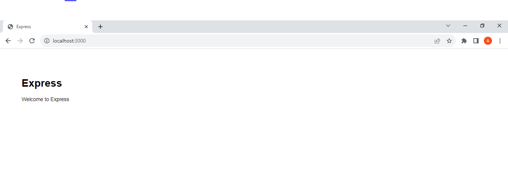
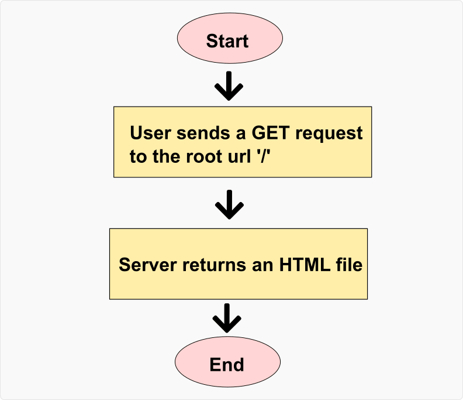
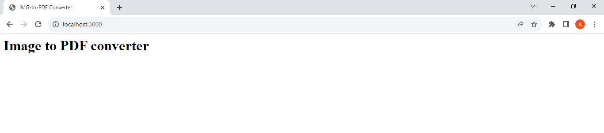
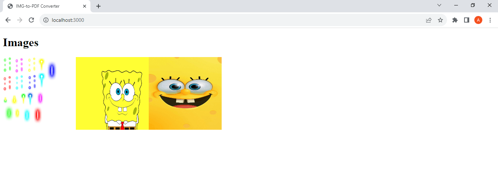

Онлайновый конвертер изображений в PDF - это веб-сайт, который помогает преобразовывать изображения в PDF-файлы. Этот инструмент полезен тем, что обеспечивает эффективный способ хранения изображений.

В этом уроке вы узнаете, как создать свой онлайн-конвертер изображений в PDF с помощью HTML, CSS, JavaScript и NodeJS.

## Предварительные условия

Перед началом этого проекта вы должны владеть или знать следующие языки/библиотеки/фреймворки:

- HTML, CSS и JavaScript: Вы должны иметь базовые знания об использовании HTML, CSS и JavaScript, чтобы следовать этому руководству. Вы должны знать, как создавать эти файлы и связывать их между собой. Вы должны знать об основных элементах HTML, основных селекторах CSS, концепциях JavaScript и DOM.
- NodeJS и npm: У вас должны быть установлены npm и Node.js, потому что мы будем использовать их для установки необходимых пакетов для вашего проекта. В частности, вы должны иметь базовые знания о том, как импортировать и использовать встроенные модули Nodejs.
- [Nodemon](https://www.npmjs.com/package/nodemon): Nodemon - это важный пакет Node, который поможет вам быстрее развивать свой проект. Он помогает перезапускать сервер при внесении изменений в проект.
- [Express.js](https://www.expressjs.com/) и express-generator: Express.js - это фреймворк Node, который вы будете использовать для создания веб-сервера. Express-generator - это библиотека, которая поможет вам создать необходимые файлы и папки для эффективной работы Express.js. Вы должны знать, как создать базовое приложение Express.
- [Express-session](https://www.npmjs.com/package/express-session): Это промежуточная библиотека Express, которая поможет вам управлять сессиями приложения. Вы должны знать о конфигурациях этой библиотеки.
- [Jade/Pug](https://pugjs.org/): Это шаблонизатор JavaScript, который поможет вам отобразить адрес загруженных изображений в HTML-файле. Вы должны знать основы работы с этой библиотекой.
- [PDFkit](https://pdfkit.org/): Это библиотека JavaScript, которую мы будем использовать для преобразования изображений в PDF.
- [Multer](https://www.npmjs.com/package/multer): Это библиотека Node, которая будет обрабатывать загрузку файлов.
- [Sortablejs](https://www.npmjs.com/package/sortablejs): Это библиотека JavaScript для перетаскивания, которую мы будем использовать во фронтенде для перестановки изображений перед их конвертированием в PDF.

Наконец, вы должны знать, как создавать папки и файлы (с соответствующими расширениями). Вы должны знать, как редактировать эти файлы с помощью текстового редактора.

## Настройка проекта

Сначала нужно создать папку и перейти в нее с помощью CLI:

```bash
mkdir img2pdf
cd img2pdf
```

Далее инициализируйте его как пакет npm, чтобы вы могли установить все необходимые библиотеки.

```bash
npm init -y
```

Если все прошло успешно, в вашей папке появится файл package.json.

Package.json должен выглядеть следующим образом:

```json
{
	"name": "img2pdf",
	"version": "1.0.0",
	"description": "",
	"main": "index.js",
	"scripts": {
		"test": "echo \"Error: no test specified\" && exit 1"
	},
	"keywords": [],
	"author": "",
	"license": "ISC"
}
```

Далее мы установим express-generator следующим образом:

```bash
npx express-generator
npm install
```

В качестве шаблонизатора по умолчанию мы выберем `jade`.

Команда выше установит все необходимые папки и библиотеки, необходимые для эффективной работы Express.js.

По окончании установки папка вашего проекта будет выглядеть следующим образом:

```bash
/img2pdf
  /bin
    www
  /node_modules
    /public
	  /images
	  /javascripts
	  /stylesheets
  /маршруты
  /виды
  app.js
  package.json
  package-lock.json
```

- `bin/www` - это точка входа вашего приложения.
- В папке `node_modules` хранятся пакеты, необходимые для нашего проекта.
- В папке `public` будут храниться статические файлы, которые будут возвращаться и храниться сервером.
- В папке `routes` хранятся все маршруты для приложенияация.
- В папке `views` хранятся Jade-файлы, которые будут использоваться для рендеринга на стороне сервера.
- `app.js` - корневой файл JavaScript.

Проверив файл `package.json`, вы увидите, что были установлены `Express.js`, `Jade` и некоторые другие библиотеки.

Далее мы установим пакет Nodemon глобально.

```bash
npm install -g nodemon
```

Наконец, мы установим `PDFkit`, `Multer`, `Sortablejs` и `Express-session`.

```bash
npm i multer pdfkit sortablejs express-session
```

Далее добавьте скрипт `devstart` в ваш package.json. Он позволит Nodemon перезапустить ваше приложение, когда вы внесете какие-либо изменения в файлы JavaScript.

```json
"devstart": "nodemon ./bin/www"
```

По окончании установки ваш файл package.json должен выглядеть следующим образом:

```json
{
	"name": "img2pdf",
	"version": "0.0.0",
	"private": true,
	"scripts": {
		"start": "node ./bin/www",
		"devstart": "nodemon ./bin/www"
	},
	"dependencies": {
		"cookie-parser": "~1.4.4",
		"debug": "~2.6.9",
		"express": "~4.16.1",
		"express-session": "^1.17.3",
		"http-errors": "~1.6.3",
		"jade": "~1.11.0",
		"morgan": "~1.9.1",
		"multer": "^1.4.5-lts.1",
		"pdfkit": "^0.31.0",
		"sortablejs": "^1.15.0"
	}
}
```

Далее перейдите в папку проекта и запустите сервер приложений.

```bash
cd img2pdf
set DEBUG=img2pdf:* & npm run devstart
```

Как только вы получите сообщение об успехе, это будет означать, что сервер уже запущен.

Откройте веб-браузер и введите `http://localhost:3000/` в строке поиска.

Если все прошло успешно, вы должны получить вот такой результат:



## Шаги для выполнения

Прежде чем приступить к написанию кода, давайте рассмотрим шаги, которые мы предпримем для создания этого проекта:

1. Сначала вы определите маршрут, который возвращает HTML-файл `index` при достижении корневого URL `/`.
2. Внутри HTML-файла `index` вы создадите форму, которая будет принимать только файлы изображений (png, jpg), а затем отправлять их на сервер по определенному маршруту.
3. Когда сервер получит изображения с помощью `Multer`, он сохранит их в папке, сохранит адрес в хранилище сессии и перенаправит запрос на маршрут корневого URL, который отрисует файл `Jade`, содержащий адрес загруженных изображений.
4. В файле `Jade` вы активируете `Sortablejs`, чтобы пользователь мог переставлять изображения перед конвертацией в PDF. Там же будет кнопка `конвертировать в PDF`, которая отправит адрес отсортированного изображения на сервер по маршруту `/pdf`.
5. Когда маршрут `/pdf` получит изображения, вы используете `PDFkit` для конвертации изображений в PDF. Затем вы отправите адрес преобразованного PDF.
6. Когда пользователь нажмет на ссылку PDF, файл будет загружен на его устройство.

## Как создать корневой URL-маршрут

Сначала мы создадим маршрут, который будет отправлять файл index.html при достижении корневого URL (`/`).

Вот простая блок-схема этой операции:



Сначала откройте файл routes/index.js и создайте маршрут, возвращающий HTML-файл.

Замените весь код в файле routes/index.js на следующий:

```js
var express = require('express');
var router = express.Router();

var path = require('path');

//создайте GET-маршрут '/', который будет возвращать файл index.html, хранящийся в папке public/html
router.get('/', function (req, res, next) {
res.sendFile(path.join(\_\_dirname, '...', '/public/html/index.html'));
});

module.exports = router;

```

Из приведенного выше кода видно, что мы включили библиотеку `express` и активировали функцию `express.Router()`. Модуль `path` также был включен, поскольку он будет использоваться для описания путей к файлам.

Затем мы определили метод route, который будет обрабатывать все GET-запросы, направленные на корневой URL `/`. Каждый раз, когда метод маршрута получает запрос, он будет использовать метод `res.sendFile()` для отправки файла `index.html` обратно пользователю.

Переменная `__dirname` и метод `path.join()`, используемые в методе `res.sendFile(...)`, помогают нам точно указать адрес файла `index.html`.

Далее создайте папку `html` в общей папке и добавьте в нее страницу index.html.

Вот как должна выглядеть ваша папка `public`:

```bash

/public
/html
/images
/javascripts
/stylesheets

```

Далее создайте файл `index.html` в папке `public/html` и добавьте в него этот код:

```html
<DOCTYPE HTML>
	<html>
		<head>
			<title>Конвертер из IMG в PDF</title>
			<meta charset="UTF-8" />
			<meta name="author" content="YOUR NAME" />
			<meta name="description" content="Легко конвертируйте любой набор изображений в PDF" />
			<meta name="viewport" content="width=device-width, initial-scale=1.0" />
		</head>
		<body>
			<h1>Конвертер изображений в PDF</h1>
		</body>
	</html></DOCTYPE
>
```

Если ваш сервер все еще работает, перейдите по адресу `https://localhost:3000/` в вашем веб-браузере.

Это должнобудет результатом:



Если вы еще не запустили свой сервер, перейдите в каталог проекта (`cd img2pdf`) и выполните эту команду:

```bash
set DEBUG=img2pdf:* & npm run devstart
```

## Как загружать изображения на сервер

В этом разделе я расскажу, как загружать изображения на сервер.

Вот простая блок-схема этой операции:


Вот что происходит:

- Пользователь отправляет изображения на сервер
- Сервер получает изображения, переименовывает их и сохраняет в папке
- Сервер извлекает имена файлов изображений, сохраняет их в сессии, перенаправляет запрос на корневой URL
- Маршрут корневого URL получает запрос и отображает файл Jade/pug, содержащий имена изображений
- Конец

Пока ваш сервер работает, замените содержимое файла `public/html/index.html` на следующее:

```html
<DOCTYPE HTML>
<html>
<head>
<title>Конвертер из IMG в PDF</title>
<meta charset="UTF-8" />
<meta name="author" content="Gideon Akinsanmi" />
<meta name="description" content="Легко конвертировать любой набор изображений в PDF" />
<meta name="viewport" content="width=device-width, initial-scale=1.0" /> <meta name="viewport" content="width=device-width, initial-scale=1.0" />
<link rel="stylesheet" href="/stylesheets/style.css" />
<link rel="stylesheet" href="/stylesheets/index.css" />
</head>
<body>
<main>
<header>
<h1><a href="/">IMG2PDF</a></h1>
</header>
<Статья>
<p class="title">Удобное преобразование изображений PNG и JPG
<form method="post" action="/upload" enctype="multipart/form-data">
<input id="file-upload" type="file" name="images" accept=".png, .jpg" multiple />
<label for="file-upload">Выбор файлов</label>
<p id="selected-files"><code> </code>
<input type="submit" value="upload" />
</form>
</article>
<footer>
<code>copyright &copy; IMG2PDF 2023</code>
</footer>
<script>
let fileUpload = document.getElementById('file-upload');
let selectedFiles = document.querySelector('#selected-files code');
let submitButton = document.querySelector('input[type=submit]');

    				let filenames = '';
    				fileUpload.onchange = function () {
    					filenames = '';
    					for (let file of this.files) {
    						filenames += file.name;
    						filenames += ',';
    					}
    					selectedFiles.parentElement.style.display = 'block';
    					selectedFiles.textContent = filenames;
    					submitButton.style.display = 'inline-block';
    				};
    			</script>
    		</main>
    	</body>
    </html></DOCTYPE

>

```

В приведенном выше коде мы связали несколько CSS-файлов (`styles.css` и `index.css`) с документом. Мы также создали элемент `form`, который отправляет POST-запрос на маршрут `/upload`. Элемент `form` имеет `enctype` `multipart/form-data` (без него наш сервер не сможет получить изображения).

Внутри элемента `form` есть элемент `input`, который поможет нам получить файлы с устройства. Входной элемент имеет атрибут `name` со значением `images` (который будет использоваться multer для идентификации изображений). Он настроен на прием нескольких файлов изображений (с расширениями .png или .jpg).

Также есть элемент `input`, который выполняет роль кнопки отправки. Он будет использоваться для запуска запроса на загрузку файла.

Также есть элемент `cript`, который содержит код JavaScript, добавляющий интерактивность в HTML-документ.

Создайте файл `style.css` в папке `public/stylesheets` и добавьте в него этот CSS-код:

```css
* {
	margin: 0;
	padding: 0;
	box-sizing: border-box;
	font-family: Poppins;
	transition: all 0.5s ease;
}
main {
	display: flex;
	flex-direction: column;
	height: 100vh;
}

h1 a {
	color: #ff6600;
	text-decoration: none;
}
h1 {
	цветфона: белый;
	font-size: 25pt;
	padding: 5px;
	text-align: center;
}

p {
	font-size: 20pt;
	text-align: center;
	margin-bottom: 25px;
}

header,
нижний колонтитул {
	border: 2px solid #ececec;
}

article {
	padding: 20px;
	flex-grow: 1;
	background-color: #fff7f0;
}
footer p {
	margin-bottom: 0;
	font-size: 16pt;
}

@media screen and (max-width: 380px) {
	нижний колонтитул p {
		font-size: 12pt;
	}
}

@media screen and (max-width: 300px) {
	h1 {
		font-size: 17pt;
	}
}
```

Приведенный выше код CSS определяет общий макет вашего сайта.

Далее создайте файл `index.css` в папке `public/stylesheets` и добавьте в него этот код:

```css
p.title {
	font-size: 30pt;
}
p#selected-files {
	display: none;
	white-space: nowrap;
	overflow: hidden;
	text-overflow: ellipsis;
}

label {
	display: inline-block;
	font-size: 25pt;
	курсор: указатель;
	padding: 5px 45px;
	радиусграницы: 25px;
	цвет: белый;
	background-color: #ff9955;
}
label:hover {
	background-color: #ff6600;
}

input[type='file'] {
	display: none;
}
input[type='submit'] {
	display: none;
	font-size: 16pt;
	курсор: указатель;
	padding: 5px 25px;
	border-radius: 25px;
	цвет: белый;
	background-color: black;
}

@media screen and (max-width: 380px) {
	p.title {
		font-size: 25pt;
	}
}

@media screen and (max-width: 300px) {
	p.title {
		font-size: 22pt;
	}
	label {
		font-size: 20pt;
	}
}

@media screen and (max-width: 250px) {
	label {
		padding: 5px 35px;
	}
}
```

Приведенный выше код CSS определяет специфический стиль элементов `index.html`.

Далее откройте файл `routes/index.js` и создайте маршрут `/upload`, который будет получать файлы изображений, хранить их в папке, сохранять имена файлов в хранилище сессии и перенаправлять запрос на корневой URL.

Сначала нам нужно отредактировать файл `app.js` и активировать `express-session`.

Добавьте этот код в ваш файл `app.js`:

```js
//включите модуль express-session
var session = require('express-session');

//активируем его в качестве промежуточного ПО express.js
app.use(session({ secret: 'YOUR_SECRET' }));
```

Вот как должен выглядеть ваш файл `app.js`:

```js
var createError = require('http-errors');
var express = require('express');
var path = require('path');
var logger = require('morgan');
var session = require('express-session');

var indexRouter = require('./routes/index');

var app = express();

// настройка движка представлений
app.set('views', path.join(\_\_dirname, 'views'));
app.set('view engine', 'jade');

app.use(logger('dev'));
app.use(express.json());
app.use(express.urlencoded({ extended: false }));
app.use(express.static(path.join(\_\_dirname, 'public')));
// активируем экспресс-сессию
app.use(session({ secret: 'YOUR_SECRET' }));

app.use('/', indexRouter);

// перехватываем 404 и передаем обработчику ошибок
app.use(function (req, res, next) {
next(createError(404));
});

// обработчик ошибок
app.use(function (err, req, res, next) {
// устанавливаем локали, обеспечивая ошибку только в разработке
res.locals.message = err.message;
res.locals.error = req.app.get('env') === 'development' ? err : {};

    // выводим страницу ошибки, если произошла ошибка
    res.status(err.status || 500);
    res.render('error');

});

module.exports = app;

```

Откройте файл `routes/index.js` и создайте маршрут, который будет получать имена файлов изображений, хранить их в сессии и перенаправлять на корневой URL:

```js
/ импортируйте библиотеку multer
var multer = require('multer');
var path = require('path');

//конфигурация файлового хранилища multer
let storage = multer.diskStorage({
	//хранилище изображений в папке public/images
	destination: function(req, file, cb){
		cb(null, 'public/images')
	},
	//переименование изображений
	filename: function(req, file, cb){
		cb(null, file.fieldname + '-' + Date.now() + '.' + file.mimetype.split('/')[1] )
	}
})

// конфигурация для фильтра файлов
let fileFilter = (req, file, callback) => {
	let ext = path.extname(file.originalname);
	//если расширение файла не '.png' или '.jpg', возвращаем страницу с ошибкой, иначе возвращаем true
	if (ext !== '.png' && ext !== '.jpg'){
		return callback(new Error('Принимаются только файлы png и jpg'))
	} else {
		return callback(null, true)
	}
}

//инициализация Multer с конфигурациями для хранилища и файлового фильтра
var upload = multer({ storage, fileFilter: fileFilter});

router.post('/upload', upload.array('images'), function (req, res){
	let files = req.files;
	let imgNames = [];

	//извлечение имен файлов
	for (i of files){
		let index = Object.keys(i).findIndex( function (e){return e === 'filename'})
		imgNames.push( Object.values(i)[index] )
	}
	//храним имена файлов изображений в сессии
	req.session.imagefiles = imgNames

    //перенаправляем запрос на корневой URL-маршрут
	res.redirect('/')
})
```

Из приведенного выше кода мы включили библиотеку `Multer`. Затем мы использовали метод `multer.diskStorge()` для описания того, где будут храниться файлы изображений и как они должны быть переименованы.

Также мы создали функцию `fileFilter`, чтобы гарантировать, что сервер будет хранить только файлы png и jpg. Если пользователь отправит какой-либо файл, не являющийся PNG или JPG, будет отображена страница ошибки с сообщением ”Принимаются только файлы png и jpg”.

Далее мы создали метод маршрута, который прослушивает POST-запросы, направленные по маршруту `/upload`.

Внутри этого метода маршрута мы включили метод upload.array(‘images’), который указывает mutler хранить только файлы с именем `images` (в соответствии с HTML-элементом ввода `<input id='file-upload' type='file' name='images' accept='.png, .jpg' multiple/>`).

После этого мы извлекаем имена файлов из свойства `req.files` и сохраняем их в хранилище сессии. Наконец, мы перенаправляем запрос на корневой URL-маршрут.

В файле `routes/index.js` отредактируйте корневой URL-маршрут так, чтобы он рендерил файл `index.jade`, если сессия хранит имена файлов изображений.

```js
router.get('/', function (req, res, next) {
//если в сессии нет имен файлов изображений, возвращаем обычную HTML-страницу
if (req.session.imagefiles === undefined) {
res.sendFile(path.join(\_\_dirname, '...', '/public/html/index.html'));
} else {
// если в сессии хранятся имена файлов изображений, отобразите их в файле index.jade
res.render('index', { images: req.session.imagefiles });
}
});

```

Из приведенного выше кода следует, что когда маршрут URL получает какой-либо запрос, он сначала проверяет, есть ли свойство `imagefiles`, хранящееся в хранилище сессии. Если его нет, он отправляет файл `index.html`. Если же есть, то будет отправлен файл `index.jade`, содержащий имена изображений.

Наконец, перейдите в файл `views/index.jade` и отредактируйте его так, чтобы он отображал загруженные изображения в HTML:

```pug

doctype html
html
head
title IMG-to-PDF Converter
meta(charset='UTF-8')
body
h1 Изображения
каждое изображение в изображениях
img(src=`/images/${image}` width='200' height='200')

```

Приведенный выше код написан в синтаксисе Jade, когда сервер отобразит его, он будет иметь вид HTML-документа.

**Примечание:** убедитесь, что отступы вашего контента в `Jade/Pug` делаются либо клавишей пробела, либо клавишей табуляции, а не обеими.

Когда вы запустите или перезапустите свой сервер (`rs` с `Nodemon`), перейдите на [http://localhost:3000/](http://localhost:3000/) и перезапустите процесс загрузки (от выбора файлов до нажатия кнопки загрузки).

Вы должны увидеть HTML-страницу, содержащую загруженные вами изображения.

Вот мой результат:



## Как отсортировать изображения и преобразовать их в PDF

В этом разделе я расскажу, как можно дать пользователю возможность пересортировать изображения и преобразовать их в PDF.

Вот простая блок-схема этой операции:


Вот что происходит:

- Пользователь нажимает на ”скрыть в PDF”.
- Браузер отправляет запрос на сервер, содержащий отсортированные имена файлов изображений
- Сервер получает запрос, преобразует изображения в PDF и отправляет адрес обратно в браузер.
- Браузер получает адрес и отображает его пользователю
- Пользователь нажимает на ссылку и скачивает PDF-файл.
- Конец

В файле `views/index.jade` мы будем использовать `Sortablejs` для сортировки изображений.

Замените содержимое вашего файла `index.jade` на следующее:

```pug

doctype html
html
head
title IMG-to-PDF Converter
meta(charset='UTF-8')
link(rel='stylesheet' href='/stylesheets/style.css')
link(rel='stylesheet' href='/stylesheets/index-view.css')
script(type='module' src='/javascripts/sort.js' defer)
тело
главная страница
заголовок
h1
a(href='/') IMG2PDF
статья
p
a(href='/new') Новый +
div
каждое изображение в изображениях
img(src=`/images/${image}` data-name=image width='200' height='200')
p
a(class='convert')
span(class='text') Преобразование в PDF &rarr;
span(class='loader')
p
a(class='download') Загрузка &darr;
нижний колонтитул
p
код копирайта &copy; IMG2PDF 2023

```

Приведенный выше код - это Jade-файл, который будет отображаться как HTML-документ. Он содержит метаданные документа (включая элементы `link` и `style`, которые связывают с файлами CSS и Javscript), элементы изображений, гиперссылки и некоторые другие элементы HTML.

Далее создайте файл `public/stylesheets/index-view.css` и добавьте в него этот код:

```css
p a {
	font-size: 20pt;
	text-decoration: none;
	цвет: белый;
	display: inline-block;
	padding: 5px 20px;
	margin-bottom: 15px;
	background-color: #ff6600;
	курсор: указатель;
}

div {
	margin: auto;
	margin-bottom: 15px;
	padding: 10px;
	display: flex;
	flex-direction: row;
	flex-wrap: wrap;
	ширина: 80%;
	background-color: rgba(255, 255, 255, 0.9);
}

div img {
	ширина: 200px;
	высота: 200px;
	object-fit: contain;
	padding: 10px;
	background-color: #ffe6d5;
	margin-right: 10px;
	margin-bottom: 10px;
	курсор: указатель;
}

p a.download {
	цветфона: черный;
	display: none;
}

span.loader {
	display: none;
	border: 5px solid black;
	border-top: 5px solid white;
	border-radius: 50%;
	ширина: 25px;
	высота: 25px;
	анимация: вращение 0.5s линейная бесконечная;
}

@keyframes spin {
	0% {
		transform: rotate(0deg);
	}
	100% {
		transform: rotate(360deg);
	}
}

@media screen and (max-width: 620px) {
	div img {
		ширина: 45%;
		высота: 150px;
	}
}

@media screen and (max-width: 415px) {
	p a {
		font-size: 16pt;
	}
	div img {
		height: 120px;
	}
}

@media screen and (max-width: 330px) {
	p a {
		font-size: 14pt;
	}
	div {
		width: 100%;
	}
	div img {
		ширина: 100%;
		margin-right: 0px;
		margin-bottom: 5px;
	}
}

@media screen and (max-width: 260px) {
	p a {
		font-size: 13pt;
		padding: 5px 10px;
	}
}
```

Далее перейдите в папку `node_modules/sortablejs/modular` и скопируйте файл `sortable.core.esm.js` в папку `public/javascripts`.

Затем создайте файл `public/javascripts/sort.js`.

Вы добавите код, который активирует `Sortablejs` и отправит отсортированные имена файлов на сервер для преобразования:

```js
import Sortable from '/javascripts/sortable.core.esm.js';

//используем sortablejs на элементе-контейнере для тегов изображений
let list = document.querySelector('div');
let sort = Sortable.create(list);

let convertButton = document.querySelector('a.convert');

//Когда нажимается кнопка конвертации
convertButton.onclick = function () {
	let images = document.querySelectorAll('img');
	let loader = document.querySelector('span.loader');
	let convertText = document.querySelector('span.text');
	let downloadButton = document.querySelector('a.download');

	let filenames = [];
	//извлекаем имена изображений в массив
	for (let image of images) {
		filenames.push(image.dataset.name);
	}
	//активируем анимацию загрузки
	loader.style.display = 'inline-block';
	convertText.style.display = 'none';

	//Создайте пост-запрос, который отправит имена файлов изображений в маршрут '/pdf' и получит ссылку на PDF-файл
	fetch('/pdf', {
		method: 'POST',
		headers: {
			'Content-Type': 'application/json',
		},
		body: JSON.stringify(filenames),
	})
		.then((resp) => {
			return resp.text();
		})
		.then((data) => {
			//остановка анимации загрузки
			loader.style.display = 'none';

			//отображение кнопки конвертации и загрузки
			convertText.style.display = 'inline-block';
			downloadButton.style.display = 'inline-block';

			//прикрепляем адрес к кнопке загрузки
			downloadButton.href = data;
		})
		.catch((error) => {
			console.error(error.message);
		});
};
```

Из приведенного выше кода мы импортировали JavaScript-файл ядра Sortablejs и активировали его на родительском элементе элементов img.

При нажатии на кнопку `Convert to PDF` мы извлекаем имена файлов изображений из элементов img и отправляем их в виде POST-запроса на сервер.

Когда браузер получает ответ сервера, мы прикрепляем ссылку к кнопке загрузки, чтобы при нажатии на нее PDF-документ загружался на устройство пользователя.

Далее в файле `routes/index.js` создадим маршрут `/pdf`, который будет получать отсортированные имена файлов и преобразовывать их в PDF.

Сначала создайте папку `pdf` в папке `public` и добавьте этот код в файл `routes/index.js`:

```js
var path = require('path');
var fs = require('fs');

//импорт PDFkit
var PDFDocument = require('pdfkit');

router.post('/pdf', function (req, res, next) {
	let body = req.body;

	//Создаем новый pdf
	let doc = new PDFDocument({ size: 'A4', autoFirstPage: false });
	let pdfName = 'pdf-' + Date.now() + '.pdf';

	//сохраняем pdf в папке public/pdf
	doc.pipe(fs.createWriteStream(path.join(__dirname, '.', `/public/pdf/${pdfName}`)));

	//создаем страницы pdf и добавляем изображения
	for (let name of body) {
		doc.addPage();
		doc.image(path.join(__dirname, '.', `/public/images/${name}`), 20, 20, {
			width: 555.28,
			align: 'center',
			valign: 'center',
		});
	}
	//завершение процесса
	doc.end();

	//отправляем адрес обратно в браузер
	res.send(`/pdf/${pdfName}`);
});
```

Из приведенного выше кода мы включили `pdfkit` и создали метод маршрута, который отвечает на POST-запросы, направленные на URL `/pdf`. В этом методе маршрута мы использовали `pdfkit` для преобразования всех изображений в PDF. Наконец, мы отправили адрес PDF-документа обратно в документ.

Когда вы перезапустите сервер, перейдите по адресу `http://localhost:3000/` в веб-браузере и запустите процесс загрузки файлов. Вы сможете конвертировать изображения в PDF.

Вот видеоролик на YouTube, описывающий весь процесс:

## Как отменить и перезапустить загрузку изображений

В этом разделе мы создадим функциональность, которая позволит пользователю отменить существующий проект загрузки файлов и создать новый.

Помните, что в нашем файле `views/index.jade` есть кнопка `New +`, которая указывает на маршрут `/new`.

```pug
статья
  p
    a(href='/new') New +
...
```

Теперь мы напишем маршрут в нашем файле `routes/index.js`.

Вот простая блок-схема этой операции:


Вот что происходит:

- Пользователь нажимает на кнопку ‘New +’.
- Браузер отправляет GET-запрос на сервер
- Сервер удаляет изображения и очищает их имена из хранилища сессий
- Сервер перенаправляет запрос на корневой URL
- Конец

Добавьте этот код в файл `routes/index.js`:

```js
router.get('/new', function (req, res, next) {
	//удаление файлов, хранящихся в tсессия
	let filenames = req.session.imagefiles;

	let deleteFiles = async (paths) => {
		let deleting = paths.map((file) => unlink(path.join(__dirname, '.', `/public/images/${file}`)));
		await Promise.all(deleting);
	};
	deleteFiles(filenames);

	//удаление данных из сессии
	req.session.imagefiles = undefined;

	//перенаправление на корневой URL
	res.redirect('/');
});
```

Из приведенного выше кода следует, что когда маршрут `/new` получает GET-запрос, он удаляет изображения, хранящиеся в папке и хранилище сессий. После этого он перенаправит запрос на корневой URL.

Когда вы перейдете по адресу `http://localhost:3000/`, загрузите несколько изображений и отмените процесс загрузки файла, вы увидите, что изображения были удалены из папки и вы были перенаправлены на домашнюю страницу.

## Заключение

С помощью приведенного выше кода вы смогли создать онлайн-конвертер изображений в PDF. Поздравляем!

Как вы знаете, разработка программного обеспечения - это непрерывный процесс. Поэтому вы можете попробовать внедрить в проект дополнительные функции (такие как безопасность, проверка ввода и так далее).

Вы можете посмотреть мой [GitHub repo](https://github.com/Gidthecoder/img2pdf/) для полного исходного кода.

Если у вас есть ко мне вопросы, вы можете проверить мой профиль на FreeCodeCamp, чтобы узнать мои контактные данные. Я отвечу как можно быстрее!

Пока.

```

```
