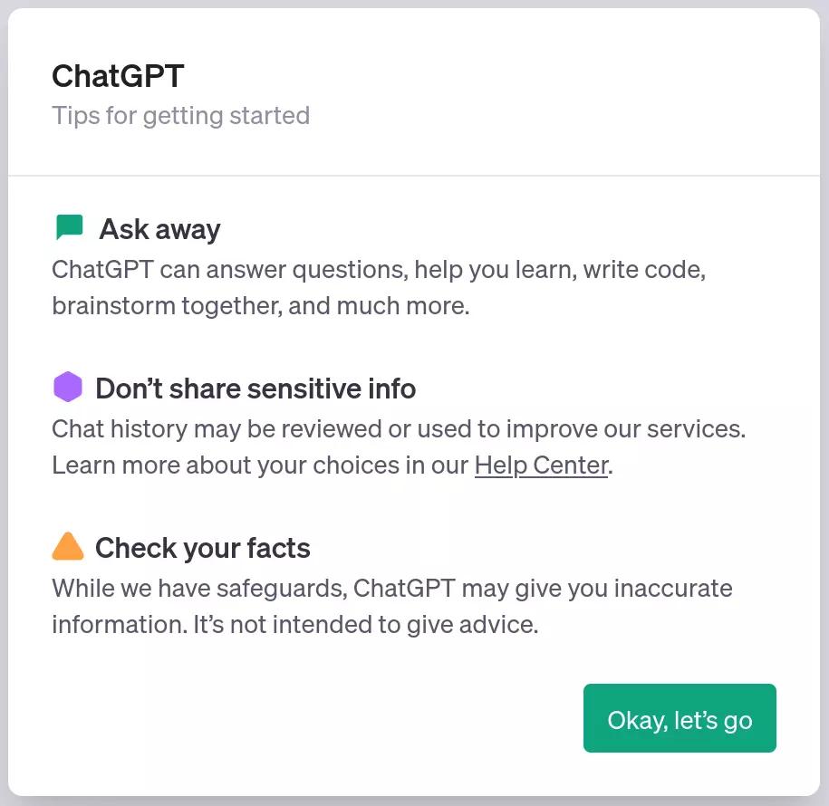
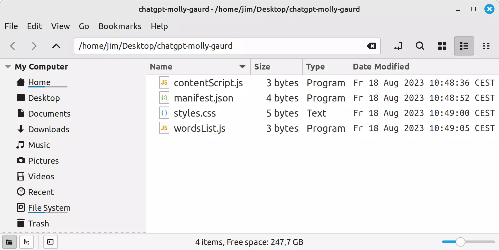
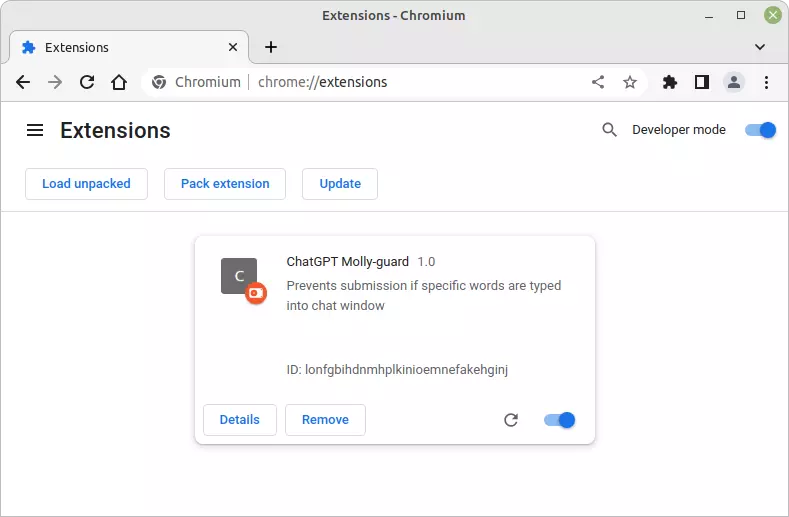
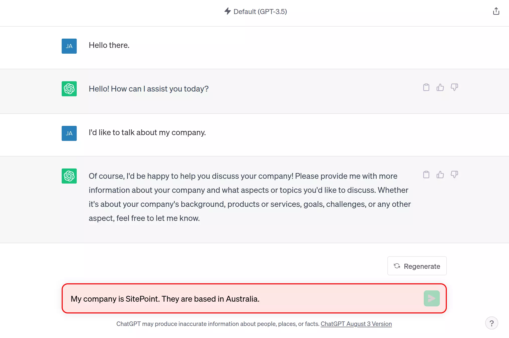
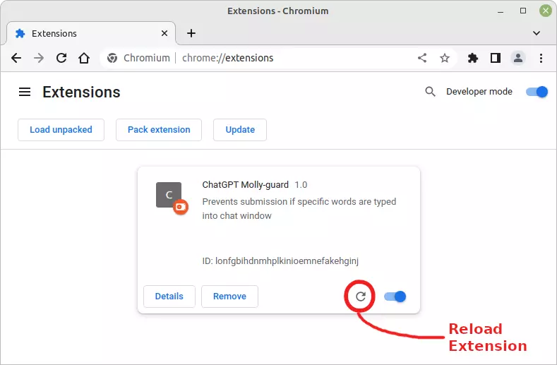

## Что мы собираемся строить?

В последнее время мы стали свидетелями бурного развития возможностей искусственного интеллекта. И хотя наши новые киберкомпаньоны предлагают беспрецедентный уровень помощи, они также не забывают о том, что не стоит делиться с ними конфиденциальной информацией.

Не знаю, как у вас, но у меня чаще всего пальцы работают быстрее, чем мозг. Поэтому, чтобы предотвратить возможные промахи, мы собираемся создать для ChatGPT ”молли-гард".

Если вы ломаете голову, задаваясь вопросом, что такое **molly-guard**, то изначально это обозначало щиток, накладываемый на кнопку или переключатель, чтобы предотвратить случайное нажатие. В нашем контексте это цифровой страж, следящий за тем, чтобы мы не перераспределяли информацию.

Пользователи могут указать список слов или фраз, которые они считают конфиденциальными. Если мы попытаемся отправить сообщение в ChatGPT, содержащее любое из этих слов, расширение начнет действовать, отключая кнопку отправки и спасая нас от возможной оплошности.



Чтобы следовать этому руководству, вам понадобится учетная запись ChatGPT. У вас его нет? Вы можете [зарегистрироваться бесплатно здесь](https://platform.openai.com/signup?launch).

Код для этого руководства [доступен на GitHub](https://github.com/jameshibbard/chatgpt-molly-guard-chrome).

## Что такое расширение для Google Chrome?

Прежде чем мы начнем, давайте уточним, что такое расширение для Chrome. Расширение **Chrome** - это небольшое программное обеспечение, предназначенное для улучшения или изменения работы браузера Chrome. Расширения разрабатываются с использованием стандартных веб-технологий - HTML, JavaScript и CSS - и могут варьироваться от простых инструментов, таких как подборщик цветов, до более сложных, например, менеджеров паролей. Многие из этих расширений доступны для загрузки в магазине [Chrome Web Store](https://chrome.google.com/webstore/).

Примечание: для тех, кто хочет глубже разобраться в расширениях Chrome, неоценимым источником информации является [официальная документация Google](https://developer.chrome.com/docs/extensions/).

Стоит отметить, что расширения Google Chrome могут иметь различные формы в зависимости от их предназначения. Некоторые из них действуют в браузере, отображаясь в виде значка рядом с адресной строкой, обеспечивая быстрый доступ к своим функциям. Другие могут работать тихо в фоновом режиме, на всех веб-страницах или только на определенных, в зависимости от их дизайна.

В нашем учебнике мы рассмотрим тип расширения, использующий скрипт контента. Этот скрипт позволит нам взаимодействовать и манипулировать DOM конкретной страницы - в нашем случае, интерфейса ChatGPT.

## Шаг 1: Создание файлов расширения

Для начала нам нужно создать базовую структуру нашего расширения для Chrome. Наше расширение, названное `chatgpt-mollyguard`, будет организовано в специальной папке. В этой папке будут содержаться все необходимые файлы для бесперебойной работы нашего molly-guard.

Вот их описание:

- **Папка:** `chatgpt-molly-guard`. Это корневая директория нашего расширения. Все наши файлы будут находиться в этой папке.
- **Файл:** `manifest.json`. Сердце и душа нашего расширения. Этот файл содержит метаданные о расширении, такие как его название, версия и разрешения, которые оно требует. Самое главное, он указывает, какие скрипты запускать и на каких сайтах.
- **Файл:** `contentScript.js`. Как следует из названия, этот файл JavaScript содержит скрипт контента. Этот скрипт имеет прямой доступ к содержимому веб-страницы, позволяя нам сканировать ее на наличие чувствительных слов и изменять страницу по мере необходимости.
- **Файл:** `wordsList.js`. Файл JavaScript, содержащий список чувствительных слов или фраз, которые указывает пользователь. Мы разделили его, чтобы облегчить пользователям настройку списка, не погружаясь в основную функциональность в `contentScript.js`.
- **Файл:** `styles.css`. Таблица стилей для придания изюминки нашему расширению. Хотя наша главная цель - функциональность, нет ничего плохого в том, чтобы наши предупреждения или подсказки выглядели красиво!

Чтобы начать:

1. Создайте новую папку на вашем компьютере компьютер с именем `chatgpt-molly-guard`.
2. В этой папке создайте четыре файла, перечисленные выше.
3. Когда файлы созданы, мы готовы приступить к заполнению деталей.



В следующих разделах мы более подробно рассмотрим каждый файл и определим его роль в расширении.

## Шаг 2: Создание файла манифеста

Файл манифеста - это JSON-файл, который предоставляет браузеру важные сведения о вашем расширении. Этот файл должен находиться в корневом каталоге расширения.

Вот структура нашего манифеста. Скопируйте этот код в файл `manifest.json`:

```javascript
{
"manifest_version": 3,
"name": "ChatGPT Molly-guard",
"version": "1.0",
"description": "Предотвращает отправку сообщений, если в окне чата набраны определенные слова",
"content_scripts": [
{
"matches": ["https://chat.openai.com/*"],
"css": ["styles.css"],
"js": ["wordsList.js", "contentScript.js"]
}
]
}

```

Файл манифеста содержит три обязательных поля, а именно: `manifest_version`, `name` и `version`. Все остальное является необязательным.

### Ключевые элементы манифеста

- `manifest_version`: целое число, указывающее версию формата файла манифеста. Мы используем Manifest V3, последнюю доступную версию. Имейте в виду, что Google активно отказывается от расширений Manifest V2 в 2023 году.
- `имя`: короткая текстовая строка (не более 45 символов), идентифицирующая расширение.
- `version`: от одного до четырех целых чисел, разделенных точками, идентифицирующих версию расширения.
- `description`: текстовая строка (без HTML, не более 132 символов), описывающая расширение.
- `content_scripts`: этот ключ определяет статически загружаемые файлы JavaScript или CSS, которые будут использоваться каждый раз, когда открывается страница, соответствующая шаблону URL (указанному ключом `matches`). Здесь мы указываем, что наш скрипт должен запускаться при любом URL, начинающемся с `https://chat.openai.com/`.

Из перечисленных выше полей Google будет использовать `name`, `version` и `description` при отображении вашего расширения на странице управления расширениями Chrome () и в Интернет-магазине Chrome.

Хотя наш манифест оптимизирован для наших нужд, многие другие поля могут добавить глубину и функциональность вашим расширениям. Такие поля, как `action`, `default_locale`, `icons` и т. д., предоставляют возможности настройки, управления пользовательским интерфейсом и поддержки интернационализации.

Для получения исчерпывающей информации о том, что доступно в файле `manifest.json`, обратитесь к [официальной документации Google](https://developer.chrome.com/docs/extensions/mv3/manifest/).

## Шаг 3: Создание сценария контента

Скрипты содержимого в расширении Chrome - это файлы JavaScript, которые запускаются в контексте веб-страниц. Они могут просматривать и манипулировать DOM страницы, на которой запущены, что позволяет им изменять содержимое и поведение веб-страницы.

Это наш скрипт контента. Скопируйте следующий код в файл `contentScript.js`:

```javascript
const debounce = (callback, wait) => {
	let timeoutId = null;
	return (...args) => {
		window.clearTimeout(timeoutId);
		timeoutId = window.setTimeout(() => {
			callback.apply(null, args);
		}, wait);
	};
};

function containsForbiddenWords(value) {
	return forbiddenWords.some((word) => value.toLowerCase().includes(word.toLowerCase()));
}

function updateUI(target) {
	const containsForbiddenWord = containsForbiddenWords(target.value);
	const sendButton = target.nextElementSibling;
	const parentDiv = target.parentElement;

	if (containsForbiddenWord) {
		sendButton.disabled = true;
		parentDiv.classList.add('forbidden-div');
	} else {
		sendButton.disabled = false;
		parentDiv.classList.remove('forbidden-div');
	}
}

document.body.addEventListener(
	'keyup',
	debounce((event) => {
		if (event.target.id === 'prompt-textarea') updateUI(event.target);
	}, 300),
);

document.addEventListener(
	'keydown',
	(e) => {
		if (e.target.id === 'prompt-textarea' && e.key === 'Enter') {
			if (containsForbiddenWords(e.target.value)) {
				e.stopPropagation();
				e.preventDefault();
			}
		}
	},
	true,
);
```

Давайте разберем это пошагово.

В верхней части файла мы объявляем функцию `debounce`. Мы будем использовать ее для чтобы не проверять наличие запрещенных слов каждый раз, когда пользователь нажимает клавишу. Это было бы очень много проверок! Вместо этого мы будем ждать, пока пользователь не перестанет набирать текст, прежде чем что-то делать. Я взял этот фрагмент с сайта [Josh W. Comeau](https://www.joshwcomeau.com/snippets/javascript/debounce/), поэтому вы можете ознакомиться с его постом, чтобы узнать, как это работает.

Далее идет функция `containsForbiddenWords`. Как следует из названия, эта функция возвращает `true`, если переданный ей текст содержит любое из наших запрещенных слов. Мы выделяем оба значения нижним регистром, чтобы сравнение не зависело от регистра.

Функция `updateUI` определяет, присутствуют ли в окне чата запрещенные слова. Если они есть, она отключает кнопку отправки и добавляет CSS-класс (`forbidden-div`) в родительский div окна чата. Мы воспользуемся этим в следующем шаге, чтобы предоставить пользователю визуальную подсказку.

Наконец, скрипт регистрирует два слушателя событий:

- Первый настроен на срабатывание по событию `keyup`. Он проверяет, является ли измененный элемент нашей целью (окном чата), а затем вызывает функцию `updateUI`. Благодаря нашей функции `debounce`, она не будет выполняться постоянно, а только после короткой паузы в наборе текста.
- Второй слушатель событий прослушивает событие `keydown` на нашей цели. В частности, он следит за нажатием клавиши <kbd>Enter</kbd>, которая, если ее нажать, когда в текстовой области находится запрещенное слово, предотвратит действие браузера по умолчанию (в данном случае отправку формы).

Это эффективно останавливает отправку сообщений с запрещенными словами, как за счет отключения кнопки отправки, так и за счет перехвата и остановки нажатия клавиши <kbd>Enter</kbd>.

Вы также заметите, что мы используем [делегирование событий](https://developer.mozilla.org/en-US/docs/Learn/JavaScript/Building_blocks/Events#event_delegation), поскольку интерфейс ChatGPT является SPA. В SPA сегменты пользовательского интерфейса динамически заменяются в зависимости от взаимодействия с пользователем, что может привести к непреднамеренному отсоединению слушателей событий, привязанных к этим элементам. Привязав наши слушатели событий к более широкому DOM и выборочно нацелив их на определенные элементы, мы можем обойти эту проблему.

## Шаг 4: Добавление стиля

Хотя основная функциональность нашего расширения заключается в предотвращении определенных отправлений, важно, чтобы пользователи могли сразу понять, почему их действие блокируется. Давайте добавим немного стилизации, чтобы обеспечить визуальную подсказку и улучшить пользовательский опыт.

Вот правило, которое мы используем. Добавьте его в файл `styles.css`:

```css
.forbidden-div {
	border: 2px solid red !important;
	background-color: #ffe6e6 !important;
}
```

Это добавляет заметную красную рамку и тонкий красный фон в область ввода при обнаружении запрещенных слов. Это сразу привлекает внимание и указывает на то, что что-то не так. Переключая класс родительского div, мы можем легко включать и выключать эту функцию.

Флаг `!important` также заслуживает внимания. Когда вы имеете дело с веб-страницами, которые вам не принадлежат - как в данном случае с ChatGPT - существующие стили могут быть очень специфичными. Чтобы убедиться, что наши стили имеют приоритет и применяются правильно, флаг `!important` отменяет любые потенциальные конфликты из-за специфики существующих стилей.

## Шаг 5: Тестируем расширение

Остался последний шаг: заполнение списка запрещенных слов, которые должно отслеживать наше расширение. Мы можем добавить их в файле `forbiddenWords.js`:

```javascript
const forbiddenWords = ['my-company.com', 'SitePoint', 'Jim'];
```

Теперь, когда наше пользовательское расширение Google Chrome готово, пришло время проверить его функциональность и убедиться, что все работает так, как нужно.

1. Откройте Chrome и перейдите в адресную строку.
2. Включите тумблер _Режим разработчика_, расположенный в правом верхнем углу.
3. Нажмите на кнопку _Загрузить распакованное_, которая теперь будет видна.
4. Перейдите в каталог с вашим расширением (в нашем случае `chatgpt-molly-guard`) и нажмите кнопку _Выбрать_. Теперь наше расширение должно появиться в списке установленных расширений.



Теперь, чтобы проверить работоспособность, перейдите на страницу ChatGPT, обновите ее и попробуйте ввести запрещенные слова, чтобы убедиться, что расширение ведет себя так, как ожидалось.

Если все прошло по плану, вы должны увидеть нечто похожее на картинку ниже.



Если вы вносите какие-либо изменения в код расширения - например, обновляете список слов - не забудьте нажать на круглую стрелку в правом нижнем углу карточки расширения на странице расширения. Это приведет к перезагрузке расширения. Затем вам нужно будет перезагрузить страницу, на которую нацелено ваше расширение.



## Дальше

Наше базовое расширение для Chrome выполняет свои функции, но всегда есть место для улучшения. Если вы хотите доработать расширение и расширить его возможности, ниже приведены некоторые предложения.

### 1\. Пользовательский интерфейс для редактирования списка слов

В настоящее время наше расширение опирается на предопределенный список запрещенных слов. Реализация удобного интерфейса позволила бы пользователям динамически добавлять, удалять или изменять слова на ходу. Для этого можно использовать всплывающий пользовательский интерфейс (действие браузера), открывающийся при нажатии на иконку расширения, в котором пользователи смогут управлять своим списком. Вам также потребуется сохранить слова в хранилище.

### 2\. Обработка событий вставки мыши

Хотя наше расширение обнаруживает нажатия клавиш, пользователи могут обойти это, вставляя конфиденциальную информацию с помощью меню правой кнопки мыши. Чтобы закрыть эту лазейку, мы можем добавить слушателя событий для события `paste` (или объединить оба события, чтобы слушать `input`). Это позволит гарантировать, что независимо от того, набрана информация или вставлена, фильтр останется надежным.

### 3\. Контекстное переопределение

Блокирование определенных терминов может быть слишком общим. Например, я могу захотеть заблокировать упоминание ”Джима" (моего имени), но при этом у меня не будет проблем с упоминанием "Джима Кэри". Чтобы решить эту проблему, рассмотрите возможность введения функции, которая будет отключать molly-guard до следующего события отправки.

Вы также можете ознакомиться с [Firefox-версией этого расширения](https://github.com/jameshibbard/chatgpt-molly-guard-firefox), где эта функция уже реализована.

## Заключение

Как мы выяснили, создание собственного расширения для Google Chrome не является непреодолимой задачей. Мы начали с четкой цели: создать защитный слой для ChatGPT, гарантирующий, что конфиденциальная информация останется конфиденциальной. В этом руководстве мы увидели, как из горстки файлов и небольшого количества кода может получиться функциональное и полезное расширение для браузера.

Для тех, кто хочет углубиться, отличной отправной точкой станет официальная [Документация по Chrome Extension](https://developer.chrome.com/docs/extensions/) от Google. Кроме того, в [Руководстве по миграции расширений Chrome](https://developer.chrome.com/docs/extensions/migrating/) можно найти информацию о переходе на Manifest V3, что очень важно, учитывая предстоящий отказ от Manifest V2 в 2023 году.

Теперь, когда вы увидели, как это делается, я призываю вас доработать, улучшить и адаптировать расширение под свои нужды. Пожалуйста, [напишите мне в Twitter](https://twitter.com/jchibbard) и дайте мне знать о любых сделанных вами улучшениях.
