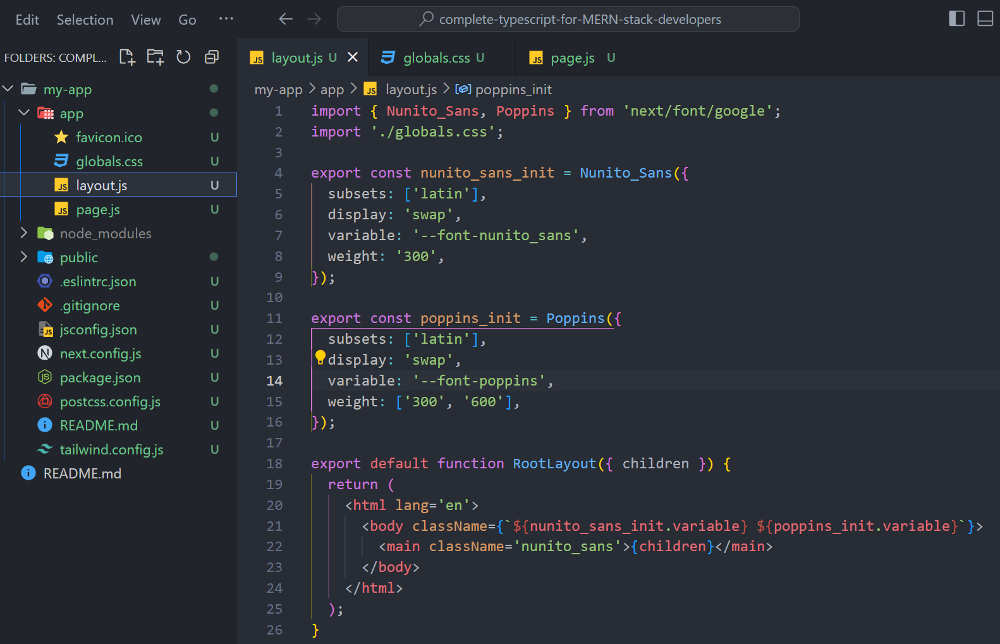
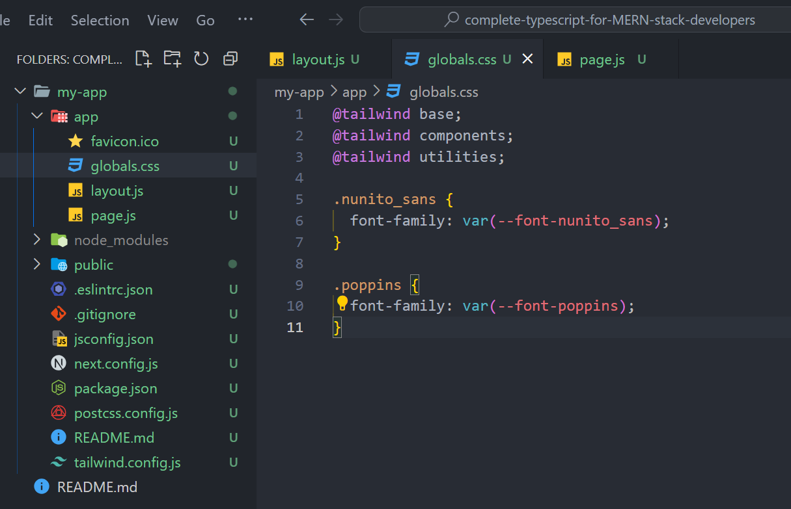
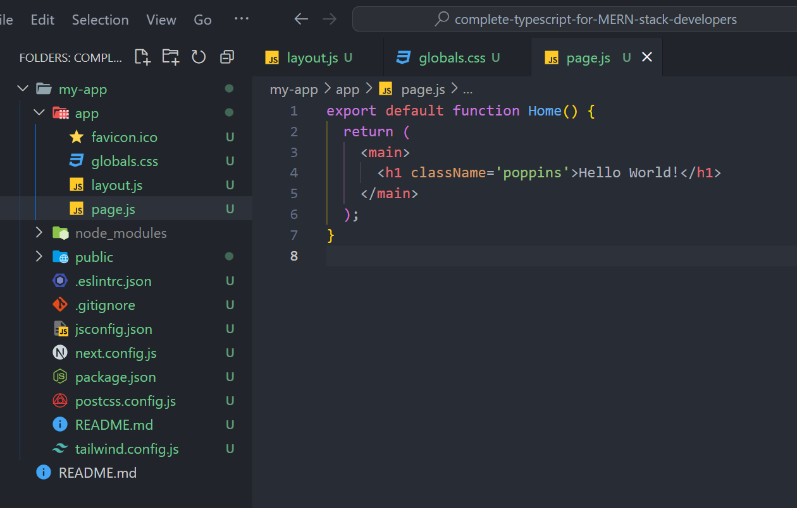
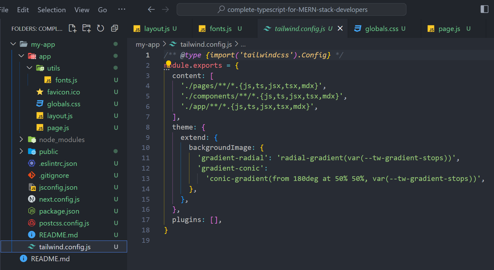
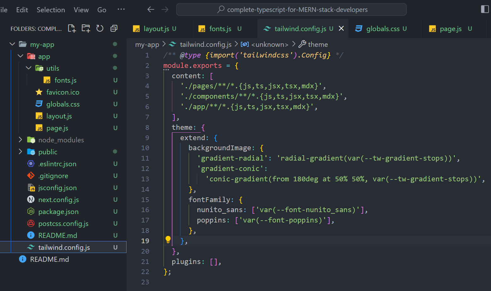

В современном веб-дизайне системы сеток играют важнейшую роль в создании гибких и отзывчивых макетов. Они обеспечивают основу, которая помогает дизайнерам и разработчикам эффективно выравнивать и располагать содержимое веб-страниц. [Vuetify](https://vuetifyjs.com/en/), популярный фреймворк для Vue.js, предлагает встроенную систему сетки с предопределенными классами сетки для упрощения создания отзывчивых макетов. Однако могут возникнуть ситуации, когда необходимо создать собственную систему CSS-сеток для удовлетворения специфических требований к дизайну. В этой статье мы познакомимся с системой сеток Vuetify, поймем ее возможности и рассмотрим создание пользовательской системы сеток с помощью Vuetify.

Если вы хотите создать проект Vue с помощью Vuetify, вы можете использовать встроенный инструмент Vuetify для [scaffold](https://blog.logrocket.com/getting-started-is-vuetify-right-for-you/) его создания. Этот инструмент импортирует все необходимые компоненты Vuetify для вашего приложения. Для начала откройте терминал и введите следующую команду:

```bash
npm create vuetify
```

После завершения процесса создания лесов вы можете начать использовать сервер разработки Vue, введя следующие команды:

```bash
cd vuetify-project
npm dev
```

## Установка Vuetify в существующий проект

Если вы хотите использовать Vuetify в уже созданном проекте, вам необходимо вручную импортировать все необходимые компоненты. Для начала перейдите в папку проекта и установите Vuetify с помощью следующей команды:

```bash
npm install vuetify@^3.1.14
```

После завершения установки нам нужно включить Vuetify в файл main.js приложения. Для этого откройте файл main.js и добавьте код конфигурации, приведенный ниже.

```js
import { createApp } from 'vue';
import App from './App.vue';
// Vuetify
import 'vuetify/styles';
import { createVuetify } from 'vuetify';
import * as components from 'vuetify/components';
import * as directives from 'vuetify/directives';
const vuetify = createVuetify({
	компоненты,
	директивы,
});
createApp(App).use(vuetify).mount('#app');
```

## Понимание системы сетки Vuetify

Прежде чем приступить к созданию собственной системы сетки, давайте разберемся в базовой системе сетки Vuetify. Система сеток Vuetify построена на концепции строк и столбцов, что позволяет вам определять гибкую структуру макета. Основными компонентами, используемыми в системе сетки, являются `grow` и `v-col`.

Компонент `v-row` выступает в качестве контейнера для столбцов, а компонент `v-col` представляет отдельные столбцы в строке. Вы можете добиться отзывчивого и адаптивного макета, указав количество столбцов в строке и настроив отзывчивое поведение.

```vue
<template>
 <v-container class="bg-warning mb-6">
   <v-row
     <v-col cols="6">Колонка 1</v-col>
     <v-col cols="6">Колонка 2</v-col>
   </v-row>
 </v-container>
</template>
```

В приведенном выше примере мы создаем строку с двумя колонками, каждая из которых занимает 50% доступной ширины.

Настройка количества колонок - это только начало. Система сетки Vuetify предоставляет различные возможности для управления полями, отступом, выравниванием содержимого и отзывчивостью. Кроме того, точки разрыва очень важны для адаптации макета к различным размерам экрана.

Ниже приведено изображение, демонстрирующее простой макет сетки `Vuetify` с двумя колонками.



## Настройка грид-системы Vuetify

Хотя встроенная в Vuetify система сеток надежна, могут возникнуть ситуации, когда вам нужно настроить ее для достижения определенного макета или дизайна. К счастью, `Vuetify` предоставляет несколько вариантов пользовательских макетов.

### Определение пользовательской структуры сетки

Чтобы создать пользовательскую структуру сетки в Vuetify, вы можете использовать компоненты `v-row` и `v-col`. Вы можете определить свой уникальный макет сетки, комбинируя эти компоненты и указывая желаемое количество столбцов.

```vue
<template>
 <v-container class="bg-warning mb-6">
   <v-row
     <v-col cols="3">Колонка 1</v-col>
     <v-col cols="6">Колонка 2</v-col>
     <v-col cols="3">Колонка 3</v-col>
   </v-row>
 </v-container>
</template>
```

В примере выше мы создаем строку с тремя колонками, где первая и третья колонки занимают 25 % доступной ширины, а вторая колонка - 50 %. 

### Выравнивание контента и отзывчивое поведение

Система сетки Vuetify предлагает такие реквизиты, как `align` и `justify` для точного выравнивания и распределения контента в строках и колонках. Вы можете использовать эти реквизиты для достижения желаемого выравнивания, например, центрирования содержимого по вертикали или горизонтали.

```vue
<v-row justify="center">
 <v-col cols="4" align="center">Содержание по центру</v-col>
</v-row>
```

В примере выше показано, как центрировать содержимое по горизонтали и вертикали в колонке. 

Чтобы сделать пользовательскую систему сетки отзывчивой, можно использовать точки останова. Vuetify предоставляет предопределенные точки останова, такие как `xs`,

`sm`, `md`, `lg`, and `xl` позволяет адаптировать макет под разные размеры экрана.

```vue
<template>
	<v-container grid-list-md text-xs-center>
		<v-row>
			<v-col class="bg-warning mb-6" sm="6" md="4" lg="3">Отзывчивый столбец</v-col>
		</v-row>
	</v-container>
</template>
```

В приведенном фрагменте кода колонка будет занимать 12 колонок на сверхмалых экранах, шесть - на малых, четыре - на средних и три - на больших. На GIF ниже показано видео, подтверждающее приведенное выше объяснение кода:

### Дополнительные возможности настройки

Система сетки Vuetify предлагает дополнительные возможности для настройки. Например, вы можете применить параметр `no-gutters`, чтобы убрать расстояние между колонками, что позволит создать более компактный макет.

```vue
<template>
 <v-container class="bg-warning mb-6" grid-list-md text-xs-center>
   <v-row no-gutters
     <v-col cols="4">Колонка 1</v-col>
     <v-col cols="4">Колонка 2</v-col>
     <v-col cols="4">Колонка 3</v-col
   </v-row>
 </v-container>
 <v-container class="bg-warning mb-6" grid-list-md text-xs-center>
   <v-row no-gutters>
     <v-col cols="4">Колонка 4</v-col>
     <v-col cols="4">Колонка 5</v-col>
     <v-col cols="4">Колонка 6</v-col
   </v-row>
 </v-container>
</template>
```

В приведенном выше примере создается ряд с тремя колонками, каждая из которых не имеет желобов между собой. Более того, вы можете включить пользовательские классы или расширить систему сетки с помощью дополнительных CSS или плагинов, чтобы добиться уникального стиля и функциональности.

## Лучшие практики для пользовательских систем сеток

При создании пользовательской системы сетки в Vuetify или любом другом фреймворке необходимо следовать лучшим практикам, чтобы обеспечить ремонтопригодность, производительность и доступность. Вот несколько основных лучших практик, о которых следует помнить:

1. Планирование и прототипирование: Прежде чем внедрять пользовательскую систему сетки, составьте план и прототип макета, чтобы понять желаемую структуру и отзывчивость.
2. Доступность и отзывчивый дизайн: Примите во внимание рекомендации по доступности и убедитесь, что ваша система сетки плавно адаптируется к различным размерам экрана и устройствам.
3. Оптимизация производительности: Избегайте чрезмерной вложенности сеток и стремитесь к плоской иерархии, чтобы оптимизировать производительность рендеринга.
4. Тестирование и отладка: Тщательно тестируйте свою систему сеток и используйте методы отладки, например, проверяйте проблемы, связанные с сетками, с помощью инструментов разработчика браузера.
5. Документация и сопровождение: Документируйте свою систему сетки, включая примеры использования и рекомендации, чтобы облегчить дальнейшее обслуживание и сотрудничество.

## Продвинутые техники и примеры использования

Ознакомившись с созданием пользовательской системы сетки в Vuetify, вы можете изучить дополнительные техники и примеры использования для улучшения конкретных макетов. Вот несколько примеров:

### Использование реквизита Align

Мы можем использовать реквизит align для выравнивания дочерних элементов по вертикали внутри родительского контейнера. Мы можем расположить элементы соответствующим образом, применив к родительскому компоненту такие классы, как .align-top, .align-center или .align-bottom. Например, реквизит .align-start можно использовать для размещения элемента в верхней части родительского контейнера, как показано в примере ниже:

```vue
<template>
	<v-container class="bg-warning mb-6">
		<v-row align="start" style="height: 200px">
			<v-col v-for="n in 4" :key="n">
				<v-sheet class="pa-2 ma-2"> OpenReplay </v-sheet>
			</v-col>
		</v-row>
	</v-container>
</template>
```

На следующем изображении показан результат использования атрибута align-start для размещения элемента в верхней части его родительского элемента. На изображении показан результат использования свойства align-start для размещения элемента в самой верхней точке родительского элемента:

### Использование точек останова

Вы могли заметить, что столбцы сетки в предыдущих примерах были одинакового размера. Вы можете настроить сетку, добавив атрибут ‘cols’ к компоненту ‘v-col’. Это позволит вам указать желаемый размер для каждого столбца с помощью следующего кода:

```vue
<template>
	<v-container>
		<v-row class="bg-warning">
			<v-col cols="3">
				<v-sheet class="pa-2 ma-2"> .v-col-3 </v-sheet>
			</v-col>
			<v-col cols="5">
				<v-sheet class="pa-2 ma-2"> .v-col-5 </v-sheet>
			</v-col>
		</v-row>
	</v-container>
</template>
```

На следующем изображении показан результат работы приведенного выше кода: Изображение, показанное выше, иллюстрирует, что сетка остается равномерной по размеру на различных устройствах. Чтобы определить размер каждой сетки на различных устройствах, таких как телефоны, планшеты и настольные компьютеры, мы можем использовать свойства компонента v-col, указав соответствующие точки разрыва устройства, такие как xs, sm, md и так далее.

Вот пример кода, который демонстрирует, как сделать сетки, заполняющие весь родительский контейнер при просмотре на настольных устройствах и переходящие на новую строку при просмотре на мобильных устройствах:

```vue
<template>
 <v-container class="bg-surface-variant">
   <v-row class="mb-6" no-gutters>
     <v-col cols="10" sm="10" md="5" lg="3">
       <v-sheet class="pa-2 ma-2">xs10 sm10 md6 lg3</v-sheet>
     </v-col

     <v-col class="bg-success" cols="5" sm="5" md="3" lg="4">
       <v-sheet class="pa-2 ma-2">xs6 sm5 md3 lg4</v-sheet>
     </v-col
     <v-col class="lg-12 bg-success" cols="5" sm="5" md="3" lg="4">
       <v-sheet class="pa-2 ma-2">xs5 sm5 md3 lg4</v-sheet>
     </v-col>
   </v-row>
 </v-container>
</template>
```

Приведенный выше код создаст отзывчивую сетку, как на рисунке ниже:

## Заключение

Системы сеток являются неотъемлемой частью веб-дизайна, обеспечивая структурированную и отзывчивую структуру макета. Встроенная система сеток Vuetify обеспечивает надежную основу, но создание собственной системы сеток становится необходимым при возникновении специфических требований к дизайну. Используя компоненты и возможности настройки Vuetify, вы сможете создавать уникальные и адаптируемые макеты, соответствующие вашим потребностям.
