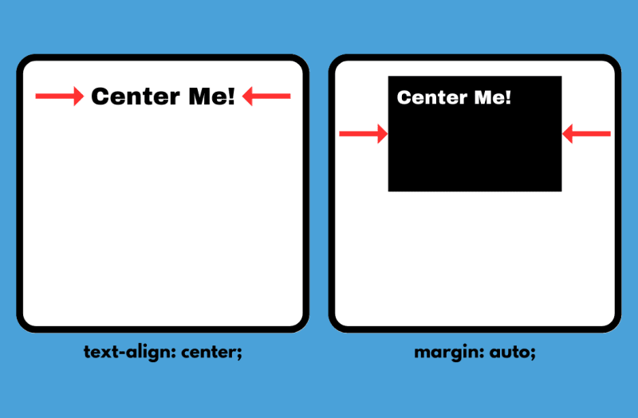
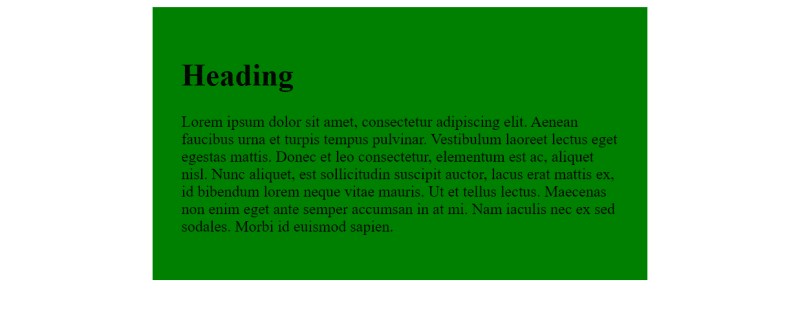
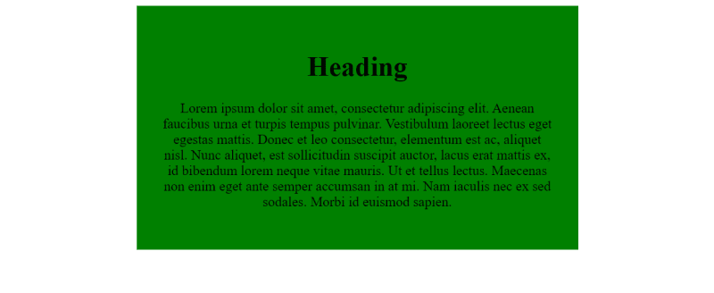
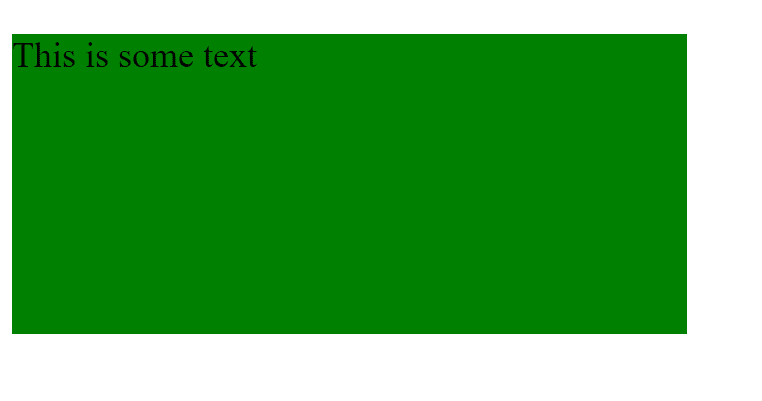
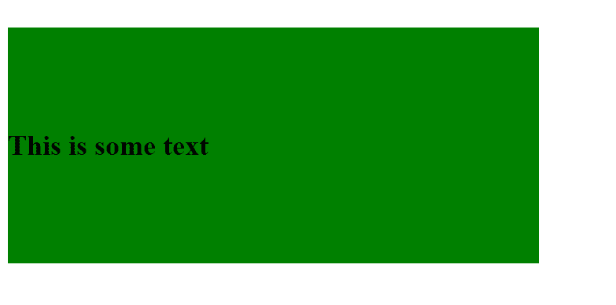
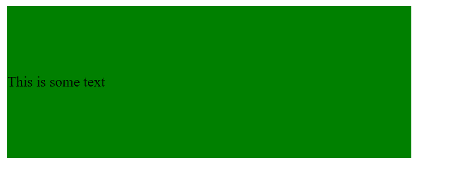
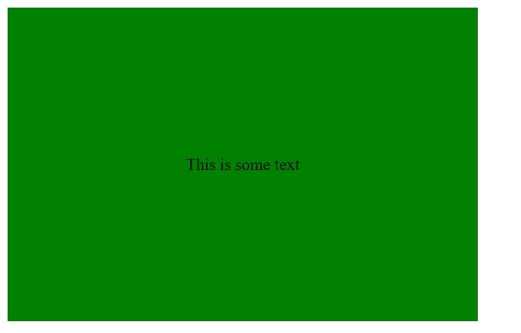

## Как выровнять текст по центру в CSS

В CSS можно центрировать текст как по горизонтали, так и по вертикали, используя несколько различных методов, включая поля, подложки, flexbox, высоту строки и text-align. Способ центрирования текста зависит от того, как оформлена ваша веб-страница, и от того, хотите ли вы центрировать текст по горизонтали, по вертикали или по обоим направлениям. Ниже мы подробно рассмотрим центрирование текста по вертикали с помощью этих методов.

## [](https://dev.to/mlproductions01/how-to-center-text-in-css-5fbg#how-to-horizontally-center-text-in-css)Как горизонтально центрировать текст в CSS

Горизонтальное центрирование текста в CSS может быть достигнуто с помощью свойств text-align и margin CSS. Свойство text-align выравнивает сам текст, в то время как свойство margin используется для центрирования контейнера, в котором находится текст.

[](../../assets/images/xaomf1jipif1fswi4vmo.png)

### [](https://dev.to/mlproductions01/how-to-center-text-in-css-5fbg#horizontal-text-alignment-with-the-textalign-css-property)Горизонтальное выравнивание текста с помощью CSS-свойства text-align

В CSS добавьте свойство text-align: center к селектору, содержащему текст, который нужно выровнять по центру.

#### [](https://dev.to/mlproductions01/how-to-center-text-in-css-5fbg#html)HTML

```html
<div class="center-me">
	<h1>Выровняйте этот заголовок!</h1>
</div>
```

Вход в полноэкранный режим

#### [](https://dev.to/mlproductions01/how-to-center-text-in-css-5fbg#css)CSS

```css
.center-me {
	text-align: center;
}
```

Вход в полноэкранный режим

#### [](https://dev.to/mlproductions01/how-to-center-text-in-css-5fbg#output)Выход

[](../../assets/images/sl5ub140x4vpulbjvzv6.png)

Если вы хотите, чтобы весь текст был выровнен по центру всей страницы, вы можете использовать звездочку (\*) или селекторы body вместо конкретного селектора (см. фрагмент CSS ниже).

#### [](https://dev.to/mlproductions01/how-to-center-text-in-css-5fbg#css)CSS

```css
/* Вариант 1 - селектор тела */
тело {
	text-align: center;
}

/* Вариант 2 - Селектор звездочек */
* {
	text-align: center;
}
```

Вход в полноэкранный режим

### [](https://dev.to/mlproductions01/how-to-center-text-in-css-5fbg#horizontal-text-alignment-with-the-margin-css-property)Горизонтальное выравнивание текста с помощью CSS-свойства margin

Когда вы работаете с элементом на уровне блока, вы можете выровнять его по центру с помощью свойства _**margin: auto**_ в CSS. Это распространенная практика, когда нужно выровнять по центру текст, находящийся внутри блока содержимого. Маргинальное поле auto центрирует содержащий блок, но выравнивание текста остается неизменным.

#### [](https://dev.to/mlproductions01/how-to-center-text-in-css-5fbg#html)HTML

```html
<div class="text-container">
	<h1>Глава</h1>

	Lorem ipsum dolor sit amet, consectetur adipiscing elit. Aenean faucibus urna et turpis tempus
	pulvinar. Vestibulum laoreet lectus eget egestas mattis. Donec et leo consectetur, elementum est
	ac, aliquet nisl. Nunc aliquet, est sollicitudin suscipit auctor, lacus erat mattis ex, id
	bibendum lorem neque vitae mauris. Ut et tellus lectus. Maecenas non enim eget ante semper
	accumsan in at mi. Nam iaculis nec ex sed sodales. Morbi id euismod sapien.
</div>
```

#### [](https://dev.to/mlproductions01/how-to-center-text-in-css-5fbg#css)CSS

```css
.text-container {
	margin: auto;
	ширина: 450px;
	цветфона: зеленый;
	padding: 30px;
}
```

#### [](https://dev.to/mlproductions01/how-to-center-text-in-css-5fbg#output)Выход

[](../../assets/images/qlq2hrt756oufas6qymy.png)

Этот вывод показывает, что **_margin: auto_** центрирует блок содержимого на уровне блока (зеленый), но не изменяет выравнивание самого текста (в данном случае он оставлен по умолчанию, выровненным по левому краю).

Если мы хотим изменить выравниваниечтобы поместить текст в поле содержимого, мы можем использовать для него свойство _**text-align**_ (см. ниже).

#### [](https://dev.to/mlproductions01/how-to-center-text-in-css-5fbg#css)CSS

```css
/* Обратите внимание на добавление text-align: center */
.text-container {
	margin: auto;
	ширина: 450px;
	цветфона: зеленый;
	padding: 30px;
	text-align: center;
}
```

#### [](https://dev.to/mlproductions01/how-to-center-text-in-css-5fbg#output)Выход

[](../../assets/images/y47o0giws0157v2lkftl.png)

---

## [](https://dev.to/mlproductions01/how-to-center-text-in-css-5fbg#how-to-vertically-center-text-in-css)Как выровнять текст по центру в CSS

Выровнять текст по вертикали в CSS можно с помощью свойств line-height и padding CSS. Line-height регулирует минимальную высоту каждой строки, на которой располагается текст - можно представить это как регулировку пространства между строками на линованном листе бумаги. Padding добавляет пространство между краем элемента (границей) и элементами, которые он содержит.

### [](https://dev.to/mlproductions01/how-to-center-text-in-css-5fbg#vertical-text-alignment-with-the-lineheight-css-property)Вертикальное выравнивание текста с помощью CSS-свойства line-height

CSS-свойство **_line-height_** обычно используется для регулировки расстояния между несколькими строками текста (например, в тексте записи блога), но его также можно использовать для вертикального выравнивания текста, если вам известна высота содержащего его элемента.

Вот пример текста внутри содержащего div, у которого явно заданы высота и ширина.

#### [](https://dev.to/mlproductions01/how-to-center-text-in-css-5fbg#html)HTML

```html
<div class="text-container">Это некоторый текст</div>
```

#### [](https://dev.to/mlproductions01/how-to-center-text-in-css-5fbg#css)CSS

```css
p {
	font-size: 1.5rem;
}

.text-container {
	ширина: 450px;
	высота: 200px;
	background-color: green;
}
```

#### [](https://dev.to/mlproductions01/how-to-center-text-in-css-5fbg#output)Выход

Как вы можете видеть ниже, наш текст по умолчанию будет размещен в левом верхнем углу.  
[](../../assets/images/7h9mfmye67ylgrkvp1x6.png)

### [](https://dev.to/mlproductions01/how-to-center-text-in-css-5fbg#css-w-lineheight-centering)CSS с выравниванием по высоте строки

Здесь мы добавили свойство **_line-height_** и установили его на высоту содержащего div.

#### [](https://dev.to/mlproductions01/how-to-center-text-in-css-5fbg#css)CSS

```css
p {
	font-size: 1.5rem;
}

.text-container {
	font-weight: 700;
	ширина: 450px;
	высота: 200px;
	цветфона: зеленый;
	line-height: 200px;
}
```

#### [](https://dev.to/mlproductions01/how-to-center-text-in-css-5fbg#output)Выход

Теперь текст выровнен по вертикали внутри содержащего его div. Обратите внимание, что если вы напишете слишком много текста до момента, когда он перейдет на следующую строку, результат может быть нежелательным.  
[](../../assets/images/ree4vjpbaw3n9e5rtdzl.png)

### [](https://dev.to/mlproductions01/how-to-center-text-in-css-5fbg#vertical-alignment-with-the-padding-css-property)Вертикальное выравнивание с помощью CSS-свойства padding

CSS-свойство **_padding_** обычно используется для добавления пространства между краями (границей) элемента и его содержимым. В некоторых случаях оно может использоваться для вертикального выравнивания текста внутри элемента.

#### [](https://dev.to/mlproductions01/how-to-center-text-in-css-5fbg#html)HTML

```html
<div class="text-container">Это некоторый текст</div>
```

#### [](https://dev.to/mlproductions01/how-to-center-text-in-css-5fbg#css-longform)CSS (длинная форма)

В этом CSS длинной формы используются **_padding-top_** и **_padding-bottom_**. свойства. Вы можете сжать эти свойства в одну строку, как показано в разделе ”Альтернатива CSS (сокращение)" ниже.

```css
.text-container {
	background-color: green;
	ширина: 450px;
	padding-top: 60px;
	padding-bottom: 60px;
}
```

#### [](https://dev.to/mlproductions01/how-to-center-text-in-css-5fbg#css-alternative-shorthand)Альтернатива CSS (сокращение)

Обратите внимание, что свойство **_padding_** выполняет двойную функцию, заменяя **_padding-top_** и **_padding-bottom_** в сокращенном варианте, показанном ниже. Оба варианта CSS, приведенный выше, и сокращенный CSS, показанный здесь, действительны.

```css
.text-container {
	background-color: green;
	ширина: 450px;
	padding: 60px 0;
}
```

#### [](https://dev.to/mlproductions01/how-to-center-text-in-css-5fbg#output)Выход

Установив одинаковые значения верхнего и нижнего отступов, наш текст, содержащий div, увеличивается в высоту, вытесняя наш текст в центр по вертикали.  
[](../../assets/images/izmiajngiayp8kcjqsx7.png)

---

## [](https://dev.to/mlproductions01/how-to-center-text-in-css-5fbg#how-to-horizontally-and-vertically-center-text-in-css)Как горизонтально и вертикально центрировать текст в CSS

Иногда необходимо выровнять текст по центру как по горизонтали, так и по вертикали. Мы можем добиться этого, используя flexbox в нашем CSS, и мы подробно рассмотрим это ниже.

### [](https://dev.to/mlproductions01/how-to-center-text-in-css-5fbg#how-to-use-flexbox-to-horizontally-and-vertically-center-text)Как использовать flexbox для горизонтального и вертикального центрирования текста

Для горизонтального и вертикального центрирования текста мы можем использовать **_display: flex_** наряду с несколькими другими свойствами. В общей сложности мы установим свойства **_display_**, **_justify-content_** и **_align-items_**.

#### [](https://dev.to/mlproductions01/how-to-center-text-in-css-5fbg#html)HTML

Мы поместили наш текст в содержащий элемент (div).

```css
<div class="text-container">
    Это некоторый текст
</div>
```

#### [](https://dev.to/mlproductions01/how-to-center-text-in-css-5fbg#css)CSS

Мы установили содержащий div в flexbox, а затем выровняли текст. Мы используем **_justify-content: center_** для выравнивания текста по горизонтали и **_align-items: center_** для выравнивания текста по вертикали.

```css
.text-container {
	display: flex;
	justify-content: center;
	align-items: center;
	background-color: green;
	ширина: 450px;
	height: 300px;
}
```

#### [](https://dev.to/mlproductions01/how-to-center-text-in-css-5fbg#output)Выход

[](../../assets/images/517cdogpknuu7ox8g73q.png)

## [](https://dev.to/mlproductions01/how-to-center-text-in-css-5fbg#sources)Источники

- CSS Layout - Horizontal & Vertical Align (Источник: [W3Schools](https://www.w3schools.com/css/css_align.asp))
- Как выровнять текст и заголовки по центру в CSS с помощью свойства Text-Align (Источник: [HubSpot](https://blog.hubspot.com/website/center-text-in-css))
