В течение многих лет URL-адреса были синонимом веб-навигации. Но ситуация меняется, особенно с появлением одностраничных приложений. Во вселенной React URL играют ключевую роль в управлении состоянием.

В этой статье мы расскажем вам о трансформации URL как менеджеров состояний в контексте приложений React.

### Предварительные условия

- Основы HTML и CSS
- Основы ES6 JavaScript
- Основы React, React Router и React Hooks.

## Эволюция управления состояниями в React

Давайте совершим путешествие в прошлое:

- **setState**: В первые дни существования React многие полагались на состояние компонентов, особенно в рамках [class components](https://react.dev/reference/react/Component#defining-a-class-component). Это было просто для управления данными конкретного компонента. Но это было не идеально для больших приложений.
- **Redux и MobX**: По мере роста сложности приложений появились такие инструменты, как [Redux](https://redux.js.org/) и [MobX](https://mobx.js.org/README.html). Они централизовали управление данными, упростив работу с данными всего приложения.
- **Контекстный API и хуки**: Собственный [Context API](https://react.dev/reference/react/useContext) React в сочетании с появлением хуков позволил создать более нативный способ управления глобальным состоянием без добавления дополнительных библиотек.

## Управление состоянием с помощью URL-адресов

Поначалу использование URL для управления состоянием может показаться необычным. Но по мере дальнейшего изучения вы обнаружите несколько очевидных преимуществ:

- **Сохраните свое место**: Сохраняя состояние в URL, ваша веб-страница запоминает ваше местоположение. Так, если вы добавите страницу в закладки, она будет выглядеть так же, когда вы вернетесь к ней позже.
- **Удобный совместный доступ**: Если вы просматриваете что-то конкретное на странице, например продукт или график, вы можете поделиться URL-адресом. Любой, кто нажмет на него, увидит именно то, что видите вы, что упрощает совместную работу.
- **Устранение неполадок с легкостью**: Разработчики могут быстрее находить и устранять проблемы, поскольку URL-адрес показывает состояние приложения. Они могут увидеть проблемы, просто щелкнув по общей ссылке.

Одним словом, использование URL-адресов таким образом помогает сохранить место, поделиться конкретными мнениями и упростить решение проблем для разработчиков.

## Как реализовать управление состоянием на основе URL

Учитывая объем этого раздела, вот все, что вы узнаете.

1. Как настроить среду
2. Очистка от беспорядка
3. Разбивка и анализ проекта
4. Установка необходимых зависимостей
5. Как получить данные и разработать пользовательский интерфейс
6. Как хранить состояние в URL
7. Как прочитать состояние, сохраненное в URL
8. Как настроить страницу продукта

### Как настроить среду

Откройте встроенный терминал или терминал редактора кода (предпочтительно) и выполните следующие действия:

```bash
npm create vite@latest

```

Эта команда использует [Vite](https://vitejs.dev/guide/) (легкий инструмент, который используется для создания быстрых и оптимизированных веб-приложений) для создания среды веб-приложений. Перейдите вниз с помощью клавиш со стрелками и выберите React.

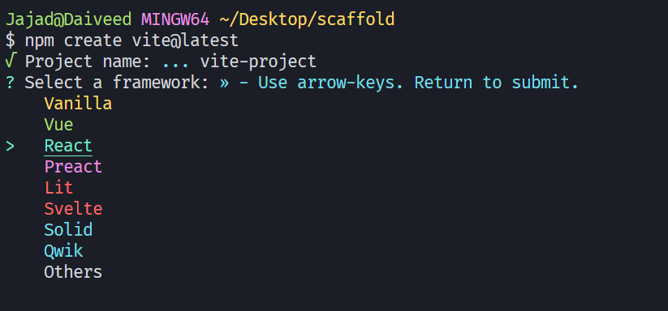

Выбор React в настройках Vite

Затем выберите желаемую комбинацию языков - я буду использовать обычный JS.

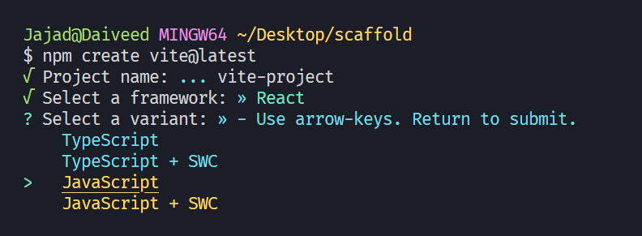

Выбор языка в React

Далее перейдите в папку react, используя папку cd “project-name”, и запустите `npm install` для установки всех зависимостей проекта.

Наконец, запустите сервер разработки, выполнив команду `npm run dev` и перейдя по соответствующему URL ([http://localhost:5173/](http://localhost:5173/)).

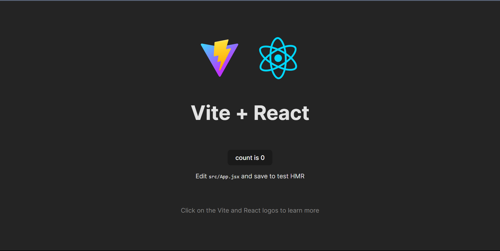

Сервер разработки запущен

### Очистка от беспорядка

Обязательно очистите содержимое всех CSS-файлов и удалите `App.css`, так как вам понадобится только 1 файл стилей. Затем очистите содержимое компонента `App` и замените его базовым JSX-контентом.

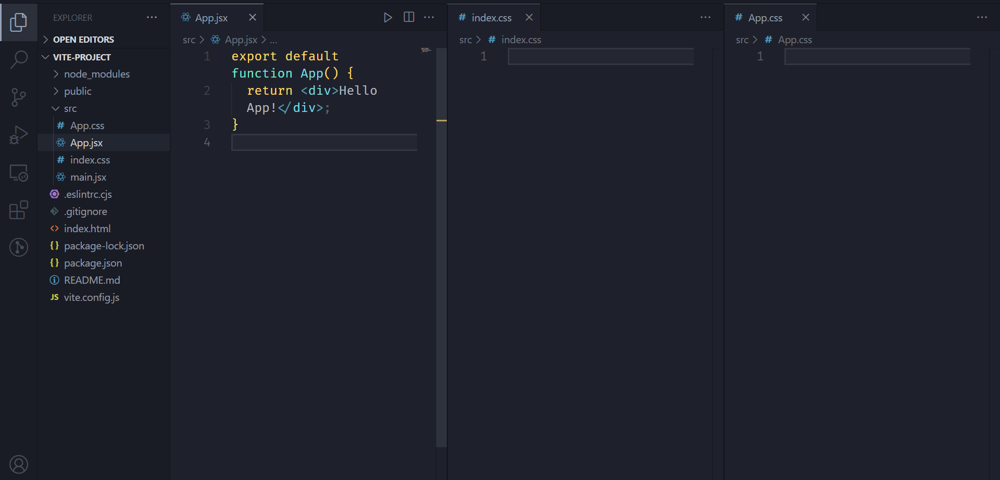

Очистка от беспорядка в среде Dev

В результате на вашем локальном сервере появится чистая страница, которая будет выглядеть следующим образом:

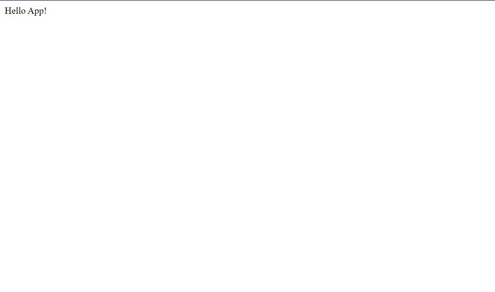

Очистить страницу сервера

### Разбивка проекта / анализ

Проект предполагает получение данных из API и сохранение этих данных в глобальном виде через URL, чтобы они были доступны через множество компонентов/страниц.

В качестве примера можно привести ситуацию, когда вы находитесь на своем любимом сайте электронной коммерции, видите крутой гаджет и хотите поделиться им со своим другом.

Обычно вы делитесь ссылкой из браузера с друзьями в социальных сетях DM, по которой они могут посмотреть тот же товар без лишних хлопот, открыв ссылку, которую вы им отправили.

Вот краткий взгляд на проект, который мы собираемся создать: 😉


Незаметный взгляд на полный проект

Заинтригованы? 🌚 Тогда давайте погрузимся внутрь.

### Установите необходимые зависимости

Прежде чем размещать что-либо на странице, необходимо полностью сконфигурировать среду разработки с необходимыми зависимостями.

- [json-server](https://www.npmjs.com/package/json-server): Этот пакет размещает ваши данные на локальном сервере, позволяя вам получать их как внешние API.
- [react-router](https://www.npmjs.com/package/react-router): Этот пакет позволяет React создавать SPA, обеспечивающие навигацию без обновления страницы.

```bash
npm i json-server react-router-dom
```

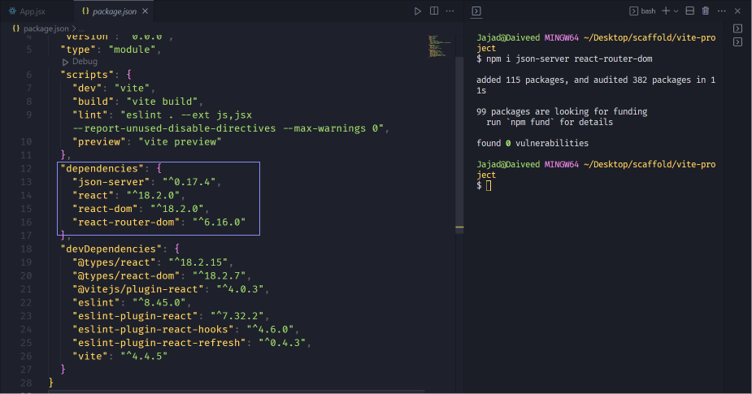

Установка зависимостей

- Затем загрузите JSON-данные с этого [GitHub(json-data)](https://github.com/Daiveedjay/URL-State-Management/tree/main/data), а активы - с этого [GitHub(../../assets-data)](https://github.com/Daiveedjay/URL-State-Management/tree/main/public/../../assets).

Теперь создайте папку data в корневом каталоге проекта и поместите в нее файл JSON. Затем создайте папку ../../assets в вашем общем каталоге и поместите все изображения в эту папку.

Ваша текущая структура папок должна выглядеть следующим образом:

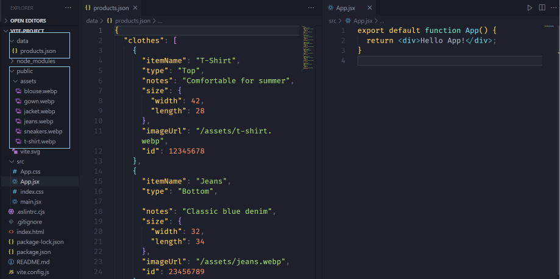

Структура папок после загрузки файлов

Далее измените файл package.json, добавив в него скрипт, запускающий json-сервер

```json
"server": "json-server --watch data/products.json --port 9000"

```

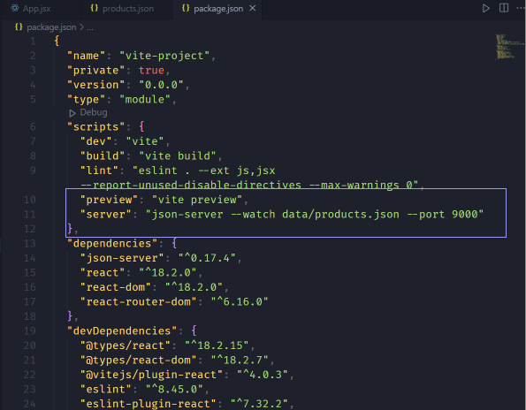

Добавление серверного скрипта в package.json

После этого откройте терминал и запустите сервер с помощью `npm run server`:

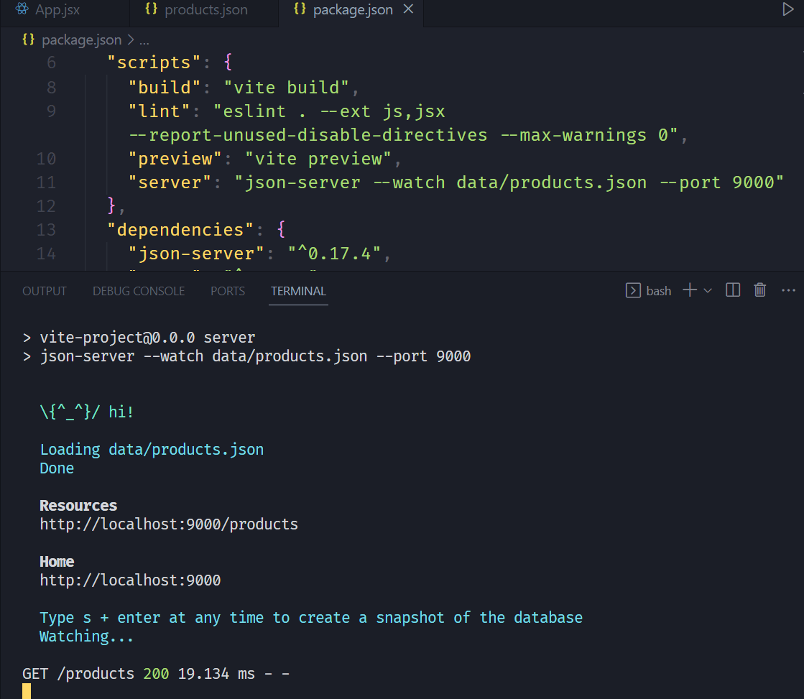

Запуск сервера данных

После этого ваш сервер запущен, и содержимое вашего JSON-файла доступно по указанному URL.

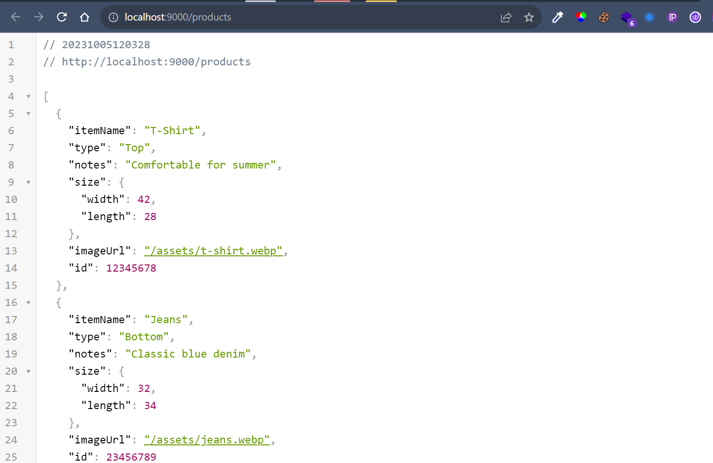

Данные в браузере

Ps: Если вы хотите просматривать JSON-файлы в браузере, как это делаю я, скачайте расширение для браузера - [JSON Viewer](https://chrome.google.com/webstore/detail/json-viewer/gbmdgpbipfallnflgajpaliibnhdgobh).

### Как получить данные и разработать пользовательский интерфейс

Начните с создания компонента HomePage и импортируйте его в компонент App. Этот компонент будет содержать все данные на первом экране, который вы видели ранее.

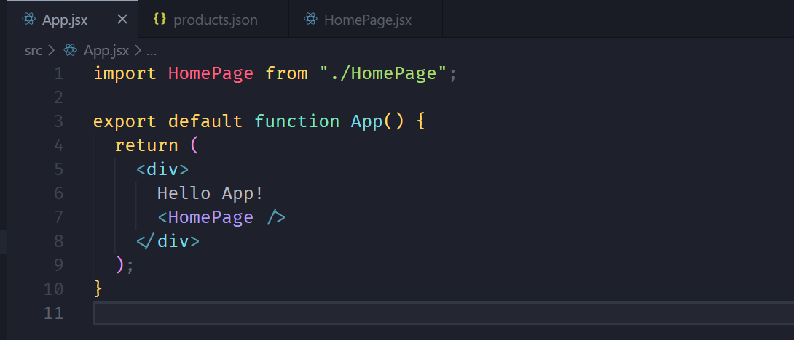

Импортирование домашней страницы

В компоненте `HomePage` используйте хук `useEffect` для получения всех данных из локального API.

```js
import { useEffect } from 'react';

export default function HomePage() {
	useEffect(function () {
		async function fetchData() {
			try {
				const res = await fetch('http://localhost:9000/products');
				const clothesData = await res.json();
				console.log(clothesData);
			} catch (error) {
				console.log(error);
			}
		}
		fetchData();
	}, []);

	return (
		<main className="homepage">
			<h1>Домашняя страница моего фиктивного продукта</h1>.
		</main>
	);
}
```

На данный момент вы уже можете просмотреть полученные данные в консоли.

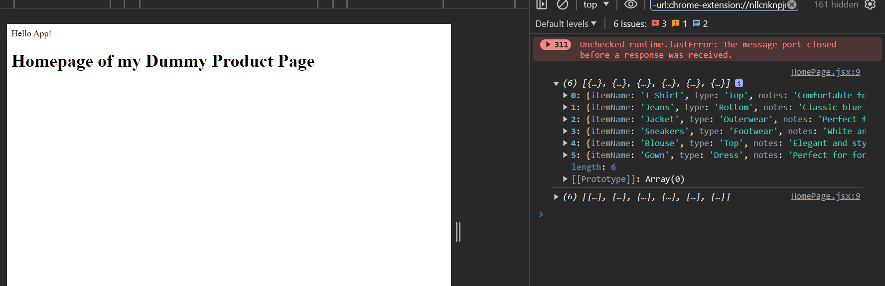

Доказательства получения данных

Затем сохраните данные в состоянии с помощью хука `useState` и заполните интерфейс этими данными.

```js
import { useEffect, useState } из 'react';

export default function HomePage() {
const [products, setProducts] = useState([]);

    useEffect(function () {
    	async function fetchData() {
    		try {
    			const res = await fetch('http://localhost:9000/products');
    			const clothesData = await res.json();
    			console.log(clothesData);
    			//Хранение происходит здесь
    			setProducts(clothesData);
    		} catch (error) {
    			console.log(error);
    		}
    	}
    	fetchData();
    }, []);

    return (
    	<main className="homepage">
    		<h1>Домашняя страница моей фиктивной страницы продукта</h1>
    		<div className="products__list">
    			{products.map((product) => (
    				<div key={product.id} className="product__item">
    					
    					<h2>{product.itemName}</h2>
    				</div>
    			))}
    		</div>
    	</main>
    );

}

```

Все стили, необходимые в этом проекте, находятся в этом [CSS-файле](https://github.com/Daiveedjay/URL-State-Management/blob/main/src/index.css). В качестве альтернативы вы можете вставить эти стили в свой index.css, что даст тот же результат.

```css
@import url('https://fonts.googleapis.com/css2?family=Nunito:wght@400;700&display=swap');

*,
::before,
::after {
	margin: 0;
	padding: 0;
	box-sizing: border-box;
}
html {
	font-size: 62.5%;
}
body {
	font-family: 'Nunito', sans-serif;
}

h1 {
	text-align: center;
	font-weight: 700;
	font-size: 3rem;

	& span {
		курсор: указатель;
		margin-right: 3rem;
	}
}

a,
h3 {
	оформлениетекста: нет;
	color: #a04000;
}

img {
	ширина: 100%;
	display: block;
	transition: all ease-in 0.3s;
}

.homepage {
	min-height: 100vh;
	display: flex;
	align-items: center;
	padding: 1rem;
	flex-direction: column;
	gap: 3rem;

	& > * {
		width: 100%;
	}
}

.products__list {
	количествоколонок: 1;
	column-gap: 2rem;
	padding: 2rem;

	& > * {
		break-inside: avoid;
		margin-bottom: 2rem;
	}

	& .product__item {
		border-radius: 1rem;
		overflow: hidden;
		display: block;
		position: relative;
		transition: all ease-in 0.3s;

		& h2 {
			background: #fff;
			bottom: 5px;
			left: 5px;
			padding: 0.5rem 1rem;
			border-radius: 5px;
			z-index: 2;
			положение: абсолютное;
			transition: all ease-in 0.3s;
		}

		&:hover img {
			scale: 1.1;
		}

		&:hover h2 {
			transform: translate(10px, -10px);
		}
	}
}

.single__product {
	отображение: flex;
	flex-direction: column;
	padding: 2rem;
	gap: 4rem;
	border-radius: 1rem;
	overflow: hidden;

	& section {
		display: flex;
		justify-content: center;
		flex-direction: column;

		& figure {
			border-radius: 1rem;
			overflow: hidden;

			& .product__img {
				ширина: 100%;
			}
		}

		& aside {
			display: flex;
			flex-direction: column;
			justify-content: flex-end;
			padding: 1.5rem;

			& > h2 {
				font-size: 2.5rem;
			}
			& > h3 {
				font-size: 1.6rem;
			}
			& span {
				background: rgba(160, 64, 0, 0.5);
				padding-inline: 1rem;
				align-self: flex-start;
			}
		}
	}
}

/* Малые устройства (портретные планшеты и большие телефоны, 600px и выше) */
@media only screen and (min-width: 600px) {
	.products__list {
		column-count: 2;
	}

	.single__product {
		& section {
			flex-direction: row;

			& .product__img {
				max-width: 300px;
			}
		}
	}
}

/* Средние устройства (планшеты с альбомной ориентацией, 768px и выше) */
@media only screen and (min-width: 768px) {
	.homepage {
		padding: 2rem 4rem;
	}
	.products__list {
		количествоколонок: 3;
	}
}
```

На данный момент ваша домашняя страница уже должна выглядеть идентично демо-версии.

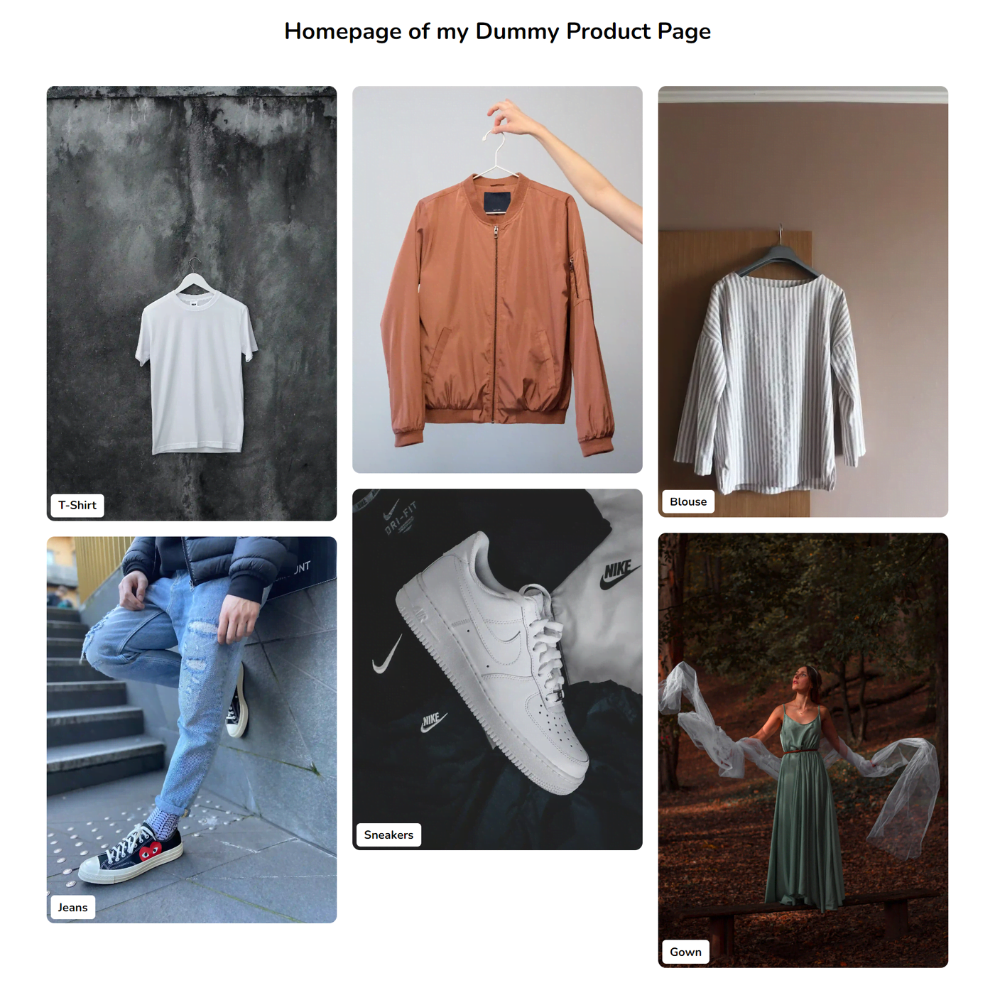

Главная страница с добавленными стилями

### Как хранить состояние в URL

Чтобы управлять состоянием и обмениваться им между несколькими страницами с помощью URL, сначала нужно определить маршруты с помощью пакета react-router.

Начните с создания маршрута для главной страницы:

```js
import { BrowserRouter, Route, Routes } from 'react-router-dom';

import HomePage from './HomePage';

export default function App() {
	return (
		<BrowserRouter>
			<Routes>
				<Route index element={<HomePage />} />
			</Routes>
		</BrowserRouter>
	);
}
```

- Компонент **BrowserRouter** оборачивает все ваше приложение или ту его часть, в которой вы хотите использовать маршрутизацию.
- Компонент **Routes** оборачивает все ваши компоненты **Route** и отвечает за рендеринг первого маршрута, который соответствует текущему местоположению.
- Компонент **Route** представляет собой один маршрут в вашем приложении.

Далее создайте компонент `ProductItem`, отвечающий за отображение одного товара и эквивалентного ему маршрута.

```js
import { BrowserRouter, Route, Routes } from 'react-router-dom';

import HomePage from './Homepage';
import ProductItem from './ProductItem';

export default function App() {
	return (
		<BrowserRouter>
			<Routes>
				<Route index element={<HomePage />} />
				<Route path="product" element={<ProductItem />} />
			<Рауты>
		</BrowserRouter
	);
}
```

Чтобы просмотреть компонент `ProductItem`, перейдите на свою `HomePage` и оберните каждый отдельный продукт элементом `Link`, указывающим на страницу продукта с его уникальным ID.

```js
import { useEffect, useState } from 'react';
import { Link } from 'react-router-dom';

export default function HomePage() {
	const [products, setProducts] = useState([]);

	useEffect(function () {
		async function fetchData() {
			const res = await fetch('http://localhost:9000/products');

			const clothesData = await res.json();
			console.log(clothesData);
			setProducts(clothesData);
		}
		fetchData();
	}, []);

	return (
		<main className="homepage">
			<h1>Домашняя страница моей фиктивной страницы продукта</h1>
			<div className="products__list">
				{products.map((product) => (
					<Link
						key={product.id}
						// Переход на страницу продукта
						to={`/product?id=${product.id}`}
						className="product__item"
					>
						
						<h2>{product.itemName}</h2>
					</Link>
				))}
			</div>
		</main>
	);
}
```

Теперь при нажатии на любой товар вы перейдете на страницу товара и увидите компонент `ProductItem`.

При ближайшем рассмотрении вы можете заметить, что id каждого элемента добавляется к URL через свойство id (например: product?id=12345678). Это означает, что вы успешно сохранили состояние id в URL.


### Как прочитать состояние, сохраненное в URL

Чтобы отобразить данные для каждого товара, необходимо переad состояние, хранящееся в URL.

Чтобы реализовать это, начните с создания нового пользовательского хука (это поможет в повторном использовании). В своем пользовательском хуке импортируйте хук `useSearchParams`.

```js
import { useSearchParams } from 'react-router-dom';

export function useURLID() {
	const [searchParams] = useSearchParams();
}
```

Хук `useSearchParams` позволяет вам взаимодействовать с параметрами запроса URL (часть URL, которая идет после ?, как показано в вашем URL ранее).

Чтобы получить значения из URL, используйте метод `get` и передайте имя значения, которое вы хотите получить, в данном случае `id`.

```js
import { useSearchParams } from 'react-router-dom';

export function useURLID() {
	const [searchParams] = useSearchParams();
	const id = searchParams.get('id');
	return { id };
}
```

Чтобы протестировать ваш хук, импортируйте его на страницу `ProductItem` и извлеките значения.

```js
import { useURLID } from './useURLID';

export default function ProductItem() {
	const { id } = useURLID();
	return <div>Product Item {id}</div>;
}
```


И вуаля! Теперь ваше состояние id стало глобальным и может использоваться любым компонентом в вашем приложении. Браво!

### Как настроить страницу продукта

Чтобы полностью реализовать то, что было показано в демо, выполните еще одну выборку на основе id, чтобы получить данные о товаре.

Начните с создания состояний для хранения данных и учета их загрузки.

```js
const [singleProduct, setSingleProduct] = useState({});
const [loading, setLoading] = useState(false);
```

Затем используйте хук `useEffect` для получения и хранения данных на основе уникального идентификатора товара.

```js
useEffect(() => {
	async-функция fetchData() {
		setLoading(true);
		try {
			const res = await fetch(`http://localhost:9000/products/${id}`);

			const data = await res.json();

			setSingleProduct(data);
		} catch (error) {
			console.log(error);
		} finally {
			setLoading(false);
		}
	}
	fetchData();
}, [id]);
```

Далее используйте полученные данные для заполнения интерфейса.

```js
import { useEffect, useState } из 'react';
import { useURLID } from './useURLID';

export default function ProductItem() {
const { id } = useURLID();
const [singleProduct, setSingleProduct] = useState({});
const [loading, setLoading] = useState(false);

    useEffect(() => {
    	async function fetchData() {
    		setLoading(true);
    		try {
    			const res = await fetch(`http://localhost:8000/products/${id}`);

    			const data = await res.json();

    			setSingleProduct(data);
    		} catch (error) {
    			console.log(error);
    		} finally {
    			setLoading(false);
    		}
    	}
    	fetchData();
    }, [id]);

    // В случае загрузки отобразите загрузочный div
    if (loading) return <div>Loading...</div>;

    // Если не загружается, отобразите информацию о товаре
    return (
    	<div className="single__product">
    		<h1>
    			<span>
    				{singleProduct.itemName} ID страницы: {id}
    			</span>
    		</h1>
    		<раздел>
    			<figure className="product__img-container">
    				
    			</figure>
    			<aside>
    				<h2>{singleProduct.itemName}</h2>
    				<h3>{singleProduct.notes}</h3>
    				<h4>
    					Категория: <span>{singleProduct.type}</span>
    				</h4>

    					Ширина: <strong>{singleProduct?.size?.width}</strong>.


    					Длина: <strong>{singleProduct?.size?.length}</strong>.

    			</aside>
    		</section>
    	</div>
    );

}

```

Наконец, для удобства навигации предусмотрите кнопку ”Назад" для перехода на главную страницу. Это можно сделать с помощью хука `useNavigate` в react-router. Этот хук предоставляет функцию, которая позволяет вам программно переходить к другим частям вашего приложения.

Просто импортируйте хук `useNavigate` и инициализируйте его переменной, как показано ниже:

```js
import { useNavigate } from 'react-router-dom';
const navigate = useNavigate();
```

Затем вызовите эту функцию с обработчиком событий и передайте маршрут главной страницы.

```js
import { useEffect, useState } from 'react';
import { useURLID } from './useURLID';
import { useNavigate } from 'react-router-dom';

export default function ProductItem() {
const { id } = useURLID();
const [singleProduct, setSingleProduct] = useState({});
const [loading, setLoading] = useState(false);

    useEffect(() => {
    	async function fetchData() {
    		setLoading(true);
    		try {
    			const res = await fetch(`http://localhost:9000/products/${id}`);

    			const data = await res.json();

    			setSingleProduct(data);
    		} catch (error) {
    			console.log(error);
    		} finally {
    			setLoading(false);
    		}
    	}
    	fetchData();
    }, [id]);

    const navigate = useNavigate();

    // При загрузке отобразите div загрузки
    if (loading) return <div>Loading...</div>;

    // Если не загружается, отобразите информацию о товаре
    return (
    	<div className="single__product">
    		<h1>
    			// Переход на главную страницу
    			<span onClick={() => navigate('/')}>🔙 </span>
    			<span>
    				{singleProduct.itemName} ID страницы: {id}
    			</span>
    		</h1>
    		<раздел>
    			<figure className="product__img-container">
    				
    			</figure>
    			<aside>
    				<h2>{singleProduct.itemName}</h2>
    				<h3>{singleProduct.notes}</h3>
    				<h4>
    					Категория: <span>{singleProduct.type}</span>
    				</h4>

    					Ширина: <strong>{singleProduct?.size?.width}</strong>.


    					Длина: <strong>{singleProduct?.size?.length}</strong>.

    			</aside>
    		</section>
    	</div>
    );

}

```

Проверка конечного результата теперь дает следующее:


Финальный дубль, демонстрирующий все возможности

## Примеры реального мира

- Платформы электронной коммерции\*\*: Подумайте о таких сайтах, как Amazon. Они используют URL-адреса, позволяющие делиться информацией о поиске или настройке конкретных товаров. Благодаря этому люди могут легко делиться своими любимыми товарами или списками покупок с друзьями.
- **Инструменты для работы с данными**: Такие инструменты, как [Tableau](https://www.tableau.com/), сохраняют ваши пользовательские представления в URL. Это означает, что команды могут делиться друг с другом конкретными изображениями данных, что позволяет быстрее и четче обсуждать, показывать и принимать решения.

### Дополнительная информация

Я хотел бы обратить внимание на пару моментов, которые в статье не освещены.

- Используемый CSS содержит [native CSS nesting](https://developer.chrome.com/articles/css-nesting/), который не полностью поддерживается всеми браузерами, поэтому если вы заметили неровности в пользовательском интерфейсе, это может быть связано с используемым браузером. Не стесняйтесь перейти на браузер вроде Google Chrome для лучшей поддержки или проверьте поддержку браузера с помощью такого инструмента, как [CanIUse](https://caniuse.com/), и добавьте полифиллы в свой код.
- Если эта статья затронула несколько сложные для вас темы (как работает маршрутизация), не стесняйтесь ознакомиться с этой статьей [Routing Animations](https://www.freecodecamp.org/news/improve-user-experience-in-react-by-animating-routes-using-framer-motion/) для лучшего понимания.
- Если вас интересует полный код, вот репозиторий [GitHub](https://github.com/Daiveedjay/URL-State-Management), а Live-версия находится здесь. [Demo](https://free-code-camp-url-state-manangement.netlify.app/)
- В качестве дополнительной функции я сделал код полностью отзывчивым для всех, кто заинтересован в создании кладочных сеток для будущих проектов, будьте здоровы!🍷

## Заключение

Управление состоянием в React развивалось, и среди них выделяется состояние на основе URL. Этот метод не только упрощает управление состояниями, но и способствует сотрудничеству и прозрачности между пользователями и разработчиками.

Так что в следующий раз, когда вы будете сидеть в интернете и думать о том, чтобы поделиться данными через URL, помните, что у вас есть инструменты, чтобы реализовать эту возможность самостоятельно 😉. Это толчок для разработчиков к изучению неиспользованного потенциала URL в управлении состоянием.

```

```
