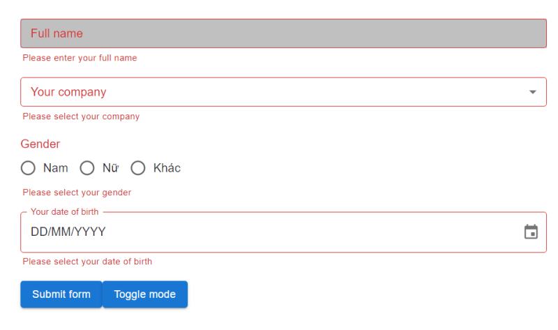

Когда мы используем такие библиотеки пользовательского интерфейса, как Material UI, в нашем проекте React, иногда нам нужно настроить цвет в темном и светлом режимах вместо того, чтобы использовать цвета по умолчанию. В этом посте мы расскажем вам, как это сделать.

- Во-первых, убедитесь, что вы установили Material UI, если вы еще не установили его, давайте напечатаем:

```bash
npm install @mui/material @emotion/react @emotion/styled
```

- Далее мы создадим файл с именем `custom-themes.ts`:

```js
// custom-themes.ts
import { experimental_extendTheme as extendTheme } from "@mui/material/styles";

//Если вы используете TypeScript, вы должны объявить название вашего пользовательского цвета как в PaletteOptions, так и в Palette в модуле "@mui/material/styles"
объявить модуль "@mui/material/styles" {
  интерфейс PaletteOptions {
    "bg-text-input": string;
  }
  interface Palette {
    "bg-text-input": string;
  }
}

const customTheme = extendTheme({
  cssVarPrefix: "",
  colorSchemes: {
    свет: {
      палитра: {
        "bg-text-input": "#C0C0C0", // Укажите цвет в режиме освещения для "bg-text-input"
      },
    },
    тёмный: {
      palette: {
        "bg-text-input": "#0f1a2a", // Укажите цвет в темном режиме для "bg-text-input"
      },
    },
  },
});

export default customTheme;
```

- В файле `App.tsx` мы обернем компонент `<CssVarsProvider />` в верхней части. Затем нужно добавить свойство `theme` в этот компонент, оно получит `customTheme`, которое мы объявили выше в качестве значения. И не забудьте добавить `<CssBaseline />`, потому что без него темный режим работать не будет.

```js
// App.tsx
import { Box, CssBaseline } from '@mui/material';
import { Experimental_CssVarsProvider as CssVarsProvider } from '@mui/material/styles';

import Home from './pages/Home';
import customTheme from './themes/custom-themes';

const App = () => {
	return (
		<CssVarsProvider theme={customTheme}>
			<CssBaseline />
			<Box
				sx={{
					minHeight: '100vh',
					width: '100%',
					maxWidth: '1200px',
					margin: 'auto',
					paddingTop: 10,
					paddingLeft: 30,
					paddingRight: 30,
					paddingBottom: 30,
				}}
			>
				<Home />
			</Box>
		</CssVarsProvider>
	);
};

export default App;
```

- Мы также создадим файл с именем `_variables.scss`. В этом файле будут заново объявлены все наши пользовательские цвета, которые мы объявили в файле `custom-themes.ts`. Это нужно для того, чтобы мы могли использовать наши пользовательские цвета в scss. Это удобно для настройки вложенных элементов в Material UI, которые мы не можем стилизовать напрямую. Я покажу вам это наглядно ниже.

```js
// _variables.scss
$bg-text-input: var(--palette-bg-text-input);
```

> `--палитра-bg-text-input` была создана Material UI в `:root`.

[](../../assets/images/xwnmcyyvx2ec8xsrz5ha.png)

- А теперь пример, в котором мы хотим настроить цвет фона в компоненте TextField.

```js
import React from "react";
import { TextField, TextFieldProps } from "@mui/material";

type TInputProps = TextFieldProps & {};

const Input = React.forwardRef<HTMLInputElement, TInputProps>(
  ({ ...otherProps }, ref) => {
    return (
      <TextField
        size="small"
        fullWidth
        ref={ref}
        {...otherProps}
        sx={{backgroundColor: (theme) => theme.palette["bg-text-input"]}}
      />
    );
  }
);

export default Input;
```

- Упс, цвет фона переходит на наш вспомогательный текст

[](../../assets/images/06iv904iq2vsh8hf8xg0.png)

- Поэтому нам нужно создать файл `.scss` для стилизации вложенного элемента. Сначала нам нужно нажать F12, чтобы увидеть именно тот элемент, который мы хотим стилизовать.

[](../../assets/images/12lzfensn6xk7r0w6w35.png)

Элемент, цвет фона которого мы хотим стилизовать, - это eлемент, который имеет class=“MuiInputBase-input”. Таким образом, в файле `Input.module.scss` это будет выглядеть следующим образом:

```js
@import "src/themes/variables";

.Input {
  & :global(.MuiFormHelperText-root) {
    margin-left: 3px;
  }
  & :global(.MuiInputBase-input) {
    background-color: $bg-text-input;
  }
}
```

и теперь в нашем пользовательском компоненте TextField:

```js
import React from "react";
import { TextField, TextFieldProps } из "@mui/material";

import styles from "./Input.module.scss";

type TInputProps = TextFieldProps & {};

const Input = React.forwardRef<HTMLInputElement, TInputProps>(
  ({ ...otherProps }, ref) => {
    return (
      <TextField
        size="small"
        fullWidth
        ref={ref}
        {...otherProps}
        className={styles.Input} // Укажите класс обертки для этого компонента
      />
    );
  }
);

export default Input;
```

[](../../assets/images/b98926u0i869bwgy9kgc.png)

- Теперь это выглядит лучше.
- Наконец, мы создадим кнопку для переключения между светлым и темным режимом. Мы используем хук, предоставляемый Material UI, под названием `useColorScheme`:

```js
import { Button, useColorScheme } from "@mui/material";

const ToggleModeButton = () => {
  const { mode, setMode } = useColorScheme();
  return (
    <Кнопка
        variant="contained"
        sx={{ mt: 2, textTransform: "none" }}
        onClick={() => {
          setMode(mode === "light" ? "dark" : "light");
        }}
      >
        Переключение режима
      </Button>
  )
}
```

- И теперь мы увидим результат:

[](../../assets/images/qctv9kxbgdj9857v1qpp.png)
Режим освещения

[](../../assets/images/zkgpo373s5v21hgqeeou.png)
Темный режим

- Спасибо, что читаете здесь. Надеюсь, этот пост поможет вам <3.
