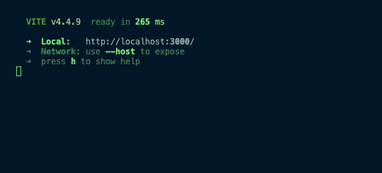
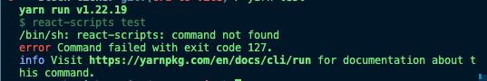

Команда React больше не рекомендует использовать [create-react-app (CRA)](https://github.com/facebook/create-react-app) в качестве бандлера для создания нового React-приложения. Команда и сообщество поняли, что хотя CRA и является стартовым инструментом, ему не хватает гибкости, необходимой для настройки и управления большими и сложными приложениями.

Сейчас команда рекомендует использовать [production-grade React-фреймворки](https://react.dev/learn/start-a-new-react-project#production-grade-react-frameworks), такие как [NextJS](https://nextjs.org/), [Remix](https://www.freecodecamp.org/news/p/b2e8aa42-17f7-486f-9fab-b47f9704248b/Remix), [Gatsby](https://www.gatsbyjs.com/) или [Expo](https://expo.dev/) для нативных приложений. Хотя фреймворки являются предпочтительным выбором, команда React также рекомендует использовать [Vite](https://vitejs.dev/) или [Parcel](https://parceljs.org/) для пользовательских процессов сборки.

Отчасти это связано с тем, что пакет [CRA не обновлялся](https://www.npmjs.com/package/create-react-app) уже около года. Это может вызвать некоторые проблемы, когда пакеты, уже обновленные до более свежих версий, не могут быть использованы в существующем приложении. В результате вам может потребоваться обновить существующие приложения, заменив пакет CRA на рекомендованные альтернативы - Vite или Parcel.

В этой статье мы рассмотрим шаги по миграции производственного приложения с CRA на Vite. Вы узнаете, зачем нужен каждый шаг, как сохранить `Jest` для тестов и как обновить `browserslist`, поскольку он не работает с `vite` из коробки.

В разделе ”Заключение" вы найдете пример запроса на исправление, который включает все изменения. В конце каждого шага вы найдете пример текста коммита, который показывает, какие изменения кода требуются для каждого шага.

## Шаг 1: Установите `Vite` и плагины

Вот команды для установки необходимых нам пакетов:

```bash
yarn add vite @vitejs/plugin-react vite-tsconfig-paths

ИЛИ

npm install vite @vitejs/plugin-react vite-tsconfig-paths

```

Помимо Vite, мы добавляем два плагина - `@vitejs/plugin-react` и `vite-tsconfig-paths`.

Плагин `vitejs/plugin-react` [plugin](https://github.com/vitejs/vite-plugin-react/blob/main/packages/plugin-react/README.md#vitejsplugin-react-) обеспечивает быстрое обновление при разработке, использует автоматическое время выполнения JSX, а также пользовательские плагины или пресеты Babel. Он обогащает ваш опыт разработки React.

Плагин `vite-tsconfig-paths` [plugin](https://github.com/aleclarson/vite-tsconfig-paths) разрешает импорт для отображения путей TypeScript. Например, вы можете использовать `components/ComponentName` вместо `./../components/ComponentName`.

### Другие плагины Vite

Еще один плагин, который вы можете рассмотреть, это `vite-plugin-svgr`, который [преобразует](https://github.com/pd4d10/vite-plugin-svgr) SVG в компоненты React и использует [svgr](https://github.com/gregberge/svgr) под капотом. Я не стал его использовать, так как в переносимом приложении у нас нет такого сценария использования.

Вы также можете ознакомиться с другими официальными плагинами Vite [здесь](https://vitejs.dev/plugins/).

[Step 1 sample commit](https://github.com/suretrust/stock-ticker/pull/1/commits/2b37990690f7898117b1a0cb89e1118451bd24d9).

## Шаг 2: Создайте файл конфигурации `Vite`

При запуске `vite` в командном терминале Vite пытается найти файл `vite.config.ts` в корневом каталоге проекта. О том, как дополнительно настроить этот файл для i[ntellisense](https://vitejs.dev/config/#config-intellisense), [конфигурации на основе окружения](https://vitejs.dev/config/#conditional-config), [конфигурации async](https://vitejs.dev/config/#async-config) и [использования переменных окружения](https://vitejs.dev/config/#using-environment-variables-in-config), вы можете прочитать на [странице Vite](https://vitejs.dev/config/).

В корне вашего приложения создайте файл `vite.config.ts` со следующим содержимым:

```javascript
import { defineConfig } from 'vite';
import react from '@vitejs/plugin-react';
import viteTsconfigPaths from 'vite-tsconfig-paths';

export default defineConfig({
	// в зависимости от вашего приложения, base также может быть "/"
	base: '',
	plugins: [react(), viteTsconfigPaths()],
	server: {
		// это гарантирует, что браузер откроется при запуске сервера
		open: true,
		// устанавливается порт по умолчанию 3000
		port: 3000,
	},
});
```

[Step 2 sample commit](https://github.com/suretrust/stock-ticker/pull/1/commits/557e8fbda9f8a19bf58ae0eeb1aa81e14111729a).

## Шаг 3: Создание ссылки на файл типа `Vite`

Этот шаг необходим для ссылки на файл деклараций типов, что помогает при проверке типов и Intellisense. По умолчанию типы Vite предназначены для среды NodeJS. Для кода на стороне клиента [Vite предоставляет определения типов](https://vitejs.dev/guide/env-and-mode.html#intellisense-for-typescript) в [`vite/client.d.ts`](https://github.com/vitejs/vite/blob/main/packages/vite/client.d.ts).

В корне вашего приложения создайте файл с именем `vite-env.d.ts` со следующим содержанием:

```js
/// <reference types="vite/client" />
```

[Шаг 3 sample commit](https://github.com/suretrust/stock-ticker/pull/1/commits/3002d2dbe1a421c0f31f57658ddde3030e898d1a).

## Шаг 4: Переместите файл `index.html`.

У Vite есть [корневая директория](https://vitejs.dev/guide/#index-html-and-project-root), из которой обслуживаются ваши файлы. Поскольку `index.html` является точкой входа на сервер Vite, этот файл должен находиться в корневой директории.

Из публичной директории переместите файл `index.html` в корень вашего проекта.

[Шаг 4 sample commit](https://github.com/suretrust/stock-ticker/pull/1/commits/940f1f743fe6a380b157b86256aef7e29b2457a1).

## Шаг 5: Обновление файла `index.html`

Здесь необходимо сделать два обновления:

### Удалите `%PUBLIC_URL%`.

Vite [автоматически разрешает](https://vitejs.dev/guide/#index-html-and-project-root) URL внутри `index.html`, поэтому нет необходимости в `%PUBLIC_URL%`. Для этого вы можете выполнить поиск и замену внутри файла `index.html`. Обязательно удалите все вхождения.

Ранее:

```html
<link rel="icon" type="image/svg+xml" href="%PUBLIC_URL%/favicon.svg" />
```

После:

```html
<link rel="icon" type="image/svg+xml" href="/favicon.svg" />
```

### Добавьте скрипт модуля в нижнюю часть тега body

Vite рассматривает `index.html` [как исходный код и часть графа модуля](https://vitejs.dev/guide/#index-html-and-project-root). Он разрешает `<script type="module" src="...">`, который ссылается на ваш исходный код JavaScript.

В нижней части тега body в файле `index.html` добавьте скрипт, как показано ниже:

```html
<body>
	{/* другие здесь */}
	<script type="module" src="/src/index.tsx"></script>
	.
</body>
```

[Шаг 5 sample commit](https://github.com/suretrust/stock-ticker/pull/1/commits/406b9765c5c166a0bafff6332f8a908156b794c4).

## Шаг 6: Замените CRA на `Vite`.

Теперь вы можете удалить CRA, добавить скрипты `Vite` в файл `package.json` и обновить `tsconfig.json`.

### Удаление CRA

Чтобы удалить CRA, выполните следующую команду. Это удалит `react-scripts` из наших установленных пакетов.

```bash
yarn remove react-scripts

ИЛИ

npm uninstall react-scripts

```

После выполнения вышеуказанной команды удалите файл `react-app-env.d.ts`.

### Добавьте скрипты Vite в файл `package.json`.

Если Vite установлен, вы можете использовать бинарник `vite` в своих скриптах. Это может означать замену `react-scripts` в нескольких местах. Ваше внимание должно быть сосредоточено на ключах `start` и `build`. Ключ `preview` - это дополнение, которое помогает предварительно просматривать сборку локально.

Обратите внимание, что `start` - это `vite`, а не `vite start`.

```javascript
{
  "scripts": {
    "start": "vite", // запуск dev-сервера
    "build": "tsc && vite build", // сборка для производства
    "preview": "vite preview" // локальный предварительный просмотр сборки для производства
  }
},
```

### Обновление `tsconfig.json`

Здесь вы должны сосредоточиться на параметрах `isolatedModules`, `lib`, `target` и `types`. Для получения дополнительных опций, вот [пример файла tsconfig от Vite](https://github.com/vitejs/create-vite-app/blob/master/template-react-ts/tsconfig.json).

```javascript
{
"compilerOptions": {
"lib": ["dom", "dom.iterable", "esnext"],
"target": "ESNext",
"types": ["vite/client"],
"isolatedModules": true,
},
}

```

### Обновление `process.env.REACT_APP_VARIABLE` (необязательно)

Это необходимо, если ваше приложение использует переменную окружения. Vite использует `import.meta.env.REACT_APP_VARIABLE` вместо `process.env.REACT_APP_VARIABLE`. Более подробную информацию о [переменных окружения и режимах Vite вы можете найти здесь](https://vitejs.dev/guide/env-and-mode.html).

Ранее:

```javascript
process.env.REACT_APP_VARIABLE;
```

После:

```javascript
import.meta.env.REACT_APP_VARIABLE;
```

### Замените `REACT_` на `VITE_` (необязательно)

Это нужно только в том случае, если вы обновили `process.env` выше. Замените переменные окружения `REACT_`, чтобы они начинались с `VITE_`. Это необходимо, потому что Vite отфильтровывает любые переменные окружения, не начинающиеся с `VITE_`.

Ранее:

```javascript
REACT_APP_API_BASE;
```

После:

```javascript
VITE_APP_API_BASE;
```

[Шаг 6 sample commit](https://github.com/suretrust/stock-ticker/pull/1/commits/775b3e841f107c2116e46d2a94b3ca9e697561e9).

## Шаг 7: Запустите ваше приложение

```bash
запуск yarn

ИЛИ

npm start
```

Поздравляем! Вы успешно завершили первый шаг по переносу приложения с CRA на Vite. Вы должны увидеть экран, похожий на изображение ниже:



Примера коммита нет ;).

## Возможные блокировщики и их решения

### Ошибка `global` не определена

Если у вас возникла эта ошибка, определите global в файле `vite.config.ts`, как показано ниже:

```javascript
import { defineConfig } from 'vite';
import react from '@vitejs/plugin-react';

export default defineConfig({
	// ...
	define: {
		// здесь находится основное обновление
		global: 'globalThis',
	},
});
```

### Если вы используете `@emotion/react` или `@emotion/css`

Вам необходимо сообщить об этом Vite. Для этого установите `@emotion/babel-plugin`.

```bash
yarn add @emotion/babel-plugin

ИЛИ

npm install @emotion/babel-plugin
```

Затем обновите `r в вашем ViteПлагин eact` в файле `vite.config.ts`, как показано ниже:

```javascript
import { defineConfig } from 'vite';
import react from '@vitejs/plugin-react';
import viteTsconfigPaths from 'vite-tsconfig-paths';
import svgr from 'vite-plugin-svgr';

export default defineConfig({
	// ...
	plugins: [
		// здесь находится основное обновление
		react({
			jsxImportSource: '@emotion/react',
			babel: {
				plugins: ['@emotion/babel-plugin'],
			},
		}),
	],
	// ...
});
```

### О нет, мои модульные тесты не работают!

На этом этапе попробуйте запустить свои модульные тесты - `yarn test` или `npm run test`. Вполне возможно, что они не работают. В следующих шагах описано, как можно исправить работу юнит-тестов.



Ваши модульные тесты не работают, потому что CRA использует `react-scripts test` для запуска тестов, поэтому мы хотим перейти на использование `jest`.

## Шаг 8: Установка Jest и зависимостей, связанных с TypeScript

Для начала вам нужно установить `jest`, `ts-jest` и `jest-environment-jsdom`. `jest` будет нашим новым бинарником для запуска тестов, `[ts-jest](https://www.npmjs.com/package/ts-jest)` - это трансформатор с поддержкой source map, который позволяет запускать тесты в проектах TypeScript, а `jest-environment-jsdom` имитирует поведение браузера во время запуска тестов.

```bash
yarn add -D jest @types/jest ts-jest jest-environment-jsdom

ИЛИ

npm install --save-dev jest @types/jest ts-jest jest-environment-jsdom
```

[Шаг 8 sample commit](https://github.com/suretrust/stock-ticker/pull/1/commits/66283764d616c4572ecd53d51ac1711f30fbe8e0).

## Шаг 9: Обновление конфигурации Jest

Это зависит от вашей текущей конфигурации Jest. Если она настроена внутри `package.json`, вы можете обновить ее следующим образом. Здесь вы сосредоточитесь на `preset`, `testEnvironment`, `moduleNameMapper` и `modulePaths`.

`preset` устанавливается на `ts-jest/presets/js-with-ts`, чтобы разрешить TypeScript с JavaScript. Вы также можете просто установить значение `ts-jest` в зависимости от вашего приложения.

`moduleNameMapper` настраивает Jest на изящную обработку таких активов, как таблицы стилей и изображения.

```json
"jest": {
"preset": "ts-jest/presets/js-with-ts",
"testEnvironment": "jest-environment-jsdom",
"moduleNameMapper": {
"\\\.(jpg|jpeg|png|gif|eot|otf|webp|svg|ttf|woff|woff2|mp4|webm|wav|mp3|m4a|aac|oga)$": "<rootDir>/__mocks__/fileMock.js",
      "\\\.(css|less)$": "<rootDir>/**mocks**/styleMock.js"
},
"modulePaths": [
// вы можете изменить это в соответствии с настройками вашего приложения
"<rootDir>/src"
],
},

```

Поскольку мы ссылались на файл в `moduleNameMapper` выше, нам нужно создать этот файл и соответствующие ему файлы. Шаг 10 позаботится об этом. Более подробно эта настройка описана в [документации Jest здесь](https://jestjs.io/docs/webpack#handling-static-../../assets).

[Step 9 sample commit](https://github.com/suretrust/stock-ticker/pull/1/commits/4383f05fce07ac1de3c80d04f581e40218f8c83b).

## Шаг 10: Добавьте каталог `__mocks__` в корень вашего проекта

В корне вашего проекта создайте папку с именем `__mocks__`.

Внутри созданной папки `__mocks__` добавьте файл с именем `styleMock.js` и добавьте в него следующее содержимое:

```javascript
module.exports = {};
```

Внутри созданной папки `__mocks__` добавьте файл с именем `fileMock.js` и добавьте в него следующее содержимое.

```javascript
module.exports = 'test-file-stub';
```

[Шаг 10 sample commit](https://github.com/suretrust/stock-ticker/pull/1/commits/d6da2a8984176041fcbfe08ca2bf0e9339fb25b4).

## Шаг 11: Обновление скриптов `package.json`.

Теперь, когда у нас правильно установлен `jest`, мы можем заменить `react-scripts tests` на `jest`. Изменения должны быть такими, как показано ниже. Если в вашем коде до этого не было ключей `test:coverage` или `test:debug`, можете не обращать внимания.

До:

```json
"scripts": {
    "test": "react-scripts test",
    "test:coverage": "react-scripts test --coverage .",
    "test:debug": "react-scripts test --inspect-brk --runInBand --no-cache"
}
```

После:

```json
"scripts": {
"test": "jest",
// вы можете добавить это, чтобы сохранить режим наблюдения
"test:watch": "jest --watch",
"test:coverage": "jest --coverage .",
"test:debug": "jest --inspect-brk --runInBand --no-cache"
}

```

[Шаг 11 sample commit](https://github.com/suretrust/stock-ticker/pull/1/commits/e27a66593954ffcb36d77c3e86076444a0cf82e5).

## Шаг 12: Запустите ваши тесты

```bash
yarn test

ИЛИ

npm test
```

Если вы столкнулись с проблемой, связанной с `import.meta`, вы можете решить ее, перенеся все ключи окружения в один файл и подражая этому файлу в вашем тесте. Вы можете взглянуть на этот коммит (https://github.com/suretrust/stock-ticker/commit/07d15d1f000ec2cef7ec6dd01fccb43af3e67d30), чтобы лучше понять, что я имею в виду.

Примера коммита нет :).

А, это работает! Но как насчет конфигурации списка браузеров?

## Что такое конфигурация списка браузеров?

Это конфигурация, используемая для обмена целевыми или поддерживаемыми браузерами между несколькими репозиториями фронтенда.

Существуют различные стандарты в зависимости от отрасли. Например, в сфере EdTech возможно, что все пользователи, обучающиеся онлайн, используют схожие браузеры по марке, версии и размеру экрана. Этот список часто используемых браузеров может легко стать стандартом для индустрии EdTech.

Пример применения конфигурации browserslist - когда вам нужно обеспечить совместимость со старыми браузерами. Передача этого диапазона в конфигурацию browserslist поможет вашему бандлеру скомпилировать ваш код с использованием полифиллов, совместимых с целевыми браузерами. Таким образом, ваша страница будет иметь оптимизированную производительность и хороший пользовательский опыт.

[Mozilla определяет полифилл](https://developer.mozilla.org/en-US/docs/Glossary/Polyfill) как часть кода (обычно JavaScript в Интернете), используемую для обеспечения современной функциональности в старых браузерах, которые не поддерживают ее изначально.

Конфигурация списка браузеров часто задается в файле `package.json` или `.browserslistrc`, как показано ниже.

### `package.json`

```javascript
{
"browserslist": [
"iOS >= 9",
"Android >= 4.4",
"2 последние версии",
"> 0.2%",
"не мертв"
]
}

```

### `.browserslistrc`

```javascript
iOS >= 9
Android >= 4.4
последние 2 версии
> 0.2%
не умер
```

Вы также можете [прочитать больше о Browserslist здесь](https://modernjs.dev/builder/en/guide/advanced/browserslist).

## Почему `browserslist` является проблемой в Vite?

Vite использует ESBuild под капотом, который ожидает формат, отличный от обычного формата `browserslist`.

ESBuild ожидает формат: `['es2015', 'safari11', 'ios11']`.

Формат списка браузеров: `['defaults', 'Safari >= 11', 'ios_saf >= 11']`.

В результате этого несоответствия Vite игнорирует вашу конфигурацию `browserslist`, которая в данный момент находится в файле `package.json` или `.brwserslistrc`.

Чтобы исправить это, вы можете использовать пакет под названием [`browserslist-to-esbuild`](https://github.com/marcofugaro/browserslist-to-esbuild), который делает это преобразование под капотом и передает конфигурацию в `build.target` внутри файла `vite.config.ts`. Шаги 13 и 14 позаботятся об этом.

## Шаг 13: Установите `browserslist-to-esbuild`.

```bash
yarn add browserslist-to-esbuild

ИЛИ

npm install browserslist-to-esbuild

```

[Шаг 13 sample commit](https://github.com/suretrust/stock-ticker/pull/1/commits/fc7239af0a0da0b4bd844f8d17b3860b794f0ea5).

## Шаг 14: Подтверждаем `browserslist` в Vite Config

В файле `vite.config.ts` сделайте обновление, как показано ниже.

```javascript
import { defineConfig } from 'vite'
import browserslistToEsbuild from 'browserslist-to-esbuild'

export default defineConfig({
  ..
  build: {
    // --> ["chrome79", "edge92", "firefox91", "safari13.1"]
    target: browserslistToEsbuild(),
  },
  ..
})
```

Затем вы можете передать свои конфигурации, как показано ниже,

```javascript
export default defineConfig({
..
build: {
// вы также можете передать сюда свой обычный конфиг списка браузеров
target: browserslistToEsbuild([
'>0.2%',
'not dead',
'not op_mini all'
]),
},
..
})

```

[Шаг 14 sample commit](https://github.com/suretrust/stock-ticker/pull/1/commits/b8758cd4ac9e0e1d79e361b1b0097714bc6a85ae).

## Заключение

Вуаля! Вы закончили, и ваше приложение полностью перенесено.

Пропустили какой-нибудь шаг? Вот [пример запроса на исправление, в котором выделены все изменения](https://github.com/suretrust/stock-ticker/pull/1).

Вы узнали ”почему" и "как" заменить `create-react-app` на `Vite`. Надеюсь, вы гордитесь собой так же, как я гордился тем, что узнал в процессе миграции.

Хорошо, это все! Счастливого кодинга!
