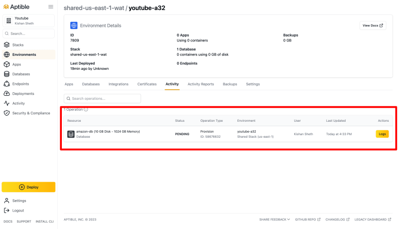

В этом блоге мы расскажем вам о развертывании приложения Amazon Clone на [Aptible](https://www.aptible.com/) и покажем, как эта платформа может упростить и обезопасить этот процесс. Мы рассмотрим основные шаги, начиная с создания учетной записи Aptible, инициализации базы данных PostgreSQL, настройки бэкенда и фронтенда приложений, конфигурирования переменных окружения и заканчивая развертыванием приложений.

Следуя этому исчерпывающему руководству, разработчики смогут приобрести ценный опыт развертывания веб-приложений на Aptible, безопасной и масштабируемой платформе облачной инфраструктуры. Приведенные инструкции и фрагменты кода упростят процесс развертывания и помогут понять, как эффективно использовать облачную инфраструктуру.

## [](https://dev.to/kishansheth/how-to-deploy-full-stack-amazon-clone-with-nextjs-tailwind-css-zustand-and-nestjs-on-aptible-4i2j#features-of-the-amazon-clone)Особенности клона Amazon

- Создан с использованием Next.js
- Стилизован с помощью Tailwind CSS
- Бэкенд сгенерирован с помощью Amplication
- Управление состояниями с помощью Zustand
- Typescript для безопасности типов
- Регистрация входа с использованием JWT-токенов
- Вызовы API с использованием Axios
- Recharts для диаграмм
- Next UI для удивительных готовых компонентов
- React Pro Sidebar для создания удивительной боковой панели.
- Панель администратора
- Пагинация таблиц

## [](https://dev.to/kishansheth/how-to-deploy-full-stack-amazon-clone-with-nextjs-tailwind-css-zustand-and-nestjs-on-aptible-4i2j#functionalities-of-the-amazon-clone)Функциональные возможности клона Amazon

- Категории CRUD (создание/чтение/обновление/удаление)
- Продукты CRUD (создание/чтение/обновление/удаление)
- Управление заказами
- Панель управления для администратора
- Вход администратора
- Вход и регистрация пользователей
- Просмотр товаров пользователем
- Пользователь ищет товары
- Пользователь добавляет товары в корзину
- Пользователь оформляет заказ
- И многие другие функции, которые вы можете посмотреть в видео ниже

Эта запись в блоге является частью моего видео на YouTube. Посмотрите удивительное видео.

## [](https://dev.to/kishansheth/how-to-deploy-full-stack-amazon-clone-with-nextjs-tailwind-css-zustand-and-nestjs-on-aptible-4i2j#introducing-aptible-simplify-and-secure-your-application-deployment)Представляем Aptible: Упрощение и безопасность развертывания приложений

Прежде чем перейти к деталям развертывания приложения Amazon Clone на [Aptible](https://www.aptible.com/), давайте немного познакомимся с Aptible и поймем, почему это отличный выбор для хостинга веб-приложений.

Aptible - это облачная платформа, созданная для упрощения и оптимизации развертывания и управления веб-приложениями, особенно для разработчиков и команд, которые уделяют первостепенное внимание безопасности и соблюдению нормативных требований. С Aptible вы можете сосредоточиться на создании и масштабировании приложений, оставив все сложности, связанные с инфраструктурой, безопасностью и соблюдением нормативных требований, платформе.

Одной из отличительных особенностей Aptible является ее приверженность безопасности. Она обеспечивает надежный контроль безопасности и сертификацию соответствия, что делает ее идеальным выбором для приложений, работающих с конфиденциальными данными или требующих соблюдения нормативных требований. Aptible берет на себя заботу об обновлениях безопасности, шифровании данных и контроле доступа, позволяя вам сосредоточиться на коде приложения.

Теперь давайте приступим.

### [](https://dev.to/kishansheth/how-to-deploy-full-stack-amazon-clone-with-nextjs-tailwind-css-zustand-and-nestjs-on-aptible-4i2j#step-1-create-a-new-aptible-account)Шаг 1: Создайте новую учетную запись Aptible.

Перейдите на сайт Aptible и нажмите на кнопку входа, чтобы создать новый аккаунт и зарегистрироваться.

[](../../assets/images/mny73ihrdiowqqyk595s.png)

После процесса регистрации вы будете перенаправлены на страницу Aptible Environments.

[](../../assets/images/ws95widf0d911dlhbtpw.png)

### [](https://dev.to/kishansheth/how-to-deploy-full-stack-amazon-clone-with-nextjs-tailwind-css-zustand-and-nestjs-on-aptible-4i2j#step-2-choose-environment)Шаг 2: Выберите среду

Теперь вы увидите созданные вами окружения на этой странице.

#### [](https://dev.to/kishansheth/how-to-deploy-full-stack-amazon-clone-with-nextjs-tailwind-css-zustand-and-nestjs-on-aptible-4i2j#what-are-environments)Что такое окружения?

Среды живут в стеках и обеспечивают логическую изоляцию ресурсов. Среды в одном стеке имеют общие сети и базовые хосты.

Теперь выберите окружение и щелкните на нем.

[](../../assets/images/otocv4ri0gr7ccswigso.png)

Это экран вашего окружения. Здесь вы можете управлять приложениями и базами данных, просматривать активность, создавать резервные копии и выполнять множество других настроек.

[](../../assets/images/qfelwjsn7ka9s7mea2y2.png)

### [](https://dev.to/kishansheth/how-to-deploy-full-stack-amazon-clone-with-nextjs-tailwind-css-zustand-and-nestjs-on-aptible-4i2j#step-3-provision-a-new-postgresql-database)Шаг 3: Создание новой базы данных PostgreSQL

Теперь мы используем базу данных PostgreSQL для нашего клона Amazon, поэтому давайте создадим новую базу данных на Aptible.

Перейдите на вкладку ”База данных".

[](../../assets/images/sf0t6lxckmv5kc9l5kh1.png)

Теперь перед вами откроется экран базы данных. Отсюда вы можете управлять и создавать новые базы данных в вашей среде Aptible.

[](../../assets/images/9a2sheghn4qua8ihoqnw.png)

Теперь нажмите на кнопку New Database, чтобы начать создание новой базы данных.

[](../../assets/images/3eylij0uzfw5ipqgy9u9.png)

Вы можете видеть, как при нажатии кнопки пользовательский интерфейс меняется на ”Выбор базы данных".

[](../../assets/images/q8tx57wgn8qyhcnf0gqb.png)

Теперь нам нужно выбрать базу данных. Нажмите на выпадающий список выбора базы данных. Он покажет вам все поддерживаемые Aptible базы данных.

В настоящее время Aptible поддерживает следующие типы баз данных:

- CouchDB
- PostgreSQL
- MongoDB
- Redis
- Elasticsearch
- InfluxDB
- MySQL
- SFTP
- RabbitMQ

Вы можете проверить их [страницу поддерживаемых баз данных] (https://www.aptible.com/docs/supported-databases), чтобы узнать, добавили ли они новые базы данных.

[](../../assets/images/xuptoonk2giqky2kdye3.png)

Теперь из списка баз данных выберите PostgreSQL 14.

Как только вы выберете ее, вы увидите поле в виде хэндла базы данных.

[](../../assets/images/a8s1yumjv7yvvfnjzedy.png)

С помощью этого поля вы можете назвать базу данных по своему усмотрению.

Мы назовем ее `amazon-db`.

Теперь нажмите на кнопку `Сохранить изменения`.

[](../../assets/images/7f0jsb8cu115ypz49uxo.png)

Теперь Aptible начнет инициализацию вашей базы данных. Дождитесь ее завершения.

[](../../assets/images/v95m6tj1dvr45kr6m4yt.png)

Пока база данных создается, давайте перейдем к следующему шагу, который будет выполняться в фоновом режиме и завершится через несколько минут.

### [](https://dev.to/kishansheth/how-to-deploy-full-stack-amazon-clone-with-nextjs-tailwind-css-zustand-and-nestjs-on-aptible-4i2j#step-4-setup-amazon-clone-backend-on-aptible)Шаг 4: Настройка бэкенда Amazon Clone на Aptible

Теперь давайте развернем наше бэкэнд-приложение на Aptible.

Перейдите на вкладку `Apps` и нажмите на `New App`.

[](../../assets/images/lctl87hozb1702of4hm3.png)

Теперь вы увидите окно создания нового приложения.

В этом окне вам нужно указать имя вашего приложения.

Мы назовем его `amazon-backend`.

[](../../assets/images/incravwinq6ug13ekv2w.png)

Теперь нажмите на кнопку `Создать приложение`.

Теперь Aptible начнет создавать ваше приложение в выбранном окружении.

На этом шаге вам нужно будет вставить свой SSH-ключ.

[](../../assets/images/2n88v5a3vlxhflsjfys8.png)

Если вы хотите сгенерировать новый SSH-ключ или узнать, как Aptible использует ваш ключ, посетите [Aptible SSH Docs](https://www.aptible.com/docs/public-key-authentication)

После вставки SSH-ключа нажмите на `Сохранить ключ`. Это сохранит ваш SSH-ключ в Aptible, так что в следующий раз, когда вы будете создавать приложение в Aptible, вам не придется повторять этот процесс.

[](../../assets/images/47vjfxbrnfdpbzg16bh7.png)

Теперь нам нужно отправить наш код в git-репо Aptible.

[](../../assets/images/b6zhgx3x70ajgpoyfexc.png)

Для этого шага нам потребуется создать `Dockerfile` в корне кода нашего сервера.

[](../../assets/images/tcdazn4geaqaoaczrj0y.png)

Внутрь `Dockerfile` нужно скопировать следующий фрагмент

```yaml
# Development Dockerfile
# Этот Dockerfile предназначен для разработки и включает в себя зависимости и инструменты для разработки.

# Использование базового образа Node.js с инструментами разработки
FROM node:16.0.0 AS development

# Создайте каталог, в котором будет собираться приложение
WORKDIR /app

# Скопируйте манифесты зависимостей, как package.json
# и package-lock.json копируются
COPY package*.json ./

# Установите пакеты и их зависимости
RUN npm install


# Скопируйте схему Prisma
COPY prisma/schema.prisma ./prisma/

# Сгенерируйте клиент Prisma на основе схемы
RUN npm run prisma:generate

# Скопируйте кодовую базу
COPY . .

RUN npx prisma db push
# Создайте пакет приложения
RUN npm run build

# Выставьте определенный порт на Docker-контейнере для целей разработки
ENV PORT=3000
EXPOSE ${PORT}

# Запустите сервер разработки, используя ранее собранное приложение
CMD ["npm", "start"]

```

Вход в полноэкранный режим

Теперь откройте терминал и выполните следующие действия:

#### [](https://dev.to/kishansheth/how-to-deploy-full-stack-amazon-clone-with-nextjs-tailwind-css-zustand-and-nestjs-on-aptible-4i2j#step-1-create-a-git-repo)Шаг 1: Создайте git-репо

`git init`

#### [](https://dev.to/kishansheth/how-to-deploy-full-stack-amazon-clone-with-nextjs-tailwind-css-zustand-and-nestjs-on-aptible-4i2j#step-2-stage-all-files)Шаг 2: Поставьте все файлы

`git add .`

#### [](https://dev.to/kishansheth/how-to-deploy-full-stack-amazon-clone-with-nextjs-tailwind-css-zustand-and-nestjs-on-aptible-4i2j#step-3-commit-the-changes)Шаг 3: Зафиксируйте изменения

`git commit -m "Initial Commit for backend code.`

После фиксации изменений вам нужно скопировать удаленный url Aptible и добавить его в ваше репо.

[](../../assets/images/h5l4sqxwezyiqjx7iw5d.png)

`git remote add aptible git@beta.aptible.com:youtube-a32/amazon-backend.git`

После этого шага нам нужно будет выложить код в ветку сканирования Aptible.

Скопируйте команду scan из Aptible и вставьте ее в терминал.

[](../../assets/images/fn99u4enwi429bpdwv1l.png)

`git push aptible main:aptible-scan`.

Теперь мы добавим наш код в git-репозиторий Aptible.

[](../../assets/images/eqobsynsf6j1k5bufyr2.png)

Теперь в Aptible появится вот такое окно.

[](../../assets/images/epkxwvwza32yibi0ckzl.png)

Здесь мы можем настроить переменные окружения и БД для приложения.

Давайте выберем БД.

Нажмите на кнопку `Подключить существующую базу данных`.

[](../../assets/images/t9u38hqq6etjtkite3dl.png)

Теперь выберите `amazon-db`, которую мы создали в предыдущем шаге, и назовите переменную окружения `db_url`.

[](../../assets/images/spi9t2b87k11ctn9hv0q.png)

Теперь нажмите на кнопку `Save and Deploy`, чтобы начать процесс развертывания.

Это запустит процесс развертывания.

[](https://res.cloudinary.com/practicaldev/image/fetch/s--gPvGxUlA--/c)\_limit%2Cf_auto%2Cfl_progressive%2Cq_auto%2Cw_800/https://dev-to-uploads.s3.amazonaws.com/uploads/articles/kr3xcla8x8ljnfv3n3yi.png)

Этот процесс может занять определенное время. Подождите, пока он завершится.

Теперь наше приложение успешно развернуто.

[](../../assets/images/yg8xumdarc8jyw0dsuhz.png)

Теперь нам нужно запустить команду docker.

Выберите команду cmd и нажмите кнопку `Создать конечную точку`.

[](../../assets/images/k2r71dpqa048q3pwt09h.png)

Теперь Aptible начнет инициализацию конечной точки.

Наша конечная точка была успешно инициализирована.

[](../../assets/images/5c9v4vext9s6p9di7sw7.png)

Теперь давайте перейдем к конечной точке.

[](../../assets/images/3srvtcju5zv3ppa0ndt1.png)

И вы увидите, что мы успешно развернули наш Node-сервер на Aptible.

Теперь давайте сделаем то же самое для нашего приложения Next.

### [](https://dev.to/kishansheth/how-to-deploy-full-stack-amazon-clone-with-nextjs-tailwind-css-zustand-and-nestjs-on-aptible-4i2j#step-5-deploy-amazon-clone-frontend-to-aptible)Шаг 5: Развертывание Amazon Clone Frontend на Aptible

Развертывание фронтенда довольно простое. Мы выполним все предыдущие шаги и развернем наше приложение на Aptible.

Теперь вам нужно заменить файл `next.config.js` в вашем следующем приложении на код, приведенный ниже.

```js
/** @type {import('next').NextConfig} */
const nextConfig = {
	reactStrictMode: false,
	окружение: {
		NEXT_PUBLIC_CLOUDINARY_CLOUD_NAME: 'dctahvizk',
		NEXT_PUBLIC_API: 'app-61711.on-aptible.com',
	},
	images: {
		домены: ['res.cloudinary.com'],
	},
	// typescript: {
	// ignoreBuildErrors: true,
	// },
};

module.exports = nextConfig;
```

Вход в полноэкранный режим

Здесь мы добавили переменную окружения `NEXT_PUBLIC_API`.

Убедитесь, что вы заменили ее на свою конечную точку.

Теперь создайте новое приложение Aptible и назовите его `amazon-next-app`.

[](../../assets/images/amcqak5410xzhdhpza8k.png)

Прежде чем двигаться дальше, давайте добавим `Dockerfile` для вашего следующего приложения.

```yaml
# Используем официальную среду исполнения Node.js в качестве базового образа
FROM node:18

# Установите рабочий каталог внутри контейнера
WORKDIR /app

# Скопируйте package.json и package-lock.json (если есть)
COPY package*.json ./

# Установить зависимости
запустить npm install

# Скопируйте остальной исходный код вашего приложения
COPY . .

# Соберите производственную версию приложения
RUN npm run build

# Укажите порт, на котором будет работать ваше приложение Next.js
EXPOSE 3000

# Запустите ваше приложение Next.js
CMD ["npm", "start"]
```

Вход в полноэкранный режим

Создайте `Dockerfile` на корневом уровне вашего приложения и вставьте этот код.

Теперь откройте терминал и выполните следующие действия:

#### [](https://dev.to/kishansheth/how-to-deploy-full-stack-amazon-clone-with-nextjs-tailwind-css-zustand-and-nestjs-on-aptible-4i2j#step-1-create-a-git-repo)Шаг 1: Создайте git-репо

`git init`

#### [](https://dev.to/kishansheth/how-to-deploy-full-stack-amazon-clone-with-nextjs-tailwind-css-zustand-and-nestjs-on-aptible-4i2j#step-2-stage-all-files)Шаг 2: Поставьте все файлы

`git add .`

#### [](https://dev.to/kishansheth/how-to-deploy-full-stack-amazon-clone-with-nextjs-tailwind-css-zustand-and-nestjs-on-aptible-4i2j#step-3-commit-the-changes)Шаг 3: Зафиксируйте изменения

`git commit -m "Initial Commit for frontend code.`

После фиксации изменений вам нужно скопировать удаленный url Aptible и добавить его в ваше репо.

[](../../assets/images/or3gdi5wv44t37cj81xl.png)

`git remote add aptible git@beta.aptible.com:youtube-a32/amazon-next-app.git`

После этого шага нам нужно будет выложить код в ветку сканирования Aptible.

Скопируйте команду scan из Aptible и вставьте ее в терминал.

[](../../assets/images/f1gdbxod6bjrz1ivz6ea.png)

`git push aptible main:aptible-scan`.

Наш код был выложен в Aptible.

Теперь давайте развернем его. Нажмите на кнопку `Save & Deploy`.

[](../../assets/images/px6nmpskorj42kxduwwq.png)

Наше развертывание прошло успешно.

[](../../assets/images/9osfqq2kzlw6gfp513wc.png)

Теперь давайте запустим команду docker cmd и создадим конечную точку.

[](../../assets/images/5xibegfdnh8fehb9x10a.png)

Теперь наша конечная точка была успешно инициализирована.

[](../../assets/images/sslvaotleukpsfdril8h.png)

Откройте конечную точку в браузере.

И вы увидите, что наше приложение Next было успешно развернуто на Aptible.

[](../../assets/images/kzojd8cyxnkhb5k9ea9e.png)

## [](https://dev.to/kishansheth/how-to-deploy-full-stack-amazon-clone-with-nextjs-tailwind-css-zustand-and-nestjs-on-aptible-4i2j#conclusion)Заключение

В заключение хочу сказать, что в этой статье мы представили исчерпывающее руководство по развертыванию приложения Amazon Clone на платформе Aptible. Мы рассмотрели такие основные шаги, как создание учетной записи Aptible, инициализация базы данных PostgreSQL, настройка бэкенда и фронтенда приложений, конфигурирование переменных окружения и развертывание приложений.

Следуя этому руководству, разработчики смогут приобрести ценный опыт развертывания веб-приложений на Aptible, безопасной и масштабируемой платформе облачной инфраструктуры. Приведенные инструкции и фрагменты кода упрощают процесс развертывания и помогают разработчикам понять, как эффективно использовать облачную инфраструктуру.

[Aptible](https://www.aptible.com/) предлагает надежную среду для размещения веб-приложений, что делает ее отличным выбором для разработчиков, желающих безопасно развертывать и управлять своими проектами. Этот учебник дает разработчикам знания и практические навыки, необходимые для использования возможностей Aptible для развертывания веб-приложений.
