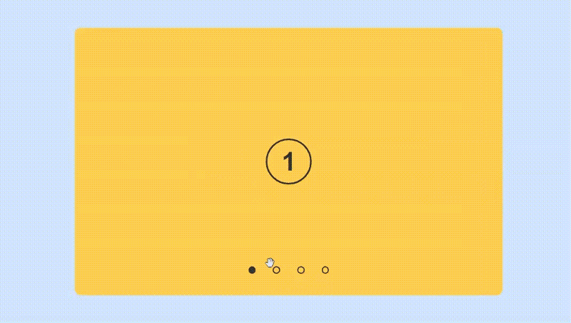
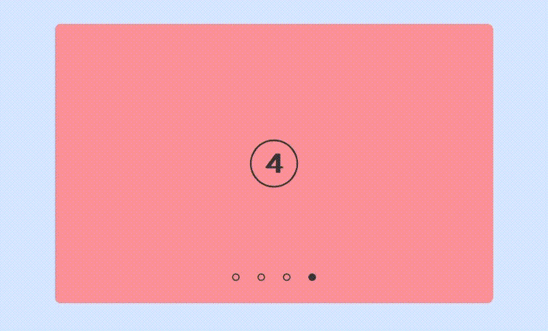
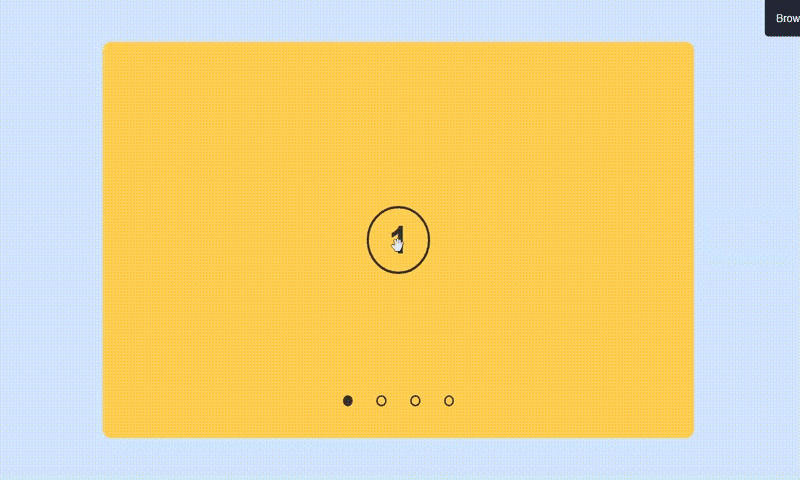
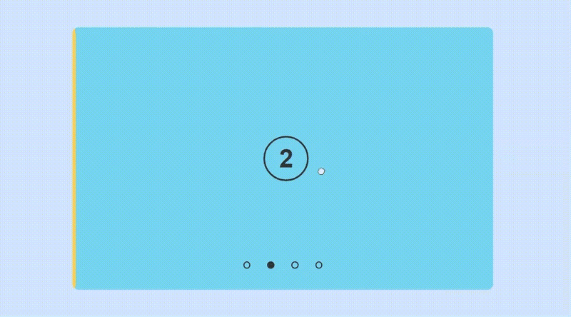
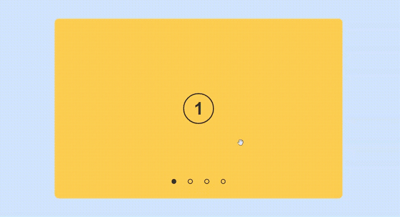

Перетаскиваемый слайдер позволяет пользователям прокручивать его содержимое путем перетаскивания с помощью мыши или аналогичного устройства ввода, что повышает эффективность взаимодействия с пользователем и обмена информацией.

Кроме того, при реализации перетаскиваемых слайдеров на мобильных устройствах обычно предусматриваются альтернативные методы навигации, например, пролистывание. Такой подход обеспечивает плавное взаимодействие с пользователем на различных устройствах.

Учитывая это, в данной статье мы расскажем, как реализовать следующие функции для нашего слайдера с помощью обычного HTML, CSS и JavaScript:

1. Функциональность автовоспроизведения
2. Возможность перетаскивания для немобильных устройств
3. Возможность пролистывания для мобильных устройств.

Кодепен здесь:

https://codepen.io/Lynxdev/pen/JjwOWwK

Эта статья также является продолжением моей [предыдущей статьи на эту тему](https://dev.to/lynxdev32/vanilla-javascript-how-to-create-a-draggable-slider-with-auto-play-and-navigation-4p9m), в которой я подробно рассмотрел аспекты HTML и CSS. Несмотря на то, что здесь я приведу исходный код (HTML и CSS), я рекомендую ознакомиться с предыдущей статьей, чтобы убедиться, что мы находимся на одной странице.

## [](https://dev.to/lynxdev32/vanilla-javascript-how-to-create-a-draggable-slider-with-auto-play-and-navigation-part-two-29he#prerequisites)Предварительные условия

Чтобы извлечь максимальную пользу из этой статьи, у вас должны быть:

- Базовое понимание HTML и CSS.
- Базовое понимание JavaScript и манипуляций с DOM.

## [](https://dev.to/lynxdev32/vanilla-javascript-how-to-create-a-draggable-slider-with-auto-play-and-navigation-part-two-29he#setting-things-up)Установка вещей

Для начала работы вставьте в редактор следующие коды HTML и CSS.

### [](https://dev.to/lynxdev32/vanilla-javascript-how-to-create-a-draggable-slider-with-auto-play-and-navigation-part-two-29he#the-html)HTML

В элементе body мы создадим `section слайдера для демонстрации наших слайдов. Этот контейнер будет включать в себя:

1. Четыре уникальных радиовхода, по одному для каждого слайда.
2. Элемент `ul` с классом `slides-flex`, содержащий четыре элемента `li`. Каждый `li` представляет отдельный слайд и имеет класс `slide`.
3. Див`с классом`navigation`, содержащий четыре элемента `label`. Каждый элемент `label`связан с одним из радиовходов, описанных ранее, и имеет уникальный класс и`id` в диапазоне от 1 до 4.

```html
<body>
	<section class="slider">
		<!-- Радиокнопки запускаются -->
		<input type="radio" name="radio-btn" id="radio1" checked />
		<input type="radio" name="radio-btn" id="radio2" />
		<input type="radio" name="radio-btn" id="radio3" />
		<input type="radio" name="radio-btn" id="radio4" />
		<!-- радиокнопки заканчиваются -->
		<!-- начало слайдов -->
		<ul class="slides-flex">
			<li class="slide">
				<h2>1</h2>
			</li>
			<li class="slide">
				<h2>2</h2>
			</li>
			<li class="slide">
				<h2>3</h2>
			</li>
			<li class="slide">
				<h2>4</h2>
			</li>
		</ul>
		<!-- конец слайдов -->
		<!-- начало навигации -->
		<div class="navigation">
			<label for="radio1" class="btn1" id="1"></label>
			<label for="radio2" class="btn2" id="2"></label>
			<label for="radio3" class="btn3" id="3"></label>
			<label for="radio4" class="btn4" id="4"></label>
		</div>
		<!-- конец навигации -->
	</section>
</body>
```

Вывод:

[](../../assets/images/saj73lwkztsa9ev0xcpf.jpeg)

Когда HTML-структура готова, давайте добавим некоторые стили.

### [](https://dev.to/lynxdev32/vanilla-javascript-how-to-create-a-draggable-slider-with-auto-play-and-navigation-part-two-29he#the-css)CSS

Здесь мы:

1. Отцентрируем наш слайдер с помощью сетки CSS.
2. Скроем радиовходы.
3. Стилизуйте `.slider` как наш контейнер с отзывчивыми размерами и относительным позиционированием.
4. Используйте flexbox для горизонтального расположения `.slides-flex` и добавьте абсолютное позиционирование, чтобы обеспечить плавное скольжение внутри `.slider`.
5. Убедитесь, что каждый `.slide` заполняет всю ширину контейнера, отображая только один слайд за раз.
6. Оформите ярлыки навигации так, чтобы они имитировали радиовводы.
7. Используйте псевдокласс `:checked` для регулировки положения `.slides-flex` и изменения фона навигационных `меток` в зависимости от выбранного радиоввода.

```css
* {
	padding: 0;
	margin: 0;
	box-sizing: border-box;
}

:root {
	--primaryColor: #333;
}

body {
	отображение: сетка;
	высота: 100vh;
	place-items: center;
	background-color: rgb(208, 230, 249);
	font-family: 'Poppins', sans-serif;
}

ul {
	list-style: none;
}

.slider {
	положение: относительное;
	ширина: 80%;
	aspect-ratio: 1;
	max-width: 50rem;
	max-height: 31.25rem;
	border-radius: 0.7rem;
	overflow: hidden;
	курсор: grab;
}

.slider input {
	display: none;
}

/* СЛАЙДЫ */
.slides-flex {
	положение: абсолютное;
	left: 0;
	ширина: 400%;
	высота: 100%;
	отображение: flex;
	переход: 0.8s;
}

.slide {
	ширина: 25%;
	отображение: сетка;
	place-items: center;
}

.slide:nth-child(1) {
	background-color: #fed050;
	border-radius: 0.7rem 0 0 0.7rem;
}

.slide:nth-child(2) {
	background-color: #7fdbee;
}

.slide:nth-child(3) {
	background-color: #4cf89c;
}

.slide:nth-child(4) {
	background-color: #f79191;
	border-radius: 0 0.7rem 0.7rem 0;
}

.slide h2 {
	выборпользователя: нет;
	color: var(--primaryColor);
	высота: 5rem;
	ширина: 5rem;
	font-size: 3rem;
	border-radius: 50%;
	display: grid;
	place-items: center;
	text-align: center;
	обводка: 3px solid;
}

/* НАВИГАЦИЯ */
.navigation {
	положение: абсолютное;
	выборпользователя: нет;
	ширина: 100%;
	bottom: 2.5rem;
	display: flex;
	промежуток: 2rem;
	justify-content: center;
}

.navigation label {
	border: 2px solid var(--primaryColor);
	padding: 0.3rem;
	border-radius: 50%;
	курсор: указатель;
	переход: 1s;
}

/* РАДИО ПРОВЕРЕНО */
#radio1:checked ~ .slides-flex {
	left: 0%;
}

#radio2:checked ~ .slides-flex {
	left: -100%;
}

#radio3:checked ~ .slides-flex {
	left: -200%;
}

#radio4:checked ~ .slides-flex {
	left: -300%;
}

#radio1:checked ~ .navigation .btn1 {
	background: var(--primaryColor);
}

#radio2:checked ~ .navigation .btn2 {
	background: var(--primaryColor);
}

#radio3:checked ~ .navigation .btn3 {
	background: var(--primaryColor);
}

#radio4:checked ~ .navigation .btn4 {
	background: var(--primaryColor);
}
```

Вывод:

GIF



Настройка завершена, переходим к части JavaScript.

## [](https://dev.to/lynxdev32/vanilla-javascript-how-to-create-a-draggable-slider-with-auto-play-and-navigation-part-two-29he#selecting-dom-elements)Выбор элементов DOM

Наша первая задача - выбрать элементы HTML, с которыми мы будем работать, и присвоить их переменным с помощью метода `querySelector`:

```js
const slideContainer = document.querySelector('.slider');
const slideFlex = document.querySelector('.slides-flex');
const navigation = document.querySelector('.navigation');
```

## [](https://dev.to/lynxdev32/vanilla-javascript-how-to-create-a-draggable-slider-with-auto-play-and-navigation-part-two-29he#iifes)IIFEs

IIFE (Immediately Invoked Function Expression) - это функция JavaScript, которая выполняется сразу же после ее определения. Ее типичный синтаксис таков:

```js
(function () {
	// некоторый код
})();
```

IIFE устанавливают частную область видимости, тем самым предотвращая проблему загрязнения пространства имен.

Загрязнение пространства имен происходит, когда глобальные переменные или функции приводят к конфликтам в вашем коде, особенно в больших проектах.

Чтобы решить эту проблему и способствовать повторному использованию кода, мы создадим IIFE с именем `slider`. Эта функция будет принимать выбранные нами элементы в качестве аргументов и инкапсулировать остальную часть нашего кода:

```js
(function slider(container, slideFlex, navigation){
  // наш код
})(slideContainer, slideFlex, navigation)p
```

## [](https://dev.to/lynxdev32/vanilla-javascript-how-to-create-a-draggable-slider-with-auto-play-and-navigation-part-two-29he#setting-initial-values)Установка начальных значений

В `slider` IIFE мы определим начальные переменные, к которым мы сможем обращаться и изменять их в дальнейшем в нашем коде:

```js
let initialX,
	finalX,
	leftPos = -100,
	isDragging = false,
	slideDistance,
	интервал = null,
	slidesWidth = slideFlex.offsetWidth,
	numberOfSlides = slideFlex.childElementCount,
	счетчик = 0,
	порог = 40;
```

Эти переменные служат для следующих целей:

1. `initialX`: Сохраняет начальное горизонтальное положение пользователя при нажатии или касании.
2. `finalX`: Сохраняет конечное горизонтальное положение пользователя после перетаскивания или смахивания.
3. `leftPos`: Инициализируется на -100. Мы будем использовать это значение для корректировки свойства `left` свойства `lideFlex` в CSS, путем сложения или вычитания, чтобы сместить слайды.
4. `isDragging`: Отслеживает намерения пользователя, устанавливается в `false`, когда перетаскивание не происходит, и `true`, когда пользователь намеревается перетащить.
5. `slideDistance`: Хранит горизонтальное расстояние между пролистыванием или перетаскиванием в пределах слайдера.
6. `interval`: инициализируется в null, чтобы избежать конфликтов интервалов. В нем будет храниться возвращаемый идентификатор интервала из нашей будущей функции `setInterval()`.
7. `SlidesWidth`: Контролирует текущую ширину `slideFlex в пикселях.
8. `numberOfSlides`: Определяет количество слайдов в `slideFlex`.
9. `counter`: Отслеживает текущий отображаемый слайд. Начинается с 0 и заканчивается на `numberOfSlides - 1`.
10. `threshold`: Инициализируется на 40, представляя минимальный процент смахивания или перетаскивания, необходимый для переключения слайда.

## [](https://dev.to/lynxdev32/vanilla-javascript-how-to-create-a-draggable-slider-with-auto-play-and-navigation-part-two-29he#setting-event-listeners)Настройка слушателей событий

Слушатели событий - это функции, которые реагируют на события или взаимодействия пользователя с определенным элементом HTML.

В этом разделе я расскажу о различных слушателях событий, которые обеспечивают взаимодействие пользователя с нашим слайдером.

### [](https://dev.to/lynxdev32/vanilla-javascript-how-to-create-a-draggable-slider-with-auto-play-and-navigation-part-two-29he#initiate-interval)Инициировать интервал

```js
document.addEventListener('DOMContentLoaded', createInterval);
```

В приведенном выше коде мы прикрепляем слушатель событий ко всей веб-странице с помощью объекта `document`. Этот слушатель реагирует на событие `DOMContentLoaded`, которое указывает на полную загрузку и парсинг HTML-документа.

В результате этот прослушиватель событий гарантирует, что все элементы страницы будут доступны до выполнения связанной с ними функции, что повышает производительность веб-страницы.

Слушатель запускает функцию обратного вызова `createInterval`, которая, в свою очередь, включает функцию автовоспроизведения.

### [](https://dev.to/lynxdev32/vanilla-javascript-how-to-create-a-draggable-slider-with-auto-play-and-navigation-part-two-29he#mouse-events)События мыши

```js
container.addEventListener('mousedown', dragStart);
```

Здесь мы прикрепляем слушатель события `"mousedown"` к аргументу `container`, который служит нашим контейнером слайдера.

Событие `"mousedown"` активируется, когда пользователь нажимает кнопку мыши. Оно означает намерение пользователя инициировать действие перетаскивания и впоследствии запускает функцию `dragStart` для обработки этого взаимодействия.

### [](https://dev.to/lynxdev32/vanilla-javascript-how-to-create-a-draggable-slider-with-auto-play-and-navigation-part-two-29he#touch-events)События касания

События касания и мыши имеют много общего, но существенные различия влияют на то, как они интерпретируют взаимодействие с пользователем.

В частности, события касания всегда нацелены на элемент, по которому изначально было произведено касание, в то время как события мыши нацелены на элемент, находящийся под курсором.

Это различие становится особенно очевидным во время событий `"touchmove"` и `"mousemove"`. События `"touchmove"` продолжают срабатывать, даже когда касание выходит за пределы элемента, тогда как `"mousemove"` прекращается, как только указатель мыши выходит за пределы элемента.

Чтобы обеспечить согласованное поведение нашего слайдера как на сенсорных, так и на мышиных платформах, мы должны соответствующим образом настроить наши слушатели событий:

```js
container.addEventListener('touchstart', dragStart);
container.addEventListener('touchmove', draging);
container.addEventListener('touchend', dragStop);
```

В этом коде мы прикрепляем три разных слушателя событий к элементу контейнера:

1. `Touchstart`: Активируется при прикосновении пользователя к элементу и запускает функцию обратного вызова `dragStart`.
2. `"touchmove"`: Активируется, когда пользователь проводит пальцем по элементу и запускает функцию `dragging`.
3. `"touchchend"`: Активируется, когда пользователь перестает касаться экрана и запускает `dragEnd`.

Если вам интересно узнать об альтернативах событий `"touchmove"` и `"touchend"`, основанных на использовании мыши, помните, что мы стремимся избежать внезапных прерываний, когда указатель мыши выходит за границы элемента. Чтобы добиться этого, мы должны подключить слушателей событий `"mousemove"` и `"mouseup"` ко всей веб-странице.

Однако необходимо объявить эти слушатели только после того, как пользователь инициирует действие перетаскивания. Поэтому мы включим дополнительные слушатели в `dragStart`.

## [](https://dev.to/lynxdev32/vanilla-javascript-how-to-create-a-draggable-slider-with-auto-play-and-navigation-part-two-29he#functions-and-callbacks)Функции и обратные вызовы

В JavaScript считается лучшей практикой модульное построение кода. Поэтому мы разобьем наш код на отдельные функции, каждая из которых будет отвечать за выполнение отдельных задач.

В этом разделе я расскажу о различных функциях и функциях обратного вызова, используемых в нашем слайдере.

### [](https://dev.to/lynxdev32/vanilla-javascript-how-to-create-a-draggable-slider-with-auto-play-and-navigation-part-two-29he#moveslide)moveSlide()

Как следует из названия, эта функция отвечает за перемещение слайдов. Код этой функции выглядит следующим образом:

```js
function moveSlide() {
	slidesFlex.style.left = `${leftPos * counter}%`;
	document.getElementById('radio' + (counter + 1)).checked = true;
}
```

Функция:

1. Обновляет позицию `slidesFlex, умножая `leftPos`(-100) на текущее значение`counter`.
2. Проверяет радиовход в этой позиции, чтобы мы знали, на каком слайде мы находимся.

### [](https://dev.to/lynxdev32/vanilla-javascript-how-to-create-a-draggable-slider-with-auto-play-and-navigation-part-two-29he#animate)animate()

Эта функция автоматизирует смену слайдов, а ее повторный вызов включает функцию автовоспроизведения. Вот код:

```js
function animate() {
	counter++;
	if (counter > numberOfSlides - 1) {
		counter = 0;
		slidesFlex.style.transition = 'none';
	} else {
		slidesFlex.style.transition = '0.8s';
	}
	moveSlide();
}
```

Функция:

1. Увеличивает `counter` для перехода на nпоследний слайд, и сбрасывает его, когда достигает последнего слайда.
2. Регулирует время перехода `слайдов` между последним и первым слайдом, чтобы обеспечить более плавное движение для лучшего восприятия пользователем.
3. Вызывает функцию `moveSlide()` для сдвига слайдов.

### [](https://dev.to/lynxdev32/vanilla-javascript-how-to-create-a-draggable-slider-with-auto-play-and-navigation-part-two-29he#createinterval)createInterval()

Эта функция устанавливает интервал, через который неоднократно вызывается наша функция `animate()`. Вот код:

```js
function createInterval() {
	if (!interval) {
		interval = setInterval(animate, 5000);
	}
}
```

Функция:

1. Перед выполнением проверяет, не запущен ли другой интервал.
2. Использует функцию `setInterval()` для вызова `animate()` каждые пять секунд.

На этом этапе мы успешно реализовали функцию автовоспроизведения, заставив наши слайды автоматически переключаться каждые пять секунд:

GIF



### [](https://dev.to/lynxdev32/vanilla-javascript-how-to-create-a-draggable-slider-with-auto-play-and-navigation-part-two-29he#dragstart)dragStart()

Эта функция обратного вызова срабатывает, когда пользователь взаимодействует с контейнером. Она имеет двойное назначение: управляет ручной навигацией и инициирует перетаскивание слайдера. Вот код:

```js
function dragStart(e) {
	clearInterval(interval);
	interval = null;

	// обработка ручной навигации
	if (navigation.contains(e.target)) {
		counter = e.target.id ? parseInt(e.target.id) - 1 : counter;
		slidesFlex.style.transition = '0.8s';
		moveSlide();
		createInterval();
		return;
	}
	//инициирование действия перетаскивания
	e.preventDefault(); // для сенсорного экрана по умолчанию

	// анимация скольжения
	slidesFlex.style.transition = '0.5s';
	container.style.cursor = 'grabbing';
	document.body.style.cursor = 'grabbing';

	clicked = true;

	if (e.type == 'touchstart') {
		initialX = e.touches[0].clientX;
	} else {
		initialX = e.clientX;
		document.onmousemove = draging;
		document.onmouseup = dragStop;
	}
}
```

Функция выполняет следующие действия:

1. **Очистка интервала автовоспроизведения**: Функция начинает работу с очистки существующего интервала и установки для него значения `null`. Это действие предотвращает конфликты между автовоспроизведением и перетаскиванием, инициированным пользователем.
2. **Работа с ручной навигацией**: Когда пользователь взаимодействует с элементами навигации, функция:
   1. Обновляет счетчик до `id` щелкнутого элемента метки, если он доступен.
   2. Настраивает время перехода `slidesFlex на 0,8 секунды для более плавного эффекта перехода.
   3. Вызывает функцию `moveSlide()` для сдвига слайдов в выбранную позицию.
   4. Вызывает функцию `createInterval()` для возобновления автовоспроизведения.
3. **Обработка функций перетаскивания**: В случае перетаскивания функция:
   1. Предотвращает события касания по умолчанию, чтобы обеспечить работу слайдера на устройствах с сенсорным экраном.
   2. Регулирует время перехода до 0,5 секунды для более быстрого эффекта скольжения.
   3. Изменяет стиль курсора контейнера и документа на `"захват"`, чтобы указать на действие перетаскивания.
   4. Обновляет `clicked` на `true`, что означает намерение пользователя перетащить ползунок.
   5. Обновляет `initialX` до текущего горизонтального положения пользователя (`clientX`). На устройствах с сенсорным экраном сначала обращается к свойству touches, массиву точек касания, и использует `touches[0]` для первой точки касания на элементе.
   6. Объявляет слушателей событий `"mousemove"` и `"mouseup"` на `документе`, активируя действие перетаскивания.

Как показано ниже, при нажатии на кнопки навигации слайды перемещаются в нужное положение и сбрасывается таймер интервала. И наоборот, щелчок на самом слайде подготавливает его к перетаскиванию и временно приостанавливает отсчет интервала:

GIF



### [](https://dev.to/lynxdev32/vanilla-javascript-how-to-create-a-draggable-slider-with-auto-play-and-navigation-part-two-29he#dragging)draging()

Эта функция обратного вызова обновляет положение `slideFlex по мере того, как пользователь перетаскивает его в контейнере. Вот код:

```js
function dragging(e) {
    if (!clicked) return;

    if (e.type == "touchmove") {
      finalX = e.touches[0].clientX;
    } else {
      finalX = e.clientX;
    }

    let currentPosition = counter * leftPos;

    slideDistance = ((initialX - finalX) / (slidesWidth / numberOfSlides)) * 100;

    если (Math.abs(slideDistance) < порог) {
      slidesFlex.style.left = `${currentPosition - slideDistance}%`;
    }
  }
```

Функция:

1. Проверяет, было ли предыдущее событие `mousedown` или ` touchstart` перед всемитащить за собой.
2. Обновляет значение `finalX` до конечного горизонтального положения пользователя.
3. Вычисляет текущее положение `slidesFlex`.
4. Определяет расстояние между слайдами в процентах от ширины каждого слайда.
5. Убеждается, что расстояние между слайдами находится в пределах заданного `порога`, после чего вычитает его из текущей позиции.

Здесь мы успешно реализовали движение перетаскивания, основанное на направлении указателя. Однако это действие еще не вызывает переключения слайдов:

GIF



Эта функция обратного вызова обрабатывает переключение слайда, когда пользователь прекращает перетаскивание. Вот код:

```js
function dragStop(e) {
	if (navigation.contains(e.target)) return;

	// Проверяем порог и счетчик перед сменой слайдов
	if (finalX < initialX && counter < numberOfSlides - 1 && slideDistance >= threshold) {
		counter++;
	} else if (finalX > initialX && counter > 0 && -slideDistance >= threshold) {
		counter--;
	}
	moveSlide();

	// Сбросьте настройки по умолчанию
	createInterval();
	document.body.style.cursor = 'default';
	container.style.cursor = 'grab';
	initialX = undefined;
	finalX = undefined;
	clicked = false;
	document.onmousemove = null;
	document.onmouseup = null;
}
```

Функция:

1. Убеждается, что пользователь намеревается перетаскивать, а не использовать ручную навигацию.
2. Проверяет расстояние и направление перетаскивания пользователя, после чего обновляет `counter` соответствующим образом.
3. Вызывает `moveSlide()` для переключения слайдов на текущее значение счетчика.
4. Вызывает `createInterval()` для возобновления автовоспроизведения.
5. Сбрасывает все остальные переменные и стили курсора для подготовки к следующему действию перетаскивания.
6. Устанавливает для слушателей событий `document` значение `null`, чтобы предотвратить ненужное использование ресурсов.

Как показано ниже, функции обратного вызова (от dragStart до dragEnd) объединяются для создания плавного перетаскивания:

GIF



Наконец, чтобы избежать излишеств, давайте закомментируем следующие разделы в нашем CSS:

- Время перехода на .slide-flex
- Перемещение .slide-flex во время проверки состояния радиовходов

Это удаление необходимо, поскольку встроенные стили, применяемые с помощью JavaScript, имеют приоритет над внешними CSS.

```css

.slides-flex{
...
/* переход: 0.8s */
}
...

/* ПРИ ПРОВЕРКЕ РАДИО */
/* #radio1:checked ~ .slides-flex {
  left: 0%;
}

#radio2:checked ~ .slides-flex {
  left: -100%;
}

#radio3:checked ~ .slides-flex {
  left: -200%;
}

#radio4:checked ~ .slides-flex {
  left: -300%;
} */
```

## [](https://dev.to/lynxdev32/vanilla-javascript-how-to-create-a-draggable-slider-with-auto-play-and-navigation-part-two-29he#conclusion)Заключение

В этом уроке мы рассмотрели основные элементы, необходимые для создания перетаскиваемого слайдера с помощью HTML, CSS и JavaScript. Вооружившись этими знаниями, вы сможете повысить интерактивность пользователей и улучшить их восприятие в своих проектах.

Если вы нашли эту статью полезной для себя или хотите поделиться своими мыслями, пожалуйста, поставьте лайк и оставьте свои комментарии ниже
