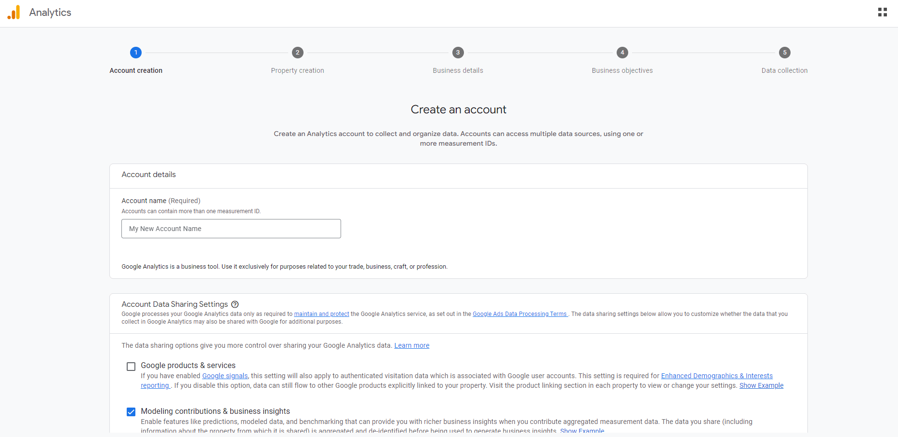

Вы можете использовать данные, полученные с вашего сайта или приложения, для принятия важных решений, которые помогут развитию вашего бизнеса. Эта информация может помочь вам улучшить пользовательский опыт, создать эффективные контент-стратегии и т. д.

Google Analytics - это эффективный инструмент для отслеживания и анализа трафика и событий на ваших сайтах и в мобильных приложениях. В этой статье вы узнаете, как добавить Google Analytics на свой сайт Astro.

Для работы вам понадобится следующее:

- Аккаунт Google.
- Развернутый проект Astro.

Давайте начнем!

## Как добавить Google Analytics на сайт Astro

Прежде чем добавлять аналитику Google, убедитесь, что вы уже развернули свой проект. Вот один из них, который я развернул с помощью Netlify: [https://astro-article.netlify.app/](https://astro-article.netlify.app/). Это шаблон блога Astro, созданный с помощью команды `npm create astro@latest -- --template blog`.

Этот раздел будет разделен на два подраздела. В первом подразделе вы узнаете, как создать аккаунт Analytics и как настроить его для отслеживания и мониторинга вашего сайта.

Во втором подразделе вы узнаете, как настроить код для синхронизации с Google Analytics.

### Как настроить Google Analytics

Чтобы настроить Google Analytics, выполните следующие действия:

#### Шаг #1 - Страница создания аккаунта

Первым шагом будет создание аккаунта Google Analytics. Вы можете сделать это, посетив [веб-сайт Google Analytics] (https://analytics.google.com/).

Когда страница загрузится, вы должны увидеть что-то похожее на это:


Главная страница Google Analytics

Нажмите на кнопку "Начать измерения". Это приведет вас на страницу создания аккаунта, где вы заполните некоторые данные о своем сайте/приложении. А именно:



Страница "Создание аккаунта" в Google Analytics

После ввода имени аккаунта прокрутите страницу вниз и нажмите на кнопку "Далее".

#### Шаг № 2 - Страница создания объекта

На странице создания свойств вы можете создать имя свойства, часовой пояс и валюту.

Свойство выступает в качестве уникального идентификатора для ваших веб-сайтов и приложений. Это своего рода контейнер для всех данных, относящихся к определенному сайту или приложению.


Страница "Создать свойство" в Google Analytics

#### Шаг № 3 - Страница с информацией о бизнесе

На странице сведений о бизнесе вы можете указать свою отраслевую категорию и размер бизнеса.


Страница "Опишите свой бизнес" в Google Analytics

#### Шаг № 4 - Страница бизнес-целей

Страница "Бизнес-цели" помогает Analytics создавать персонализированные отчеты для вашего бизнеса. Вы можете выбрать параметры, которые важны для вашего сайта, приложения или категории продуктов.


Страница "Бизнес-цели" в Google Analytics

Выбрав нужные параметры, нажмите кнопку "Создать".

#### Шаг № 5 - Страница сбора данных

На странице сбора данных вы можете выбрать различные платформы для сбора данных. Поскольку мы работаем с веб-сайтом, мы выберем веб-платформу.


Страница "Начать сбор данных" в Google Analytics

Далее вам нужно создать поток данных, введя URL вашего сайта и название потока (оно может быть любым, но я рекомендую использовать название, связанное с вашим сайтом).


Страница для настройки потока данных в Google Analytics

В информации о потоке данных я использовал [https://astro-article.netlify.app/](https://astro-article.netlify.app/) в качестве URL-адреса и "Шаблон блога Astro" в качестве названия потока.

Убедитесь, что вы удалили часть ссылки "https://" в поле ввода, чтобы не получить ошибку "Требуется действительный URL-адрес сайта".

Поэтому вместо [https://astro-article.netlify.app/](https://astro-article.netlify.app/) должно получиться astro-article.netlify.app/.

Вот как выглядит мой вариант:


Пример правильно введенной информации на странице настройки потока данных

Нажмите кнопку "Создать поток".

На следующей странице вы увидите название потока, URL, ID и значения ID измерений.

Идентификатор измерения будет важен для интеграции нашего кода, поэтому скопируйте и вставьте его куда-нибудь.

Вот как выглядит эта страница:


Страница "Подробности веб-потока" в Google Analytics

Если вы нажмете на "View tag instructions", вы увидите фрагмент кода для ручной интеграции с кодом. Скопируйте егоВставьте код куда-нибудь, потому что скоро он нам пригодится.


Инструкции по установке

Вот фрагмент кода, если вы его пропустили:

```js

<!-- Тег Google (gtag.js) -->
<script async src="https://www.googletagmanager.com/gtag/js?id=MEASUREMENT_ID"></script>
<script>
  window.dataLayer = window.dataLayer || [];
  function gtag(){dataLayer.push(arguments);}
  gtag('js', new Date());

  gtag('config', 'MEASUREMENT_ID');
</script>

```

Если вы копируете приведенный выше код, убедитесь, что вы заменили два значения `MEASUREMENT_ID` на фактическое значение ID вашего измерения.

### Как интегрировать Google Analytics и Astro

На данный момент мы создали аккаунт Google Analytics и сгенерировали идентификатор измерения нашего проекта. Следующее, что нужно сделать, - синхронизировать наш код с Google Analytics.

Но сначала нам нужно установить библиотеку под названием Partytown. При использовании сторонних интеграций вы можете столкнуться с проблемами производительности, поскольку используете сторонний код.

Partytown позволяет этим интеграциям работать как положено, не снижая производительности вашего сайта. Подробнее об этом вы можете прочитать [здесь](https://partytown.builder.io/how-does-partytown-work).

#### Шаг №1 - Установите Partytown

Перейдите в терминал проекта Astro и выполните эту команду для установки Partytown:

``bash
npm install @astrojs/partytown

````

#### Шаг №2 - Настройка Partytown

После завершения установки вам нужно будет добавить интеграцию в файл **astro.config.mjs**:

```js
import { defineConfig } from 'astro/config';
import mdx from '@astrojs/mdx';
import partytown from '@astrojs/partytown';

import sitemap from '@astrojs/sitemap';

// https://astro.build/config
export default defineConfig({
site: 'https://astro-article.netlify.app/',
integrations: [
mdx(),
sitemap(),
partytown({
config: {
forward: ['dataLayer.push']
},
}),
],
});

````

В приведенном выше коде мы импортировали библиотеку Partytown: `import partytown from '@astrojs/partytown'`.

Затем мы добавили этот фрагмент кода в объект `integrations`:

```js
partytown({
	config: {
		forward: ['dataLayer.push'],
	},
});
```

Все остальное в коде поставляется вместе с проектом Astro.

#### Шаг № 3 - Добавьте тег Google на ваши страницы

Помните сниппет кода из Google Analytics? Вот здесь мы его и используем.

```js

<!-- Тег Google (gtag.js) -->
<script type="text/partytown" async src="https://www.googletagmanager.com/gtag/js?id=MEASUREMENT_ID"></script>
<script type="text/partytown">
  window.dataLayer = window.dataLayer || [];
  function gtag(){dataLayer.push(arguments);}
  gtag('js', new Date());

  gtag('config', 'MEASUREMENT_ID');
</script>

```

Обратите внимание, что мы добавили атрибут `type="text/partytown"` к обоим тегам `<script>`.

Не забудьте изменить значения `MEASUREMENT_ID` на значение ID вашего измерения. Мой выглядит следующим образом:

```js
<!-- Тег Google (gtag.js) -->
<script type="text/partytown" async src="https://www.googletagmanager.com/gtag/js?id=G-KM36S70L8Y"></script>
<script type="text/partytown">
	window.dataLayer = window.dataLayer || [];
	function gtag(){dataLayer.push(arguments);}
	gtag('js', new Date());

	gtag('config', 'G-KM36S70L8Y');
</script>
```

Не используйте приведенный выше сниппет, поскольку он содержит мой ID измерения, поэтому он уже связан с моим сайтом (не с моим реальным сайтом :)). Скопируйте первый фрагмент кода и измените значения `MEASUREMENT_ID` на значение вашего ID измерения.

Чтобы отслеживать и контролировать страницу, вам нужно вставить сниппет кода на эту страницу. Скопируйте код и вставьте его в раздел `<head>` каждого файла страницы (**index.astro**, **BlogPost.astro** и так далее), которую вы хотите отслеживать и анализировать с помощью Google Analytics.

Вот пример использования файла **index.astro** в директории **pages**:

```js

import BaseHead from '../components/BaseHead.astro';
import Header from '../components/Header.astro';
import Footer from '../components/Footer.astro';
import { SITE_TITLE, SITE_DESCRIPTION } from '../consts';


<!doctype html>
<html lang="en">
	<head>
		<!-- Тег Google (gtag.js) -->
		<script type="text/partytown" async src="https://www.googletagmanager.com/gtag/js?id=MEASUREMENT_ID"></script>
		<script type="text/partytown">
			window.dataLayer = window.dataLayer || [];
			function gtag(){dataLayer.push(arguments);}
			gtag('js', new Date());

    		gtag('config', 'MEASUREMENT_ID');
    	</script>
    	<BaseHead title={SITE_TITLE} description={SITE_DESCRIPTION} />
    </head>

```

В приведенном выше коде мы поместили код от Google Analytics в тег `<head>`. Вы можете сделать это для всех страниц, которые хотите отслеживать и контролировать.

Не забудьте добавить атрибут `type="text/partytown"` к тегам `<script>` и изменить `MEASUREMENT_ID` (используется в двух местах в сниппете) на значение вашего ID измерения.

#### Шаг № 4 - Сборка и развертывание проекта

Разверните проект, используя предпочтительный для вас процесс.

В моем случае я использую `npm run build` для сборки в папку **dist**, а затем отправьте код на GitHub. Это автоматически вызовет развертывание Netlify.

Вы можете не использовать мой метод, но убедитесь, что ваш проект собирается перед развертыванием.

После развертывания сайта вам, возможно, придется подождать до 48 часов, чтобы начать видеть аналитику на панели Google Analytics.


Страница ожидания

Вы увидите эту страницу, когда нажмете на кнопку "Продолжить на главную":


Панель аналитики

Это ваша панель аналитики. Здесь вы можете просматривать и анализировать свои данные, если они доступны.

Вот и все! Вы успешно интегрировали свой проект с Google Analytics.

## Резюме

В этой статье мы рассмотрели, как добавить Google Analytics в проект Astro. Это можно использовать для отслеживания и анализа трафика и событий на сайтах и в приложениях.

Мы рассмотрели, как создать и настроить аккаунт Analytics.

Затем мы посмотрели, как интегрировать Google Analytics в проект Astro с помощью кода.

Счастливого кодинга! Другие уроки по Astro вы можете прочитать в [моем блоге](https://ihechikara.com/).
