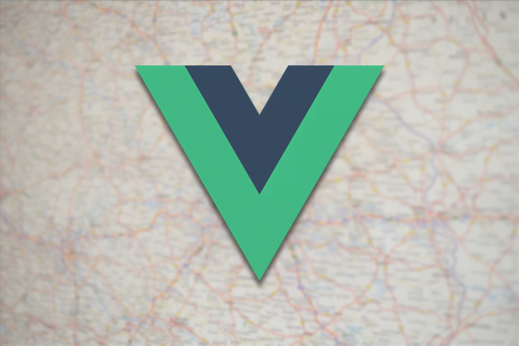
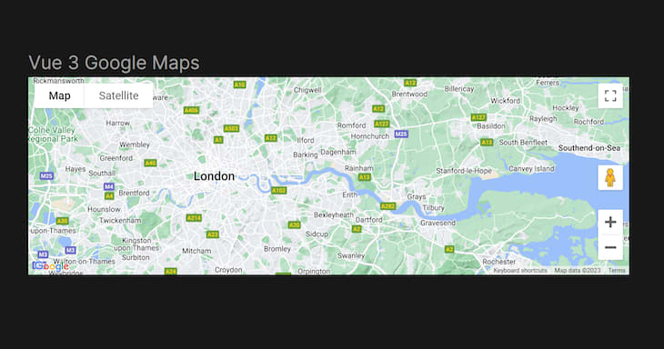

Сервисы, основанные на определении местоположения, произвели революцию в том, как пользователи взаимодействуют с веб-приложениями. Независимо от того, создаете ли вы современное приложение для отслеживания доставки, поиска ресторанов по соседству или просто хотите улучшить свой сайт с помощью динамических карт, интеграция Google Maps в ваш проект может значительно улучшить UX.



В этом практическом руководстве мы рассмотрим пошаговый процесс интеграции Google Maps в приложение Vue 3, от основ до продвинутых функций, которые действительно улучшат UX вашего приложения.

## Платформа Google Maps: Обзор

Платформа Google Maps Platform предоставляет разнообразные API, каждый из которых предназначен для различных аспектов картографии и сервисов, основанных на определении местоположения. Эти API служат для использования различных вариантов применения Google Maps в ваших приложениях и веб-сайтах.

Вот некоторые ключевые API в рамках платформы Google Maps:

- **Maps JavaScript API**: Позволяет разработчикам встраивать Карты Google в веб-страницы, настраивать внешний вид карты, добавлять маркеры, слои, оверлеи и события, а также получать доступ к различным функциям и элементам управления картой.
- API **Maps Static API**: Позволяет разработчикам запрашивать статические изображения карт, которые могут быть встроены в веб-страницы или приложения, с возможностью настройки размера карты, уровня масштабирования, формата, языка, региона и стиля.
- API **Maps Embed**: Позволяет разработчикам встраивать интерактивные карты Google на свои веб-страницы или в приложения с возможностью выбора различных режимов карты, включая направления, поиск, вид и вид на улицу.
- API **Направления**: Позволяет разработчикам запрашивать данные о направлениях для различных видов транспорта, таких как вождение, ходьба, езда на велосипеде и транзит. Сервис также предоставляет информацию о расстоянии, продолжительности, дорожной обстановке, путевых точках и альтернативных маршрутах
- API **Distance Matrix**: Позволяет разработчикам запрашивать данные о расстоянии и времени в пути для набора пунктов отправления и назначения. Сервис также предоставляет информацию о дорожной обстановке и видах транспорта
- **Geocoding API**: Позволяет разработчикам преобразовывать адреса в географические координаты (геокодирование) или наоборот (обратное геокодирование). Сервис также предоставляет информацию о компонентах, типах и форматах адресов
- **Geolocation API**: Позволяет разработчикам определять географическое положение устройства или пользователя на основе различных источников информации, таких как IP-адреса, вышки сотовой связи, точки доступа Wi-Fi, сигналы GPS или данные датчиков.
- **Places API**: Позволяет разработчикам получать доступ к информации о миллионах заведений по всему миру, такой как названия, адреса, номера телефонов, рейтинги, отзывы, фотографии и часы работы. Сервис также предоставляет такие функции, как автозаполнение, поиск поблизости, текстовый поиск и детали места.
- **Roads API**: Позволяет разработчикам получать доступ к данным о дорогах и ограничениях скорости для заданного местоположения или маршрута. Сервис также предоставляет такие функции, как привязка к дорогам, ближайшие дороги и ограничения скорости.
- API часовых поясов\*\*: Позволяет разработчикам запрашивать данные о часовом поясе для заданного местоположения или временной метки. Сервис также предоставляет информацию о переходе на летнее время и смещении времени относительно UTC

Хотя не все аспекты набора API Google Maps могут быть необходимы для вашего конкретного проекта, вы получаете свободу выбора API, которые наиболее эффективно соответствуют вашим требованиям. Понимая возможности каждого API, вы сможете выбрать те, которые лучше всего соответствуют требованиям вашего проекта, обеспечивая беспрепятственную интеграцию функциональности Google Maps в ваше приложение.

Чтобы получить доступ к платформе Google Maps, вам понадобится ключ API Google Maps. Ключ API - это уникальный код, который проверяет запросы, связанные с вашим проектом, выполняя функции проверки использования и выставления счетов. Для использования продуктов Google Maps Platform необходимо иметь хотя бы один API-ключ, связанный с вашим проектом.

Чтобы создать ключ API, вам нужен проект с биллинговым аккаунтом и включенным API Maps JavaScript. Для создания и проверки ключа API можно выполнить действия, описанные в [документации](https://developers.google.com/maps/documentation/javascript/get-api-key).Ограничьте свой ключ API.

## Интеграция Google Maps в приложение Vue 3

В этом демо мы используем пакет [vue-google-maps](https://github.com/fawmi/vue-google-maps) для интеграции Google Maps в наше приложение Vue 3. vue-google-maps упрощает процесс внедрения Google Maps в приложения Vue, предлагая компоненты и директивы, которые оборачивают API Google Maps JavaScript, обеспечивая декларативный подход к доступу к его функциям. С помощью этой библиотеки вы можете легко отображать карты, маркеры, информационные окна, полигоны и многое другое.

Прежде чем приступить к процессу интеграции, давайте убедимся, что у вас есть все необходимые предпосылки:

- Редактор кода на ваш выбор
- Node.js и npm, установленные на вашей машине
- базовое понимание Vue.js
- Аккаунт Google Maps Platform с действующим ключом API

Для начала давайте создадим новый проект Vue с нуля. Откройте терминал и выполните следующую команду:

```bash
npm create vue@latest
```

После того как проект создан, перейдите к установке библиотеки vue-google-maps:

```bash
npm install \-S @fawmi/vue\-google\-maps
```

Когда библиотека установлена, пришло время интегрировать ее в ваш проект Vue. Добавьте следующий код в файл `main.js`:

```js
import VueGoogleMaps from '@fawmi/vue-google-maps';
const app = createApp(App);
app
	.use(VueGoogleMaps, {
		load: {
			key: 'YOUR_API_KEY',
		},
	})
	.mount('#app');
```

Замените `'YOUR_API_KEY'` уникальным ключом API, который вы сгенерировали ранее.

На этом этапе, когда вы обновите приложение, вы можете столкнуться с проблемой импорта. Чтобы решить эту проблему, включите следующую конфигурацию в файл `vite.config.js`:

```js
optimizeDeps: {
  include: [
    "@fawmi/vue-google-maps",
    "fast-deep-equal",
  ],
},

```

## Рендеринг простой карты с помощью vue-google-maps

Библиотека vue-google-maps предоставляет готовые компоненты, которые позволяют использовать возможности Google Maps непосредственно в проекте Vue. Давайте рассмотрим, как отобразить простую карту на вашей странице с помощью базового компонента карты, `GMapMap`:

```js
    <GMapMap
      :center="{ lat: 51.5072, lng: 0.1276 }"
      :zoom="10"
      map-type-id="terrain"
      style="width: 100vw; height: 20rem"
      :options="{
        zoomControl: true,
        mapTypeControl: true,
        scaleControl: true,
        streetViewControl: true,
        rotateControl: true,
        fullscreenControl: true
      }"
    />

```

Вот как карта будет отображаться на странице:



Этот компонент `GMapMap` поставляется с рядом реквизитов, которые позволяют нам настраивать то, как будет отображаться карта:

- `**center**`: задает начальные координаты центра карты, используя значения широты и долготы, определяя, на чем фокусируется карта при первой загрузке
- **`zoom`**: задает начальный уровень масштабирования карты
- `**map-type-id**`: настраивает тип карты на ”местность", отображая топографические особенности, такие как горы и долины
- **`style`**: определяет ширину и высоту контейнера карты, позволяя настроить размеры карты в соответствии с вашим макетом
- **`options`**: предоставляет объект, содержащий различные опции карты, позволяющие настраивать определенные компоненты пользовательского интерфейса карты. Вы также можете отключить все опции сразу, установив параметр `disableDefaultUI` в значение `"true"`.

## Реализация расширенных возможностей Google Maps

В этом разделе мы рассмотрим некоторые дополнительные функции, которые можно добавить к карте, чтобы сделать ее более интерактивной и полезной. vue-google-maps имеет ряд готовых компонентов, которые можно использовать для наложения дополнительной функциональности поверх базового компонента `GMapMap`:

- `**GMapMarker**`: Позволяет указывать конкретные места на карте.
- **`GMapCluster`**: Позволяет объединять компоненты `Marker` в кластеры.
- **`GMapInfoWindow`**: Позволяет добавить информационное окно к вашим компонентам
- **`GMapPolyline`**: Позволяет добавить на карту полилинию, которая показывает путь между двумя или более точками
- `**GMapAutocomplete**`: Обеспечивает автозаполнение предложений для Google Places

Также существуют такие компоненты, как `GMapRectangle`, `GMapCircle` и `GMapPolygon` для добавления на карту различных фигур, помогающих обозначить общую область.

### Добавление маркеров с информационными окнами

Добавление маркеров на карту - это фундаментальная функция, которая может помочь пользователям определить конкретные места или точки интереса. Более того, вы можете улучшить пользовательский опыт, прикрепив к этим маркерам информационные окна, позволяющие пользователям получить доступ к дополнительной информации простым щелчком мыши.

Для реализации этой функциональности мы будем использовать компонент `GMapMarker` и `GMapInfoWindow`:

```js
   <!-- Marker to display the searched location -->
      <GMapMarker
        :key="markerDetails.id"
        :position="markerDetails.position"
        :clickable="true"
        :draggable="false"
        @click="openMarker(markerDetails.id)"
      >
        <!-- InfoWindow to display the searched location details -->
          <GMapInfoWindow
            v-if="locationDetails.address != ''"
            :closeclick="true"
            @closeclick="openMarker(null)"
            :opened="openedMarkerID === markerDetails.id"
            :options="{
              pixelOffset: {
                width: 10,
                height: 0
              },
              maxWidth: 320,
              maxHeight: 320
            }"

          >
            <div class="location-details">
                 Added Info
            </div>
          </GMapInfoWindow>
      </GMapMarker>

```

`GMapMarker` и `GMapInfoWindow` предлагают ряд дополнительных реквизитов, которые вы можете использовать для настройки внешнего вида и поведения маркеров и информационных окон в соответствии с вашими специфическими требованиями. Такая гибкость позволяет создавать действительно индивидуальные и интерактивные картографические возможности для ваших пользователей.

Некоторые из наиболее полезных реквизитов включают:

- `**position**`: Этот реквизит задает координаты маркера на карте. Это может быть либо объект со свойствами `lat` и `lng`, либо функция, возвращающая такой объект. Реквизит position необходим для компонента `GMapMarker`.
- `**opened**`: Этот параметр определяет, открыто или закрыто информационное окно. Это может быть либо булево значение, либо функция, возвращающая булево значение. Реквизит `opened` необходим для компонента `GMapInfoWindow`. Если установить значение `true`, то информационное окно будет отображаться при загрузке карты. Если установить значение `false`, то информационное окно будет скрыто до тех пор, пока не будет щелкнут маркер
- `**options**`: Этот параметр позволяет настроить внешний вид и поведение маркера и информационного окна. Реквизит `options` является необязательным для обоих компонентов и принимает различные свойства в зависимости от компонента
- `**clickable**`: Этот параметр определяет, могут ли пользователи нажимать на маркер. Свойство `clickable` является необязательным для обоих компонентов и по умолчанию имеет значение `true`.
- `**draggable**`: Этот параметр определяет, можно ли перетаскивать маркер или нет. Это может быть либо булево значение, либо функция, возвращающая булево значение. Реквизит draggable является необязательным для обоих компонентов.

Чтобы еще больше улучшить карту, можно реализовать функцию, которая [определяет местоположение пользователя](https://blog.logrocket.com/detect-location-local-time-zone-users-javascript/) и отображает его на карте с помощью маркера. Этого можно добиться с помощью JavaScript Geolocation API:

```js
// Setting the default coordinates to London
const coords = ref({ lat: 51.5072, lng: 0.1276 });
// Marker Details
const markerDetails = ref({
	id: 1,
	position: coords.value,
});
// Get users' current location
const getUserLocation = () => {
	// Check if geolocation is supported by the browser
	const isSupported = 'navigator' in window && 'geolocation' in navigator;
	if (isSupported) {
		// Retrieve the user's current position
		navigator.geolocation.getCurrentPosition((position) => {
			coords.value.lat = position.coords.latitude;
			coords.value.lng = position.coords.longitude;
		});
	}
};
```

Вызвав `getUserLocation()`, вы можете запустить процесс получения данных о местоположении пользователя и соответствующим образом обновить положение маркера.

### Реализация автозаполнения для поиска по местоположению

Библиотека также предоставляет доступ к Google Places, что позволяет использовать функцию автозаполнения поиска, чтобы легко находить различные места на карте. Сначала нам нужно загрузить библиотеку из файла `main.js`:

```js
  load: {
    key: GOOGLE_MAPS_API_KEY,
    libraries: "places"
  },

```

Затем мы можем получить доступ к компоненту в проекте Vue:

```js
    <GMapAutocomplete
        placeholder="Search for a location"
        @place_changed="setPlace"
        style="font-size: medium"
      >
      </GMapAutocomplete>

```

Этот фрагмент кода создает поле ввода поиска с функцией автозаполнения, которая позволяет пользователям легко находить различные места на карте. Кроме того, с помощьюПосле получения данных с места мы можем обновить положение маркера и детали информационного окна:

```js
// Set the location based on the place selected
const setPlace = (place) => {
	coords.value.lat = place.geometry.location.lat();
	coords.value.lng = place.geometry.location.lng();
	// Update the location details
	locationDetails.value.address = place.formatted_address;
	locationDetails.value.url = place.url;
};
```

Когда пользователь выбирает место из автозаполненных предложений, срабатывает функция `setPlace`. Она извлекает широту и долготу выбранного места и обновляет положение маркера на карте. Кроме того, она обновляет данные о месте, такие как адрес и URL, чтобы предоставить пользователям необходимую информацию:

## Заключение

В заключение хочу сказать, что эта статья дала вам знания о том, как легко интегрировать Google Maps в ваше приложение Vue 3. От понимания разнообразных возможностей платформы Google Maps до реализации расширенных функций карт с помощью библиотеки vue-google-maps.

Обладая этими знаниями, вы сможете усовершенствовать свое приложение, предоставив пользователям динамичные и интерактивные сервисы, основанные на местоположении. Полную версию приложения вы можете посмотреть здесь, на [GitHub](https://github.com/Abiola-Farounbi/Vue3-Google-Maps-Demo).

Если у вас есть вопросы, не стесняйтесь обращаться ко мне в [Twitter](https://twitter.com/abiolaesther_) или оставляйте комментарии ниже. Счастливого кодинга!
