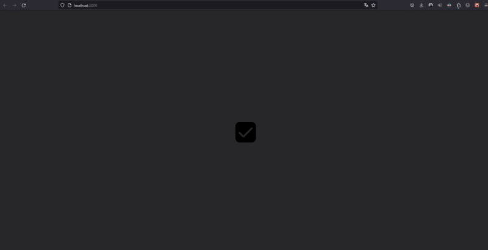
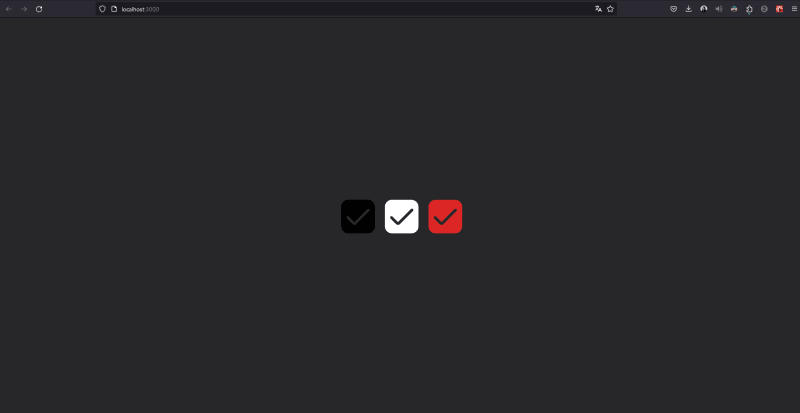

Цель этой статьи - продемонстрировать, как настраивать SVG-изображения с помощью Next.js и Tailwind, не прибегая к внешним настройкам или использованию вспомогательных библиотек вроде svgr/webpack.

В этом руководстве мы используем следующее изображение: [https://www.flaticon.com/free-icon-font/checkbox_3917076?related_id=3917076](https://www.flaticon.com/free-icon-font/checkbox_3917076?related_id=3917076)

```html
<svg
	xmlns="http://www.w3.org/2000/svg"
	xmlns:xlink="http://www.w3.org/1999/xlink"
	version="1.1"
	id="Capa_1"
	x="0px"
	y="0px"
	viewBox="0 0 512 512"
	style="enable-background:new 0 0 512 512;"
	xml:space="preserve"
	width="512"
	height="512"
>
	<g>
		<path
			d="M405.333,0H106.667C47.786,0.071,0.071,47.786,0,106.667v298.667C0.071,464.214,47.786,511.93,106.667,512h298.667 C464.214,511.93,511.93,464.214,512,405.333V106.667C511.93,47.786,464.214,0.071,405.333,0z M426.667,172.352L229.248,369.771 c-16.659,16.666-43.674,16.671-60.34,0.012c-0.004-0.004-0.008-0.008-0.012-0.012l-83.563-83.541 c-8.348-8.348-8.348-21.882,0-30.229s21.882-8.348,30.229,0l83.541,83.541l197.44-197.419c8.348-8.318,21.858-8.294,30.176,0.053 C435.038,150.524,435.014,164.034,426.667,172.352z"
		/>
	</g>
</svg>
```

Поведение Next.js по умолчанию с тегом `<Image>` не позволяет изменять свойство `fill` SVG. Это становится проблемой, когда нам нужно изменить цвет SVG-изображения при наведении мыши, например, используя такие классы Tailwind CSS, как `fill-white` или `bg-white`. Этот подход не работает, потому что мы не меняем напрямую свойство `fill` у `<svg>`, а на момент написания этой статьи `(Next 13.5.4)` тег `<Image/>` не поддерживает изменение заливки SVG.

```js
import Image from 'next/image';

import checkbox from '../../public/icons/checkbox.svg';

const Home = () => {
	return (
		<main className="flex h-screen items-center justify-center bg-zinc-800">
			<Image src={checkbox} alt="checkbox" className="h-20 w-20 fill-white" />
		</main>
	);
};

export default Home;
```

[](../../assets/images/8bxsgnlcdgajz0zgrom9.png)

Чтобы решить эту проблему, нам нужно создать компонент для SVG, удалив из тега SVG такие стилевые свойства, как `width`, `height`, и в первую очередь `fill`. Эти свойства будут передаваться SVG через свойство `className` компонента. Вот как это делается:

```js
import { twMerge } from 'tailwind-merge';

интерфейс CheckboxProps {
  className?: string;
}

const Checkbox = ({ className }: CheckboxProps) => {
  return (
    <svg
      xmlns='http://www.w3.org/2000/svg'
      version='1.1'
      id='Capa_1'
      x='0px'
      y='0px'
      viewBox='0 0 512 512'
      width='512'
      высота='512'
      className={twMerge('w-20 h-20', className)}
    >
      <g>
        <path d='M405.333,0H106.667C47.786,0.071,0.071,47.786,0,106.667v298.667C0.071,464.214,47.786,511.93,106.667,512h298.667 C464.214,511.93,511.93,464.214,512,405.333V106.667C511.93,47.786,464.214,0.071,405.333,0z M426.667,172.352L229.248,369.771 c-16.659,16.666-43.674,16.671-60.34,0.012c-0.004-0.004-0.008-0.008-0.012-0.012l-83.563-83.541 c-8.348-8.348-8.348-21.882,0-30.229s21.882-8.348,30.229,0l83.541,83.541l197.44-197.419c8.348-8.318,21.858-8.294,30.176,0.053 C435.038,150.524,435.014,164.034,426.667,172.352z' />
      </g>
    </svg>
  );
};

export default Checkbox;
```

Наконец, наш файл `page.tsx` будет выглядеть следующим образом:

```js
import Image from 'next/image';
import Checkbox from '@/components/svg/Checkbox';
import Checkbox from '../../public/icons/checkbox.svg';

const Home = () => {
	return (
		<main className="flex h-screen items-center justify-center gap-6 bg-zinc-800">
			<Image src={checkbox} alt="checkbox" className="h-20 w-20 fill-white" />
			<Checkbox className="hover:fill-red-600 fill-white" />
		</main>
	);
};

export default Home;
```

[](../../assets/images/3rect0cyikyo307oew3l.png)

Теперь мы можем настраивать наш SVG в соответствии с внешними состояниями приложения и действиями пользователя, такими как наведение курсора. Это простое решение, но не очень интуитивно, поскольку тег `<Image/>` в Next.js не очень эффективно справляется с подобными сценариями.
