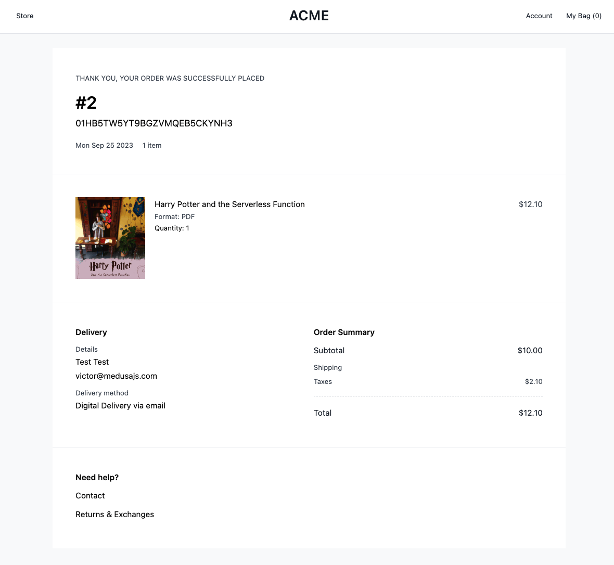

В этом уроке вы узнаете, как создать интернет-магазин электронных книг с помощью Medusa и Next.js.

В ходе статьи мы рассмотрим:

1. Используем шаблон Medusa [Next.js Starter Template](https://medusajs.com/nextjs-commerce/) вместе с [Digital Products Recipe](https://docs.medusajs.com/recipes/digital-products) для создания магазина.
2. Доработайте страницы товаров под цифровые товары. Это включает в себя добавление кнопки для предварительного просмотра медиаконтента и отображение основных сведений о товаре.
3. Доработайте процесс оформления заказа, чтобы сделать его более эффективным для доставки цифровых товаров.
4. Создайте API-маршруты Next.js для проверки и скрытия путей к файлам для загрузки товаров.


Демонстрация финального приложения

Давайте начнем.

## Что такое Medusa?

Medusa - это набор инструментов и модулей, специально разработанных для продуктов электронной коммерции.

Используя Medusa, вы можете построить модульную логику коммерции, такую как [корзины](https://docs.medusajs.com/modules/carts-and-checkout/overview), [товары](https://docs.medusajs.com/modules/products/overview) и [управление заказами](https://docs.medusajs.com/modules/orders/overview). Кроме того, Medusa предоставляет инструменты, которые помогут вам организовать мощные веб-сайты электронной коммерции, POS-приложения, продукты с поддержкой коммерции и все остальное.

## Предварительные требования

Прежде чем приступить к изучению данного руководства, необходимо установить:

- [Node.js(V14 или более поздняя версия)](https://docs.medusajs.com/tutorial/set-up-your-development-environment#nodejs)
- [Git](https://docs.medusajs.com/tutorial/set-up-your-development-environment/#git)
- [Medusa CLI](https://docs.medusajs.com/tutorial/set-up-your-development-environment#medusa-cli)

## Начало работы

Используя стартер Next.js, вы можете создать новое приложение Medusa, выполнив следующую команду:

```bash
npx create-medusa-app@latest --with-nextjs-starter

```

После этого вы можете создать учетную запись пользователя для доступа к панели администратора. Затем настройте инфраструктуру бэкенда, следуя рецепту цифровых продуктов Medusa.

После того как бэкэнд настроен, создайте образцы продуктов через интерфейс администратора Medusa. Убедитесь, что эти продукты включают цифровые медиафайлы для превью и основного контента. Также не забудьте включить соответствующие значения метаданных продукта с помощью пар ключ/значение, связанных с каждым продуктом.

## Как настроить определения типов TypeScript

Если вы используете обычный JavaScript, этот шаг можно пропустить.

Прежде чем мы продолжим, давайте убедимся, что добавили необходимые определения типов TypeScript для цифровых товаров на витрине Next.js.

```javascript
import { Product } from "@medusajs/medusa"
import { ProductVariant } from "@medusajs/product"

export enum ProductMediaVariantType {
  PREVIEW = "предварительный просмотр",
  MAIN = "основной"
}

export type ProductMedia = {
  id: string
  имя?: строка
  файл?: строка
  mime_type?: string
  created_at?: Дата
  updated_at?: Дата
  attachment_type? ProductMediaVariantType
  variant_id?: string
  варианты? ProductMediaVariant[]
}

export type ProductMediaVariant = {
  id: string
  variant_id: string
  product_media_id: string
  тип: строка
  created_at: Дата
  updated_at: Дата
}

export type DigitalProduct = Omit<Product, "variants"> & {
  product_medias? ProductMedia[]
  variants? DigitalProductVariant[]
}

export type DigitalProductVariant = ProductVariant & {
  product_medias? ProductMedia
}

      throw err
    })

  return product_medias[0]
}
```

src/types/product-media.ts

Этот код определяет типы и интерфейсы TypeScript для управления цифровыми товарами и связанными с ними медиафайлами в системе электронной коммерции. Он вводит несколько важных структур:

1. `ProductMedia`: Этот интерфейс описывает медиафайлы, связанные с товаром. Эти файлы могут включать изображения, документы или любые цифровые активы. Он включает в себя такие свойства, как `id` (уникальный идентификатор медиафайла), `name` (необязательное имя медиафайла), `file` (путь к файлу или URL), `mime_type` (тип медиафайла, например, image/jpeg), временные метки `created_at` и `updated_at`, а также `attachment_type`, который классифицирует медиафайл как ”предварительный просмотр” или "основной". Кроме того, у медиаэлемента может быть несколько вариантов, что позволяет адаптировать его для различных случаев использования.
2. `ProductMediaVariant`: Этот интерфейс представляет различные варианты или версии медиафайлов продукта. Каждый вариант имеет свой уникальный `id`, `variant_id` (относящий его к конкретному варианту продукта), `product_media_id` (связывающий его с конкретным медиа-элементом), а также временные метки `created_at` и `updated_at`.
3. `DigitalProduct`: Расширяет стандартный тип `Product`, вводя массив `product_medias`. Этот массив позволяет ассоциировать медиафайлы с цифровым продуктом, позволяя представлять изображения или другие медиафайлы, связанные с продуктом. Свойство `variants` предназначено для цифровых продуктов, адаптируя общий `ProductVariant` к специфическим требованиям цифровых продуктов.
4. `DigitalProductVariant`: Этот тип, бывшийнапряжение `ProductVariant`, позволяет связать медиафайлы с определенным вариантом цифрового продукта. Это особенно ценно для демонстрации различных цифровых активов, связанных с каждым вариантом продукта.

## Как включить предварительные просмотры электронных книг в сведения о продукте

Теперь давайте продвинемся вперед и добавим предварительные просмотры электронных книг на страницу подробного описания товара. Для этого мы возьмем медиапревью, связанные с выбранным в данный момент вариантом продукта.

В файле `src/lib/data/index.ts` мы создадим функцию для получения этих превью на основе выбранного варианта.

```javascript
// ... другие импорты
import { DigitalProduct, ProductMedia } из "types/product-media"

// ... остальные функции

export async function getProductMediaPreviewByVariant(
вариант: Вариант
): Promise<ProductMedia> {
const { product_medias } = await medusaRequest("GET", `/product-media`, {
query: {
variant_ids: variant.id,
expand: ["variants"],
},
})
.then((res) => res.body)
.catch((err) => {
бросить err
})

return product_medias[0]
}

```

src/lib/data/index.ts

Эта функция отвечает за получение информации, связанной с определенным вариантом продукта. Для этого она выполняет HTTP-запрос к конечной точке `/product-media`. Она принимает один аргумент, `variant`, который, как ожидается, будет иметь тип `Variant`. Запрос включает параметры запроса, указывающие `variant_ids`, и запрашивает дополнительные сведения о связанных ”вариантах”.

Функция ожидает ответа от HTTP-запроса и извлекает тело ответа, которое, как предполагается, представляет собой массив медиаобъектов продукта. Затем она возвращает первый медиа-объект продукта из этого массива, предполагая, что такой объект хотя бы один. Если во время выполнения запроса произошла ошибка, она перехватывает ее и перебрасывает запрос.

## Как предлагать предварительные просмотры электронных книг

Чтобы дать покупателям представление о содержании электронной книги, мы предоставим предварительный PDF-файл с первыми несколькими страницами.

Для этого мы создадим маршрут Next API для управления загрузкой файлов, сохраняя при этом их местоположение в тайне. Мы также создадим компонент для простой кнопки ”Загрузить бесплатное превью”. Если у варианта продукта есть превью, они будут отображаться в компоненте product-actions.

Вы можете использовать вновь созданные типы `DigitalProduct` и `DigitalProductVariant` для исправления любых ошибок TypeScript, с которыми вы можете столкнуться.

```javascript
import { NextRequest, NextResponse } из "next/server"

export async function GET(req: NextRequest) {
  // Получаем информацию о файле из URL
  const { filepath, filename } = Object.fromEntries(req.nextUrl.searchParams)

  // Получение PDF-файла
  const pdfResponse = await fetch(filepath)

  // Обработка случая, когда PDF-файл не удалось извлечь
  if (!pdfResponse.ok) return new NextResponse("PDF не найден", { status: 404 })

  // Получение содержимого PDF в виде буфера
  const pdfBuffer = await pdfResponse.arrayBuffer()

  // Определяем заголовки ответа
  const headers = {
    "Content-Type": "application/pdf",
    "Content-Disposition": `attachment; filename="${filename}"`, // Это задает имя файла для загрузки
  }

  // Создаем NextResponse с содержимым и заголовками PDF-файла
  const response = new NextResponse(pdfBuffer, {
    status: 200,
    заголовки,
  })

  return response
}
```

Маршрут API предварительной загрузки: src/app/api/download/preview/route.ts

```javascript
import Button from "@modules/common/components/button"
import { ProductMedia } from "types/product-media"

type Props = {
media: ProductMedia
}

const ProductMediaPreview: React.FC<Props> = ({ media }) => {
const downloadPreview = () => {
window.location.href = `${process.env.NEXT_PUBLIC_BASE_URL}/api/download/preview?filepath=${media.file}&filename=${media.name}`
}

return (

<div>
<Button variant="secondary" onClick={downloadPreview}>
Загрузить бесплатный предварительный просмотр
</Button>
</div>
)
}

export default ProductMediaPreview

```

Компонент кнопки загрузки: src/modules/products/components/product-media-preview/index.tsx

Функция `GET` предназначена для обработки входящих HTTP GET-запросов с использованием фреймворка Next.js. Сначала она извлекает информацию из URL запроса, а именно `filepath` и `filename`, которые должны быть параметрами запроса. Затем он пытается получить PDF-файл из указанного `filepath`. Если PDF-файл успешно получен, он переходит к преобразованию содержимого PDF в буфер.

В случае неудачи, например, если файл не найден, возвращается ответ с сообщением “PDF не найден” и кодом состояния 404, указывающим на ошибку ”не найден".

Если PDF-файл успешно найден, он определяет заголовки ответа, указывая тип содержимого “application/pdf” и устанавливая заголовок “Content-Disposition” для управления поведением при загрузке файла. Заголовок `Content-Disposition` имеет значение “attachment”, а параметр `filename` используется для указания имени файла для загруженного PDF.

```javascript
import Button from "@modules/common/components/button"
import { ProductMedia } из "types/product-media".

тип Реквизиты = {
  медиа: ProductMedia
}

const ProductMediaPreview: React.FC<Props> = ({ media }) => {
  const downloadPreview = () => {
    window.location.href = `${process.env.NEXT_PUBLIC_BASE_URL}/api/download/preview?filepath=${media.file}&filename=${media.name}`
  }

  return (
    <div>
      <Button variant="secondary" onClick={downloadPreview}>
        Загрузить бесплатный предварительный просмотр
      </Button>
    </div>
  )
}

export default ProductMediaPreview
```

src/modules/products/components/product-media-preview/index.tsx

Приведенный выше компонент отображает предварительный просмотр медиафайлов продукта, а также кнопку для загрузки бесплатного предварительного просмотра этого медиафайла. Компонент получает параметр `media`, который, как ожидается, будет иметь тип `ProductMedia`.

Внутри компонента есть функция `downloadPreview`, которая вызывается, когда пользователь нажимает кнопку ”Скачать бесплатную превьюшку”. Эта функция строит URL для загрузки превью, используя свойство `window.location.href`. Она комбинирует базовый URL из переменной окружения `NEXT_PUBLIC_BASE_URL` с маршрутом ”/api/download/preview” и включает параметры запроса для пути к файлу и имени файла, которые извлекаются из свойства `media`.

```javascript
// ...другие импорты
import ProductMediaPreview from "../product-media-preview"
import { getProductMediaPreviewByVariant } from "@lib/data"

const ProductActions: React.FC<ProductActionsProps> = ({ product }) => {
// ...другой код

const [productMedia, setProductMedia] = useState({} as ProductMedia)

useEffect(() => {
const getProductMedia = async () => {
if (!variant) return
await getProductMediaPreviewByVariant(variant).then((res) => {
setProductMedia(res)
})
}
getProductMedia()
}, [variant])

return (
// ... другой код

      {productMedia && <ProductMediaPreview media={productMedia} />}

      <Button onClick={addToCart}>
        {!inStock ? "Нет в наличии" : "Добавить в корзину"}
      </Button>
    </div>

)
}

export default ProductActions

```

Рендер кнопки в product-actions: src/modules/products/components/product-actions/index.tsx

Этот компонент отвечает за отображение действий, связанных с товаром, таких как добавление товара в корзину и показ предварительного просмотра медиафайла товара, если он доступен. Он использует асинхронные операции для получения медиаданных на основе предоставленного `варианта`, что делает его динамичным и интерактивным компонентом.

## Как настроить данные о товаре и доставке

Поскольку информация о товаре и доставке отличается для цифровых и физических товаров, мы будем вносить изменения в эти разделы на странице товара по мере необходимости.

### Как добавить информацию о продукте

Я добавил сведения о товаре в электронную книгу с помощью раздела метаданных товара в админке Medusa. Поскольку мы не используем стандартные атрибуты, мы улучшим компонент `ProductInfoTab` для отображения любых дополнительных метаданных, которые мы включим.

По умолчанию метаданные структурированы в виде объекта. Чтобы упростить создание списка атрибутов, мы превратим его в массив.

В данном случае мы отобразим четыре атрибута из метаданных, разделив их на две колонки. Если вы хотите показать другое количество атрибутов, вы можете легко изменить значения в функции `slice()` при необходимости.

```javascript
// ... другие компоненты

const ProductInfoTab = ({ product }: ProductTabsProps) => {
  // отображаем объект метаданных в массив
  const metadata = useMemo(() => {
    if (!product.metadata) return []
    return Object.keys(product.metadata).map((key) => {
      return [key, product.metadata?[key]]
    })
  }, [product])

  return (
    <Tab.Panel className="text-small-regular py-8">
      <div className="grid grid-cols-2 gap-x-8">
        <div className="flex flex-col gap-y-4">
                {/* Соотнесите метаданные с информацией о товаре */}
          {metadata &&
            metadata.slice(0, 2).map(([key, value], i) => (
              <div key={i}>
                <span className="font-semibold">{key}</span>
                {value}
              </div>
            ))}
        </div>
        <div className="flex flex-col gap-y-4">
          {metadata.length > 2 &&
            metadata.slice(2, 4).map(([key, value], i) => {
              return (
                <div key={i}>
                  <span className="font-semibold">{key}</span>
                  {value}
                </div>
              )
            })}
        </div>
      </div>
      {product.tags?.length ? (
        <div>
          <span className="font-semibold">Теги</span>
        </div>
      ) : null}
    </Tab.Panel
  )
}

// ... другие компоненты
```

src/modules/products/components/product-tabs/index.tsx

### Как настроить детали доставки

Информация о доставке не является актуальной для цифровых товаров, поэтому мы изменим содержимое этой вкладки. Вы можете внести любые необходимые изменения в содержимое компонента `ShippingInfoTab` в том же файле, чтобы оно лучше соответствовало вашемутребования магазина.

```javascript
// ... другие компоненты

const ProductTabs = ({ product }: ProductTabsProps) => {
const tabs = useMemo(() => {
return [
{
label: "Информация о продукте",
компонент: <ProductInfoTab product={product} />,
},
{
label: "Доставка электронной книги",
компонент: <ShippingInfoTab />,
},
]
}, [product])
// ... остальная часть кода
}

// ... другие компоненты

const ShippingInfoTab = () => {
return (
<Tab.Panel className="text-small-regular py-8">

<div className="grid grid-cols-1 gap-y-8">
<div className="flex items-start gap-x-2">
<FastDelivery />
<div>
<span className="font-semibold">Мгновенная доставка</span>.
<p className="max-w-sm">
Ваша электронная книга будет мгновенно доставлена по электронной почте. Вы также можете
скачать ее с вашего аккаунта в любое время.

</div>
</div>
<div className="flex items-start gap-x-2">
<Обновить />
<div>
<span className="font-semibold">Бесплатные предварительные просмотры</span>
<p className="max-w-sm">
Получите бесплатный предварительный просмотр электронной книги, прежде чем купить ее. Просто нажмите
кнопку выше, чтобы скачать ее.

</div>
</div>
</div>
</Tab.Panel
)
}

// ... другие компоненты

```

src/modules/products/components/product-tabs/index.tsx

Компонент `ProductTabs` используется для отображения набора вкладок. Компонент принимает реквизит `product` и использует хук `useMemo` для создания массива объектов вкладок. Каждый объект вкладки состоит из метки и компонента, который будет отображаться, когда эта вкладка активна.

В приведенном выше фрагменте есть две вкладки: ”Информация о продукте” и "Доставка электронной книги". На вкладке "Информация о продукте" отображается информация о продукте с помощью компонента `ProductInfoTab`, который мы определили ранее.

На вкладке ”Доставка электронной книги” используется компонент `ShippingInfoTab` для отображения информации, связанной с доставкой электронной книги. Внутри компонента `ShippingInfoTab` содержится подробная информация о процессе доставки, упоминается мгновенная доставка по электронной почте, возможность загрузки из учетной записи, а также бесплатные предварительные просмотры электронных книг.


Страница продукта

## Как упростить оформление заказа

Продажа цифровых товаров не требует сбора физических адресов покупателей. Для доставки электронной книги нам нужны только их имя и адрес электронной почты, что упрощает процесс оформления заказа за счет удаления ненужных полей ввода.

В этом примере мы оставим только поля имени, фамилии, страны и электронной почты, полностью удалив раздел адреса для выставления счетов. Имейте в виду, что для ваших конкретных требований могут потребоваться другие поля ввода.

Для начала мы настроим типы оформления заказа и контекст, удалив все ссылки на значения, которые больше не нужны.

```javascript
"использовать клиента"

import { medusaClient } from "@lib/config"
import useToggleState, { StateType } from "@lib/hooks/use-toggle-state"
import { Cart, Customer, StorePostCartsCartReq } from "@medusajs/medusa"
import Wrapper from "@modules/checkout/components/payment-wrapper"
import { isEqual } from "lodash"
импорт {
  formatAmount,
  useCart,
  useCartShippingOptions,
  useMeCustomer,
  useRegions,
  useSetPaymentSession,
  useUpdateCart,
} из "medusa-react"
import { useRouter } from "next/navigation"
import React, { createContext, useContext, useEffect, useMemo } from "react"
import { FormProvider, useForm, useFormContext } from "react-hook-form"
import { useStore } из "./store-context"

type AddressValues = {
  имя_имя: string
  фамилия: строка
  код_страны: string
}

export type CheckoutFormValues = {
  shipping_address: AddressValues
  billing_address? AddressValues
  email: string
}

интерфейс CheckoutContext {
  корзина? Omit<Cart, "refundable_amount" | "refunded_total">
  shippingMethods: { label?: string; value?: string; price: string }[]
  isLoading: boolean
  readyToComplete: boolean
  sameAsBilling: StateType
  editAddresses: StateType
  initPayment: () => Promise<void>
  setAddresses: (addresses: CheckoutFormValues) => void
  setSavedAddress: (address: AddressValues) => void
  setShippingOption: (soId: string) => void
  setPaymentSession: (providerId: string) => void
  onPaymentCompleted: () => void
}

const CheckoutContext = createContext<CheckoutContext | null>(null)
```

src/lib/context/checkout-context.tsx

В приведенном выше фрагменте вы определяете типы TypeScript для значений адресов и общей структуры формы. Также создается `CheckoutContext`, который служит контекстом для обмена данными и функциями, связанными с кассой, с другими компонентами.

```javascript
интерфейс CheckoutProviderProps {
children? React.ReactNode
}

const IDEMPOTENCY_KEY = "create_payment_session_key"

export const CheckoutProvider = ({ children }: CheckoutProviderProps) => {
const {
cart,
setCart,
addShippingMethod: {
mutate: setShippingMethod,
isLoading: addingShippingMethod,
},
completeCheckout: { mutate: complete, isLoading: completingCheckout }
} = useCart()

const { customer } = useMeCustomer()
const { countryCode } = useStore()

const methods = useForm<CheckoutFormValues>({
defaultValues: mapFormValues(customer, cart, countryCode),
reValidateMode: "onChange",
})

```

Компонент `CheckoutProvider` управляет данными корзины, информацией о клиенте, обработкой форм и взаимодействием с методами оплаты и доставки. Для этих целей он настраивает различные хуки и функции.

Вы также определяете ключ idempotency, который будет использоваться для предотвращения дублирования запросов при создании платежной сессии.

```javascript
 const methods = useForm<CheckoutFormValues>({
    defaultValues: mapFormValues(customer, cart, countryCode),
    reValidateMode: "onChange",
  })

  const {
    mutate: setPaymentSessionMutation,
    isLoading: setPaymentSession,
  } = useSetPaymentSession(cart?.id!)

  const { mutate: updateCart, isLoading: updatingCart } = useUpdateCart(
    cart?.id!
  )

  const { shipping_options } = useCartShippingOptions(cart?.id!, {
    enabled: !!cart?.id,
  })

  const { regions } = useRegions()

  const { resetCart, setRegion } = useStore()
  const { push } = useRouter()

  const editAddresses = useToggleState()
  const sameAsBilling = useToggleState(
    cart?.billing_address && cart?.shipping_address
      ? isEqual(cart.billing_address, cart.shipping_address)
      : true
  )
```

В этом разделе кода инициализируются несколько переменных и крючков для облегчения управления процессом оформления заказа.

Мы используем переменную `methods` для управления формой оформления заказа, начальные значения которой заполняются функцией `mapFormValues`. Код также устанавливает функции мутации для обновления платежной сессии и корзины (`setPaymentSessionMutation` и `updateCart`) и отслеживает состояние их загрузки. Он извлекает доступные варианты доставки и регионы с помощью хуков, а также обрабатывает сброс корзины и выбор региона.

Также используются булевы состояния (`editAddresses` и `sameAsBilling`) для управления тем, редактирует ли пользователь адреса в данный момент и совпадает ли адрес выставления счета с адресом доставки.

Все эти компоненты в совокупности обеспечивают плавную навигацию и управление данными в процессе оформления заказа.

```javascript
/*

- Булево значение, указывающее, загружается ли часть оформления заказа.
  */
const isLoading = useMemo(() => {
	return addingShippingMethod || settingPaymentSession || updateCart || completingCheckout;
}, [addingShippingMethod, completingCheckout, settingPaymentSession, updatingCart]);

/*

- Булево значение, указывающее на готовность оформления заказа к завершению. Оформление заказа готово к завершению, если.
- пользователь указал электронную почту, адрес доставки, адрес для выставления счета, способ доставки и способ оплаты.
  */
const readyToComplete = useMemo(() => {
	return (
		!!cart &&
		!!cart.email &&
		!!cart.shipping_address &&
		!!cart.billing_address &&
		!!cart.payment_session &&
		cart.shipping_methods?.length > 0
	);
}, [cart]);

const shippingMethods = useMemo(() => {
	if (shipping_options && cart?.region) {
		return shipping_options?.map((option) => ({
			value: option.id,
			label: option.name,
			цена: formatAmount({
				amount: option.amount || 0,
				регион: cart.region,
			}),
		}));
	}

	return [];
}, [shipping_options, cart]);
```

В приведенном выше коде сначала с помощью хука `useMemo` вычисляется булево значение `isLoading`. Он отражает, находится ли какая-либо часть оформления заказа в состоянии загрузки.

Это определяется путем наблюдения за четырьмя флагами загрузки: `addingShippingMethod`, `settingPaymentSession`, `updatingCart` и `completingCheckout`. Если любой из этих флагов имеет значение `true`, флаг `isLoading` также будет иметь значение `true`. Это указывает на то, что какая-то часть оформления заказа находится в процессе.

Булево значение `readyToComplete`, также вычисляемое с помощью `useMemo`, оценивает, готова ли проверка к завершению.

Для того чтобы считаться готовым, должны быть выполнены несколько условий: должен быть действительный объект `cart`, адрес электронной почты, адрес доставки, адрес для выставления счета, платежная сессия и выбран хотя бы один способ доставки. Если все эти условия выполнены, значение `readyToComplete` будет равно `true`, сигнализируя о том, что процесс оформления заказа завершен.

Наконец, переменная `shippingMethods` вычисляется с помощью `useMemo`. Она представляет собой массив доступных методов доставки с соответствующей информацией. Она отображает `shipping_options` (если они существуют) в массив объектов, каждый из которых содержит `value`, `label` и `price`.

Эти объекты представляют собой варианты доставки, их названия и цены, отформатированные с помощью функции `formatAmount`. Эти данные используются для отображения и выбора способов доставки в процессе оформления заказа.

```javascript
/**
   * Сбрасывает форму при изменении корзины.
   */
  useEffect(() => {
    if (cart?.id) {
      methods.reset(mapFormValues(customer, cart, countryCode)))
    }
  }, [customer, cart, methods, countryCode])

  useEffect(() => {
    if (!cart) {
      editAddresses.open()
      return
    }

    if (cart?.shipping_address && cart?.billing_address) {
      editAddresses.close()
      return
    }

    editAddresses.open()
    // eslint-disable-next-line react-hooks/exhaustive-deps
  }, [cart])

  /**
   * Метод для установки выбранного способа доставки для корзины. Он вызывается, когда пользователь выбирает способ доставки, например UPS, FedEx и т. д.
   */
  const setShippingOption = (soId: string) => {
    if (cart) {
      setShippingMethod(
        { option_id: soId }
        {
          onSuccess: ({ cart }) => setCart(cart),
        }
      )
    }
  }

  /**
   * Метод для создания платежных сессий, доступных для корзины. Использует ключ idempotency для предотвращения дублирования запросов.
   */
  const createPaymentSession = async (cartId: string) => {
    return medusaClient.carts
      .createPaymentSessions(cartId, {
        "Idempotency-Key": IDEMPOTENCY_KEY,
      })
      .then(({ cart }) => cart)
      .catch(() => null)
  }

  /**
   * Метод, вызывающий метод createPaymentSession и обновляющий корзину с помощью платежной сессии.
   */
  const initPayment = async () => {
    if (cart?.id && !cart.payment_sessions?.length && cart?.items?.length) {
      const paymentSession = await createPaymentSession(cart.id)

      if (!paymentSession) {
        setTimeout(initPayment, 500)
      } else {
        setCart(paymentSession)
        return
      }
    }
  }

  /**
   * Метод для установки выбранной платежной сессии для корзины. Он вызывается, когда пользователь выбирает поставщика платежей, например Stripe, PayPal и т. д.
   */
  const setPaymentSession = (providerId: string) => {
    if (cart) {
      setPaymentSessionMutation(
        {
          provider_id: providerId,
        },
        {
          onSuccess: ({ cart }) => {
            setCart(cart)
          },
        }
      )
    }
  }

  const prepareFinalSteps = () => {
    initPayment()

    if (shippingMethods?.length && shippingMethods?.[0]?.value) {
      setShippingOption(shippingMethods[0].value)
    }
  }

  const setSavedAddress = (address: AddressValues) => {
    const setValue = methods.setValue

    setValue("shipping_address", {
      код_страны: адрес.код_страны || "",
      first_name: address.first_name || "",
      last_name: address.last_name || "",
    })
  }

  /**
   * Метод, который проверяет, совпадает ли регион корзины с регионом адреса доставки. Если нет, то обновляется регион корзины.
   */
  const validateRegion = (countryCode: string) => {
    if (regions && cart) {
      const region = regions.find((r) =>
        r.countries.map((c) => c.iso_2).includes(countryCode)
      )

      if (region && region.id !== cart.region.id) {
        setRegion(region.id, countryCode)
      }
    }
  }

  /**
   * Метод, устанавливающий адреса и email в корзине.
   */
  const setAddresses = (data: CheckoutFormValues) => {
    const { shipping_address, billing_address, email } = data

    const payload: StorePostCartsCartReq = {
      shipping_address,
      email,
    }

    if (isEqual(shipping_address, billing_address)) {
      sameAsBilling.open()
    }

    if (sameAsBilling.state) {
      payload.billing_address = shipping_address
    } else {
      payload.billing_address = billing_address
    }

    updateCart(payload, {
      onSuccess: ({ cart }) => {
        setCart(cart)
        prepareFinalSteps()
      },
    })
  }

  /**
   * Метод для завершения процесса оформления заказа. Он вызывается, когда пользователь нажимает кнопку "Завершить оформление".
   */
  const onPaymentCompleted = () => {
    complete(undefined, {
      onSuccess: ({ data }) => {
        resetCart()
        push(`/order/confirmed/${data.id}`)
      },
    })
  }

  return (
    <FormProvider {...methods}>
      <CheckoutContext.Provider
        value={{
          cart,
          shippingMethods,
          isLoading,
          readyToComplete,
          sameAsBilling,
          editAddresses,
          initPayment,
          setAddresses,
          setSavedAddress,
          setShippingOption,
          setPaymentSession,
          onPaymentCompleted,
        }}
      >
        <Wrapper paymentSession={cart?.payment_session}>{children}</Wrapper>
      </CheckoutContext.Provider>
    </FormProvider>
  )
}
```

Этот раздел кода управляет различными аспектами процесса оформления заказа в электронной коммерции. Он управляет состоянием формы, сбрасывает форму при изменении корзины и переключает видимость редактирования адреса. Он управляет выбором способов доставки, созданием и инициализацией платежных сессий, а также выбором провайдеров платежей. Кроме того, он обеспечивает правильную настройку адресов доставки, биллинга и электронной почты, а также проверяет регион корзины на основе адреса доставки.

Он также координирует завершение процесса оформления заказа, включая обработку платежа и подтверждение заказа.

Все эти функции и данные аинкапсулируются в компонент `CheckoutProvider`.

```javascript
export const useCheckout = () => {
const context = useContext(CheckoutContext)
const form = useFormContext<CheckoutFormValues>()
if (context === null) {
throw new Error(
"useProductActionContext должен использоваться внутри ProductActionProvider"
)
}
return { ...context, ...form }
}

/*

- Метод сопоставления полей потенциального покупателя и корзины со значениями формы оформления заказа. Информация присваивается со следующим приоритетом:
- 1.  Информация о корзине
- 2.  Информация о покупателе
- 3.  значения по умолчанию - null
      \*/
      const mapFormValues = (
      клиент? Omit<Customer, "password_hash">,
      cart? Omit<Cart, "refundable_amount" | "refunded_total">,
      currentCountry?: string
      ): CheckoutFormValues => {
      const customerShippingAddress = customer?.shipping_addresses?[0]
      const customerBillingAddress = customer?.billing_address

возврат {
shipping*address: {
first_name:
cart?.shipping_address?.first_name ||
customerShippingAddress?.first_name ||
"",
last_name:
cart?.shipping_address?.last_name ||
customerShippingAddress?.last_name ||
"",
код*страны:
currentCountry ||
cart?.shipping_address?.country_code ||
customerShippingAddress?.country_code ||
"",
},
billing_address: {
first_name:
cart?.billing_address?.first_name ||
customerBillingAddress?.first_name ||
"",
last_name:
cart?.billing_address?.last_name ||
customerBillingAddress?.last_name ||
"",
код страны:
cart?.shipping_address?.country_code ||
customerBillingAddress?.country_code ||
"",
},
email: cart?.email || customer?.email || "",
}
}

```

Хук `useCheckout` используется для доступа к контексту кассы и контексту формы, обычно используемым в компонентах React. Он извлекает `CheckoutContext` из контекста приложения, а также получает контекст формы оформления заказа, позволяя компонентам получать доступ и использовать эти контексты.

Функция `mapFormValues` отвечает за отображение и приоритезацию информации для формы оформления заказа. Она принимает данные о покупателе и корзине, а также текущую страну и генерирует значения для полей формы оформления заказа.

Приоритет данных устанавливается в таком порядке: 1) информация о корзине, 2) информация о покупателе и 3) значения по умолчанию, установленные в null, если информация не доступна. Эта функция помогает заполнить форму оформления заказа наиболее релевантными данными, обеспечивая более плавное взаимодействие с пользователем в процессе оформления заказа.

Теперь, когда контекст обновлен, мы удалим лишние поля ввода из формы оформления заказа.

```javascript
import { useCheckout } from '@lib/context/checkout-context';
import Button from '@modules/common/components/button';
import Spinner from '@modules/common/icons/spinner';
import ShippingAddress from '../shipping-address';

const Addresses = () => {
	const {
		editAddresses: { state: isEdit, toggle: setEdit },
		setAddresses,
		handleSubmit,
		cart,
	} = useCheckout();
	return (
		<div className="bg-white">
			<div className="text-xl-semi flex items-center gap-x-4 px-8 pb-6 pt-8">
				<div className="bg-gray-900 flex h-8 w-8 items-center justify-center rounded-full text-white text-sm">
					1
				</div>
				<h2>Адрес доставки</h2>
			</div>
			{isEdit ? (
				<div className="px-8 pb-8">
					<ShippingAddress />
					<Button className="mt-6 max-w-[200px]" onClick={handleSubmit(setAddresses)}>
						. Продолжить доставку
					</Button>
				</div>
			) : (
				<div>
					<div className="bg-gray-50 text-small-regular px-8 py-6">
						{cart && cart.shipping_address ? (
							<div className="flex items-start gap-x-8">
								<div className="text-small-regular flex h-6 min-w-[24px] items-center justify-center rounded-full bg-green-400 text-white">
									✓
								</div>
								<div className="flex w-full items-start justify-between">
									<div className="flex flex-col">
										<span>
											{cart.shipping_address.first_name} {cart.shipping_address.last_name}
											{cart.shipping_address.country}
										</span>
										<div className="mt-4 flex flex-col">
											<span>{cart.email}</span>
										</div>
									</div>
									<div>
										<button onClick={setEdit}>Редактировать</button>
									</div>
								</div>
							</div>
						) : (
							<div className="">
								<Spinner />
							</div>
						)}
					</div>
				</div>
			)}
		</div>
	);
};

export default Addresses;
```

src/modules/checkout/components/addresses/index.tsx


Страница кассы

На последнем этапе мы модифицируем компонент `shipping-details`, чтобы он показывал важную информацию после успешного оформления заказа. В этой ситуации мы уберем все лишние детали и добавим адрес электронной почты покупателя для справки.

```js
import { Address, ShippingMethod } из "@medusajs/medusa"

type ShippingDetailsProps = {
адрес: Адрес
shippingMethods: ShippingMethod[]
email: string
}

const ShippingDetails = ({
адрес,
shippingMethods,
email,
}: ShippingDetailsProps) => {
return (

<div className="text-base-regular">
<h2 className="text-base-semi">Доставка</h2>
<div className="my-2">
<h3 className="text-small-regular text-gray-700">Детали</h3>
<div className="flex flex-col">
<span>{`${address.first_name}${address.last_name}`}</span>
<span>{email}</span>
</div>
</div>
<div className="my-2">
<h3 className="text-small-regular text-gray-700">Способ доставки</h3>
<div>
{shippingMethods.map((sm) => {
return <div key={sm.id}>{sm.shipping_option.name}</div>
})}
</div>
</div>
</div>
)
}

export default ShippingDetails

```

src/modules/order/components/shipping-details/index.tsx



Страница подтверждения заказа

## Как доставлять цифровые продукты

Существуют различные способы доставки цифровых продуктов покупателям: отправка ссылки на скачивание по электронной почте, добавление кнопки загрузки на страницу подтверждения заказа или предоставление доступа через их учетную запись.

Во всех этих ситуациях наша главная цель - убедиться, что продукт смогут получить только те, кто его приобрел.

Для этого я настроил бэкенд на создание специального кода (токена) для каждого цифрового товара в заказе. Мы можем использовать GET `/store/:token`, чтобы проверить токен и отдать файл пользователю. Но этот метод показывает пользователю веб-адрес файла, что не очень хорошо для предотвращения пиратства.

Поэтому мы создадим маршрут Next API по адресу `src/app/api/download/main/[token]/route.ts`. Этот маршрут будет обрабатывать токен, выступая в качестве посредника для предоставления файла пользователю, не раскрывая, где он хранится.

```javascript
import { NextRequest, NextResponse } из "next/server"

export async function GET(
  req: NextRequest,
  { params }: { params: Record<string, any> }
) {
  // Получение токена из URL
  const { token } = params

  // Определяем URL для получения данных из PDF-файла
  const pdfUrl = `${process.env.NEXT_PUBLIC_MEDUSA_BACKEND_URL}/store/product-media/${token}`

  // Получение данных PDF-файла
  const { file, filename } = await fetch(pdfUrl).then((res) => res.json())

  // Обработка случая, когда токен недействителен
  if (!file) return new NextResponse("Invalid token", { status: 401 })

  // Получение PDF-файла
  const pdfResponse = await fetch(file)

  // Обработка случая, когда PDF не удалось извлечь
  if (!pdfResponse.ok) return new NextResponse("PDF не найден", { status: 404 })

  // Получение содержимого PDF в виде буфера
  const pdfBuffer = await pdfResponse.arrayBuffer()

  // Определяем заголовки ответа
  const headers = {
    "Content-Type": "application/pdf",
    "Content-Disposition": `attachment; filename="${filename}"`, // Это задает имя файла для загрузки
  }

  // Создаем NextResponse с содержимым и заголовками PDF-файла
  const response = new NextResponse(pdfBuffer, {
    status: 200,
    заголовки,
  })

  return response
}
```

src/app/api/download/main/\[token\]/route.ts

Этот код определяет бессерверную функцию для обработки HTTP GET-запросов в приложении Next.js. Она извлекает PDF-файл с помощью токена, указанного в параметрах URL, получая файл из внешнего источника. Функция проверяет действительность токена и доступность PDF-файла. Если токен недействителен, возвращается ответ “401 Unauthorized”. Если PDF-файл не найден, возвращается ответ “404 Not Found”.

Когда PDF-файл успешно найден, он формирует заголовки ответа, включая тип содержимого “application/pdf” и предлагаемое имя файла для загрузки, и возвращает PDF-файл клиенту в виде загружаемого вложения. Этот код обычно используется для обслуживания PDF-файлов в ответ на определенные GET-запросы.

Теперь мы можем связать этот API-маршрут с письмом о доставке следующим образом: `{ваш_магазин_url}/api/download/main/{token}`.

Вы можете добавить собственную логику, чтобы аннулировать токены через определенное время или X количество загрузок.

## **Миссия выполнена!**

Поздравляем, вы справились! Не забудьте изучить другие [Рецепты] (https://docs.medusajs.com/recipes), чтобы найти новые способы использовать Medusa по максимуму.
