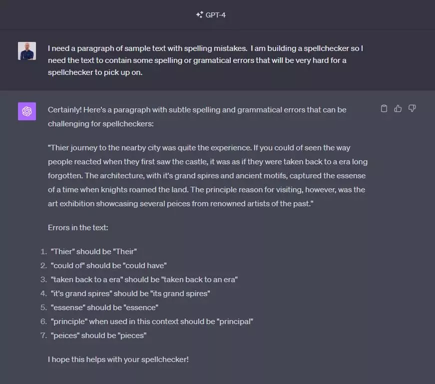
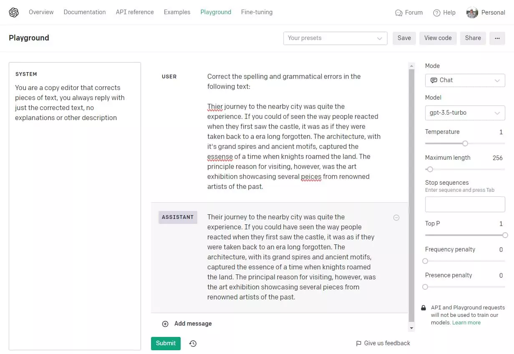

Большая языковая модель OpenAI ChapGPT - это нечто большее, чем просто интерфейс для общения. Это мощный инструмент для решения целого ряда задач, включая перевод, генерацию кода и, как мы увидим ниже, даже проверку орфографии. Через свой REST API ChatGPT предоставляет простой и чрезвычайно эффективный способ добавить в проект возможности языкового анализа и генерации ИИ.

Весь [код для этого руководства вы можете найти на GitHub](https://github.com/traintocode/example-chatgpt-spellchecker).\_

## Облачная функция

Вот код для функции облака:

```typescript
// Точка входа для AWS Lambda.
export async function spellcheck({ body }: { body: string }) {

    // Считываем текст из тела запроса.
    const { textToCheck } = <{ textToCheck: string }>JSON.parse(body);

    //... выполняем проверку орфографии

    // Возвращаем ответ HTTP OK
    return {
        statusCode: 200,
        body: JSON.stringify(...)
    };

}

```

Эта функция Typescript будет являться обработчиком для AWS Lambda, принимая HTTP-запрос в качестве входных данных и возвращая HTTP-ответ. В примере выше мы деконструируем поле `body` из входящего HTTP-запроса, разбираем его на JSON и читаем свойство `textToCheck` из тела запроса.

## Пакет openai

Чтобы реализовать функцию проверки орфографии, мы отправим `textToCheck` в OpenAI и попросим модель искусственного интеллекта исправить за нас все орфографические ошибки. Чтобы сделать это проще, мы можем использовать пакет [openai на NPM] (https://www.npmjs.com/package/openai). Этот пакет поддерживается OpenAI как удобная Javascript/Typescript обертка вокруг OpenAI REST API. Он включает в себя все необходимые нам типы Typescript и делает вызов ChatGPT простым делом.

Установите пакет openai следующим образом:

```bash
npm install --save openai
```

Затем мы можем импортировать и создать экземпляр класса `OpenAI` в нашем обработчике функции, передав ему наш API-ключ OpenAI, который в данном примере хранится в переменной окружения `OPENAI_KEY`. (Вы можете найти свой API-ключ [в настройках пользователя](https://help.openai.com/en/articles/4936850-where-do-i-find-my-secret-api-key) после регистрации в OpenAI).

```ts
// Импортируем пакет OpenAI
import OpenAI from "openai";

export async function spellcheck({ body }: { body: string }) {

    const { textToCheck }: { textToCheck: string } = JSON.parse(body);

    // Создаем новый экземпляр OpenAI...
    const openai = new OpenAI({ apiKey: process.env.OPENAI_KEY });

    //... выполняем проверку орфографии

    return {
        statusCode: 200,
        body: JSON.stringify(...)
    };

}

```

## Образец текста

Наконец, нам нужен пример текста с орфографическими ошибками, чтобы проверить его на практике, и что может быть лучше, чем спросить самого ChatGPT!



Этот текст является хорошим тестом для нашей системы проверки орфографии, так как он содержит очевидные ошибки, такие как “essense”, а также некоторые более сложные грамматические ошибки, такие как “princip**le**” вместо “princip**al**”. Ошибки, подобные этой, проверят нашу систему проверки орфографии, выйдя за рамки простого поиска слов, которых нет в словаре; _principle_ и _principal_ - оба правильные английские слова, поэтому нашей системе проверки орфографии придется использовать контекст, в котором они встречаются, чтобы правильно определить эту ошибку. Настоящий тест!

## Ввод текста, вывод текста

Самый простой способ поиска орфографических ошибок в нашем `textToCheck` - это создать подсказку, которая попросит ChatGPT выполнить проверку орфографии и вернуть нам исправленную версию. Позже в этом руководстве мы рассмотрим гораздо более мощные способы получения дополнительных данных от OpenAI API, но пока этот простой подход будет хорошей первой итерацией.

Для этого нам понадобятся две подсказки. Первая - это подсказка _пользователя_, которая поручает ChatGPT проверить орфографические ошибки:

> Исправьте орфографические и грамматические ошибки в следующем тексте:

Нам также понадобится _системная подсказка_, которая будет направлять модель на возврат только исправленного текста.

> Вы - копирайтер, который исправляет куски текста, вы всегда отвечаете только исправленным текстом, без пояснений или других описаний.

Системные подсказки полезны для того, чтобы задать модели начальный контекст и проинструктировать ее вести себя определенным образом при всех последующих обращениях к пользователю. В системной подсказке здесь мы инструктируем ChatGPT возвращать _только_ исправленный текст, а не украшать его описанием или другим вводным текстом.

Мы можем протестировать системные и пользовательские подсказки в [OpenAI playground](https://platform.openai.com/playground).



Для вызова API мы будем использовать метод `openai.chat.completions.create({...})` класса `OpenAI`, который мы инстанцировали выше, и возвращать сообщение ответа.

Если собрать все вместе, то приведенный ниже код отправит эти две подсказки вместе с вводимым текстом в конечную точку `openai.chat.completions.create({...})` на OpenAI API. Обратите внимание, что мы указываем [модель](https://platform.openai.com/docs/models) для использования как `gpt-3.5-turbo`. Мы можем использовать для этого любую модель OpenAI, включая GPT-4:

```typescript
// Импортируем пакет OpenAI
import OpenAI from 'openai';

export async function spellcheck({ body }: { body: string }) {
	const { textToCheck }: { textToCheck: string } = JSON.parse(body);

	// Создаем новый экземпляр OpenAI.
	const openai = new OpenAI({ apiKey: process.env.OPENAI_KEY });

	const userPrompt = 'Исправьте орфографические и грамматические ошибки в следующем тексте:\n\n';

	const gptResponse = await openai.chat.completions.create({
		model: 'gpt-3.5-turbo',
		сообщения: [
			{
				роль: 'system',
				content:
					'Вы копирайтер, который исправляет куски текста, вы всегда отвечаете только исправленным текстом, без объяснений или других описаний',
			},
			{
				роль: 'пользователь',
				содержимое: userPrompt + textToCheck,
			},
		],
	});

	// Сообщение.content будет содержать исправленный текст...
	const correctedText = gptResponse.choices[0].message.content;

	return {
		statusCode: 200,
		body: correctedText,
	};
}
```

## Текст на входе, JSON на выходе

До сих пор мы писали облачную функцию AWS Lambda, которая отправляла некоторый текст в ChatGPT и возвращала исправленную версию текста с удаленными орфографическими ошибками. Но пакет `openai` позволяет нам сделать гораздо больше. Разве не было бы здорово возвращать структурированные данные из нашей функции, в которых действительно перечислены замены, сделанные в тексте? Это значительно упростило бы интеграцию этой облачной функции с внешним пользовательским интерфейсом.

К счастью, OpenAI предоставляет функцию в API, которая позволяет добиться именно этого: [Function Calling](https://openai.com/blog/function-calling-and-other-api-updates).

**Вызов функции** - это функция, присутствующая в _некоторых_ моделях OpenAI, которая позволяет ChatGPT отвечать не простым сообщением, а некоторым структурированным JSON. Указав модели ИИ вызвать функцию и предоставив детали функции, которую она может вызвать (включая все аргументы), мы можем получить гораздо более полезный и предсказуемый JSON-ответ от API.

Чтобы использовать вызов функций, мы заполняем массив `functions` в опциях создания завершения чата. Здесь мы сообщаем ChatGPT, что существует функция `makeCorrections`, которую он может вызвать с одним аргументом `replacements`:

```typescript
const gptResponse = await openai.chat.completions.create({
model: "gpt-3.5-turbo-0613",
сообщения: [ ... ],
функции: [
{
имя: "makeCorrections",
описание: "Вносит орфографические или грамматические исправления в текст",
параметры: {
type: "объект",
свойства: {
замены: {
тип: "массив",
описание: "Массив исправлений",
элементы: {
тип: "объект",
свойства: {
changeFrom: {
тип: "string",
описание: "Слово или фраза, которую нужно изменить"
},
changeTo: {
тип: "string",
описание: "Новое слово или фраза, на которую следует заменить".
},
причина: {
тип: "string",
описание: "Причина, по которой вносится это изменение",
перечисление: ["Грамматика", "Орфография"]
}
}
}
}
}
}
}
], });

```

Здесь важны описания функции и всех аргументов, потому что ChatGPT не будет иметь доступа к нашему коду, поэтому все, что он знает о функции, содержится в описаниях, которые мы ему предоставляем. Свойство `parameters` описывает сигнатуру функции, которую может вызвать ChatGPT, и следует [JSON Schema](https://json-schema.org/) для описания структуры данных аргументов.

Функция выше имеет единственный аргумент `replacements`, который соответствует следующему типу TypeScript:

```typescript
тип ReplacementsArgType = {
	changeFrom: string;
	changeTo: string;
	причина: 'Grammar' | 'Spelling';
}[];
```

Определение этого типа в JSON Schema гарантирует, что JSON, который мы получим от ChatGPT, будет соответствовать этой предсказуемой форме, и мы можем использовать `JSON.parse()` для десериализации его в объект этого типа:

```typescript
const args = <ReplacementsArgType>JSON.parse(responseChoice.message.function_call!.arguments);
```

## Собираем все вместе

Вот финальный код для нашей функции AWS Lambda. Она вызывает ChatGPT и возвращает _список_ исправлений к фрагменту текста.

Здесь стоит отметить пару дополнительных моментов. Как мужчиныкак уже говорилось, только несколько моделей OpenAI поддерживают вызов функций. Одной из таких моделей является `gpt-3.5-turbo-0613`, поэтому она была указана в вызове конечной точки завершения. Мы также добавили `function_call: { name: 'makeCorrections' }` к вызову. Это свойство указывает модели, что мы ожидаем от нее возврата аргументов, необходимых для вызова нашей функции `makeCorrections`, и что мы не ожидаем от нее возврата сообщения в чате:

```typescript
import OpenAI from 'openai';
import { APIGatewayEvent } from 'aws-lambda';

type ReplacementsArgType = {
	changeFrom: string;
	changeTo: string;
	reason: 'Grammar' | 'Spelling';
}[];

export async function main({ body }: { body: string }) {
	const { textToCheck }: { textToCheck: string } = JSON.parse(body);

	const openai = new OpenAI({ apiKey: process.env.OPENAI_KEY });

	const prompt = 'Исправьте орфографические и грамматические ошибки в следующем тексте:\n\n';

	// Выполняем запрос ChatGPT с помощью вызова функций...
	const gptResponse = await openai.chat.completions.create({
		model: 'gpt-3.5-turbo-0613',
		сообщения: [
			{
				роль: 'пользователь',
				содержимое: prompt + textToCheck,
			},
		],
		функции: [
			{
				name: 'makeCorrections',
				описание: 'Вносит орфографические или грамматические исправления в текст',
				параметры: {
					тип: 'object',
					свойства: {
						замены: {
							type: 'array',
							описание: 'Массив исправлений',
							items: {
								тип: 'объект',
								свойства: {
									changeFrom: {
										тип: 'string',
										описание: 'Слово или фраза, которую нужно изменить',
									},
									changeTo: {
										type: 'string',
										описание: 'Новое слово или фраза, на которую нужно заменить',
									},
									причина: {
										тип: 'string',
										описание: 'Причина, по которой вносится это изменение',
										enum: ['Grammar', 'Spelling'],
									},
								},
							},
						},
					},
				},
			},
		],
		function_call: { name: 'makeCorrections' },
	});

	const [responseChoice] = gptResponse.choices;

	// Десериализуем свойство "function_call.arguments" в ответе
	const args = <ReplacementsArgType>JSON.parse(responseChoice.message.function_call!.arguments);

	return {
		statusCode: 200,
		тело: JSON.stringify(args),
	};
}
```

Эту функцию можно развернуть на AWS Lambda и [вызвать по HTTP](https://docs.aws.amazon.com/lambda/latest/dg/lambda-urls.html), используя следующее тело запроса:

```javascript
{
"textToCheck": "Их путешествие в соседний город было весьма интересным. Если бы вы видели, как реагировали люди, когда впервые увидели замок, они словно перенеслись в давно забытую эпоху. Архитектура с величественными шпилями и древними мотивами передавала дух того времени, когда по земле бродили рыцари. Однако главной причиной посещения замка стала художественная выставка, на которой было представлено несколько работ известных художников прошлого."
}

```

Это вернет список исправлений в виде массива JSON, как показано здесь:

```javascript
[
	{
		changeFrom: 'Thier',
		changeTo: 'Their',
		причина: 'Орфография',
	},
	{
		changeFrom: 'could of',
		changeTo: 'мог бы',
		причина: 'Grammar',
	},
	{
		changeFrom: 'a',
		changeTo: 'an',
		причина: 'Grammar',
	},
	//...
];
```

## Заключение

Используя API OpenAI и облачные функции, вы можете создавать приложения, которые не только определяют орфографические ошибки, но и понимают контекст, улавливая сложные грамматические нюансы, которые обычные программы проверки орфографии могут упустить. Этот учебник закладывает основу, но потенциальные возможности применения ChatGPT для анализа и исправления языка огромны. По мере развития искусственного интеллекта будут расширяться и возможности таких инструментов.
