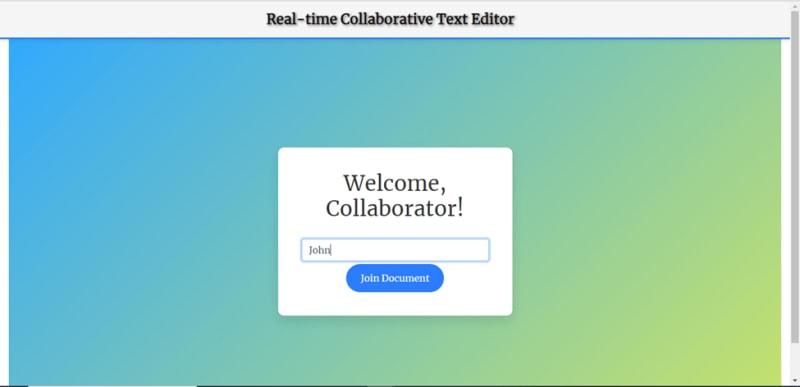

С появлением социальных сетей и других средств связи, подключенных к Интернету, все большее значение приобретает передача данных в режиме реального времени. Протокол передачи гипертекста (HTTP) - это коммуникационный протокол, подобный WebSocket, который следует схеме односторонней связи ”запрос - ответ". Большинство разработчиков используют его для реализации связи в реальном времени, но он не справляется с задачей, когда требуется мгновенное обновление и создание полнодуплексного двунаправленного средства связи. Хотя HTTP с помощью различных методов, таких как HTTP Polling, Streaming и server-sent events (SSE), помог разработчикам реализовать передачу данных, у него есть ограничения и недостатки, которые проложили путь к WebSocket. WebSocket помогает разработчикам реализовать механизм полнодуплексной двунаправленной связи и построить систему связи в реальном времени.

В этой статье мы обсудим недостатки протокола HTTP, а также рассмотрим концепцию коммуникации в реальном времени и способы ее реализации с помощью протокола WebSocket при создании базового клиентского коммуникационного приложения.

## [](https://dev.to/refine/how-to-set-up-a-websocket-connection-with-node-and-react-dn9#why-websocket)Почему WebSocket?

При создании веб-приложений с функцией полнодуплексной (двусторонней) двунаправленной связи разработчикам приходится перестраивать традиционный протокол HTTP для реализации передачи данных. Протокол HTTP имеет несколько методов, таких как HTTP Polling, HTTP Streaming и отправляемые сервером события, которые помогают разработчикам создавать приложения в реальном времени. Эти методы имеют ряд недостатков, в которых WebSockets доказал свое превосходство, как мы увидим в следующих нескольких разделах.

**HTTP Polling**
Первая попытка решить проблемы, возникающие при использовании традиционного протокола HTTP, - это интервальный опрос сервера. Клиент посылает запрос серверу через заданные промежутки времени с помощью функций setInterval или setTimeout. При длительном опросе сервер сам определяет интервал или время ожидания. Совокупность событий запроса и ответа в протоколе HTTP называется жизненным циклом `HTTP Polling`. Он включает в себя следующие этапы:

- Для взаимодействия с сервером клиент отправляет запрос и ждет ответа.
- Сервер отправляет ответ, когда происходит событие, обновление или изменение, или достигает тайм-аута, до тех пор пока не зависнет запрос клиента.
- Сервер отправляет ответ клиенту, когда происходит обновление или изменение.
- Этот цикл продолжается, пока клиент отправляет новый запрос.

Ниже перечислены некоторые недостатки, связанные с HTTP Polling: Кэширование, тайм-ауты, накладные расходы на заголовок и задержка. Построение приложения реального времени с помощью WebSocket устраняет эти подводные камни, связанные с HTTP Polling.

**HTTP Stream**
При HTTP Polling сервер закрывается, не отправив ответ клиенту; это основная причина сетевых задержек, связанных с HTTP Polling. При HTTP Polling сервер закрывает канал соединения запроса после получения ответа. Такое закрытие канала соединения означает, что клиенту придется создавать новое соединение при каждом новом запросе. HTTP Stream решает эту проблему. В HTTP Stream первоначальный запрос остается открытым даже после того, как сервер ответил на запрос клиента данными. Оставляя канал запроса открытым на неопределенный срок, сервер может постоянно отправлять ответы клиенту при появлении новых данных, обновлении или изменении. HTTP Stream уменьшает задержку, предоставляет обновления практически в режиме реального времени и эффективно использует ресурсы сервера. Ограничение, связанное с потоковой передачей данных по HTTP, заключается в том, что она требует от клиента инициировать запрос и установить соединение, поэтому задержка также может быть проблемой при потоковой передаче.

[**Server-Sent Event (SSE)**](https://developer.mozilla.org/en-US/docs/Web/API/Server-sent_events)
Протокол ”сервер - отправленное событие" обеспечивает однонаправленный канал связи (сервер - клиент) для передачи данных в реальном или близком к реальному времени. SSE - это стандартизированный протокол потоковой передачи данных HTTP со встроенным API браузера.

NB: Firefox не поддерживает использование SSE в рабочих службах.

SSE - отличный выбор для однонаправленной передачи данных от сервера к клиенту. SSE отлично подходит для случаев, когда нет необходимости передавать данные от клиента к серверу. Например, SSE особенно полезен для работы с обновлениями ленты социальных сетей и панелями мониторинга в реальном времени.

До сих пор мы видели недостатки традиционных методов HTTP и то, насколько неэффективно использовать их для реализации двунаправленной связи в реальном времени. WebSocket - более подходящий вариант для реализации двунаправленного обмена данными.

**Что такое WebSocket**.
WebSocket - это протокол передачи данных, который позволяет осуществлять двунаправленный (двусторонний), полнодуплексный и интерактивный обмен данными между браузером (клиентом) и сервером в режиме реального времени через одно долговременное соединение Transmission Control Protocol (TCP). С помощью [WebSocket API](https://developer.mozilla.org/en-US/docs/Web/API/WebSockets_API), клиент может отправлять запросы на сервер и получать ответы, основанные на событиях, без необходимости опрашивать сервер.

Соединение WebSocket происходит в следующем порядке:

- **Прием запроса**: Чтобы установить соединение, клиент отправляет серверу начальный запрос, известный как WebSocket handshake.
- **Валидация запроса**: Получив запрос, сервер проверяет его валидность и подключается, если проверка прошла успешно.
- **Соединение**: После успешной проверки устанавливается WebSocket-соединение, и сервер и клиент могут передавать друг другу данные.

WebSocket API поддерживается большинством основных браузеров, как показано в этой [таблице совместимости](https://developer.mozilla.org/en-US/docs/Web/API/WebSockets_API#browser_compatibility).

**Почему разработчикам следует использовать WebSockets**.
Из-за несоответствий, связанных с методами HTTP, не рекомендуется создавать приложение с функцией двунаправленной связи, используя традиционные методы HTTP. WebSockets обеспечивает низкую задержку, двунаправленные каналы связи в реальном времени между клиентом и сервером. Будучи легковесным протоколом, он также масштабируется и поддерживает полнодуплексную (двустороннюю) связь. WebSockets поддерживается большинством современных браузеров.

## [](https://dev.to/refine/how-to-set-up-a-websocket-connection-with-node-and-react-dn9#unleashing-the-power-of-websockets-using-nodejs-and-react)Unleashing the Power of WebSockets using Node.js and React

В соответствии с порядком соединения WebSocket, рассмотренным ранее, протокол WebSocket начинается с создания рукопожатия, а затем разрешает связь после подтверждения запроса отправкой данных. Соединение между клиентом и сервером должно быть установлено через рукопожатие. Обмен данными между клиентом и сервером в реальном времени возможен после завершения квитирования.

Мы продемонстрируем, как установить WebSocket-соединение с помощью Node.js и React.js. Чтобы проиллюстрировать возможности WebSockets, мы используем в качестве примера приложение для совместного редактирования текста. С помощью этого приложения несколько человек могут одновременно работать и редактировать текст, и все изменения, сделанные одним человеком, сразу же становятся видны всем остальным пользователям.

## [](https://dev.to/refine/how-to-set-up-a-websocket-connection-with-node-and-react-dn9#accessing-the-code)Доступ к коду

Прежде чем перейти к рассмотрению особенностей WebSockets, важно помнить, что в Git Repository доступен весь код. Исходный код прототипа приложения для совместного редактирования текста, которое будет использоваться в качестве реального примера для практического понимания веб-сокетов, находится в корневой папке (**WebSockets-Demo-main**), которую можно получить по указанному URL([**Collaborative Text Editing Application**](https://github.com/khabbabpersonal/WebSockets-Demo)). Чтобы проследить за ходом работы, клонируйте или загрузите репозиторий.

## [](https://dev.to/refine/how-to-set-up-a-websocket-connection-with-node-and-react-dn9#run-the-application-after-setting-up-the-environment)Запустите приложение после настройки среды

Следующим шагом после загрузки и распаковки файла будет настройка окружения. Используя ваш любимый редактор кода, откройте распакованную папку. В ней есть две основные директории:

**Каталог сервера:** Здесь расположен сервер Node.js WebSocket. Он отвечает за управление основной логикой текстового редактора.

**Каталог клиента:** Здесь находится React-приложение, которое взаимодействует с WebSocket-сервером. Оно отвечает за работу приложения в режиме реального времени. Через него пользователь взаимодействует с приложением.

Чтобы запустить приложение для редактирования текста, необходимо выполнить несколько команд. Эти команды запустят сервер и клиент и установят необходимые пакеты. Вы можете открыть приложение в двух разных окнах браузера и редактировать текст одновременно после запуска сервера и клиента. Здесь вы начинаете знакомиться с возможностями WebSockets в реальном времени.

## [](https://dev.to/refine/how-to-set-up-a-websocket-connection-with-node-and-react-dn9#understanding-the-code)Понимание кода.

### [](https://dev.to/refine/how-to-set-up-a-websocket-connection-with-node-and-react-dn9#understanding-the-websocket-handshake)Понимание рукопожатия WebSocket

Сервер и клиент начинают рукопожатие по протоколу WebSocket. На уровне сервера включен HTTP-сервер, а сервер WebSocket подключен через один порт. Сервер WebSocket подключается к порту HTTP после того, как HTTP-сервер будет настроен. Процесс создания WebSocket-соединения начинается с этого, и это служит началом обмена между сервером и клиентом, подобно виртуальному рукопожатию.

```js
// "/server/index.js"
// Импортируем необходимые модули
const { WebSocket, WebSocketServer } = require('ws');
const http = require('http');
const uuidv4 = require('uuid').v4;

// Создаем HTTP-сервер и WebSocket-сервер
const server = http.createServer();
const wsServer = new WebSocketServer({ server });
const port = 8000;

// Запуск сервера WebSocket
server.listen(port, () => {
	console.log(`WebSocket server is running on port ${port}`);
});
```

### [](https://dev.to/refine/how-to-set-up-a-websocket-connection-with-node-and-react-dn9#managing-client-connections)Управление клиентскими соединениями

Управление клиентскими соединениями необходимо в любом приложении реального времени. Каждому клиенту предоставляется индивидуальный ключ, создаваемый пакетом ‘uuid’, а все подключенные клиенты отслеживаются в коде как объект. Специальный ключ создается, и соединение сохраняется, когда поступает новый запрос на подключение клиента. Это позволяет серверу эффективно управлять всеми соединениями, которые активны в данный момент.

```js
//"/server/index.js"
// Ведение активных соединений и пользователей
const clients = {};
const users = {};
let editorContent = null;
let userActivity = [];

// Обработка новых клиентских подключений
wsServer.on('connection', function handleNewConnection(connection) {
	const userId = uuidv4();
	console.log('Received a new connection');

	clients[userId] = connection;
	console.log(`${userId} connected.`);

	connection.on('message', (message) => processReceivedMessage(message, userId));
	connection.on('close', () => handleClientDisconnection(userId));
});
```

Новые клиентские соединения обрабатываются функцией `handleNewConnection` как события. Когда новый клиент создает WebSocket-соединение с сервером, оно активируется.

- Библиотека uuidv4 используется для создания отдельного `userId` при каждом новом соединении.

- Этот `userId` служит ключом для хранения соединения в объекте _clients_.

- О новом соединении сигнализирует печать сообщения в журнале.

Входящие сообщения от клиентов обрабатываются функцией `processReceivedMessage`. Ответное сообщение рассылается всем подключенным клиентам после того, как сообщение было разобрано, тип сообщения был установлен, и были предприняты действия, основанные на типе сообщения (например, действия пользователя по присоединению или редактированию контента).

```js
// /server/index.js
// Обработка входящих сообщений от клиентов
function processReceivedMessage(message, userId) {
	const dataFromClient = JSON.parse(message.toString());
	const json = { type: dataFromClient.type };

	if (dataFromClient.type === eventTypes.USER_EVENT) {
		users[userId] = dataFromClient;
		userActivity.push(`${dataFromClient.username} присоединился к сотрудничеству`);
		json.data = { users, userActivity };
	} else if (dataFromClient.type === eventTypes.CONTENT_CHANGE) {
		editorContent = dataFromClient.content;
		json.data = { editorContent, userActivity };
	}

	sendMessageToAllClients(json);
}
```

Как видите, новое соединение успешно получено.



Когда пользователь вводит свое имя и нажимает кнопку Join Document, сообщение транслируется всем подключенным клиентам о том, что пользователь присоединился к совместной работе. Ниже приведены скриншоты приложения:


### [](https://dev.to/refine/how-to-set-up-a-websocket-connection-with-node-and-react-dn9#establishing-the-handshake-at-the-client-level)Установление рукопожатия на уровне клиента

В приведенном ниже коде пакет `react-use-websocket` используется на стороне клиента для запуска WebSocket-соединения. Хук `useWebSocket`, предоставляемый этим пакетом, позволяет функциональным компонентам React управлять соединениями WebSocket. Это способ клиента достичь рукопожатия с сервером. С точки зрения клиента, это начальный этап создания WebSocket-соединения. Понять и использовать WebSockets очень легко, если хорошо разобраться в различных типах событий: `onopen`, `onclose` или `onmessage`.

```js
// client/src/App.js

import React, { useEffect, useState } из 'react';
import { Navbar, NavbarBrand } from 'react-bootstrap';
import useWebSocket, { ReadyState } from 'react-use-websocket';
import { Tooltip as ReactTooltip } from 'react-tooltip';
import { DefaultEditor } from 'react-simple-wysiwyg';
import Avatar from 'react-avatar';

import './App.css';

const WS_URL = 'ws://127.0.0.1:8000';

function isUserEvent(message) {
  const parsedMessage = JSON.parse(message.data);
  return parsedMessage.type === 'userevent';
}

function isDocumentEvent(message) {
  const parsedMessage = JSON.parse(message.data);
  return parsedMessage.type === 'contentchange';
}

function App() {
  const [имя пользователя, setUsername] = useState('');
  const { sendJsonMessage, readyState } = useWebSocket(WS_URL, {
    onOpen: () => {
      console.log('WebSocket соединение установлено.')
    },
    share: true,
    filter: () => false,
    retryOnError: true,
    shouldReconnect: () => true
  });

 // Остальной код компонента
}
```

Теперь, когда пользователь подключается к сети, на уровне клиента устанавливается соединение через веб-сокет. На скриншоте выше показано сообщение “WebSocket connection established” в консольных журналах, когда соединение открывается для клиента.


### [](https://dev.to/refine/how-to-set-up-a-websocket-connection-with-node-and-react-dn9#realtime-message-transmission)Передача сообщений в реальном времени

Соединение WebSocket может передавать сообщения по мере их получения, как только клиент и сервер установят соединение через событие WebSocket handshake. В примере приложения React пользователи могут сотрудничать и редактировать текст в режиме реального времени. Приложение также отслеживает действия пользователей и изменения контента, передавая эти события каждому другому подключенному клиенту.

```js
// client/src/App.js

function App() {
  const [username, setUsername] = useState('');
  const { sendJsonMessage, readyState } = useWebSocket(WS_URL, {
    onOpen: () => {
      console.log('WebSocket соединение установлено.')
    },
    share: true,
    filter: () => false,
    retryOnError: true,
    shouldReconnect: () => true
  });

  useEffect(() => {
    if (username && readyState === ReadyState.OPEN) {
      sendJsonMessage({
        имя пользователя,
        type: 'userevent'
      });
    }
  }, [username, sendJsonMessage, readyState]);

  return (
    <>
      <Navbar className="navbar" color="light" light>
        <NavbarBrand href="/">Совместный текстовый редактор в реальном времени</NavbarBrand>
      </Navbar>
      <div className="container-fluid">
        { имя пользователя ? <EditorSection /> : <LoginSection onLogin={setUsername} />}
      </div>
    </>
  );
}

```

```js
// client/src/App.js

function EditorSection() {
	return (
		<div className="main-content">
			<div className="document-holder">
				<div className="current-users">
					<Users />
				</div>
				<Документ />
			</div>
			<div className="history-holder">
				<История />
			</div>
		</div>
	);
}
```

```js
// client/src/App.js

function Document() {
	const { lastJsonMessage, sendJsonMessage } = useWebSocket(WS_URL, {
		share: true,
		filter: isDocumentEvent,
	});
	let html = lastJsonMessage?.data.editorContent || '';

	function handleHtmlChange(e) {
		sendJsonMessage({
			type: 'contentchange',
			content: e.target.value,
		});
	}

	return <DefaultEditor value={html} onChange={handleHtmlChange} />;
}
```

На скриншоте ниже показано, что когда клиентское соединение установлено, пользователи могут сотрудничать и редактировать текст в режиме реального времени, каждое действие будет передаваться каждому подключившемуся клиенту.


### [](https://dev.to/refine/how-to-set-up-a-websocket-connection-with-node-and-react-dn9#handling-disconnections)Обработка разъединений

Обработка разъединений так же важна для любого приложения реального времени, как и управление соединениями. WebSocket инициирует событие `close`, когда пользователь отсоединяется. Согласно приведенному ниже коду, когда пользователь закрывает браузер или обновляет страницу, сервер способен уведомить оставшихся пользователей об отключении этого пользователя.

```js
// /server/index.js

// Обработка отключения клиента
function handleClientDisconnection(userId) {
  console.log(`${userId} disconnected.`);
  const json = { type: eventTypes.USER_EVENT };
  const username = users[userId]?.username || userId;
  userActivity.push(`${имя пользователя} покинуло редактор`);
  json.data = { users, userActivity };
  удалить клиентов[userId];
  удалить пользователей[userId];
  sendMessageToAllClients(json);
}
```

Когда пользователь закрывает окно браузера или обновляет страницу, приложение отключает клиента и уведомляет каждого подключенного пользователя, передавая сообщение о том, что пользователь покинул редактор.


## [](https://dev.to/refine/how-to-set-up-a-websocket-connection-with-node-and-react-dn9#%C2%A0conclusion) Заключение

Полнодуплексная двунаправленная связь в реальном времени - важный аспект современной веб-разработки. WebSockets предоставляет актуальные и наиболее эффективные средства для обеспечения связи в реальном времени. В этой статье мы рассмотрели концепцию WebSockets, ее преимущества, почему она превосходит другие традиционные HTTP-методы и почему разработчики должны использовать WebSockets. Наконец, мы показали, как интегрировать WebSockets в приложения React и Node.js.
