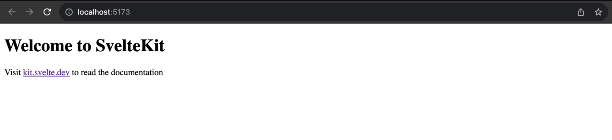

Статические сайты становятся все более популярными благодаря своей скорости, безопасности и простоте. Для создания статических сайтов существует несколько инструментов и фреймворков, но одним из них, быстро набирающим популярность, является SvelteKit.

В этом руководстве вы узнаете, как создать статический сайт с помощью SvelteKit, от настройки до развертывания на бесплатном хостинге статических сайтов Kinsta.

SvelteKit static site demo.

## Что такое SvelteKit?

SvelteKit - это надежный веб-фреймворк, предназначенный для создания пользовательских интерфейсов, в том числе статических сайтов. Он известен своей производительностью, простотой и возможностью создавать компоненты с помощью декларативного подхода.

SvelteKit расширяет возможности фреймворка Svelte, добавляя маршрутизацию, рендеринг на стороне сервера и многое другое.

## Начало работы с SvelteKit

Чтобы следовать этому руководству, мы предполагаем, что у вас есть:

Чтобы создать новое приложение SvelteKit, выполните следующие действия.

Создайте новый проект, выполнив:

```bash
npm create svelte@latest my-app
```

Эта команда создает новый проект в директории `my-app`, запрашивая настройку некоторых базовых инструментов, таких как TypeScript. Убедитесь, что вы выбрали опцию Skeleton project и измените `my-app` на предпочтительное имя для вашего проекта.

Перейдите в каталог проекта и установите его зависимости:

```bash
cd my-app npm install
```

Выполните `npm run dev`, чтобы запустить локальный сервер разработки на `localhost:5173`.

Скелетный сайт SvelteKit.  
Понимание структуры файлов SvelteKit

Когда вы откроете свой проект в редакторе кода, вы увидите следующую структуру. Понимание этой структуры очень важно, так как она поможет вам эффективно организовать код.

`/ |-- /src |-- /lib |-- /routes |-- +page.svelte |-- app.html |-- /static |-- svelte.config.js`.

- /src: Это сердце вашего проекта, содержащее различные подкаталоги и файлы:

- /lib: В этом каталоге хранятся пользовательские библиотеки, утилиты или модули. Это хорошее место для хранения многократно используемого кода, который может быть использован во всем приложении.
- /routes: Каталог routes очень важен для определения различных страниц или представлений в вашем приложении. Каждая страница представлена файлом .svelte, например +page.svelte. Эти файлы .svelte содержат компоненты, логику и стили, характерные для данной страницы.
- app.html: Этот файл служит точкой входа в ваше приложение. В нем задается основная структура веб-страницы.

- /static: Этот каталог используется для хранения статических активов, таких как активы/изображения, шрифты или любые файлы, которые не нуждаются в обработке вашим приложением. На эти активы можно напрямую ссылаться в HTML и компонентах Svelte.  
  svelte.config.js: Этот файл конфигурации позволяет настраивать различные аспекты вашего проекта SvelteKit. Вы можете использовать его для настройки рендеринга на стороне сервера, определения пользовательских макетов и т. д.

## Маршрутизация в SvelteKit

Одной из отличительных особенностей SvelteKit является система маршрутизации. Она основана на файловой системе, где пути URL определяются файлами и папками в каталоге src/routes, что делает ее интуитивно понятной и простой в управлении.

В SvelteKit каждый файл, соответствующий маршруту, должен иметь имя +page.svelte. Например, индексный файл для вашего сайта SvelteKit находится в папке routes и называется +page.svelte.

Добавьте в этот файл следующий код, чтобы создать главную страницу:

```js
<!-- src/routes/+page.svelte -->
<div class="home_hero">
  <!-- Heading -->
  <h1>Наслаждайтесь хостингом статических сайтов</h1>

  <style>
    /* Styling for the hero section */
    .home_hero {
      display: flex;
      justify-content: center;
      align-items: center;
      flex-direction: column;
      text-align: center;
    }

    /* Styling for the heading */
    .home_hero h1 {
      font-size: 60px;
      width: 70%;
    }

    /* Styling for the paragraph */
    .home_hero p {
      color: #6e7076;
      font-size: 20px;
    }

    /* Styling for the button */
    .btn {
      background-color: #5333ed;
      padding: 20px 30px;
      margin-top: 40px;
      border-radius: 5px;
      color: #fff;
    }

    /* Media query for smaller screens */
    @media (max-width: 700px) {
      .home_hero h1 {
        font-size: 40px;
      }

      .home_hero p {
        font-size: 16px;
      }
    }
  </style>
</div>
```

Чтобы создать вложенный маршрут в SvelteKit, например, страницу о сайте, доступную по адресу `localhost:5173/about`, вам нужно создать папку в папке routes с именем, представляющим путь к URL. В этой папке создайте файл +page.svelte, который будет отображаться для маршрута.

Добавьте следующий код в routes/about/+page.svelte:

```js
<div class="about_cont">
  <!-- About section title -->
  <h2>About</h2>
  <div class="about_info">
    <div class="about_text">
      <!-- First paragraph -->

        Kinsta позволяет вам{' '}
        <a> href="https://kinsta.com/docs/static-site-hosting/">разместить до 100 статических сайтов </a>
        {' '}
        бесплатно. Это можно сделать, разместив свой код на выбранном вами Git-провайдере (Bitbucket, GitHub или GitLab), а затем развернув его на Kinsta.

      <!-- Second paragraph -->

        В качестве альтернативы хостингу статических сайтов вы можете выбрать развертывание статического сайта с помощью Kinsta's{' '}
        <a> href="https://kinsta.com/application-hosting/">приложение Hosting </a>,
        что обеспечивает большую гибкость хостинга, более широкий спектр преимуществ и доступ к более надежным функциям. Например, масштабируемость, настраиваемое развертывание с помощью Dockerfile и комплексная аналитика, охватывающая данные в реальном времени и за прошлые периоды.

    </div>
    <iframe width="560" height="315" src="https://www.youtube.com/embed/H7CNbsda8OA?si=40FGVlNvJ74_6hlj" title="Видеоплеер YouTube" frameborder="0" allow="акселерометр; autoplay; clipboard-write; encrypted-media; gyroscope; picture-in-picture; web-share" allowfullscreen></iframe>
  </div>
</div>

<style>
  /* About container styles */
  .about_cont h2 {
    font-size: 40px;
    margin-bottom: 20px;
  }

  /* About info styles */
  .about_info {
    display: flex;
    width: 100%;
    justify-content: space-between;
    gap: 20px;
  }

  /* Responsive styles for smaller screens */
  @media (max-width: 700px) {
    .about_info {
      flex-direction: column;
    }
  }

  /* About text styles */
  .about_text {
    flex-basis: 50%;
  }

  /* Paragraph styles */
  .about_text p {
    margin-bottom: 20px;
    font-size: 18px;
  }

  /* About image styles */
  .about_img {
    flex-basis: 50%;
    width: 200px;
    border-radius: 10px;
  }

  /* Responsive styles for smaller screens */
  @media (max-width: 700px) {
    .about_info {
      flex-direction: column;
    }
    .about_img {
      width: 100%;
    }
  }
</style>
```

Любой стиль, добавленный в ваш компонент Svelte, является ограниченным и не влияет на другие компоненты.

Важно понимать, что SvelteKit управляет навигацией между страницами с помощью стандартных элементов `<a>`, что делает процесс навигации интуитивно понятным. Нет необходимости импортировать дополнительные компоненты вроде `<Link>`, как это требуется в React. В следующем разделе мы создадим компонент Navigation, который будет добавляться на каждую страницу.

Для текущего проекта структура маршрута выглядит следующим образом:

`|-- /src |-- /routes |-- /about |-- +page.svelte |-- +page.svelte`

## Использование компонентов в SvelteKit

Чтобы сделать свой код более модульным, вы можете создавать компоненты и импортировать их на свои страницы. Например, вы можете создать компонент Navbar.svelte в папке routes:

```js
<!-- src/routes/Navbar.svelte -->
<!-- This is the navigation bar component -->
<nav>
  <!-- Logo -->
  <a href="https://kinsta.com/">
    
  </a>

  <!-- Navigation links -->
  <div class="nav-links">
    <a href="https://kinsta.com/">Home</a>
    <a href="http://kinsta.com/about">About</a>
    <a href="http://kinsta.com/posts">Posts</a>
  </div>
</nav>
```

Затем импортируйте его на домашнюю страницу +page.svelte следующим образом:

```js
<!-- src/routes/+page.svelte -->
<script>
  // Import the Navbar component
  import Navbar from './Navbar.svelte'
</script>

<!-- Render the Navbar component -->
<Navbar />

<!-- Home hero section -->
<div class="home_hero">
  <!-- Heading -->
  <h1>Enjoy Static Site Hosting With Kinsta.</h1>

  <!-- Subheading -->
  Быстрый, безопасный, надежный хостинг.

  <!-- Link to read more -->
  <a href="https://kinsta.com/static-site-hosting">
    <!-- Button -->
    <div class="btn">Читать подробнее</div>
  </a>
</div>

<style>
  /* CSS styles */
</style>
```

Для глобальных компонентов, таких как `Navbar` и `Footer`, которые используются в нескольких файлах, создавайте их в папке src/lib, чтобы избежать длинных путей импорта. Когда вы создаете компоненты или модули в папке lib, вы можете удобно импортировать их в любой компонент с помощью псевдонима `$lib` import:

`<script> import Navbar from '$lib/Navbar.svelte' </script>`.

Чтобы использовать отдельные компоненты, например, предположим, что вам нужен компонент только для страницы About, создайте его в маршруте routes/about, а затем импортируйте его на страницу.

Для этого проекта вы также можете создать компонент `Footer` в папке lib и добавить этот код:

```js
<div class="footer">
    <!-- Footer section -->
     Hosted with ❤️ by Kinsta's{' '}
        <!-- Link to Kinsta's static site hosting -->
        <a href="https://kinsta.com/static-site-hosting">Статический хостинг сайтов</a>

</div>
```

Затем импортируйте его на все страницы.

## Использование макета в SveletKit

Чтобы избежать импорта компонентов на многие страницы, SvelteKit позволяет определять макеты для страниц с помощью файлов +layout.svelte.

Создать макет, который будет применяться к каждой странице, очень просто. Создайте файл с именем src/routes/+layout.svelte и настройте в нем нужную разметку, стили и поведение. Важнейшим требованием является включение элемента для размещения содержимого страницы.

Например, вы можете интегрировать компоненты `Navbar` и `Footer` в этот макет:

```js
<<script>
  // Import the Navbar component from '$lib/Navbar.svelte'
  import Navbar from '$lib/Navbar.svelte';

  // Import the Footer component from '$lib/Footer.svelte'
  import Footer from '$lib/Footer.svelte';
</>

<div class="layout">
  <Navbar /> <!-- Render the Navbar component -->
  <slot /> <!-- Render the content between the Navbar and Footer components -->
  <Footer /> <!-- Render the Footer component -->
</div>
```

Элемент `<slot>` позволяет вставлять в макет содержимое каждой страницы.

Макеты также могут быть вложенными для определенных страниц. Например, если у вас есть страница `/dashboard` с вложенными страницами `/profile` и `/settings`, вы можете создать специальный макет:

`|-- /dashboard |-- /profile |-- +page.svelte |-- /settings |-- +page.svelte |-- +layout.svelte`.

## Программная навигация в SvelteKit

SvelteKit предоставляет функцию `goto` для программной навигации. Например, для перехода на страницу `/dashboard` после выполнения действия входа в систему:

```js
<script>
  import { goto } from '$app/navigation';

  async function login() {
    // Perform login action
    goto('/dashboard');
  }
</script>
```

## Стилизация в SvelteKit

SvelteKit поддерживает традиционный CSS для стилизации страниц. Стили могут быть определены внутри компонентов Svelte с помощью тега `<style>`, или вы можете выбрать ссылку на внешние таблицы стилей.

Вы можете заметить, что для компонентов `Navbar` и `Footer` отсутствуют определенные стили. Чтобы решить эту проблему, рекомендуется применять глобальные стили.l стилизация. Этого можно добиться, создав CSS-файл в папке src и импортировав его в корневой файл макета.

Для лучшей организации создайте папку styles в каталоге src. В этой папке будут храниться все ваши стили. В рамках этого проекта создайте файл global.css в папке styles и добавьте в него следующий код:

```css
@import url('https://fonts.googleapis.com/css2?family=Poppins:wght@300;400;500&display=swap');

* {
	margin: 0;
	padding: 0;
	box-sizing: border-box;
}

body {
	background-color: #ddd;
	font-family: 'Poppins', sans-serif;
	width: 1200px;
	margin: 0 auto;
}

a {
	text-decoration: none;
}

img {
	width: 100%;
}

nav {
	display: flex;
	justify-content: space-between;
	height: 200px;
	align-items: center;
}

nav .logo-img {
	width: 100px;
}

nav .nav-links a {
	padding: 0 20px;
	font-size: 18px;
}

@media (max-width: 700px) {
	body {
		width: 100%;
		padding: 0 20px;
	}

	nav .nav-links a {
		padding: 0 18px;
	}
}

.footer {
	width: 100%;
	text-align: center;
	margin: 100px 0 20px;
}
```

Затем вы можете импортировать CSS-файл в файл макета, чтобы он стал глобальным и работал для всех файлов:

```js
<script>
	import Navbar from '$lib/Navbar.svelte'; import Footer from '$lib/Footer.svelte'; import
	'../styles/global.css';
</script>
```

## Загрузка данных с помощью SvelteKit

При работе с SvelteKit вам часто приходится загружать данные в макеты, страницы и компоненты. Эти данные могут поступать из внешних API, баз данных или с вашего локального сервера. Чтобы управлять этим, вы можете использовать файл +page.js для страниц и +layout.js для макетов.

В проекте SvelteKit файл +page.svelte может иметь дочерний файл +page.js, который экспортирует функцию load. Возвращаемое значение этой функции становится доступным для страницы через реквизит `data`. Рассмотрим пример: предположим, вы хотите создать маршрут для получения списка постов из JSON Placeholder API.

Чтобы загрузить данные из API, создайте файл +page.js в папке posts. Этот файл экспортирует функцию `load`.

```js
export const load = async () => {
	const greeting = 'Hello World';

	return {
		greeting,
	};
};
```

Ожидается, что функция `load` вернет объект, который предоставляется в качестве props файлу +page.svelte. К значению `title` можно получить доступ с помощью реквизита `data`:

```js
<script>
  export let data;
  const blogTitle = data.title;
</script>
<div class="blog-container">
  <h2>{blogTitle}</h2>
</div>
```

Теперь перейдем к взаимодействию с API JSON Placeholder posts. Для этого вы можете использовать JavaScript Fetch API, но SvelteKit предлагает свой собственный метод `fetch`, который вы можете использовать для получения данных из конечных точек API перед рендерингом страницы:

```js
export const load = async (loadEvent) => {
	const { fetch } = loadEvent;
	const response = await fetch('https://jsonplaceholder.typicode.com/posts?_limit=10');
	const posts = await response.json();

	return { posts };
};
```

В приведенном выше коде мы извлекаем метод `fetch` из `loadEvent` и выполняем API-запрос. Затем ответ отправляется в виде реквизита на страницу Posts, где в цикле отображаются все посты:

```js
<script>
  // Renamed variable for clarity
  export let data;
  const postList = data.posts;
</script>

<div class="blog_cont">
  <h2>Posts</h2>
  <div class="blog_grid">
    {#each postList as post}
      <!-- Replaced template literal with string concatenation -->
      <a href={"/posts/" + post.id} class="blog_card">
        <h3>{post.title}</h3>
        {post.body}
      </a>
    {/each}
  </div>
</div>

<style>
  .blog_cont h2 {
    font-size: 40px;
    margin-bottom: 20px;
  }

  .blog_grid {
    display: grid;
    grid-template-columns: 1fr 1fr 1fr;
    gap: 20px;
  }

  @media (max-width: 700px) {
    .blog_grid {
      grid-template-columns: 1fr;
    }
  }

  .blog_card {
    background-color: #bfbfbf;
    padding: 20px;
    border-radius: 5px;
    color: #000;
    transition: all 0.5s ease-in-out;
  }

  .blog_card:hover {
    background-color: #5333ed;
    color: #fff;
  }

  .blog_card h3 {
    margin-bottom: 15px;
  }

  .blog_card p {
    margin-bottom: 15px;
  }
</style>
```

Вот как выглядит текущее дерево файлов:

`|-- /src |-- /lib |-- Footer.svelte |-- Navbar.svelte |-- /routes |-- /about |-- +page.svelte |-- /posts |-- +page.js |-- +page.svelte |-- +page.svelte |-- +layout.svelte |-- /styles |-- global.css`.

## Динамическая маршрутизация с помощью SvelteKit

Теперь на странице сообщений отображается 10 постов; если вы хотите создать отдельную страницу для каждого поста, лучший способ сделать это - создать динамический маршрут.

Для этого вам нужно получить значение slug из маршрута и использовать его в качестве параметра для запроса поста. В SvelteKit это можно сделать, создав папку с именем параметра в квадратных скобках. Вот как можно настроить страницы отдельных постов:

Создайте папку \[postid\] в папке posts. Папка \[postid\] представляет собой динамический параметр, который может содержать такие значения, как ID постов или slugs.  
В папке \[postid\] создайте два файла:

+page.svelte: Этот файл будет определять макет и структуру страниц ваших отдельных постов.  
+page.js: Этот файл JavaScript будет обрабатывать данные и логику, характерные для отдельных постов.

В файле +page.js получите параметр `postid` из маршрута и используйте его для запроса конкретного поста:

```js
export const load = async (loadEvent) => {
	const { fetch, params } = loadEvent;
	const { postId } = params;
	const url = `https://jsonplaceholder.typicode.com/posts/${postId}`;

	const response = await fetch(url);
	const post = await response.json();

	return { post };
};
```

Затем вы можете получить доступ к `data` как к реквизиту в файле +page.svelte:

```js
<script>
  let postData;
</script>

<div>
  <div class="blog_content">
    <h3>{postData.title}</h3>
    {postData.body}
  </div>
</div>

<style>
  .blog_content h3 {
    font-size: 40px;
    margin-bottom: 20px;
    text-align: center;
  }
</style>
```

Полный исходный код проекта SvelteKit можно посмотреть на GitHub. Вы также можете ознакомиться с официальной документацией SvelteKit для получения дополнительной информации.

## Развертывание статических сайтов SvelteKit с помощью Kinsta

Kinsta позволяет бесплатно разместить до 100 статических сайтов непосредственно у выбранного вами Git-провайдера (Bitbucket, GitHub или GitLab).

Прежде чем приступить к размещению сайта SvelteKit, важно настроить его в соответствии с целью развертывания. В данном конкретном проекте мы используем хостинг статических сайтов Kinsta, для чего необходимо настроить SvelteKit как генератор статических сайтов (SSG).

Вот как получить сайт, предварительно отрендеренный как набор статических файлов:

Установите @sveltejs/adapter-static, выполнив следующую команду:

```bash
npm i -D @sveltejs/adapter-static
```

Далее адаптируйте файл svelte.config.js, заменив `adapter-auto` на `fallback` к `404.html`:

```js
import svelteAdapter from '@sveltejs/adapter-static';

// Configuration object for Svelte kit
const config = {
	kit: {
		adapter: svelteAdapter({ fallback: '404.html' }), // Using the Svelte adapter with fallback
	},
};

export default config;
```

Теперь разместите коды на выбранном вами Git-провайдере. Далее выполните следующие шаги для развертывания статического сайта на Kinsta:

- Войдите в систему или создайте учетную запись для просмотра панели MyKinsta.
- Авторизуйте Kinsta с помощью вашего Git-провайдера.
- Нажмите Статические сайты на левой боковой панели, затем нажмите Добавить сайт.
- Выберите репозиторий и ветку, из которой вы хотите развернуть сайт.
- Присвойте сайту уникальное имя.
- Добавьте настройки сборки в следующем формате:

Команда сборки: `npm run build`.
Версия Node: `18.16.0`
Каталог публикации: `build`

Наконец, нажмите кнопку Создать сайт.

Вот и все! Теперь у вас есть развернутый сайт в течение нескольких секунд. Для доступа к развернутой версии сайта предоставляется ссылка. При желании вы можете позже добавить свой собственный домен и SSL-сертификат.

В качестве альтернативы хостингу статических сайтов вы можете развернуть свой статический сайт в хостинге приложений Kinsta, который обеспечивает большую гибкость хостинга, более широкий спектр преимуществ и доступ к более надежным функциям. Например, масштабируемость, настраиваемое развертывание с помощью Dockerfile и всесторонняя аналитика, включающая данные в реальном времени и за прошлые периоды.

## Резюме

В этом руководстве мы описали процесс создания статического сайта с помощью SvelteKit. Начиная с настройки среды разработки и заканчивая развертыванием, вы теперь обладаете знаниями, позволяющими легко создавать высокопроизводительные статические сайты.

Создание статических сайтов с помощью SvelteKit - это идеальное сочетание производительности и простоты, благодаря которому ваши веб-проекты будут блистать в Интернете.

Пришло время применить полученные знания на практике и начать создавать свой собственный статический сайт с помощью SvelteKit. Вы уже использовали SvelteKit в прошлом? Не стесняйтесь делиться своими проектами и опытом в разделе комментариев ниже.
