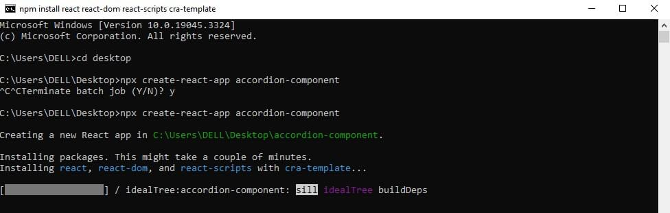

В этой статье мы используем все возможности React.js для создания компонента аккордеона - устройства пользовательского интерфейса, которое часто используется в веб- и мобильных приложениях для расположения и отображения контента удобным и компактным способом.

Чтобы получить максимальную пользу от этой статьи, вам понадобится следующее:

В следующем видео показан готовый компонент аккордеона.

## Настройка проекта

Мы будем использовать React.js для создания нашего компонента аккордеона. Чтобы использовать React.js, нам нужно создать среду React, и мы сделаем это через командную строку.

Откройте приложение терминала и перейдите на рабочий стол (или в другое место, если хотите). Затем выполните следующую команду, чтобы создать приложение React:

```bash
npx create-react-app accordion-component
```

После установки пакетов мы увидим нечто подобное изображению ниже.



Теперь, если мы проверим папку нашего проекта, мы найдем папку с именем `/accordion-component/` со всеми установленными пакетами.

## Структура папки

Откройте новую папку `/accordion-component/` в редакторе кода. Также откройте приложение React в браузере. Мы можем сделать это через встроенный терминал в нашем редакторе кода, набрав команду `npm run start` для запуска приложения в браузере.

Примечание: если вы используете Visual Studio, вы можете использовать сочетание клавиш (ctrl + shift + \`), чтобы открыть терминал. Если в вашем редакторе кода нет встроенного терминала, вы можете просто запускать команды в командной строке приложения).

Далее давайте отредактируем ненужные файлы и блоки кода, которые будут мешать выполнению нашего приложения. Во-первых, откройте файл `App.js` и удалите весь элемент заголовка, который обернут в элемент `<div>` с именем класса `App`, так что теперь у нас есть пустой элемент `<div>`. Затем откройте файлы `App.css` и `index.css` и удалите содержимое обоих файлов. (Если вы еще раз просмотрите веб-страницу, то увидите, что она стала пустой, а это как раз то, что нам сейчас нужно).

Далее создадим новую папку `/AccordionComponent/` в директории `/src/`. Внутри папки /`AccordionComponent/` создайте файл `Accordion.js` для компонентов и еще один файл `AccordionData.js` для хранения текста, который будет использоваться для нашего аккордеона. Затем перейдите в файл `App.js` и импортируйте файл `Accordion.js`. После того как файл импортирован, мы отображаем его внутри элемента `<div>` следующим образом:

```js
import './App.css';
import Accordion from './AccordionComponent/Accordion';

/**
 * The main function that renders the App component.
 * @returns {JSX.Element} The rendered App component.
 */
function App() {
	return (
		<div className="App">
			{/* Renders the Accordion component */}
			<Accordion />
		</div>
	);
}

export default App;
```

После этого перейдите в файл `Accordion.js` и создайте компонент под названием `AccordionItem`. Внутри ключевого слова `return` мы создадим элемент заголовка с “Accordion” в качестве содержимого (`<h1>Accordion</h1>`), а под ним еще один компонент под названием `Accordion`. После этого мы рендерим наш компонент `AccordionItem` внутри основного `Accordion`, убедившись, что рендеримый компонент обернут в элемент `<div>` с именем класса `container`. Затем мы экспортируем основной компонент `Accordion`. Теперь у нас есть что-то вроде этого:

```javascript
import React from 'react';

// Define a reusable component for each item in the Accordion
const AccordionItem = () => {
	return <h1>Accordion</h1>;
};

// Define the Accordion component
const Accordion = () => {
	return (
		<div>
			{/* Render the AccordionItem component */}
			<AccordionItem />
		</div>
	);
};

// Export the Accordion component as the default export
export default Accordion;
```

Если мы просмотрим нашу веб-страницу, то увидим на экране наш заголовок.

Далее мы создадим массив объектов, содержащих текст вопросов и ответов, в файле `AccordionData.js`. Храня данные аккордеона в массиве объектов, мы обеспечиваем динамическое хранение данных и многоразовое использование компонента аккордеона. Ниже приведены данные аккордеона. Вы можете скопировать и вставить их в свой файл `AccordionData.js` напрямую:

```javascript
/**
 * An array of objects representing questions and answers.
 */
const data = [
	{
		Вопрос: 'Что такое компоненты аккордеона?',
		Ответ:
			'Компоненты аккордеона - это элементы пользовательского интерфейса, используемые для организации и представления содержимого в свернутом виде. Обычно они состоят из заголовка, содержимого и действия раскрытия/свертывания.',
	},
	{
		вопрос: 'Для чего они используются?',
		ответ:
			'Они обычно применяются в различных контекстах, включая FAQ, описания продуктов, навигационные меню, панели настроек и таблицы данных, чтобы сэкономить место на экране и обеспечить структурированный и удобный интерфейс для представления информации или опций.',
	},
	{
		вопрос: 'Аккордеон как музыкальный инструмент',
		ответ:
			'Аккордеон - это музыкальный инструмент с клавиатурой и сильфоном. Он издает звук за счет прохождения воздуха через язычки, когда игрок расширяет или сжимает мехи, используется в различных музыкальных жанрах.',
	},
	{
		вопрос: 'Могу ли я создать компонент аккордеона с помощью другого фреймворка?',
		ответ:
			'Да, конечно, это очень возможно, создать компонент аккордеона с помощью другого фреймворка.',
	},
];

export default data;
```

В приведенном выше коде у нас есть массив объектов, содержащих данные, которые будут отображаться в нашем компоненте аккордеона. Свойство `question` содержит текст вопроса или заголовка, асвойство `answer` содержит ответ или содержимое, которое появляется при нажатии или раскрытии вопроса. Убедитесь, что компонент импортирован в файл `Accordion.js`. Это все для файла `AccordionData.js`.

## Макет компонента аккордеона

Давайте создадим макет нашего компонента аккордеона.

Сначала нам нужно установить `react-icons` в наш проект из реестра npm:

```bash
npm install react-icons
```

Нам также нужно импортировать хуки `useState` и `useRef`. Мы можем сделать это, вставив следующее в верхнюю часть файла:

```javascript
import React, { useRef, useState } from 'react';
```

HTML-структура будет выведена внутри компонента `AccordionItem`. Мы передадим четыре реквизита в компонент `AccordionItem`: `question`, `answer`, `isOpen` и `onClick`.

Давайте разделим реквизиты, чтобы понять, для чего они будут нужны:

`question`. Этот реквизит представляет собой текст или содержимое для части вопроса элемента аккордеона.  
`answer`. Этот реквизит представляет собой текст или содержимое для части ответа элемента аккордеона.  
`isOpen`. Этот реквизит представляет собой булево значение, указывающее, открыт (развернут) или закрыт (свернут) элемент аккордеона в данный момент. Он определяет, является ли содержимое ответа видимым или скрытым.  
`onClick`. Этот параметр представляет собой функцию обратного вызова, которая выполняется, когда пользователь взаимодействует с элементом аккордеона. Обычно она используется для переключения состояния `isOpen`, когда пользователь нажимает на элемент, чтобы развернуть или свернуть его.

## Тело AccordionComponent

В верхней части файла `Accordion.js` обязательно импортируйте значок стрелки из пакета react-icons, как показано ниже:

```javascript
import { RiArrowDropDownLine } from 'react-icons/ri';
```

Это будет структура одного элемента аккордеона:

```javascript
/**
 * AccordionItem component represents an item in an accordion.
 *
 * @param {string} question - The question to be displayed in the accordion item.
 * @param {string} answer - The answer to the question.
 * @param {boolean} isOpen - Indicates whether the accordion item is currently open.
 * @param {function} onClick - The function to be called when the accordion item is clicked.
 */
const AccordionItem = ({ question, answer, isOpen, onClick }) => {
  const contentHeight = useRef();

  return (
    <div className="wrapper">
      <button
        className={`question-container ${isOpen ? 'active' : ''}`}
        onClick={onClick}
      >
        <p className='question-content'>{question}
        <RiArrowDropDownLine
          className={`arrow ${isOpen ? 'active' : ''}`}
        />
      </button>
      <div
        ref={contentHeight}
        className="answer-container"
        style={isOpen ? { height: contentHeight.current.scrollHeight } : { height: "0px" }}
      >
        <p className="answer-content">{answer}
      </div>
    </div>
  );
}
```

В этом фрагменте кода элемент аккордеона находится внутри родительского `<div>` с именем класса `wrapper`. Такая структура позволяет отображать вопрос и ответ на него в свернутом виде.

Мы храним наш хук `useRef` в переменной `contentHeight`, чтобы его можно было передать в атрибут `ref` нашего элемента `answer-container`. Мы делаем это для того, чтобы иметь возможность динамически регулировать высоту контейнера в зависимости от высоты прокрутки содержимого ответа.

## Давайте разберем структуру кода

Элемент Button (`<button>`). Это интерактивная часть элемента аккордеона, на которую пользователи нажимают, чтобы переключить видимость ответа. Он имеет имя класса `question-container`. Имя класса условно устанавливается в `active`, если параметр `isOpen` равен true, что используется для изменения стиля кнопки, когда ответ открыт.

Содержимое вопроса. Содержимое вопроса состоит из элемента ``с классом`question-content`. Текст вопроса берется из реквизита question.

Значок стрелки (`<RiArrowDropDownLine />`). Справа от вопроса отображается значок стрелки, используемый для переключения. Имя класса условно устанавливается в `active`, если параметр `isOpen` равен true, что может быть использовано для поворота или другого стиля стрелки, когда ответ открыт.

Ответ div. После `<button>` находится элемент `<div>` с именем класса `answer-container`. Этот div имеет атрибут `ref`, установленный на переменную `contentHeight`, что позволяет ему измерять свою `scrollHeight`. Атрибут style используется для динамической установки высоты этого контейнера в зависимости от того, открыт или закрыт элемент. Если `isOpen` равен true, его высота будет равна `scrollHeight` его содержимого, что сделает ответ видимым. Если `isOpen` равен false, его высота будет равна `0px`, скрывая содержимое ответа.

Содержимое ответа. Содержимое ответа состоит из элемента ``с классом`answer-content`. Текст ответа берется из реквизита ответа.

## Стилизация нашего компонента аккордеона

Теперь, когда мы закончили с разметкой, давайте придадим стиль нашему компоненту аккордеона. Стиль можно найти в блоке кода ниже:

```css
/* Reset default styles */
* {
	padding: 0;
	margin: 0;
	box-sizing: border-box;
}

/* Set background color for the body */
body {
	background-color: #f2f2f2;
}

/* Set container styles */
.container {
	max-width: 650px;
	width: 100%;
	position: absolute;
	top: 50%;
	left: 50%;
	transform: translate(-50%, -50%);
}

/* Set wrapper styles */
.wrapper {
	border-bottom: 1px solid black;
	overflow: hidden;
}

/* Set question container styles */
.wrapper .question-container {
	width: 100%;
	text-align: left;
	padding: 20px 10px;
	display: flex;
	align-items: center;
	justify-content: space-between;
	font-weight: 500;
	font-size: 20px;
	background: transparent;
	border: none;
	cursor: pointer;
}

/* Set active state for question container */
.question-container.active {
	color: #1db954;
	background-image: linear-gradient(90deg, transparent, rgba(0, 0, 0, 0.04), transparent);
}

/* Set hover state for question container */
.wrapper .question-container:hover {
	background-image: linear-gradient(90deg, transparent, rgba(0, 0, 0, 0.04), transparent);
}

/* Set arrow styles */
.wrapper .arrow {
	font-size: 2rem;
	transition: 0.5s ease-in-out;
}

/* Set active state for arrow */
.arrow.active {
	rotate: 180deg;
	color: #1db954;
}

/* Set answer container styles */
.wrapper .answer-container {
	padding: 0 1rem;
	transition: height 0.7s ease-in-out;
}

/* Set answer content styles */
.wrapper .answer-content {
	padding: 1rem 0;
	font-size: 20px;
	font-style: italic;
}
```

В результате приведенной выше стилизации у нас появился контур нашего `accordionItem`. Теперь давайте импортируем данные из нашего файла `AccordionData` и объявим основные функции нашего компонента аккордеона. Мы сделаем это внутри основного компонента `Accordion`.

## Структура основного компонента аккордеона

Приведенный ниже код определяет функциональный компонент с именем `Accordion`:

```javascript
/**
 * Accordion component that displays a list of items in an accordion format.
 */
const Accordion = () => {
	const [activeIndex, setActiveIndex] = useState(null);

	/**
	 * Handles the click event on an accordion item.
	 * Toggles the activeIndex state to expand or collapse the item.
	 *
	 * @param {number} index - The index of the clicked item.
	 */
	const handleItemClick = (index) => {
		setActiveIndex((prevIndex) => (prevIndex === index ? null : index));
	};

	return (
		<div className="container">
			{data.map((item, index) => (
				<AccordionItem
					key={index}
					question={item.question}
					answer={item.answer}
					isOpen={activeIndex === index}
					onClick={() => handleItemClick(index)}
				/>
			))}
		</div>
	);
};

export default Accordion;
```

Цель этого компонента - создать интерфейс в стиле аккордеона, который отображает список элементов, каждый из которых состоит из вопроса и соответствующего ему ответа. Пользователь может щелкнуть на вопросе, чтобы развернуть или свернуть его ответ. Давайте разберем код по шагам.

`const [activeIndex, setActiveIndex] = useState(null);`. Эта строка устанавливает часть состояния компонента с помощью хука `useState`. `activeIndex` представляет собой индекс текущего активного (открытого) элемента аккордеона, или `null`, если ни один элемент не открыт. `setActiveIndex` - это функция, используемая для обновления этого состояния.

`const handleItemClick = (index) => { ... }`. Функция `handleItemClick` отвечает за обработку нажатий на элементы аккордеона. Она принимает параметр `index`, который представляет собой индекс элемента, на котором был сделан щелчок.

Внутри функции вызывается функция `setActiveIndex`, которая переключает состояние `activeIndex`. Если индекс щелкнутого элемента (`index`) совпадает с текущим активным индексом (`prevIndex`), то функция устанавливает `activeIndex` в `null`, эффективно закрывая элемент. Если они не совпадают, он устанавливает `activeIndex` в индекс щелкнутого элемента, открывая его.

Такой подход гарантирует, что одновременно может быть открыт только один элемент аккордеона, потому что если мы открываем один элемент аккордеона, то закрываются все ранее открытые элементы аккордеона.

Оператор `возврата`. Этот компонент возвращает JSX, определяющий структуру интерфейса аккордеона. Крайний `<div>` с именем класса `container` является контейнером для всех элементов аккордеона.

`{data.map((item, index) => ( ... ))}`. Этот код отображает массив `data`, который извлекается из файла `AccordionData.js`. Для каждого элемента в массиве `data` создается компонент `AccordionItem`. Свойство `key` устанавливается в `index`, чтобы гарантировать, что каждый элемент имеет уникальный ключ для оптимизации рендеринга React.

Компоненту `AccordionItem` передаются реквизиты `question`, `answer`, `isOpen` и `onClick`. Реквизиты `question` и `answer` содержат текст, который будет отображаться для каждого элемента. Реквизит `isOpen` принимает значение `true`, если индекс элемента совпадает с текущим активным индексом (что указывает на то, что он должен быть открыт), а реквизит `onClick` представляет собой функцию обратного вызова, которая запускает функцию `handleItemClick` при нажатии на элемент.

`export default Accordion;`. Эта строка экспортирует компонент `Accordion`, чтобы его можно было импортировать и использовать в других частях нашего приложения. Ранее мы отобразили компонент в нашем файле `App.js`.

В общем, компонент `Accordion` управляет состоянием активного в данный момент элемента аккордеона и использует это состояние для управления поведением при открытии и закрытии. Он динамически генерирует список компонентов `AccordionItem` на основе полученных данных, позволяя пользователям взаимодействовать с интерфейсом аккордеона, нажимая на каждый из вопросов, чтобы раскрыть или скрыть их ответы.

## Наш готовый продукт

Теперь у нас есть красивый и полностью функциональный компонент аккордеона! 🥳 🎉

## Заключение

В этой статье мы рассмотрели, как использовать React.js для создания динамичного и удобного компонента аккордеона. Аккордеоны - это распространенный элемент пользовательского интерфейса для аккуратной организации и отображения контента.

Мы начали с создания проекта React, организации компонента и его стилизации для придания законченного вида. Затем мы занялись внутренним устройством системы, включая управление состояниями и взаимодействие с пользователями. Кроме того, для масштабируемости и повторного использования мы рассмотрели концепцию хранения данных аккордеона в другом файле.

Надеемся, теперь вы хорошо понимаете, как разработать многофункциональный компонент аккордеона с помощью React.js. Счастливого кодинга!
