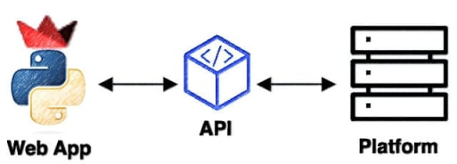
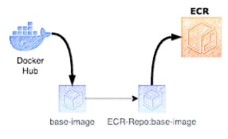
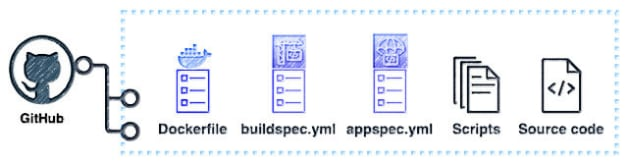
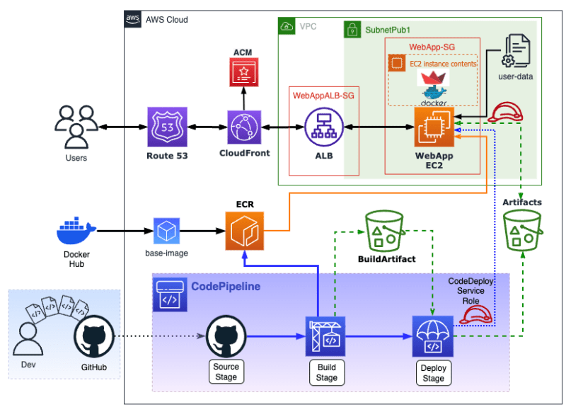
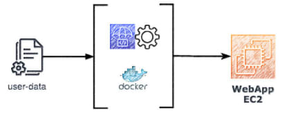
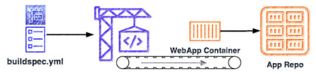
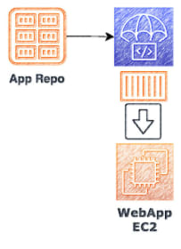
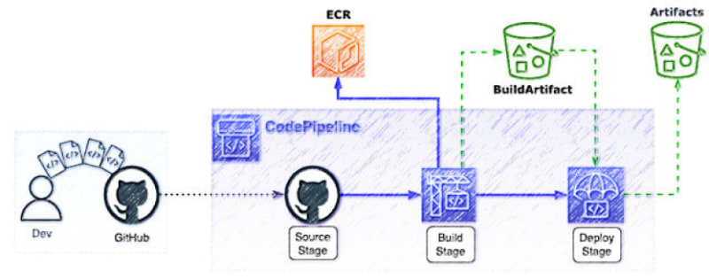

Мне нужна была функция, которой не было в используемой мной торговой платформе, поэтому я создал ее в виде микросервиса на базе Web App API. Чтобы добиться этого, я сначала прочитал документацию по API платформы, чтобы собрать необходимые параметры.

Затем я начал создавать приложение, создав версию CLI с помощью Python. Чтобы убедиться в работоспособности каждого параметра API, я протестировал их по отдельности в демонстрационной среде, а затем протестировал все приложение в предпроизводственной среде.

Недавно я наткнулся на несколько семинаров по искусственному интеллекту, в которых использовался фреймворк Streamlit для создания простых приложений для черчения. Учитывая простоту использования Streamlit, я решил построить версию торгового веб-приложения с использованием Sreamlit в качестве микросервиса.

В этом сценарии связь между фронтендом и бэкендом осуществляется через API, фронтендом является веб-приложение, а бэкендом - торговая платформа.

## Приложение Streamlit

Streamlit - это фреймворк приложений с открытым исходным кодом, написанный на Python. Он похож на Flask и используется для быстрого и простого создания простых веб-приложений. Хотя он обычно используется для проектов, связанных с машинным обучением и наукой о данных, он отлично работает с основными библиотеками Python и может включать HTML-код или markdown, что делает его отличным выбором для создания простых приложений.  
Будучи новичком в Streamlit, я использовал GenAI для преобразования моего кода на Python в код Streamlit. Мне не потребовалось много времени, чтобы создать функциональное веб-приложение. Затем я тестировал и рефакторил приложение, пока не достиг финальной версии.

## Создание микросервиса

На этапе подготовки к созданию микросервиса веб-приложения я сначала создал ECR-репозиторий под названием ‘webapp-base-image’ для хранения базового образа контейнера. Затем я поместил в него базовый образ Docker (python:3.10-slim-buster). Затем я создал еще один ECR-репозиторий для хранения образа контейнера Web App.

После этого я создал репозиторий GitHub и поместил исходный код и артефакты в каталог репозитория. Затем я создал Dockerfile, необходимый для сборки контейнера Web App. Наконец, чтобы построить конвейер CICD с помощью CodePipeline, я создал ‘buildspec.yml’ для CodeBuild и ‘appspec.yml’ для CodeDeploy.

Важно отметить, что использование и содержание этих файлов зависит от выбранного вычислительного сервиса.

Ниже перечислены доступные варианты вычислений на AWS для развертывания контейнера, каждый из которых потребует различных процедур и незначительных изменений в конфигурации.

- AWS App Runner (самый быстрый вариант, но ограничивает контроль над инфраструктурой)
- Fargate (бессерверный контейнерный сервис)
- Экземпляр EC2 (вычислительный сервис с большим контролем, но требует обслуживания ОС/приложений)

После того как исходный код, артефакты и файлы конфигурации были добавлены в репозиторий веб-приложения, образ контейнера был готов к развертыванию. Я развернул контейнер на бесплатном уровне экземпляра EC2, как описано в следующем этапе.

## Создание ресурсов

Для создания и развертывания веб-приложения я сначала создал необходимые ресурсы, используя экземпляр EC2 в качестве хоста, Application Load Balancer для развязки TLS-соединения с экземпляром EC2 и обеспечения балансировки нагрузки для будущего масштабирования, проект Build для упаковки и сборки контейнера с помощью CodeBuild, приложение CodeDeploy для развертывания контейнера на экземпляре EC2 и, наконец, CodePipeline для запуска конвейера CICD.

После этого я создал остальные ресурсы, необходимые для доступа к веб-приложению через Интернет, включая дистрибутив CloudFront и запись зоны хостинга Route 53.

В одной из следующих статей блога я расскажу, как оптимизировать это решение, чтобы улучшить масштабируемость и сделать его более экономичным.

Далее приведены шаги, необходимые для реализации этого решения.

## Реализация

Мы рассмотрим шаги, необходимые для создания и развертывания контейнера Web App.

## Шаг 1: Создайте реестр и базовый образ контейнера Amazon Elastic Container

Сначала мы создадим репозиторий ECR для хранения базового образа, возьмем образ из Docker Hub, а затем поместим его в репозиторий ECR.  
После этого мы создадим еще один репозиторий ECR для хранения образа контейнера Web App.

### Шаг 1a: Создание ECR-репозитория для базового образа

Выполните следующую команду aws для создания ECR-репозитория:

`aws ecr create-repository --repository-name webapp-base-image --image-tag-mutability MUTABLE`.

### Шаг 1b: Создание базового изображения

Установите переменную Env на вашей машине

`export AWS_ACCOUNT_ID=YourAWS-ID export AWS_DEFAULT_REGION=AWS-Region export ECR_PYTHON_URL="$AWS_ACCOUNT_ID.dkr.ecr.$AWS_DEFAULT_REGION.amazonaws.com/webapp-base-image"`.

`aws ecr get-login-password --region $AWS_DEFAULT_REGION | docker login --username AWS --password-stdin "$AWS_ACCOUNT_ID.dkr.ecr.$AWS_DEFAULT_REGION.amazonaws.com"`

Извлеките образ из Docker Hub

`docker pull python:3.10-slim-buster`

`docker tag python:3.10-slim-buster $ECR_PYTHON_URL:3.10-slim-buster`

Передача изображения в хранилище ECR

`docker push $ECR_PYTHON_URL:3.10-slim-buster`

### Шаг 1c: Создайте ECR-репозиторий для образа контейнера веб-приложения

Выполните следующую команду aws для создания репозитория ECR:

`aws ecr create-repository --repository-name webapp --image-tag-mutability MUTABLE`.

## Шаг 2: Создайте репозиторий GitHub

Нам нужно создать новый репозиторий GitHub для веб-приложения. После этого вы можете клонировать репозиторий на локальной машине и переместить исходный код и артефакты в корневой каталог репозитория.

### Шаг 2a: Создайте файл Python requirements.txt

Далее необходимо создать файл Python requirements.txt, который будет включать streamlit и другие необходимые пакеты и библиотеки для вашего веб-приложения.

`$ touch requirements.txt $ echo 'streamlit' > requirements.txt`

### Шаг 2b: Создание Dockerfile

Затем создайте Dockerfile, аналогичный следующему

`# app/Dockerfile # используем ссылку на базовый образ ECR-репо FROM [YourAccountID].dkr.ecr.[YourRegion].amazonaws.com/[ECR-repo-base-image]:3.10-slim-buster WORKDIR /app COPY requirements.txt requirements.txt RUN pip install -r requirements.txt &&\ apt-get update -y &&\ apt-get install curl -y COPY . .  EXPOSE 8501 HEALTHCHECK CMD curl --fail http://localhost:8501/_stcore/health # заменить YourWebApp.py на соответствующее имя файла ENTRYPOINT ["streamlit", "run", "YourWebApp.py", "--server.port=8501", "--server.address=0.0.0.0"]`.

### Шаг 2c: Создание сценариев развертывания

Затем создайте каталог ‘scripts’ в корневой директории репозитория, который будет содержать сценарии развертывания, аналогичные ‘start_app.sh’ и ‘stop_app.sh’.

### Шаг 2d: Создайте buildspec.yml

Создайте файл buildspec.yml в корневом каталоге репозитория GitHub.  
CodeBuild будет использовать конфигурационный файл buidlspec.yml для сборки образа контейнера и последующего его хранения в репозитории ECR.

### Шаг 2e: Создание файла appspec.yml

Создайте appspec.yml в корневом каталоге репозитория GitHub. CodeDeploy будет использовать файл конфигурации appspec.yml для развертывания контейнера на экземпляре EC2.

## Шаг 3: Создание ролей IAM

Прежде чем создавать необходимые ресурсы, вам нужно будет создать IAM-роли для экземпляра EC2 и CodeDeploy.  
Рекомендуется настроить каждую политику и создать встроенную политику для ограничения доступа к необходимым ресурсам, но для простоты мы будем использовать политики, управляемые AWS

### Шаг 3a: Роль IAM для экземпляра EC2

Эта роль имеет 2 политики, разрешающие доступ экземпляра EC2 к S3 и ECR (“AmazonEC2ContainerRegistryPowerUser”, “AmazonS3ReadOnlyAccess”)

### Шаг 3b: Роль IAM для CodeDeploy

Эта роль имеет 2 политики, чтобы разрешить CodeDeploy доступ к EC2, ELB, автомасштабированию и ECR (“AmazonEC2ContainerRegistryPowerUser”, “AWSCodeDeployRole”)

## Шаг 4: Создайте экземпляр AWS EC2

Вы создадите экземпляр и подключите этот файл пользовательских данных, который установит codedeploy-агент и docker.

Перейдите в консоль AWS EC2

Выберите Launch Instance.  
Введите имя экземпляра

Образы приложений и ОС: Выберите AMI ”например: Amazon Linux 2023 AMI”.

Выберите тип экземпляра ”например: t2.micro”.
Выберите пару ключей (логин)

Настройки сети: Введите следующие данные

VPC: ”например: VPC по умолчанию".

Подсеть: ”например: SubnetPub1”

Автоматическое назначение публичного IP: Включить

Группа безопасности: Выберите Создать группу безопасности

Имя группы безопасности: ”например: WebApp-SG”.
Пока пропустите правила для входящих соединений

Настройте хранилище: добавьте том хранилища

Дополнительные сведения:

Профиль экземпляра IAM: Выберите роль IAM, созданную на предыдущем шаге.

Данные пользователя: загрузите файл с данными пользователя

Выберите экземпляр запуска.

## Шаг 5: Создание балансировщика нагрузки приложений

Перед созданием балансировщика нагрузки создайте группу безопасности с правилом входящего потока (тип: HTTPS; источник: пользовательский 0.0.0.0/0) и запишите идентификатор группы безопасности.

### Шаг 5a: Настройка целевой группы

Настройте целевую группу, а затем зарегистрируйте экземпляр EC2 в качестве целевого.

Перейдите в консоль AWS EC2
Выберите Целевые группы на панели навигации
Выберите Создать целевую группу

Базовая конфигурация:

Тип цели: Выберите экземпляр

Имя целевой группы: Введите имя “WebApp-TG”.
Выберите протокол и порт

Выберите тип IP-адреса: IPv4
Выберите VPC: ”например: Default VPC”.

Проверка работоспособности:

Выберите протокол проверки работоспособности: HTTP
Выберите путь проверки здоровья: введите маршрут проверки здоровья или сохраните значение по умолчанию / “eg: /HeathCheck”.

Выберите Далее, чтобы зарегистрировать цель

Зарегистрировать цели:

Выберите экземпляр, созданный ранее, и порт, а затем выберите Включить, как показано ниже

Выберите Создать группу целей.

### Шаг 5b: Создание балансировщика нагрузки

Когда целевая группа будет готова, настройтеn балансировщик нагрузки приложений.

Перейдите в консоль AWS EC2
Выберите Балансировщики нагрузки на панели навигации
Выберите Создать балансировщик нагрузки.  
В разделе Балансировщик нагрузки приложений выберите Создать

Базовая конфигурация:

Имя балансировщика нагрузки: введите имя для вашего балансировщика нагрузки, например: WebApp-ALB\*\*.

Схема: выберите интернет-ориентированность

Тип IP-адреса: IPv4

Сопоставление сетей

VPC: выберите VPC ”например: Default VPC”.

Сопоставления: Выберите подсети

Группы безопасности: Выберите группу безопасности, созданную ранее

Слушатели и маршрутизация:

Протокол: HTTPS

Порт: 443

Действие по умолчанию: Выберите целевую группу, созданную выше

Настройки безопасного приемника:

Сертификат сервера SSL/TLS по умолчанию: Выберите источник сертификата

Выберите Создать балансировщик нагрузки

### Шаг 5c: Обновление группы безопасности экземпляра EC2

Теперь, когда ALB готов, обновите группу безопасности экземпляра EC2, чтобы разрешить входящее соединение с ALB через определенный порт

Перейдите в консоль AWS EC2
Выберите Группы безопасности на панели навигации
Выберите группу безопасности, созданную для экземпляра EC2
В разделе Входящие правила выберите Редактировать входящие правила

Выберите Добавить правило 1

Тип: Пользовательский TCP

Порт: введите порт веб-приложения

Источник: Пользовательский - выберите группу безопасности ALB

Выберите Добавить правило 2

Тип: ssh

Источник: выберите Мой IP

Выберите Сохранить правила

## Шаг 6: Создайте проект CodeBuild

Проект сборки будет создавать образ контейнера, а затем размещать его в репозитории ECR. Для создания проекта сборки необходимо выполнить следующие шаги.

Перейдите в консоль AWS CodeBuild
Выберите Create build project

Конфигурация проекта:

Имя проекта: Введите имя проекта

Источник:

Поставщик источника: Выберите Github
следуйте инструкциям, чтобы подключиться (или переподключиться) к GitHub и авторизовать доступ к AWS CodeBuild

Репозиторий: Выберите публичный репозиторий или репозиторий в вашем аккаунте GitHub

Репозиторий GitHub: Введите ссылку на репозиторий ”например: <https://github.com/YourGitHubUser/RepoName.git>”.

Исходная версия: Введите имя ветки

Webhook опционально: Пересборка при каждом изменении кода в этом хранилище

Окружение:

Образ среды: Управляемый образ

Операционная система: Amazon Linux

Время(и) выполнения: Стандартный

Изображение: 5.0 или последняя версия
Выберите привилегированный

Роль службы: выберите Новая роль службы

Имя роли: введите имя роли службы

Buildspec:

Спецификации сборки: выберите Использовать файл спецификации сборки

По умолчанию CodeBuild ищет файл с именем buildspec.yml в корневом каталоге исходного кода

Артефакты: выберите Пока нет артефактов, они будут обновлены во время настройки CodePipeline
Выберите Создать проект сборки

Перейдите в консоль AWS IAM
Выберите Роли на панели навигации

Найдите и выберите имя роли службы, которое вы ввели при настройке проекта сборки
Выберите Добавить разрешения: выберите прикрепить политику

Найдите и выберите политику: AmazonEC2ContainerRegistryPowerUser
Выберите Добавить разрешение

## Шаг 7: Создание приложения AWS CodeDeploy

В этой демонстрации вы создадите приложение CodeDeploy для развертывания на месте с помощью консоли CodeDeploy. В противном случае рекомендуется создать Blue/Green развертывание с несколькими вычислительными ресурсами для обеспечения доступности веб-приложения.

Создайте приложение

Перейдите в консоль AWS CodeDeploy.  
Разверните Deploy, а затем выберите Getting started.  
Выберите Create application (Создать приложение).

Конфигурация приложения:

Имя приложения: введите имя приложения.

Вычислительная платформа: EC2/On-premises.  
Выберите Создать приложение.

Выберите имя приложения.  
Выберите Создать группу развертывания на вкладке Группы развертывания.

Имя группы развертывания: введите имя группы развертывания.

Роль службы: Выберите роль службы, созданную ранее для CodeDeploy.

Тип развертывания: In-place.

Конфигурация среды:

Выбор экземпляров Amazon EC2

Введите ключ метки, использованный при создании экземпляра EC2.  
Введите значение метки.

Установите агент AWS CodeDeploy Agent: Никогда

Конфигурация развертывания: CodeDeployDefault.AllAtOnce
Выберите Создать группу развертывания.

## Шаг 8: Создание AWS CodePipeline

Теперь, когда репозиторий GitHub, проект сборки и приложение CodeDeploy готовы для конвейера, вам нужно выполнить следующие шаги для его настройки.

### Шаг 8a: Настройка конвейера

Перейдите в консоль AWS CodePipeline.  
Выберите Создать конвейер.

Настройки конвейера:

Имя трубопровода: введите имя трубопровода.

Роль службы: Выберите Новая роль службы или Существующая роль службы, если у вас есть существующая роль.

Источник:

Поставщик источника: GitHub (версия 2)

Подключение: Выберите существующее соединение с Github или выберите Connect to Github, чтобы создать новое соединение.

Имя репозитория: введите имя репозитория ”например: YourGitHubUser/WebAppRepo”.

Имя ветки: введите имя ветки.

Формат выходного артефакта: CodePipeline по умолчанию.

Build:

Провайдер сборки: AWS CodeBuild.

Регион: Выберите свой регион.

Имя проекта Выберите имя проекта, созданное ранее.

Тип сборки: Одиночная сборка.

Развернуть:

Провайдер развертывания: AWS CodeDeploy

Регион: Введите свой регион.

Приложение nаме: Выберите приложение, созданное ранее.

Группа развертывания: Выберите группу развертывания, созданную ранее.

Просмотрите конфигурацию, затем выберите Создать трубопровод

### Шаг 8b: Запуск конвейера

Конвейер будет запущен после его создания. Начните с этапа Source, чтобы получить файлы из репозитория GitHub, затем запустите этап Build, чтобы собрать образ контейнера и отправить его в репозиторий ECR. Наконец, запустите этап Deploy, который развернет контейнер на экземпляре EC2.

## Шаг 9: Распространение через CloudFront

Вы можете использовать CloudFront для кэширования содержимого веб-приложения и приближения его к пользователям. Это поможет снизить нагрузку на ALB, что приведет к снижению затрат. Кроме того, вы можете добавить еще один уровень безопасности, настроив WAF/Shield. Однако важно отметить, что использование CloudFront - это необязательный шаг.

### Шаг 9a: Создание дистрибутива CloudFront

Выполните следующие шаги, чтобы создать дистрибутив CloudFront.

Перейдите в консоль AWS CloudFront.  
Выберите Создать дистрибутив

Происхождение:

Домен происхождения: Выберите имя ALB

Протокол: Только HTTPS

Порт HTTPS: 443

Поведение кэша по умолчанию:

Политика протокола просмотра: Перенаправление HTTP на HTTPS

Ключ кэша и запросы происхождения: Политика кэширования и политика исходных запросов

Политика кэширования: CachingDisabled

Политика запроса происхождения -: AllViewerAndCloudFrontHeaders

Настройки:

Пользовательский SSL-сертификат: Выберите сертификат ACM

Выберите Создать дистрибутив

## Шаг 10: Опубликуйте веб-приложение

После развертывания дистрибутива CloudFront последним шагом будет публикация веб-приложения с помощью Route 53. Если у вас уже есть доменное имя, вам следует создать новую запись A в качестве псевдонима, а затем выбрать URL ALB или URL дистрибутива CloudFront, если вы его уже создали. Если у вас нет доменного имени, вы можете создать новое с помощью Route 53, а затем добавить запись A.

В качестве альтернативы можно использовать URL-адрес CloudFront или URL-адрес ALB, если вы ищете временный вариант.

## Заключение

Мы разработали архитектуру MACH для создания и развертывания удобного веб-приложения Streamlit с помощью сервисов AWS. Используя CICD с AWS CodePipeline, мы можем динамически создавать и развертывать веб-приложение в контейнере, что ускоряет процесс, обеспечивает гибкость, динамичность и доступность. Решение обладает высокой адаптивностью и может быть развернуто в любой среде. Его также можно оптимизировать для масштабирования с помощью функции Auto-Scaling, которая снижает затраты в зависимости от требуемого трафика.
