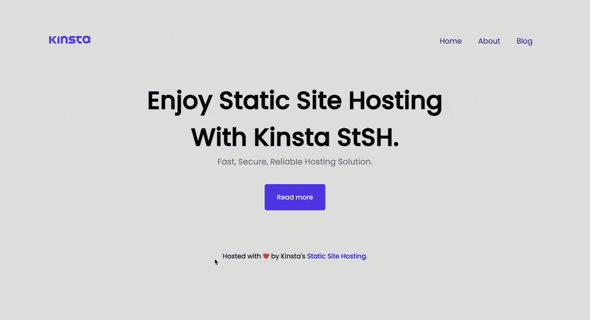
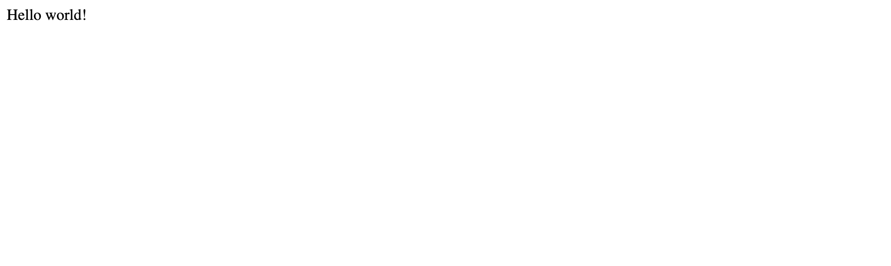
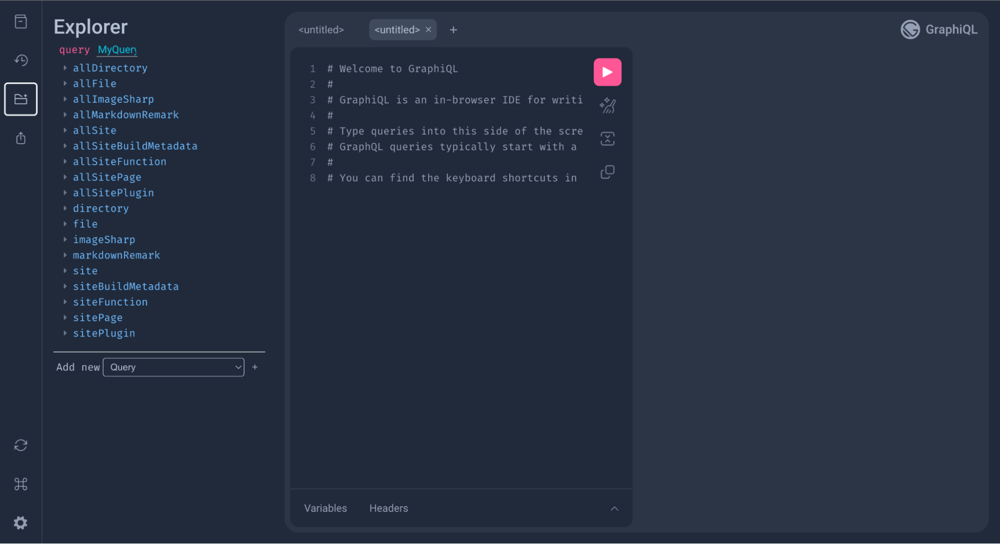
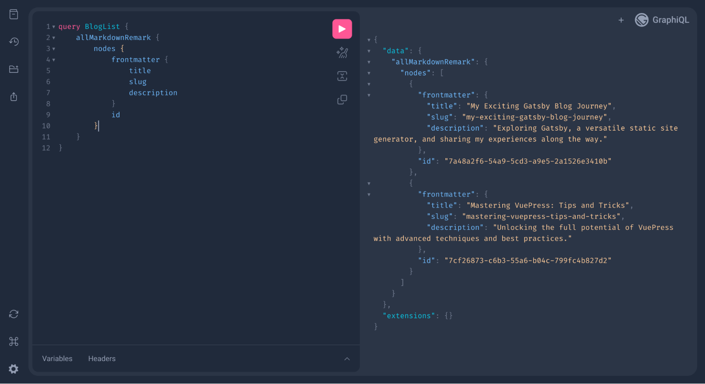
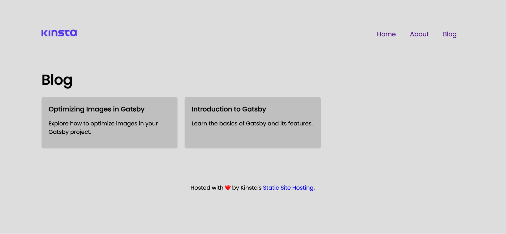

В последние годы статические веб-сайты вновь обрели популярность благодаря своей скорости, безопасности и простоте. Одним из ведущих инструментов для создания статических сайтов сегодня является Gatsby, молниеносный генератор статических сайтов (SSG).

Если вы веб-разработчик и хотите создать личный блог, сайт-портфолио или бизнес-сайт, Gatsby поможет вам достичь поставленных целей. Это исчерпывающее руководство проведет вас через весь процесс создания статических сайтов с помощью Gatsby. Оно охватывает все, от основ до продвинутых тем.

Демо-сайт, демонстрирующий, что вы сможете создать после прочтения этого руководства.

## Понимание статических сайтов

Статические сайты - это веб-страницы, содержащие предварительно отрендеренные файлы HTML, CSS и JavaScript. В отличие от динамических сайтов, они не требуют обработки каждого запроса на стороне сервера. Вместо этого все содержимое генерируется заранее и передается непосредственно в браузер пользователя. Такой подход дает несколько преимуществ:

Скорость: статические сайты загружаются быстро, поскольку не требуют обработки на стороне сервера.  
Безопасность: Благодаря отсутствию выполнения кода на стороне сервера статические сайты менее уязвимы для угроз безопасности.  
Масштабируемость: Статические сайты легко кэшировать и распространять через сети доставки контента (CDN).  
Простота: Их легче разрабатывать, развертывать и поддерживать.

Теперь, когда вы понимаете, что такое статические сайты и каковы их преимущества, давайте погрузимся в Gatsby.

## Что такое Gatsby?

Gatsby - это фреймворк с открытым исходным кодом на основе библиотеки React JavaScript, который упрощает процесс создания статических сайтов. Он сочетает в себе мощь компонентов React и GraphQL для управления данными, что делает его отличным выбором для разработчиков любого уровня. Вот почему Gatsby выделяется на фоне других:

Молниеносная скорость: Gatsby оптимизирует ваш сайт для повышения скорости работы, используя такие приемы, как разделение кода и ленивая загрузка, в результате чего страницы загружаются практически мгновенно.  
Гибкий поиск данных: Он может получать данные из различных мест, включая файлы Markdown, API и базы данных.  
Богатая экосистема плагинов: Обширная экосистема плагинов Gatsby позволяет без труда расширять ее функциональность.  
SEO и производительность: Gatsby автоматически генерирует оптимизированный HTML для улучшения SEO и производительности.

## Начало работы с Gatsby

Чтобы следовать этому руководству, вам необходимо иметь:

- Фундаментальное понимание HTML, CSS и JavaScript
- Базовые знания о React
- Node.js и npm (Node Package Manager) или yarn, установленные на вашем компьютере

Чтобы начать работу с Gatsby и создать проект, вы можете воспользоваться одним из многочисленных примеров в библиотеке Gatsby Starter Library или создать проект с нуля.

В этом руководстве мы будем использовать официальный стартовый пример hello world для GatsbyJS, так как он дает нам простой проект без плагинов и дополнительных файлов.

Сначала установите Gatsby CLI на свой компьютер, выполнив следующую команду:

`npm install -g gatsby-cli`.

Запустите `gatsby --version`, чтобы проверить успешность установки.

Далее перейдите в папку, в которой вы хотите создать свой проект, и выполните следующую команду:

```bash
 npx gatsby new <имя проекта> https://github.com/gatsbyjs/gatsby-starter-hello-world
```

Измените ````<project-name>` выше на предпочтительное имя для вашего проекта.

После успешной установки перейдите в папку проекта и запустите сервер разработки:

`cd <имя проекта> gatsby develop`.

Локальный сервер разработки запустится по адресу <http://localhost:8000>, откуда вы сможете получить доступ к вашему сайту Gatsby.

Тема Gatsby hello world.  
Понимание структуры файлов Gatsby

Когда вы откроете свой проект в редакторе кода, вы увидите следующую структуру:

`/ |-- /public |-- /src |-- /pages |-- index.js |-- /static |-- gatsby-config.js`

/public: Эта директория содержит результаты процесса сборки Gatsby. Здесь хранятся сгенерированные HTML, CSS, JavaScript и другие ресурсы.  
/src: Это сердце вашего проекта Gatsby, где вы будете проводить большую часть своего времени. Он содержит различные подкаталоги и файлы:

/pages: Здесь хранятся все страницы вашего проекта. Каждый файл JavaScript здесь соответствует маршруту на вашем сайте.

/static: Эта директория используется для статических файлов, которые вы хотите включить в свой сайт, например, изображений, шрифтов или загружаемых файлов. Эти файлы предоставляются как есть и не обрабатываются Gatsby.  
gatsby-config.js: В этом конфигурационном файле задаются различные настройки для сайта Gatsby. Здесь вы можете указать плагины, метаданные сайта и другие настройки.

## Создание страниц и компонентов

Создание веб-страниц в Gatsby - это простой процесс. Любой JavaScript-файл, созданный в папке /src/pages, автоматически становится страницей с соответствующим маршрутом, благодаря автоматической генерации страниц в Gatsby.

Вы можете создать столько страниц, сколько вам нужно для вашего сайта, добавляя дополнительные файлы JavaScript в папку /src/pages. Например, вы можете создать файл about.js для страницы "О сайте".

В то время как вы можете создавать отдельные файлы JavaScript дляach страницы непосредственно в папке /src/pages, можно также упорядочить ваши страницы. Вы можете создавать подпапки для группировки связанных страниц. Например, вы можете создать папку "Блог" для организации всех страниц, связанных с блогом.

Для данного проекта структура страниц будет выглядеть следующим образом:

`|-- /src |-- /pages |-- about.js |-- index.js |-- /blog |-- index.js`

## Использование JSX для страниц

Поскольку Gatsby построен на основе React, его страницы и компоненты написаны на JSX (JavaScript XML). JSX - это расширение синтаксиса JavaScript, позволяющее определять структуру и расположение пользовательских интерфейсов в очень удобной для чтения и выразительной манере.

Например, вы можете создать содержимое главной страницы (index.js) следующим образом:

```js
import React from 'react';
export default function Home() {
	return (
		<>
			{' '}
			<div>
				{' '}
				<h1>Enjoy Static Site Hosting With Kinsta StSH.</h1> Fast, Secure, Reliable Hosting Solution.{' '}
			</div>{' '}
		</>
	);
}
```

## Связывание страниц в Gatsby

Чтобы создать ссылку на другую страницу, вы можете использовать компонент `Link` следующим образом:

```js
import React from 'react';
import { Link } from 'gatsby';
export default function Home() {
	return (
		<>
			{' '}
			<div>
				{' '}
				<h1>Enjoy Static Site Hosting With Kinsta StSH.</h1> Fast, Secure, Reliable Hosting Solution.{' '}
				<Link> to="/about">About Us</Link> <Link> to="/blog">Blog</Link>{' '}
			</div>{' '}
		</>
	);
}
```

В приведенном выше примере мы импортировали компонент `Link` из `gatsby` и использовали его для создания ссылок на страницу "О нас" и блог. Страница "О нас", например, имеет маршрут ``/about`. Когда пользователи нажимают на ссылку "О нас", они попадают на страницу`/about`.

Информация

Приведенный выше код может выглядеть как два объединенных связанных элемента, но обратите внимание, что это чисто для пояснения. Позже будет создана панель навигации, чтобы представить эти ссылки с соответствующим оформлением.

Для создания ссылок на внешние сайты можно использовать обычные теги якоря (`<a>`) с атрибутом `href`:

```js
import React from 'react';
export default function Home() {
	return (
		<>
			{' '}
			<div>
				{' '}
				<h1>Enjoy Static Site Hosting With Kinsta StSH.</h1> Fast, Secure, Reliable Hosting Solution.{' '}
				<div>
					{' '}
					<h1>Enjoy Static Site Hosting With Kinsta StSH.</h1> Быстрый, безопасный, надежный хостинг.{' '}
					<a href="https://kinsta.com/docs/static-site-hosting" target="_blank" rel="noreferrer">
						{' '}
						<div>Читать подробнее</div>{' '}
					</a>{' '}
				</div>{' '}
			</div>{' '}
		</>
	);
}
```

В данном случае ссылка открывает внешний сайт в новой вкладке браузера благодаря атрибутам `target="_blank"` и `rel="noreferrer"`.

## Создание компонентов в Gatsby

Архитектура Gatsby, основанная на компонентах, позволяет создавать многократно используемые строительные блоки для ваших веб-страниц. Вместо того чтобы дублировать код на нескольких страницах, вы можете инкапсулировать общие элементы в компоненты, что сделает вашу кодовую базу более организованной, удобной и эффективной.

Предположим, код вашей домашней страницы включает раздел навигации, основное содержание и нижний колонтитул:

```js
import React from 'react';
import { Link } from 'gatsby';
export default function Home() {
	return (
		<>
			{' '}
			<div className="nav-links">
				{' '}
				<Link> to="/">Home</Link> <Link> to="/about">About</Link> <Link> to="/blog">Blog</Link>{' '}
			</div> <div>
				{' '}
				<h1>Enjoy Static Site Hosting With Kinsta StSH.</h1> Быстрый, безопасный, надежный хостинг. <a href="https://kinsta.com/docs/static-site-hosting">
					{' '}
					<div>Читать подробнее</div>{' '}
				</a>{' '}
			</div> <div className="footer">
				{' '}
				Хостинг ❤️ от Kinsta's <a>
					{' '}
					href="https://kinsta.com/static-site-hosting">Статический хостинг сайтов{' '}
				</a> .{' '}
			</div>{' '}
		</>
	);
}
```

Представьте себе, что вам приходится дублировать код навигационной панели и нижнего колонтитула для каждой страницы вашего сайта. Именно здесь и проявляется сила компонентов. Вы можете создавать многократно используемые компоненты для навигационной панели, нижнего колонтитула и всех частей кода, которые будут повторяться на нескольких страницах и компонентах.

Чтобы работать с компонентами в Gatsby, создайте папку components в папке src для хранения всех компонентов. Затем создайте свои компоненты, например Navbar.js и Footer.js. В файле Navbar.js разделите код таким образом:

```js
import { Link } from 'gatsby';
import React from 'react';
const Navbar = () => {
	return (
		<nav>
			{' '}
			<div className="nav-links">
				{' '}
				<Link to="/">Home</Link> <Link to="/about">About</Link> <Link to="/blog">Blog</Link>{' '}
			</div>{' '}
		</nav>
	);
};
export default Navbar;
```

А также ваш Footer.js:

```js
import React from 'react';
const Footer = () => {
	return (
		<div className="footer">
			{' '}
			Hosted with ❤️ by Kinsta's <a>
				{' '}
				href="https://kinsta.com/static-site-hosting">Статический хостинг сайтов
			</a> .{' '}
		</div>
	);
};
export default Footer;
```

Далее импортируйте файлы компонентов на свои страницы или компоненты и используйте этот способ:

```js
import React from 'react';
import Navbar from '../components/Navbar';
import Footer from '../components/Footer';
export default function Home() {
	return (
		<>
			{' '}
			<Navbar /> <div>
				{' '}
				<h1>Enjoy Static Site Hosting With Kinsta StSH.</h1> Fast, Secure, Reliable Hosting Solution.{' '}
				<a href="https://kinsta.com/docs/static-site-hosting">
					{' '}
					<div>Readбольше</div>{' '}
				</a>{' '}
			</div> <Footer />{' '}
		</>
	);
}
```

## Создание компонента макета

Обычная практика веб-разработки - создание компонента макета, который содержит общую структуру сайта. Компонент макета обычно включает элементы, которые появляются на каждой странице, такие как верхние и нижние колонтитулы, навигационные меню и боковые панели.

Создайте новый файл Layout.js в папке /src/components. Затем определите структуру макета. В этом руководстве структура макета будет включать только панель навигации и нижний колонтитул:

```js
import React from 'react';
import Navbar from './Navbar';
import Footer from './Footer';
const Layout = ({ children }) => {
	return (
		<div className="layout">
			{' '}
			<Navbar /> <div> className="content">{children}</div> <Footer />{' '}
		</div>
	);
};
export default Layout;
```

В этом компоненте макета мы используем компоненты для обертывания содержимого страницы (предоставленного в виде ``children''). Чтобы использовать компонент макета на своих страницах, импортируйте его и оберните им содержимое страницы. Например, в странице index.js:

```js
import React from 'react'; import Layout from '../components/Layout''; export default function Home() { return ( <Layout> <div> <h1>Enjoy Static Site Hosting With Kinsta StSH.</h1> Fast, Secure, Reliable Hosting Solution. <a href="https://kinsta.com/docs/static-site-hosting"> <div>Read more</div> </a> </div> </Layout> ); }
```

Используя компонент layout, вы обеспечиваете согласованную структуру и внешний вид всех страниц, сохраняя код организованным и удобным. Это мощный способ эффективного управления общими элементами вашего сайта.

## Стилизация страниц и компонентов в Gatsby

Стилизация сайта в Gatsby очень гибкая и позволяет использовать различные подходы, включая обычный CSS, CSS-in-JS или препроцессоры CSS, такие как Sass. Давайте узнаем, как создавать обычные и модульные стили для страниц.

## Стилизация CSS

В Gatsby вы можете легко создать CSS-файл и привязать его к любому компоненту или странице, и он будет отлично работать. Например, вы можете создать папку styles в папке src, а затем создать файл global.css с вашим CSS-кодом.

Например, вот несколько основных глобальных стилей для компонентов, созданных ранее:

```css
@import url('https://fonts.googleapis.com/css2?family=Poppins:wght@300;400;500&display=swap');
* {
	margin: 0;
	padding: 0;
	box-sizing: border-box;
}
body {
	background-color: #ddd;
	font-family: 'Poppins', sans-serif;
	width: 1200px;
	margin: 0 auto;
}
a {
	text-decoration: none;
}
img {
	width: 100%;
}
nav {
	display: flex;
	justify-content: space-between;
	height: 200px;
	align-items: center;
}
nav .logo-img {
	width: 100px;
}
nav .nav-links a {
	padding: 0 20px;
	font-size: 18px;
}
@media (max-width: 700px) {
	body {
		width: 100%;
		padding: 0 20px;
	}
	nav .nav-links a {
		padding: 0 18px;
	}
}
.footer {
	width: 100%;
	text-align: center;
	margin: 100px 0 20px;
}
```

В приведенном выше коде вы импортируете шрифт Poppins из Google Fonts, а затем определяете основные стили, которые будут применяться ко всем вашим компонентам.

Далее импортируйте CSS-файл в компоненты, которые вы хотите стилизовать, но для этого проекта вы можете добавить его в компонент Layout, чтобы он применялся глобально:

```js
import React from 'react';
import Navbar from './Navbar';
import Footer from './Footer';
import '../styles/global.css';
const Layout = ({ children }) => {
	return (
		<div>
			{' '}
			<Navbar /> <div> className="content">{children}</div> <Footer />{' '}
		</div>
	);
};
export default Layout;
```

## Стилизация CSS модуля

Модули CSS позволяют привязать стили к определенным компонентам или страницам. Это предотвращает конфликты стилей и облегчает сопровождение кода. В папке styles создайте свои CSS-модули в формате <pageName>.module.css и добавьте в файл определенный стиль.

Например, создайте home.module.css для главной страницы и добавьте в него следующий код:

```css
.home_hero {
	display: flex;
	justify-content: center;
	align-items: center;
	flex-direction: column;
	text-align: center;
}
.home_hero h1 {
	font-size: 60px;
	width: 70%;
}
.home_hero p {
	color: #6e7076;
	font-size: 20px;
}
.btn {
	background-color: #5333ed;
	padding: 20px 30px;
	margin-top: 40px;
	border-radius: 5px;
	color: #fff;
}
@media (max-width: 700px) {
	.home_hero h1 {
		font-size: 40px;
	}
	.home_hero p {
		font-size: 16px;
	}
}
```

Чтобы использовать CSS-стили модуля на странице или в компоненте Gatsby, импортируйте стили из CSS-модуля как объект в верхней части файла страницы или компонента и используйте следующим образом:

```js
import React from 'react'; import Layout from '../components/Layout''; import * as styles from '../styles/home.module.css''; export default function Home() { return ( <Layout> <div className={styles.home_hero}> <h1>Наслаждайтесь хостингом статических сайтов с Kinsta StSH.</h1> Быстрый, безопасный, надежный хостинг. <a href="https://kinsta.com/docs/static-site-hosting"> <div className={styles.btn}>Читать больше</div> </a> </div> </Layout> ); }
```

Информация

Вы также можете применить встроенную стилизацию, подобно тому, как это делается в компонентах React.

## Использование статических файлов в Gatsby

В Gatsby статические файлы относятся к таким активам, как изображения, fonts, CSS-файлы и другие ресурсы, которые обслуживаются непосредственно в браузере клиента без какой-либо обработки на стороне сервера. Эти файлы добавляются в каталог /static в корне вашего проекта.

Например, если вы добавите изображение kinsta-logo.png в каталог /static, вы сможете отобразить его в своем компоненте следующим образом:

```js
import { Link } from 'gatsby';
import React from 'react';
const Navbar = () => {
	return (
		<nav>
			{' '}
			<Link>
				{' '}
				to="/"> {' '}
			</Link> <div className="nav-links">
				{' '}
				<Link> to="/">Home</Link> <Link> to="/about">About</Link> <Link> to="/blog">Blog</Link>{' '}
			</div>{' '}
		</nav>
	);
};
export default Navbar;
```

Gatsby автоматически преобразует эти относительные пути в правильные URL при создании сайта. Позже в этом руководстве вы узнаете, как оптимизировать изображения в Gatsby.

## Плагины и интеграции

Gatsby имеет богатую экосистему плагинов, которые могут расширить его функциональность. Вы можете найти плагины для SEO, аналитики, оптимизации изображений, преобразования markdown и многого другого. Установка и настройка плагинов очень проста, и они могут значительно расширить возможности вашего сайта.

В этом руководстве мы используем четыре плагина:

- gatsby-transformer-remark: Этот плагин позволяет преобразовывать Markdown-файлы в HTML-контент, облегчая создание и управление записями в блогах, документацией или любым другим текстовым контентом.
- gatsby-transformer-sharp и gatsby-plugin-sharp: Эти плагины работают вместе, чтобы оптимизировать и манипулировать изображениями в вашем проекте Gatsby.
- gatsby-source-filesystem: Этот плагин позволяет вам получать исходные файлы из каталога проекта и делать их доступными для запросов с помощью GraphQL.

Чтобы использовать эти плагины в своем проекте Gatsby, выполните следующую команду в корневом каталоге проекта, чтобы установить их:

```js
npm install gatsby-transformer-remark gatsby-transformer-sharp gatsby-plugin-sharp gatsby-source-filesystem
```

Затем настройте их в файле gatsby-config.js. Вот пример того, как настроить плагины:

```json
module.exports = {
  plugins: [
    // ...other plugins

    // Transform Markdown files to HTML
    'gatsby-transformer-remark',

    // Optimize and work with images
    'gatsby-transformer-sharp',
    'gatsby-plugin-sharp',

    // Source files from project directory
    {
      resolve: 'gatsby-source-filesystem',
      options: {
        name: 'posts',
        path: `${__dirname}/src/posts/`,
      },
    },

    // Source images from project directory
    {
      resolve: 'gatsby-source-filesystem',
      options: {
        name: 'images',
        path: `${__dirname}/src/images/`,
      },
    },
  ],
};
```

Создаются две конфигурации `gatsby-source-filesystem`, указывающие на две папки: posts и images. В Posts будут храниться некоторые файлы с разметкой (записи блога), которые будут преобразованы с помощью `gatsby-transformer-remark`, а в images будут храниться изображения для блога и другие изображения, которые вы хотите оптимизировать.

Не забывайте перезапускать локальный сервер разработки, когда вносите изменения в файл gatsby-config.js.

Информация

Изображения, хранящиеся в папке src в проекте Gatsby, предназначены для динамического контента и подвергаются оптимизации плагинами Gatsby, в то время как изображения в папке /static рассматриваются как статические активы и остаются неизменными при сборке, что делает их подходящими для таких элементов, как логотипы и иконки.

## Создание постов в блоге

Теперь, когда мы настроили наши плагины, создайте папку posts в каталоге src, а затем создайте два файла Markdown со следующим содержанием:

post-1.md:

```md
--- title: "Введение в Gatsby" date: "2023-10-01" slug: "introduction-to-gatsby" description: "Узнайте об основах Gatsby и его возможностях." featureImg: ../images/featured/image-1.jpeg --- Добро пожаловать в мир Gatsby! В этом посте мы познакомим вас с основами Gatsby и его мощными возможностями.
```

И post-2.md:

```md
--- title: "Оптимизация изображений в Gatsby" date: "2023-10-05" slug: "optimizing-images-in-gatsby" description: "Узнайте, как оптимизировать изображения в вашем проекте Gatsby." featureImg: ../images/featured/image-2.jpeg ---
```

Эти Markdown-файлы содержат frontmatter с метаданными о записях блога, включая названия, даты, ссылки, описания и пути к изображениям.

## Запросы в Gatsby с помощью GraphQL

Gatsby использует GraphQL для запросов и получения данных для вашего сайта. GraphQL - это мощный язык запросов, который позволяет запрашивать именно те данные, которые вам нужны, что делает его эффективным и гибким. Давайте узнаем, как запрашивать данные в Gatsby с помощью GraphQL.

Запустив в терминале команду `gatsby develop`, вы заметите, что помимо ссылки gatsby-source-filesystem, которая открывает ваш проект в Интернете, вы также видите URL <http://localhost:8000/\_\_\_\_graphql>. Этот URL предоставляет доступ к редактору GraphiQL для вашего проекта Gatsby.

Когда вы открываете редактор, вы видите такой интерфейс:

Игровая площадка Gatsby GraphiQL.

Вы можете запросить как можно больше информации о вашем сайте из этогоредактора. Но поскольку вы создали файлы уценки и выполнили все настройки в файле gatsby-config.js. Давайте запросим файлы Markdown и их содержимое, выполнив следующий запрос в редакторе:

```js
query BlogList { allMarkdownRemark { nodes { frontmatter { title slug description } id } } }
```

Этот запрос получает данные из всех файлов Markdown с помощью `allMarkdownRemark`. Он извлекает `title`, `lug` и `description` из frontmatter каждого файла, а также их `id`.

После составления запроса нажмите кнопку "Play" (значок треугольника, направленный вправо), чтобы выполнить запрос. Результаты будут отображены в правой части редактора.

Использование игровой площадки GraphiQL для получения информации в формате markdown.

Затем вы можете использовать GraphQL для запроса данных в формате Markdown в ваших компонентах или страницах. Чтобы запросить эти данные на странице blog/index.js, сначала импортируйте `graphql` из `gatsby`. Затем в нижней части JSX-кода добавьте следующее:

```````js
export const query = graphql`````` query BlogList { allMarkdownRemark { nodes { frontmatter { title slug description } id } } } ```;
```````

В приведенном выше коде мы используем тег `graphql` для создания GraphQL-запроса под названием `query`. Вот как должен выглядеть ваш файл blog/index.js:

````js
import { graphql, Link } from 'gatsby';
import React from 'react';
import Layout from '../../components/Layout';
import * as styles from '../../styles/blog.module.css';
const blog = ({ data }) => {
	const posts = data.allMarkdownRemark.nodes;
	return (
		<Layout>
			{' '}
			<div className={styles.blog_cont}>
				{' '}
				<h2>Блог</h2> <div className={styles.blog_grid}>
					{' '}
					{posts.map((post) => (
						<Link
							to={```/blog/${post.frontmatter.slug}```}
							className={styles.blog_card}
							key={post.id}
						>
							{' '}
							<h3>{post.frontmatter.title}</h3> {post.frontmatter.description}{' '}
						</Link>
					))}{' '}
				</div>{' '}
			</div>{' '}
		</Layout>
	);
};
export default blog;
export const query = graphql``` query BlogList { allMarkdownRemark { nodes { frontmatter { title slug description } id } } } ```;
````

В приведенном выше коде вы получаете доступ к результату `query` через свойство `data` в вашем компоненте. Далее вы перебираете данные `posts` с помощью JavaScript-метода `map()`, а затем выводите заголовки в виде списка.

Чтобы избежать ошибок, создайте файл blog.module.css в папке styles и добавьте в него следующий код:

```css
.blog_cont h2 {
	font-size: 40px;
	margin-bottom: 20px;
}
.blog_grid {
	display: grid;
	grid-template-columns: 1fr 1fr 1fr;
	gap: 20px;
}
@media (max-width: 700px) {
	.blog_grid {
		grid-template-columns: 1fr;
	}
}
.blog_card {
	background-color: #bfbfbf;
	padding: 20px;
	border-radius: 5px;
	color: #000;
	transition: all 0.5s ease-in-out;
}
.blog_card:hover {
	background-color: #5333ed;
	color: #fff;
}
.blog_card h3 {
	margin-bottom: 15px;
}
.blog_card p {
	margin-bottom: 15px;
}
```

Отображение постов блога, полученных через GraphQL.  
Понимание шаблонов и генерация динамических страниц в Gatsby с помощью GraphQL

В Gatsby шаблоны и динамические страницы - это важные понятия, которые позволяют создавать гибкие и управляемые данными веб-сайты. Шаблоны позволяют определять структуру и расположение страниц, а GraphQL помогает получать данные для динамического наполнения этих шаблонов.

## Создание шаблона записи в блоге

Допустим, вы хотите создать блог, в котором каждая запись будет иметь последовательную структуру, включая заголовок и содержание. Вы можете создать шаблон `BlogDetails`, чтобы определить этот макет. В папке src создайте папку templates, а затем создайте файл blog-details.js:

```js
import React from 'react'; import Layout from '../components/Layout'; import * as styles from '../styles/blog-details.module.css'; const BlogDetails = () => { return ( <Layout> <div> <div className={styles.blog_content}>  <h3>Заголовок</h3> <div> className={styles.html} dangerouslySetInnerHTML={} /> </div> </div> </Layout> ); }; export default BlogDetails;
```

В этом примере шаблон `BlogDetails` определяет структуру отдельных записей блога. Далее давайте воспользуемся GraphQL для получения данных о конкретных записях блога и передадим их в качестве реквизитов в этот шаблон.

## Генерация динамических страниц

Чтобы генерировать динамические страницы, создайте файл gatsby-node.js в корневом каталоге вашего проекта. Этот файл позволяет определить, как будут создаваться страницы.

В файле gatsby-node.js используйте GraphQL для запроса данных, которые вы хотите использовать для динамических страниц. Например, если у вас есть записи в блоге в формате Markdown, вы можете запросить их slugs:

````js
const path = require(```path```);
exports.createPages = async ({ graphql, actions }) => {
	const { data } = await graphql(
		``` query Articles { allMarkdownRemark { nodes { frontmatter { slug } } } } ```,
	);
	data.allMarkdownRemark.nodes.forEach((node) => {
		actions.createPage({
			path: '/blog/' + node.frontmatter.slug,
			component: path.resolve('./src/templates/blog-details.js'),
			context: { slug: node.frontmatter.slug },
		});
	});
};
````

В этом примере мы запрашиваем slug всех постов в формате Markdown и создаем динамические страницы для каждого поста, используя шаблон `BlogDetails`. Объект context используется для передачи данных шаблону. Эти данные (slug) используются шаблоном для получения других данных, соответствующих slug.

Давайте сначала разберемся, как работает оптимизация изображений в Gatsby, прежде чем добавлять GraphQL-запрос на страницу шаблона.

## Оптимизация изображений в Gatsby

Ранее вы установили и настроили `gatsby-transformer-sharp` и `gatsby-plugin-sharp`, а также `gatsby-source-filesystem` для поиска изображений.

С помощью этих плагинов вы можете запрашивать и оптимизировать изображения с помощью GraphQL. Вот пример того, как можно запросить и отобразить оптимизированное изображение с помощью `gatsby-plugin-sharp`:

`export const query = graphql` query { file(relativePath: { eq: "example.jpg" }) { childImageSharp { fluid { ...GatsbyImageSharpFluid } } } } ```;``````

В приведенном выше коде вы запрашиваете изображение с именем example.jpg из источника изображений и используете свойство `fluid` запрашиваемого изображения для его отображения с отзывчивым оптимизированным рендерингом.

Вы можете импортировать `Img` из `gatsby-image` для работы с оптимизированными изображениями.

```js
import React from 'react';
import { graphql } from 'gatsby';
import Img from 'gatsby-image';
const ImageExample = ({ data }) => {
	const { fluid } = data.file.childImageSharp;
	return (
		<div>
			{' '}
			{' '}
		</div>
	);
};
export default ImageExample;
```

## Запрос к динамическим страницам

Gatsby будет использовать указанный шаблон для создания отдельных страниц для каждой записи в блоге. Теперь добавим GraphQL-запрос к странице шаблона, чтобы получить данные на основе slug:

````js
import { graphql } from 'gatsby';
import Img from 'gatsby-image';
import React from 'react';
import Layout from '../components/Layout';
import * as styles from '../styles/blog-details.module.css';
const BlogDetails = ({ data }) => {
	const { html } = data.markdownRemark;
	const { title, featureImg } = data.markdownRemark.frontmatter;
	return (
		<Layout>
			{' '}
			<div>
				{' '}
				<div className={styles.blog_content}>
					{' '}
					 <h3>
						{title}
					</h3> <div className={styles.html} dangerouslySetInnerHTML={{ __html: html }} />{' '}
				</div>{' '}
			</div>{' '}
		</Layout>
	);
};
export default BlogDetails;
export const query = graphql``` query ProjectDetails($slug: String) { markdownRemark(frontmatter: { slug: { eq: $slug } }) { html frontmatter { title featureImg { childImageSharp { fluid { ...GatsbyImageSharpFluid } } } } } } ```;
````

В приведенном выше коде вы заметите, что мы запрашиваем оптимизированное изображение и запрашиваем запись в блоге, соответствующую слогу.

Вы можете ознакомиться с полным исходным кодом этого проекта Gatsby на GitHub.

## Развертывание статических сайтов Gatsby

Kinsta позволяет бесплатно разместить до 100 статических сайтов. Для этого нужно разместить код на выбранном вами Git-провайдере (Bitbucket, GitHub или GitLab), а затем развернуть его на Kinsta.

После того как репозиторий будет готов, выполните следующие шаги для развертывания статического сайта в Kinsta:

- Войдите в систему или создайте учетную запись для просмотра панели MyKinsta.
- Авторизуйте Kinsta с помощью вашего Git-провайдера.
- Нажмите Статические сайты на левой боковой панели, затем нажмите Добавить сайт.
- Выберите репозиторий и ветку, из которой вы хотите развернуть сайт.
- Присвойте сайту уникальное имя.
- MyKinsta автоматически определит настройки сборки для этого проекта Gatsby. Вы увидите, что следующие настройки уже заполнены:

Команда сборки: `npm run build`.
Версия Node: `18.16.0`
Каталог публикации: `public`

Наконец, нажмите кнопку Создать сайт.

Вот и все! Теперь у вас есть развернутый сайт в течение нескольких секунд. Для доступа к развернутой версии сайта предоставляется ссылка. При желании вы можете позже добавить свой собственный домен и SSL-сертификат.

В качестве альтернативы хостингу статических сайтов вы можете развернуть свой статический сайт в хостинге приложений Kinsta, который обеспечивает большую гибкость хостинга, более широкий спектр преимуществ и доступ к более надежным функциям. Например, масштабируемость, настраиваемое развертывание с помощью Dockerfile и всесторонняя аналитика, включающая данные в реальном времени и за прошлые периоды.

## Резюме

В этом руководстве рассмотрены основы поиска данных, маршрутизации, стилизации, оптимизации изображений, плагинов, развертывания и многое другое.

Гибкость, скорость и богатая экосистема Gatsby делают его мощным выбором для создания статических веб-сайтов. Создаете ли вы личный блог, сайт-портфолио или бизнес-сайт, Gatsby поможет вам в этом.

Теперь пришло время применить полученные знания на практике и начать создавать свой собственный сайт на Gatsby. Использовали ли вы Gatsby для создания чего-либо? Не стесняйтесь поделиться с нами своими проектами и опытом в разделе комментариев ниже.
