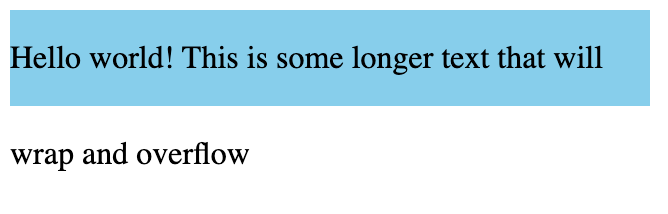
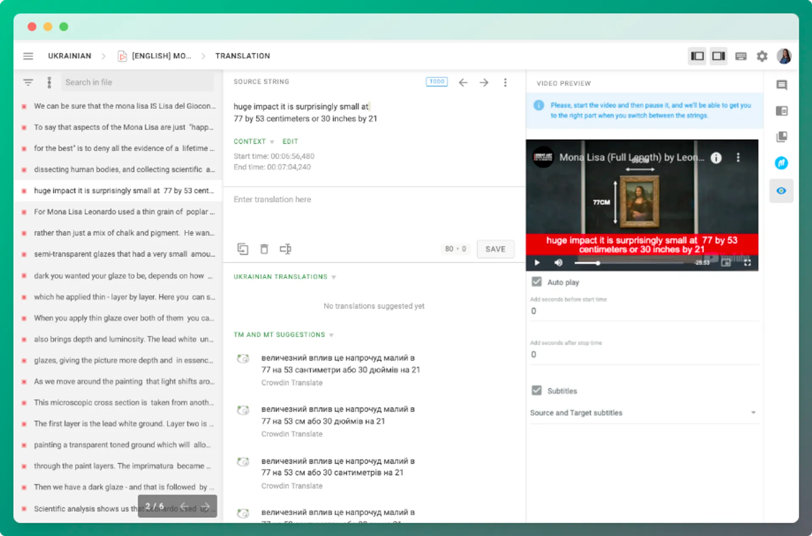
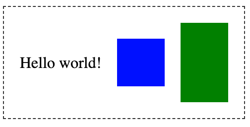
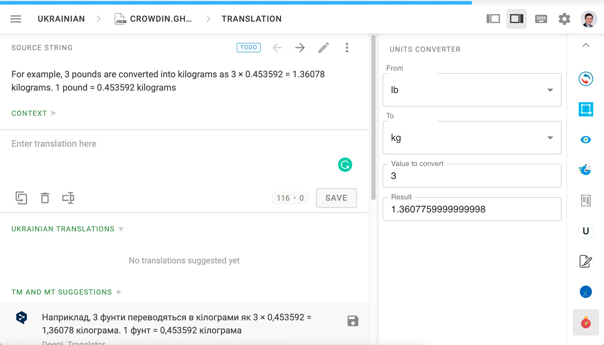

Если внутри `div` находится текст и больше ничего, то высота `div` будет соответствовать высоте текста. Однако предположим, что у вас есть текст и изображение. Ваш текст будет выровнен по нижней части `div`, а это обычно не то, что вам нужно.

В этой статье вы узнаете несколько способов вертикального центрирования текста внутри такого `div` или другого элемента.

## Как выровнять текст по центру с помощью высоты строки

Этот подход ограничен, но может быть полезен, если вы установили фиксированную высоту элемента с помощью свойства `height`.

Свойство `line-height` определяет высоту рамки, в которую браузер выводит текст. По умолчанию это значение немного больше 1, чтобы обеспечить комфортный интервал между строками текста.

Если установить для `height` и `line-height` элемента одинаковое значение, текст будет выровнен по вертикали:

```css
.my-element {
	height: 3rem;
	line-height: 3rem;
}
```

Вертикально центрированный текст с использованием высоты строки

Однако у этого подхода есть важная оговорка. Это работает только в том случае, если ваш текст помещается в одну строку.

Если текст все же уместится, вы увидите первую строку вертикально выровненной. Поскольку вы задали `line-height` равным `высоте` элемента, обернутая строка текста теперь переполняет элемент.

Завернутый текст переполняет контейнер

Если это звучит слишком жестко, читайте дальше. Далее вы увидите, как можно использовать Flexbox для вертикального центрирования текста, а также любого другого содержимого внутри элемента.

## Как выровнять текст по центру с помощью Flexbox

Лучшим, более универсальным решением является использование макета Flexbox с `align-items`, установленным на `center`.

Элемент, использующий Flexbox (гибкий контейнер), размещает элементы (гибкие элементы) либо в строку, либо в колонку. Макет Flexbox имеет две воображаемые линии, проходящие через него. Первая - это главная ось, вдоль которой будут располагаться элементы. Для флексбокса `row` главной осью является горизонтальная ось.

Поперечная ось проходит перпендикулярно главной оси. Вы можете использовать поперечную ось для определения вертикального выравнивания элементов внутри флекс-контейнера.

[image-92](images/image-92.png)Главная и поперечная оси в горизонтальном макете Flexbox

Вот CSS, необходимый для применения макета Flexbox и вертикального центрирования текста:

```css
/* Styles for the .my-element class */
.my-element {
	/* Use flexbox layout */
	display: flex;

	/* Set the flex direction to horizontal (row) */
	flex-direction: row;

	/* Vertically center the elements */
	align-items: center;
}
```

Это создает горизонтальный Flexbox-макет (`flex-direction: row` не является обязательным, так как используется по умолчанию). Свойство `align-items` определяет выравнивание элементов по поперечной, или вертикальной, оси. Существует несколько различных значений, которые можно использовать, но здесь вы можете использовать `center` для вертикального центрирования текста.

Текст с align-items: center

Это отлично работает, и даже справляется с несколькими строками обернутого текста. Если внутри элемента есть другое содержимое, например, изображение, все будет выровнено по вертикали.

Текст выровнен по вертикали с другим содержимымКак выровнять текст по центру с помощью сетки CSS

## Вы также можете выровнять текст по вертикали с помощью CSS Grid

Для одного `div`, содержащего текст, который нужно выровнять по центру, вы можете превратить его в макет сетки с одной строкой и одной колонкой.

```css
.my-element {
	display: grid;
	align-items: center;
}
```

В сетчатом макете свойство `align-items` задает выравнивание содержимого ячейки по оси столбца (вертикальной). Таким образом, текст в элементе `div` выравнивается по вертикали.

Текст вертикально выровнен по центру с помощью макета сетки 1x1

Если элемент, содержащий ваш текст, уже является частью макета сетки, вы можете применить `align-items: center` ко всей сетке, или, если вы хотите управлять вертикальным выравниванием только одной ячейки сетки, вы можете использовать `align-self: center`.

## Заключение

Теперь вы знаете, как выровнять текст по вертикали. В следующий раз, когда вы увидите твит о центрировании `div`, вы можете ответить на него своими новыми знаниями CSS!
