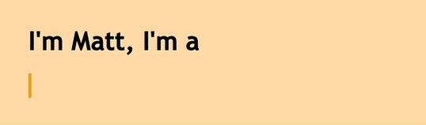
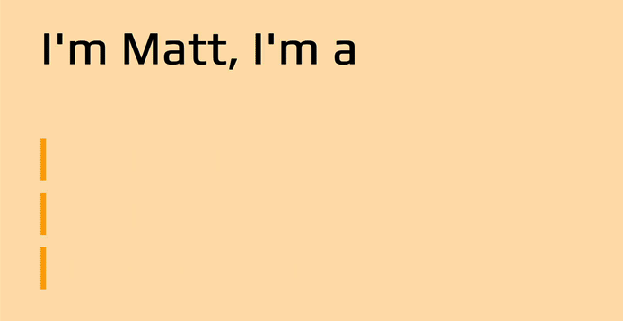
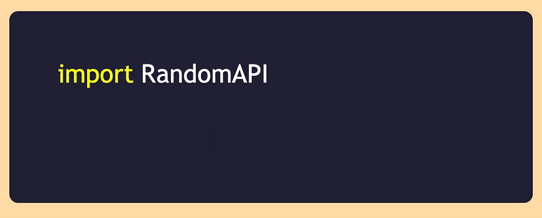
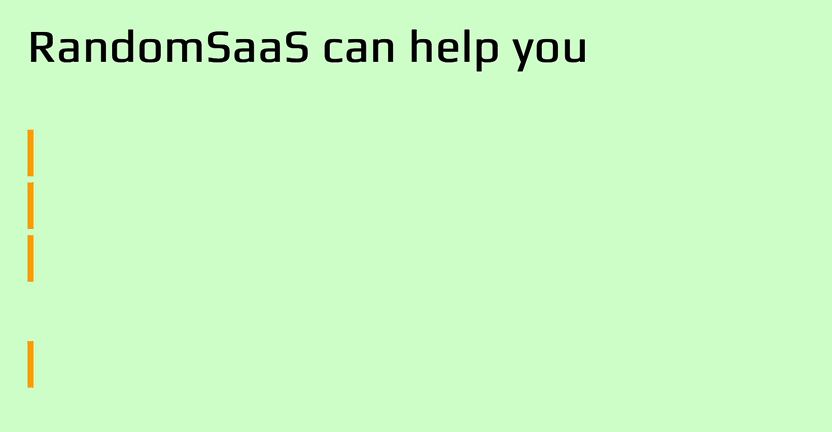

В этой статье вы узнаете, как сделать текст вашего сайта динамичным и более привлекательным с помощью эффектов печатной машинки в чистом CSS.

Эффект печатной машинки предполагает постепенное раскрытие текста, как будто он набирается на ваших глазах.



Добавление эффекта печатной машинки к фрагментам текста поможет привлечь посетителей вашего сайта и заинтересовать их в дальнейшем чтении. Эффект печатной машинки можно использовать для многих целей, например, для создания привлекательных целевых страниц, элементов призыва к действию, персональных сайтов и демонстрации кода.

## Эффект печатной машинки легко создать

Эффект печатной машинки легко создать, и все, что вам понадобится для того, чтобы разобраться в этом руководстве, - это базовые знания о CSS и CSS-анимации.

Вот как будет работать эффект печатной машинки:

Анимация печатной машинки будет раскрывать наш текстовый элемент, изменяя его ширину от 0 до 100%, шаг за шагом, используя функцию CSS `steps()`.  
Анимация мигания будет анимировать курсор, который ”набирает” текст.

## Создание веб-страницы для эффекта набора текста

Давайте сначала создадим веб-страницу для демонстрации печатной машинки. Она будет включать контейнер `&lt;div&gt;` для текста, набранного на пишущей машинке, с классом `typed-out`:

```html
<!doctype html>
<html>
	<head>
		<title>Print Effect</title>
		<style>
			body {
				background: navajowhite;
				background-size: cover;
				font-family: 'Trebuchet MS', sans-serif;
			}
		</style>
	</head>
	<body>
		<div class="container">
			<div class="typed-out">Web Developer</div>
		</div>
	</body>
</html>
```

## Стилизация контейнера для типографского текста

Теперь, когда у нас есть макет веб-страницы, давайте стилизуем `&lt;div&gt;` с помощью класса “typed-out”:

`.typed-out { overflow: hidden; border-right: .15em solid orange; font-size: 1.6rem; width: 0; }`.

Обратите внимание, что для того, чтобы эффект печатной машинки работал, мы добавили следующее:

`"overflow: hidden;"` и `"width: 0;"`, чтобы содержимое текста не раскрывалось до тех пор, пока не начнется эффект печатания.  
`border-right: .15em solid orange;`, чтобы создать курсор печатной машинки.

Перед эффектом набора текста, чтобы остановить курсор на последней букве элемента `typed-out` после того, как он будет полностью набран, как это сделала бы печатная машинка (или текстовый процессор), мы создадим контейнер для элемента `typed-out` и добавим `display: inline-block;`:

`.container { display: inline-block; }`.

## Создание анимации раскрывающегося текста

Анимация печатной машинки создаст эффект того, что текст внутри элемента `typed-out` набирается буква за буквой. Мы будем использовать правило анимации CSS `@keyframes`:

`@keyframes typing { from { width: 0 } to { width: 100 % } }`

Как вы можете видеть, все, что делает эта анимация, - это изменяет ширину элемента от 0 до 100%.

Теперь мы включим эту анимацию в наш класс `typed-out` и установим направление анимации на `forwards`, чтобы убедиться, что текстовый элемент не вернется к `width: 0` после завершения анимации:

```css
.typed-out {
	overflow: hidden;
	border-right: 0.15em solid orange;
	white-space: nowrap;
	font-size: 1.6rem;
	width: 0;
	animation: typing 1s forwards;
}
```

Наш текстовый элемент будет просто раскрываться одним плавным движением слева направо:

## Добавление шагов для достижения эффекта печатной машинки

Пока что наш текст раскрывается, но плавно, не раскрывая текст буква за буквой. Это начало, но, очевидно, это не то, на что похож эффект печатной машинки.

Чтобы анимация раскрывала наш текстовый элемент буква за буквой или по шагам, как это делает печатная машинка, нам нужно разделить анимацию `typing`, включенную классом `typed-out`, на шаги, чтобы она выглядела так, как будто текст набирается. Здесь на помощь приходит CSS-функция `steps()`:

```css
.typed-out {
	overflow: hidden;
	border-right: 0.15em solid orange;
	white-space: nowrap;
	font-size: 1.6rem;
	width: 0;
	animation: typing 1s steps(20, end) forwards;
}
```

Как видите, мы разделили анимацию `печатания` на 20 шагов с помощью функции CSS `steps()`. Вот что мы видим сейчас:

Вот наш полный код на данный момент:

```html
<!doctype html>
<html>
	<head>
		<title>Эффект печатной машинки</title>
		<link rel="stylesheet" href="styles.css" />
	</head>
	<body>
		<h1>Я Мэтт, я</h1>
		<div class="container">
			<div class="typed-out">Веб-разработчик</div>
		</div>
	</body>
</html>
```

```css
body {
	background: navajowhite;
	background-size: cover;
	font-family: 'Trebuchet MS', sans-serif;
}

.container {
	display: inline-block;
}

.typed-out {
	overflow: hidden;
	border-right: 0.15em solid orange;
	white-space: nowrap;
	animation: typing 1s steps(20, end) forwards;
	font-size: 1.6rem;
	width: 0;
}

@keyframes typing {
	from {
		transform: scaleX(0);
	}
	to {
		transform: scaleX(1);
	}
}
```

## Регулировка шагов для более длительного эффекта набора текста

Чтобы настроитьПри работе с длинными фрагментами текста вам придется увеличить количество шагов и продолжительность анимации набора текста:

Настройка шагов для получения эффекта более короткой печатной машинки

Чтобы приспособиться к коротким фрагментам текста, вам нужно уменьшить шаги и продолжительность анимации набора текста:

## Создание и стилизация анимации мигающего курсора

Очевидно, что оригинальные механические печатные машинки не имели мигающего курсора, но стало традицией добавлять его, чтобы имитировать эффект мигающего курсора более современных компьютеров/словопроцессоров. Анимация мигающего курсора помогает сделать набранный текст еще более выделяющимся на фоне статичных элементов текста.

Чтобы добавить анимацию мигающего курсора к нашей анимации печатной машинки, сначала создадим анимацию `blink`:

`@keyframes blink { from { border-color: transparent } to { border-color: orange; } }`

На нашей веб-странице эта анимация изменит цвет границы элемента `typed-out`, который используется в качестве курсора для эффекта печатной машинки, с прозрачного на оранжевый.

Мы включим эту анимацию в правила класса `typed-out` и установим для свойства animation direction значение `infinite`, чтобы курсор исчезал и появлялся снова каждые `.8 с` до бесконечности:

`.typed-out{ overflow: hidden; border-right: .15em solid orange; white-space: nowrap; font-size: 1.6rem; width: 0; animation: typing 1s steps(20, end) forwards, blink .8s infinite; }`.

Настройка кода для эффекта мигающего курсора

Мы можем сделать курсор тоньше или толще, изменив его свойство `border-right: .15em solid orange;`, а также сделать курсор другого цвета, задать ему border-radius, настроить частоту его мигания и многое другое.

Вы можете поэкспериментировать с этими свойствами в демо-версии CodePen и посмотреть, что еще вы можете придумать!

Комбинирование элементов анимации текста на печатной машинке

Теперь, когда вы знаете, как сделать эффект печатной машинки в CSS, пришло время продемонстрировать несколько практических и актуальных случаев использования этого эффекта.

Эффект набора текста в портфолио

Вот пример личного портфолио. Эффект печатной машинки может выделить ваше веб-резюме/личный сайт и сделать его более привлекательным.





Вы можете поиграть с этой демонстрацией API на CodePen.

Вполне вероятно, что на каком-то этапе своей разработки вы сталкивались с целевой страницей поставщика API и видели подобный блок кода, демонстрирующий реализацию их API. Лично я считаю, что это действительно практичная и актуальная реализация эффекта печатной машинки, и она выглядит более привлекательно и заманчиво, чем статичный кусок кода.

Эффект печатной машинки на целевой странице продукта

Вот пример целевой страницы SaaS/продукта.



Вы можете поиграть с этой демонстрацией страницы продукта SaaS на CodePen.

Я обнаружил, что эффекты печатной машинки на целевых страницах SaaS или продуктов более привлекательны и заинтересовывают посетителей, желающих воспользоваться их продуктами или услугами. Проведя много времени за разработкой веб-сервисов и веб-приложений, я могу сказать по собственному опыту, что эффекты печатной машинки создают дополнительный интерес к вашим целевым страницам. Набранный текст, например ”Начните сегодня”, придает дополнительный импульс тексту призыва к действию.

## Заключение

В этой статье мы увидели, как легко с помощью CSS создать анимированный текст ”печатной машинки”. Этот эффект печатания определенно может добавить интереса и восхищения вашим веб-страницам.

Однако в конце стоит сделать небольшое предупреждение. Эту технику лучше всего использовать на небольших участках некритичного текста, просто чтобы создать немного дополнительной радости. Но будьте осторожны и не полагайтесь на нее слишком сильно, так как использование подобной CSS-анимации имеет некоторые ограничения. Обязательно протестируйте текст, напечатанный печатными буквами, на разных устройствах и при разных размерах области просмотра, так как результаты могут отличаться на разных платформах. Также подумайте о конечных пользователях, которые используют вспомогательные технологии, и в идеале проведите несколько юзабилити-тестов, чтобы убедиться, что вы не усложняете жизнь своим пользователям. Если вы можете сделать что-то с помощью чистого CSS, это еще не значит, что вы должны это делать. Если эффект печатной машинки важен для вас и вы хотите использовать его для более важного контента, возможно, стоит рассмотреть и JavaScript-решения.

В любом случае, я надеюсь, что вам понравилась эта статья, и она заставила вас задуматься о других классных вещах, которые можно сделать с помощью CSS-анимации, чтобы добавить интересные штрихи и восхищение на ваши веб-страницы.

### Часто задаваемые вопросы о создании CSS-анимацииЭффект

В заключение давайте ответим на некоторые из наиболее часто задаваемых вопросов о том, как создать эффект печатной машинки в CSS.

#### Что такое эффект печатной машинки?

Эффект печатной машинки” - это анимационная техника, которая заставляет строку текста появляться на экране буква за буквой, как будто она набирается на печатной машинке в реальном времени. Этот эффект часто создается с помощью JavaScript, но может быть достигнут и с помощью одного только CSS, как показано в этой статье.

#### Что такое анимация печатной машинки?

Печатная машинка работает, печатая текст по одной букве за раз. Анимация печатной машинки - это анимация, которая имитирует печатание на печатной машинке, представляя слово текста по одной букве за раз. Это популярный анимационный эффект на многих веб-страницах.

##### Как анимировать набор текста в CSS?

Современный CSS предлагает различные инструменты для создания анимации, включая `animation`, `@keyframes`, `steps()`. Эти инструменты используются для постепенного раскрытия текста, который сначала был скрыт с помощью свойства `overflow`.

#### Как сделать настраиваемую анимацию печатной машинки с помощью CSS?

Создание настраиваемой анимации печатной машинки с помощью CSS предполагает использование ключевых кадров и свойств CSS для управления внешним видом и поведением текста при его наборе на экране. Вы можете сделать ее настраиваемой, раскрыв некоторые параметры анимации как переменные CSS (пользовательские свойства), чтобы их можно было легко изменить в таблице стилей. Например:

````css
:root {
	--typewriter-text: 'Ваш текст здесь';
	--typewriter-duration: 4 с;
}
.typewriter {
	анимация: typewriter var(--typewriter-duration) steps(20) infinite;
}
@keyframes typewriter {
	from {
		width: 0;
	}
	to {
		width: 100%;
	}
}
```

В этом CSS-коде мы определяем пользовательские свойства (```--typewriter-text``` и ```--typewriter-duration```), чтобы сделать анимацию настраиваемой. Вы можете изменить значения по умолчанию, изменив эти свойства.

Как остановить курсор на последней букве набранного элемента после того, как он будет полностью набран?

Чтобы остановить курсор на последней букве набранного элемента в анимации печатной машинки CSS, можно использовать анимацию CSS и свойство ```animation-fill-mode```:

```css
.typewriter p {
	анимация: typewriter 4s steps(40) forwards;
}
````

В приведенном выше CSS анимация `typewriter` постепенно увеличивает ширину элемента ```внутри контейнера`.typewriter`, эффективно набирая текст. Свойство `animation-fill-mode`установлено в`forwards``, чтобы убедиться, что анимация сохраняет конечное состояние (полностью набранный текст) после завершения. При такой настройке курсор будет мигать на последней букве набранного элемента после того, как он будет полностью набран.

Каковы примеры сайтов, на которых эффективно используются эффекты печатной машинки?

Анимация печатной машинки часто используется на таких сайтах, как портфолио, особенно дизайнеров и разработчиков, где она используется, чтобы подчеркнуть ключевые навыки и добавить творческий штрих к странице, тем самым привлекая внимание читателей. Эффекты печатной машинки также иногда используются на сайтах для ведения блогов и целевых страниц, а также для презентаций продуктов.
