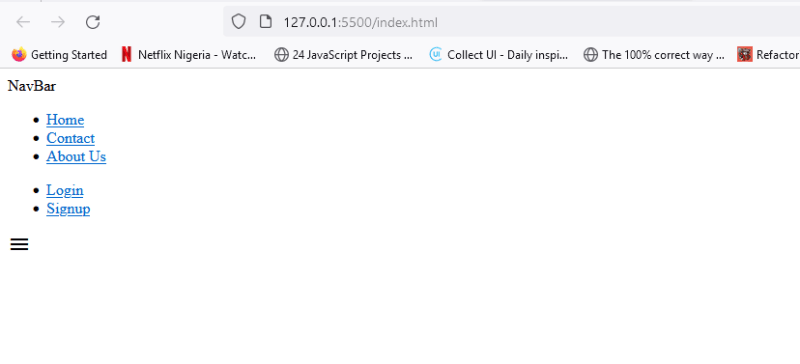
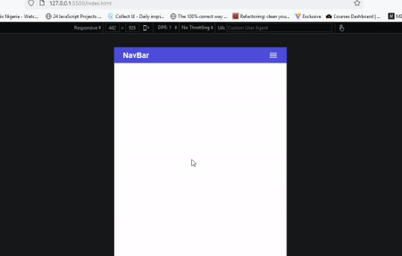

Навигационные панели - это важные компоненты, которые часто используются на веб-сайтах и в веб-приложениях. Как разработчик программного обеспечения, вы должны уметь создавать и настраивать их, будь то для себя или для клиентского проекта.

В этой статье вы узнаете, как создать простую мобильную отзывчивую панель навигации с помощью HTML, CSS и JavaScript. В этой статье предполагается, что вы обладаете базовыми знаниями HTML, CSS и JavaScript.

Давайте перейдем непосредственно к делу.

## Шаг 1 - Добавьте HTML-разметку

Прежде чем добавить HTML-разметку для нашей панели навигации, давайте импортируем значок гамбургера из иконок Google. Мы будем использовать значок гамбургера для переключения меню навигации на маленьких экранах.

Чтобы импортировать и использовать иконку гамбургера из Google, добавьте приведенный ниже фрагмент в начало HTML-файла:

```html
<link
	rel="stylesheet"
	href="https://fonts.googleapis.com/css2?family=Material+Symbols+Outlined:opsz,wght,FILL,GRAD@24,400,0,0"
/>
```

Далее добавьте приведенную ниже разметку в ваш HTML-файл. Я объясню ее позже.

```html
<header class="header">
	<!-- Header section -->
	<div class="nav-container">
		<!-- Navigation container -->
		<span class="logo">NavBar</span>
		<!-- Logo -->

		<nav class="nav">
			<!-- Navigation -->
			<ul class="nav--ul__one">
				<!-- First navigation list -->
				<li class="nav-link"><a href="#">Home</a></li>
				<!-- Home link -->
				<li class="nav-link"><a href="#">Contact</a></li>
				<!-- Contact link -->
				<li class="nav-link"><a href="#">О нас</a></li>
				<!-- About us link -->
			</ul>

			<ul class="nav--ul__two">
				<!-- Second navigation list -->
				<li class="nav-link"><a href="#">Login</a></li>
				<!-- Login link -->
				<li class="nav-link"><a href="#">Signup</a></li>
				<!-- Signup link -->
			</ul>
		</nav>

		<span class="hamburger-menu material-symbols-outlined">menu</span>
		<!-- Hamburger menu icon -->
	</div>
</header>
```

HTML-разметка состоит из следующих элементов:

Элемент `<header>` с классом `header`, который оборачивает все элементы.  
Внутри `header` находится контейнер `div` с классом `nav-container`. Этот `div` оборачивает `логотип`, навигационные ссылки и меню гамбургера.  
Элемент `<span>` с классом `logo`.  
Элемент `<nav>` с классом `nav` в качестве основного навигационного контейнера. Этот контейнер содержит навигационные ссылки и иконку гамбургер-меню.  
Внутри `<nav>` есть два списка навигационных ссылок, каждый из которых представлен элементом `<ul>` с классом `nav--ul__one` и `nav--ul__two` соответственно.  
У вас есть еще один элемент `<span>` с классом `hamburger-menu` и классом иконок `material-symbols-outlined`, который представляет иконку меню гамбургера.

Вот результат:



Теперь давайте добавим несколько стилей, чтобы сделать нашу панель навигации визуально привлекательной.

## Шаг 2 - Стиль панели навигации

Начнем с того, что сбросим стандартные отступы и поля для каждого элемента страницы, а также добавим несколько базовых стилей к нескольким элементам.

```css
/* Reset CSS */
/* Set box-sizing property to border-box */
/* Set padding and margin to 0 */
* {
	box-sizing: border-box;
	padding: 0;
	margin: 0;
}

/* Set font family to Arial, Helvetica, sans-serif */
body {
	font-family: Arial, Helvetica, sans-serif;
}

/* Remove default bullet points from unordered lists */
ul {
	list-style: none;
}

/* Remove default underline and set text color to inherit */
a {
	text-decoration: none;
	color: inherit;
}
```

Теперь, когда мы закончили с базовой стилизацией, давайте сосредоточимся на стилизации самой панели навигации.

### Стили навигационного меню

Вот разметка для стилизации навигации:

```css
/* Header styles */
header {
	background: #4d4ddb; /* Background color */
	color: white; /* Text color */
	padding: 0.5rem 0; /* Top and bottom padding */
}

/* Navigation container styles */
.nav-container {
	display: flex; /* Use flexbox */
	align-items: center; /* Center align items vertically */
	justify-content: space-between; /* Space items evenly horizontally */
	width: 90%; /* Set width to 90% of parent container */
	margin: 0 auto; /* Center horizontally */
}

/* Logo styles */
.nav-container .logo {
	font-size: 2rem; /* Set font size */
	font-weight: bold; /* Set font weight */
}

/* Navigation styles */
.nav {
	display: flex; /* Use flexbox */
	flex-grow: 1; /* Allow navigation to grow to fill available space */
}

/* First navigation list styles */
.nav--ul__one {
	margin: 0 auto; /* Center horizontally */
}

/* Common styles for navigation container and lists */
.nav-container,
.nav--ul__one,
.nav--ul__two {
	display: flex; /* Use flexbox */
	gap: 1.6rem; /* Set gap between items */
	font-size: 1.2rem; /* Set font size */
}

/* Hamburger menu styles */
.hamburger-menu {
	display: none; /* Hide by default for larger screens */
	cursor: pointer; /* Set cursor to pointer */
}
```

Наша панель навигации будет выглядеть следующим образом:


Далее давайте добавим несколько медиа-запросов, чтобы сделать нашу панель навигации мобильно отзывчивой.

```css
/* 
   Media query for screen width less than or equal to 700px
   - Adjusts the styles for navigation elements
*/

@media (max-width: 700px) {
	/* Increase font size and z-index for the logo */
	.nav-container .logo {
		font-size: 1.2rem;
		z-index: 2;
	}

	/* Change the flex direction and gap for the navigation */
	.nav {
		flex-direction: column;
		gap: 2rem;
	}

	/* Change the flex direction and gap for the nested unordered lists */
	.nav--ul__one,
	.nav--ul__two {
		flex-direction: column;
		gap: 0.6rem;
	}

	/* Display the hamburger menu */
	.hamburger-menu {
		display: block;
		z-index: 2;
	}

	/* Position the navigation absolutely and hide it off-screen */
	.nav {
		position: absolute;
		top: 0;
		right: -100%;
		bottom: 0;
		width: 100%;
		padding-top: 6rem;
		align-items: center;
		text-align: center;
		background-color: #4d4ddb;
		color: white;
		transition: 0.15s ease-in-out;
	}

	/* Show the navigation by moving it to the right */
	.nav.active {
		right: 0;
	}
}
```

Во-первых, это упорядочивает элементы на маленьких экранах, а главное, делает `nav` выдвигающейся справа, когда она активна, но, конечно, это не функционально. мы сделаем это дальше.

Вот результат на данный момент:


Теперь давайте поработаем над функциональностью в следующем разделе.

## Шаг 3 - Добавление функциональности JavaScript

Вот шаги, которые мы используем для добавления функциональности javascript в панель навигации:

Получите ссылки на `hamburger-menu` и `nav`.

Добавьте слушателя события click к `hamburger-menu`.

Переключите класс `active` на `nav`, чтобы показать/скрыть его

```js
const hamburgerMenu = document.querySelector('.hamburger-menu');
const nav = document.querySelector('.nav');

hamburgerMenu.addEventListener('click', () => {
	nav.classList.toggle('active');
});
```

При нажатии на `гамбургер-меню` происходит переключение видимости меню путем добавления или удаления класса `active`.

Конечный результат:


Таким образом, вы успешно создали мобильную отзывчивую панель навигации, используя только HTML, CSS и JavaScript.

## Заключение

Я искренне надеюсь, что этот пост показался вам интересным и полезным. Если да, пожалуйста, отреагируйте на него и поделитесь со своими друзьями или подпишитесь на мой аккаунт, чтобы не пропустить ни одной публикации в будущем. Спасибо за чтение.
