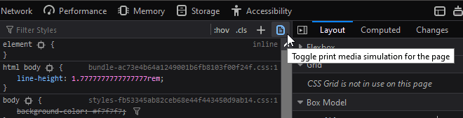
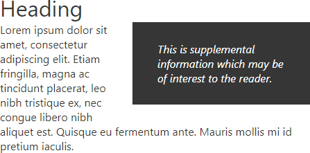
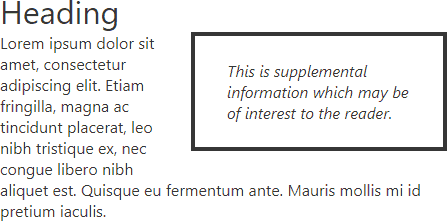
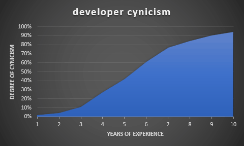
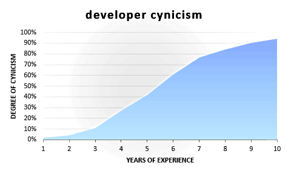

В этой статье мы рассмотрим искусство создания удобных для печати веб-страниц с помощью CSS.

## Зачем нужен CSS для печати?

"Кто печатает веб-страницы?" спросите вы! Относительно небольшое количество страниц будет когда-либо воспроизведено на бумаге. Но подумайте:

- печать проездных билетов или билетов на концерт
- воспроизведение маршрутных направлений или расписаний
- сохранение копии для автономного чтения
- доступ к информации в местах с плохой связью
- использование данных в опасных или грязных условиях - например, на кухне или на заводе
- вывод чернового содержимого для письменных примечаний
- печать веб-квитанций для ведения бухгалтерского учета
- предоставление документов людям с ограниченными возможностями, которым трудно пользоваться экраном
- печать страницы для вашего коллеги, который отказывается пользоваться этой новомодной интернетной ерундой.

К сожалению, печать страниц может быть очень неприятной:

- текст может быть слишком мелким, слишком крупным или слишком тусклым
- колонки могут быть слишком узкими, слишком широкими или выходить за поля страницы
- разделы могут быть обрезаны или полностью исчезнуть
- чернила тратятся на ненужные цветные фоны и изображения
- URL-адреса ссылок не видны
- печатаются значки, меню и рекламные объявления, на которые никогда нельзя нажать!

Многие разработчики выступают за доступность веб-сайтов, но мало кто помнит о том, чтобы сделать доступным и печатный веб-ресурс!

Преобразование отзывчивых, непрерывных носителей в бумажные страницы любого размера и ориентации может оказаться непростой задачей. Однако управление печатью с помощью CSS возможно уже много лет, а базовая таблица стилей может быть создана за несколько часов. В следующих разделах описаны хорошо поддерживаемые и практичные варианты того, как сделать ваши страницы удобными для печати.

## Таблицы стилей для печати

Печатные CSS могут быть:

- Применяться в дополнение к экранным стилям. Если за основу взяты стили для экрана, то стили для принтера при необходимости изменяют эти значения по умолчанию.
- Применяться как отдельные стили. Стили для экрана и печати полностью разделены; оба они начинаются со стилей браузера по умолчанию.

Выбор зависит от вашего сайта/приложения. Лично я чаще всего использую экранные стили в качестве основы для печати. Однако я использовал отдельные таблицы стилей для приложений с радикально разными результатами - например, для системы бронирования сеансов конференций, которая отображала сетку расписания на экране, но хронологическое расписание на бумаге.

Таблицу стилей для печати можно добавить в HTML `<head>` после стандартной таблицы стилей:

`html<link rel="stylesheet" href="main.css" /> <link rel="stylesheet" media="print" href="print.css" />`.

Стили `print.css` будут применяться в дополнение к стилям экрана при печати страницы.

Чтобы разделить экранные и печатные носители, `main.css` должен быть предназначен только для экрана:

`<link rel="stylesheet" media="screen" href="main.css" /> <link rel="stylesheet" media="print" href="print.css" />`.

Кроме того, стили печати можно включить в существующий CSS-файл с помощью правил `@media`. Например:

`body { margin: 2em; color: #fff; background-color: #000; }  @media print { body { margin: 0; color: #000; background-color: #fff; }  }`

Можно добавить любое количество правил `@media print`, так что это может быть удобно для хранения связанных стилей вместе. При необходимости правила для экрана и печати также можно разделить:

`@media screen { body { margin: 2em; color: #fff; background-color: #000; }  }  @media print { body { margin: 0; color: #000; background-color: #fff; }  }`

## Тестирование вывода на принтер

Нет необходимости убивать деревья и расходовать дорогостоящие чернила каждый раз, когда вы хотите протестировать свой макет печати! Следующие опции воспроизводят стили печати на экране.

### Предварительный просмотр печати

Самый надежный вариант - предварительный просмотр печати в браузере. Он показывает, как будут обрабатываться разрывы страниц при использовании формата бумаги по умолчанию.

Кроме того, вы можете сохранить или просмотреть страницу, экспортировав ее в PDF.

### Инструменты разработчика

Инструменты разработчика (F12 или Cmd/Ctrl + Shift + I) могут эмулировать стили печати, хотя разрывы страниц при этом не будут отображаться.

В Chrome откройте Инструменты разработчика и выберите Дополнительные инструменты, затем Рендеринг из меню с тремя точками в правом верхнем углу. В нижней части этой панели измените параметр Emulate CSS Media на print.

В Firefox откройте Инструменты разработчика и щелкните значок Toggle print media simulation на панели стилей вкладки Inspector:



## Взломать атрибут медиа

Предполагая, что вы используете тег `<link>` для загрузки CSS принтера, вы можете временно изменить атрибут `media` на `screen`:

`<link rel="stylesheet" href="main.css" /> <link rel="stylesheet" media="screen" href="print.css" />`.

Опять же, это не покажет разрывы страниц. Не забудьте вернуть атрибуту значение `media="print"`, когда закончите тестирование.

## Удалите ненужные разделы

Прежде чем делать что-либо еще, удалите и сверните ненужный контент с помощью `display: none;`. Типичными ненужными разделами на бумаге могут быть навигационные меню, изображения героев, верхние и нижние колонтитулы, формы, боковые панели, виджеты социальных сетей и рекламные блоки (обычно все, что находится в `iframe`):

`header, footer, aside, nav, form, iframe, .menu`,.hero, .adslot { display: none; }`

Использование `display: none !important;` может потребоваться, если CSS или JavaScript-функции отображают элементы в соответствии с определенными состояниями пользовательского интерфейса. Обычно использовать `!important' не рекомендуется, но мы можем оправдать его применение в базовом наборе стилей принтера, которые отменяют экранные настройки по умолчанию.

## Линеаризация макета

Мне больно это говорить, но Flexbox и Grid редко хорошо сочетаются с макетами принтеров в любом браузере. Если вы столкнулись с проблемами, подумайте об использовании `display: block;` или аналогичного параметра для полей макета и измените размеры по мере необходимости. Например, установите `width: 100%;`, чтобы охватить всю ширину страницы.

## Стилизация принтера

Теперь можно применять стилизацию под принтер. Рекомендации:

убедитесь, что вы используете темный текст на белом фоне
рассмотрите возможность использования шрифта с засечками, который будет легче читать
установите размер текста на `12pt` или выше
при необходимости измените отступы и поля. Стандартные единицы измерения `см`, `мм` или `дюймы` могут быть более практичными.

Другие предложения включают ...

## Переход на столбцы CSS

Стандартная бумага формата A4 и US Letter может привести к появлению длинных и менее читабельных строк текста. Рассмотрите возможность использования колонок CSS в печатных макетах. Например:

`article { column-width: 17em; column-gap: 3em; }`

В этом примере колонки будут созданы при наличии не менее `37em` горизонтального пространства. Нет необходимости задавать медиазапросы; дополнительные колонки будут добавлены на более широкой бумаге.

## Используйте границы вместо фоновых цветов

В вашем шаблоне могут быть разделы или поля для вызова, обозначенные более темными или обратными цветовыми схемами:



Чтобы сэкономить чернила, обозначьте эти элементы рамкой:



## Удаление или инвертирование изображений

Пользователи не захотят печатать декоративные и несущественные изображения и фоны. Можно предусмотреть, чтобы по умолчанию все изображения были скрыты, если они не имеют класса `print`:

```css
* {
	background-image: none !important;
}
img,
svg {
	display: none !important;
}
img.print,
svg.print {
	display: block;
	max-width: 100%;
}
```

В идеале печатные изображения должны иметь темные цвета на светлом фоне. Можно изменить цвета HTML-вложенных SVG в CSS, но будут ситуации, когда у вас будут более темные растровые изображения:



Для инвертирования и корректировки цветов в таблице стилей печати можно использовать CSS-фильтр. Например:

```css
img.dark {
	filter: invert(100%) hue-rotate(180deg) brightness(120%) contrast(150%);
}
```

Результат:



Добавьте дополнительный контент

Печатные издания часто требуют дополнительной информации, которая не нужна на экране. Свойство CSS `content` может быть использовано для добавления текста к псевдоэлементам `::before` и `::after`. Например, отобразите URL-адрес ссылки в скобках после текста:

`a::after { content: " (" attr(href) ")"; }`

Или вы можете добавить сообщения, предназначенные только для печати:

`main::after { content: "Copyright site.com"; display: block; text-align: center; }`

Для более сложных ситуаций рассмотрите возможность использования класса `print` для элементов, которые должны быть видны только при печати. Например:

`<p class="print">Статья напечатана в 13:23 5 сентября 2020 года. Последняя версия на сайте https://site.com/page.`

CSS:

`.print { display: none; }  @media print { .print { display: block; }  }`

Примечание: большинство браузеров отображают URL и текущую дату/время в заголовке и/или нижнем колонтитуле печатаемой страницы, поэтому редко возникает необходимость генерировать эту информацию в коде.

## Разрывы страниц

CSS3-свойства `break-before` и `break-after` позволяют контролировать поведение разрывов страниц, колонок или областей до и после элемента. Поддерживается отлично, но старые браузеры могут использовать аналогичные свойства `page-break-before` и `page-break-after`.

Можно использовать следующие значения `break-before` и `break-after`:

`auto`: по умолчанию - разрыв разрешен, но не принудительный
`avoid`: не допускать разрыва на странице, в колонке или регионе
`avoid-page`: избегать разрыва страницы
`page`: принудительный разрыв страницы
`always`: псевдоним `page`.
`left`: принудительно разрывать страницы, чтобы следующей была левая страница
`right`: принудительно разрывать страницы, чтобы следующей была правая страница

Пример: принудительный разрыв страницы непосредственно перед любым заголовком `<h1>`:

`h1 { break-before: always; }`.

Примечание: остерегайтесь чрезмерного использования разрывов страниц. В идеале при выводе на принтер должно использоваться как можно меньше страниц.

Свойство `break-inside` (и более старое `page-break-inside`) определяет, разрешен ли разрыв страницы внутри элемента. Обычно поддерживаются следующие значения:

`auto`: по умолчанию - разрыв разрешен, но не принудительный
`avoid`: по возможности избегать внутреннего разрыва
`avoid-page`: по возможности избегать внутреннего разрыва страницы

Это может быть предпочтительнее, чем указание разрывов страниц, поскольку вы можете использовать как можно меньше бумаги, избегая разрывов страниц в сгруппированных данных, таких как таблицы или изображения:

`table, img, svg { break-inside: avoid; }`.

Свойство `widows` задает минимальное значениеm количество строк в блоке, которое должно быть показано в верхней части страницы. Представьте себе блок с пятью строками текста. Браузер хочет сделать разрыв страницы после четвертой строки, чтобы последняя строка отображалась в верхней части следующей страницы. Установка `widows: 3;` разрывает страницу на второй строке или перед ней, поэтому на следующую страницу переносится не менее трех строк.

Свойство `orphans` аналогично `widows`, за исключением того, что оно управляет минимальным количеством строк, которые должны отображаться внизу страницы.

Свойство `box-decoration-break` управляет границами элементов на разных страницах. Когда элемент с границей имеет внутренний разрыв страницы:

`lice`: по умолчанию, разделяет макет. Верхняя граница отображается на первой странице, а нижняя - на второй.  
`clone`: дублирует поля, подложки и границы. Все четыре границы отображаются на обеих страницах.

Наконец, CSS Paged Media (`@page`) имеет ограниченную поддержку в браузерах, но предоставляет возможность нацеливания на определенные страницы, чтобы можно было определить альтернативные поля или разрывы:

`@page { margin: 2cm; }  @page :first { margin-top: 6cm; }  @page :left { margin-right: 4cm; }  @page :right { margin-left: 4cm; }`

Свойства разрыва страницы CSS можно поместить в стили `screen` или `print`, поскольку они влияют только на печать, но я рекомендую использовать их в CSS для печати для ясности.

Имейте в виду, что управление разрывом страницы - это не более чем предложение браузеру. Нет никакой гарантии, что разрыв будет принудительным или предотвращенным, поскольку верстка ограничена рамками бумаги.

## Боли при печати

Контроль над печатью веб-медиа всегда будет ограничен, и результаты могут отличаться в разных браузерах. Тем не менее:

- таблицы стилей, удобные для печати, можно установить на любой сайт
- большинство стилей для печати будут работать в большинстве браузеров
- стили печати не влияют на существующую функциональность и не нарушают ее
- затраты на разработку минимальны.

Добавив несколько разрывов страниц и удалив ненужные разделы, вы порадуете пользователей и поднимете свой сайт над конкурентами. Добавьте это в свой список дел!
