Как загрузить и установить Python 3 для Mac

## ШАГ 1

Перейдите на страницу загрузки Python. Выберите последнюю версию Python 3.

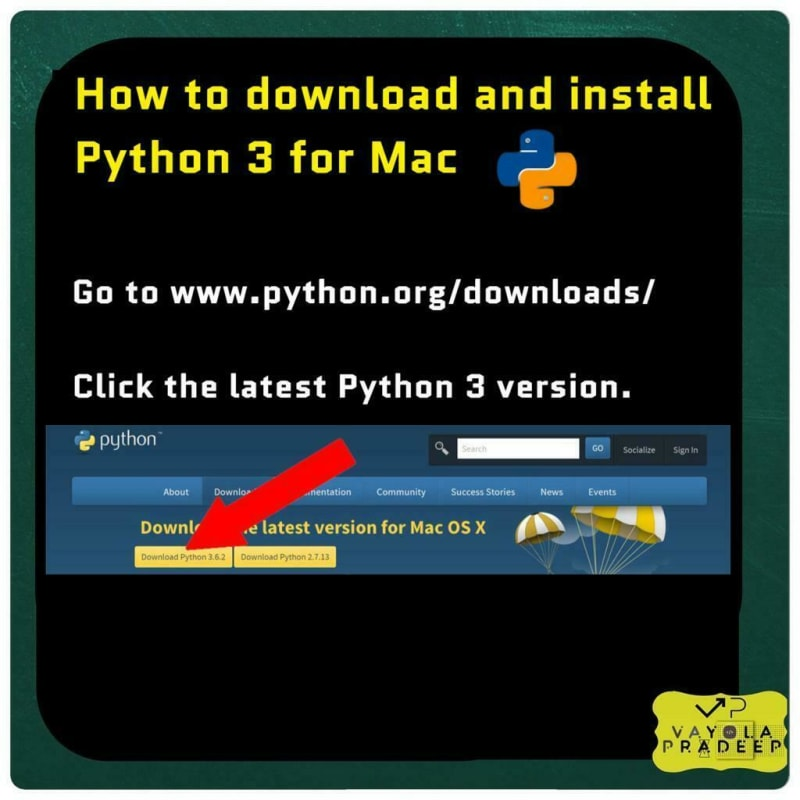

## ШАГ 2

Когда файл загрузится, дважды щелкните значок Finder в левом нижнем углу экрана

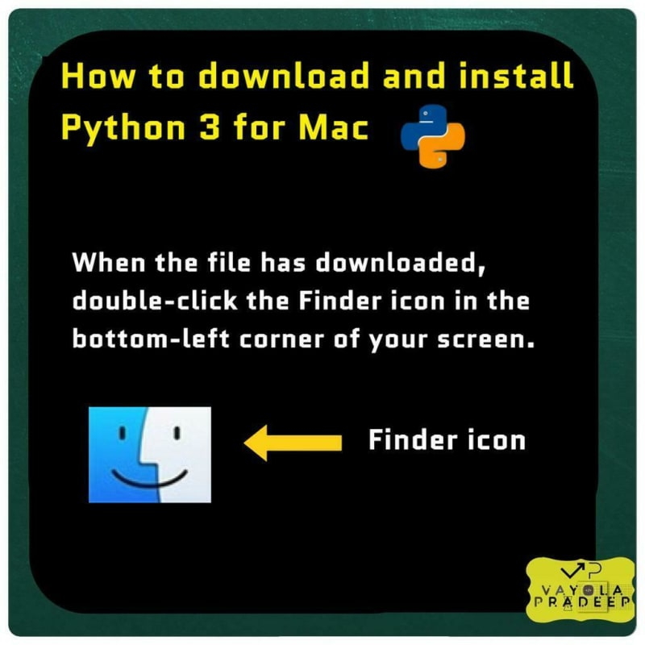

## ШАГ 3

Нажмите кнопку Загрузки.

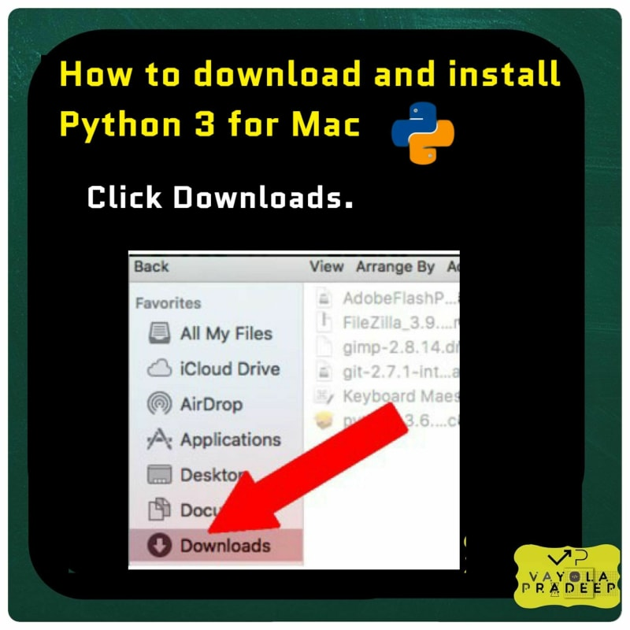

## ШАГ 4

Дважды щелкните на установочном файле Python 3, который вы только что загрузили.

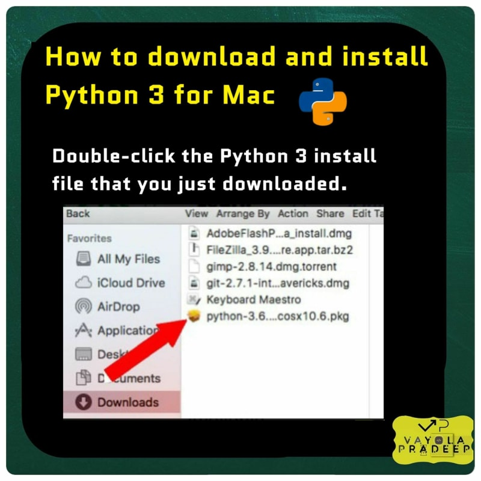

## ШАГ 5

Продолжайте нажимать кнопку Продолжить, проходя через ряд информационных и юридических экранов.

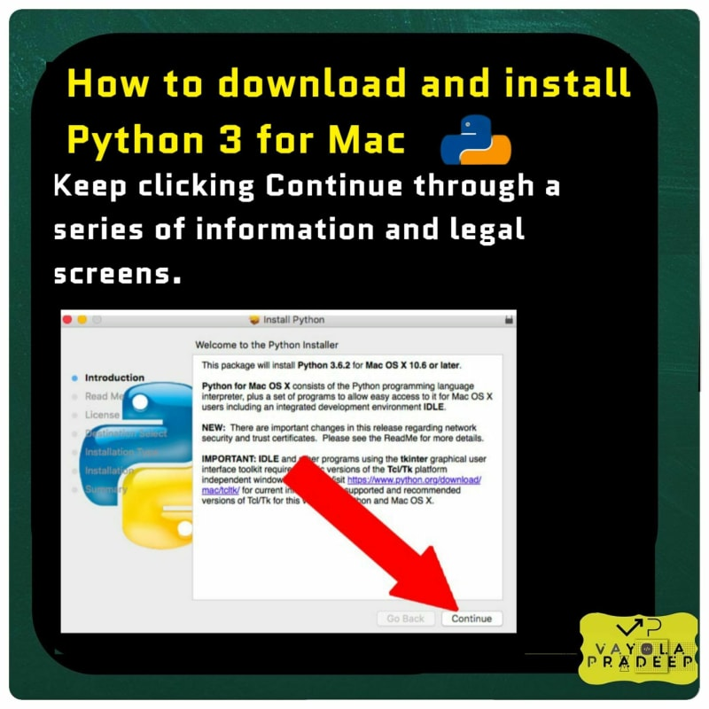

## ШАГ 6

Нажмите кнопку Согласен с условиями лицензирования.

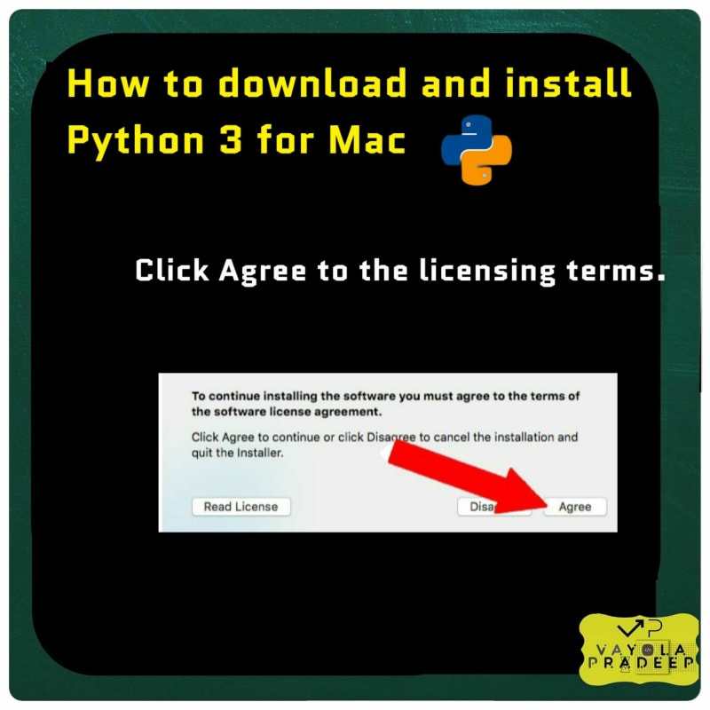

## ШАГ 7

Нажмите кнопку Установить.

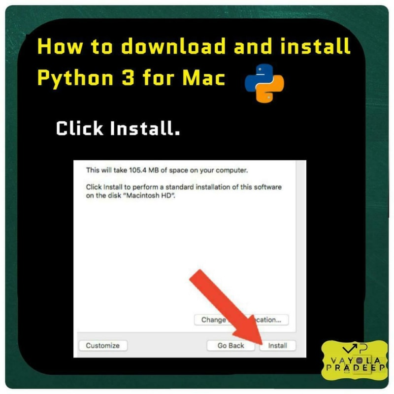

## ШАГ 8

Введите имя и пароль для вашего Mac, затем нажмите Установить программное обеспечение.

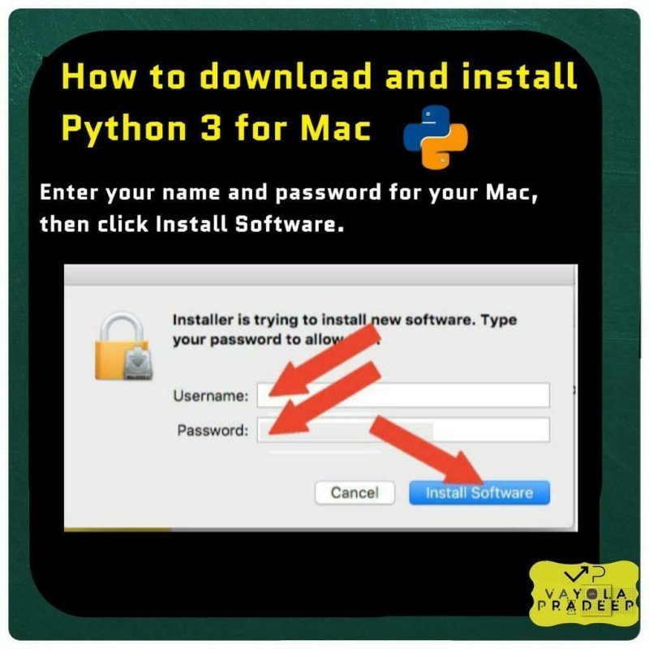

## ШАГ 9

После завершения установки нажмите Закрыть.

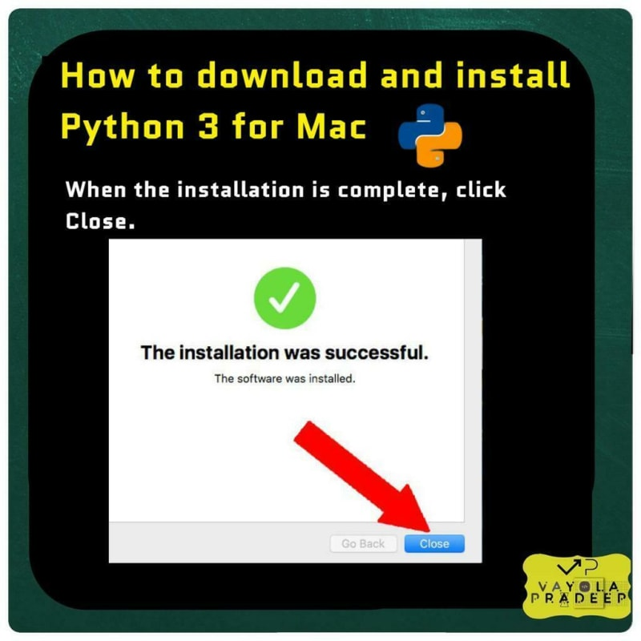

## ШАГ 10

Чтобы убедиться, что Python установлен правильно, дважды щелкните значок Finder в левом нижнем углу экрана.

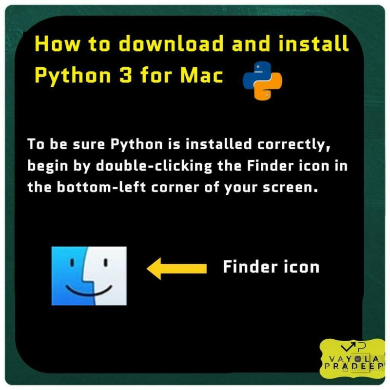

## ШАГ 11

Нажмите Приложения.

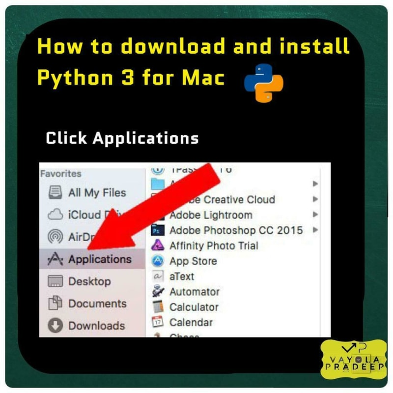

## ШАГ 12

На правой панели отображаются все приложения. Прокрутите вниз и нажмите Utilities (Утилиты).

## ШАГ 13

Когда откроется третья панель, найдите Терминал в самом низу. Нажмите на него

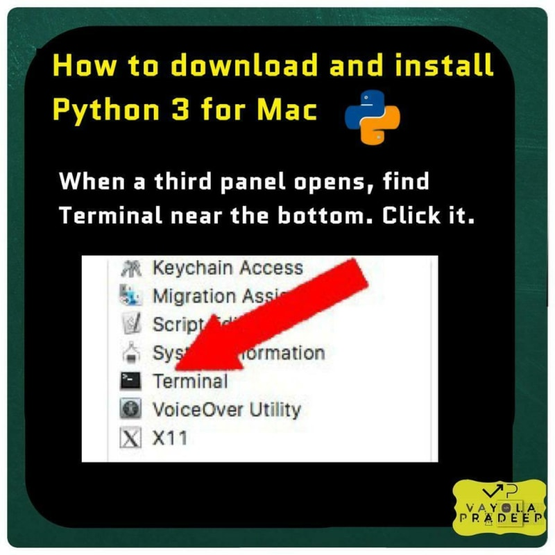

## ШАГ 14

Когда откроется окно терминала, введите python3.

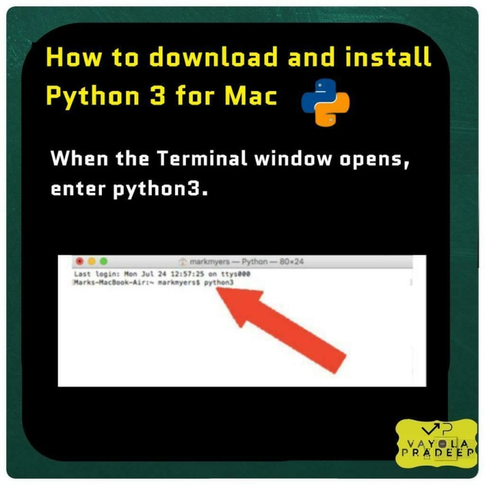

## ШАГ 15

Если отображается информация о версии Python, которую вы загрузили, значит, установка выполнена правильно.

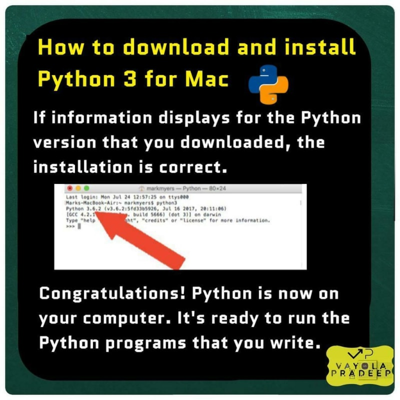

Поздравляем! Теперь Python установлен на вашем компьютере. Он готов к выполнению программ на Python, которые вы пишете.
