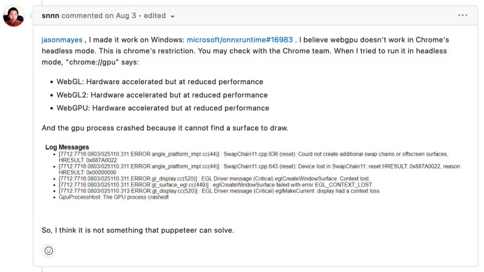
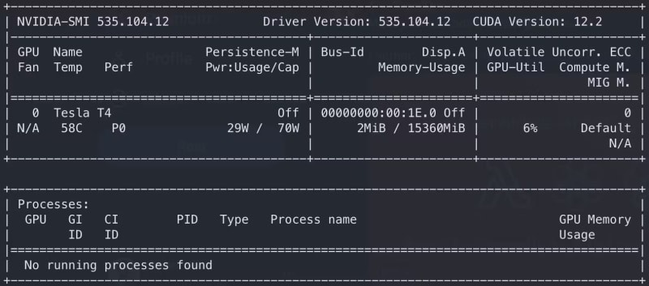
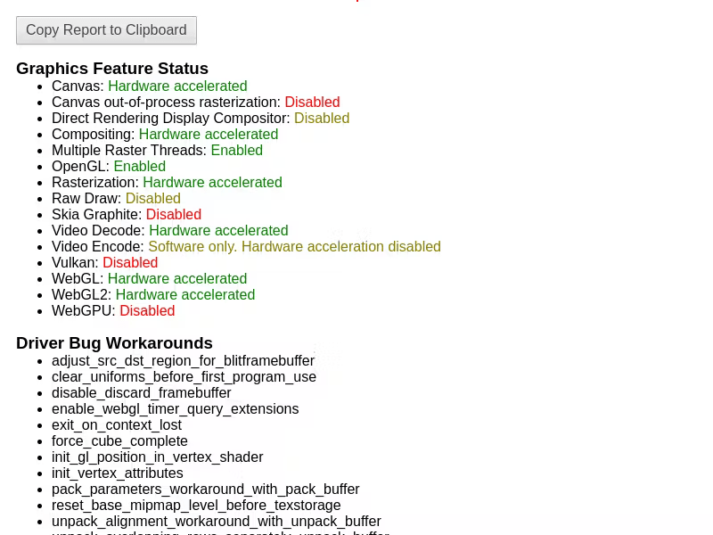

Как мы повысили производительность Remotion благодаря рендерингу на стороне сервера с GPU-ускорением

Запуск Google Chrome с аппаратным ускорением в режиме headless может оказаться сложнее, чем кажется. Мы отправились в это путешествие с Remotion, который является отличным фреймворком, позволяющим разработчикам ”делать видео программно". По пути мы изучили различные версии драйверов Nvidia, в том числе с сайта Nvidia и из официальных репозиториев Ubuntu.

Мы сотрудничали с активным сообществом разработчиков Remotion Open-source, чтобы найти ответ на вопрос об использовании GPU с Remotion для рендеринга на стороне сервера. Встретив на своем пути несколько неудач, мы в конце концов смогли заставить Remotion работать. Мы объединили наши находки в документах Remotion в разделе ”Использование GPU в облаке" и упростили инструкции для разработчиков Remotion, чтобы они могли извлечь из этого максимум пользы. Хотя все исследование было проведено для Remotion, этот же процесс подойдет для любого приложения, требующего мощности GPU, особенно в режиме headless.

## Аппаратное ускорение в браузерном рендеринге

Аппаратное ускорение для вашего браузера - это то же самое, что ”азотное топливо" для бензинового автомобиля. Оно использует возможности специализированного оборудования, например графических процессоров, чтобы веб-страницы загружались быстрее, а видео воспроизводилось плавно. Аппаратное ускорение улучшает процесс отображения веб-страницы, называемый рендерингом. В результате веб-страницы загружаются более плавно и быстро.

### DLAMI из Marketplace?

Кто-то может удивиться, почему мы не выбрали AWS Deep Learning AMI или DLAMI. Но нам нужен был тонкий контроль над драйверами и утилитами GPU, и устаревший DLAMI, несмотря на все нагромождения, не подходил. Такие задачи часто сложно решить с помощью готовых AMI, о чем мы рассказывали в статье ”Почему Deep Learning AMI сдерживает вас". Настройка среды в соответствии с нашими требованиями также помогла нам эффективно устранять неполадки.

Мы экспериментировали с несколькими пакетами, чтобы определить ключевые, необходимые для распознавания GPU в Google Chrome. Несмотря на все эти усилия, распознавание GPU оставалось неуловимым, а в некоторых случаях драйверы GPU выходили из строя даже при инициализации. Долгий и трудный путь привел нас к концу туннеля, но тьма не рассеивается, а решение остается таким же труднодостижимым, как и прежде. Когда мы решили на этом закончить, мы наткнулись на эту тему на Github проблем Puppeteer, которая не дала нам никакой надежды, но дала нам новую перспективу и стремление к достижению нашей цели.



## Свежий старт

Пришло время вернуться к чертежной доске и начать все заново. Мы начали с чистой базовой Ubuntu AMI на AWS EC2 Instance. После этого мы скачали и установили драйверы Nvidia Tesla T4G с официального сайта Nvidia.

Убедившись, что GPU работает правильно с помощью `nvidia-smi`, мы установили Google Chrome и протестировали его на аппаратное ускорение, к нашему облегчению Google Chrome наконец-то дал добро на работу с аппаратным ускорением.

## Запуск экземпляра EC2

Запуск экземпляра EC2 может быть осуществлен различными способами, среди которых выделяются веб-консоль AWS и AWS CLI. Независимо от способа, важными параметрами являются тип экземпляра и выбор AMI. На момент написания статьи идентификатор AMI для выбранного нами экземпляра `g4dn.xlarge` - `ami-053b0d53c279acc90`. Для запуска экземпляра EC2 через `aws-cli` можно использовать следующую команду, заменив пропуски на реальные значения.

```bash
aws ec2 run-instances \
    --instance-initiated-shutdown-behavior "terminate" \
    --image-id "ami-053b0d53c279acc90" \
    --instance-type "g4dn.xlarge" \
    --key-name "<KEY_NAME>" \
    --subnet-id "<SUBNET_ID>" \
    --security-group-ids "<SECURITY_GROUP_ID>" \
    -iam-instance-profile Arn="<ARN>" \
    --block-device-mappings '[ { "DeviceName": "/dev/sda1", "Ebs": { "VolumeSize": 8, "VolumeType": "gp3" } } ]'
```

## Обновление Ubuntu

Ubuntu 22.04 AMI `ami-053b0d53c279acc90` на AWS поставляется с ядром Linux `v5` (конкретно `5.19.0-1025-aws`). На данный момент у нас есть два варианта: либо мы остаемся с ядром `v5`, либо обновляем его до `v6` (`v6.2.0-1013-aws`), мы решили обновить ядро. Это решение очень важно, так как драйвер Nvidia, скомпилированный для одной версии, не будет работать для другой.

После запуска экземпляра подключитесь к нему по SSH и запустите процесс обновления пакетов Ubuntu. Чтобы обновить все установленные пакеты, включая ядро Linux, выполните следующую команду.

```bash
sudo bash -c "apt update && export DEBIAN_FRONTEND=noninteractive && export NEEDRESTART_MODE=a && apt upgrade -y && reboot"
```

Мы также можем разделить `apt update`, `apt upgrade -y` и `reboot`. Но причина в том, чтобы установить эти обновления в неинтерактивном режиме.

После выполнения система перезагрузится с ядром Linux версии 6. Мы можем подтвердить обновление ядра с помощью `uname -r`. Перезагрузка - это essВажно при обновлении системы Ubuntu, поскольку при следующей загрузке загружается новое ядро, а драйверы Nvidia впоследствии будут созданы для обновленной версии.

## Установка драйверов Nvidia GPU

Процесс установки драйверов GPU прост, если у нас есть правильный драйвер для GPU и соответствующая совместимая версия. Перед началом установки нам необходимо установить несколько пакетов: `build-essential` и `libvulkan1` . Первый представляет собой пакет с различными инструментами компиляции, необходимыми для компиляции драйвера Nvidia. Вторая, хотя и не является обязательной, требуется Google Chrome. Поэтому нелишним будет установить его заранее, чтобы включить поддержку загрузчика Vulkan ICD для Nvidia, если она понадобится нам в будущем.

```bash
sudo apt install -y build-essential libvulkan1
```

После установки инструментов сборки мы можем перейти к загрузке и установке драйверов GPU с помощью следующих команд:

```bash
DRIVER_URL="https://us.download.nvidia.com/tesla/535.104.12/NVIDIA-Linux-x86_64-535.104.12.run" DRIVER_NAME="NVIDIA-Linux-driver.run" wget -O "$DRIVER_NAME" "$DRIVER_URL" sudo sh "$DRIVER_NAME" --disable-nouveau --silent rm "$DRIVER_NAME"
```

Теперь мы можем запустить `nvidia-smi`, чтобы подтвердить установку драйверов GPU. Результат будет выглядеть примерно так:



## Настройка службы запуска

Мы узнали об этом нелегким путем: однократный запуск `nvidia-smi` необходим для правильной инициализации `EGL` и `ANGLE`. Google Chrome и Chromium не могут инициализировать `EGL` без этой предварительной настройки. Чтобы автоматизировать этот процесс, мы создадим службу, которая будет запускать `nvidia-smi` во время загрузки, используя следующие команды:

```bash
echo '[Unit] Description=Run nvidia-smi at system startup [Service] ExecStart=/usr/bin/nvidia-smi Type=oneshot RemainAfterExit=yes [Install] WantedBy=multi-user.target' | sudo tee /etc/systemd/system/nvidia-smi.service sudo systemctl enable nvidia-smi.service sudo systemctl start nvidia-smi.service
```

## Тестирование установки

Чтобы протестировать аппаратное ускорение в Google Chrome или Chromium, мы можем выполнить следующие шаги. Стоит отметить, что Google Chrome имеет больше зависимостей, что делает его более простым выбором, если мы планируем использовать библиотеку Node.js, Puppeteer.

С другой стороны, Chromium - это облегченный вариант с меньшим количеством зависимостей, но мы все равно можем использовать Puppeteer с Chromium, установив несколько дополнительных зависимостей.

### Chromium

```bash
sudo apt install -y chromium-browser
```

```bash
chromium-browser --headless --use-gl=angle \ --use-angle=gl-egl --use-cmd-decoder=passthrough \ --print-to-pdf=output.pdf 'chrome://gpu'
```

Чтобы использовать Puppeteer с Chromium вместо Google Chrome, необходимо установить несколько дополнительных зависимостей.

```bash
sudo apt install ca-certificates fonts-liberation \ libasound2 libatk-bridge2.0-0 libatk1.0-0 libc6 \ libcairo2 libcups2 libdbus-1-3 libexpat1 libfontconfig1 \ libgbm1 libgcc1 libglib2.0-0 libgtk-3-0 libnspr4 libnss3 \ libpango-1.0-0 libpangocairo-1.0-0 libstdc++6 libx11-6 \ libx11-xcb1 libxcb1 libxcomposite1 libxcursor1 libxdamage1 \ libxext6 libxfixes3 libxi6 libxrandr2 libxrender1 libxss1 \ libxtst6 lsb-release wget xdg-utils
```

### Google Chrome

```bash
curl -fsSL https://dl.google.com/linux/linux_signing_key.pub | sudo gpg --dearmor -o /usr/share/keyrings/googlechrom-keyring.gpg echo "deb [arch=amd64 signed-by=/usr/share/keyrings/googlechrom-keyring.gpg] http://dl.google.com/linux/chrome/deb/ stable main" | sudo tee /etc/apt/sources.list.d/google-chrome.list sudo apt update sudo apt install -y google-chrome-stable
```

```bash
google-chrome-stable --headless --use-gl=angle \ --use-angle=gl-egl --use-cmd-decoder=passthrough \ --print-to-pdf=output.pdf 'chrome://gpu'
```

Приведенные выше команды создадут файл `output.pdf` и перенесут его на локальную машину, чтобы проверить состояние аппаратного ускорения в Google Chrome или Chromium. Если процесс прошел гладко, то полученный `PDF` будет выглядеть следующим образом.



## Работа с Puppeteer

Чтобы проверить ускорение GPU с помощью Node.js-библиотеки Puppeteer, выполните следующие действия:

Установите Node.js, так как чистый Ubuntu AMI не содержит лишних пакетов. Используйте следующие команды:

```bash
curl -fsSL https://deb.nodesource.com/gpgkey/nodesource-repo.gpg.key | sudo gpg --dearmor -o /etc/apt/keyrings/nodesource.gpg NODE_MAJOR=18 echo "deb [signed-by=/etc/apt/keyrings/nodesource.gpg] https://deb.nodesource.com/node_$NODE_MAJOR.x nodistro main" | sudo tee /etc/apt/sources.list.d/nodesource.list sudo apt update sudo apt install nodejs
```

После установки Node.js мы можем вЗапустите Puppeteer, выполнив команду `npm i puppeteer` в нашем каталоге кода. Вот пример файла `index.js` для проверки аппаратного ускорения:

```bash
const puppeteer = require('puppeteer'); (async () => { const browser = await puppeteer.launch({ headless: true, args: ['--use-gl=angle', '--use-angle=gl-egl'], }); const page = await browser.newPage(); await page.goto('chrome://gpu'); await page.waitForTimeout(2000); await page.screenshot({ path: 'output.png' }); await browser.close(); })();
```

Запустите скрипт с помощью `node index.js`. В результате будет сгенерирован файл `output.png`, содержащий информацию об аппаратном ускорении.

## Примечание от создателя

Мирза оказал огромную помощь сообществу “Remotion” в освоении рендеринга с GPU-ускорением.

Он изучил и написал о том, как правильно получить, настроить и запустить контейнеры EC2 и headless Chrome, чтобы воспользоваться преимуществами графического ускорения.

Эту область было особенно сложно взломать, и без Мирзы мы бы не смогли добиться огромного прироста скорости.

Мы очень благодарны ему за это!

--

Джонни Бургер

Создатель / Remotion.dev

Заключение

Благодаря аппаратному ускорению, которое теперь доступно в режиме headless, мы можем использовать мощь GPU для более быстрых и сложных задач рендеринга. Наши следующие шаги включают создание пользовательского AMI из этого экземпляра и оптимизацию процесса с помощью AWS Image Builder Pipelines для повышения эффективности. Кроме того, мы планируем распространить аппаратные возможности на контейнеры Docker, что еще больше расширит наши возможности.
