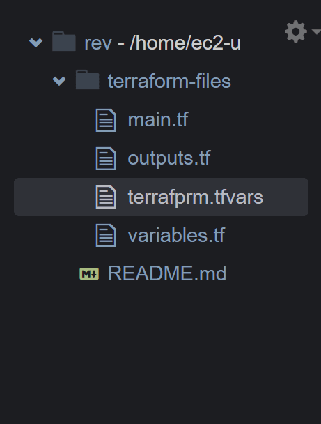
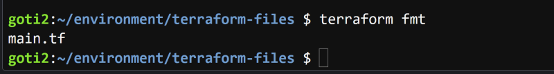
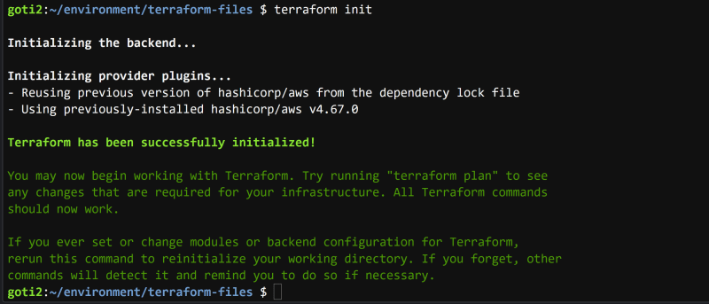
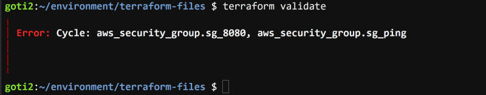
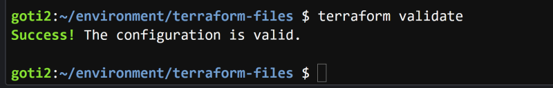
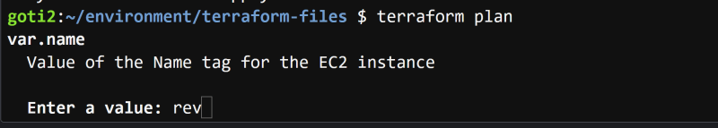
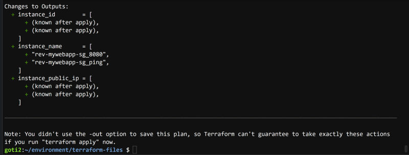
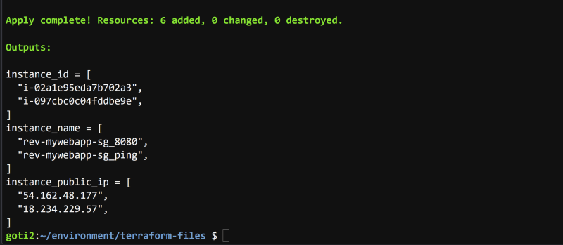
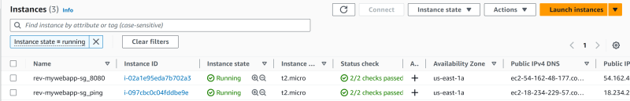
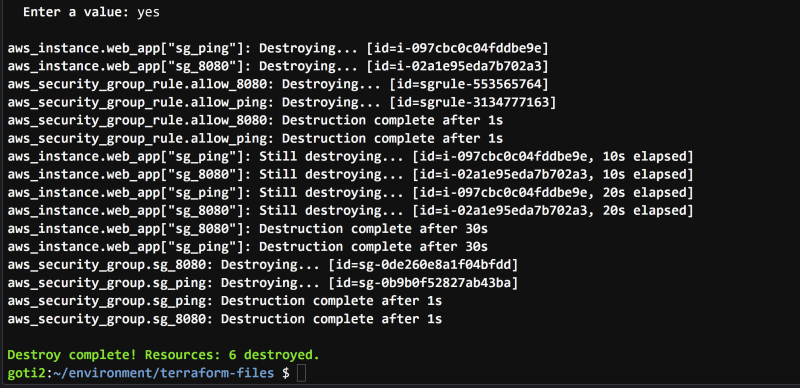

Ошибки цикла - это случаи круговой логики в дереве зависимостей Terraform. Terraform анализирует зависимости между ресурсами в конфигурации вашей инфраструктуры, чтобы определить порядок выполнения операций.

В этой статье я покажу, как возникает ошибка цикла, когда ресурсы aws_security_group ссылаются друг на друга в своих атрибутах security_groups. AWS не может создать группы безопасности, потому что их конфигурации ссылаются на другую группу, которая еще не существует.

Исправление этой ошибки цикла заключается в удалении взаимозависимых правил групп безопасности в вашей конфигурации, оставляя ресурсы двух групп без атрибутов входа.  
Вместо того чтобы включать правила в конфигурацию aws_security_group, используйте ресурс aws_security_group_rule и вместо него ссылайтесь на идентификаторы групп безопасности.  
Это позволит избежать ошибки цикла, поскольку провайдеру придется сначала создать оба ресурса aws_security_group без взаимозависимых правил.

Затем он создаст правила, а в последнюю очередь прикрепит правила к группам.

Пожалуйста, посетите мой репозиторий GitHub для статей по Terraform на различные темы, которые постоянно обновляются.

## Давайте приступим

1. Войдите в консоль управления AWS
2. Создайте инфраструктуру для блока ресурсов
3. В директории ресурсов terraform_files создайте 4 файла - `main.tf`, `variables.tf`, `outputs.tf` и `terrafprm.tfvars`.

4. Инициализация рабочей директории
5. Исправление ошибки цикла
6. Развернуть ресурсы

## 1. Войдите в консоль управления AWS

Убедитесь, что вы находитесь в регионе N. Virginia (us-east-1).

## 2. Создайте инфраструктуру для блока ресурсов

Создадим следующую организационную структуру, как показано ниже.



## 3. В каталоге ресурсов terraform_files создадим 4 файла - `main.tf`, `variables.tf`, `outputs.tf` и `terrafprm.tfvars`

```js
terraform { required_providers { aws = { source = "hashicorp/aws" version = "~> 4.23" } } required_version = ">= 0.14.9" } провайдер "aws" { region = var.region } data "aws_ami" "linux" { most_recent = true owners = ["amazon"] filter { name = "name" values = ["amzn2-ami-hvm-*-x86_64-gp2"] } } filter { name = "virtualization-type" values = ["hvm"] } } resource "aws_instance" "web_app" { for_each = local.security_groups ami = data.aws_ami.linux.id availability_zone = var.az_1a instance_type = var.instance_type vpc_security_group_ids = [each.value] user_data = <<-EOF #!/bin/bash echo "Hello, World" > index.html nohup busybox httpd -f -p 8080 & EOF tags = { Name = "${var.name}-mywebapp-${each.key}" } } ресурс "aws_security_group" "sg_ping" { name = "Allow Ping" vpc_id = "<DUMMY VALUE>" ingress { from_port = -1 to_port = -1 protocol = "icmp" security_groups = [aws_security_group.sg_8080.id] } } ресурс "aws_security_group" "sg_8080" { name = "Allow 8080" vpc_id = "<DUMMY VALUE>" ingress { from_port = 8080 to_port = 8080 protocol = "tcp" security_groups = [aws_security_group.sg_ping.id] } } locals { security_groups = { sg_ping = aws_security_group.sg_ping.id, sg_8080 = aws_security_group.sg_8080.id, }
```

переменная “region” { описание = ”регион" } переменная “name” { описание = "Значение тега Name для экземпляра EC2” } переменная “az_1a” { описание = "зона доступности 1” type = string default = “us-east-1a” } переменная “instance_type” { описание = "Значение тега Name для типа экземпляра EC2” type = string default = “t2.micro” }```.

`output "instance_id" { description = "ID экземпляра EC2" value = [для экземпляра в aws_instance.web_app: instance.id] } } output "instance_public_ip" { description = "Публичный IP-адрес экземпляра EC2" value = [для экземпляра в aws_instance.web_app: instance.public_ip] } } output "instance_name" { description = "Теги экземпляра EC2" value = [для экземпляра в aws_instance.web_app: instance.tags.Name] }`.

`имя = "rev" регион = "us-east-1"`

## 4. Инициализация рабочего каталога

`cd terraform_files`

`terraform fmt`



Создайте рабочий каталог

`terraform init`



Проверьте конфигурацию

`terraform validate`

получить ошибку цикла для групп безопасности sg_8080 и sg_ping.



Эта ошибка цикла возникает из-за того, что группы безопасности зависят от друг друга, ожидая, что другой уже создан и для успешного создания должен существовать одновременно.

## 5. Исправление ошибки цикла

в файле main.tf - удалите секции входа из блоков ресурсов sg_ping и sg_8080.

Под блоком ресурсов sg_ping создайте отдельное правило группы безопасности типа ingress с именем allow_ping

`resource "aws_security_group_rule" "allow_ping" { type = "ingress" from_port = -1 to_port = -1 protocol = "icmp" security_group_id = aws_security_group.sg_ping.id source_security_group_id = aws_security_group.sg_8080.id }`.

Под блоком ресурсов sg_8080 создайте еще одно правило группы безопасности типа ingress с именем allow_8080

```js
resource "aws_security_group_rule" "allow_8080" { type = "ingress" from_port = 8080 to_port = 8080 protocol = "tcp" security_group_id = aws_security_group.sg_8080.id source_security_group_id = aws_security_group.sg_ping.id }
```

```js
terraform { required_providers { aws = { source = "hashicorp/aws" version = "~> 4.23" } } required_version = ">= 0.14.9" } провайдер "aws" { region = var.region } data "aws_ami" "linux" { most_recent = true owners = ["amazon"] filter { name = "name" values = ["amzn2-ami-hvm-*-x86_64-gp2"] } } filter { name = "virtualization-type" values = ["hvm"] } } resource "aws_instance" "web_app" { for_each = local.security_groups ami = data.aws_ami.linux.id availability_zone = var.az_1a instance_type = var.instance_type vpc_security_group_ids = [each.value] user_data = <<-EOF #!/bin/bash echo "Hello, World" > index.html nohup busybox httpd -f -p 8080 & EOF tags = { Name = "${var.name}-mywebapp-${each.key}" } } ресурс "aws_security_group" "sg_ping" { name = "Allow Ping" vpc_id = "vpc-0da931f5deb73c9e2" } ресурс "aws_security_group_rule" "allow_ping" { type = "ingress" from_port = -1 to_port = -1 protocol = "icmp" security_group_id = aws_security_group.sg_ping.id source_security_group_id = aws_security_group.sg_8080.id } ресурс "aws_security_group" "sg_8080" { name = "Allow 8080" vpc_id = "vpc-0da931f5deb73c9e2" } ресурс "aws_security_group_rule" "allow_8080" { type = "ingress" from_port = 8080 to_port = 8080 protocol = "tcp" security_group_id = aws_security_group.sg_8080.id source_security_group_id = aws_security_group.sg_ping.id } locals { security_groups = { sg_ping = aws_security_group.sg_ping.id, sg_8080 = aws_security_group.sg_8080.id, } }
```

Проверьте конфигурацию:

`terraform validate`

Вы должны получить сообщение об успешном завершении конфигурации.



## 6. Развертывание ресурсов

Создайте план Terraform

`terraform plan`





`Применить форму`

введите ”да", чтобы подтвердить развертывание



Инстансы EC2 - rev-mywebapp-sg_8080 и rev-mywebapp-sg_ping



`terraform destroy`



Мы успешно исправили ошибку цикла и развернули наши ресурсы.
