Как фронтенд-разработчик, вы, возможно, использовали бесплатные хостинги, такие как Vercel, Netlify или страницы GitHub, для развертывания своих фронтенд-проектов.

Лично я обычно использую Vercel и Netlify. Но мне также нравится пробовать различные веб-технологии, и я уже использовал функции аутентификации и хранения данных Firebase в различных проектах. Поэтому я решил использовать Firebase для развертывания своего проекта на React-TypeScript, и все прошло очень хорошо.

## Что такое Firebase?

Firebase - это платформа Backend-as-a-Service (BaaS), принадлежащая Google, которую вы можете использовать для выполнения таких бэкэнд-операций, как аутентификация, работа с базами данных в режиме реального времени и т. д.

Firebase дает разработчикам фронтенда возможность работать с функциями бэкенда без необходимости углубляться в разработку бэкенда.

Вы также можете использовать Firebase для размещения и развертывания проектов. После развертывания он предоставляет URL-адрес хостинга, которым можно поделиться с другими пользователями для просмотра приложения на их собственных устройствах, как и другие платформы хостинга и развертывания.

Следуйте этим пошаговым инструкциям, чтобы успешно развернуть свои проекты React с помощью Firebase.

## Создайте свой React-проект

В зависимости от того, какой метод вы предпочитаете использовать для создания React-проектов, перейдите к его созданию. Например, вы можете сделать это с помощью CRA: `npx create-react-app app-name` или с помощью Vite: `npm create vite@latest` (рекомендуется).

Используйте `cd app-name` для перехода в каталог проекта. Затем `npm start` или `npm run dev`, чтобы запустить сервер разработки. Соберите нужный вам проект, создайте репо на GitHub и выложите проект на GitHub.

Теперь мы закончили с первой частью процедуры. Переходим к следующей части.

## Как настроить и установить Firebase

Если у вас нет аккаунта на Firebase, перейдите на этот сайт, чтобы создать аккаунт на Firebase, или войдите в него, если он у вас уже есть. Если у вас есть аккаунт Google, создать аккаунт на Firebase не составит труда.

После того как вы успешно вошли в систему, вам нужно будет создать проект на Firebase. Вот как это сделать:

### Шаг 1: Firebase Console Dashboard

Перейдите на панель консоли Firebase, где вы должны увидеть текст “Go to console” в верхней правой части вашей страницы после входа в систему.

На открывшейся странице будет кнопка ”Создать проект". Нажмите на эту кнопку, и вы перейдете на страницу, где нужно будет ввести данные о проекте (шаг 2).

Если вы уже использовали Firebase, это означает, что у вас уже есть проекты на Firebase. В этом случае откроется страница, подобная той, что показана ниже, со списком ваших проектов и полем для добавления нового проекта.

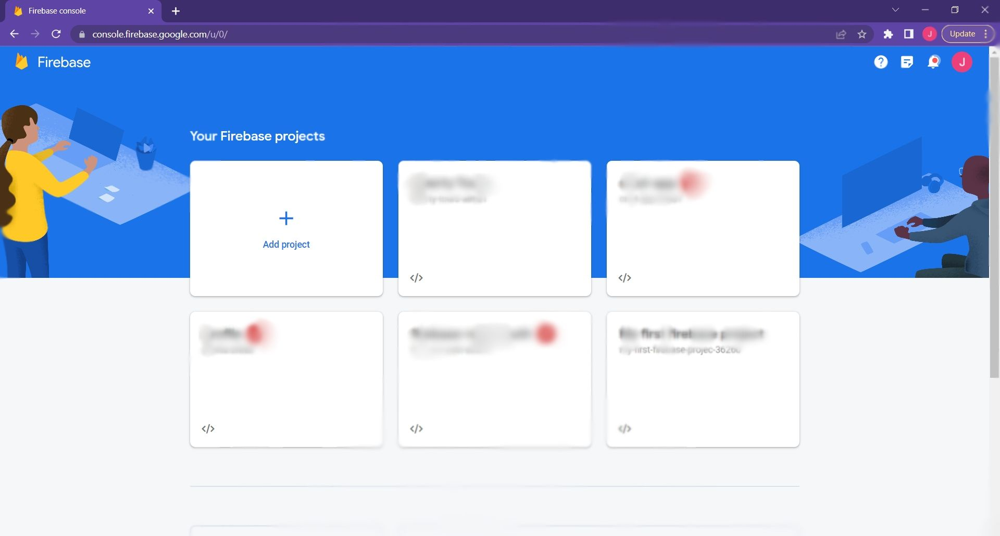Консоль Firebase

### Шаг 2: Создание нового проекта

Нажмите на карточку ”Добавить проект". Откроется страница с предложением дать проекту имя.

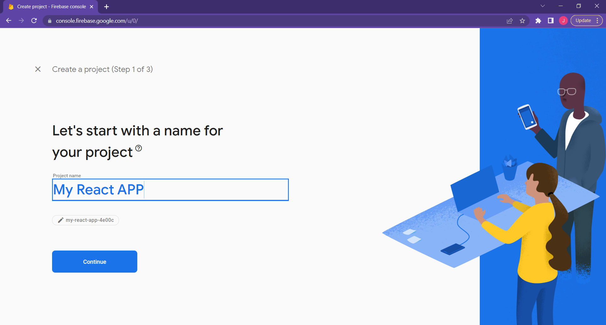Создание проекта

### Шаг 3: Заполните сведения о проекте

В этом примере я назвал проект “My React APP”.

Если вы новичок в Firebase, вам нужно поставить галочку в чекбоксе ”Принимаю условия Firebase” и во втором чекбоксе.

Нажмите кнопку ”Продолжить". На следующей открывшейся странице есть переключатель для включения или отключения Google Analytics для проекта. Отключите этот тумблер, так как Google Analytics нам не нужен для этого демо.

Нажмите кнопку ”Создать проект", и начнется создание проекта Firebase.

Если вы используете Firebase не в первый раз, нажмите на кнопку ”Продолжить" на странице выше, отключите Google Analytics и создайте новый проект.

### Шаг 4: Установите Firebase и Firebase Tools

Следующим шагом будет переход в терминал проекта в VS code, интерфейс командной строки или любой другой редактор кода, который вы используете. Убедитесь, что вы находитесь в главной папке проекта, который вы хотите развернуть, а затем установите Firebase в проект с помощью этой команды: `npm install firebase`.

Затем установите инструменты Firebase, которые мы будем использовать для хостинга и развертывания, с помощью этой команды: `npm install -g firebase-tools`.

### Шаг 5: Войдите в Firebase с помощью терминала

После настройки проекта Firebase и установки необходимых зависимостей вам нужно будет войти в Firebase в терминале с помощью этой команды: `firebase login`.

Появится запрос, требующий выбрать ”Да" или "Нет" на вопрос о том, следует ли вам "Разрешить Firebase собирать информацию об использовании CLI и Emulator Suite и отчеты об ошибках". Выберите вариант "Да".

### Шаг 6: Выберите учетную запись

В браузере по умолчанию откроется окно, в котором вам нужно будет выбрать учетную запись Firebase для входа.

После успешной аутентификации на терминале появится сообщение об успехе.

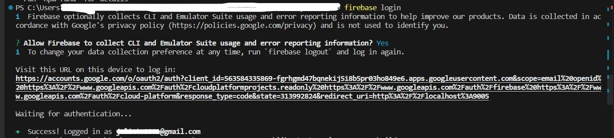Вход в Firebase CLI

### Шаг 7: Запуск сборки проекта

Используйте команду `npm run build` для сборки скриптов проекта. Эта команда автоматически генерирует готовую к производству сборку вашего приложения, собирая все необходимые JavaScript, CSS и другие активы в одну папку “build” fстарше в каталоге проекта.

Этот процесс очень важен, поскольку он оптимизирует код и активы для повышения производительности. Это уменьшает общий размер приложения и делает его эффективным для развертывания.

После успешного завершения второй части мы перешли к следующей неотъемлемой части всего процесса развертывания.

## Как инициализировать Firebase

Теперь нам нужно инициализировать Firebase, поэтому мы пройдемся по шагам, чтобы сделать это.

### Шаг 1: Инициализация Firebase

Инициализируйте Firebase для этого проекта с помощью этой команды в терминале: `firebase init`. Она сообщит вам, что вы собираетесь инициализировать проект Firebase в каталоге.

Некоторые подсказки, которые появятся после выполнения этой команды, такие: “Are you ready to proceed?”, на что вы напечатаете “Y” для “Yes”.

Следующее приглашение будет таким: ”Какие функции Firebase вы хотите настроить для этой директории?”. С помощью клавиши со стрелкой вниз на клавиатуре укажите на опцию “Hosting:Configure files for Firebase Hosting and (optionally) set up GitHub Action deploys”. Нажмите пробел и затем нажмите Enter.

### Шаг 2: Настройка проекта

На этом шаге вы соединяете каталог проекта с проектом Firebase. Когда вам будет предложено выбрать проект, выберите опцию ”Использовать существующий проект".  
Затем, когда появится запрос ”выбрать проект Firebase по умолчанию для каталога", выберите проект Firebase, который вы создали в первой части этого процесса.

Вы можете увидеть другие варианты проектов, если у вас несколько проектов Firebase на консоли Firebase.

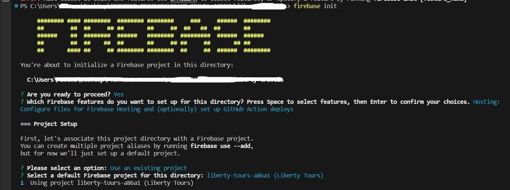Подключение проекта к Firebase.

### Шаг 3: Настройка хостинга

Этот процесс вызовет несколько подсказок, на которые вам нужно будет ответить.

Первый из них: ”Что вы хотите использовать в качестве публичной директории?”, в ответ на который вы выберете или введете “build”.

Далее, когда вас спросят, хотите ли вы ”Настроить приложение как одностраничное (переписать все ссылки на /index.html)", выберите вариант “Y” или “Yes”.

На вопрос ”Настроить автоматические сборки и деплои с GitHub?” выберите вариант "Да". Также при появлении запроса "Файл build/index.html уже существует. Перезаписать?”, выберите "Нет".

### Шаг 4: Авторизация Firebase с помощью GitHub

Вам нужно будет авторизовать Firebase с помощью вашего аккаунта GitHub. В браузере откроется окно, в котором вам нужно будет авторизовать Firebase в GitHub и ввести пароль от GitHub. После успешной авторизации вы получите сообщение об успехе на терминале с вашим именем пользователя GitHub.

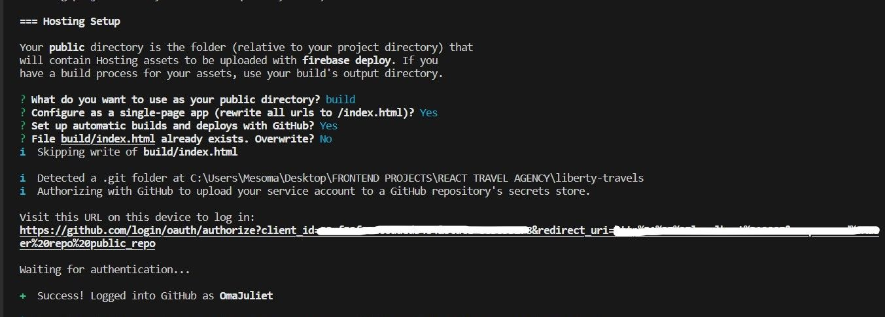 Настройка хостинга Firebase

Если вы успешно следовали за нами и дошли до этого этапа, значит, вы хорошо поработали. Теперь мы на полпути к развертыванию нашего проекта.

## Как выбрать репозиторий GitHub и настроить рабочий процесс GitHub

### Шаг 1: Выбор репозитория GitHub

Сначала вам нужно будет ввести репозиторий GitHub, который вы хотите использовать для настройки рабочего процесса GitHub для развертывания Firebase.

Формат для этого - “username/repository”. Помните, в первой части этого процесса вы создали проект и разместили его на GitHub. Это репозиторий GitHub и будет использоваться.

Например, допустим, ваше имя пользователя GitHub - “CoderDev”, а репозиторий проекта - “Firebase-Deployment”. Вы введете в терминале “CoderDev/Firebase-Deployment”. Это должно выглядеть следующим образом:

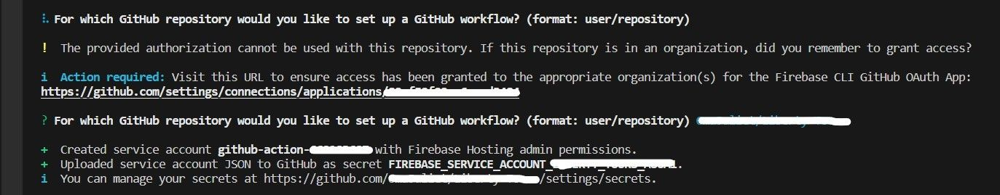

### Шаг 2: Секретный токен GitHub

После настройки рабочего процесса GitHub создаст учетную запись сервиса с правами администратора Firebase Hosting и загрузит JSON учетной записи сервиса на GitHub в качестве секретного токена.

Вы также можете просмотреть этот секретный токен на GitHub. Для этого перейдите в репозиторий проекта и переключитесь на вкладку ”Настройки". На левой панели страницы настроек нажмите на выпадающий список "Секреты и переменные" и выберите опцию "Действия". В нем будет отображен ваш секретный токен:

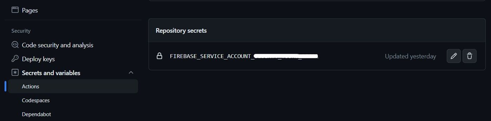Секретный токен

### Шаг 3: Настройте рабочий процесс

Вам будет предложено ответить на вопрос ”Настроить рабочий процесс на запуск скрипта сборки перед каждым развертыванием?”. Выберите "Да".

Вам также будет задан вопрос: ”Какой скрипт должен запускаться перед каждым развертыванием? (npm ci && npm run build) npm run build”. Введите в терминале следующее: `npm ci && npm run build`. Это создаст файл рабочего процесса в каталоге проекта.

Теперь вы увидите файл “firebase-hosting-pull-request.yml” в папке ”.github/workflows” в структуре папок вашего проекта.

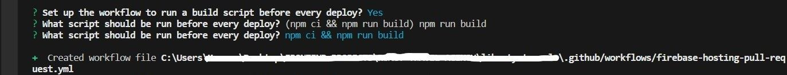Первый файл рабочего процесса GitHub

### Шаг 4: Автоматическое развертывание

Далее вас спросят, хотите ли вы ”Настроить автоматическое развертывание на живой канал вашего сайта при слиянии PR”. Выберите "Да".

Когда вас попросят ввести имя ветки GitHub, связанной с живым каналом вашего сайта, введите или выберите “main”. В результате будет создан еще один файл рабочего процесса “firebase-hosting-merge.yml” в папке ”.github/workflows”.

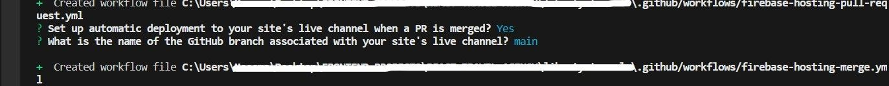Второй файл рабочего процесса GitHub

### Шаг 5: Создайте папки

Две операции, выполненные выше, wсоздаст две папки в каталоге вашего проекта. В одну из них под названием “firebase.json” будет записана информация о конфигурации, а в другую под названием ”.firebaserc” - информация о проекте.

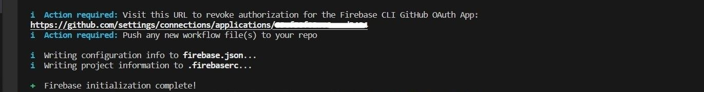Создание папок

Это все, что вам нужно сделать для инициализации Firebase в вашем проекте.

Эти процессы немного затянулись, но хорошая новость заключается в том, что все, что осталось сделать, - это развернуть Firebase.

## Как развернуть на Firebase

### Запустите команду развертывания

Запустите команду развертывания `firebase deploy`. Подождите, пока она развернется. После этого на вашем терминале появится сообщение об успехе с URL-адресом хостинга. Это живая ссылка проекта с расширением домена “web.app”.

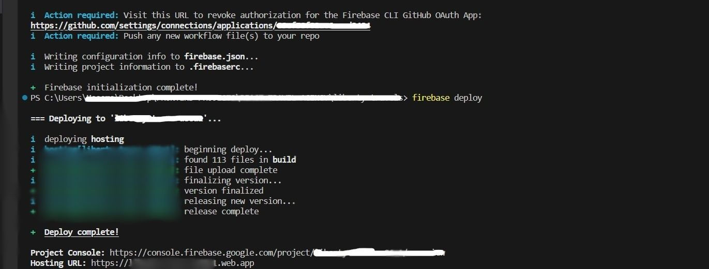Развертывание Firebase

Вот и все! Мы закончили развертывание нашего React-проекта с помощью Firebase.

Теперь каждый раз, когда вы добавляете, коммитите и отправляете новые изменения в репозиторий GitHub, он будет автоматически собирать приложение и переразвертывать его на Firebase, чтобы изменения отражались на живом сайте.

Эта автоматическая сборка и перераспределение стали возможны благодаря тому, что ранее, в процессе инициализации Firebase, мы выбрали опцию ”Да" для настройки автоматической сборки и развертывания с GitHub.

Мы также выбрали опцию ”Да", чтобы настроить рабочий процесс для запуска сценария сборки перед каждым развертыванием, и указали сценарии, которые должны выполняться перед каждым развертыванием.

Чтобы посмотреть, как выполняется развертывание после каждого добавления в репозиторий, перейдите в репозиторий GitHub этого проекта. Перейдите на вкладку ”Действия", чтобы увидеть, как происходит сборка и развертывание приложения.

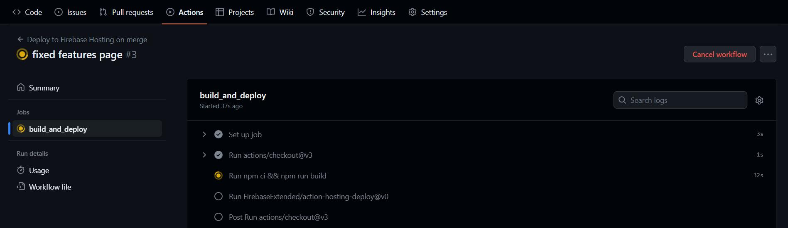Build and deployment action from GitHub.

Во время развертывания вы можете столкнуться с некоторыми ошибками. Хорошо, что прямо на этой странице действий GitHub вы можете отследить, откуда в приложении взялась ошибка.

Допустим, вы работаете с TypeScript в проекте, объявили функцию и не использовали ее, или вызвали хук и не использовали его. В браузере ваше приложение может работать так, как должно.

Но при развертывании это может стать проблемой или вызвать предупреждение, и вам нужно будет исправить это, зафиксировать и снова отправить в репозиторий, чтобы исправить ошибку. После того как вы это сделаете и развертывание пройдет успешно, страница действий должна выглядеть следующим образом.

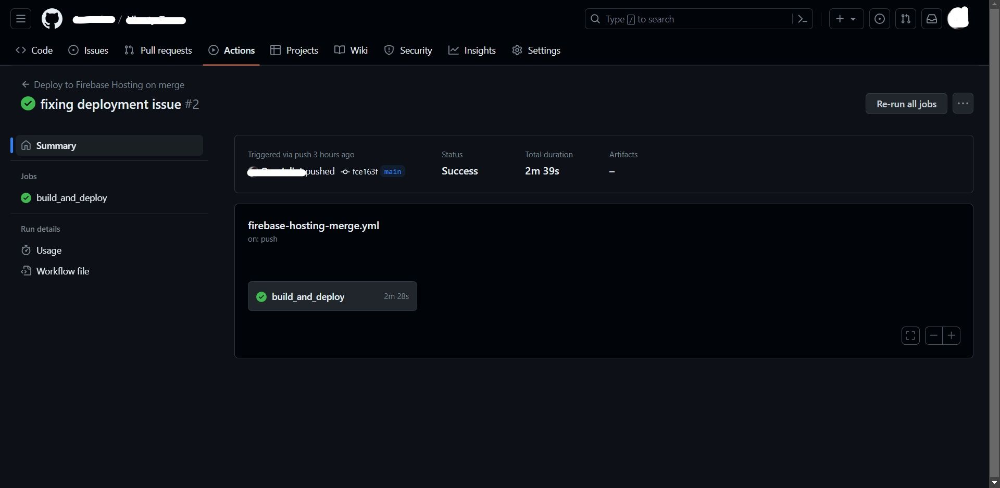Fixing deployment issueConclusion

Развертывание проекта с помощью Firebase сначала может показаться долгим процессом. Но если вы выполните все шаги, описанные в этой статье, у вас все получится.

Вы можете легко развернуть свое приложение на Firebase Hosting и воспользоваться его мощными возможностями, такими как автоматические процессы, упрощенный процесс развертывания и непрерывная интеграция с GitHub, выполнив простые шаги, описанные в этой статье.

Если вы хотите узнать больше обо всех возможностях, которые Firebase может предложить разработчикам, перейдите в официальную документацию Firebase и изучите ее.
