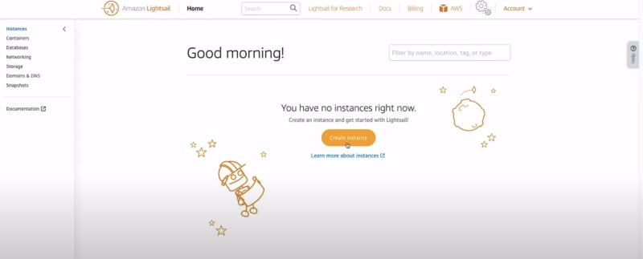
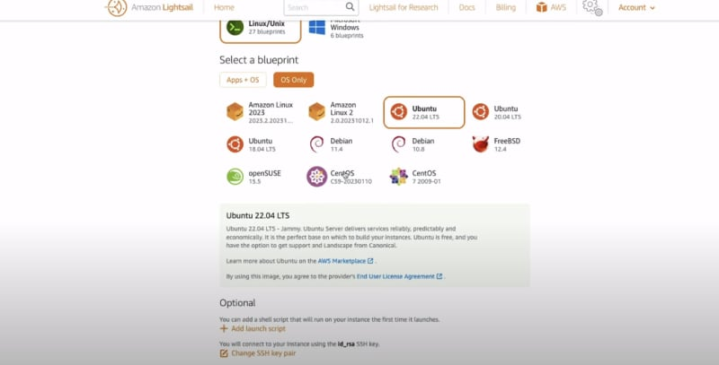
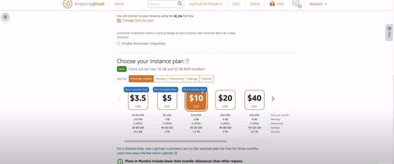
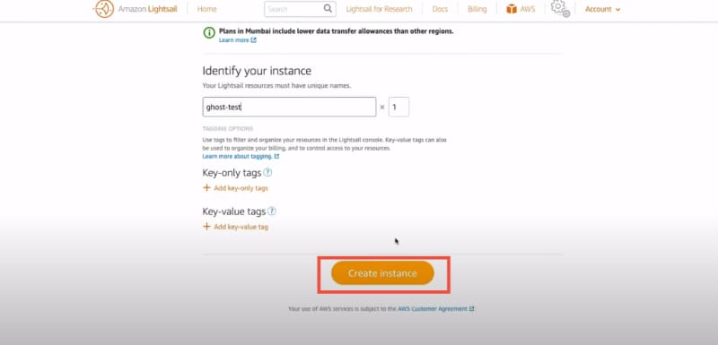
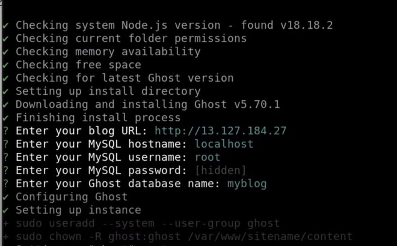
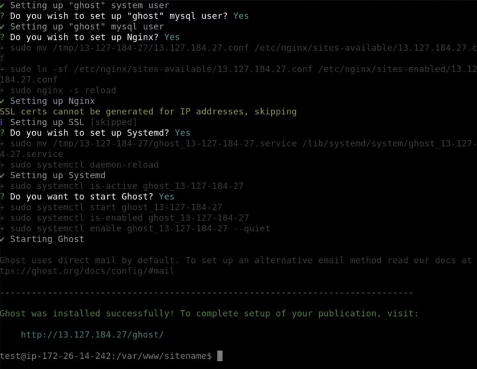
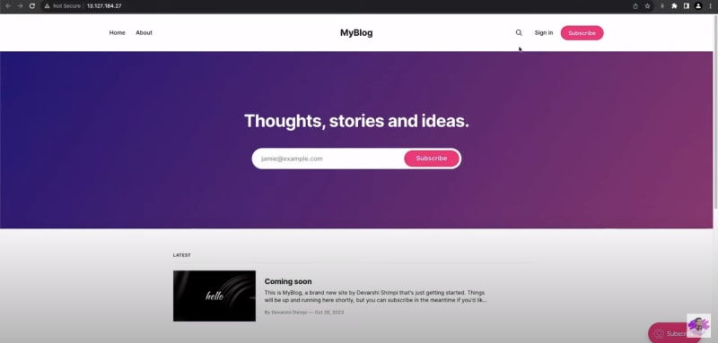

Добро пожаловать в это пошаговое руководство по установке и настройке блога Ghost на AWS Lightsail. Ghost - это популярная издательская платформа с открытым исходным кодом, простая, легкая и разработанная специально для блоггеров. С помощью AWS Lightsail вы можете легко развернуть свой собственный блог Ghost всего за несколько простых шагов.

В этом руководстве мы проведем вас через весь процесс установки и настройки Ghost на экземпляре AWS Lightsail. К концу этого руководства у вас будет свой собственный полнофункциональный блог Ghost.

## Необходимые условия

Прежде чем мы начнем, убедитесь, что у вас есть следующее:

- Учетная запись AWS Lightsail
- Базовые знания о AWS Lightsail и его службах
- Зарегистрированное доменное имя (необязательно)

## Шаг 1: Создайте экземпляр AWS Lightsail

Первым шагом будет создание экземпляра AWS Lightsail. Вот как это можно сделать:

1.Войдите в свою учетную запись AWS Lightsail и нажмите на кнопку Create instance.

2.Выберите желаемое местоположение экземпляра, операционную систему и план экземпляра.

3.Нажмите на кнопку ”Создать", чтобы создать экземпляр.

Как только экземпляр будет создан, запишите публичный IP-адрес вашего экземпляра. Он понадобится нам позже.

## Шаг 2: Подключение к вашему экземпляру Lightsail

Чтобы подключиться к вашему экземпляру Lightsail, следуйте следующим инструкциям:

Откройте терминал или SSH-клиент. Используйте следующую команду для подключения к вашему экземпляру:

`ssh -i path/to/your/key.pem ubuntu@your_instance_ip`.

Замените `path/to/your/key.pem` на путь к файлу закрытого ключа, а `your_instance_ip` на публичный IP-адрес вашего экземпляра.

## Шаг 3: Обновление пакетов и установка зависимостей

После подключения к вашему экземпляру Lightsail обновите пакеты и установите необходимые зависимости с помощью следующих команд:

`sudo su`

`sudo apt update && apt upgrade -y`

`sudo apt-get install nginx mysql-server -y`.

`sudo ufw allow 'Nginx Full'`

## Шаг 4: Установите Nodejs, NPM и Ghost-CLI

Следующим шагом будет установка nodejs и npm, для чего мы воспользуемся репозиторием nodesource на github:

`sudo apt-get install ca-certificates curl gnupg -y`.

`sudo mkdir -p /etc/apt/keyrings`

`curl -fsSL https://deb.nodesource.com/gpgkey/nodesource-repo.gpg.key | sudo gpg --dearmor -o /etc/apt/keyrings/nodesource.gpg`

`NODE_MAJOR=18 sudo apt-get update && sudo apt-get install nodejs -y`

Далее давайте установим пакет Ghost-CLI глобально.

`sudo npm install ghost-cli@latest -g`

## Шаг 5: Установка и настройка Ghost

Теперь пришло время установить и настроить Ghost на вашем экземпляре Lightsail. Выполните следующие шаги:

Создайте нового пользователя с необходимыми правами

`adduser <user>`

`usermod -aG sudo <user>`

`su - <пользователь>`

Примечание: Использование имени пользователя ghost приводит к конфликтам с Ghost-CLI, поэтому важно использовать альтернативное имя.

Примечание: замените `<user>` на имя пользователя, которое вы хотите добавить

Создайте новую директорию, установите правильные права и перейдите в нее для вашего блога Ghost:

`sudo mkdir -p /var/www/sitename`.

`sudo chown <user>:<user> /var/www/sitename`

`sudo chmod 775 /var/www/sitename`

`cd /var/www/sitename`

Установите и запустите Ghost:

`ghost install`

Во время установки Ghost-CLI задаст вам ряд вопросов. Дайте следующие ответы:

- URL-адрес блога: Введите ваше доменное имя (например, `https://your_domain.com`).
- Имя хоста MySQL: Нажмите Enter, чтобы использовать значение по умолчанию (`localhost`).
- Имя пользователя MySQL / пароль: Введите имя пользователя MySQL и пароль, которые вы хотите использовать для вашего блога Ghost.
- Имя базы данных Ghost: Введите имя базы данных Ghost. Вы можете использовать значение по умолчанию.  
  Создать пользователя Ghost MySQL? (Рекомендуется): Выберите ”Да", чтобы создать пользовательский MySQL-пользователь для Ghost.  
  Настроить NGINX? (Рекомендуется): Выберите ”Да", чтобы автоматически настроить NGINX для вашего блога Ghost.  
  Установить SSL? (Рекомендуется): Выберите ”Да", если у вас есть SSL-сертификат.те для вашего домена. В противном случае выберите "Нет".  
  Установить systemd? (Рекомендуется): Выберите ”Да", чтобы использовать systemd в качестве менеджера процессов для Ghost.

## Шаг 6: Зайдите в свой блог Ghost

Чтобы получить доступ к своему блогу Ghost, откройте веб-браузер и введите свое доменное имя (например, `https://your_domain.com`). Вы увидите страницу настройки Ghost, на которой можно создать учетную запись администратора и настроить свой блог.

## Заключение

Поздравляем! Ваш блог Ghost теперь работает на вашем экземпляре AWS Lightsail.

Теперь пришло время начать создавать и публиковать свой собственный контент в новом блоге Ghost. Счастливого блоггинга!
