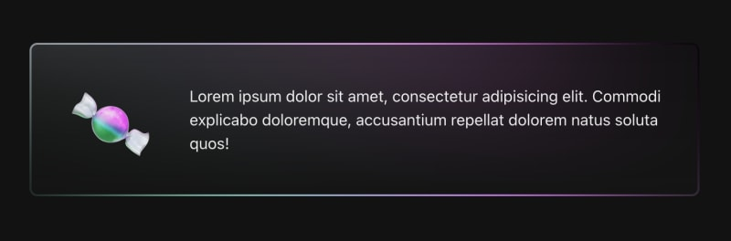
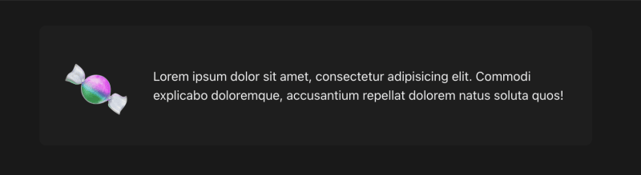
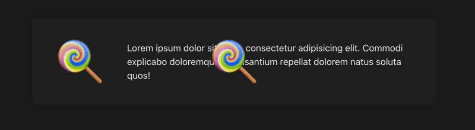
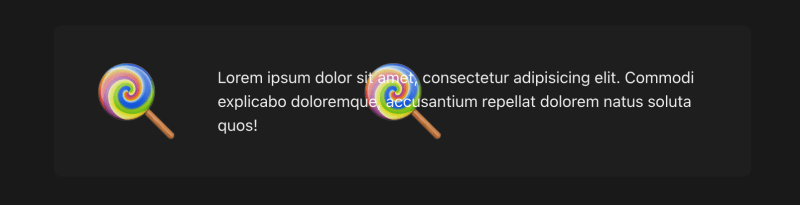
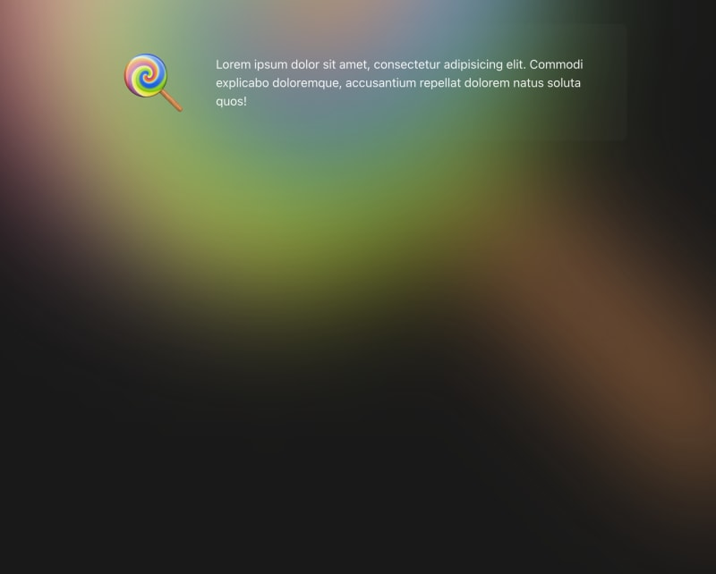
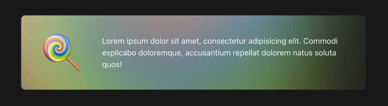
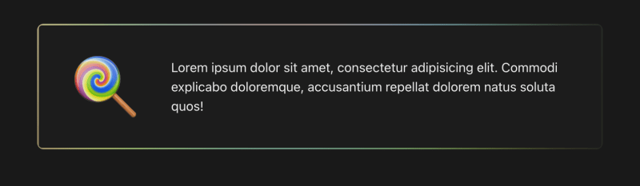
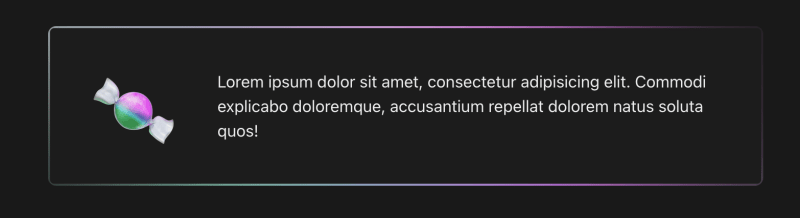

Я экспериментировал с градиентными границами и наткнулся на интересную технику - карточки, которые адаптируются к содержимому внутри них. Вы можете увидеть демонстрацию этого эффекта в действии здесь.

Вот что мы будем создавать сегодня:



Эта карта будет волшебным образом подстраивать свои цвета под переданные ей эмодзи, но аналогичный подход можно использовать для любого вида контента.

Давайте пройдемся по шагам с нуля и разберем все по полочкам!

## Инициализация проекта

Мы будем создавать проект с нуля, ничего не абстрагируя. Мы будем использовать следующий технологический стек:

Vite с React и TypeScript: Чтобы быстро настроить окружение нашего проекта.

Chakra UI: Это не обязательно для эффекта, но стилевые реквизиты Chakra облегчают стилизацию.

Framer Motion: Это зависимость от Chakra UI, которая пригодится, если мы решим анимировать карту.

Настройте проект с помощью Vite: Начните с выполнения следующих действий:

```bash
npm create vite@latest

```

При появлении запроса выберите React with TypeScript.

Установите Chakra UI и Framer Motion:

```bash
npm i @chakra-ui/react @emotion/react @emotion/styled framer-motion
```

Создайте тему Chakra: Сохраните следующее в файле `theme.ts`:

```javascript
import { ThemeConfig, extendTheme } from '@chakra-ui/react';

// Define the theme configuration
const config: ThemeConfig = {
  initialColorMode: 'dark',
  useSystemColorMode: false,
};

// Extend the base theme with the custom configuration
const theme = extendTheme({
  config,
  styles: {
    global: () => ({
      body: {
        bg: '#121212',
      },
    }),
  },
});

export default theme;
```

Это устанавливает цветовую схему Chakra в темный режим и применяет темно-серый фон.

Интегрируйте провайдер Chakra: Измените `src/main.tsx, чтобы включить в него провайдер Chakra:

```javascript
import { ChakraProvider } from '@chakra-ui/react';
import theme from './theme';

/**
 * Wraps the application with the ChakraProvider, providing the Chakra UI theme.
 */
const AppWrapper = () => {
	return (
		<React.StrictMode>
			{/* Use the ChakraProvider component and pass the theme prop */}
			<ChakraProvider theme={theme}>
				{/* Render the App component */}
				<App />
			</ChakraProvider>
		</React.StrictMode>
	);
};

export default AppWrapper;
```

Настройки стиля: Убедитесь, что ваша страница занимает весь экран, установив `min-height: 100vh;` для элемента `#root` в файле `App.css`.

## Создание базовой карты

Давайте заложим основу, создав базовый компонент карточки.

Создайте компонент: Создайте компонент `src/components/EmojiCard.tsx`:

```javascript
import { Box, BoxProps } from '@chakra-ui/react';

/**
 * Props for the EmojiCard component.
 */
interface Props {
  /**
   * The emoji to be displayed.
   */
  emoji: string;
}

/**
 * A card component that displays an emoji and some content.
 */
export default function EmojiCard({ emoji, children }: Props) {
  return (
    /* основной контейнер */
    <Box position="relative" maxW={700} borderRadius={8} bg="#181818">
      /* обертка содержимого */
      <Box
        px={8}
        py={4}
        gap={{ base: 0, sm: 8 }}
        display="flex"
        alignItems="center"
        flexDirection={{ base: 'column', sm: 'row' }}
        borderRadius={6}
      >
        /* контейнер для эмодзи */
        <Box display="flex" alignItems="center" justifyContent="center" fontSize="80px" width="200px">
          {emoji}
        </Box>
        /* контейнер для текстового содержимого */
        <Box height="100%" textAlign={{ base: 'center', sm: 'left' }}>
          {children}
        </Box>
      </Box>
    </Box>
  );
}
```

`Box` - это компонент из Chakra UI, который позволяет нам передавать реквизиты стиля напрямую.

В этой базовой установке у нас есть окружающий основной контейнер с ограниченной шириной и фоном. Внутри у нас также есть обёртка для контента с местом для наших эмодзи и для текстового содержимого.

Этот код служит базовой структурой для нашей карточки.

Рендеринг компонента: Обновите `App.tsx` для рендеринга нашего нового компонента:

```javascript
import EmojiCard from './components/EmojiCard';

// Create an instance of the EmojiCard component and pass in the emoji prop
const emojiCard = (
	<EmojiCard emoji="🍬">
		Lorem ipsum dolor sit amet, consectetur adipisicing elit. Commodi explicabo doloremque,
		accusantium repellat dolorem natus soluta quos!
	</EmojiCard>
);

// Output the EmojiCard component
console.log(emojiCard);
```



Теперь у нас есть с чем работать!

## Эффект

Когда начальная настройка выполнена, приступаем к самому интересному - созданию эффекта!

Фоновый эмодзи: Добавьте эмодзи в качестве фона в основной контейнер, но перед оберткой контента:

```javascript
/**
 * Represents a box component.
 * @param {string} position - The position of the box.
 * @param {number} left - The left position of the box.
 * @param {number} top - The top position of the box.
 * @param {string} width - The width of the box.
 * @param {string} height - The height of the box.
 * @param {string} justifyContent - The justify content value of the box.
 * @param {string} alignItems - The align items value of the box.
 * @param {string} display - The display value of the box.
 * @param {object} _before - The styles for the ::before pseudo-element.
 */
<Box
	position="absolute"
	left={0}
	top={0}
	width="100%"
	height="100%"
	justifyContent={'center'}
	alignItems={'center'}
	display="flex"
	_before={{ content: `${emoji}`, fontSize: 80 }}
/>
```



Это помещает дубликат эмодзи в центр карты. Обратите внимание, как он перекрывает содержимое, несмотря на то, что фоновый компонент в коде находится перед нашим содержимым.

Поскольку элемент background имеет `абсолютную` позицию, а наш контент по умолчанию имеет `статическую` позицию, контекст укладки CSS помещает background поверх контента. Чтобы исправить это, установите для поля-обертки контента значение `position="relative"`.



Настройки стиля: Увеличьте размер эмодзи, установив размер шрифта до 1100, и добавьте фильтр к элементу фона эмодзи: `filter={"blur(80px)"}`.



Это интересный эффект градиента, но мыхотим ограничить его рамками нашей карты. Добавьте `overflow="hidden"` в основной контейнер.



Теперь добавим следующее к обертке контента, чтобы вырезать место для контента в середине и получить тонкую границу с этими градиентными цветами:

```javascript
backgroundColor="#151515" border="2px solid transparent" backgroundClip="padding-box"
```

Интересной частью здесь является свойство `backgroundClip`. Оно определяет, насколько далеко простирается фон внутри элемента.

`padding-box` означает, что заданный нами `backgroundColor` будет распространяться до внешнего края подложки, но не будет заходить за границу.



Теперь эта карта должна реагировать на любой emoji, который вы ей передадите, и использовать его для заполнения фонового градиента:



Давайте еще больше усилим этот эффект!

Градиентный фон: Замените свойство `backgroundColor`, которое мы установили, на следующее:

`backgroundImage="linear-gradient(rgb(20 20 20 / 0.8), rgb(20 20 20))"`.

Это заменит сплошной фон светлым градиентом, слегка прозрачным в верхней части, так что некоторые цвета фона могут просвечивать:


Анимируйте фон: Мы можем сделать карточку более динамичной и привлекательной, анимировав фон эмодзи с помощью Framer Motion:

```javascript
import { motion, useTime, useTransform } from 'framer-motion';
const AnimatedBox = motion(Box);

const currentTime = useTime();
const rotation = useTransform(currentTime, [0, 16000], [0, 360], { clamp: false });

<AnimatedBox style={{ rotate: rotation }} />;
```

Мы преобразуем компонент `Box` для фона эмодзи в `AnimatedBox` с помощью утилиты Framer Motion `motion`. Это позволяет компоненту принимать специальные значения, которые Framer Motion анимирует для нас вне стандартного цикла рендеринга React.

Мы используем хуки `useTime` и `useTransform` из Framer Motion, чтобы вычислить, насколько сильно должен вращаться эмодзи. Затем мы передаем значение `rotate` в качестве style prop нашему компоненту Framer Motion для обработки анимации.

## Вот конечный результат в действии

Молодцы, что дошли так далеко! Вы можете посмотреть окончательный код для этого на CodeSandbox здесь, а оригинальное экспериментальное демо показывает это в действии с некоторыми различными emojis.

Очень интересно натыкаться на подобные техники. Мы только потрогали поверхность, и есть множество различных направлений, которые можно использовать.

Представьте себе этот эффект с различными режимами освещения или в виде кнопки-иконки, которая самостоятельно настраивается в зависимости от предоставленной иконки.

Не ограничивайтесь эмодзи - добавьте любое изображение, узор или цветной текст. Экспериментируйте с различными рамками. Поиграйте с фильтром размытия - уберите его или используйте другой.

Расскажите нам в комментариях, что у вас получилось!
