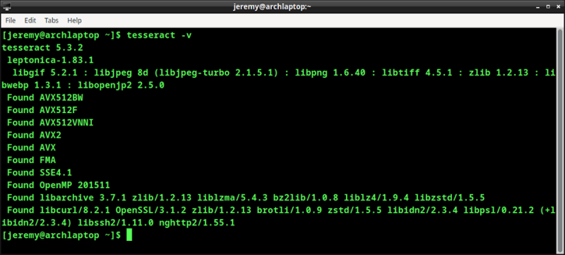
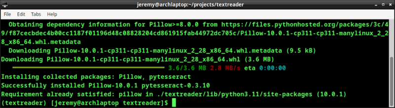
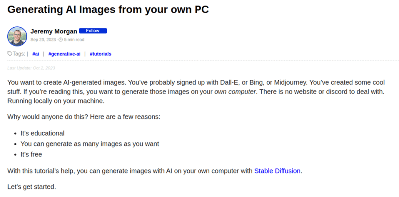
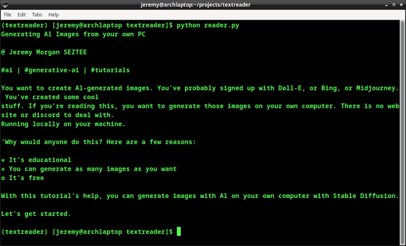
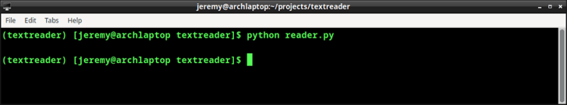

Если вы хотите прочитать текст с изображения с помощью простого скрипта Python, этот урок для вас. Благодаря работе многих замечательных людей за последние несколько десятилетий, вы можете прочитать текст с изображения с помощью нескольких строк кода. Правда! Давайте приступим.

## Что такое OCR? Тессеракт?

Оптическое распознавание символов, или OCR, существует уже давно. Это технология, которая ”считывает" различные типы документов в редактируемый и доступный для поиска текст. Она работает путем распознавания символов на изображении и преобразования их в машиночитаемый текст. В этом много волшебства, но оно хорошо работает.

Tesseract - это OCR-движок с открытым исходным кодом, разработанный компанией Google. Он отличается высокой точностью и поддерживает множество языков. Эта библиотека сделает за нас всю тяжелую работу. В этом уроке мы будем использовать ее для быстрого чтения текста на некоторых изображениях.

## Шаг 1: Настройка среды Python

Для начала вам нужно убедиться, что Python установлен. Мы создадим виртуальную среду.

Я использую Linux, поэтому я создам директорию с именем `textreader` и наберу в ней

`python -m venv textreader`.

Затем

`source textreader/bin/activate`

## Шаг 2: Установите необходимые библиотеки

Для начала нам нужно установить Tesseract на вашу систему. Вот инструкции по установке Tesseract на выбранную вами операционную систему.

Убедитесь, что Tesseract установлен, набрав:

`tesseract -v`.

и вы увидите вывод, похожий на этот:

Затем мы установим пару библиотек Python.

Pytesseract - это библиотека Python, которая является оберткой для OCR-движка Tesseract. Это упрощает его использование в Python-приложениях. Мы установим ее и Pillow.

Pillow - это библиотека изображений Python. Она используется для обработки и манипулирования изображениями. Она используется для предварительной обработки изображений перед применением методов OCR. Она выполняет такие действия, как пороговое выделение изображения и другие операции с ним для повышения точности считывания.

Далее мы установим Pytesseract и Pillow вместе для нашего первого приложения:

`pip install pytesseract pip install pillow`.

Ваш вывод должен выглядеть примерно так:

В некоторых случаях, как описано выше, может быть сказано, что требование уже выполнено для Pillow.

И мы готовы к работе.

## Шаг 3: Выберите изображение

Для начала я выберу что-нибудь попроще. Я использую скриншот с моего сайта. Это будет четкий, легко читаемый текст, который должен отлично работать.

Я сохраню это как image-1.jpg в своей папке.

## Шаг 4: Напишем сценарий

Теперь мы готовы написать сценарий на Python, который будет считывать текст с изображения и выводить его на экран.

Сначала мы импортируем библиотеки:

`import pytesseract from PIL import Image`.

Затем откройте изображение:

`image = Image.open('image-1.jpg')`.

А затем мы используем Tesseract для преобразования текста на изображении в строку. Разве я не говорил, что эта библиотека делает за нас всю тяжелую работу?

`text = pytesseract.image_to_string(image)`

Наконец, мы выведем его на печать:

`print(text)`.

Давайте запустим его и посмотрим, как он выглядит.

## Шаг 5: Смотрите, как происходит волшебство

Мы запускаем наш скрипт и получаем следующее:

Потрясающе! Это не идеально, но довольно неплохо. Вы можете прочитать текст с изображения, которое мы отправили, и он в некоторой степени отформатирован так, как на картинке. Это потрясающе!

Поздравляем! Теперь вы можете читать текст с изображений в Python. Далее мы рассмотрим более сложные вещи.

## Изучение ограничений

В нашем первом примере у нас было очень четкое изображение. Текст на этом изображении отформатирован и четкий, поэтому его легко читать. Давайте немного расширим его.

Я выбрал более сложное изображение с сайта Pexels, которое не так уж и просто.

Давайте посмотрим, что получается на выходе при чтении этого изображения:

Уф. Ничего. Я включил это, потому что важно знать ограничения этого процесса. Необычные шрифты и различные углы будут влиять на то, насколько хорошо это работает. Мы мало что можем сделать, чтобы прочитать это изображение, не прибегая к обширной работе.

## Заключение

В этом уроке мы узнали, как использовать Tesseract для чтения текста с изображения и перевода его в машиночитаемую форму. С помощью OCR можно читать и многое другое, и мы подробно рассмотрим некоторые из этих возможностей в следующих статьях.

Не стесняйтесь играть с этим и посмотрите, что вы можетес чем мы только не сталкивались! В одном из следующих уроков мы будем использовать OpenCV для доработки и предварительной обработки изображений, с которых мы будем считывать информацию. Это будет весело.

Сохраните этот блог в закладках и возвращайтесь за новыми классными уроками по Python.

Вопросы? Комментарии? Кричите на меня!
