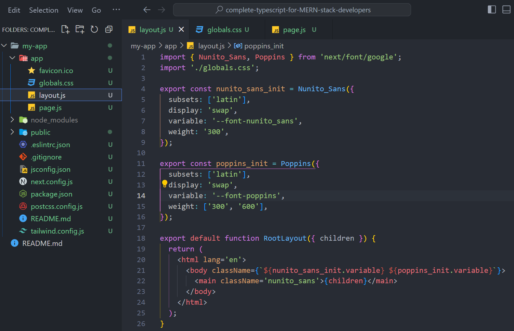
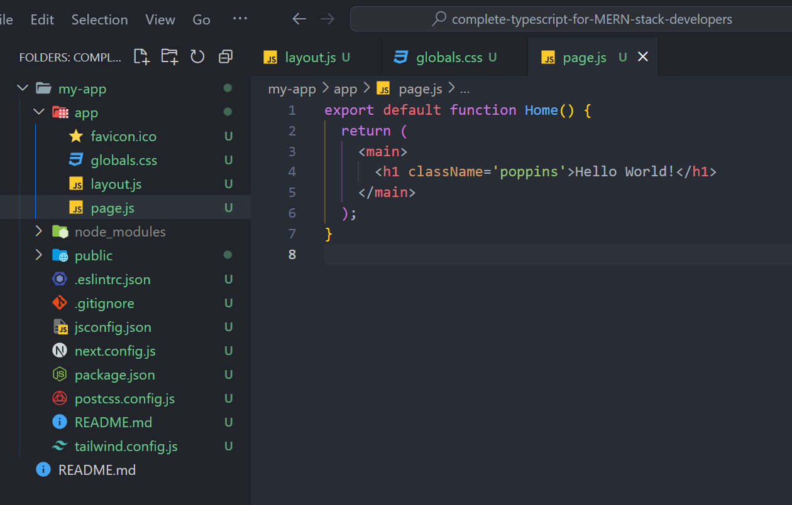

Реестры контейнеров необходимы многим командам разработчиков. В них хранятся наши образы Docker, контейнеры GitHub и контейнеры GitLab, готовые к извлечению и использованию в любой момент, когда это необходимо. Однако так же, как нам нужно защищать наши кодовые базы и конвейеры CI/CD, эти хранилища также нуждаются в надежном замке, чтобы предотвратить нежелательное вторжение.

В этом посте мы обратим внимание на Honeytoken от GitGuardian - умный инструмент, предназначенный для обеспечения безопасности реестров контейнеров, действуя как цифровые приманки, которые предупреждают нас о любой нежелательной активности. Это как бесшумная сигнализация, следящая за вашими драгоценными образами и готовая подать сигнал тревоги, если несанкционированная рука попытается проникнуть внутрь.

В следующих разделах мы погрузимся в мир honeytokens, поймем, как они работают, и научимся использовать их для защиты нашего реестра Docker, пакетов GitHub и реестра контейнеров GitLab. Итак, пристегните ремни, поскольку мы отправляемся в путешествие, чтобы укрепить наши реестры и обеспечить плавное и безопасное плавание.

## Понимание Honeytokens

Honeytokens - это как цифровые хлебные крошки, рассыпанные по вашим системам, но вместо того, чтобы привлекать птиц, они заманивают потенциальных киберзлоумышленников. Эти кажущиеся ценными кусочки данных приманивают неавторизованных пользователей, заставляя их раскрыть свою незаконную деятельность.

Каждый honeytoken - это уникальный фрагмент данных, часто напоминающий реальные учетные данные или секреты, которые могут пригодиться злоумышленнику. Однако, в отличие от настоящих учетных данных, honeytoken отслеживаются системами, подобными модулю Honeytoken в GitGuardian, и готовы поднять тревогу в случае их использования.

Итак, зачем нам использовать медовые токены в реестрах контейнеров? Реестры контейнеров, такие как Docker Registry, GitHub Containers и GitLab Container Registry, - это сокровищницы ценных активов, которые жизненно важны для наших процессов разработки. Любой несанкционированный доступ к этим активам может привести к катастрофе, что делает эти реестры главной мишенью для кибератак.

Разместив медовые токены в этих реестрах, вы можете создать систему оповещения, которая даст вам знать, как только кто-то неавторизованный получит к ним доступ. Это как охранник, который никогда не спит, постоянно следит за хранящимися артефактами и готов предупредить вас при первых признаках проблемы.

Теперь, когда вы понимаете, что такое honeytokens и как они могут помочь защитить ваши реестры контейнеров, вы можете задаться вопросом: ”Как создать honeytoken?”. Хорошая новость заключается в том, что создать honeytoken с помощью GitGuardian очень просто! Ознакомьтесь с этим пошаговым руководством, чтобы подготовиться к работе менее чем за 5 минут:

## Как создавать и использовать медовые токены: Пошаговая инструкция

Как только вы получите свой honeytoken, вы будете готовы начать укреплять безопасность своих реестров контейнеров. Давайте погрузимся в эту тему.

### Защита реестра Docker с помощью медовых токенов

Docker, широко известное в мире разработки программного обеспечения имя, предлагает платформу для автоматизации развертывания, масштабирования и управления приложениями с помощью контейнеризации. Docker Registry, компонент Docker, представляет собой систему хранения и распространения именованных образов Docker. Эти образы, по сути, шаблоны только для чтения, используемые для создания контейнеров Docker, могут нести в себе жизненно важные компоненты ваших приложений.

Теперь давайте добавим в эту смесь медовые токены, чтобы защитить наш реестр Docker. Как мы это сделаем? Поместив медовые токены в образы Docker и разместив их в реестре Docker. Вот как это можно сделать:

Прежде всего, убедитесь, что у вас есть готовый honeytoken. Если нет, создайте его с помощью модуля Honeytoken в GitGuardian.  
Затем вам нужно вставить этот honeytoken в образ Docker. Это можно сделать, включив его в свой Dockerfile, который Docker считывает для создания образа. Вставьте honeytoken в качестве переменной окружения, используя инструкцию ENV в Dockerfile:

Помните, что переменные окружения - это просто заполнители. Замените их реальными значениями honeytoken.

После того как Dockerfile создан, соберите образ Docker с помощью команды:

`docker build -t your-image-name .`.

Далее необходимо пройти аутентификацию в реестре Docker:

`docker login`

После успешной аутентификации вы можете отправить образ Docker в реестр, выполнив следующие действия:

Вот и все! Ваш образ Docker, снабженный honeytoken, надежно хранится в реестре Docker. Любой несанкционированный доступ к этому образу приведет к срабатыванию honeytoken и немедленно оповестит вас.

Этот метод позволяет стратегически разместить honeytokens в нескольких образах, формируя бдительный щит безопасности вокруг вашего реестра Docker. Далее мы обсудим защиту пакетов GitHub с помощью медовых токенов.

**_Далее читайте: Как работать с секретами в Docker_**.

## Защита реестра контейнеров GitHub с помощью honeytokens

Реестр контейнеров GitHub позволяет вам легко размещать и управлять образами контейнеров Docker в ваших репозиториях GitHub. Как и в случае с реестром Docker, вы можете добавить дополнительный уровень защиты, интегрировав медовые токены в ваши образы Docker. Давайте рассмотрим этот процесс пошагово шаг:

## Подготовка Dockerfile

Для начала вам понадобится Dockerfile со встроенным honeytoken. Вот пример Dockerfile, в котором honeytoken размещен в качестве переменной окружения:

### Создание образа Docker

После того как Dockerfile подготовлен, можно собирать образ Docker:

`docker build -t ghcr.io/your-username/your-docker-image .`

Замените `ваше имя пользователя` и `ваш-docker-image` на ваше имя пользователя GitHub и желаемое имя образа.

### Аутентификация в реестре контейнеров GitHub

Чтобы отправить образ в реестр контейнеров GitHub, вам нужно пройти аутентификацию с помощью персонального маркера доступа с соответствующими диапазонами. Создайте новый персональный токен доступа и выберите область write:packages. Это можно сделать в настройках вашей учетной записи GitHub.

Затем сохраните этот токен как переменную окружения в терминале:

`export CR_PAT=YOUR_TOKEN`.

Не забудьте заменить YOUR_TOKEN на ваш реальный токен. После этого вы можете войти в реестр контейнеров GitHub:

`echo $CR_PAT | docker login ghcr.io -u your-username --password-stdin`.

Замените `your-username` на ваше реальное имя пользователя GitHub. В случае успеха вы должны увидеть сообщение Login Succeeded.

### Передача образа Docker

После того как вы вошли в систему, вы можете отправить свой образ Docker:

`docker push ghcr.io/your-username/your-image-name:latest`.

Поздравляем! Вы только что добавили honeytoken к своему образу Docker и отправили его в реестр контейнеров GitHub. Если кто-то неавторизованный попытается получить доступ к этому образу, honeytoken немедленно оповестит вас об этом. Таким образом, вы укрепили безопасность реестра контейнеров GitHub.

Далее перейдем к защите реестра контейнеров GitLab с помощью медовых токенов.

Защита реестра контейнеров GitLab с помощью медовых токенов

В GitLab вы можете использовать встроенный реестр контейнеров для размещения образов контейнеров Docker для ваших проектов. Как и в случае с GitHub и Docker, вы можете усилить свою безопасность, включив медовые токены в свои образы Docker. В этом разделе мы расскажем вам о том, как это сделать:

## Подготовка Docker-файла

Вы начинаете с Dockerfile, содержащего встроенный honeytoken. Допустим, вы добавляете honeytoken в качестве переменной окружения в свой Dockerfile:

### Создание образа Docker

Затем создайте образ Docker, используя свой Dockerfile:

`docker build -t registry.gitlab.com/your-namespace/your-project/your-image .`

Замените `your-namespace`, `your-project` и `your-image` на ваше пространство имен GitLab (имя пользователя или группа), ваш проект GitLab и желаемое имя образа, соответственно.

### Аутентификация в реестре контейнеров GitLab

Чтобы отправить образ в реестр контейнеров GitLab, вам необходимо пройти аутентификацию в реестре. Это можно сделать, войдя в Docker с учетными данными GitLab:

`docker login registry.gitlab.com -u your-username`.

Замените `your-username` и введите свой пароль, когда появится запрос `your-password`. Если у вас включена двухфакторная аутентификация, то вместо пароля вам нужно будет использовать персональный токен доступа.

### Передача образа Docker

После успешного входа в систему вы можете отправить свой образ Docker в реестр контейнеров GitLab:

`docker push registry.gitlab.com/your-namespace/your-project/your-image:latest`.

Снова замените `your-namespace`, `your-project` и `your-image` на ваше пространство имен GitLab (имя пользователя или группы), ваш проект GitLab и имя вашего образа Docker соответственно.

Вот и все! Вы успешно добавили honeytoken к своему образу Docker и разместили его в реестре контейнеров GitLab. Если неавторизованная сторона попытается получить доступ к образу, honeytoken сработает, и вы получите уведомление. Вы эффективно укрепили безопасность своего реестра контейнеров GitLab.

В следующем разделе мы завершим руководство и обсудим некоторые дополнительные меры, которые вы можете предпринять для защиты своих реестров контейнеров.

Лучшие практики использования Honeytokens в реестрах контейнеров

Внедрение медовых токенов в реестры контейнеров - надежная мера для обеспечения безопасности вашего конвейера DevOps. Однако, как и в случае с любым другим инструментом, его эффективность заключается в правильном использовании. В этом разделе мы рассмотрим несколько советов и рекомендаций, позволяющих получить максимальную отдачу от медовых токенов:

Стратегическое размещение: Размещение медотоков имеет решающее значение. Помните, что это цифровые трипперы, которые должны срабатывать при несанкционированном доступе. Размещайте их в конфиденциальных областях реестров или в образах Docker, где они, скорее всего, будут обнаружены в ходе незаконной деятельности.

Используйте отдельные токены: Не используйте один токен для всех сред. Разверните разные токены для каждой службы или среды. Этот процесс поможет отследить инциденты и сократит время на их обнаружение и устранение.

Мониторинг Honeytokens: Honeytokens хороши лишь настолько, насколько вы способны реагировать на их срабатывание. Убедитесь, что у вас есть надежная система мониторинга, и убедитесь, что оповещения от Honeytokens имеют наивысший приоритет.

Используйте другие меры безопасности: ХотяМедотоки очень мощны, но они не должны быть вашей единственной линией защиты. Сочетайте их с другими мерами безопасности, такими как брандмауэры, системы контроля доступа и обнаружения вторжений, чтобы создать комплексную стратегию безопасности.

Включение honeytokens в ваши протоколы безопасности может значительно усилить защиту ваших реестров контейнеров. Помните, что цель состоит не в том, чтобы предотвратить каждое нарушение, а в том, чтобы быстро обнаружить его и отреагировать на него, если оно произошло. Хорошо реализованная стратегия использования медовых токенов позволит вам достичь этой цели.

## Заключение

По мере того как мы движемся в динамичном мире цифровых преобразований, роль защиты реестров контейнеров становится первостепенной. Несомненно, это важный винтик в колесе надежного конвейера DevOps. С помощью Honeytoken от GitGuardian можно внедрить в систему дополнительный уровень безопасности, который не просто пассивно защищает, а активно предупреждает о любых попытках несанкционированного доступа.

Рассматривайте Honeytoken как инновационный подход к укреплению вашей экосистемы DevOps. Благодаря беспрепятственной интеграции Honeytoken в ваши конвейеры вы будете получать уведомления о нарушениях безопасности быстрее, чем когда-либо прежде. Такая проактивная стратегия может значительно повысить скорость реагирования на потенциальные угрозы, тем самым повышая общую устойчивость ваших операций.

В завершение этого руководства вам пора воспользоваться проактивной защитой, которую предлагает Honeytoken от GitGuardian. Считайте это приглашением повысить уровень безопасности вашего реестра контейнеров и ощутите ощутимую разницу. С GitGuardian Honeytoken вы не просто защищаете свой конвейер DevOps - вы вооружаете его. Готовы приступить? Ваш путь к более безопасному DevOps начинается здесь.
