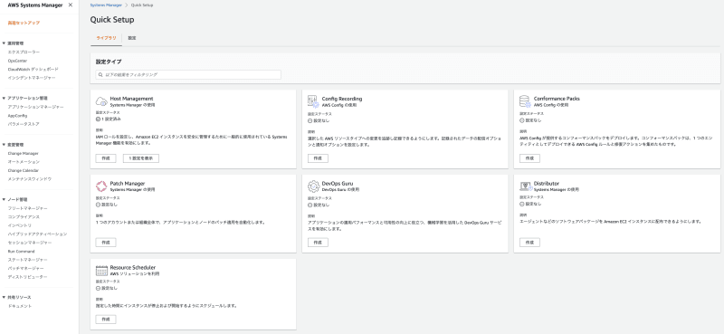
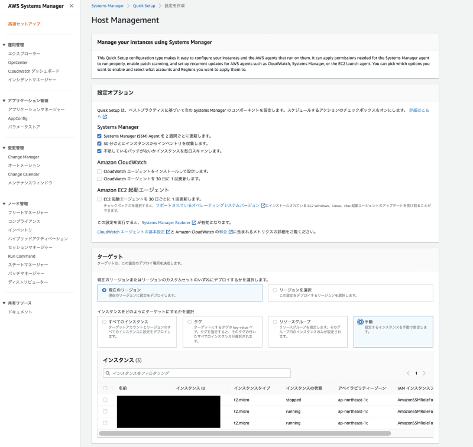
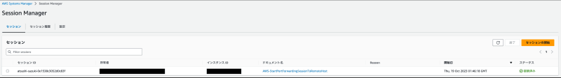
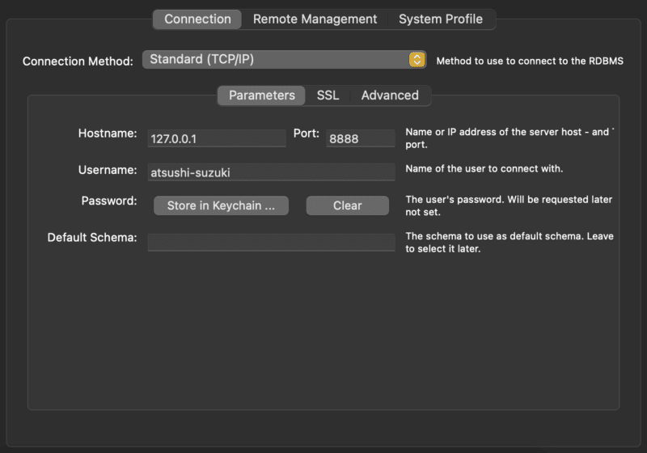
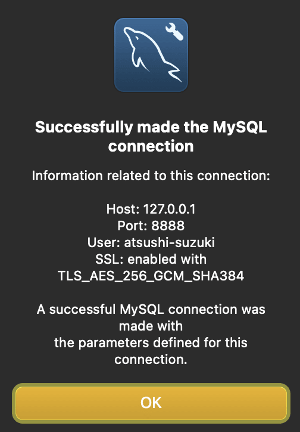

До сих пор мы использовали SSH-туннели через бастионный EC2 для подключения к нашей базе данных (RDS), облегчая соединения с клиентскими инструментами БД (например, MySQL Workbench) и управляя миграциями из наших локальных сред.

Мы поддерживали безопасные внешние соединения, ограничивая IP-адреса во входящих правилах группы безопасности бастионного EC2. Однако сложности, связанные со сменой IP-адресов в связи с появлением новых членов команды и изменением места работы, а также предпочтение хранить ресурсы в пределах частной подсети привели нас к переходу на метод подключения к базе данных с использованием AWS Systems Manager Session Manager.

Перейдя на Session Manager, мы получили ряд преимуществ:

Отсутствие необходимости создавать или управлять ключами SSH,
Более безопасные соединения с нашей базой данных,
ведение журнала и аудит действий сеанса с помощью CloudTrail.

## Процесс подключения

Процесс подключения к БД с помощью Session Manager состоит в основном из следующих шагов:

Инициирование сеанса переадресации портов: Запустите сеанс переадресации портов через Session Manager с помощью AWS CLI или AWS Management Console.  
Настройка локальной машины: После установления сессии локальная машина выступает в качестве конечной точки для связи между экземплярами DB, основываясь на данных, предоставленных Session Manager.  
Подключение к базе данных: Подключение к базе данных через установленный сеанс переадресации портов. Для этого этапа требуются соответствующие учетные данные аутентификации и параметры подключения.

## Этапы реализации

### Предварительные проверки

Убедитесь, что агент AWS Systems Manager Agent (SSM Agent) работает на целевом экземпляре EC2 и обновлен. Агент SSM Agent обеспечивает безопасную связь между экземпляром и Systems Manager.

### Создание пользователя IAM

Создайте пользовательскую политику IAM с именем AssumeSSMRolePermissionPolicy и прикрепите ее к определенным пользователям IAM (или группам IAM, в которые они входят). Это позволит пользователям IAM принимать на себя определенные роли IAM, связанные с SSM, предоставляя им необходимые разрешения.

`{ "Версия": "2012-10-17", "Statement": [ { "Effect": "Разрешить", "Действие": "sts:AssumeRole", "Resource": "arn:aws:iam::<Account ID>:role/AmazonSSMRoleForInstancesQuickSetup" } ] }`

`AmazonSSMRoleForInstancesQuickSetup` - это роль IAM, которую вы прикрепите к своим инстансам EC2 (вы создадите ее в ближайшее время). Эта роль используется для предоставления необходимых разрешений агенту SSM на экземплярах EC2 для корректной работы.

Приняв эту роль, пользователи IAM могут получать временные учетные данные (ключи доступа, секретные ключи доступа, сеансовые маркеры) для управления экземплярами EC2 через диспетчер сеансов. Следовательно, нет необходимости выдавать ключи доступа и секретные ключи доступа самим пользователям IAM.

## Установка AWS CLI

Чтобы инициировать сеансы переадресации портов, необходимо предварительно установить AWS CLI.

<https://docs.aws.amazon.com/cli/latest/userguide/cli-chap-getting-started.html>

Создание группы безопасности (SG)

В отличие от использования EC2 в качестве сервера-бастиона, входящие правила для SG больше не нужны. С другой стороны, исходящие правила должны быть установлены, чтобы разрешить соединения с RDS и агентом SSM.

Ниже приведен код Terraform для этой настройки.

`resource "aws_security_group" "rds_ssm_connector_sg" { name = "rds-ssm-connector-sg" description = "Группа безопасности для RDS SSM Connector" vpc_id = data.aws_ssm_parameter.vpc_id.value } resource "aws_security_group_rule" "rds_ssm_connector_sg_egress" { type = "egress" from_port = 3306 to_port = 3306 protocol = "tcp" security_group_id = aws_security_group.rds_ssm_connector_sg.id cidr_blocks = ["Диапазон IP-адресов экземпляра RDS"] } } ресурс "aws_security_group_rule" "rds_ssm_connector_sg_egress_ssm" { type = "egress" from_port = 443 to_port = 443 protocol = "tcp" security_group_id = aws_security_group.rds_ssm_connector_sg.id cidr_blocks = ["0.0.0.0/0"] }`

## Создание роли IAM

Создайте IAM-роль `AmazonSSMRoleForInstancesQuickSetup`, которая будет применяться к вашим экземплярам EC2. Примените к этой роли следующие управляемые политики для создания и управления сеансами SSM:

`AmazonSSMManagedInstanceCore`: Предоставляет базовые разрешения для взаимодействия экземпляра со службой SSM.

`AmazonSSMPatchAssociation`: Предоставляет разрешения для автоматизации применения базовых линий исправлений.

Кроме того, на вкладке ”Доверительные отношения" укажите в качестве "Доверенных сущностей" следующие. Это действие позволяет пользователям EC2 и IAM принимать эту роль IAM.

`{ "Версия": "2012-10-17", "Statement": [ { "Effect": "Разрешить", "Принцип": { "Service": "ec2.amazonaws.com", "AWS": "arn:aws:iam::<Account ID>:user/<Specific IAM User>" }, "Action": "sts:AssumeRole" } ] }`

Настройка управления хостом

Перейдите в раздел AWS Systems Manager > Quick Setup.  
Выберите Управление хостом.  
Выберите соответствующие экземпляры EC2 из своих целей.  
Инициируйте создание Host Management.

Процесс подключения

Получение временных учетных данных

Используя роль IAM и службу AWS Security Token Service (STS), вы можете работать с ресурсами AWS CLI без необходимости использовать ключи доступа.

Сначала получите временные учетные данные, выполнив следующую команду:

`$ aws sts assume-role --role-arn "arn:aws:iam::<Account ID>:role/AmazonSSMRoleForInstancesQuickSetup" --role-session-name "RDSPortForwardingSession"`.

Скопируйте выведенные `AccessKeyId`, `SecretAccessKey` и `SessionToken`.

`{ "Credentials": { "AccessKeyId": "XXXXXXXXXXX", "SecretAccessKey": "XXXXXXXXXXX", "SessionToken": "XXXXXXXXXXX", "Expiration": "2023-10-19T05:55:50+00:00" }, "AssumedRoleUser": { "AssumedRoleId": "XXXXXXXXXXXXX:RDSPortForwardingSession", "Arn": "arn:aws:sts::XXXXXXXXXXXXX:assumed-role/AmazonSSMRoleForInstancesQuickSetup/RDSPortForwardingSession" } }`

Далее установите учетные данные (`AccessKeyId`, `SecretAccessKey`, `SessionToken`) в качестве переменных окружения. Это можно сделать с помощью следующих команд в интерфейсе командной строки:

`export AWS_ACCESS_KEY_ID=<AccessKeyId> export AWS_SECRET_ACCESS_KEY=<SecretAccessKey> export AWS_SESSION_TOKEN=<SessionToken>`.

Запуск сеанса переадресации портов

Выполните следующую команду:

`$ aws ssm start-session --target [instance-id] --document-name AWS-StartPortForwardingSessionToRemoteHost --parameters host=[DB-endpoint],portNumber="3306",localPortNumber=[arbitrary-port]`.

В качестве произвольного порта выберите неиспользуемый порт (например, `8888`).

Об успехе свидетельствует сообщение, подобное следующему:

`Starting session with SessionId: session-id Порт 8888 открыт для sessionId session-id. Waiting for connections...`.

Кроме того, после успешного подключения сессия будет отображаться на экране консоли Session Manager. Это позволяет отслеживать и управлять активными сеансами, повышая контроль и меры безопасности при подключении к базе данных через AWS.

Настройка инструментов клиента базы данных (например, MySQL Workbench)

## Выполните следующие настройки

Метод подключения: `Стандартный (TCP/IP)`.

Имя хоста: `127.0.0.1` (будьте осторожны, так как использование `localhost` может привести к разрыву соединения)
Порт: Номер порта, который вы пробросили
Имя пользователя: Ваше имя пользователя БД

Нажмите на кнопку ”Проверить соединение" и, если появится запрос, введите пароль пользователя БД. Успешное подключение подтверждается появлением следующего диалогового окна.

## Заключение

Переход к более безопасному способу подключения к базе данных с помощью AWS Session Manager - это значительный шаг в повышении безопасности и эффективности управления ресурсами. Этот подход не только упрощает процесс, устраняя необходимость в хостах бастионов и управлении ключами SSH, но и повышает уровень безопасности за счет тонкого контроля доступа и возможностей аудита, предоставляемых AWS.

Благодаря настройке, описанной в этом руководстве, вы устранили несколько уровней потенциальной уязвимости и обеспечили надежный метод подключения. Теперь вы можете безопасно подключаться к своей базе данных из локальной среды, используя инфраструктуру AWS без необходимости управлять промежуточными серверами. Кроме того, этот метод обеспечивает спокойствие благодаря AWS CloudTrail, бдительно следящей за действиями ваших сессий.

Всегда помните о том, что необходимо изучать и соблюдать передовые методы обеспечения безопасности, следить за актуальностью всего программного обеспечения и придерживаться принципа наименьших привилегий при назначении разрешений. Ландшафт технологий и угроз постоянно меняется, поэтому для поддержания безопасной и эффективной среды очень важно быть информированным и подготовленным.
