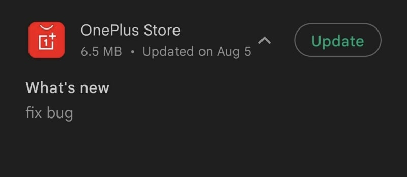

Написание хороших сообщений о фиксации в Git очень важно для поддержания понятной и удобной для навигации истории версий. Понятная история коммитов позволяет разработчикам понять контекст и объяснения, стоящие за изменениями кода, что облегчает сотрудничество и упрощает отладку.

Мы не можем так коммитить:

## Вот руководство по написанию хороших сообщений для фиксации в Git

- 1\. Используйте активный голос:

Он более прямой и понятный.  
Пример: ”Исправить ошибку в аутентификации пользователя" (а не "Ошибка в аутентификации пользователя была исправлена").

- 2\. Зафиксируйте каждое изменение отдельно:

Каждый коммит должен представлять собой отдельное логическое изменение. Это облегчает понимание и, при необходимости, возврат.

- 3\. Избегайте расплывчатых сообщений о фиксации:

”Исправлены ошибки" или "Внесены изменения" не являются полезными сообщениями. Всегда уточняйте, что именно было сделано.

- 4\. Содержите тему короткой:

Старайтесь, чтобы она состояла из 50 символов или меньше. Это позволит сделать сообщение кратким и легко читаемым в журналах.

- 5\. Используйте пулевые точки:

Для перечисления нескольких изменений или для лучшей читаемости.

- 6\. Ссылайтесь на связанные вопросы или Pull Requests:

Если коммит связан с проблемой или запросом на доработку, сделайте на него ссылку в теле. Это создаст связь между коммитом и проблемой или PR, что облегчит отслеживание контекста.  
Пример: ”Решает #123” или "Связано с #456”.

- 7\. Использование шаблона Git Commit:

Если ваша команда придерживается определенного формата сообщений для фиксации, подумайте о создании и использовании шаблона фиксации Git. Это обеспечит единый формат для всех.

- 8\. Избегайте включения деталей, которые можно увидеть в коде:

Сообщение о фиксации должно объяснять контекст и обоснование, а не дублировать изменения, сделанные в коде.

- 9\. Вычитывайте:

Прежде чем завершить фиксацию, перечитайте сообщение, чтобы убедиться, что оно четкое и не содержит опечаток.

Следуя этим рекомендациям, ваша история коммитов будет более структурированной, понятной и полезной как для вас, так и для других коллабораторов в будущем.
