Документация имеет решающее значение для успешного продукта. Без документации людям будет сложнее использовать ваш продукт, и это так же важно, если вы ведете проект с открытым исходным кодом.

Создание сайта с документацией может оказаться непростой задачей, особенно если вы не знакомы с фронтенд-разработкой.

Я работаю фронтенд-разработчиком последние 8 лет. За это время я использовал множество фреймворков для создания документации, таких как Next.js, nextra, content layer, Ghost CMS, lume (deno), docusaurus и Mark doc.

Но чтобы использовать многие из них, необходимо обладать необходимыми знаниями о JavaScript, Next.js и React. Вы можете столкнуться с некоторыми трудностями, например:

Отсутствие знаний JavaScript, React или других необходимых инструментовДокументирование версионирование Конфигурирование Развертывание

В этом руководстве я познакомлю вас с мощным инструментом, который поможет вам писать документацию без особых технических знаний.

## Что такое Docsify?

Чтобы помочь вам решить эту проблему, я рекомендую инструмент под названием Docsify. Docsify - это простой и легкий генератор документации. Вы можете начать использовать его, не имея никаких знаний о JavaScript или React.

Docsify поставляется с нулевой конфигурацией, без статически созданных HTML-файлов, поддержкой множества тем, встроенным API плагинов и поддержкой полнотекстового поиска с помощью плагина. Он также развертывается на широком спектре платформ, таких как GitHub pages, GitLab Pages, Firebase Netlify, Vercel и других.

Я создал демо-проект, чтобы показать вам, как его использовать - исходный код доступен на GitHub. Вы также можете посмотреть на живой демо-сайт.

## Как настроить и использовать Docsify

Вы можете создать новый проект с помощью docsify-cli. Чтобы использовать docsify-cli, вам нужно установить Node и NPM, если они у вас еще не установлены.

```bash
npm install -g docsify-cli # или
yarn add -g docsify-cli #и
pnpm add -g docsify-cli
```

Установите docsify глобально

Вывод команды выглядит следующим образом:

```bash
 pnpm add -g docsify-cli

 Packages: +198 +++++++++++++++++++++++++++++++++++++++++++++++++++++++++++++++++++++++++++++++ Прогресс: разрешено 199, повторно использовано 114, загружено 84, добавлено 198, выполнено .pnpm/docsify@4.13.1/node_modules/docsify: Запуск скрипта постинсталляции, выполнено за 196 мс /home/rajdeepsingh/.local/share/pnpm/global/5: + docsify-cli 4.4.4 + pnpm 8.7.0 Выполнено за 13.9с
```

Вывод команды

Создайте новый проект с помощью опции docsify-cli init.

```bash
docsify init docs
# Инициализация прошла успешно! Пожалуйста, запустите docsify serve ./docs
```

Вы также можете указать `--тему` и `--плагины`.

```bash
 docsify init docs --theme buble --plugins
```

Подробнее о docsify-cli вы можете прочитать на странице документации.

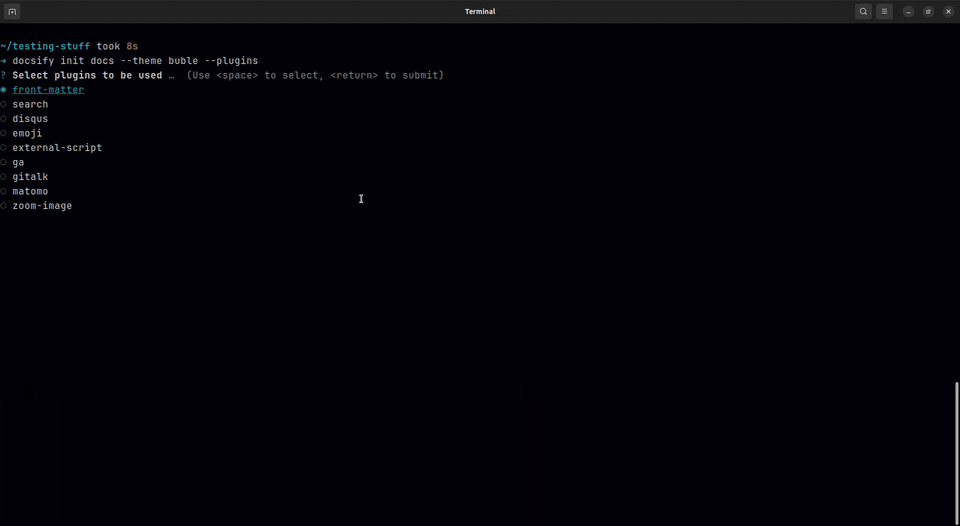Установите плагины с помощью опции docsify init.

Далее запустите локальный сервер разработки с помощью docsify-cli. Для этого выполните следующую команду:

```bash
docsify serve docs # или docsify serve .
```

Запуск локального сервера разработки

Ваш локальный сервер работает на порту 3000.

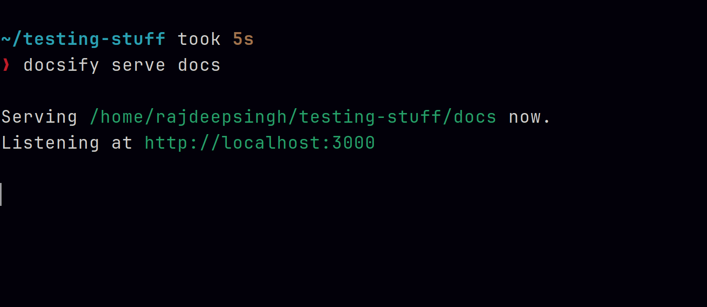Run docsify serve

Ваш сайт должен выглядеть так, когда вы откроете его в браузере:

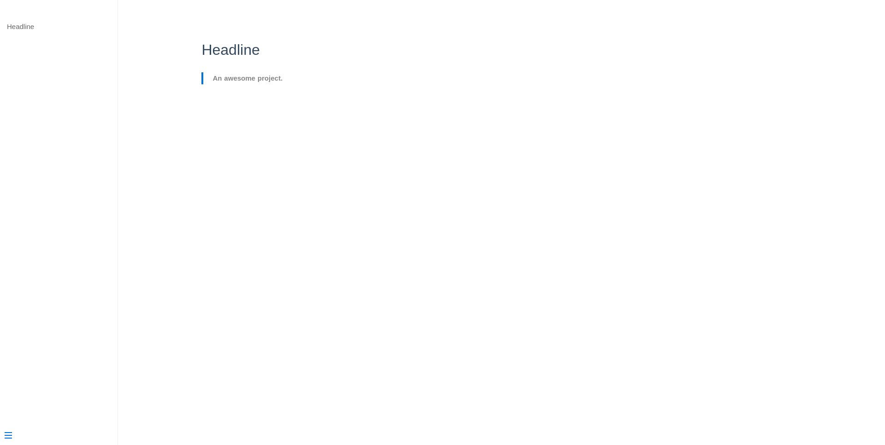Demo DoctifyСтруктура папок docsify

Docsify имеет простую структуру папок. По умолчанию, когда вы создаете новый проект с помощью docsify-cli, в нем есть три основных файла:

```bash
├──── index.html // Это файл HTML-записи. ├──── .nojekyll // Это полезно при развертывании проекта на страницах GitHub. └── README.md // Это домашняя страница или / router
```

Структура папокКак настроить Docsify

Docsify поставляется с большим количеством опций настройки, и вам не нужно никаких дополнительных знаний, чтобы настроить его - это довольно просто, как копирование и вставка кода.

В этом руководстве мы рассмотрим некоторые из наиболее распространенных вариантов настройки. Для более детальной настройки вы можете обратиться к документации Docsify.

- Базовая конфигурация
- Экран загрузки
- Сайдбар
- Заголовок
- Обложка страницы
- Плагины
- Темы
- Развертывание

## Базовая конфигурация

В базовой конфигурации вы можете изменить или добавить логотип, название, добавить ссылку на репозиторий GitHub, цвет темы и так далее.

Вот код для этого - вы можете заполнить свои собственные детали.

```js
<!-- index.html -->
<script>
  const docsifyConfig = {
    logo: '/_media/icon.svg',
    name: "Document",
    nameLink: '/',
    repo: "officialrajdeepsingh/docsifyjs",
    maxLevel: 2,
    themeColor: '#3F51B5',
  };
</script>
```

## Конфигурация на экране DoctifyLoading

Включение экрана загрузки или диалога обычно очень сложно, особенно если вы пришли из экосистемы JavaScript и React.js.

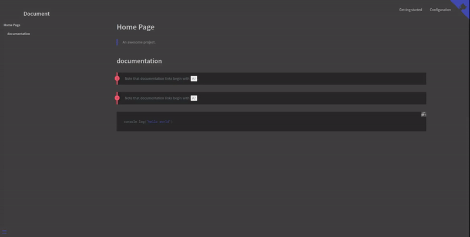Экран загрузки в Docsify

В Docsify можно включить экран загрузки без каких-либо настроек. Достаточно просто написать текст и HTML-элемент в ID приложения, который будетn отображается как экран загрузки. Выглядит это следующим образом:

```html
<!-- index.html -->
<div id="app">
	<h1>Пожалуйста, подождите...</h1>
</div>
```

## Добавление экрана загрузки в Doctify

По умолчанию в боковой панели отображается оглавление. Но вы можете легко настроить его. Сначала вам нужно включить боковую панель.

```js
<!-- index.html -->
<script>
  window.$docsify = {
    loadSidebar: true, // Enable sidebar
  };
</script>
```

## Настройка боковой панели в Doctify

Затем создайте новый файл `_sidebar.md` на корневом уровне и вставьте в него следующий код:

Вставьте следующий код в файл \_sidebar.md

Теперь ваша боковая панель должна выглядеть следующим образом:

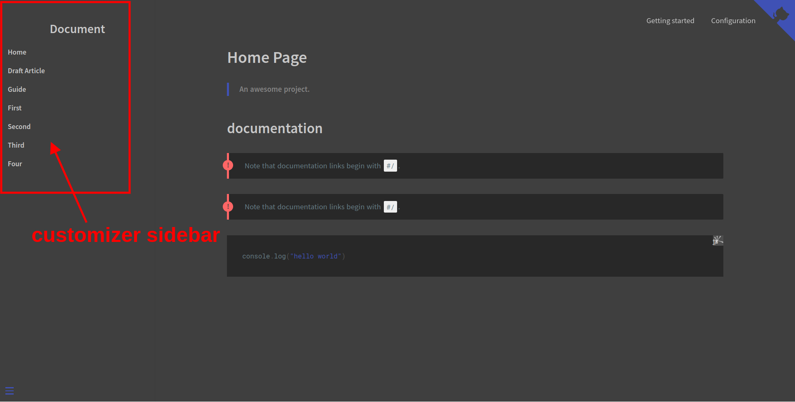Ваша боковая панель выглядит так.

По умолчанию на вашем сайте Docsify не будет отображаться панель навигации:

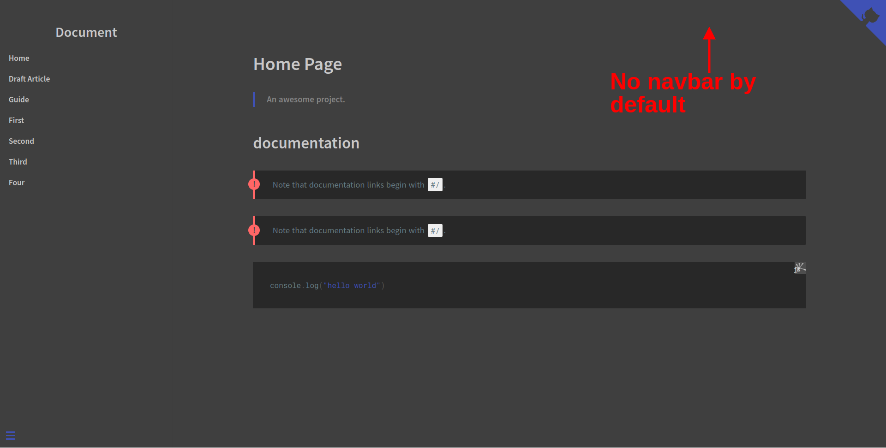No Navar

Но не волнуйтесь, вы можете это изменить. Чтобы отобразить панель Navbar, сначала нужно включить ее следующим образом:

```js
<!-- index.html -->
<script>
  window.$docsify = {
    loadNavbar: true, // Enable navbar
  };
</script>
</body>
</html>
```

Затем создайте новый файл `_navbar.md` на корневом уровне и вставьте в него следующий код:

```
* Начало работы
* [Быстрый старт](quickstart.md)
* [Написание дополнительных страниц](more-pages.md)
* [Пользовательская панель навигации](custom-navbar.md)
* [Обложка страницы](cover.md)
* Конфигурация
* [Конфигурация](configuration.md)
* [Темы](themes.md)
* [Использование плагинов](plugins.md)
* [Конфигурация Markdown](markdown.md)
* [Выделение языка](language-highlight.md)
```

Вставьте следующий код в файл \_navbar.md

Теперь ваша панель навигации должна выглядеть следующим образом:

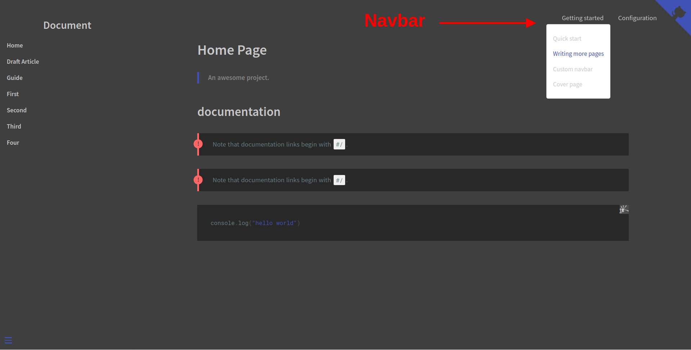Настроить Navbar в DocsifyCover Page

Сначала включите титульную страницу в docsify с помощью следующего кода:

```js
<!-- index.html -->
<script>
  const docsifyConfig = {
    coverpage: true, // enable coverpage
  };
</script>
```

Следующим шагом будет создание нового файла `_coverpage.md`.

`# Изучение Docsify ### Изучение docsify начинается с новичка.  [Start Learn]() [Github](#/README)`

Создание файла \_coverpage.md

Титульная страница вашего сайта должна выглядеть следующим образом:

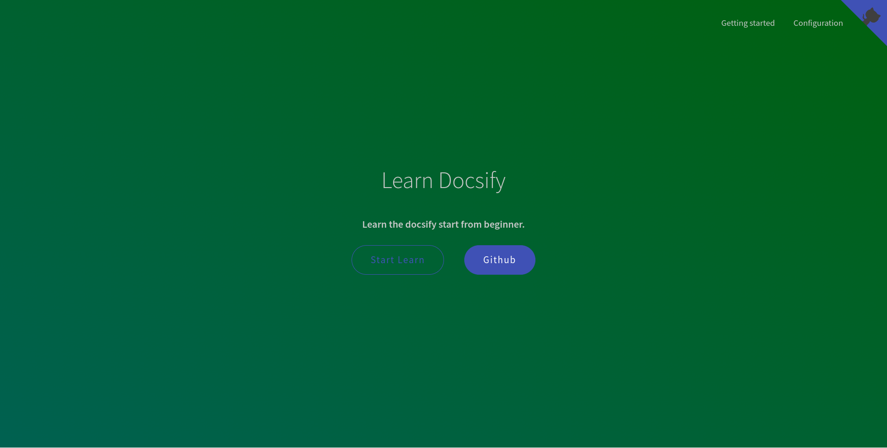Ваша титульная страница

Титульная страница и ваш пользовательский интерфейс зависят от темы, поэтому в разных темах они будут отличаться.

## Плагины

Плагины обеспечивают дополнительную функциональность и возможности Dicsify, а также улучшают пользовательский опыт.

Вы можете создавать и использовать плагины в соответствии со своими требованиями. В Docsify доступно множество плагинов с открытым исходным кодом, созданных различными разработчиками.

Вы можете использовать любой плагин, просто скопировав его код. Даже вы можете создавать свои собственные плагины с помощью docsify.

## Как использовать сторонние плагины

В этом примере мы включим строку поиска с помощью плагина docsify.

Чтобы включить строку поиска, скопируйте и вставьте следующий скрипт в файл `index.html`:

```html
<script src="https://cdn.jsdelivr.net/npm/docsify/lib/plugins/search.min.js"></script>
```

Теперь строка поиска появится и будет работать на вашем сайте. С помощью плагина поиска вы также можете настраивать различные функции - подробнее об этом читайте на странице установки и настройки плагина поиска.

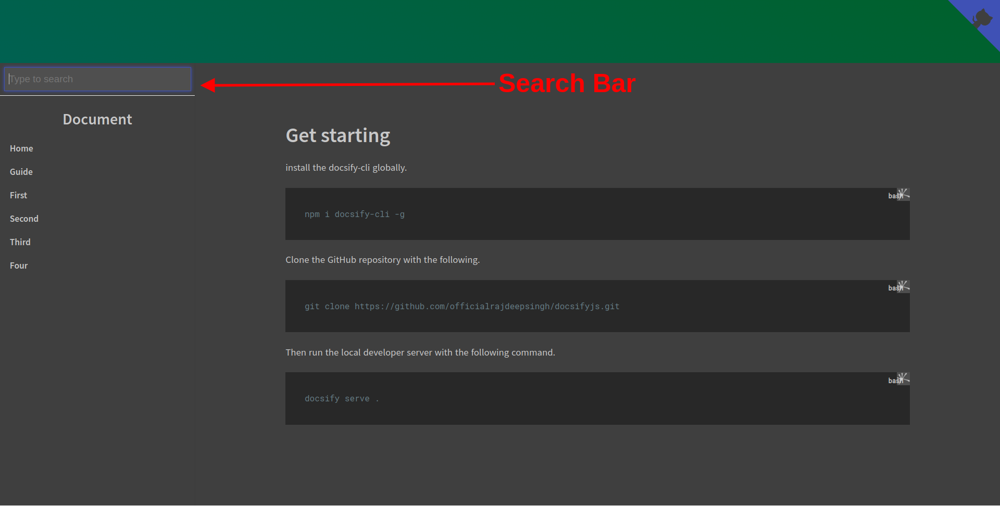Плагин поиска DocsifyКак создать свой собственный плагин с помощью docsify

Чтобы создать свой собственный плагин в docsify, есть встроенный хук, который вам нужно будет использовать для плагина.

В Docsify есть шесть встроенных хуков: `init`, `mounted`, `beforeEach`, `afterEach`, `doneEach` и `ready`.

`init`: вызывается один раз при инициализации скрипта docsify.`mounted`: вызывается один раз при установке экземпляра docsify в DOM.`beforeEach`: вызывается при каждой загрузке страницы перед преобразованием новой разметки в HTML.`afterEach`: вызывается при каждой загрузке страницы после того, как разметка была преобразована в HTML.`doneEach`: вызывается при каждой загрузке страницы после того, как новый HTML был добавлен в DOM.`ready`: вызывается один раз после рендеринга начальной страницы.

С помощью этих крючков вы можете создать плагин. Чтобы узнать больше о создании собственных плагинов, посетите страницу документа о пользовательских плагинах.

В этом примере мы создадим кнопку редактирования с помощью хука плагина beforeEach. Она отображает кнопку EDIT DOCUMENT на каждой странице.

```js
<!-- index.html -->
<script>
  window.$docsify = {
    plugins: [
      function editButton(hook, vm) {
        hook.beforeEach(function (html) {
          var baseUrl = "https://github.com/officialrajdeepsingh/docsifyjs/edit/master/";
          var fileUrl = vm.route.file.replace("docsifyjs/README.md", "README.md");
          var editUrl = baseUrl + fileUrl;

          var editHtml = "[📝 EDIT DOCUMENT](" + editUrl + ")\n";

          return editHtml + html + "\n----\n" + "Последнее изменение " + editHtml;
        });
      },
    ],
  };
</script>
```

## Темы

У Docsify есть как официальные темы, так и темы, созданные сообществом. Вы можете использовать любую из них, и самое приятное, что вам не нужно писать дополнительный код при смене темы..

```html
<!-- Vue theme -->
<link rel="stylesheet" href="https://cdn.jsdelivr.net/npm/docsify/themes/vue.css" />

<!-- Buble theme -->
<link rel="stylesheet" href="https://cdn.jsdelivr.net/npm/docsify/themes/buble.css" />

<!-- Dark theme -->
<link rel="stylesheet" href="https://cdn.jsdelivr.net/npm/docsify/themes/dark.css" />

<!-- Pure theme -->
<link rel="stylesheet" href="https://cdn.jsdelivr.net/npm/docsify/themes/pure.css" />
```

Вы можете выбрать, сжимать или не сжимать CSS-файлы темы. Сжатый CSS-файл представляет собой минифицированную версию темы, и это облегченный CSS-файл для производства. С другой стороны, несжатый CSS-файл темы полезен для разработки.

Вы просто копируете CSS-файл темы (Vue, bubble, dark и pure) и вставляете его в элемент head. И все, ваша тема изменена.

Что касается неофициальных тем, я думаю, что тема docsify-themeable - это лучший вариант для вас.

## Развертывание

Docsify предлагает различные варианты развертывания. Вы можете развернуть свой сайт Docsify на страницах GitHub, GitLab Pages, Firebase Hosting, VPS (Nginx), Netlify, Vercel, AWS Amplify и Docker.

На некоторых платформах, таких как GitHub pages, вы развертываете сайт docsify непосредственно с репозиторием GitHub без написания каких-либо настроек.

Вот как это делается:

Перейдите в меню Настройки > Страницы > Источник > и выберите Развертывание из ветки > Ветка > Выберите ветку с папкой и нажмите на кнопку сохранения.

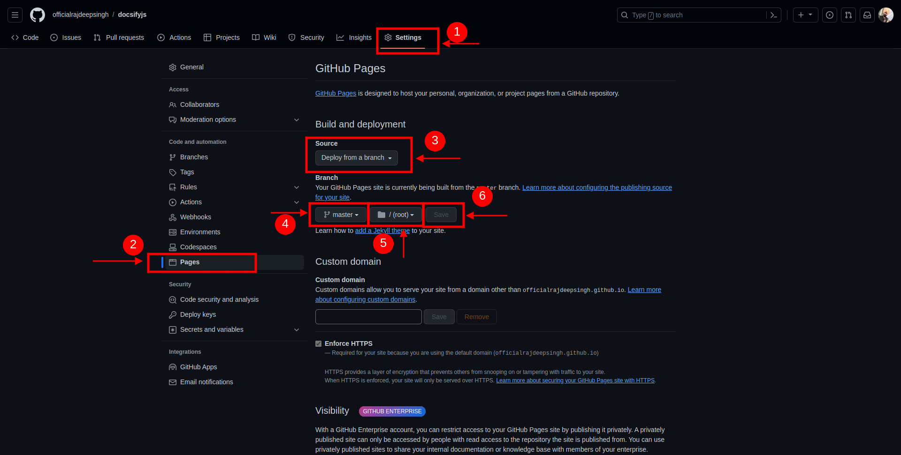Развертывание docsify со страницами GitHub

Это займет некоторое время, в зависимости от размера вашего сайта. После завершения развертывания вы должны увидеть ваш рабочий URL.

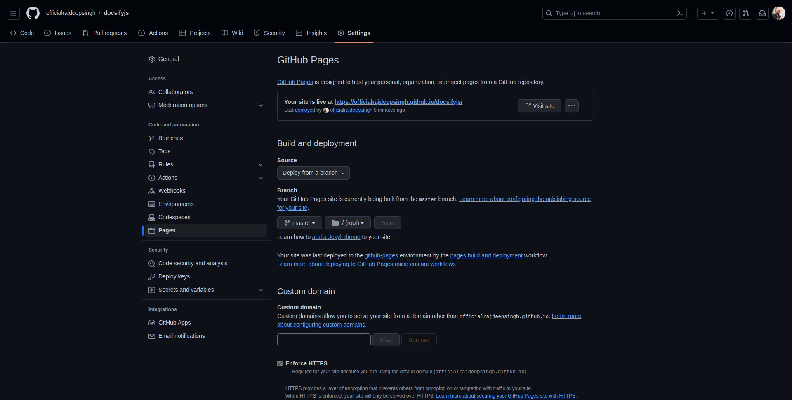Завершение развертыванияЗаключение

Docsify - это мощный инструмент для создания сайтов документации. В Docsify вы можете сосредоточиться на написании документации, а не на дизайне пользовательского интерфейса.

Docsify - это хороший вариант для разработчиков, которые не очень хорошо знакомы с JavaScript. Если вы больше ориентируетесь на низкоуровневые языки, такие как C++ или rust, docsify поможет вам начать писать документацию с помощью одной команды.

Недавно я использовал docsify для своего репозитория awesome-nextjs. Вы можете легко развернуть его на странице GitHub без каких-либо настроек.

Только имейте в виду, что у docsify есть два минуса:

Docsify не генерирует динамические SEO-метатеги для страницы. Она генерирует только заголовок и описание. Тема docsify не обеспечивает современный пользовательский интерфейс.

Но это все равно очень полезно! Наслаждайтесь созданием документации :)
