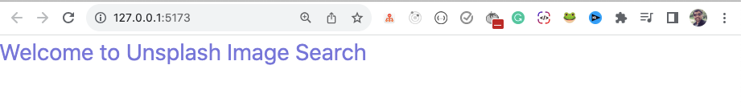

В этой статье мы шаг за шагом создадим красивое приложение для поиска изображений Unsplash с пагинацией с помощью React.

Создав это приложение, вы узнаете:

- Как создать приложение с использованием Unsplash API в React
- Как выполнять вызовы API в различных сценариях
- Как использовать хук `useCallback`, чтобы избежать повторного создания функций
- Как использовать ESLint для устранения проблем в работе приложения
- Как реализовать пагинацию в React

и многое другое…

Хотите посмотреть видеоверсию этого урока? Вы можете посмотреть видео ниже:

## Начальная настройка проекта

Мы будем использовать [Vite](https://vitejs.dev/) для создания проекта, который является популярной альтернативой `create-react-app`.

Выполните следующую команду для создания проекта vite:

```bash
npm create vite
```

После выполнения вам будет задано несколько вопросов.

В качестве имени проекта введите `unsplash_image_search`.

Для фреймворка выберите `React`, а для варианта - `JavaScript`:


Создание проекта с помощью Vite

После создания проекта откройте его в VS Code и выполните в терминале следующие команды:

```bash
cd unsplash_image_search
npm install
npm run dev
```

Получите доступ к приложению, перейдя по адресу [http://127.0.0.1:5173/](http://127.0.0.1:5173/).


Приложение запущено

Вы увидите экран приложения по умолчанию, как показано ниже:


Начальный экран

Далее удалите файл `App.css` и замените содержимое файла `App.jsx` следующим содержимым:

```jsx
import React from 'react';
import './index.css';

const App = () => {
	return <div>Приветствуем вас на Unsplash Image Search</div>;
};

export default App;
```

Теперь откройте файл `index.css` и добавьте в него содержимое из [этого репозитория GitHub](https://github.com/myogeshchavan97/unsplash_image_search/blob/master/src/index.css).

Установим пакеты npm [B](https://getbootstrap.com/)[ootstrap](https://getbootstrap.com/) и [react-bootstrap](https://react-bootstrap.netlify.app/), выполнив следующую команду:

```bash
npm install bootstrap react-bootstrap
```

Откройте файл `main.jsx` и добавьте следующую строку кода в первую строку, чтобы добавить базовый CSS-файл bootstrap:

```js
import 'bootstrap/dist/css/bootstrap.min.css';
```

Полный файл `main.jsx` будет выглядеть следующим образом:

```jsx
import 'bootstrap/dist/css/bootstrap.min.css';
import React from 'react';
import ReactDOM from 'react-dom/client';
import App from './App.jsx';
import './index.css';

ReactDOM.createRoot(document.getElementById('root')).render(
	<React.StrictMode>
		<App />
	</React.StrictMode>,
);
```

Теперь перезапустите приложение, выполнив команду `npm run dev`.

На экране появится приветственное сообщение, как показано ниже:



Экран приветствия

## Как добавить поисковый ввод

Теперь замените содержимое файла `App.jsx` на следующее:

```jsx
import React from 'react';
import { Form } from 'react-bootstrap';
import './index.css';

const App = () => {
	return (
		<div className="container">
			<h1 className="title">Поиск изображений</h1>
			<div className="search-section">
				<Form>
					<Form.Control
						type="search"
						placeholder="Введите что-нибудь для поиска..."
						className="search-input"
					/>
				</Form>
			</div>
		</div>
	);
};

export default App;
```

Здесь мы отображаем заголовок `Image search` внутри класса `container`, который является классом Bootstrap, чтобы добавить немного поля слева и справа от страницы.

Затем мы добавили [f](https://react-bootstrap.netlify.app/docs/forms/overview/)[orm](https://react-bootstrap.netlify.app/docs/forms/overview/) с типом `поиск`.

Если вы проверите приложение, то увидите следующий экран:


Первоначальный пользовательский интерфейс поиска

Теперь нам нужно сохранить значение, введенное пользователем, где-то в компоненте.

Поскольку у нас будет только одно поле ввода на странице, мы используем хук [useRef](https://react.dev/reference/react/useRef) вместо хука `useState`.

Использование хука `useRef` позволяет не перерисовывать компонент при изменении его значения, что хорошо для повышения производительности. С другой стороны, изменение состояния перерисовывает компонент, поэтому все дочерние компоненты также будут перерисованы.

Внутри файла `App.jsx` объявите хук `useRef`, как показано ниже:

```jsx
const searchInput = useRef(null);
```

Не забудьте добавить импорт для хука `useRef` в верхней части файла:

```jsx
import React, { useRef } из 'react';

```

Также добавьте параметр `ref` для ввода поиска, например, так:

```jsx
<Form.Control
	type="search"
	placeholder="Введите что-нибудь для поиска..."
	className="search-input"
	ref={searchInput}
/>
```

Ваш полный файл `App.jsx` будет выглядеть следующим образом:

```jsx
import React, { useRef } из 'react';
import { Form } from 'react-bootstrap';
import './index.css';

const App = () => {
const SearchInput = useRef(null);
return (

<div className='container'>
<h1 className='title'>Поиск изображений</h1>
<div className='search-section'>
<Форма
<Form.Control
type='search'
placeholder='Введите что-нибудь для поиска...'
className='search-input'
ref={searchInput}
/>
</Form>
</div>
</div>
);
};

export default App;

```

## Как работать с действием отправки формы

Когда мы вводим любой поисковый запрос в поле поиска и нажимаем клавишу Enter, мы хотим добавить функцию поиска.

Для этого добавьте обработчик `onSubmit` к тегу `Form` и создайте метод `handleSearch`. И назначьте его реквизиту `onSubmit` следующим образом:

```jsx
import React, { useRef } from 'react';
import { Form } from 'react-bootstrap';
import './index.css';

const App = () => {
	const SearchInput = useRef(null);

	const handleSearch = (event) => {
		event.preventDefault();
		console.log('submitted');
	};

	return (
		<div className="container">
			<h1 className="title">Поиск изображений</h1>
			<div className="search-section">
				<Form onSubmit={handleSearch}>
					<Form.Control
						type="search"
						placeholder="Введите что-нибудь для поиска..."
						className="search-input"
						ref={searchInput}
					/>
				</Form>
			</div>
		</div>
	);
};

export default App;
```

Здесь мы добавили `<Form onSubmit={handleSearch}>` и внутри метода `handleSearch` использовали метод `event.preventDefault`.

После отправки формы нажатием клавиши Enter в поле поиска страница не будет обновляться, а в консоль будет выведен текст отправки, как показано ниже:


Действие отправки формы

Теперь, вместо того чтобы выводить “submitted”, мы можем вывести значение, введенное пользователем, используя `searchInput.current.value`.

Здесь `searchInput` - это `ref`, а `searchInput.current` будет фактическим вводом в поле поиска. Также использование `searchInput.current.value` даст фактическое значение, введенное пользователем.

Итак, замените метод `handleSearch` следующим кодом:

```jsx
const handleSearch = (event) => {
	event.preventDefault();
	console.log(searchInput.current.value);
};
```

Теперь вы увидите, как введенное значение отображается в консоли:


Отображение введенного значения поискового термина в консоли

## Как добавить опции быстрого поиска

Теперь давайте добавим кнопки действия с классом `filters` для быстрого поиска прямо под div `search-section`:

```jsx
<div className="container">
	<h1 className="title">Поиск изображений</h1>
	<div className="search-section">...</div>
	<div className="filters">
		<div>Природа</div>
		<div>Птицы</div>
		<div>Кошки</div>
		<div>Обувь</div>
	</div>
</div>
```

Теперь приложение будет выглядеть следующим образом:


Добавлены опции быстрого поиска

Когда мы нажимаем на любую из отображаемых кнопок, мы можем отобразить значение нажатой кнопки в поле ввода поиска, чтобы использовать его для поиска изображений.

Измените div `filters` на приведенный ниже код:

```jsx
<div className="filters">
	<div onClick={() => handleSelection('nature')}>Nature</div>
	<div onClick={() => handleSelection('birds')}>Птицы</div>
	<div onClick={() => handleSelection('cats')}>Кошки</div>
	<div onClick={() => handleSelection('shoes')}>Shoes</div>
</div>
```

В приведенном выше коде, когда вы нажимаете на любую опцию, мы передаем выбранную опцию в метод `handleSelection`.

Теперь добавьте новый метод `handleSelection` внутри компонента `App`, как показано ниже:

```jsx
const handleSelection = (selection) => {
	searchInput.current.value = selection;
};
```

Ваш полный файл `App.jsx` будет выглядеть следующим образом:

```jsx
import React, { useRef } из 'react';
import { Form } from 'react-bootstrap';
import './index.css';

const App = () => {
  const SearchInput = useRef(null);

  const handleSearch = (event) => {
    event.preventDefault();
    console.log(searchInput.current.value);
  };

  const handleSelection = (selection) => {
    searchInput.current.value = selection;
  };

  return (
    <div className='container'>
      <h1 className='title'>Поиск изображений</h1>
      <div className='search-section'>
        <Form onSubmit={handleSearch}>
          <Form.Control
            type='search'
            placeholder='Введите что-нибудь для поиска...'
            className='search-input'
            ref={searchInput}
          />
        </Form>
      </div>
      <div className='filters'>
        <div onClick={() => handleSelection('nature')}>Природа</div>
        <div onClick={() => handleSelection('birds')}>Птицы</div>
        <div onClick={() => handleSelection('cats')}>Кошки</div>
        <div onClick={() => handleSelection('shoes')}>Shoes</div>
      </div>
    </div>
  );
};

export default App;
```


Отображение опции выбора в окне поиска

## Как получить доступ к API Unsplash

Теперь, чтобы реализовать поиск изображений, нам нужно получить ключ API от [Unsplash Website](https://unsplash.com/).

Перейдите по адресу [this URL](https://unsplash.com/developers) и нажмите на кнопку ”Зарегистрироваться как разработчик", расположенную в правом верхнем углу страницы. Создайте свою учетную запись, введя все необходимые данные.


После регистрации вы будете перенаправлены на [эту страницу](https://unsplash.com/oauth/applications), как показано ниже:


Регистрация нового приложения в Unsplash API

Нажмите на кнопку `Новое приложение`. На следующем экране:

- Установите все флажки и нажмите на кнопку `Принять условия`.
- Введите значения для `Имя приложения` и `Описание` и нажмите кнопку `Создать приложение`.


Создание нового приложения с помощью Unsplash API

Прокрутите страницу вниз и скопируйте `ключ доступа`, который отобразится на экране:

Получение ключа доступа от API Unsplash

Далее создайте новый файл `.env` в вашем проекте и добавьте новую переменную окружения с именем `VITE_API_KEY`. Также присвойте ей скопированное значение ключа API:

```jsx
VITE_API_KEY = A4UiJ5OIwL_4ccbCAE1ZXw3EgoNRotMbdNe12qtKHzM;
```

Убедитесь, что имя переменной начинается с `VITE_`, чтобы она была доступна в приложении.

Структура папок вашего приложения будет выглядеть следующим образом:


Структура папок с файлом .env

Также не забудьте добавить `.env` в файл `.gitignore`, чтобы файл не был выгружен на GitHub при выгрузке изменений на GitHub.

Теперь перейдите на страницу [Unsplash Documentation](https://unsplash.com/documentation) и нажмите на раздел `Поиск фотографий по ключевому слову`. И скопируйте следующий URL-адрес базового API: `https://api.unsplash.com/search/photos`.


Страница документации API поисковых изображений

Теперь откройте файл `App.jsx` и вставьте скопированный URL в качестве `API_URL` после всех операторов импорта, как показано ниже:

```jsx
const API_URL = 'https://api.unsplash.com/search/photos';
```

Согласно документации, API поиска фотографий с указанным выше URL принимает в качестве параметров запроса `query`, `page` и `per_page`. Просто обратите на это внимание, так как мы будем использовать его в ближайшее время.

## Как сделать вызов API для Unsplash API

Чтобы сделать вызов API, давайте сначала установим библиотеку `axios` npm, выполнив следующую команду из папки проекта:

```js
npm install axios

```

После установки снова запустите приложение, выполнив команду `npm run dev`.

Далее объявите новую константу чуть ниже константы `API_URL`:

```jsx
const IMAGES_PER_PAGE = 20;
```

Здесь мы указываем отображение `20` изображений на странице, когда мы будем реализовывать пагинацию. Вы можете изменить это значение на любое другое.

Добавьте новую функцию `fetchImages` внутри компонента `App` следующим образом:

```jsx
const fetchImages = async () => {
	try {
		const { data } = await axios.get(
			`${API_URL}?query=${searchInput.current.value}&page=1&per_page=${IMAGES_PER_PAGE}&client_id=${
				import.meta.env.VITE_API_KEY
			}`,
		);
		console.log('data', data);
	} catch (error) {
		console.log(error);
	}
};
```

Здесь мы определили функцию `fetchImages`, которая объявлена `async`, поэтому мы можем использовать `await` внутри нее.

Если вы не знаете о promises и async/await, я настоятельно рекомендую ознакомиться с [этой статьей](https://www.freecodecamp.org/news/javascript-promises-async-await-and-promise-methods/).

Затем, внутри функции `fetchImages`, мы делаем вызов GET API с помощью axios на URL, который мы сохранили в константе `API_URL`: `https://api.unsplash.com/search/photos`.

В URL API мы передаем следующие параметры запроса, используя [синтаксис шаблонного литерала] (<https://bit.ly/3rtiQ9y>):

- `query` со значением введенным пользователем или значением опции быстрого поиска
- `page` со значением `1` для получения данных о первой странице
- `per_page` со значением `20`, которое определяется в константе `IMAGES_PER_PAGE`
- `client_id` со значением ключа API из файла `.env`.

Поскольку мы используем [Vite](https://vitejs.dev/), для доступа к переменным окружения из файла `.env` нам нужно использовать `import.meta.env.VITE_API_KEY`.

Здесь `VITE_API_KEY` - это переменная окружения, которую мы объявили в файле `.env`.

Также импортируйте библиотеку `axios` в верхней части файла следующим образом:

```js
import axios from axios;
```

Обновленный файл `App.jsx` будет выглядеть следующим образом:

```jsx
import axios from 'axios';
import React, { useRef } из 'react';
import { Form } from 'react-bootstrap';
import './index.css';

const API_URL = 'https://api.unsplash.com/search/photos';
const IMAGES_PER_PAGE = 20;

const App = () => {
const SearchInput = useRef(null);

const fetchImages = async () => {
try {
const { data } = await axios.get(
`${API_URL}?query=${
          searchInput.current.value
        }&page=1&per_page=${IMAGES_PER_PAGE}&client_id=${
          import.meta.env.VITE_API_KEY
        }`
);
console.log('data', data);
} catch (error) {
console.log(error);
}
};

const handleSearch = (event) => {
event.preventDefault();
console.log(searchInput.current.value);
};

const handleSelection = (selection) => {
searchInput.current.value = selection;
fetchImages();
};

return (

<div className='container'>
<h1 className='title'>Поиск изображений</h1>
<div className='search-section'>
<Form onSubmit={handleSearch}>
<Form.Control
type='search'
placeholder='Введите что-нибудь для поиска...'
className='search-input'
ref={searchInput}
/>
</Form>
</div>
<div className='filters'>
<div onClick={() => handleSelection('nature')}>Nature</div>
<div onClick={() => handleSelection('birds')}>Птицы</div>
<div onClick={() => handleSelection('cats')}>Кошки</div>
<div onClick={() => handleSelection('shoes')}>Shoes</div>
</div>
</div>
);
};

export default App;

```

Если вы проверите приложение, то увидите, что при каждом щелчке на опции быстрого поиска происходит вызов API Unsplash API, и мы получаем данные для выбранной опции.


Выполнение вызова API при нажатии на опцию быстрого поиска

Чтобы сделать вызов API, когда мы вводим текст поиска и нажимаем клавишу Enter, нам нужно вызвать функцию `fetchImages` из функции `handleSearch`.

Для этого добавьте вызов функции `fetchImages` внутри функции `handleSearch`, как показано ниже:

```jsx
const handleSearch = (event) => {
	event.preventDefault();
	console.log(searchInput.current.value);
	fetchImages();
};
```

Теперь вы сможете увидеть вызов API на вкладке ”Сеть", когда мы вводим текст для поиска и нажимаем клавишу Enter.


Выполнение вызова API при вводе текста в поле поиска

## Как хранить данные API с помощью состояния

Теперь давайте выведем на экран изображения, полученные от API.

Чтобы вывести их на экран, нам сначала нужно сохранить данные, полученные от API.

Если вы посмотрите на структуру ответа API, то увидите, как показано ниже:


Ответ API

Итак, объявим два состояния в файле `App.jsx`: одно для хранения изображений ответа, которые приходят в свойстве `results`, а другое для хранения `total_pages`, чтобы мы могли реализовать пагинацию.

```jsx
const App = () => {
const SearchInput = useRef(null);
const [images, setImages] = useState([]);
const [totalPages, setTotalPages] = useState(0);
....
}

```

И обновите функцию `fetchImages` для сохранения `data.results` с помощью `setImages` и общего количества страниц с помощью функции `setTotalPages`:

```jsx
const fetchImages = async () => {
	try {
		const { data } = await axios.get(
			`${API_URL}?query=${searchInput.current.value}&page=1&per_page=${IMAGES_PER_PAGE}&client_id=${
				import.meta.env.VITE_API_KEY
			}`,
		);
		console.log('data', data);
		setImages(data.results);
		setTotalPages(data.total_pages);
	} catch (error) {
		console.log(error);
	}
};
```

## Как вывести изображения на экран

Теперь давайте выведем на экран изображения, которые мы сохранили в переменной состояния `images`.

Если вы развернете ответ API на отдельное изображение, то увидите свойства `id`, `alt_description`, `urls`, которые мы можем использовать для отображения отдельных изображений.


Свойства ответа API

Итак, сразу после div `filters` добавьте еще один div для отображения изображений, как здесь:

```jsx

<div className='filters'>
  ...
</div>
<div className='images'>
  {images.map((image) => {
    return (
      
    );
  })}
</div>
```

Здесь мы отображаем `маленькую` версию изображения из свойства `urls` отдельного изображения.

Мы можем еще больше упростить приведенный выше код. Внутри метода массива `map` вместо фигурной скобки с ключевым словом `return` мы можем переписать его следующим образом:

```jsx

<div className='filters'>
  ...
</div>
<div className='images'>
{images.map((image) => (
  
))}
</div>
```

Здесь мы неявно возвращаем JSX из метода массива `map`, добавляя круглую скобку вокруг JSX.

Теперь при поиске любого текста изображения будут отображаться корректно.


Отображение изображений при нажатии на значок быстрого поиска


Отображаемые изображения при нажатии на значок быстрого поиска


Отображение изображений после ввода термина поиска

## Как реализовать пагинацию

Теперь мы добавим кнопки ”Предыдущий" и "Следующий" для просмотра разных наборов изображений.

Для этого сначала объявите новое состояние в компоненте `App`, как показано ниже:

```jsx
const [page, setPage] = useState(1);
```

Внутри функции `fetchImages` измените `page=1` на `page=${page}`, чтобы при изменении значения `page` загружались изображения для выбранной `page`.

Добавьте новый div с классом `buttons` прямо под div `images`, как показано ниже:

```jsx
<div className='images'>
  ...
</div>
<div className='buttons'>
  {page > 1 && <Button>Previous</Button>}
  {page < totalPages && <Button>Next</Button>}
</div>
```

В приведенном выше коде мы показываем кнопку `Previous` только в том случае, если значение `page` больше `1`, то есть для первой страницы мы не увидим кнопку `Previous`.

А если текущее значение `page` меньше, чем `totalPages`, то только тогда мы покажем кнопку `Next`. Это означает, что для последней страницы мы не увидим кнопку `Next`.

Если вы помните, мы уже установили значение `totalPages` внутри функции `fetchImages`, вызвав функцию `setTotalPages`, и используем его выше, чтобы скрыть кнопку `Next`.

Также не забудьте добавить импорт для компонента `Button` из `react-bootstrap` внутри компонента `App`:

```jsx
import { Button } from 'react-bootstrap';
```

Теперь, когда мы нажимаем на кнопку `Previous`, нам нужно `уменьшить` значение переменной состояния `page`. А когда мы нажимаем на кнопку `Next`, нам нужно `увеличить` значение переменной состояния `page`.

Поэтому давайте добавим обработчик `onClick` для обеих этих кнопок, как показано ниже:

```jsx
<div className="buttons">
	{page > 1 && <Button onClick={() => setPage(page - 1)}>Previous</Button>}
	{page < totalPages && <Button onClick={() => setPage(page + 1)}>Next</Button>}
</div>
```

Давайте выведем в консольный лог значение переменной состояния `page`, чтобы мы могли видеть, как обновляется значение.

После метода `handleSelection` добавьте console.log следующим образом:

```jsx
console.log('page', page);
```


Отображение текущего значения страницы в консоли

Как вы можете видеть выше, изначально для первой страницы мы не видим кнопки `Previous`.

А когда мы нажимаем на кнопку `Next`, мы видим кнопки `Previous` и `Next`, и значение `page` также увеличивается на `1`, как вы можете видеть в консоли.

Таким образом, при каждом нажатии кнопки `Next` значение `page` увеличивается на `1`. А при каждом нажатии кнопки `Previous` значение `page` уменьшается на `1`.

И когда мы возвращаемся на первую страницу, кнопка `Previous` снова скрывается, что вполне ожидаемо.

Как вы могли заметить выше, значение страницы изменяется при нажатии кнопок `Previous` и `Next`, но новый набор изображений при нажатии этих кнопок не загружается.

Это происходит потому, что мы не делаем повторный вызов API с обновленным значением страницы, когда значение страницы меняется.

Так что давайте сделаем именно это.

Добавьте хук `useEffect` в компонент `App` следующим образом:

```jsx
useEffect(() => {
	fetchImages();
}, [page]);
```

Теперь каждый раз, когда мы нажимаем на кнопку `Previous` или `Next`, значение `page` меняется, поэтому будет выполняться вышеуказанный хук `useEffect`, где мы вызываем функцию `fetchImages` для загрузки следующего набора изображений.

Теперь, если вы проверите приложение, вы увидите, что изображения загружены правильно.


Загрузка следующего набора изображений с помощью пагинации

Как вы можете видеть выше, мы правильно загружаем изображения при нажатии на кнопку `Previous` или `Next`.

Но есть небольшая проблема.

Если мы не находимся на первой или последней странице, мы видим кнопки `Previous` и `Next`, а когда мы пытаемся найти другой термин или нажимаем на опции быстрого поиска, wвсе еще отображается кнопка `Предыдущий`.

В идеале, когда мы ищем другой термин или нажимаем на другую опцию быстрого поиска, мы должны начинать с первой страницы, поэтому должна быть видна только кнопка `Next`. Но сейчас видны обе кнопки - `Previous` и `Next`, как показано ниже:


Проблема с предыдущими кнопками, не скрывающимися при поиске

Чтобы решить эту проблему, нам нужно сбросить значение состояния `page`, когда мы ищем другой термин или нажимаем на другую опцию быстрого поиска.

Поэтому внутри методов `handleSearch` и `handleSelection` вызовите функцию `setPage` со значением `1` следующим образом:

```jsx
const handleSearch = (event) => {
	event.preventDefault();
	console.log(searchInput.current.value);
	fetchImages();
	setPage(1);
};

const handleSelection = (selection) => {
	searchInput.current.value = selection;
	fetchImages();
	setPage(1);
};
```

Как видите, мы повторяем вызовы функций `fetchImages` и `setPage` в обоих этих методах.

Поэтому давайте создадим еще одну функцию с именем `resetSearch` и перенесем вызовы функций `fetchImages` и `setPage` внутрь нее. Вызовем эту функцию из методов `handleSearch` и `handleSelection`, как показано ниже:

```jsx
const resetSearch = () => {
	setPage(1);
	fetchImages();
};

const handleSearch = (event) => {
	event.preventDefault();
	console.log(searchInput.current.value);
	resetSearch();
};

const handleSelection = (selection) => {
	searchInput.current.value = selection;
	resetSearch();
};
```

Теперь, если вы проверите приложение, то увидите, что при нажатии на опцию быстрого поиска или при вводе любого поискового запроса мы всегда получаем корректный результат на первой странице, что вполне соответствует ожиданиям.


Демонстрация скрытой кнопки ”Предыдущая" при каждом поиске

Весь ваш файл `App.jsx` будет выглядеть следующим образом:

```jsx
import axios from 'axios';
import { useEffect, useRef, useState } из 'react';
import { Button, Form } из 'react-bootstrap';
import './index.css';

const API_URL = 'https://api.unsplash.com/search/photos';
const IMAGES_PER_PAGE = 20;

const App = () => {
const SearchInput = useRef(null);
const [images, setImages] = useState([]);
const [page, setPage] = useState(1);
const [totalPages, setTotalPages] = useState(0);

useEffect(() => {
fetchImages();
}, [page]);

const fetchImages = async () => {
try {
const { data } = await axios.get(
`${API_URL}?query=${
          searchInput.current.value
        }&page=${page}&per_page=${IMAGES_PER_PAGE}&client_id=${
          import.meta.env.VITE_API_KEY
        }`
);
console.log('data', data);
setImages(data.results);
setTotalPages(data.total_pages);
} catch (error) {
console.log(error);
}
};

const resetSearch = () => {
setPage(1);
fetchImages();
};

const handleSearch = (event) => {
event.preventDefault();
console.log(searchInput.current.value);
resetSearch();
};

const handleSelection = (selection) => {
searchInput.current.value = selection;
resetSearch();
};

console.log('page', page);

return (

<div className='container'>
<h1 className='title'>Поиск изображений</h1>
<div className='search-section'>
<Form onSubmit={handleSearch}>
<Form.Control
type='search'
placeholder='Введите что-нибудь для поиска...'
className='search-input'
ref={searchInput}
/>
</Form>
</div>
<div className='filters'>
<div onClick={() => handleSelection('nature')}>Nature</div>
<div onClick={() => handleSelection('birds')}>Птицы</div>
<div onClick={() => handleSelection('cats')}>Кошки</div>
<div onClick={() => handleSelection('shoes')}>Shoes</div>
</div>
<div className='images'>
{images.map((image) => (

))}
</div>
<div className='buttons'>
{page > 1 && (
<Button onClick={() => setPage(page - 1)}>Previous</Button>
)}
{page < totalPages && (
<Button onClick={() => setPage(page + 1)}>Next</Button>
)}
</div>
</div>
);
};

export default App;

```

## Как найти ошибки с помощью ESLint

При работе над React-приложением у вас всегда должно быть включено расширение ESLint VS Code.

Это позволит убедиться, что ваш код корректен и не приведет к неожиданным результатам в будущем.

На основе конфигурации ESLint, заданной в файле `.eslientrc`, вы получите полезные предложения по улучшению вашего кода.

Итак, откройте панель расширений VS Code Extensions и установите [расширение ESLint](https://marketplace.visualstu).dio.com/items?itemName=dbaeumer.vscode-eslint), как показано ниже:


Расширение VS Code ESLint

После установки расширения, если проверить файл `App.jsx`, вы сразу увидите желтую волнистую линию для зависимости `page` от хука `useEffect`. Если навести на нее курсор мыши, то появится предупреждение, как показано ниже:


Предупреждение ESLint для крючка useEffect

Как указывает предупреждение, нам нужно добавить зависимость `fetchImages` в массив зависимостей.

Мы получаем предупреждение, потому что в функциональном компоненте при каждом повторном рендеринге компонента все объявленные функции создаются заново, поэтому их ссылки меняются.

Поэтому, если мы используем какую-либо внешнюю переменную или функцию внутри хука `useEffect`, нам нужно упомянуть об этом в зависимостях, чтобы при изменении зависимости `useEffect` выполнялся снова.

Чтобы исправить это, вы можете нажать на ссылку быстрого исправления и выбрать опцию ”обновить зависимости", как показано ниже:


Обновление зависимости хука useEffect

Все недостающие зависимости будут автоматически добавлены в массив зависимостей.

При желании вы можете добавить зависимость вручную.

Однако после этого изменения вы увидите новое желтое предупреждение для функции `fetchImages`, как показано ниже:


Предупреждение ESLint для функции useCallback

Как я уже говорил, при каждом повторном рендеринге компонента функция `fetchImages` будет создаваться заново, и когда она будет изменена, мы снова вызовем функцию `fetchImages`, поскольку она добавлена в зависимость.

Чтобы избежать этого, нам нужно обернуть функцию `fetchImages` внутри хука [useCallback](https://react.dev/reference/react/useCallback), как показано ниже:

```jsx
const fetchImages = useCallback(async () => {
	try {
		const { data } = await axios.get(
			`${API_URL}?query=${
				searchInput.current.value
			}&page=${page}&per_page=${IMAGES_PER_PAGE}&client_id=${import.meta.env.VITE_API_KEY}`,
		);
		console.log('data', data);
		setImages(data.results);
		setTotalPages(data.total_pages);
	} catch (error) {
		console.log(error);
	}
}, [page]);
```

В приведенном выше коде мы передаем `page` как зависимость, потому что `page` - это внешняя переменная, значение которой может измениться в будущем, когда мы нажмем на кнопки `Previous` или `Next` или будем искать какой-либо новый термин.

Если изменяющиеся переменные используются в хуках `useEffect`, `useCallback` или `useMemo`, их необходимо добавить в список зависимостей.

Теперь вы больше не увидите предупреждений в компоненте `App`.


Исправлено предупреждение ESLint об использовании обратного вызова (useCallback)

Однако, если вы проверите консоль браузера, то увидите ошибку, а в пользовательском интерфейсе ничего не отобразится, так как приложение завершило работу.


Консольная ошибка, связанная с функциональным выражением

Мы получаем ошибку, поскольку объявили функцию `fetchImages` с использованием синтаксиса выражения функции, а функции, объявленные с использованием синтаксиса выражения функции, не могут быть вызваны до их определения.

Присвоение функции переменной превращает ее в функциональное выражение.

Как видно на изображении ниже, мы вызываем функцию `fetchImages` в строке номер 16, а объявляем ее в строке номер 19, а к функциям, объявленным с использованием синтаксиса выражения функции, нельзя обращаться до их объявления.


Причина консольной ошибки

Чтобы исправить это, нам нужно объявить функцию перед ее вызовом. Поэтому переместите функцию `fetchImages` перед хуком useEffect, и это исправит проблему.

Ваш компонент `App` будет выглядеть следующим образом:

```jsx

const App = () => {
const SearchInput = useRef(null);
const [images, setImages] = useState([]);
const [page, setPage] = useState(1);
const [totalPages, setTotalPages] = useState(0);

const fetchImages = useCallback(async () => {
try {
const { data } = await axios.get(
`${API_URL}?query=${
          searchInput.current.value
        }&page=${page}&per_page=${IMAGES_PER_PAGE}&client_id=${
          import.meta.env.VITE_API_KEY
        }`
);
console.log('data', data);
setImages(data.results);
setTotalPages(data.total_pages);
} catch (error) {
console.log(error);
}
}, [page]);

useEffect(() => {
fetchImages();
}, [fetchImages, page]);

const resetSearch = () => {
setPage(1);
fetchImages();
};
...
}

```

Теперь, если вы проверите приложение, то не будет никаких ошибок и приложение будет работать так, как ожидалось.

## Улучшения кода

Сейчас в текущем приложении мы не добавили никакой валидации при вводе пользователем поискового запроса.

Когда страница загружается, и когда мы не вводим никакого текста, а просто нажимаем клавишу Enter в поле ввода поиска, мы делаем вызов API, что не очень хорошо.


Демонстрация вызовов API без значения

Чтобы исправить это, перед выполнением вызова API сначала нужно проверить, не пуст ли `searchInput.current.value`, а затем только выполнять вызов API.

Измените функцию `fetchImages` из этого кода:

```jsx
const fetchImages = useCallback(async () => {
	try {
		const { data } = await axios.get(
			`${API_URL}?query=${
				searchInput.current.value
			}&page=${page}&per_page=${IMAGES_PER_PAGE}&client_id=${import.meta.env.VITE_API_KEY}`,
		);
		console.log('data', data);
		setImages(data.results);
		setTotalPages(data.total_pages);
	} catch (error) {
		console.log(error);
	}
}, [page]);
```

к приведенному ниже коду:

```jsx
const fetchImages = useCallback(async () => {
	try {
		if (searchInput.current.value) {
			const { data } = await axios.get(
				`${API_URL}?query=${
					searchInput.current.value
				}&page=${page}&per_page=${IMAGES_PER_PAGE}&client_id=${import.meta.env.VITE_API_KEY}`,
			);
			console.log('data', data);
			setImages(data.results);
			setTotalPages(data.total_pages);
		}
	} catch (error) {
		console.log(error);
	}
}, [page]);
```


Исправлена проблема вызовов API без значения

Как вы можете видеть выше, изначально при загрузке страницы и без ввода какого-либо значения, если мы нажимаем клавишу ввода, вызов API не происходит.

Только когда мы что-то вводим и нажимаем клавишу Enter, вызов API выполняется, что является хорошим улучшением для приложения.

## Как удалить лишнюю зависимость из `useEffect`

Поскольку мы добавили хук `useCallback` для функции `fetchImages`, который имеет зависимость `page`, нам больше не нужна дополнительная зависимость `page` для хука `useEffect`.

Поэтому измените приведенный ниже код:

```jsx
useEffect(() => {
	fetchImages();
}, [fetchImages, page]);
```

к этому коду:

```jsx
useEffect(() => {
	fetchImages();
}, [fetchImages]);
```

и приложение будет работать как прежде без каких-либо проблем.

## Как отобразить индикацию загрузки

Как вы могли заметить на предыдущем изображении, когда мы искали текст `hello`, результаты отображались не сразу.

Поскольку при поиске мы обращаемся к API, в зависимости от скорости сети, получение данных от API может занять некоторое время.

Поэтому пока вызов API продолжается, мы можем вывести сообщение о загрузке, а как только получим ответ от API, выведем изображения.

Для этого объявим новое состояние загрузки в компоненте `App` с начальным значением `false`:

```jsx
const [loading, setLoading] = useState(false);
```

А теперь измените функцию `fetchImages` на приведенный ниже код:

```jsx
const fetchImages = useCallback(async () => {
	try {
		if (searchInput.current.value) {
			setErrorMsg('');
			setLoading(true);
			const { data } = await axios.get(
				`${API_URL}?query=${
					searchInput.current.value
				}&page=${page}&per_page=${IMAGES_PER_PAGE}&client_id=${import.meta.env.VITE_API_KEY}`,
			);
			setImages(data.results);
			setTotalPages(data.total_pages);
			setLoading(false);
		}
	} catch (error) {
		setErrorMsg('Ошибка при получении изображений. Повторите попытку позже.');
		console.log(error);
		setLoading(false);
	}
}, [page]);
```

Как вы можете видеть выше, мы вызываем `setLoading(true)` до вызова API и `setLoading(false)` после вызова API.

Обратите внимание, что мы также вызываем `setLoading(false)` внутри блока catch.

Таким образом, даже если вызов API будет успешным или неудачным, мы установим состояние `load` в `false`, чтобы не видеть сообщение о загрузке все время.

Теперь, чтобы отобразить сообщение о загрузке, измените приведенный ниже код:

```jsx
<div className='images'>
  {images.map((image) => (
    
  ))}
</div>
<div className='buttons'>
  {page > 1 && (
    <Button onClick={() => setPage(page - 1)}>Previous</Button>
  )}
  {page < totalPages && (
    <Button onClick={() => setPage(page + 1)}>Next</Button>
  )}
</div>
```

к этому коду:

```jsx
{
 loading ? (
  <p className="loading">Загрузка...
 ) : (
  <>
   <div className="images">
    {images.map((image) => (
     
    ))}
   </div>
   <div className="buttons">
    {page > 1 && <Button onClick={() => setPage(page - 1)}>Previous</Button>}
    {page < totalPages && <Button onClick={() => setPage(page + 1)}>Next</Button>}
   </div>
  </>
 );
}
```

В приведенном выше коде, если загрузка равна true, мы выводим сообщение о загрузке. В противном случае мы отображаем изображения, полученные из API.

Если вы проверите приложение, то увидите, что индикация загрузки отображается корректно.


Демонстрация индикации загрузки

## **\*\***Спасибо за чтение**\*\***

Вот и все по этому руководству. Надеюсь, вы узнали из него много нового.

Полный исходный код этого приложения вы можете найти в [этом репозитории](https://github.com/myogeshchavan97/unsplash_image_search).

Хотите посмотреть видеоверсию этого урока? Вы можете посмотреть [это видео](https://www.youtube.com/watch?v=0YoT44j3Jg4&list=PLSJnlFr3D-mFm7-cdhnHdBvUdxUp-a9HL&index=17).
