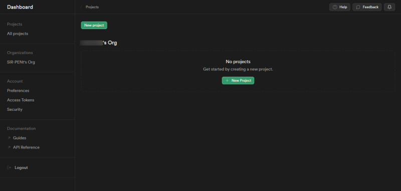
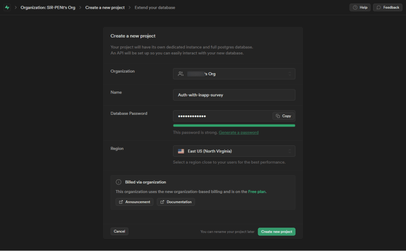
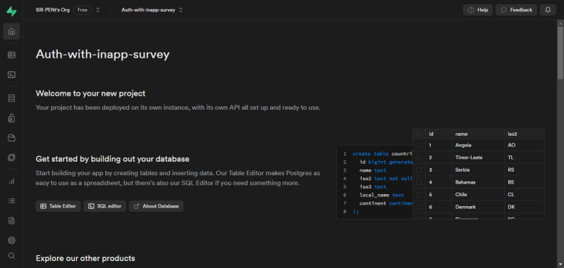
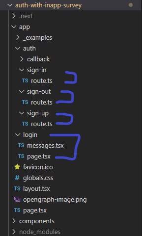
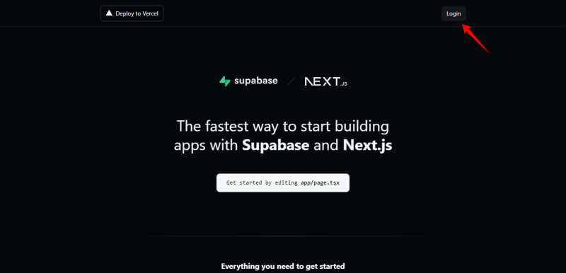
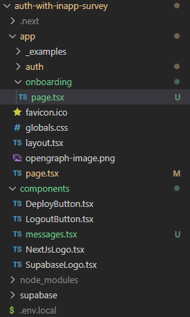
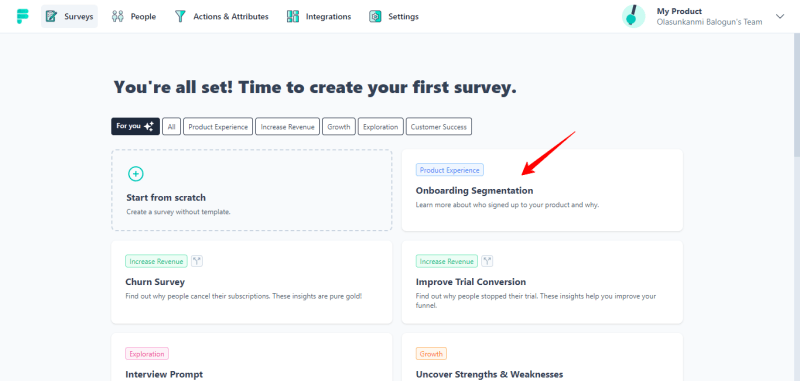
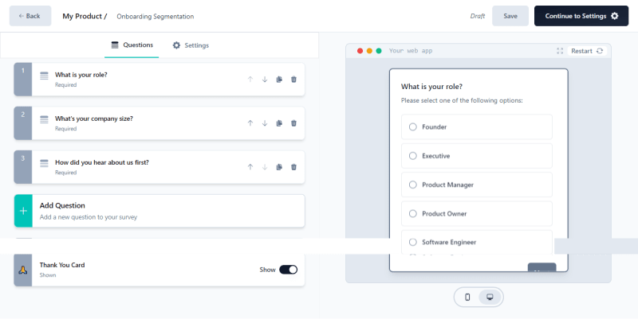
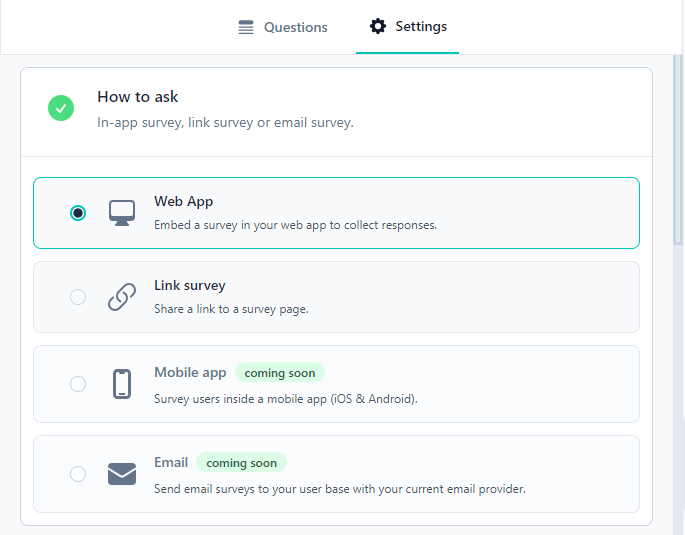

Как только пользователь успешно завершил процесс регистрации в вашем приложении, вы можете сразу же начать сегментационный опрос для своих пользователей. Такой подход позволит вам получить более глубокое представление о своих пользователях.

TL;DR

В этой статье вы узнаете о процессе реализации аутентификации и защищенных маршрутов с помощью Supabase. После этого вы узнаете, как легко интегрировать опрос сегментации при входе в приложение.

Когда вы будете готовы, давайте приступим.


В этой статье вы узнаете, как:

Реализовывать аутентификацию и защищенные маршруты с помощью Supabase.
Реализовывать сегментационный опрос при регистрации в приложении с помощью Formbricks.

## 1. Как реализовать аутентификацию с помощью Supabase

Если вы не знакомы с Supabase, то это альтернатива Firebase с открытым исходным кодом. Среди множества его продуктов одной из ключевых особенностей, которую мы рассмотрим, является функция аутентификации.

Для начала мы войдем в панель управления, чтобы создать проект. Если вы еще не создавали проект, ваша панель выглядит следующим образом:



Далее создайте свой проект, нажав на кнопку `new project`. Назовите свой проект как угодно; я назову свой `Auth-with-inapp-survey` для целей этой статьи.



Нажмите кнопку `создать новый проект`, когда закончите, ваш новый проект появится на вашей панели инструментов, вот так:



После того как проект успешно создан, следующим шагом будет настройка проекта `Next.js`. Supabase упрощает этот процесс, предлагая предварительно сконфигурированный проект `Next.js` с `Supabase-auth`, `TypeScript` и `Tailwind CSS`. Чтобы создать этот проект, выполните следующую команду в терминале:

`npx create-next-app -e with-supabase auth-with-inapp-survey`.

Эта команда настроит ваш проект `Next.js`, интегрирует его с `Supabase-auth` и необходимыми конфигурациями. Хотя `Tailwind CSS` включен в комплект, для целей этой статьи нам не нужно его использовать.

Преимущество создания проекта `Next.js` с предустановленной `Supabase` заключается в том, что он упрощает настройку аутентификации для вас. Сюда входит настройка таких функций, как регистрация, вход, выход и даже страница входа, как показано на рисунке ниже:



Довольно круто, правда :face_with_cowboy_hat:

Все, что вам нужно сделать, это продублировать файл `.env.local.example` в вашем проекте с помощью следующей команды:

`cp .env.local.example .env.local`.

Затем восстановите `supabase URL и`Anon key` из настроек API вашего проекта.

`NEXT_PUBLIC_SUPABASE_URL=<ваш-supabase-url> NEXT_PUBLIC_SUPABASE_ANON_KEY=<ваш-supabase-anon-key>`.

Запустите ваше приложение, и оно запустится на вашем `localhost` по `порту 3000`. На вашей домашней странице будет отображаться следующее содержимое, а также ссылка на предварительно настроенную страницу `логина`.



Хотя для этого руководства я бы предпочел установить мою `логин`-страницу в качестве домашней - `index`-страницы. Если вы также разделяете это предпочтение, выполните следующие шаги:

Очистите содержимое страницы `index` и вставьте туда содержимое страницы `login`.

Переместите файл `messages.tsx` из папки `login` в папку `components`. После этого можно смело удалять папку `login`.

Однако в файлах `auth` необходимо внести еще несколько изменений, чтобы адаптировать их к новому маршруту, поскольку маршрут `login` теперь служит в качестве страницы `index`.

В файле `sign-up/route.ts` сделайте следующую модификацию:

```js
export async function authenticateUser(request: Request) {
  if (error) {
    return NextResponse.redirect(`${requestUrl.origin}?error=Could not authenticate user`, {
      status: 301,
    });
  }

  return NextResponse.redirect(`${requestUrl.origin}?message=Check email to continue the sign-in process`, {
    status: 301,
  });
}
```

В файле `sign-out/route.ts`:

```js
export async function handlePostRequest(request: Request) {
  const redirectUrl = `${requestUrl.origin}`;

  return NextResponse.redirect(redirectUrl, {
    status: 301,
  });
}
```

В файле `sign-in/route.ts`:

```js
export async function post(request: Request) {
  if (error) {
    return NextResponse.redirect(
      `${requestUrl.origin}?error=Could not authenticate user`,
      { status: 301 }
    );
  }

  return NextResponse.redirect(`${requestUrl.origin}/dashboard`, {
    status: 301,
  });
}
```

Обратите внимание, что в маршруте `sign-in` мы перенаправили пользователя на страницу `dashboard` в операторе возврата, хотя мы не будем реализовывать страницу `dashboard` в этом учебнике. Это просто гарантирует, что пользователь будет направлен на страницу `dashboard` после завершения процесса `sign-in`.

Наконец, в файле `callback/route.ts`:

```ja
export async function GET(request: Request) {
  // Removed unnecessary comments

  // Get the origin of the request URL
  const origin = requestUrl.origin;

  // Redirect to the onboarding URL
  return NextResponse.redirect(`${origin}/onboarding`);
}
```

После того как пользователь попытается зарегистрироваться в приложении, он должен будет подтвердить свою электронную почту. После успешного подтверждения электронной почты пользователь будет автоматически перенаправлен на URL, указанный в выражении `return` функции `callback`, которая является страницей регистрации.

Эти изменения приведут ваши маршруты аутентификации в соответствие с новой настройкой, где страница `login` служит в качестве начальной страницы.

Теперь, когда мы выполнили эти шаги, давайте приступим к реализации нашей страницы регистрации.

Чтобы создать страницу регистрации, перейдите в корневой каталог приложения и следуйте структуре, показанной ниже:



Прежде чем мы перейдем к реализации опроса в приложении, необходимо убедиться, что наша страница регистрации защищена до того, как пользователь зарегистрируется. В конце концов, что такое аутентификация без защищенных маршрутов, верно?

К счастью, Supabase предлагает простое решение для решения этой проблемы с помощью серверных компонентов.

В файл `page.tsx` для страницы регистрации вставьте следующий код:

```js
import LogoutButton from '@/components/LogoutButton';
import { createServerComponentClient } from '@supabase/auth-helpers-nextjs';
import { cookies } from 'next/headers';
import { redirect } from 'next/navigation';

export default async function Onboarding() {
	const serverComponentClient = createServerComponentClient({ cookies });
	const {
		data: { session },
	} = await serverComponentClient.auth.getSession();

	if (!session) {
		redirect('/');
	}

	return (
		<div>
			<LogoutButton />
			Hello
		</div>
	);
}
```

В этом коде мы создаем новый клиент Supabase с помощью `createServerComponentClient`, который принимает `cookies` в качестве параметра. Затем этот клиент присваивается переменной `supabase`.

Примечание: Мы используем `cookies` для хранения пользовательских сессий, а не localStorage в серверных компонентах, потому что вы не можете получить доступ к localStorage в серверных компонентах. Спасибо Supabase за это решение! 👍

Следующий блок кода:

`const { data: { сессия },} = await supabase.auth.getSession();`

используется для проверки существования пользовательской сессии. Если сессия существует, пользователь может получить доступ к странице регистрации без каких-либо проблем. Однако если `session` отсутствует, сработает оператор `if`, перенаправляющий пользователя обратно на страницу входа.

Я также импортировал компонент `logoutButton` на эту страницу на случай, если вы захотите изучить, как работает процесс входа/выхода.

Теперь давайте сосредоточимся на внедрении нашего сегментационного опроса на странице регистрации. Таким образом, пользователи будут сталкиваться с ним сразу после регистрации. В следующем разделе мы дадим пошаговое руководство, как это сделать.

Как внедрить опрос сегментации при регистрации в приложении с помощью Formbricks.

Благодаря Formbricks нам не нужно создавать это с нуля 👏

Формбрикс: Единственное решение с открытым исходным кодом для in-app опросов

Formbricks - это программное обеспечение для проведения опросов с открытым исходным кодом, которое помогает компаниям создавать и отправлять различные виды опросов в приложениях. Formbricks прост в использовании и интегрируется с любым веб-приложением, мобильным или настольным приложением. Поддержите нас, поставив нам звезду, это поможет нам создать наше сообщество.

P.S.: Formbricks предлагает сувениры для Hacktoberfest, а также у вас есть возможность выиграть Macbook Air! Приходите и участвуйте!


Идем дальше, вот краткий обзор шагов, которые мы сейчас рассмотрим:

Начните с регистрации аккаунта на платформе Formbricks.  
Настройте опросник в соответствии с вашими предпочтениями.  
Без проблем интегрируйте Formbricks в свое приложение.  
Включите в приложение опрос для регистрации.

1. Настройте свой опрос при входе в приложение

Создав свой аккаунт на Formbricks, вы попадете на панель управления, где найдете множество шаблонов опросов. Для этого руководства выберите шаблон опроса сегментации при входе в систему, поскольку именно его мы будем использовать.



Далее вы перейдете на страницу, где сможете отредактировать и настроить этот опрос в соответствии с вашими требованиями. Здесь вы увидите три предварительно настроенные карточки с вопросами, а также сможете добавитьпри необходимости задавайте дополнительные вопросы.



Важно отметить, что любые изменения, внесенные в каждую карточку с вопросом, мгновенно отражаются в предварительном просмотре.

После завершения редактирования вопросов перейдите на вкладку ”Настройки", расположенную рядом с вкладкой "Вопросы". В этом разделе вы можете настроить опрос в соответствии с вашими конкретными потребностями.

Для карточки ”Как спросить" убедитесь, что выбран вариант веб-приложения.



Еще одна важная настройка - триггер опроса. Здесь вы определяете, как и когда будет запускаться опрос. Чтобы соответствовать течению нашего проекта и отображать опрос всякий раз, когда пользователь доходит до реализованной нами страницы онбординга, мы решили запускать опрос только тогда, когда пользователь переходит на страницу онбординга.

Чтобы настроить этот процесс, начните с выбора выпадающего списка и выберите опцию ”Добавить действие". Это действие вызовет появление модального окна:

Заполните поля в модале, как показано ниже. Не стесняйтесь настраивать эти данные в соответствии с вашими предпочтениями:

Обратите внимание, что на этом шаге нам нужно выбрать параметр “URL страницы”, который позволяет нам указать URL, на котором должен отображаться опрос. Как показано на рисунке, в поле URL я заполнил `https:localhost:3000/onboarding`.

После того как вы ввели необходимую информацию, нажмите кнопку ”Отследить действие" и выберите вариант из выпадающего списка:

Еще одна карта, на которую стоит обратить внимание, - это карта ”Стиль". С помощью этой карточки можно оформить опрос в соответствии с требованиями пользовательского интерфейса.

Завершив настройку, нажмите кнопку ”Опубликовать", расположенную в правом верхнем углу страницы. Это действие перенаправит вас на страницу с аналитикой опроса.

Далее мы рассмотрим, как установить связь между вашим веб-приложением и Formbricks.

## Соединение вашего веб-приложения и Formbricks

На странице настроек перейдите на вкладку ”Контрольный список настроек", расположенную в боковой панели. Эта страница содержит все необходимые шаги для подключения вашего веб-приложения к Formbricks.

Вы также заметите виджет статуса, который сообщит вам, успешно ли подключено ваше приложение или нет. На данный момент, поскольку приложение еще не подключено, оно будет отображаться следующим образом:

Чтобы установить соединение, выполните следующие действия:

Установите виджет Formbrick в ваше веб-приложение с помощью следующей команды:

`npm install @formbricks/js --save`.

Создайте клиентский компонент `formbricks.tsx` в корневой папке приложения и вставьте в него следующий код:

```js
import formbricks from '@formbricks/js';
import { usePathname, useSearchParams } from 'next/navigation';
import { useEffect } from 'react';

export default function FormbricksProvider() {
	const pathname = usePathname();
	const searchParams = useSearchParams();

	useEffect(() => {
		formbricks.init({
			environmentId: '<environment-id>',
			apiHost: '<https://app.formbricks.com>',
		});
	}, []);

	useEffect(() => {
		formbricks?.registerRouteChange();
	}, [pathname, searchParams]);

	return null;
}
```

Значение вашего `environmentId` можно получить на странице контрольного списка настроек. Я намеренно не указал его здесь, поскольку оно должно оставаться конфиденциальным.

Наконец, в файле `app/layout.tsx` импортируйте файл `formbricks.tsx` и отобразите его, как показано ниже:

```js
import FormbricksProvider from './formbricks';

export default function RootLayout({ children }: { children: React.ReactNode }) {
  return (
    <html>
      <FormbricksProvider />
      {/* Render code goes here */}
      <body>
        {/* Other code goes here */}
      </body>
    </html>
  );
}
```

После перезапуска веб-приложения индикатор состояния будет обновлен до следующего состояния:

Кроме того, в консоли вы увидите, что ваше приложение успешно подключилось к Formbricks.

Теперь вы можете проверить это, попытавшись зарегистрироваться в вашем приложении. Когда вы нажмете на кнопку регистрации, вы получите уведомление о том, что на ваш адрес электронной почты было отправлено письмо для проверки.

После верификации вы будете перенаправлены на страницу ‘onboarding’, как и предполагалось. Там появится опрос о сегментации при входе в систему, как мы и сделали:

Вот и все, вы узнали, как просто сегментировать пользователей с помощью Formbricks.

## Заключительные заметки

Из этой статьи вы узнали следующее:

Реализация аутентификации и защищенных маршрутов с помощью Supabase.  
Интеграция сегмента онбордингаопрос в веб-приложении с помощью Formbricks.

Кроме того, не забудьте поддержать нас, поставив нам звезду ⭐!
