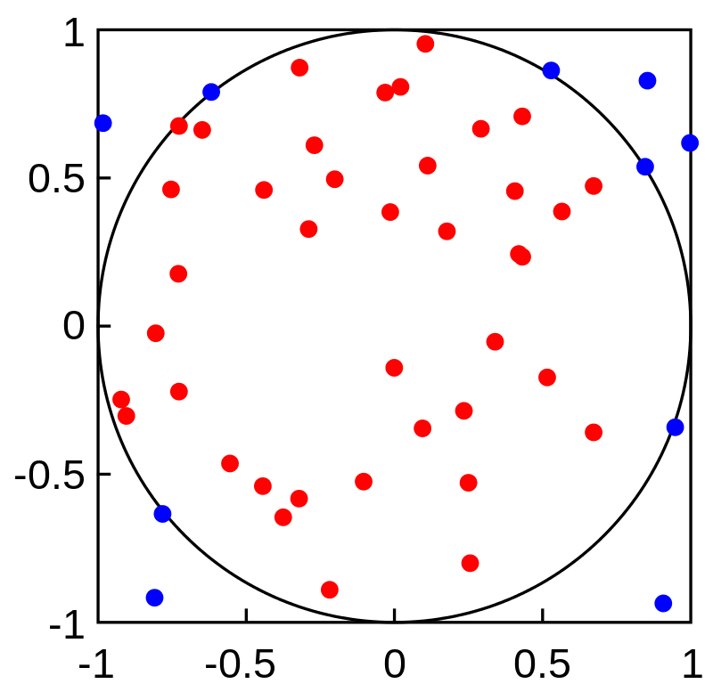
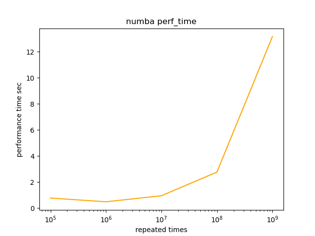
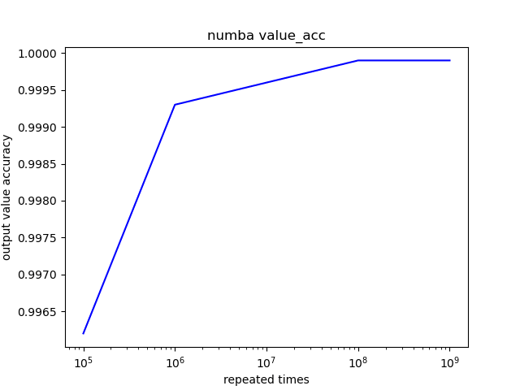

Связанный репо на GitHub

https://github.com/ssghost/JITS_tests

## Аннотация

Компиляция точно в срок (JIT) - это способ выполнения компьютерного кода, который предполагает компиляцию во время выполнения программы (во время исполнения), а не перед выполнением. По мере того как индустрия разработки фреймворков Deep-learning продвигается вперед в так называемые ”римские времена" (2019 - 2020 гг.), большинство мейнстримных фреймворков включили собственные JIT-компиляции в свои бэкенды в последних установочных пакетах. Это явление можно охарактеризовать как интенсивное соревнование различных JIT-компиляторов.

Так почему бы нам не сделать бенчмарк для измерения фактической эффективности этих JIT-компиляторов, чтобы нарисовать краткую иллюстрацию общего механизма в этих различных реализациях JIT?

Идея проста, у нас есть две метрики для измерения: время выполнения и точность результата (в данном случае мы используем близость к значению числа pi). Если первая короче, вторая выше, то компилятор лучше, и наоборот.

Участники также показаны на титульном изображении, это : Numba, JAX, Tensorflow, Triton.

Функция, которая будет одинаково выполняться этими 4 JIT-бэкендами на процессорах моего ноутбука, - это Monte Carlo Pi Approximation, которая может приблизительно приблизить действительное значение числа Пи.

## Напишем декораторы

Прежде чем приступить к работе, необходимо хорошо продумать функции, реализующие измерение этих метрик. В Python есть мощный встроенный инструментарий под названием ”Декоратор", который представляет собой элегантный способ обернуть наши процедуры измерения. Здесь мы написали две функции-декоратора, которые имеют такую же структуру, как показано ниже:

`def benchmark_metric(func: Callable[..., Any]) -> Callable[..., Any]: @functools.wraps(func) def wrapper(*args: Any, **kwargs: Any) -> Any: value = func(*args, **kwargs) metric = f(value) logging.info(f "Function {func.__name__}'s metric value is {metric:.2f}") return value return wrapper`.

Ваша JIT-функция будет обернута в этот декоратор и выполнена в нем, значение метрики будет вычислено синхронно и отображено в окне терминала в виде логгирующей информации.

После этого все, что вам нужно сделать, это просто поместить оператор ”@" перед вашими JIT-функциями.

## Напишите вызывающие функции

Как видно из приведенных ниже псевдокодов, интересно, что все 4 типа бэкендов JIT-компилятора также являются декораторами. Следовательно, каждая вызывающая функция будет иметь как минимум 3 слоя декораторов, 2 для бенчмарков, 1 для вызова JIT-бэкендов.

Во-первых, мы можем рассмотреть ситуацию, когда мы не используем JIT-бэкенды, а просто реализуем аппроксимацию Монте-Карло Pi в обычной функции Python, и псевдокод этого алгоритма будет выглядеть следующим образом:

`def monte_carlo_pi(ln: int): acc = 0 for _ in range(ln): x = random.random() y = random.random() if (x**2 + y**2) < 1.0: acc += 1 return 4.0 * acc / ln`.

Очевидно, что это подход, основанный на цикле, что означает, что мы должны повторять эту процедуру много раз, чтобы получить оптимизированный результат, чем больше раз мы повторяем, тем больше точности мы получим. Время повторения будет ”большим числом" (ln). График, изображающий эту процедуру, выглядит следующим образом:

Как мы повторяли почти бесконечное количество раз, отношение количества красных точек к сумме красных и синих точек будет примерно равно отношению площади круга к площади квадрата. А значит, в конечном итоге мы сможем вычислить значение числа Пи, исходя из этого соотношения.

Для Numba существенным отличием является то, что нам больше не нужно вызывать Numpy или какие-то Numpy-подобные пакеты для предварительной обработки (или, точнее, ”сжатия") ваших данных в структурированное векторное пространство. Так что, как ни странно, мы можем просто скопировать и вставить наш псевдокод под операторами @, и он будет работать правильно, как мы и ожидали. Именно поэтому я поставил Numba в качестве первого участника нашего конкурса.

А вот с остальными тремя JIT-бэкендами все будет немного сложнее. Мы должны выполнить обычную предварительную обработку наших данных. К счастью, JAX и Tensorflow имеют собственный интегрированный модуль Numpy, мы можем просто импортировать и вызвать его, чтобы сжать наши данные в массивы Numpy и выполнить все вычисления с этими массивами Numpy (это означает, что все другие типы данных не модифицируются для подачи в их JIT-бэкенды).

Что касается Triton, то, хотя в Triton нет пакета, подобного Numpy, его языковой модуль сам может выполнять аналогичный процесс сжатия, как это делали массивы Numpy. В отличие от массивов Numpy, внутренняя структура данных Triton использует концепцию смещения, а не формы массивов, чтобы продемонстрировать количество более высоких измерений.

## Результаты

Для описания результатов нашего JIT-соревнования подойдет Matplotlib. Мы построим 8 графиков, по 2 метрики для каждого участника, с массивом входной переменной - времени повторения. Давайте перейдем непосредственно к просмотру этих графиков.

При первом взгляде на эти 4 пары графиков можно сказать, что их формы практически идентичны. Только у Numba появилось тривиальное улучшение в метрике perf_time. Чтобы сэкономить время на чтение, здесь я решил опубликовать результаты двух метрик Numba в качестве наглядного примера:

## Выводы

Современные DL-фреймворки построили практически одинаковые эффективные бэкенды JIT-компиляции с собственным проектированием структуры данных.

Ключевым моментом для повышения производительности JIT-бэкендов, работающих в среде с использованием только центрального процессора, является оптимизация процедур сжатия данных.

Возможно, существует точка наилучшего компромисса между perf_time и value_acc, которая, согласно моим графикам результатов, находится в диапазоне от 10^6 до 10^7, что может послужить тривиальной подсказкой для дальнейших исследований.

[Источник](https://dev.to/ssghost/01-benchmark-of-four-jit-backends-51i3)
