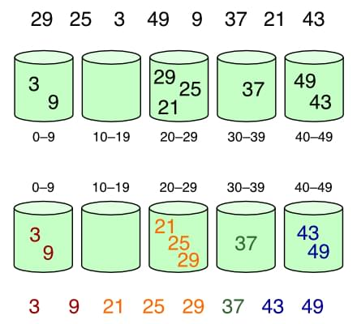
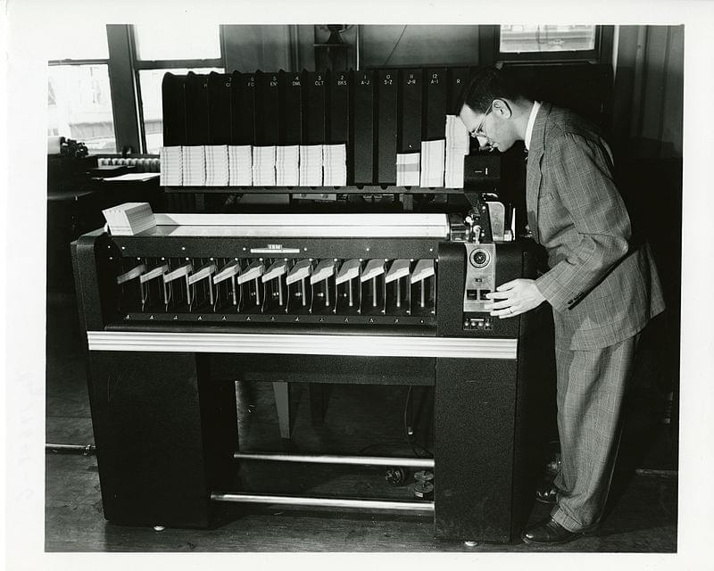

Алгоритмы сортировки являются фундаментальной частью компьютерной науки и имеют множество применений, начиная от сортировки данных в базах данных и заканчивая организацией музыкальных плейлистов. Но что именно представляют собой алгоритмы сортировки и как они работают? Мы ответим на этот вопрос в этой статье, предоставив полный обзор алгоритмов различных типов и их применения, включая примеры кода.

Возможно, мы немного затронем технические моменты, например, используем нотацию big O для анализа временной и пространственной сложности различных алгоритмов. Но мы также предоставим высокоуровневые обзоры, которые должны быть понятны большинству.

Это, конечно, долгое чтение, так что давайте приступим к нему!

Что такое алгоритм сортировки? Для чего используются алгоритмы сортировки? Почему алгоритмы сортировки так важны? Различные типы сортировки в структурах данных

Сравнение всех алгоритмов сортировки Какой самый распространенный алгоритм сортировки?

## Что такое алгоритм сортировки?

По сути, алгоритм сортировки - это компьютерная программа, которая упорядочивает данные в определенном порядке, например в алфавитном или числовом, обычно либо по возрастанию, либо по убыванию.

## Для чего используются алгоритмы сортировки?

Алгоритмы сортировки в основном используются для эффективной перегруппировки больших объемов данных, чтобы облегчить поиск и работу с ними. Они также используются для повышения эффективности других алгоритмов, таких как поиск и объединение, которые опираются на отсортированные данные для своих операций.

## Почему алгоритмы сортировки так важны?

Алгоритмы сортировки используются для упорядочивания данных в определенном порядке, что облегчает их поиск, доступ и анализ. Во многих приложениях сортировка является критически важной частью конвейера обработки данных, и эффективность алгоритма сортировки может существенно влиять на общую производительность системы.

В базах данных. Сортировка используется для получения записей в определенном порядке, например по дате, в алфавитном или числовом порядке. Это позволяет пользователям быстро находить нужные им данные, не прибегая к ручному поиску в больших объемах несортированных данных.

В поисковых системах. Ранжирование результатов поиска в порядке их релевантности. Сортируя результаты таким образом, пользователи могут быстро найти нужную информацию, не просеивая неактуальные или несвязанные результаты.

Во многих научных и инженерных приложениях. Исследователи могут проводить анализ данных и моделирование, чтобы получить представление о сложных системах и сделать более точные прогнозы относительно будущего поведения.

## Различные типы сортировки в структурах данных

Существуют различные типы сортировки. Выбор алгоритма сортировки зависит от различных факторов, таких как размер набора данных, тип сортируемых данных, а также желаемая временная и пространственная сложность.

## Алгоритмы сортировки, основанные на сравнении

Они сравнивают элементы набора данных и определяют их порядок на основе результатов сравнения. Примеры алгоритмов сортировки на основе сравнения включают пузырьковую сортировку, сортировку вставкой, квиксорт, сортировку слиянием и сортировку кучей.

## Алгоритмы сортировки, не основанные на сравнении

Эти алгоритмы не сравнивают элементы напрямую, а используют другие свойства набора данных для определения их порядка. Примерами алгоритмов сортировки, не основанных на сравнении, являются счетная сортировка, радиксная сортировка и сортировка по ведрам.

## Алгоритмы сортировки на месте

Эти алгоритмы сортируют набор данных на месте, то есть не требуют дополнительной памяти для хранения промежуточных результатов. Примерами алгоритмов сортировки на месте являются пузырьковая сортировка, сортировка вставкой, сортировка quicksort и сортировка оболочкой.

## Стабильные алгоритмы сортировки

Сохраняют относительный порядок одинаковых элементов в наборе данных. Примерами стабильных алгоритмов сортировки являются сортировка вставкой, сортировка слиянием и Timsort.

## Адаптивные алгоритмы сортировки

Используют любой существующий порядок в наборе данных для повышения эффективности. Примерами адаптивных алгоритмов сортировки являются сортировка вставками, пузырьковая сортировка и Timsort.

Теперь давайте рассмотрим десять лучших алгоритмов сортировки, о которых следует знать при выборе.

## Пузырьковая сортировка

Пузырьковая сортировка - это простой алгоритм сортировки, который многократно проходит через заданный список элементов, сравнивая каждую пару соседних элементов и меняя их местами, если они расположены в неправильном порядке. Алгоритм работает до тех пор, пока не пройдет через весь список, не поменяв местами ни одного элемента.

Пузырьковую сортировку также иногда называют ”тонущей сортировкой".

Начиная с начала списка, сравните каждую соседнюю пару, поменяйте их местами, если они расположены не в правильном порядке (последний элемент меньше первого). После каждой итерации нужно сравнивать на один элемент меньше (последний), пока не останется ни одного элемента, который можно было бы сравнить. : Wikimedia Commons, CC BY-SA 3.0. История пузырьковой сортировки

История возникновения пузырьковой сортировки восходит к концу 1950-х годов, а Дональд Кнут популяризировал ее в своей классической книге 1968 года The Art of Computer Programming.

С тех пор она широко используется в различных приложениях, включая алгоритмы сортировки для компиляторов, сортировку элементов в базах данных и даже сортировку игральных карт.

### Преимущества и недостатки пузырьковой сортировки

Пузырьковая сортировка считается относительно неэффективным алгоритмом сортировки, поскольку ее средняя и наихудшая сложность составляют `$O(n^2)---

title: 10 лучших алгоритмов сортировки с примерами
meta_title: ’'
description: ''
date: 2023-12-18T00:00:00.000Z
categories:

- python
- novosti
  author: Игорь Горлов
  type: blog
  draft: false
  slug: 10-luchshykh-alhorytmov-sortyrovky-s-prymeramy

---

Алгоритмы сортировки являются фундаментальной частью компьютерной науки и имеют множество применений, начиная от сортировки данных в базах данных и заканчивая организацией музыкальных плейлистов. Но что именно представляют собой алгоритмы сортировки и как они работают? Мы ответим на этот вопрос в этой статье, предоставив полный обзор алгоритмов различных типов и их применения, включая примеры кода.

Возможно, мы немного затронем технические моменты, например, используем нотацию big O для анализа временной и пространственной сложности различных алгоритмов. Но мы также предоставим высокоуровневые обзоры, которые должны быть понятны большинству.

Это, конечно, долгое чтение, так что давайте приступим к нему!

Что такое алгоритм сортировки? Для чего используются алгоритмы сортировки? Почему алгоритмы сортировки так важны? Различные типы сортировки в структурах данных

Сравнение всех алгоритмов сортировки Какой самый распространенный алгоритм сортировки?

## Что такое алгоритм сортировки?

По сути, алгоритм сортировки - это компьютерная программа, которая упорядочивает данные в определенном порядке, например в алфавитном или числовом, обычно либо по возрастанию, либо по убыванию.

## Для чего используются алгоритмы сортировки?

Алгоритмы сортировки в основном используются для эффективной перегруппировки больших объемов данных, чтобы облегчить поиск и работу с ними. Они также используются для повышения эффективности других алгоритмов, таких как поиск и объединение, которые опираются на отсортированные данные для своих операций.

## Почему алгоритмы сортировки так важны?

Алгоритмы сортировки используются для упорядочивания данных в определенном порядке, что облегчает их поиск, доступ и анализ. Во многих приложениях сортировка является критически важной частью конвейера обработки данных, и эффективность алгоритма сортировки может существенно влиять на общую производительность системы.

В базах данных. Сортировка используется для получения записей в определенном порядке, например по дате, в алфавитном или числовом порядке. Это позволяет пользователям быстро находить нужные им данные, не прибегая к ручному поиску в больших объемах несортированных данных.

В поисковых системах. Ранжирование результатов поиска в порядке их релевантности. Сортируя результаты таким образом, пользователи могут быстро найти нужную информацию, не просеивая неактуальные или несвязанные результаты.

Во многих научных и инженерных приложениях. Исследователи могут проводить анализ данных и моделирование, чтобы получить представление о сложных системах и сделать более точные прогнозы относительно будущего поведения.

## Различные типы сортировки в структурах данных

Существуют различные типы сортировки. Выбор алгоритма сортировки зависит от различных факторов, таких как размер набора данных, тип сортируемых данных, а также желаемая временная и пространственная сложность.

## Алгоритмы сортировки, основанные на сравнении

Они сравнивают элементы набора данных и определяют их порядок на основе результатов сравнения. Примеры алгоритмов сортировки на основе сравнения включают пузырьковую сортировку, сортировку вставкой, квиксорт, сортировку слиянием и сортировку кучей.

## Алгоритмы сортировки, не основанные на сравнении

Эти алгоритмы не сравнивают элементы напрямую, а используют другие свойства набора данных для определения их порядка. Примерами алгоритмов сортировки, не основанных на сравнении, являются счетная сортировка, радиксная сортировка и сортировка по ведрам.

## Алгоритмы сортировки на месте

Эти алгоритмы сортируют набор данных на месте, то есть не требуют дополнительной памяти для хранения промежуточных результатов. Примерами алгоритмов сортировки на месте являются пузырьковая сортировка, сортировка вставкой, сортировка quicksort и сортировка оболочкой.

## Стабильные алгоритмы сортировки

Сохраняют относительный порядок одинаковых элементов в наборе данных. Примерами стабильных алгоритмов сортировки являются сортировка вставкой, сортировка слиянием и Timsort.

## Адаптивные алгоритмы сортировки

Используют любой существующий порядок в наборе данных для повышения эффективности. Примерами адаптивных алгоритмов сортировки являются сортировка вставками, пузырьковая сортировка и Timsort.

Теперь давайте рассмотрим десять лучших алгоритмов сортировки, о которых следует знать при выборе.

## Пузырьковая сортировка

Пузырьковая сортировка - это простой алгоритм сортировки, который многократно проходит через заданный список элементов, сравнивая каждую пару соседних элементов и меняя их местами, если они расположены в неправильном порядке. Алгоритм работает до тех пор, пока не пройдет через весь список, не поменяв местами ни одного элемента.

Пузырьковую сортировку также иногда называют ”тонущей сортировкой".

Начиная с начала списка, сравните каждую соседнюю пару, поменяйте их местами, если они расположены не в правильном порядке (последний элемент меньше. Это делает его гораздо менее эффективным, чем большинство других алгоритмов сортировки, таких как quicksort или mergesort.

Техническое примечание: сложность `$O(n^2)---

title: 10 лучших алгоритмов сортировки с примерами
meta_title: ’'
description: ''
date: 2023-12-18T00:00:00.000Z
categories:

- python
- novosti
  author: Игорь Горлов
  type: blog
  draft: false
  slug: 10-luchshykh-alhorytmov-sortyrovky-s-prymeramy

---

Алгоритмы сортировки являются фундаментальной частью компьютерной науки и имеют множество применений, начиная от сортировки данных в базах данных и заканчивая организацией музыкальных плейлистов. Но что именно представляют собой алгоритмы сортировки и как они работают? Мы ответим на этот вопрос в этой статье, предоставив полный обзор алгоритмов различных типов и их применения, включая примеры кода.

Возможно, мы немного затронем технические моменты, например, используем нотацию big O для анализа временной и пространственной сложности различных алгоритмов. Но мы также предоставим высокоуровневые обзоры, которые должны быть понятны большинству.

Это, конечно, долгое чтение, так что давайте приступим к нему!

Что такое алгоритм сортировки? Для чего используются алгоритмы сортировки? Почему алгоритмы сортировки так важны? Различные типы сортировки в структурах данных

Сравнение всех алгоритмов сортировки Какой самый распространенный алгоритм сортировки?

## Что такое алгоритм сортировки?

По сути, алгоритм сортировки - это компьютерная программа, которая упорядочивает данные в определенном порядке, например в алфавитном или числовом, обычно либо по возрастанию, либо по убыванию.

## Для чего используются алгоритмы сортировки?

Алгоритмы сортировки в основном используются для эффективной перегруппировки больших объемов данных, чтобы облегчить поиск и работу с ними. Они также используются для повышения эффективности других алгоритмов, таких как поиск и объединение, которые опираются на отсортированные данные для своих операций.

## Почему алгоритмы сортировки так важны?

Алгоритмы сортировки используются для упорядочивания данных в определенном порядке, что облегчает их поиск, доступ и анализ. Во многих приложениях сортировка является критически важной частью конвейера обработки данных, и эффективность алгоритма сортировки может существенно влиять на общую производительность системы.

В базах данных. Сортировка используется для получения записей в определенном порядке, например по дате, в алфавитном или числовом порядке. Это позволяет пользователям быстро находить нужные им данные, не прибегая к ручному поиску в больших объемах несортированных данных.

В поисковых системах. Ранжирование результатов поиска в порядке их релевантности. Сортируя результаты таким образом, пользователи могут быстро найти нужную информацию, не просеивая неактуальные или несвязанные результаты.

Во многих научных и инженерных приложениях. Исследователи могут проводить анализ данных и моделирование, чтобы получить представление о сложных системах и сделать более точные прогнозы относительно будущего поведения.

## Различные типы сортировки в структурах данных

Существуют различные типы сортировки. Выбор алгоритма сортировки зависит от различных факторов, таких как размер набора данных, тип сортируемых данных, а также желаемая временная и пространственная сложность.

## Алгоритмы сортировки, основанные на сравнении

Они сравнивают элементы набора данных и определяют их порядок на основе результатов сравнения. Примеры алгоритмов сортировки на основе сравнения включают пузырьковую сортировку, сортировку вставкой, квиксорт, сортировку слиянием и сортировку кучей.

## Алгоритмы сортировки, не основанные на сравнении

Эти алгоритмы не сравнивают элементы напрямую, а используют другие свойства набора данных для определения их порядка. Примерами алгоритмов сортировки, не основанных на сравнении, являются счетная сортировка, радиксная сортировка и сортировка по ведрам.

## Алгоритмы сортировки на месте

Эти алгоритмы сортируют набор данных на месте, то есть не требуют дополнительной памяти для хранения промежуточных результатов. Примерами алгоритмов сортировки на месте являются пузырьковая сортировка, сортировка вставкой, сортировка quicksort и сортировка оболочкой.

## Стабильные алгоритмы сортировки

Сохраняют относительный порядок одинаковых элементов в наборе данных. Примерами стабильных алгоритмов сортировки являются сортировка вставкой, сортировка слиянием и Timsort.

## Адаптивные алгоритмы сортировки

Используют любой существующий порядок в наборе данных для повышения эффективности. Примерами адаптивных алгоритмов сортировки являются сортировка вставками, пузырьковая сортировка и Timsort.

Теперь давайте рассмотрим десять лучших алгоритмов сортировки, о которых следует знать при выборе.

## Пузырьковая сортировка

Пузырьковая сортировка - это простой алгоритм сортировки, который многократно проходит через заданный список элементов, сравнивая каждую пару соседних элементов и меняя их местами, если они расположены в неправильном порядке. Алгоритм работает до тех пор, пока не пройдет через весь список, не поменяв местами ни одного элемента.

Пузырьковую сортировку также иногда называют ”тонущей сортировкой".

Начиная с начала списка, сравните каждую соседнюю пару, поменяйте их местами, если они расположены не в правильном порядке (последний элемент меньше означает, что время, необходимое алгоритму для завершения работы, пропорционально квадрату размера входных данных. Это означает, что при больших размерах входных данных алгоритм работает значительно дольше.

Например, если вы рассматриваете алгоритм, сортирующий массив чисел, то сортировка массива из десяти чисел может занять одну секунду, а сортировка массива из 20 чисел - четыре секунды. Это связано с тем, что алгоритм должен сравнить каждый элемент массива с каждым другим элементом, поэтому для большего массива он должен выполнить 20 сравнений, а для меньшего - всего десять.

Однако этот алгоритм очень прост для понимания и реализации, и его часто используют в качестве введения в сортировку и как строительный блок для более сложных алгоритмов. Однако в наши дни она редко используется на практике.

### Примеры использования пузырьковой сортировки

Пузырьковая сортировка - это простой алгоритм, который можно использовать для сортировки небольших списков или массивов элементов. Его легко реализовать и понять, поэтому его можно использовать в ситуациях, когда простота и ясность важнее производительности.

Образовательные цели. Часто используется в курсах информатики в качестве примера простого алгоритма сортировки. Изучая bubble sort, студенты могут узнать об основных методах сортировки и получить представление о том, как работают алгоритмы.

Сортировка небольших наборов данных. Она может использоваться для сортировки небольших наборов данных до нескольких сотен элементов. В случаях, когда производительность не является критически важным фактором, пузырьковая сортировка может быть быстрым и простым способом сортировки небольших списков.

Предварительная сортировка данных. Может использоваться в качестве предварительного шага в более сложных алгоритмах сортировки. Например, если данные уже частично отсортированы, пузырьковая сортировка может быть использована для дальнейшей сортировки данных перед запуском более сложного алгоритма.

Сортировка данных при ограниченных ресурсах. Она полезна в ситуациях, когда ресурсы ограничены, например во встраиваемых системах или микроконтроллерах, поскольку требует очень мало памяти и вычислительной мощности.

Строительные блоки для более сложных алгоритмов. Часто используется в сочетании с сортировкой слиянием или сортировкой квиксором, а также сортировкой небольших подмассивов с помощью сортировки вставкой, поскольку эти алгоритмы могут достигать лучшей производительности на больших наборах данных.

### Реализация пузырьковой сортировки

Используйте вложенные циклы для перебора элементов. Сравнивайте соседние элементы в списке. Поменяйте местами элементы, если они расположены в неправильном порядке. Продолжайте, пока список не будет отсортирован.

### Пузырьковая сортировка в Python

`def bubble_sort(items): for i in range(len(items)): for j in range(len(items)-1-i): if items[j] > items[j+1]: items[j], items[j+1] = items[j+1], items[j] return items = [6,20,8,19,56,23,87,41,49,53] print(bubble_sort(items))`

### Пузырьковая сортировка в JavaScript

`function bubbleSort(items) { let swapped; do { swapped = false; for (let i = 0; i < items.length - 1; i++) { if (items[i] > items[i + 1]) { let temp = items[i]; items[i] = items[i + 1]; items[i + 1] = temp; swapped = true; } } } while (swapped); return items; } let items = [6, 20, 8, 19, 56, 23, 87, 41, 49, 53]; console.log(bubbleSort(items));`

## Сортировка вставкой

Сортировка вставкой - это еще один простой алгоритм, который строит окончательный отсортированный массив по одному элементу за раз, и назван он так за то, как маленькие элементы вставляются на свои места в отсортированном массиве.

Частично отсортированный список изначально содержит только первый элемент. С каждой итерацией один элемент удаляется из входных данных ”еще не проверен на порядок" и вставляется на место в отсортированный список. : Wikimedia Commons, CC BY-SA 3.0. История сортировки вставкой

В книге ”Искусство компьютерного программирования" Кнут отмечает, что сортировка вставкой "была упомянута Джоном Маучли еще в 1946 году, в первом опубликованном обсуждении компьютерной сортировки", описывая ее как "естественный" алгоритм, который легко понять и реализовать.

К концу 1950-х годов Дональд Л. Шелл внес ряд улучшений в свой метод сортировки Шелла (о котором речь пойдет ниже), который сравнивает элементы, разделенные расстоянием, уменьшающимся при каждом проходе, что позволило снизить сложность алгоритма до `$O(n^{3/2})$` и `$O(n^{4/3})$` в двух различных вариантах. Это может показаться не очень большим, но для практических приложений это довольно значительное улучшение!

Технические примечания: Сложности `$O(n^{3/2})$` и `$O(n^{4/3})$` являются более эффективными, чем сложность `$O(n^2)$`, то есть требуют меньше времени для завершения. Это связано с тем, что им не нужно выполнять столько сравнений, как сложности `$O(n^2)$`.

Например, сортировка массива из десяти чисел с помощью алгоритма `$O(n^2)$` может занять одну секунду, а сортировка того же массива с помощью алгоритма `$O(n^{3/2})$` может занять 0,5 секунды. Это происходит потому, что алгоритм может выполнять меньше сравнений при использовании алгоритма `$O(n^{3/2})$`, что приводит к более быстрому времени выполнения.

В 2006 году Бендер, Мартин Фарах-Колтон и Мостейро опубликовали новый вариант сортировки вставками, названный библиотечной сортировкой или ”сортировкой вставками с зазором", которая оставляет небольшое количество неиспользуемых пробелов (или "пробелов") по всему массиву, что еще больше увеличивает время работы до `$O(n log n)$`.

Технические примечания: Сложность `$O(n log n)$` эффективнее сложности `$O(n^2)$`, а также сложностей `$O(n^{3/2})$` и `$O(n^{4/3})$`. Это связано с тем, что в нем используется подход ”разделяй и властвуй", то есть он может разбить задачу на более мелкие части и решить их быстрее.

Например, сортировка массива из десяти чисел алгоритмом `$O(n^2)$` может занять одну секунду, сортировка того же массива алгоритмом `$O(n^{3/2})$` - 0,5 секунды, а сортировка того же массива алгоритмом `$O(n log n)$` может занять 0,1 секунды. Это происходит потому, что алгоритм может разбивать массив на более мелкие части и решать их параллельно, что приводит к более быстрому времени выполнения.

### Преимущества и недостатки сортировки вставками

Сортировка вставкой часто используется на практике для небольших наборов данных или в качестве строительного блока для более сложных алгоритмов.

Как и в случае с пузырьковой сортировкой, ее наихудшая и средняя временная сложность составляет `$O(n^2)$`. Но в отличие от пузырьковой сортировки, сортировка вставками может использоваться для сортировки наборов данных in-place, что означает, что она не требует дополнительной памяти для хранения промежуточных результатов.

### Примеры использования сортировки вставками

Простая и эффективная сортировка вставками часто используется в ситуациях, когда входные данные уже частично отсортированы, или когда размер входных данных относительно мал. Она также используется для сортировки небольших наборов данных и как строительный блок для более сложных алгоритмов, как и пузырьковая сортировка.

Частично отсортированные данные. Хорошо подходит для ситуаций, когда данные уже частично отсортированы. В этом случае алгоритм может быстро вставить новые элементы в нужные позиции, не прибегая к сложным операциям сортировки.

Онлайн-сортировка. Часто используется для онлайн-сортировки, когда входные данные не известны заранее. В таких случаях алгоритм может инкрементально сортировать входные данные по мере их получения.

Адаптивная сортировка. Сортировка вставками является кандидатом на адаптивную сортировку, поскольку она может использовать существующий порядок во входных данных. По мере того как входные данные становятся более упорядоченными, производительность алгоритма повышается.

### Реализация сортировки вставкой

Возьмите несортированный список и выберите первый элемент в качестве ”поворотного". Пройдитесь по списку, вставляя стержень на нужное место в отсортированном списке. Повторите процесс со следующим элементом списка. Продолжайте, пока список не будет отсортирован.

### Сортировка вставкой в Python

`def insertion_sort(items): for i in range(1, len(items)): j = i while j > 0 and items[j-1] > items[j]: items[j-1], items[j] = items[j], items[j-1] j -= 1 return items items = [6,20,8,19,56,23,87,41,49,53] print(insertion_sort(items))`.

### Сортировка вставкой в JavaScript

`function insertionSort(items) { for (let i = 1; i < items.length; i++) { let j = i; while (j > 0 && items[j - 1] > items[j]) { let temp = items[j]; items[j] = items[j - 1]; items[j - 1] = temp; j--; } } return items; } let items = [6, 20, 8, 19, 56, 23, 87, 41, 49, 53]; console.log(insertionSort(items));`

## Зыковая сортировка

Quicksort - это популярный алгоритм сортировки по принципу ”разделяй и властвуй", основанный на разделении массива на два подмассива: один содержит элементы, меньшие, чем "поворотный" элемент, а другой - элементы, большие, чем поворотный элемент. Затем эти два подмассива сортируются рекурсивно.

### Основные шаги сортировки включают:

Выбор поворотного элемента из массива. Разбить массив на два подмассива, один из которых содержит элементы, меньшие, чем поворотный, а другой - элементы, большие, чем поворотный. Отсортируйте два подмассива рекурсивно с помощью quicksort. Объедините два отсортированных подмассива.

Горизонтальные линии - это поворотные значения. : Wikimedia Commons, CC BY-SA 3.0. История quicksort

Зыковая сортировка была изобретена Тони Хоаром в 1959 году. Хоар работал в британской компьютерной компании Elliott Brothers, когда он разработал алгоритм для сортировки слов в памяти компьютера Ferranti Mark I.

Quicksort был первоначально опубликован как исследовательская работа в 1961 году и быстро стал одним из наиболее широко используемых алгоритмов сортировки благодаря своей простоте, эффективности и легкости реализации.

### Преимущества сортировки

Средняя временная сложность алгоритма составляет `$O(n log n)$`. Она требует очень мало дополнительной памяти, поскольку сортирует массив на месте. Легко реализуется и широко понимается. Его можно легко распараллелить.

### Недостатки сортировки

Его наихудшая временная сложность составляет `$O(n^2)$` при плохом выборе точки поворота, что делает его менее эффективным, чем другие алгоритмы, такие как merge sort или heapsort в определенных ситуациях.

Техническое замечание: мы не хотим выбирать слишком маленькую или слишком большую точку поворота, иначе алгоритм будет работать в квадратичном времени. Идеальным вариантом было бы выбрать медиану в качестве точки поворота, но это не всегда возможно, если у нас нет предварительных знаний о распределении данных.

### Примеры использования quicksort

Как высокоэффективный алгоритм сортировки, quicksort имеет широкий спектр применения.

Большие наборы данных. Его средняя временная сложность составляет `$O(n log n)$`, что означает, что он может быстро сортировать большие объемы данных.

Случайные данные. Он хорошо справляется с данными, упорядоченными случайным образом, поскольку полагается на поворотный элемент для разделения данных на два подмассива, которые затем рекурсивно сортируются. Когда данные случайны, поворотный элемент, скорее всего, будет близок к медиане, что приводит к хорошей производительности.

Параллельная обработка. Этот метод можно легко распараллелить, что делает его идеальным для сортировки больших массивов данных на многоядерных процессорах. Разбив данные на более мелкие подмассивы, алгоритм может выполняться на нескольких ядрах одновременно, что приводит к повышению производительности.

Внешняя сортировка. Часто используется как часть алгоритма внешней сортировки, который применяется для сортировки данных, слишком больших, чтобы поместиться в памяти. В этом случае данные сортируются на куски, которые затем объединяются с помощью алгоритма слияния-сортировки.

Сжатие данных. Используется в некоторых алгоритмах сжатия данных, например в преобразовании Берроуза-Уиллера, которое применяется в программе сжатия bzip2. Алгоритм используется для сортировки данных в матрице Берроуза-Уиллера, которая затем преобразуется для получения сжатых данных.

### Реализация Quicksort

Используйте ”поворотную" точку, в идеале медиану, чтобы разделить список на две части. Быстро отсортируйте левую часть и правую часть. Продолжайте, пока список не будет отсортирован.

### Quicksort в Python

`def quick_sort(items): if len(items) > 1: pivot = items[0] left = [i for i in items[1:] if i < pivot] right = [i for i in items[1:] if i >= pivot] return quick_sort(left) + [pivot] + quick_sort(right) else: return items items = [6,20,8,19,56,23,87,41,49,53] print(quick_sort(items))`

### Зыбкая сортировка в JavaScript

`function quickSort(items) { if (items.length > 1) { let pivot = items[0]; let left = []; let right = []; for (let i = 1; i < items.length; i++) { if (items[i] < pivot) { left.push(items[i]); } else { right.push(items[i]); } } return quickSort(left).concat(pivot, quickSort(right)); } else { return items; } } let items = [6, 20, 8, 19, 56, 23, 87, 41, 49, 53]; console.log(quickSort(items));`

## Ведерная сортировка

Bucket sort - полезный алгоритм для сортировки равномерно распределенных данных, и его можно легко распараллелить для повышения производительности.

### Основные шаги сортировки по ведрам включают:

Создайте массив пустых ведер. Распределите входные данные по ведрам в соответствии с заданной функцией. Отсортируйте каждое ведро с помощью другого алгоритма или рекурсивно с помощью bucket sort. Соберите отсортированные элементы из каждого ведра в исходный массив.

Элементы распределяются по бункерам, затем элементы сортируются внутри каждого бункера. Источники изображений: bucket sort 1 и bucket sort 2, Wikimedia Commons, CC BY-SA 4.0. Преимущества ведерной сортировки

Она эффективна для равномерно распределенных данных, ее средняя временная сложность составляет `$O(n+k)$`, где `$n$` - количество элементов, а `$k$` - количество бункеров. Она легко распараллеливается, позволяя использовать преимущества нескольких ядер современных процессоров. Он стабилен, то есть сохраняет относительный порядок одинаковых элементов в исходном массиве. Его можно использовать для данных с неравномерным распределением, настроив функцию bucket.

Техническое примечание: сложность `$O(n+k)$` эффективнее, чем сложность `$O(n^2)$`, сложности `$O(n^{3/2})$` и `$O(n^{4/3})$`, а также сложность `$O(n log n)$`. Это связано с тем, что он должен выполнять только линейное количество операций, независимо от размера входных данных.

Например, рассмотрим алгоритм, сортирующий массив чисел. Сортировка массива из десяти чисел с помощью алгоритма `$O(n^2)$` может занять одну секунду, сортировка того же массива с помощью алгоритма `$O(n^{3/2})$` - 0,5 секунды, сортировка того же массива с помощью алгоритма `$O(n log n)$` - 0,1 секунды, но сортировка того же массива с помощью алгоритма `$O(n+k)$` может занять 0,05 секунды. Это происходит потому, что алгоритму не нужно выполнять столько сравнений.

### Недостатки ведерной сортировки

Bucket sort менее эффективен, чем другие алгоритмы сортировки, на неравномерно распределенных данных: в худшем случае его производительность составляет `$O(n^2)$`. Кроме того, она требует дополнительной памяти для хранения ведер, что может быть проблемой для очень больших наборов данных.

### История ведерной сортировки

Реализации bucket sort появились еще в 1950-х годах, а источники утверждают, что метод существует с 1940-х годов.

В любом случае, он широко используется и в наши дни.

### Случаи использования bucket sort

Как и quicksort, bucket sort можно легко распараллелить и использовать для внешней сортировки, но bucket sort особенно полезна при работе с равномерно распределенными данными.

Сортировка чисел с плавающей точкой. В этом случае диапазон делится на фиксированное количество ведер, каждое из которых представляет собой поддиапазон входных данных. Затем числа помещаются в соответствующие ведра и сортируются с помощью другого алгоритма, например сортировки вставкой. Наконец, отсортированные данные объединяются в один массив.

Сортировка строк. Строки группируются в букеты по первой букве строки. Затем строки в каждом ведре сортируются с помощью другого алгоритма или рекурсивно с помощью bucket sort. Этот процесс повторяется для каждой последующей буквы в строках, пока весь набор не будет отсортирован.

Генерация гистограмм. С его помощью можно построить гистограммы данных, которые используются для представления частотного распределения набора значений. В этом случае диапазон данных делится на фиксированное количество ведер, и подсчитывается количество значений в каждом ведре. Полученная гистограмма может быть использована для визуализации распределения данных.

### Реализация сортировки по ведрам

Разделите список элементов на ”ведра". Каждое ведро сортируется с помощью своего алгоритма сортировки. Затем ведра объединяются в один отсортированный список.

### Bucket sort в Python

`def bucket_sort(items): buckets = [[] for _ in range(len(items))] for item in items: bucket = int(item/len(items)) buckets[bucket].append(item) for bucket in buckets: bucket.sort() return [item for bucket in buckets for item in bucket] items = [6,20,8,19,56,23,87,41,49,53] print(bucket_sort(items))`

### Сортировка ведер в JavaScript

`function bucketSort(items) { let buckets = new Array(items.length); for (let i = 0; i < buckets.length; i++) { buckets[i] = []; } for (let j = 0; j < items.length; j++) { let bucket = Math.floor(items[j] / items. length); buckets[bucket].push(items[j]); } for (let k = 0; k < buckets.length; k++) { buckets[k].sort(); } return [].concat(...buckets); } let items = [6, 20, 8, 19, 56, 23, 87, 41, 49, 53]; console.log(bucketSort(items));`

## Shell sort

Shell sort использует алгоритм сортировки вставкой, но вместо того, чтобы сортировать весь список сразу, список делится на меньшие подсписки. Эти подсписки затем сортируются с помощью алгоритма сортировки вставкой, что сокращает количество обменов, необходимых для сортировки списка.

Этот алгоритм также известен как ”метод Шелла". Для его работы сначала определяется последовательность целых чисел, называемая последовательностью приращения. Последовательность инкремента используется для определения размера подсписков, которые будут сортироваться независимо друг от друга. Наиболее часто используемая последовательность инкрементов - это "последовательность Кнута", которая определяется следующим образом (где `$h$` - интервал с начальным значением, а $n$ - длина списка):

`h = 1, пока h < n: h = 3*h + 1`.

После определения последовательности инкрементов алгоритм сортировки Shell переходит к сортировке подсписков элементов. Вложенные списки сортируются с помощью алгоритма сортировки вставкой, а в качестве размера шага используется последовательность приращений. Алгоритм сортирует вложенные списки, начиная с наибольшего приращения и затем итерируя вниз к наименьшему приращению.

Алгоритм останавливается, когда размер инкремента становится равным `1`, после чего он эквивалентен обычному алгоритму сортировки вставками.

Сортировка Shell с промежутками 23, 10, 4, 1 в действии. : Wikimedia Commons, CC0. История шелл-сорта

Сортировка Shell была изобретена Дональдом Шеллом в 1959 году как разновидность сортировки вставкой, которая стремится улучшить свою производительность за счет разбиения исходного списка на более мелкие подсписки и независимой сортировки этих подсписков.

### Преимущества сортировки по оболочке

Это обобщение сортировки вставками, поэтому его легко понять и реализовать. Его временная сложность лучше, чем `$O(n^2)$` для многих последовательностей входных данных. Это алгоритм сортировки на месте, что означает, что он не требует дополнительной памяти.

### Недостатки shell sort

Сложно предсказать временную сложность сортировки shell, так как она зависит от выбора последовательности инкрементов.

### Использование sases для shell sort

Shell sort - это алгоритм общего назначения для сортировки данных в различных приложениях, особенно при сортировке больших наборов данных, как в quicksort и bucket sort.

Сортировка в основном отсортированных данных. Shell sort сокращает количество сравнений и обменов, необходимых для сортировки данных. Это делает ее быстрее других алгоритмов сортировки, таких как quicksort или merge sort, в данном конкретном сценарии.

Сортировка массивов с небольшим количеством инверсий. Инверсия - это показатель того, насколько несортированным является массив, и определяется как количество пар элементов, расположенных в неправильном порядке. Shell sort эффективнее некоторых других алгоритмов, таких как пузырьковая сортировка или сортировка вставкой, при сортировке массивов с небольшим числом инверсий.

Сортировка на месте. Shell sort не требует дополнительной памяти для сортировки входных данных, что делает его претендентом на место сортировки. Это делает ее полезной в ситуациях, когда память ограничена или когда дополнительное использование памяти нежелательно.

Сортировка в распределенной среде. Разбивая входные данные на более мелкие подсписки и сортируя их независимо друг от друга, каждый подсписок можно сортировать на отдельном процессоре или узле, что сокращает время, необходимое для сортировки данных.

### Реализация сортировки в оболочке

Разделить список элементов на ”ведра" на основе некоторых критериев Сортировать каждое ведро по отдельности Объединить отсортированные ведра

### Реализация сортировки в оболочке на языке Python

`def shell_sort(items): sublistcount = len(items)//2 while sublistcount > 0: for start in range(sublistcount): gap_insertion_sort(items, start, sublistcount) sublistcount = sublistcount // 2 return items def gap_insertion_sort(items, start, gap): for i in range(start+gap, len(items), gap): currentvalue = items[i] position = i while position >= gap и items[position-gap] > currentvalue: items[position] = items[position-gap] position = position-gap items[position] = currentvalue items = [6,20,8,19,56,23,87,41,49,53] print(shell_sort(items))`.

### Реализация сортировки в JavaScript

`function shellSort(items) { let sublistcount = Math.floor(items.length / 2); while (sublistcount > 0) { for (let start = 0; start < sublistcount; start++) { gapInsertionSort(items, start, sublistcount); } sublistcount = Math.floor(sublistcount / 2); } return items; } function gapInsertionSort(items, start, gap) { for (let i = start + gap; i < items. length; i += gap) { let currentValue = items[i]; let position = i; while (position >= gap && items[position - gap] > currentValue) { items[position] = items[position - gap]; position = position - gap; } items[position] = currentValue; } } let items = [6, 20, 8, 19, 56, 23, 87, 41, 49, 53]; console.log(shellSort(items));`

## Сортировка слиянием

Основная идея сортировки слиянием заключается в том, чтобы разделить входной список пополам, рекурсивно отсортировать каждую половину с помощью сортировки слиянием, а затем объединить две отсортированные половины вместе. Шаг слияния выполняется путем многократного сравнения первого элемента каждой половины и добавления меньшего из них к отсортированному списку. Этот процесс повторяется до тех пор, пока все элементы не будут объединены вместе.

Сначала разделите список на наименьшие единицы (один элемент), затем сравните каждый элемент с соседним списком, чтобы отсортировать и объединить два соседних списка. Наконец, все элементы отсортированы и объединены. : Wikimedia Commons, CC BY-SA 3.0. Преимущества сортировки слиянием

Временная сложность сортировки слиянием составляет `$O(n log n)$` в наихудшем случае, что делает ее более эффективной, чем другие популярные алгоритмы сортировки, такие как пузырьковая сортировка, сортировка вставкой или сортировка выбором.

Сортировка слиянием также является алгоритмом, что означает, что она сохраняет относительный порядок одинаковых элементов.

### Недостатки сортировки слиянием

У сортировки слиянием есть некоторые недостатки, когда речь идет об использовании памяти. Алгоритм требует дополнительной памяти для хранения двух половин списка на этапе разделения, а также дополнительной памяти для хранения окончательного отсортированного списка на этапе слияния. Это может быть проблемой при сортировке очень больших списков.

### История сортировки слиянием

Сортировка слиянием была изобретена Джоном фон Нейманом в 1945 году как алгоритм сортировки на основе сравнения, который работает путем разделения входного списка на более мелкие подсписки, рекурсивной сортировки этих подсписков, а затем объединения их вместе для получения конечного отсортированного списка.

### Примеры использования сортировки слиянием

Merge sort - это алгоритм сортировки общего назначения, который может быть распараллелен для сортировки больших наборов данных и внешней сортировки (а-ля quicksort и bucket sort), а также часто используется в качестве строительного блока для более сложных алгоритмов (таких как bubble sort и insertion sort).

Стабильная сортировка. Стабильная сортировка для сортировки слиянием означает, что она сохраняет относительный порядок одинаковых элементов. Это делает ее полезной в ситуациях, когда сохранение порядка равных элементов важно, например в финансовых приложениях или при сортировке данных для целей визуализации.

Реализация бинарного поиска. Он используется для эффективного поиска определенного элемента в отсортированном списке, поскольку опирается на отсортированный вход. Слияние сортировок может использоваться для эффективной сортировки входных данных для двоичного поиска и других подобных алгоритмов.

### Реализация сортировки слиянием

Использование рекурсии для разбиения списка на меньшие отсортированные подсписки Слияние подсписков обратно вместе, сравнение и сортировка элементов по мере их объединения

### Реализация сортировки слиянием в Python

`def merge_sort(items): if len(items) <= 1: return items mid = len(items) // 2 left = items[:mid] right = items[mid:] left = merge_sort(left) right = merge_sort(right) return merge(left, right) def merge(left, right): merged = [] left_index = 0 right_index = 0 while left_index < len(left) and right_index < len(right): if left[left_index] > right[right_index]: merged. append(right[right_index]) right_index += 1 else: merged.append(left[left_index]) left_index += 1 merged += left[left_index:] merged += right[right_index:] return merged items = [6,20,8,19,56,23,87,41,49,53] print(merge_sort(items))`

### Реализация сортировки слиянием на JavaScript

`function mergeSort(items) { if (items.length <= 1) { return items; } let mid = Math.floor(items.length / 2); let left = items.slice(0, mid); let right = items.slice(mid); return merge(mergeSort(left), mergeSort(right)); } function merge(left, right) { let merged = []; let leftIndex = 0; let rightIndex = 0; while (leftIndex < left. length && rightIndex < right.length) { if (left[leftIndex] > right[rightIndex]) { merged.push(right[rightIndex]); rightIndex++; } else { merged.push(left[leftIndex]); leftIndex++; } } return merged.concat(left.slice(leftIndex)).concat(right.slice(rightIndex)); } let items = [6, 20, 8, 19, 56, 23, 87, 41, 49, 53]; console.log(mergeSort(items));`

## Сортировка по выбору

Сортировка по выбору многократно выбирает наименьший элемент из неотсортированной части списка и меняет его местами с первым элементом неотсортированной части. Этот процесс продолжается до тех пор, пока весь список не будет отсортирован.

Красный - текущий мин, желтый - отсортированный список, синий - текущий элемент. : Wikimedia Commons, CC BY-SA 3.0. История сортировки по выбору

Selection sort - это простой и интуитивно понятный алгоритм сортировки, который появился еще на заре компьютерной науки. Вполне вероятно, что подобные алгоритмы были разработаны исследователями независимо друг от друга в 1950-х годах.

Это был один из первых разработанных алгоритмов сортировки, и он остается популярным алгоритмом для образовательных целей и для решения простых задач сортировки.

### Преимущества сортировки по выбору

Сортировка по выбору используется в некоторых приложениях, где простота и легкость реализации важнее эффективности. Она также полезна в качестве учебного инструмента для ознакомления студентов с алгоритмами сортировки и их свойствами, поскольку ее легко понять и реализовать.

### Недостатки сортировки по выбору

Несмотря на свою простоту, selection sort не очень эффективен по сравнению с другими алгоритмами сортировки, такими как merge sort или quicksort. Ее наихудшая временная сложность составляет `$O(n^2)$`, и сортировка больших списков может занять много времени.

Selection sort также не является стабильным алгоритмом сортировки, то есть он может не сохранять порядок одинаковых элементов.

### Примеры использования сортировки по выбору

Selection sort похож на bubble sort и insertion sort тем, что может использоваться для сортировки небольших наборов данных, а его простота также делает его полезным инструментом для обучения и изучения алгоритмов сортировки. Другие варианты использования::

Сортировка данных при ограниченном объеме памяти. Для выполнения сортировки требуется лишь постоянный объем дополнительной памяти, что делает ее полезной в ситуациях, когда использование памяти ограничено.

Сортировка данных с уникальными значениями. Сортировка не зависит от исходных данных, которые в основном сортируются, что делает ее хорошим выбором для наборов данных с уникальными значениями, где другие алгоритмы сортировки могут потребовать дополнительных проверок или оптимизаций.

### Реализация сортировки по выбору

Итерация по списку с выбором самого нижнего элемента Замена самого нижнего элемента элементом, находящимся на текущей позиции Повторите процесс для остальной части списка

### Реализация сортировки по выбору в Python

`def selection_sort(items): for i in range(len(items)): min_idx = i for j in range(i+1, len(items)): if items[min_idx] > items[j]: min_idx = j items[i], items[min_idx] = items[min_idx], items[i] return items items = [6,20,8,19,56,23,87,41,49,53] print(selection_sort(items))`

### Реализация сортировки по выбору в JavaScript

`function selectionSort(items) { let minIdx; for (let i = 0; i < items.length; i++) { minIdx = i; for (let j = i + 1; j < items.length; j++) { if (items[j] < items[minIdx]) { minIdx = j; } } let temp = items[i]; items[i] = items[minIdx]; items[minIdx] = temp; } return items; } let items = [6, 20, 8, 19, 56, 23, 87, 41, 49, 53]; console.log(selectionSort(items));`

## Радиксная сортировка

Основная идея радиксной сортировки заключается в том, чтобы сортировать данные, группируя их по каждой цифре в сортируемых числах или символах справа налево или слева направо. Этот процесс повторяется для каждой цифры, в результате чего получается отсортированный список.

Его наихудшая производительность составляет `${O(wcdot n)}$`, где `$n$` - количество ключей, а `$w$` - длина ключа.

### История радиксной сортировки

Радиксная сортировка была впервые представлена Германом Холлеритом в конце XIX века как способ эффективной сортировки данных на перфокартах, где каждый столбец представлял цифру в данных.

Позже она была адаптирована и популяризирована несколькими исследователями в середине XX века для сортировки двоичных данных путем группировки данных по каждому биту в двоичном представлении. Но она также используется для сортировки строковых данных, где каждый символ рассматривается как цифра в сортировке.

В последние годы к радиксной сортировке возродился интерес как к алгоритму сортировки для параллельных и распределенных вычислительных сред, поскольку она легко распараллеливается и может использоваться для распределенной сортировки больших наборов данных.

Карточный сортировщик IBM, выполняющий радиксную сортировку на большом наборе перфокарт. : Wikimedia Commons, Public Domain. Преимущества радиксной сортировки

Радиксная сортировка - это алгоритм сортировки с линейным временем, то есть ее временная сложность пропорциональна размеру входных данных. Это делает его эффективным алгоритмом для сортировки больших наборов данных, хотя он может быть не так эффективен, как другие алгоритмы сортировки для меньших наборов данных.

Линейная сложность и стабильность делают его полезным инструментом для сортировки больших наборов данных, а его распараллеливаемость (да, это реальное слово) делает его полезным для сортировки данных в распределенных вычислительных средах.

Radix sort также является стабильным алгоритмом сортировки, то есть он сохраняет относительный порядок равных элементов.

### Случаи использования радиксной сортировки

Радиксная сортировка может использоваться в различных приложениях, где требуется эффективная сортировка больших наборов данных. Она особенно полезна для сортировки строковых данных и ключей фиксированной длины, а также может использоваться в параллельных и распределенных вычислительных средах.

Параллельная обработка. Radix sort часто предпочтительнее для сортировки больших наборов данных (чем merge sort, quicksort и bucket sort). Как и bucket sort, radix может эффективно сортировать строковые данные, что делает ее подходящей для приложений обработки естественного языка.

Сортировка данных с ключами фиксированной длины. Radix sort особенно эффективна при сортировке данных с ключами фиксированной длины, поскольку она может выполнять сортировку, исследуя каждый ключ по одной цифре за раз.

### Реализация Radix sort

Сравните цифры каждого элемента в списке. Сгруппируйте элементы в соответствии с цифрами. Отсортировать группы по размеру. Рекурсивно отсортируйте каждую группу, пока каждый элемент не окажется на своем месте.

### Реализация радиксной сортировки в Python

`def radix_sort(items): max_length = False tmp, placement = -1, 1 while not max_length: max_length = True buckets = [list() for _ in range(10)] for i in items: tmp = i // placement buckets[tmp % 10]. append(i) if max_length and tmp > 0: max_length = False a = 0 for b in range(10): buck = buckets[b] for i in buck: items[a] = i a += 1 placement *= 10 return items items = [6,20,8,19,56,23,87,41,49,53] print(radix_sort(items))`

### Реализация радиксной сортировки в JavaScript

`function radixSort(items) { let maxLength = false; let tmp = -1; let placement = 1; while (!maxLength) { maxLength = true; let buckets = Array. from({ length: 10 }, () => []); for (let i = 0; i < items.length; i++) { tmp = Math.floor(items[i] / placement); buckets[tmp % 10].push(items[i]); if (maxLength && tmp > 0) { maxLength = false; } } let a = 0; for (let b = 0; b < 10; b++) { let buck = buckets[b]; for (let j = 0; j < buck.length; j++) { items[a] = buck[j]; a++; } } placement *= 10; } return items; } let items = [6, 20, 8, 19, 56, 23, 87, 41, 49, 53]; console.log(radixSort(items));`

## Комбинированная сортировка

Comb sort сравнивает пары элементов, находящихся на определенном расстоянии друг от друга, и меняет их местами, если они идут не по порядку. Расстояние между парами первоначально устанавливается равным размеру сортируемого списка, а затем уменьшается на коэффициент (называемый ”коэффициентом уменьшения") с каждым проходом, пока не достигнет минимального значения `$1$`. Этот процесс повторяется до тех пор, пока список не будет полностью отсортирован.

Алгоритм гребенчатой сортировки похож на алгоритм пузырьковой сортировки, но с большим промежутком между сравниваемыми элементами. Этот больший промежуток позволяет большим значениям быстрее занять нужную позицию в списке.

Комбинированная сортировка с коэффициентом сжатия `k = 1,24733`. : Wikimedia Commons, CC BY-SA 3.0. История гребневой сортировки

Алгоритм comb sort - это относительно недавний алгоритм сортировки, который впервые был представлен в 1980 году Влодзимежем Добосевичем и Артуром Боровым. Алгоритм был вдохновлен идеей использования расчески для распрямления спутанных волос, и он использует аналогичный процесс для распрямления списка неотсортированных значений.

### Преимущества гребневой сортировки

Comb sort имеет наихудшую временную сложность `$O(n^2)$`, но на практике она часто быстрее, чем другие алгоритмы сортировки `$O(n^2)$`, такие как bubble sort, благодаря использованию коэффициента сжатия. Коэффициент усадки позволяет алгоритму быстро перемещать большие значения к их правильной позиции, сокращая количество проходов, необходимых для полной сортировки списка.

### Примеры использования гребенчатой сортировки

Comb sort - это относительно простой и эффективный алгоритм сортировки, который имеет несколько вариантов использования в различных приложениях.

Сортировка данных с большим диапазоном значений. Использование большего промежутка между сравниваемыми элементами позволяет большим значениям быстрее занять нужную позицию в списке.

Сортировка данных в приложениях реального времени. Будучи стабильным алгоритмом сортировки, гребенчатая сортировка сохраняет относительный порядок равных элементов. Это делает его полезным для сортировки данных в приложениях реального времени, где необходимо сохранять порядок равных элементов.

Сортировка данных в средах с ограниченным объемом памяти. Комбинированная сортировка не требует дополнительной памяти для сортировки данных. Это делает ее полезной для сортировки данных в средах с ограниченным объемом памяти, где дополнительная память недоступна.

### Реализация комбинированной сортировки

Начните с большого промежутка между элементами. Сравните элементы на концах промежутка и поменяйте их местами, если они расположены в неправильном порядке. Уменьшите зазор и повторяйте процесс, пока зазор не станет равным `1`. Завершите сортировку оставшихся элементов с помощью пузырьковой сортировки.

### Реализация комбинированной сортировки в Python

`def comb_sort(items): gap = len(items) shrink = 1. 3 sorted = False while not sorted: gap //= shrink if gap <= 1: sorted = True else: for i in range(len(items)-gap): if items[i] > items[i+gap]: items[i],items[i+gap] = items[i+gap],items[i] return bubble_sort(items) def bubble_sort(items): for i in range(len(items)): for j in range(len(items)-1-i): if items[j] > items[j+1]: items[j], items[j+1] = items[j+1], items[j] return items items = [6,20,8,19,56,23,87,41,49,53] print(comb_sort(items))`.

### Реализация комбинированной сортировки на JavaScript

`function combSort(items) { let gap = items.length; let shrink = 1.3; let sorted = false; while (!sorted) { gap = Math.floor(gap / shrink); if (gap <= 1) { sorted = true; } else { for (let i = 0; i < items.length - gap; i++) { if (items[i] > items[i + gap]) { let temp = items[i]; items[i] = items[i + gap]; items[i + gap] = temp; } } } } return bubbleSort(items); } function bubbleSort(items) { let swapped; do { swapped = false; for (let i = 0; i < items.length - 1; i++) { if (items[i] > items[i + 1]) { let temp = items[i]; items[i] = items[i + 1]; items[i + 1] = temp; swapped = true; } } } while (swapped); return items; } let items = [6, 20, 8, 19, 56, 23, 87, 41, 49, 53]; console.log(combSort(items));`

## Timsort

Алгоритм Timsort работает путем разделения входных данных на более мелкие подмассивы, а затем использует сортировку вставкой для сортировки этих подмассивов. Затем эти отсортированные подмассивы объединяются с помощью сортировки слиянием, чтобы получить полностью отсортированный массив.

Timsort имеет наихудшую временную сложность `$O(n log n)$`, что делает его эффективным для сортировки больших наборов данных. Это также стабильный алгоритм сортировки, то есть он сохраняет относительный порядок одинаковых элементов.

### Преимущества Timsort

Одной из ключевых особенностей Timsort является его способность эффективно обрабатывать различные типы данных. Для этого он обнаруживает ”прогоны" - последовательности элементов, которые уже отсортированы. Затем Timsort объединяет эти прогоны таким образом, чтобы минимизировать количество сравнений и замен, необходимых для получения полностью отсортированного массива.

Еще одна важная особенность Timsort - способность работать с частично отсортированными данными. В этом случае Timsort может обнаружить частично отсортированные области и использовать сортировку вставкой для их быстрой сортировки, сокращая время, необходимое для полной сортировки данных.

### История Timsort

Timsort был разработан Тимом Питерсом в 2002 году для использования в языке программирования Python. Это гибридный алгоритм сортировки, использующий комбинацию методов сортировки вставкой и сортировки слиянием, и предназначенный для эффективной сортировки различных типов данных.

Благодаря своей эффективности и универсальности в работе с различными типами данных, он был принят в ряде других языков программирования, включая Java и C#.

### Примеры использования Timsort

Как продвинутый алгоритм, Timsort может использоваться при сортировке данных на системах с ограниченным объемом памяти.

Сортировка в языках программирования. Timsort часто используется в качестве алгоритма сортировки по умолчанию в этих языках благодаря своей эффективности и способности работать с различными типами данных.

Сортировка реальных данных. Timsort особенно эффективен при сортировке реальных данных, которые могут быть частично отсортированы или содержать уже отсортированные подмассивы, поскольку он способен обнаружить эти пробеги и использовать сортировку вставкой для их быстрой сортировки, сокращая время, необходимое для полной сортировки данных.

Сортировка данных различных типов. Сортировка предназначена для эффективной работы с различными типами данных, включая числа, строки и пользовательские объекты. Он может обнаружить прогоны данных с одинаковым типом и эффективно объединить их с помощью сортировки слиянием, сократив количество необходимых сравнений и обменов.

### Реализация Timsort

Возьмите несортированный список и разбейте его на меньшие отсортированные подсписки. Объедините подсписки, чтобы сформировать больший отсортированный список. Повторяйте процесс, пока весь список не будет отсортирован.

### Реализация Timsort в Python

`def insertion_sort(arr, left=0, right=None): if right is None: right = len(arr) - 1 for i in range(left + 1, right + 1): key_item = arr[i] j = i - 1 while j >= left and arr[j] > key_item: arr[j + 1] = arr[j] j -= 1 arr[j + 1] = key_item return arr def merge(left, right): if not left: return right if not right: return left if left[0] < right[0]: return [left[0]] + merge(left[1:], right) return [right[0]] + merge(left, right[1:]) def timsort(arr): min_run = 32 n = len(arr) for i in range(0, n, min_run): insertion_sort(arr, i, min((i + min_run - 1), n - 1)) size = min_run while size < n: for start in range(0, n, size * 2): midpoint = start + size - 1 end = min((start + size * 2 - 1), (n-1)) merged_array = merge( left=arr[start:midpoint + 1], right=arr[midpoint + 1:end + 1] ) arr[start:start + len(merged_array)] = merged_array size *= 2 return arr items = [6,20,8,19,56,23,87,41,49,53] print(timsort(items))`

### Реализация Timsort в JavaScript

`function insertionSort(arr, left = 0, right = arr. length - 1) { for (let i = left + 1; i <= right; i++) { const keyItem = arr[i]; let j = i - 1; while (j >= left && arr[j] > keyItem) { arr[j + 1] = arr[j]; j--; } arr[j + 1] = keyItem; } return arr; } function merge(left, right) { let i = 0; let j = 0; const merged = []; while (i < left. length && j < right.length) { if (left[i] < right[j]) { merged.push(left[i]); i++; } else { merged.push(right[j]); j++; } } return merged.concat(left.slice(i)).concat(right.slice(j)); } function timsort(arr) { const minRun = 32; const n = arr.length; for (let i = 0; i < n; i += minRun) { insertionSort(arr, i, Math. min(i + minRun - 1, n - 1)); } let size = minRun; while (size < n) { for (let start = 0; start < n; start += size * 2) { const midpoint = start + size - 1; const end = Math. min(start + size * 2 - 1, n - 1); const merged = merge( arr.slice(start, midpoint + 1), arr.slice(midpoint + 1, end + 1) ); arr.splice(start, merged.length, ...merged); } size *= 2; } return arr; } let items = [6, 20, 8, 19, 56, 23, 87, 41, 49, 53]; console.log(timsort(items));`

## Сравнение всех алгоритмов сортировки

Обратите внимание, что временная сложность и пространственная сложность, указанные в таблице, являются наихудшими, а реальная производительность может отличаться в зависимости от конкретной реализации и входных данных.

## Какой самый распространенный алгоритм сортировки?

Наиболее распространенным алгоритмом сортировки, вероятно, является quicksort. Он широко используется во многих языках программирования, включая C, C++, Java и Python, а также во многих программных приложениях и библиотеках. Quicksort предпочитают за его эффективность и универсальность в работе с различными типами данных, и он часто используется в качестве алгоритма сортировки по умолчанию в языках программирования и программных фреймворках.

Однако другие алгоритмы сортировки, такие как merge sort и Timsort, также широко используются в различных приложениях благодаря своей эффективности и уникальным возможностям.

## Заключительные мысли

Знание основ алгоритмов сортировки необходимо всем, кто интересуется программированием, анализом данных или компьютерными науками. Понимая различные алгоритмы сортировки и их характеристики, вы сможете улучшить свою способность выбирать и реализовывать наилучший алгоритм для конкретного случая использования.

Выбор оптимального алгоритма сортировки зависит от нескольких факторов, включая размер входных данных, их распределение, объем доступной памяти и желаемую временную сложность.

Алгоритмы сортировки можно разделить на категории по временной сложности, пространственной сложности, сортировке на месте, стабильной сортировке и адаптивной сортировке. Важно понимать характеристики и компромиссы различных алгоритмов сортировки, чтобы выбрать наиболее подходящий алгоритм для конкретного случая использования.

[Источник](https://www.sitepoint.com/best-sorting-algorithms/?utm_source=rss)
