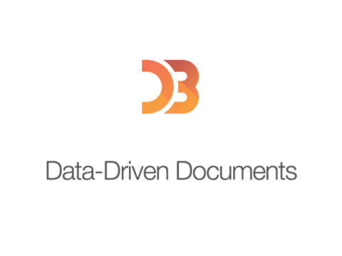

## Введение

В нашем мире, управляемом данными, где отслеживается каждый клик, покупка и взаимодействие, роль аналитика данных важна как никогда. Компании связывают свой успех с эффективным анализом данных, что делает набор инструментов аналитика данных необходимым для превращения необработанных данных в значимые выводы. В этой статье рассматриваются основные платформы, языки и программное обеспечение, позволяющие аналитикам делать глубокие выводы. Она служит исчерпывающим руководством по основным инструментам, охватывающим работу с большими данными, сложные рабочие процессы, управление данными, манипулирование ими и визуализацию. Независимо от того, являетесь ли вы опытным специалистом, который постоянно обновляет свои знания, или начинающим аналитиком, расширяющим свой инструментарий, это исследование предлагает ценные сведения о развивающейся области анализа данных.

## Основные инструменты для аналитиков данных

## 1. Microsoft Excel

Одна из мощных программ электронных таблиц, которая часто используется для анализа данных, - Microsoft Excel. Она позволяет импортировать и упорядочивать данные, а также предоставляет инструменты для преобразования и очистки наборов данных с помощью формул, сортировки и фильтрации. Обширная библиотека встроенных функций Excel облегчает выполнение широкого спектра расчетов и статистического анализа. В программе имеется ряд диаграмм и инструментов для визуализации данных. Программа поддерживает анализ ”что-если", позволяя пользователям исследовать различные ситуации и моделировать возможные результаты. Power Pivot и Power Query - примеры расширенных функций, которые улучшают возможности моделирования данных. Excel упрощает выполнение повторяющихся задач, поддерживая автоматизацию с помощью сценариев VBA и макросов. Использование облачных сервисов для совместной работы упрощает работу, а программное обеспечение позволяет легко экспортировать данные. Благодаря интуитивно понятному интерфейсу и широкому применению Microsoft Excel является широко используемым инструментом для людей и организаций, занимающихся анализом и манипулированием данными.

### Ключевые особенности

Импорт и упорядочивание данных Инструменты для очистки и преобразования данных Обширная библиотека функций Поддержка визуализации данных с помощью поворотных таблиц Возможность анализа ”что-если" Расширенные функции, такие как Power Query и Pivot Автоматизация с помощью макросов и сценариев VBA Облачные функции совместной работы

## 2. SQL

SQL является важнейшим инструментом анализа данных благодаря своим стандартизированным и эффективным возможностям взаимодействия с реляционными базами данных. Ключевой функцией является поиск данных с помощью оператора SELECT, позволяющего пользователям агрегировать, фильтровать и сортировать данные по определенным критериям. Поддержка объединений и связей в SQL очень важна для консолидации данных из разных таблиц, особенно при работе с взаимосвязанными наборами данных. Гибкость языка распространяется на расширенные аналитические операции с использованием оконных функций, а также на возможности преобразования и очистки данных. Его значение распространяется на управление обширными массивами данных, способствуя не только формированию запросов, но и обеспечению безопасности данных, контролю доступа и масштабируемости. Эффективность языка повышается благодаря его бесшовной интеграции с различными инструментами и языками программирования, предлагая комплексное решение для извлечения ценной информации из структурированных данных.

### Ключевые особенности

Использует оператор SELECT для поиска данных Сортирует, фильтрует и агрегирует данные Использует связи и соединения для консолидации данных Поддерживает оконные функции для расширенной аналитики Обеспечивает преобразование и очистку данных Управляет большими массивами данных с возможностью масштабирования Интегрируется с языками программирования и инструментами Стандартизированная связь с реляционными базами данных

## 3. Power Bi

Power BI от Microsoft - это надежный инструмент бизнес-аналитики, предназначенный в первую очередь для эффективного анализа данных. Среди его достоинств - широкие возможности подключения к данным, позволяющие пользователям легко интегрировать и импортировать данные из различных источников. Мощные функции моделирования и преобразования данных, особенно с помощью Power Query, позволяют пользователям легко формировать и улучшать данные. Power BI отлично справляется с визуализацией данных, предлагая широкий набор легко настраиваемых графиков и диаграмм для создания динамических информационных панелей и отчетов. Кроме того, пользователи могут проводить глубокий анализ и сложные вычисления, чему способствует поддержка расширенной аналитики с помощью языка Data Analysis Expressions (DAX). Инструмент способствует совместной работе, упрощая обмен отчетами и информационными панелями в службе Power BI.

### ключевые особенности

Импорт данных из различных источников Преобразование и моделирование с помощью Power Query Настраиваемые диаграммы и графики для визуализации Поддержка сложных вычислений с помощью языка DAX Создание интерактивных и динамических визуализаций Облегчает работу в команде благодаря простоте совместного использования на службе Power BI

## 4. Python

Python стал самым популярным языком для анализа данных благодаря обширному лилавная экосистема, читабельность и универсальность. Благодаря своей интерпретируемой природе и простому синтаксису он хорошо подходит для интерактивной разработки и быстрого создания прототипов. Ключевые библиотеки, такие как NumPy, поддерживающая большие массивы и математические функции, и Pandas, предлагающая надежные инструменты манипулирования данными с помощью структур Series и DataFrame, являются неотъемлемой частью его возможностей по анализу данных. Визуализацию облегчают Matplotlib и Seaborn, а задачи машинного обучения упрощаются с помощью библиотеки Scikit-learn. Блокноты Jupyter играют важную роль в создании документов, которые сочетают в себе повествовательный текст, живой код и визуализации, улучшая аналитический процесс. Широкое распространение Python в сфере анализа данных подкрепляется обширной документацией, активным сообществом и удобной интеграцией с такими инструментами, как SQLalchemy и Spark.

### Ключевые особенности

Обширная экосистема библиотек Простота и удобство чтения Pandas и NumPy для манипулирования данными Seaborn и Matplotlib для визуализации Scikit-learn для машинного обучения Интерактивная разработка с помощью блокнотов Jupyter Поддержка сообщества и обширная документация

## 5. Tableau

Tableau является ведущим инструментом анализа данных, позволяющим легко подключаться к разнообразным источникам данных, создавать визуально привлекательные представления и упрощать процесс исследования данных. Удобный интерфейс с функцией drag-and-drop позволяет как техническим, так и нетехническим пользователям без труда создавать интерактивные диаграммы, графики и информационные панели. Инструмент облегчает извлечение ценных сведений благодаря таким функциям, как специальный анализ, вычислительные возможности и удобные варианты совместной работы через Tableau Server и Tableau Online. Широко распространенный и адаптируемый, Tableau обеспечивает эффективный анализ и визуализацию данных, а также совместимость с различными платформами данных, повышенное внимание к безопасности данных и доступность на мобильных устройствах.

### Ключевая особенность

Создает визуально привлекательные графики и диаграммы Подключается к различным источникам данных Удобный интерфейс с перетаскиванием данных Обеспечивает мгновенное изучение данных Поддерживает вычисляемые поля Облегчает работу в команде с помощью Tableau Server и Online Базовая сортировка, фильтрация и группировка данных Совместимость с различными источниками данных Уделяет особое внимание безопасности данных Совместимость с мобильными устройствами

## 6. R

R - это специализированный язык программирования с открытым исходным кодом, явно предназначенный для анализа данных и статистических вычислений. Широко известный своими обширными статистическими пакетами, R предлагает пользователям разнообразный набор инструментов для решения таких задач, как анализ временных рядов, регрессионный анализ и проверка гипотез. Используя такие пакеты, как ggplot2, R отлично справляется с созданием надежных и глубоких визуализаций, демонстрируя свое мастерство в визуализации данных. Язык предлагает решения для различных статистических методов и алгоритмов машинного обучения, используя богатую экосистему пакетов, поддерживаемую активным сообществом. Уделяя особое внимание воспроизводимости, R упрощает запись и распространение аналитических данных, способствуя прозрачности и сотрудничеству. Его универсальность проявляется в совместимости с различными форматами данных, интеграции с другими инструментами и использовании в качестве языка сценариев автоматизации. R - это гибкий и мощный выбор для статистиков, специалистов по анализу данных и аналитиков, занимающихся глубоким анализом и визуализацией данных, подкрепленный множеством обучающих ресурсов.

### Ключевые особенности

Сосредоточен на статистике и анализе данных Комплексное статистическое программное обеспечение Профессиональная визуализация данных с помощью ggplot2 Экосистема машинного обучения и статистических методов Упор на повторяемость для прозрачности Интеграция с другими инструментами и форматами данных Гибкий язык программирования для автоматизации Подходит для аналитиков, специалистов по изучению данных и статистиков Обилие обучающих ресурсов

## 7. Блокноты Jupyter

Интерактивные блокноты Jupyter представляют собой динамичную и интерактивную среду, которая дает множество преимуществ аналитикам и специалистам, занимающимся анализом данных. Благодаря своей универсальности и поддержке различных языков программирования, таких как Python, R и Julia, они подходят для широкого круга приложений. Интеграция выполнения кода с мультимедиа, визуализацией данных и пояснительным текстом в блокнотах позволяет создавать полные и визуально привлекательные документы. Возможность экспорта блокнотов в различные форматы улучшает совместную работу и обмен информацией, а функция интерактивных вычислений способствует итеративному исследованию данных. Эффективность Jupyter при анализе крупномасштабных данных повышается благодаря его совместимости с инструментами и платформами для работы с большими данными, такими как Apache Spark. Кроме того, блокноты Jupyter играют важнейшую роль в обеспечении воспроизводимости и документировании, предоставляя четкие и прозрачные записи о ходе анализа.процесс. В заключение можно сказать, что интерактивные блокноты Jupyter представляют собой чрезвычайно ценный инструмент, способствующий развитию командной работы, поддерживающий различные языки программирования и упрощающий передачу данных.

### ключевые особенности

Совместимость с различными языками Интерактивные и динамические вычисления Интеграция текста, изображений и кода Экспорт в различные форматы Поддержка инструментов для работы с большими данными, таких как Apache Spark Обеспечение воспроизводимости и документирования Поощрение сотрудничества и обмена Эстетичное представление с помощью мультимедиа

## 8. Google Analytics

Google Analytics - это мощный инструмент веб-аналитики, который предлагает бесценную информацию для анализа цифровых данных. Предприятия могут лучше понять свою аудиторию, создать более интересный контент и отточить свои цифровые стратегии с помощью всеобъемлющих данных о демографии посетителей, производительности сайта и отслеживании конверсии. Всестороннее представление о поведении пользователей в Интернете дают отчеты в режиме реального времени, настраиваемые панели и аналитика электронной коммерции. Google Analytics - гибкое и доступное решение для компаний любого размера, благодаря плавной интеграции с другими продуктами Google, частым обновлениям и бесплатному доступу к основным функциям. Это дает пользователям возможность оптимизировать пользовательский опыт, принимать решения на основе данных и постоянно развивать свое присутствие в Интернете.

## ключевые особенности

Измеряет вовлеченность контента Обеспечивает понимание аудитории Уточняет цифровую стратегию Анализирует эффективность веб-сайта Отслеживает конверсии Предлагает отчетность в реальном времени Настраиваемые панели аналитики электронной коммерции Бесшовная интеграция с другими продуктами Google Регулярные обновления и бесплатные базовые функции

## 9. Apache Hadoop

Важнейший инструмент в области анализа данных, Apache Hadoop - это фреймворк с открытым исходным кодом для распределенной обработки и хранения огромных массивов данных. Модель программирования MapReduce и Hadoop Distributed File System (HDFS), два ее основных компонента, позволяют параллельно обрабатывать и хранить огромные объемы данных на кластере с аппаратным обеспечением. Hive, Pig, HBase и Spark - лишь некоторые из модулей, составляющих экосистему Hadoop, которая расширяет ее функциональность, включая высокоуровневое программирование, поддержку баз данных NoSQL, обработку данных в памяти и запросы, подобные SQL. Планированием и распределением ресурсов занимается YARN. Благодаря своей отказоустойчивости, масштабируемости, доступности и универсальности в управлении структурированными и неструктурированными данными, Hadoop является важнейшим компонентом систем анализа больших данных. Хотя Hadoop обладает множеством возможностей, его развертывание и управление могут быть сложными, и он может быть не лучшим вариантом для приложений, требующих низкой задержки. Тем не менее, Apache Hadoop - это надежная основа для компаний, которые хотят изучать и извлекать знания из огромных массивов данных.

### ключевые особенности

Распределенная обработка больших массивов данных Модель программирования MapReduce для параллельных вычислений Распределенная файловая система Hadoop (HDFS) для отказоустойчивого хранения Экосистема модулей для различных функций YARN для планирования и распределения ресурсов Обеспечивает отказоустойчивость и масштабируемость Экономичное решение для стандартного оборудования Управляет структурированными и неструктурированными данными Поддерживает анализ больших данных Сложность в настройке и управлении

## 10. D3.js

JavaScript-библиотека D3.js, также известная как Data-Driven Documents, знаменита своей способностью создавать динамические и интерактивные визуализации данных в веб-браузерах. Хотя D3.js изначально не была разработана для анализа данных, она часто используется в сочетании с аналитическими задачами для создания визуально убедительных представлений наборов данных. Его бесшовная синхронизация изменений данных с соответствующими визуальными элементами обусловлена привязкой данных к объектной модели документа (DOM). Благодаря использованию переходов для создания анимированных эффектов, выделений для точного манипулирования DOM и шкал для сопоставления данных с визуальными свойствами, D3.js упрощает создание выразительных и интерактивных графиков, диаграмм и приборных панелей. Благодаря своей гибкости D3.js оказывается отличным инструментом для анализа данных, позволяя аналитикам эффективно передавать результаты и визуально исследовать закономерности, тенденции и отклонения.

## Ключевые особенности

Создает интерактивные визуализации в веб-браузере Часто используется в сочетании с аналитикой для создания привлекательных представлений Грациозно изменяет визуальные эффекты в ответ на изменения данных Добавляет плавные анимации к изменениям данных Позволяет целенаправленно изменять разделы веб-страницы на основе данных Помогает согласовывать данные с визуальным представлением Позволяет создавать пользовательские диаграммы и графики Помогает выявлять тенденции и закономерности в данных

## Заключение

В современном ландшафте, основанном на данных, роль аналитика данных является ключевой. В этой статье рассматриваются 10 лучших инструментов, необходимых длядля эффективного анализа данных, охватывая такие платформы, как Microsoft Excel для манипулирования данными, SQL для запросов к базам данных, Power BI для бизнес-аналитики, Python для универсального программирования и Tableau для динамических визуализаций. Кроме того, в книге рассматриваются R, Jupyter Notebooks, Google Analytics, Apache Hadoop для работы с большими данными и D3.js для интерактивных веб-визуализаций. Независимо от того, являетесь ли вы опытным аналитиком или начинающим профессионалом, это руководство дает ценные сведения об освоении инструментов, позволяющих получать значимые данные.

Для получения статей по анализу данных давайте общаться в X и Linkedin. Счастливого обучения!
