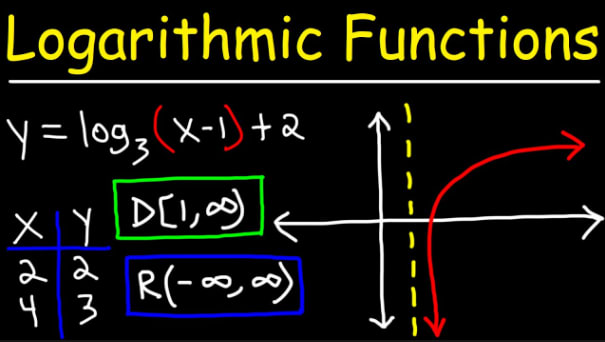

## Введение

Многие считают, что для того, чтобы стать программистом, не нужно знать математику. Хотя это отчасти верно, понимание некоторых основных математических понятий может сделать программирование гораздо более доступным и помочь вам раскрыть секреты цифрового мира.

## 10 математических концепций для программистов

В этой статье мы рассмотрим 10 математических концепций, с которыми должен быть знаком каждый программист.

## 1. Булева алгебра

Булева алгебра - это фундаментальная концепция в программировании. Она имеет дело с двоичными переменными, которые могут иметь только два значения: true или false. Для работы с булевыми значениями мы используем три оператора: AND, OR и NOT.

Представьте их как инструменты для принятия решений. Например, если вы хотите узнать, является ли человек одновременно богатым и красивым, чтобы заполучить девушку, булевы переменные помогут вам принять решение. Если оба условия выполнены, он получит девушку. Если нет, у него могут быть другие варианты. Эту логику можно представить с помощью операторов if, диаграмм Венна или таблиц истинности.

## 2. Системы чисел

Компьютеры используют двоичную систему счисления (основание-2), в отличие от людей, которые используют десятичную систему счисления (основание-10). В системе основание-2 числа представлены только двумя символами: 0 и 1. Понимание двоичной системы помогает нам работать с другими системами счисления, такими как шестнадцатеричная (base-16) и base-64, которые очень важны в программировании, особенно для кодирования и представления данных.

## 3. Числа с плавающей точкой

Числа с плавающей точкой - это способ представления компьютером вещественных чисел. Они не всегда точны, что может привести к крошечным ошибкам в вычислениях. В этих числах используется научная нотация для эффективной работы с большими и малыми значениями. Знание ограничений чисел с плавающей точкой очень важно для предотвращения подобных ошибок в вашем коде.

`print(1.00000000005) # Положительное плавающее число print(-85.6701) # Отрицательное плавающее число`.

## 4. Логарифмические функции

Логарифмы помогают нам понять, как работают некоторые природные явления. Подумайте о логарифме как о способе измерения того, сколько раз нужно распилить бревно, чтобы достичь определенной длины. В программировании логарифмические функции используются в таких алгоритмах, как двоичный поиск. Эти функции играют важную роль в различных приложениях, от алгоритмов до научных исследований.

## 5. Теория множеств

Теория множеств имеет дело с коллекциями уникальных значений. В программировании эта концепция используется очень широко, особенно в базах данных, где таблицы представляют собой наборы уникальных строк. Объединение множеств, поиск пересечений, объединений и различий - обычные операции в этом контексте. Понимание теории множеств важно для работы с базами данных и манипулирования данными.

## 6. Комбинаторика

Комбинаторика - это все о подсчете вещей и комбинаций. Разрабатываете ли вы алгоритмы для новостных приложений или проектируете глобально распределенные базы данных, комбинаторика поможет вам эффективно просчитать все возможные комбинации или перестановки. Это ценный навык в программировании.

## 7. Теория графов

Теория графов включает в себя узлы (вершины), соединенные ребрами. Эта концепция используется для моделирования отношений и связей. Понимание теории графов необходимо для решения таких задач, как маршрутизация сети и оптимизация различных сценариев.  

## 8. Теория сложности (нотация Big O)

Теория сложности помогает анализировать эффективность алгоритмов. Нотация Big O - это инструмент для выражения сложности алгоритмов по времени и памяти. Она помогает выбрать наиболее эффективное решение для задач программирования, что является ценным навыком для проведения собеседований и написания эффективного кода.

## 9. Статистика

Статистика необходима для различных областей программирования, особенно в искусственном интеллекте и машинном обучении. Понимание основных статистических понятий, таких как среднее значение, медиана, мода и стандартное отклонение, поможет вам лучше всего делать прогнозы. Это основа для принятия прогнозов и решений в приложениях, управляемых данными.

## 10. Линейная алгебра

Линейная алгебра необходима в компьютерной графике, глубоких нейронных сетях и многих других областях программирования. Она включает в себя скаляры, векторы и матрицы для представления и манипулирования данными. Если вы хотите работать с 3D-графикой, криптографией и машинным обучением, то линейная алгебра придет на помощь. Чтобы справиться с этими задачами, вам нужно освоить линейную алгебру.

## Заключение

Математика - мощный инструмент в мире программирования, и эти 10 концепций - только начало. Они помогут вам разрабатывать более эффективный код, решать сложные задачи и раскрывать магию цифрового мира. Эти математические концепции сделают вас лучшим программистом, и вы будете хорошо подготовлены к решению широкого круга задач в постоянно развивающейся сфере технологий.

Спасибо, что нашли время прочитать эту статью, и если она оказалась для вас полезной, вам также понравится мой канал на YouTube. До следующего раза, счастливого кодинга!
