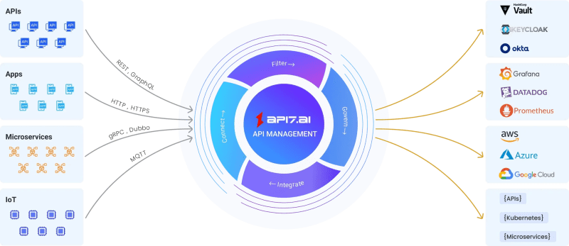
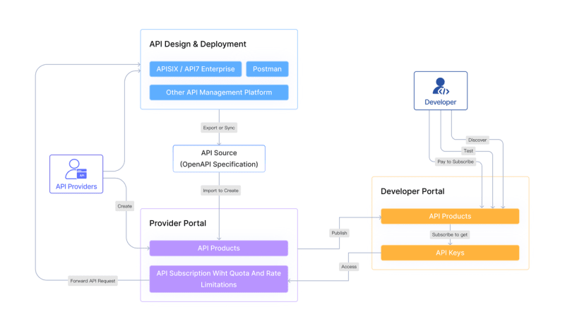

Независимо от того, хотите ли вы добиться непревзойденной производительности, надежной защиты или бесшовной масштабируемости, API7 - это идеальное решение, которое легко справляется со всеми задачами. Давайте узнаем, что делает API7 вашим лучшим выбором!

Основанная в 2019 году, API7.ai - это платформа для управления API, предоставляющая комплексные и эффективные решения для проектирования API, разработки API, портала API и монетизации API на основе Apache APISIX, производительного шлюза API с открытым исходным кодом. Apache APISIX был протестирован и высоко оценен такими мировыми компаниями и организациями, как Zoom, Airwallex, Lenovo, Lotus Cars, vivo и European Factory Platform, и передан API7.ai в фонд Apache Software Foundation. Основываясь на APISIX, API7.ai предлагает продукты корпоративного уровня, такие как API7 (API7 Enterprise), отвечающие основным требованиям предприятий.

## 10 причин выбрать API7:

Сверхвысокая производительность и низкая задержка Динамическая легкая архитектура Cloud-Native и Kubernetes-Friendly Open Source как надежная основа 100 плагинов и несколько языков разработки Быстрая поддержка сообщества и коммерческих организаций Разумный и гибкий ценовой план Надежная безопасность и соответствие законодательству Комплексное управление API Ускоритель монетизации и максимизация

## 1. Сверхвысокая производительность и низкая задержка

API7 обладает тем же ядром и фундаментальной логикой, что и APISIX, включая сверхвысокую производительность и низкую задержку. Apache APISIX обеспечивает лучшую производительность среди других API-шлюзов с одноядерным QPS 18 000 при средней задержке 0,2 мс. Вы можете прочитать этот блог, чтобы узнать, насколько быстрым является APISIX/API7.

По результатам теста, сравнивающего APISIX 3.0 и Kong 3.0, в котором используется стресс-инструмент wrk2 и OpenResty в качестве upstream-сервиса, мы можем сделать следующие выводы:

Производительность APISIX 3.0 составляет около 140% от Kong 3.0, когда плагины не используются. (Тест 1 и 4)

Производительность APISIX 3.0 составляет около 200 % от Kong 3.0 при использовании плагинов. (Тест 2 и 3)

Apache APISIX - один из самых активных проектов API-шлюзов на GitHub, обслуживающий более 1 триллиона API-вызовов в день, и этот показатель продолжает расти. Что заставляет APISIX работать исключительно хорошо?

Выдающаяся производительность APISIX объясняется его хорошо продуманным технологическим стеком, который использует мощь NGINX и LuaJIT. Используя возможности высокопроизводительного веб-сервера NGINX и эффективной среды исполнения LuaJIT, APISIX достигает быстрого согласования маршрутизации и синхронизации конфигурации.

В качестве центра конфигурации APISIX использует etcd, который позволяет получать уведомления о событиях в режиме реального времени, поскольку предоставляет такие функции подписки, как watch и watchdir, для отслеживания изменений определенных ключевых слов или каталогов. etcd легче масштабируется, а также устраняет необходимость в частом опросе баз данных.

## 2. Динамическая легкая архитектура

API7 достаточно легок для запуска на небольших машинах и может легко масштабироваться до сотен и даже тысяч экземпляров благодаря основным архитектурным достоинствам APISIX. API7 предлагает беспроблемный опыт внедрения, что облегчает пользователям освоение и использование APISIX.

С API7 вы можете эффективно работать на экземпляре 1C1G (1 ядро 1 ГБ ОЗУ), но при этом справляться с высокой нагрузкой на трафик, не создавая чрезмерной нагрузки на процессор. Это обеспечивает экономическую эффективность при сохранении оптимальной производительности. Независимо от того, начинаете ли вы с малого или масштабируете систему для обработки миллиардов запросов, API7 создан для удовлетворения ваших потребностей.

API7 также позволяет переключаться между корпоративной версией APISIX и версией с открытым исходным кодом. Это дает вам возможность выбрать версию, которая лучше всего соответствует вашим требованиям.

Более того, API7 может обеспечить идеальную горячую перезагрузку, не привлекая внимания пользователей и не влияя на обычный бизнес. Динамическая горячая перезагрузка API7 позволяет публиковать API без необходимости перезапуска систем, сокращая время простоя и улучшая работу бизнес-систем.

## 3. Cloud-Native и Kubernetes-Friendly

По словам г-на Суна, технического эксперта Amber Group,

”Коммерческая поддержка API7.ai отлично подходит для контроля безопасности и всесторонней поддержки. Мы выбрали API7 еще и потому, что он замечательно поддерживает k8s”.

API7 - это облачное решение для управления API, рожденное в эпоху облачных нативных вычислений, которое предлагает интеграцию с различными проектами Cloud Native Computing Foundation (CNCF), включая Prometheus, Grafana и OpenTelemetry. Такая интеграция позволяет организациям использовать эти популярные инструменты для расширенного мониторинга, наблюдения и аналитики в своей экосистеме API.

API7 обеспечивает гибкость развертывания в различных средах, включая локальные, мультиоблачные и гибридные облачные системы. Такая универсальность позволяет предприятиям выбирать модель развертывания, которая наилучшим образом соответствует их специфическим требованиям и предпочтениям в отношении инфраструктуры.

Кроме того, APISIX является платформойостика без привязки к производителю. API7 разработан с учетом совместимости с ведущими облачными платформами, такими как OpenShift, Amazon EKS и Google Kubernetes Engine, что обеспечивает беспрепятственное развертывание и управление в различных основных облаках. Такая гибкость позволяет организациям использовать предпочитаемую облачную инфраструктуру, получая при этом преимущества от надежных функций управления API, предоставляемых API7.

## 4. Открытый исходный код как надежная основа

В качестве надежного фундамента API7 использует Apache APISIX, который является открытым исходным кодом и имеет активное сообщество с более чем 600 участниками по всему миру. Природа открытого кода позволяет пользователям изучать исходный код, что способствует прозрачности. Такая прозрачность помогает пользователям понять, как работает APISIX, проверить его безопасность, выявить и устранить любые потенциальные уязвимости и ошибки.

Как проект с открытым исходным кодом, APISIX работает под лицензией Apache, версия 2.0, которая регулирует использование, изменение и распространение программного обеспечения. Фонд Apache Software Foundation (ASF), под эгидой которого разрабатывается APISIX, строго следит за стабильностью лицензии.

Существует множество примеров изменения лицензий. Внезапные изменения в лицензиях или требование к пользователям перейти с продуктов с открытым исходным кодом на платные версии могут иметь различные негативные последствия. Пользователи могут столкнуться с рисками, связанными с потерей данных или сложными процессами миграции. Кроме того, введение неожиданных требований по оплате может привести к увеличению расходов и даже нарушить сложившиеся рабочие процессы и зависимости, а также потенциально привести к проблемам совместимости с другими инструментами.

Приняв путь Apache, APISIX сможет использовать силу сотрудничества, создания сообщества и доверия для стимулирования инноваций, обеспечения долгосрочной устойчивости и получения признания в экосистеме открытого исходного кода.

## 5. 100+ плагинов и несколько языков разработки

API7 поддерживает почти 100 плагинов с открытым исходным кодом, которые поддерживает APISIX, охватывая широкий спектр функциональных возможностей, таких как аутентификация, авторизация, ограничение скорости, ведение журнала, мониторинг и многое другое.

Более того, API7 предоставляет больше плагинов корпоративного уровня, таких как маркировка трафика, что позволяет предприятиям оптимизировать производительность, персонализировать пользовательский опыт благодаря точной классификации трафика и получить ценные сведения благодаря точному анализу трафика.

Разнообразная экосистема плагинов APISIX включает в себя плагины с открытым исходным кодом, разработанные как основной командой, так и сообществом. Эти плагины могут быть легко интегрированы в шлюз APISIX для расширения его возможностей и адаптации к конкретным условиям использования.

Если вам нужно реализовать аутентификацию и авторизацию с помощью JWT или OAuth, обеспечить ограничение скорости и контроль доступа или интегрироваться с такими инструментами наблюдения, как Prometheus и Zipkin, API7 предоставляет богатую коллекцию плагинов для удовлетворения ваших потребностей.

Помимо разработки плагинов и других функций с помощью LuaJIT, Apache APISIX также поддерживает разработку плагинов с помощью различных языков, таких как Java, Go, Lua, Python и Wasm. Такая широкая поддержка языков позволяет разработчикам использовать имеющиеся у них навыки и выбирать наиболее подходящий язык для конкретных требований к плагинам. Это не только снижает стоимость разработки, но и повышает ее эффективность, способствуя сотрудничеству и инновациям в сообществе APISIX.

## 6. Быстрая поддержка сообщества и коммерческая поддержка

По словам Райана Цао, главного архитектора программного обеспечения компании Airwallex,

“Airwallex осуществил плавный переход к мультиоблачным и микросервисным архитектурам благодаря коммерческой поддержке API7.ai: высоко оптимизированной и масштабируемой платформе и поддержке сообщества разработчиков!”

Apache APISIX процветает благодаря активному и заинтересованному сообществу, которое неуклонно стремится к его постоянному развитию и совершенствованию. С другой стороны, API7.ai предлагает незаменимые услуги коммерческой поддержки, тщательно разработанные для предприятий, использующих Apache APISIX, гарантируя его беспрепятственную интеграцию в приложения. Эти совместные усилия делают API7 образцовым выбором для создания высокопроизводительных API.

Члены команды поддержки API7 - это члены PMC, сопровождающие и участники Apache APISIX, а также других уважаемых проектов с открытым исходным кодом. Они обладают глубоким пониманием фундаментальной архитектуры APISIX, что позволяет им квалифицированно решать практически любые вопросы, связанные с API7.

API7.ai предоставляет коммерческую поддержку API7, охватывающую различные аспекты, включая анализ архитектуры, анализ кода, устранение неполадок, диагностику, предложения, обновления и исправления безопасности. Она обеспечивает нормальную и надежную работу Apache APISIX как в среде разработки, так и в производственной среде.

## 7. Разумный и гибкий план ценообразования

API7.ai предлагает ценовые структуры, адаптированные как для SaaS, так и для локальных решений, предоставляя варианты для различных вариантов развертывания. Вот описание модели ценообразования API7:

SaaS (полностью управляемый CP, самостоятельный Hosting DP)

On-Premise

Модель ценообразования API7 разработана таким образом, чтобы предлагать разумные и гибкие варианты, обеспечивая пользователям свободу выбора наиболее подходящего решения для их конкретных требований.

## 8. Надежная безопасность и соблюдение правовых норм

API7.ai придает первостепенное значение соблюдению правовых норм и безопасности данных. Получение компанией сертификата SOC (System and Organization Controls) 2 Type 1, выданного Ernst & Young, является свидетельством ее непоколебимой приверженности защите данных клиентов. Этот сертификат подтверждает строгое следование API7.ai самым высоким стандартам в управлении и защите конфиденциальной информации.

В сочетании с сертифицированным по стандарту FIPS 140-2 OpenSSL 3.0, API7 соответствует строгим требованиям FIPS 140-2 (уровень 1), направленным на защиту шифрования и дешифрования зашифрованного сетевого трафика SSL/TLS. Надежная функция шифрования данных обеспечивает максимальную защиту конфиденциальной информации, ограждая ее от любого несанкционированного доступа.

Кроме того, API7 использует протоколы безопасной передачи данных, обеспечивая непроницаемый уровень защиты во время передачи данных, эффективно пресекая любые попытки кражи или фальсификации данных. Это передовое решение позволяет предприятиям всесторонне укреплять безопасность данных, что дает им возможность уверенно развиваться в динамичном ландшафте цифровой эпохи.

## 9. Комплексное управление API

API7 - это комплексное решение для управления жизненным циклом API, основанное на Apache APISIX, шлюзе API с открытым исходным кодом и некоторыми корпоративными функциями. Оно предлагает ряд мощных функциональных возможностей, отвечающих потребностям современного бизнеса. Вот основные функциональные возможности API7:

Комплексное управление жизненным циклом API: В сочетании с надежной средой исполнения API, API7 предлагает управление API на протяжении всего жизненного цикла, обеспечивая предприятиям эффективную разработку, развертывание и управление API на протяжении всего срока их существования.

Безопасность и защита: API7 уделяет особое внимание безопасности, защищая API от потенциальных угроз и уязвимостей. Сюда входят такие функции, как многопользовательская аренда и управление доступом на основе ролей (RBAC) для гранулированного контроля доступа и защиты от несанкционированного доступа.

Улучшенный пользовательский опыт: В серии API7 Enterprise 3.0 особое внимание уделяется совершенствованию пользовательского интерфейса, что обеспечивает пользователям более плавный и интуитивно понятный опыт.

Гибкость и настройка: API7 позволяет предприятиям настраивать свои API в соответствии с конкретными потребностями бизнеса.

Аналитика и мониторинг: Платформа включает в себя аналитические возможности, позволяющие предприятиям отслеживать производительность API, использование и другие важные показатели.

Модернизация и монетизация: API7 облегчает модернизацию устаревших приложений и предоставляет возможности для монетизации API. Это позволяет предприятиям открывать новые потоки доходов и оставаться конкурентоспособными в цифровом ландшафте.

## 10. Ускоритель монетизации и максимизация

API7 предлагает API7 Portal как часть сервиса, который также может быть самостоятельной услугой.

API7 Portal поддерживает множество различных стратегий монетизации, позволяя компаниям выбрать подходящую стратегию в соответствии с их бизнес-потребностями. Он предлагает беспрепятственный процесс подписки на API, позволяя разработчикам подавать заявки на подписку на API, получать учетные данные доступа и успешно вызывать нужные API.

API7 Portal может служить центральной платформой, помогающей предприятиям превратить свои API в источники дохода. С помощью API7 Portal организации могут определять цены и структуры оплаты для различных услуг API, предоставляя разработчикам и предприятиям платный доступ к API. Это создает новые бизнес-модели, позволяющие организациям монетизировать ценность, предоставляемую API.

API7 Portal предоставляет мощные инструменты управления и мониторинга, которые помогают организациям отслеживать и понимать использование API. С помощью API7 Portal предприятия могут собирать данные об использовании API, включая количество вызовов, трафик, поведение пользователей и многое другое. Эти данные помогают определить популярность API, оптимизировать его работу и понять потребности пользователей. Отслеживая и анализируя использование API, компании могут вносить коррективы для повышения качества обслуживания и оптимизации доходов.

## Зачем выбирать API8, если есть APISIX?

### Универсальное решение для управления API

APISIX - это высокопроизводительный шлюз API с открытым исходным кодом. С другой стороны, API7 - это комплексное решение для управления API, которое опирается на возможности APISIX.

API7 объединяет APISIX в качестве ядра и добавляет функции корпоративного уровня, включая RBAC, выпуск групп шлюзов, журналы аудита, маркировку трафика и т. д. Оно разработано для обеспечения расширенных функциональных возможностей и надежности, необходимых предприятиям для управления API в производственных средах.

### Помощь в интеграции и настройке

Как создатель APISIX, компания API7.ai может оказать помощь в разработке и реализации стратегии интеграции, которая оптимизирует производительность.и надежность своих приложений, используя возможности, предоставляемые APISIX.

Используя профессиональные услуги по интеграции APISIX и его настройке в соответствии со своими приложениями, компании могут оптимизировать свои усилия по разработке, сократить время выхода на рынок и повысить общую производительность, безопасность и надежность своей инфраструктуры API.

## Резюме

Мы рассмотрели убедительные причины, которые делают API7 лучшим выбором для компаний, стремящихся повысить эффективность управления API. Благодаря своим расширенным возможностям и универсальной совместимости API7 становится мощным инструментом для компаний, стремящихся к процветанию в цифровом мире.

Выбирая API7, компании не только оптимизируют управление API, но и повышают качество работы разработчиков и прокладывают путь к успеху своих цифровых инициатив.
