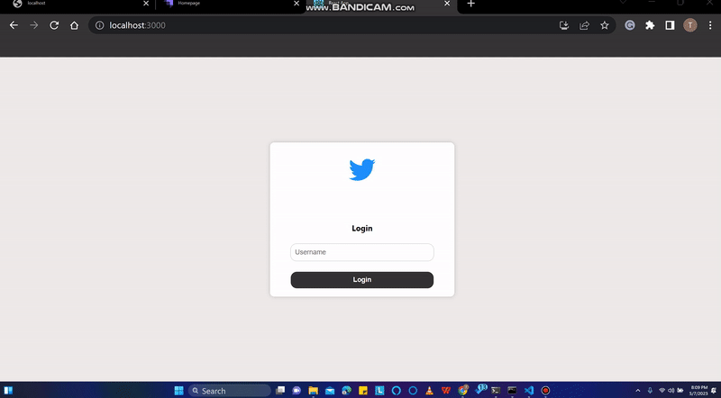
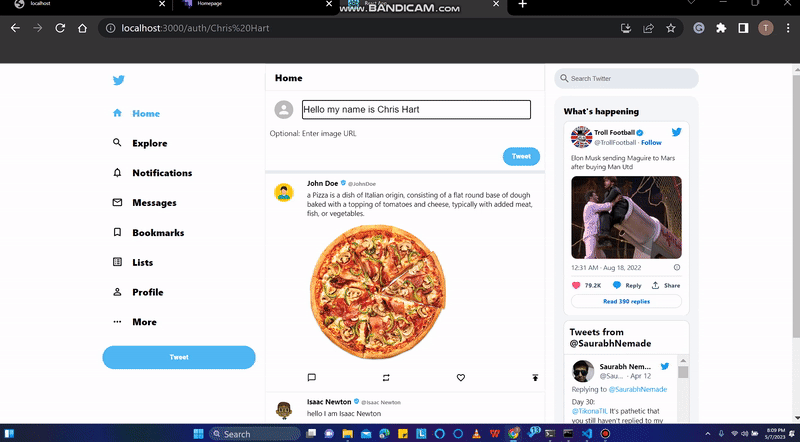

API Canvas - это встроенный в HTML5 API для создания и эффективного рисования фигур на экране. Следующее определение взято из веб-документов MDN: Canvas API позволяет рисовать графику с помощью Javascript и элемента HTML `<canvas>`. Мы можем использовать его для анимации, игровой графики, визуализации данных, работы с фотографиями и обработки видео в реальном времени.

API Canvas в основном используется для вывода на экран 2D-графики. Для рендеринга 3D-графики следует использовать WebGL API, но здесь мы сосредоточимся на работе с 2D. API WebGL также может рендерить 2D-графику, поскольку использует элемент canvas.

В этом уроке мы рассмотрим создание следующих элементов:

- Простая анимация Чистый холст, на котором мы можем рисовать фигуры и графику
- Свойства и методы, доступные в API Canvas

В API Canvas доступны некоторые свойства и методы, и в этом разделе мы рассмотрим их. Разница между свойствами и методами заключается в том, что свойства задают или возвращают определенный цвет или узор, используемый в рисунках. В отличие от этого, методы создают узоры, используемые свойствами в рисунке. Некоторые свойства и методы включают:

`fillStyle`: Это свойство задает цвет или узор, используемый в рисунке. `шрифт`: Это свойство определяет свойство шрифта для текстового содержимого `strokeStyle`: Это свойство определяет цвет, используемый для обводки. `createLinearGradient()`: Этот метод создает линейный градиент, который можно использовать на холсте. `rect()`: Этот метод создает прямоугольник на холсте. `fillRect()`: Этот метод рисует заполненный прямоугольник. `stroke()`: Этот метод рисует заданную вами траекторию.

Подробнее о методах и свойствах, доступных в API canvas, вы можете прочитать здесь. Полный код для этой статьи можно найти здесь.

## Создание простой анимации

Перейдите в выбранную вами папку и выполните следующую команду, чтобы создать новое приложение React.

`yarn create react-app <НАЗВАНИЕ ВАШЕГО ВЫБОРА>`

Вы можете очистить файловую структуру, удалив ненужные файлы в папке src. Создайте файл Animation.jsx, который будет содержать код анимации. Скопируйте и вставьте в этот файл приведенный ниже код.

```js
import React, { useRef } from 'react';

const Animation = () => {
	const canvas = useRef(null);

	const draw = (ctx, frameCount) => {
		ctx.clearRect(0, 0, ctx.canvas.width, ctx.canvas.height);
		ctx.fillStyle = 'blue';
		ctx.beginPath();
		ctx.arc(170, 50, 30 * Math.sin(frameCount * 0.05) ** 2, 0, 2 * Math.PI);
		ctx.fill();
	};

	return <canvas style={{ width: '700px' }} ref={canvas} />;
};

export default Animation;
```

В приведенном выше блоке кода мы вернули элемент canvas, а затем импортировали хук useRef из React. Хук useRef дает нам возможность получить доступ к элементам DOM без использования `document.getElementById` в React. Далее мы создали функцию `draw`, которая принимает два параметра: `ctx` и `frameCount`. `Ctx` используется для оценки методов и свойств в API canvas, а `frameCount` подсчитывает кадры и обеспечивает таймер для анимации в canvas. После этого холст был очищен, и был установлен цвет, используемый для рисования. Затем мы вызвали метод `beginPath()`, который сообщает холсту, что нужно начать рисовать. В следующей строке мы определили, что мы хотим нарисовать, в данном случае это дуга. Метод `arc()` принимает пять (5) обязательных параметров и один (1) необязательный параметр:

Координата x Координата y Радиус окружности Начальный угол в радианах Конечный угол в радианах

Необязательный параметр - это возможность указать, по часовой стрелке или против. По умолчанию он имеет значение false, что означает движение по часовой стрелке.

```js
const render = () => {
	draw(canvasContext); // Call the draw function with the canvas context
	animationFrameId = window.requestAnimationFrame(render); // Request the next animation frame
};

useEffect(() => {
	const canvasElement = canvasRef.current; // Get the canvas element
	const canvasContext = canvasElement.getContext('2d'); // Get the canvas 2d context

	let animationFrameId; // Declare the animation frame ID variable

	render(); // Start the rendering loop

	return () => {
		window.cancelAnimationFrame(animationFrameId); // Cancel the animation frame on cleanup
	};
}, []);
```

В блоке кода выше мы создали хук useEffect, который будет обрабатывать побочные эффекты нашего приложения, потому что без него мы не сможем запустить анимацию для приложения. Далее мы определяем холст с помощью useRef, а затем получаем контекст холста, который мы установили как 2D. Мы предоставили функцию render, которая принимает `frameCount` и функцию `draw`, а также предоставили ей `animationFrameId`, который мы установили для метода `window.requestAnimationFrame()`. Затем метод `window.requestAnimationFrame()` рекурсивно вызывает функцию render

Метод `window.requestAnimationFrame()` сообщает браузеру, что вы хотите выполнить анимацию. Подробнее о методе `window.requestAnimationFrame()` можно прочитать здесь. Далее мы предоставляем функцию очистки для хука useEffect. Эта функция очистки принимает `window.cancelAnimationFrame()`, который вызывает и отменяет `animationFrameId`.

Импортируйте файл в App.js, а затем запустите `yarn start` для просмотра анимации в браузере.



## Создание чистого холста, принимающего рисунки

При создании холста для приема рисунков или графики мы должны обратить внимание на движения мыши. Нас интересуют три (3) из этих движений мыши. `onMouseDown`, `onMouseUp`, `onMouseMove`:

`onMouseDown`: Рисование начинается, когда мы удерживаем мышь нажатой (удерживая левую клавишу мыши или двойным нажатием при использовании трекпада на ноутбуке). `onMouseUp`: Рисование останавливается, когда мы перестаем удерживать мышь (когда мы перестаем удерживать левую клавишу мыши или прекращаем двойное нажатие при использовании трекпада на ноутбуке). `onMouseMove`: Рисунок следует за движением мыши, пока она удерживается.

Мы напишем функции для обработки этих движений мыши. Создайте еще один файл и назовите его `Drawing.jsx`. В этом файле будет храниться код, который позволит нам рисовать на холсте.

```js
import { useEffect, useRef, useState } from 'react';

export default function Drawing() {
	const [isDrawing, setIsDrawing] = useState(false);
	const canvasRef = useRef(null);
	const ctxRef = useRef(null);

	const startDrawing = () => {
		setIsDrawing(true);
	};

	const stopDrawing = () => {
		setIsDrawing(false);
	};

	const draw = (event) => {
		if (!isDrawing) return;
		// Add your drawing logic here
	};

	useEffect(() => {
		// Add any necessary initialization logic here
		// For example, you can get the canvas context using canvasRef.current.getContext('2d')
	}, []);

	return (
		<>
			<canvas
				onMouseDown={startDrawing}
				onMouseUp={stopDrawing}
				onMouseMove={draw}
				ref={canvasRef}
			/>
		</>
	);
}
```

В приведенном выше блоке кода мы создали событие ref для взаимодействия с холстом, а затем передали его холсту вместе с тремя движениями мыши. Второе событие ref служит для хранения контекста, чтобы мы могли использовать его при рисовании на холсте.

```js
const startDraw = ({ nativeEvent }) => {
	const { offsetX, offsetY } = nativeEvent;
	ctx.beginPath();
	ctx.moveTo(offsetX, offsetY);
	setDrawing(true);
};

const stopDraw = () => {
	ctx.closePath();
	setDrawing(false);
};

const draw = ({ nativeEvent }) => {
	if (!drawing) return;
	const { offsetX, offsetY } = nativeEvent;
	ctx.lineTo(offsetX, offsetY);
	ctx.stroke();
};

const clear = () => {
	ctx.clearRect(0, 0, canvas.width, canvas.height);
};
```

Приведенный выше блок кода содержит функции, которые вызывают различные события мыши. В функции `startDraw` мы извлекли `nativeEvent` из доступных событий браузера. Затем мы извлекли `offsetX` и `offsetY` из события мыши, чтобы узнать положение мыши в любой точке холста. Затем мы установили состояние рисования в true. В функции `stopDraw` мы вызвали метод `closePath()`, а затем установили состояние рисунка в true. В функции `draw` была установлена проверка `if`, которая возвращается немедленно, когда на холсте нет рисунка. Была добавлена функция `clear`, позволяющая очищать холст после завершения рисования.

```js
useEffect(() => {
	const canvas = canvasRef.current;

	// Set canvas dimensions for high-density screens
	const screenWidth = window.innerWidth * 2;
	const screenHeight = window.innerHeight * 2;
	canvas.width = screenWidth;
	canvas.height = screenHeight;
	canvas.style.width = `${window.innerWidth}px`;
	canvas.style.height = `${window.innerHeight}px`;

	// Set up drawing context
	const ctx = canvas.getContext('2d');
	ctx.scale(2, 2);
	ctx.lineCap = 'round';
	ctx.strokeStyle = 'blue';
	ctx.lineWidth = 20;
	ctxRef.current = ctx;
}, []);
```

В приведенном выше блоке кода мы импортировали хук useEffect для управления побочными эффектами приложения. Используется контекст 2D, и мы задаем свойства холста. Импортируйте код в `App.js`, чтобы его можно было увидеть в браузере



## Заключение

В этой статье мы узнали об API Canvas. Сфера применения Canvas API простирается от создания фирменных блокнотов для удаленных компаний до визуализации данных и обработки видео в реальном времени. Методы, использованные в этой статье, можно усовершенствовать и использовать для разработки сложных анимаций и даже игровой графики.
